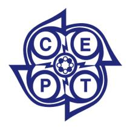

### Harmonised Amateur Radio Examination Certificate

**approved Chester 1990**; amended Vilnius 2004

Annex 2: latest updated February 2024)

Annex 4: latest updated February 2024

Annex 6: latest updated February 2018

# Recommendation T/R 61-02

#### **INTRODUCTION**

The Recommendation as approved in 1990 makes it possible for CEPT administrations to issue a Harmonised Amateur Radio Examination Certificate (HAREC). The HAREC document shows proof of successfully passing an amateur radio examination which complies with the Examination Syllabus for the HAREC. It facilitates the issuing of an individual licence to radio amateurs who stay in a country for a longer term than that mentioned in CEPT Recommendation T/R 61-01. It also facilitates the issuing of an individual licence to a radio amateur returning to his native country showing the HAREC certificate issued by a foreign Administration.

The Recommendation as revised in 1994 has the aim to make it possible for non-CEPT countries to participate in this system. This revision is comparable to the extension of Recommendation T/R 61-01 to non-CEPT countries.

The revision of 2001 lowered the requirements for sending and receiving Morse code signals from 12 words per minute to 5 words per minute.

The revision of 2003 removed the requirement for sending and receiving of Morse code signals.

#### **RECOMMENDATION T/R 61-02 OF 1990 ON HARMONISED AMATEUR RADIO EXAMINATION CERTIFICATE (T/R 61-02), LATEST EDITORIAL UPDATE OF ANNEX 2 ON 16 FEBRUARY 2024**

"The European Conference of Postal and Telecommunications Administrations,

#### *considering*

- a) that the Amateur Service is a service according to the ITU Radio Regulations article 1 and governed by the ITU Radio Regulations and national regulations;
- b) that administrations are responsible, in accordance with article 25 of the ITU Radio Regulations, to verify the operational and technical qualifications of any person wishing to operate an amateur station;
- c) that significant differences between the existing national regulations and licence conditions impede the radiocommunication activities by licensed radio amateurs outside their own country;
- d) that in an international context international organisations representing amateur service licensees support the concept of the harmonisation of examination levels concerning the amateur service;
- e) that CEPT Recommendation T/R 61-01 concerns only temporary use of amateur stations in CEPT and non-CEPT countries;
- f) that CEPT countries and non-CEPT countries are mutually seeking to harmonise regulations and matters also concerning non-commercial and recreational activities of their citizens;

#### *noting*

- a) that it is highly desirable to establish a common arrangement for radio amateurs who wish to use amateur stations in another country in which they are taking up residency;
- b) that a common approach can be found in spite of the great variety of classes of amateur licenses and examinations prevailing in the different CEPT countries and non-CEPT countries;
- c) that on the basis of this commonality it is possible to designate which national classes of amateur licences and examinations are of a similar nature;
- d) that in general good experience has been gained by the introduction of Recommendation T/R 61-01 although the classification of the various national licence classes into the CEPT licence causes some difficulties regarding the minimum examination standard;
- e) that despite the procedures of this Recommendation, administrations have the right to require separate bilateral agreements when recognising the radio amateur certificates issued by foreign administrations;

#### *recommends*

- 1. that CEPT administrations issue a mutually recognised Harmonised Amateur Radio Examination Certificate to those passing the relevant national examinations corresponding to the CEPT examination standard (see [Annex](#page-4-0) 1);
- 2. that administrations, not being members of CEPT, accepting the provisions of this Recommendation, may apply for participation in accordance with the conditions laid down in [Annex](#page-7-0) 3 and [Annex](#page-8-0) 4:;
- 3. that administrations participating in this system agree, subject to their national laws and regulations to issue national licences corresponding to the CEPT examination standard to foreign nationals who possess a Harmonised Amateur Radio Examination Certificate issued by an Administration participating in this system and who stay in their country for a period longer than three months;
- 4. that any person who has obtained a Harmonised Amateur Radio Examination Certificate in any country participating in this system, has the right on return to his own country to obtain a licence there without having to pass a further examination;

- 5. that administrations shall ensure that the information shown in [Annex](#page-5-0) 2 and [Annex](#page-8-0) 4 (licence classes equivalent to the CEPT examination level) is kept up-to-date when national legislation is amended."

#### *Note:*

*Please check the Office documentation database<https://docdb.cept.org/> for the up to date position on the implementation of this and other ECC Recommendations.*

#### **ANNEX 1: CONDITIONS FOR ISSUING OF THE HARMONISED AMATEUR RADIO EXAMINATION CERTIFICATE (HAREC)**

1.a A HAREC will be issued by CEPT administrations to persons who have passed a national examination for radio amateurs that meets the criteria set out in paragraph 2 below. (The national licences corresponding to such examinations are set out in [Annex](#page-5-0) 2. 1.b A HAREC will be issued by non-CEPT administrations to persons who have passed a national examination for radio amateurs that meets the criteria set out in paragraph 2 below. (The national licences corresponding to such examinations are set out [Annex 4.](#page-8-0) 1.c A HAREC will be issued, on request, by CEPT administrations to radio amateurs who have passed the relevant national examination prior to the introduction of the harmonised examination syllabus. 1.d A licence based on HAREC allows the use of all frequency bands allocated to the amateur service and amateur satellite service and authorised in the country where the amateur station is to be operated. 1.e National licences corresponding to HAREC and licences administrations will issue to holders of the HAREC from other countries are shown in [Annex 2](#page-5-0) and [Annex 4.](#page-8-0)

#### **2. Criteria for national examinations**

National examinations which qualify the examinee for a HAREC certificate shall cover the subjects that a radio amateur may encounter in conducting tests with an amateur station and with its operation. They must include at least *technical, operational and regulatory matters* (see the examination syllabus Annex 6).

#### **3. The HAREC document**

The Harmonised Amateur Radio Examination Certificate shall contain at least the following information in the language of the country of issue as well as in English, French and German:

- a) a statement to the effect that the holder has passed an examination, meeting the requirements described in this recommendation;
- b) the holder's name and date of birth;
- c) the date of issue;
- d) the issuing authority.

The necessary information can be included in the national certificate or in a special document as set out in [Annex](#page-9-0) 5.

### **ANNEX 2: NATIONAL LICENCE CLASSES EQUIVALENT TO THE CEPT EXAMINATION LEVEL**

Countries wishing to modify their entries should send a letter to that effect to the Chairman of the ECC with a copy to the Office.

**Table 1: CEPT countries**

| CEPT countries  | National licences corresponding to HAREC | Licences the Administration will issue to holders of a HAREC from other countries |
|-----------------|------------------------------------------|-----------------------------------------------------------------------------------|
| 1               | 2                                        | 3                                                                                 |
| Albania         | CEPT                                     | CEPT                                                                              |
| Austria         | 1 (old also 2)                           | 1                                                                                 |
| Belgium         | A                                        | A                                                                                 |
| Bulgaria        | Class 1                                  | Class 1                                                                           |
| Croatia         | A                                        | A                                                                                 |
| Cyprus          | Radioamateur Authorisation               | Radioamateur Authorisation                                                        |
| Czech Republic  | A                                        | A                                                                                 |
| Denmark         | A                                        | A                                                                                 |
| Faroe islands   | A                                        | A                                                                                 |
| Greenland       | A                                        | A                                                                                 |
| Estonia         | A, B                                     | A 1 , B                                                                           |
| Finland         | Y and T                                  | Y                                                                                 |
| France          | HAREC, class1 and class                  | 22 HAREC, class1 and class 2 2                                                    |
| Germany         | 1, 2 and A                               | A                                                                                 |
| Greece          | 1                                        | 1                                                                                 |
| Hungary         | CEPT; old RB, RC, UB, UC                 | CEPT                                                                              |
| Iceland         | G                                        | G                                                                                 |
| Ireland         | CEPT 1 & CEPT 2                          | CEPT 11 & CEPT 2                                                                  |
| Italy           | A                                        | A                                                                                 |
| Latvia          | A                                        | A                                                                                 |
| Lithuania       | A 3                                      | A                                                                                 |
| Luxembourg      | CEPT                                     | CEPT                                                                              |
| North Macedonia | A                                        | A                                                                                 |

1 Confirmation of Morse code ability (min 5 words per minute) is required.

2 In France from 23 April 2012 there is only one licence class "HAREC". Old licence class 1 and 2 holder keep the benefit of their class and their personal call sign.

3 Procedure for Granting the Right to Engage in Radio Amateur Activities and the Conditions of Radio Amateur Activities approved by Order No.1V-1070 of the Director of the Communications Regulatory Authority of 2 December 2005 (Official Gazette Valstybės Žinios, 2005, No. 144-5273).

#### **RECOMMENDATION T/R 61-02 – Page 7**

| CEPT countries  |                 | National licences corresponding to HAREC |                   | Licences the Administration will issue to holders of a HAREC from other countries |
|-----------------|-----------------|------------------------------------------|-------------------|-----------------------------------------------------------------------------------|
| 1               |                 | 2                                        |                   | 3                                                                                 |
| Malta           | A and B         |                                          | A and B           |                                                                                   |
| Moldova         | A and B         |                                          | A and B           |                                                                                   |
| Monaco          | Class 1         |                                          | Class 1           |                                                                                   |
| Montenegro      | A and N         |                                          | A and N           |                                                                                   |
| Netherlands     | F               |                                          | F                 |                                                                                   |
| Norway          | A               |                                          | A                 |                                                                                   |
| Poland          | 1               |                                          | 1                 |                                                                                   |
| Portugal        | 1, A 4 and B    |                                          | 1                 |                                                                                   |
| Romania         | I and II        |                                          | II                |                                                                                   |
| Serbia          | 1               |                                          | 1                 |                                                                                   |
| Slovak Republic | E (old A, B, C) |                                          | E                 |                                                                                   |
| Slovenia        | A (old 1, 2, 3) |                                          | A                 |                                                                                   |
| Spain           | CEPT            |                                          | CEPT              |                                                                                   |
| Sweden          | 1               |                                          | 1                 |                                                                                   |
| Switzerland     | 1, 2, CEPT      |                                          | CEPT              |                                                                                   |
| Türkiye         | B               |                                          | B                 |                                                                                   |
| Ukraine         | A (old 1, 2)    |                                          | A                 |                                                                                   |
| United Kingdom  | Full            |                                          | Full (Reciprocal) |                                                                                   |

4 Confirmation of Morse code ability (min 50 characters per minute) is required.

#### **ANNEX 3: PARTICIPATION OF NON-CEPT ADMINISTRATIONS IN THE CEPT RADIO AMATEUR CERTIFICATE ACCORDING TO THIS RECOMMENDATION**

#### **1. APPLICATION**

**1.1.** Administrations, not being members of CEPT, may apply for participation in the CEPT arrangements for Harmonised Amateur Radio Examination Certificates regulated by this Recommendation. Applications shall be sent to CEPT European Communications Office (ECO) in Copenhagen (address: Nyropsgade 37, DK-1602 Copenhagen, Denmark).

The information needed to support an application shall include: a list of certificate classes in the country concerned; their privileges and the equivalence to the CEPT examination level. Details of national examination syllabuses or documents describing the requirements of the national certificate classes and their privileges shall be enclosed with the application.

All the details mentioned above must be submitted in one of the official languages of the CEPT (English, French or German).

#### **2. PROCEDURES OF APPLICATIONS**

**2.1** The CEPT ECC shall check, based on this Recommendation, each application to determine the equivalence of the national licence classes to the HAREC level and to assess the acceptability of any deviations from this Recommendation. **2.2** When the ECC has agreed to accept the participation of a non-CEPT country it notifies the applying Administration and arranges for the ECO to include the relevant details in [Annex 4.](#page-8-0) **2.3** A CEPT administration requiring a separate bilateral agreement to apply this Recommendation with a non-CEPT Administration, shall indicate this in a footnote in Annex 2. **2.4** A non-CEPT administration requiring a separate bilateral agreement to apply this Recommendation with a CEPT administration, shall include this in a footnote in [Annex 4.](#page-8-0)

#### **ANNEX 4: TABLE OF EQUIVALENCE BETWEEN NATIONAL CLASSES OF NON-CEPT COUNTRIES AND THE HAREC**

**Table 2: Non-CEPT countries**

| Country      | National licences corresponding to HAREC   | Licences the Administration will issue to holders of a HAREC from other countries |
|--------------|--------------------------------------------|-----------------------------------------------------------------------------------|
| 1            | 2                                          | 3                                                                                 |
| Australia    | Advanced qualification                     | 5 for operation Radiocommunications (Amateur Stations)                            |
|              | under the                                  | Radiocommunications (Amateur Class Licence 2023                                   |
|              | Stations) Class Licence                    | 2023                                                                              |
| Curacao      | A, B, C                                    | C                                                                                 |
| Hong Kong    | Amateur Station Licence                    | Amateur Station Licence                                                           |
| Israel       | A, B                                       | B (General)                                                                       |
| Japan        | First class radio amateur operator licence | First class radio amateur operator licence                                        |
| New Zealand  | General amateur operator’s certificate     | General amateur operator’s certificate                                            |
| South Africa | 6 Restricted and Unrestricted licences     | Unrestricted licence                                                              |

5 An ACMA recognition certificate (Advanced), amateur operator's certificate of proficiency (advanced), amateur operator's certificate of proficiency or amateur operator's limited certificate of proficiency. The ACMA also issued a 'ACMA letter of confirmation—Advanced' to advanced licensees before the commencement of the *Radiocommunications (Amateur Stations) Class Licence* 2023*,* which

confirms the licensee holds an advanced level qualification. 6 The requirement for Morse code proficiency was substituted by a number of assessments in 2004. The Administration is in the process of amending the requirements that will reflect during 2010.

#### **ANNEX 5: HARMONISED AMATEUR RADIO EXAMINATION CERTIFICATE (HAREC) BASED ON CEPT RECOMMENDATION T/R 61-02**

#### **CERTIFICAT D'EXAMEN RADIOAMATEUR HARMONISE (HAREC) délivré sur la base de la Recommandation de la CEPT T/R 61-02**

#### **HARMONISIERTE AMATEURFUNK-PRÜFUNGSBESCHEINIGUNG (HAREC) nach CEPT Empfehlung T/R 61-02**

- 1. The issuing Administration or responsible issuing Authority

# \_\_\_\_\_\_\_\_\_\_\_\_\_\_\_\_\_\_\_\_\_\_\_\_\_\_\_\_\_\_\_\_\_\_\_\_\_\_\_\_\_\_\_\_\_\_\_\_\_\_\_\_\_\_\_\_\_\_\_\_\_\_\_\_\_\_\_\_\_\_\_\_\_\_\_\_\_\_\_\_\_\_\_\_

of the country \_\_\_\_\_\_\_\_\_\_\_\_\_\_\_\_\_\_\_\_\_\_\_\_\_\_\_\_\_\_\_\_\_\_\_\_\_\_\_\_\_\_\_\_\_\_\_\_\_\_\_\_\_\_\_\_\_\_\_\_\_\_\_\_\_\_\_\_\_\_\_\_ declares herewith that the holder of this certificate has successfully passed an amateur radio examination which fulfils the requirements laid down by the International Telecommunication Union (ITU). The passed examination corresponds to the examination described in CEPT Recommendation T/R 61-02 (HAREC).

#### 2. L'Administration ou l'Autorité compétente

# \_\_\_\_\_\_\_\_\_\_\_\_\_\_\_\_\_\_\_\_\_\_\_\_\_\_\_\_\_\_\_\_\_\_\_\_\_\_\_\_\_\_\_\_\_\_\_\_\_\_\_\_\_\_\_\_\_\_\_\_\_\_\_\_\_\_\_\_\_\_\_\_\_\_\_\_\_\_\_\_\_\_\_\_

du pays \_\_\_\_\_\_\_\_\_\_\_\_\_\_\_\_\_\_\_\_\_\_\_\_\_\_\_\_\_\_\_\_\_\_\_\_\_\_\_\_\_\_\_\_\_\_\_\_\_\_\_\_\_\_\_\_\_\_\_\_\_\_\_\_\_\_\_\_\_\_\_\_\_\_\_\_\_ certifie que le titulaire du présent certificat a réussi un examen de radioamateur conformément au règlement de l'Union internationale des télécommunications (UIT). L'épreuve en question correspond à l'examen décrit dans la Recommandation CEPT T/R 61-02 (HAREC).

- 3. Die ausstellende Verwaltung oder zuständige Behörde

## \_\_\_\_\_\_\_\_\_\_\_\_\_\_\_\_\_\_\_\_\_\_\_\_\_\_\_\_\_\_\_\_\_\_\_\_\_\_\_\_\_\_\_\_\_\_\_\_\_\_\_\_\_\_\_\_\_\_\_\_\_\_\_\_\_\_\_\_\_\_\_\_\_\_\_\_\_\_\_\_\_\_\_\_

des Landes \_\_\_\_\_\_\_\_\_\_\_\_\_\_\_\_\_\_\_\_\_\_\_\_\_\_\_\_\_\_\_\_\_\_\_\_\_\_\_\_\_\_\_\_\_\_\_\_\_\_\_\_\_\_\_\_\_\_\_\_\_\_\_\_\_\_\_\_\_\_\_\_\_\_ erklärt hiermit, dass der Inhaber dieser Bescheinigung eine Amateurfunkprüfung erfolgreich abgelegt hat, welche den Erfordernissen entspricht, wie sie von der Internationalen Fernmeldeunion (ITU) festgelegt sind. Die abgelegte Prüfung entspricht der in der CEPT-Empfehlung T/R 61-02 (HAREC) beschriebenen Prüfung.

- 4. Holders name Nom du titulaire Name des Inhabers

\_\_\_\_\_\_\_\_\_\_\_\_\_\_\_\_\_\_\_\_\_\_\_\_\_\_\_\_\_\_\_\_\_\_\_\_\_\_\_\_\_\_\_\_\_\_\_\_\_\_\_\_\_\_\_\_\_\_\_\_\_\_\_\_\_\_\_\_\_\_\_\_\_\_\_\_\_\_\_\_\_\_\_

Date of birth Date de naissance Geburtsdatum

\_\_\_\_\_\_\_\_\_\_\_\_\_\_\_\_\_\_\_\_\_\_\_\_\_\_\_\_\_\_\_\_\_\_\_\_\_\_\_\_\_\_\_\_\_\_\_\_\_\_\_\_\_\_\_\_\_\_\_\_\_\_\_\_\_\_\_\_\_\_\_\_\_\_\_\_\_\_\_\_\_\_\_\_

- 5. Officials requiring information about this certificate should address their enquiries to the issuing national Authority or the issuing Administration indicated below.

Les autorités officielles désirant des informations sur ce document devront adresser leurs demandes à l'Administration ou à l'Autorité nationale compétente mentionnée ci-dessous.

Behörden, die Auskünfte über diese Bescheinigung erhalten möchten, sollten ihre Anfragen an die genannte ausstellende nationale Behörde oder die ausstellende Verwaltung richten.

Address/Adresse/Anschrift

Telephone/Téléphone/Telefon:

\_\_\_\_\_\_\_\_\_\_\_\_\_\_\_\_\_\_\_\_\_\_\_\_\_\_\_\_\_\_\_\_\_\_\_\_\_\_\_\_\_\_\_\_\_\_\_\_\_\_\_\_\_\_\_\_\_\_\_\_\_\_\_\_\_\_\_\_\_\_\_\_\_\_\_\_\_\_\_\_\_\_\_\_\_\_ Telefax/Téléfax/Telefax:

\_\_\_\_\_\_\_\_\_\_\_\_\_\_\_\_\_\_\_\_\_\_\_\_\_\_\_\_\_\_\_\_\_\_\_\_\_\_\_\_\_\_\_\_\_\_\_\_\_\_\_\_\_\_\_\_\_\_\_\_\_\_\_\_\_\_\_\_\_\_\_\_\_\_\_\_\_\_\_\_\_\_\_\_\_\_

Signature/Signature/Unterschrift Official stamp/Cachet Officiel/Offizieller

Stempel

(Place and date of issue/Lieu et date d'émission/Ort und Ausstelldatum)

### **ANNEX 6: EXAMINATION SYLLABUS AND REQUIREMENTS FOR A HAREC**

#### **INTRODUCTION**

This syllabus has been produced for the guidance of the administrations so that they may prepare their national amateur radio examinations for the CEPT Harmonised Amateur Radio Examination Certificate (HAREC).

The purpose of the examination is to set a reasonable level of knowledge required for candidate radio amateurs wishing to obtain a license for operating amateur stations.

The scope of the examination is limited to subjects relevant to tests and experiments with, and operation of amateur stations conducted by radio amateurs. These include circuits and their diagrams; questions may relate to circuits using both integrated circuits and discreet components.

- a) Where quantities are referred to, candidates should know the units in which these quantities are expressed, as well as the generally used multiples and sub-multiples of these units.
- b) Candidates must be familiar with the compound of the symbols.
- c) Candidates must know the following mathematical concepts and operations: − adding, subtracting, multiplying and dividing − fractions − powers of ten, exponentials, logarithms − squaring − square roots − inverse values − interpretation of linear and non-linear graphs − binary number system
- d) Candidates must be familiar with the formulae used in this syllabus and be able to transpose them.

#### **EXAMINATION SYLLABUS FOR A HARMONISED AMATEUR RADIO EXAMINATION CERTIFICATE (HAREC)**

#### **a) TECHNICAL CONTENT**

#### **1. ELECTRICAL, ELECTRO-MAGNETIC AND RADIO THEORY**

1.1 Conductivity; 1.2 Sources of electricity; 1.3 Electric field; 1.4 Magnetic field; 1.5 Electromagnetic field; 1.6 Sinusoidal signals; 1.7 Non-sinusoidal signals, noise; 1.8 Modulated signals; 1.9 Power and energy; 1.10 Digital signal processing (DSP).

2.1 Resistor; 2.2 Capacitor; 2.3 Coil; 2.4 Transformers application and use; 2.5 Diode; 2.6 Transistor; 2.7 Miscellaneous.

#### **3**. **CIRCUITS**

3.1 Combination of components; 3.2 Filter; 3.3 Power supply; 3.4 Amplifier; 3.5 Detector; 3.6 Oscillator; 3.7 Phase Locked Loop [PLL]; 3.8 Discrete Time Signals and Systems (DSP-systems).

#### **4. RECEIVERS**

4.1 Types; 4.2 Block diagrams; 4.3 Operation and function of the following stages; 4.4 Receiver characteristics.

#### **5. TRANSMITTERS**

5.1 Types; 5.2 Block diagrams; 5.3 Operation and function of the following stages; 5.4 Transmitter characteristics.

#### **6**. **ANTENNAS AND TRANSMISSION LINES**

6.1 Antenna types; 6.2 Antenna characteristics; 6.3 Transmission lines.

#### **7. PROPAGATION**

#### **8**. **MEASUREMENTS**

8.1 Making measurements; 8.2 Measuring instruments.

#### **9**. **INTERFERENCE AND IMMUNITY**

9.1 Interference in electronic equipment; 9.2 Cause of interference in electronic equipment; 9.3 Measures against interference.

#### **10. SAFETY**

#### **b) NATIONAL AND INTERNATIONAL OPERATING RULES AND PROCEDURES**

- 1. Phonetic Alphabet;
- 2. Q-Code;

- 3. Operational Abbreviations;
- 4. International Distress Signs, Emergency traffic and natural disaster communication;
- 5. Call signs;
- 6. IARU band plans;
- 7. Social responsibility and operating procedures.

#### **c) NATIONAL AND INTERNATIONAL REGULATIONS RELEVANT TO THE AMATEUR SERVICE AND AMATEUR SATELLITE SERVICE**

- 1. ITU Radio Regulations;
- 2. CEPT Regulations;
- 3. National Laws, Regulations and Licence conditions.

#### **DETAILED EXAMINATION SYLLABUS**

#### **a) TECHNICAL CONTENT**

#### **CHAPTER 1**

#### **1. ELECTRICAL, ELECTRO-MAGNETIC AND RADIO THEORY**

#### **1.1 Conductivity**

- Conductor, semiconductor and insulator;
- Current, voltage and resistance;
- The units ampere, volt and ohm;
- Ohm's Law [*E* = *I* ⋅ *R*]
- Kirchhoff's Laws;
- Electric power [*P* = *E* ⋅ *I*]
- The unit watt;
- Electric energy [*W* = *P*⋅*t*]
- The capacity of a battery [ampere-hour].

#### **1.2 Sources of electricity**

- Voltage source, source voltage [EMF], short circuit current, internal resistance and terminal voltage;
- Series and parallel connection of voltage sources.

#### **1.3 Electric field**

- Electric field strength;
- The unit volt/meter;
- Shielding of electric fields.

#### **1.4 Magnetic field**

- Magnetic field surrounding live conductor;
- Shielding of magnetic fields.

#### **1.5 Electromagnetic field**

- Radio waves as electromagnetic waves;
- Propagation velocity and its relation with frequency and wavelength [*v* = *f* ⋅λ]
- Polarisation.

#### **1.6 Sinusoidal signals**

- The graphic representation in time;
- Instantaneous value, amplitude [Emax], effective [RMS] value and average value
- = 2 *U* max *Ueff*
- Period and duration of period;
- Frequency;
- The unit hertz;
- Phase difference.

#### **1.7 Non-sinusoidal signals**

- Audio signals;
- Square wave;
- The graphic representation in time;
- D.C. voltage component, fundamental wave and higher harmonics;
- Noise [*P kTB*] *N* = (receiver thermal noise, band noise, noise density, noise power in receiver bandwidth).

#### **1.8 Modulated signals**

- CW;
- Amplitude modulation;
- Phase modulation, frequency modulation and single-sideband modulation;
- Frequency deviation and modulation index
- ∆ = mod *f F m*
- Carrier, sidebands and bandwidth;
- Waveforms of CW, AM, SSB and FM signals (graphical presentation);
- Spectrum of CW, AM and SSB signals (graphical presentation);
- Digital modulations: FSK, 2-PSK, 4-PSK, QAM;
- Digital modulation: bit rate, symbol rate (Baud rate) and bandwidth;
- CRC and retransmissions (e.g. packet radio), forward error correction (e.g. Amtor FEC).

#### **1.9 Power and energy**

- The power of sinusoidal signals
- = ⋅ = = *eff* = *eff u U i I R u P i R*;*P* ; ; 2 2
- Power ratios corresponding to the following dB values: 0 dB, 3 dB, 6 dB, 10 dB and 20 dB [both positive and negative];
- The input/output power ratio in dB of series-connected amplifiers and/or attenuators;
- Matching [maximum power transfer];
- The relation between power input and output and efficiency
- = ⋅100% *in uit P P* η
- Peak Envelope Power [p.e.p.].

#### **1.10 Digital Signal Processing (DSP)**

- sampling and quantization;
- minimum sampling rate (Nyquist frequency);
- convolution (time domain / frequency domain, graphical presentation);
- anti-aliasing filtering, reconstruction filtering;
- ADC / DAC.

#### **2. COMPONENTS**

#### **2.1 Resistor**

- The unit ohm;
- Resistance;
- Current/voltage characteristic;
- Power dissipation.

#### **2.2 Capacitor**

- Capacitance;
- The unit farad;
- The relation between capacitance, dimensions and dielectric. (Qualitative treatment only);
- The reactance
- ⋅ = *f C Xc* 2π 1
- Phase relation between voltage and current.

#### **2.3 Coil**

- Self-inductance;
- The unit henry;
- The effect of number of turns, diameter, length and core material on inductance. (Qualitative treatment only);
- The reactance [*X f L*] *L* = 2π ⋅
- Phase relation between current and voltage;
- Q-factor.

#### **2.4 Transformers application and use**

- Ideal transformer [ ] *Pprim* = *P*sec
- The relation between turn ratio and:
  - voltage ratio = *prim nprim n u u*sec sec
  - current ratio = sec sec *n n i i prim prim*
  - impedance ratio. (Qualitative treatment only);
  - Transformers.

#### **2.5 Diode**

- Use and application of diodes:
  - Rectifier diode, zener diode, LED [light-emitting diode], voltage-variable and capacitor [varicap];
  - Reverse voltage and leakage current.

#### **2.6 Transistor**

- PNP- and NPN-transistor;
- Amplification factor;
- Field effect vs. bipolar transistor (voltage vs. current driven);
- The transistor in the:
  - common emitter [source] circuit;
  - common base [gate] circuit;
  - common collector [drain] circuit;
  - input and output impedances of the above circuits.

#### **2.7 Miscellaneous**

- Simple thermionic device [valve];
- Voltages and impedances in high power valve stages, impedance transformation;
- Simple integrated circuits (include opamps).

#### **CHAPTER 3**

#### **3**. **CIRCUITS**

#### **3.1 Combination of components**

- Series and parallel circuits of resistors, coils, capacitors, transformers and diodes;
- Current and voltage in these circuits;
- Behaviour of real (non-ideal) resistor, capacitor and inductors at high frequencies.

#### **3.2 Filter**

- Series-tuned and parallel-tuned circuit:
- Impedance;
- Frequency characteristic;
- Resonance frequency
- = *f LC f* 2π 1
- Quality factor of a tuned circuit
- = ⋅ = ⋅ = *B f Q Lf R Q R Lf Q p res s* ; 2 ; 2 π π
- Bandwidth;
- Band-pass filter;
- Low-pass, high-pass, band-pass and band-stop filters composed of passive elements;
- Frequency response;
- Pi filter and T filter;
- Quartz crystal;
- Effects due to real (=non-ideal) components;
- digital filters (see sections 1.10 and 3.8).

#### **3.3 Power supply**

- Circuits for half-wave and full-wave rectification and the Bridge rectifier;
- Smoothing circuits;
- Stabilisation circuits in low voltage supplies;
- Switching mode power supplies, isolation and EMC.

#### **3.4 Amplifier**

- Lf and hf amplifiers;
- Gain;
- Amplitude/frequency characteristic and bandwidth (broadband vs. tuned stages);
- Class A, A/B, B and C biasing;
- Harmonic and intermodulation distortion, overdriving amplifier stages.

#### **3.5 Detector**

- AM detectors (envelope detectors);
- Diode detector;
- Product detectors and beat oscillators;
- FM detectors.

#### **3.6 Oscillator**

- Feedback (intentional and unintentional oscillations);
- Factors affecting frequency and frequency stability conditions necessary for oscillation;
- LC oscillator;
- Crystal oscillator, overtone oscillator;
- Voltage controlled oscillator (VCO);
- Phase noise.

#### **3.7 Phase Locked Loop [PLL]**

- Control loop with phase comparator circuit;
- Frequency synthesis with a programmable divider in the feedback loop.

#### **3.8 Digital signal processing (DSP systems)**

- FIR and IIR filter topologies;
- Fourier Transformation (DFT; FFT, graphical presentation);
- Direct Digital Synthesis.

#### **CHAPTER 4**

#### **4. RECEIVERS**

#### **4.1 Types**

- Single and double superheterodyne receiver;
- Direct conversion receivers.

#### **4.2 Block diagrams**

- CW receiver [A1A];
- AM receiver [A3E]
- SSB receiver for suppressed carrier telephony [J3E];
- FM receiver [F3E].

#### **4.3 Operation and function of the following stages (Block diagram treatment only)**

- HF amplifier [with tuned or fixed band pass];
- Oscillator [fixed and variable];
- Mixer;
- Intermediate frequency amplifier;
- Limiter;
- Detector, including product detector;
- Audio amplifier;
- Automatic gain control;
- S meter;
- Squelch.

#### **4.4 Receiver characteristics (simple description treatment)**

- Adjacent-channel;
- Selectivity;
- Sensitivity, receiver noise, noise figure;
- Stability;
- Image frequency;
- Desensitization / Blocking;
- Intermodulation; cross modulation;
- Reciprocal mixing [phase noise].

#### **CHAPTER 5**

#### **5. TRANSMITTERS**

#### **5.1 Types**

- Transmitter with or without frequency translation.

#### **5.2 Block diagrams**

- CW transmitter [A1A];
- SSB transmitter with suppressed carrier telephony [J3E];
- FM transmitter with the audio signal modulating the VCO of the PLL [F3E].

#### **5.3 Operation and functions of the following stages (Block diagram treatment only)**

- Mixer;
- Oscillator;
- Buffer;
- Driver;
- Frequency multiplier; -- Power amplifier;
- Output matching;
- Output filter;
- Frequency modulator;
- SSB modulator;
- Phase modulator;
- Crystal filter.

#### **5.4 Transmitter characteristics (simple description)**

- Frequency stability;
- RF-bandwidth;
- Sidebands;
- Audio-frequency range;
- Non-linearity [harmonic and intermodulation distortion];
- Output impedance;
- Output power;
- Efficiency;
- Frequency deviation;
- Modulation index;
- CW key clicks and chirps;
- SSB overmodulation and splatter (agreed);
- Spurious RF radiations (agreed);
- Cabinet radiations;
- Phase noise.

#### **CHAPTER 6**

#### **6. ANTENNAS AND TRANSMISSION LINES**

#### **6.1 Antenna types**

- Centre fed half-wave antenna;
- End fed half-wave antenna;
- Folded dipole;
- Quarter-wave vertical antenna [ground plane];
- Antenna with parasitic elements [Yagi];
- Aperture antennas (Parabolic reflector, horn);
- Trap dipole.

#### **6.2 Antenna characteristics**

- Distribution of the current and voltage;
- Impedance at the feed point;
- Capacitive or inductive impedance of a non-resonant antenna;
- Polarisation;
- Antenna directivity, efficiency and gain;
- Capture area;
- Radiated power [ERP, EIRP];
- Front-to-back ratio;
- Horizontal and vertical radiation patterns.

#### **6.3 Transmission lines**

Parallel conductor line;

- Coaxial cable;
- Waveguide;
- Characteristic impedance [Z0];
- Velocity factor;
- Standing-wave ratio;
- Losses;
- Balun;
- Antenna tuning units (pi and T configurations only).

#### **CHAPTER 7**

### **7. PROPAGATION**

- Signal attenuation, signal to noise ratio;
- Line of sight propagation (free space propagation, inverse square law);
- Ionospheric layers;
- Critical frequency;
- Influence of the sun on the ionosphere;
- Maximum Usable Frequency;
- Ground wave and sky wave, angle of radiation and skip distance;
- Multipath in ionospheric propagation;
- Fading;
- Troposphere (Ducting, scattering);
- The influence of the height of antennas on the distance that can be covered [radio horizon];
- Temperature inversion;
- Sporadic E-reflection;
- Auroral scattering;
- Meteor scatter;
- Reflections from the moon;
- Atmospheric noise [distant thunderstorms];
- Galactic noise;
- Ground (thermal) noise.
- Propagation prediction basics (link budget):
  - dominant noise source, (band noise vs. receiver noise) ;
  - minimum signal to noise ratio;
  - minimum received signal power;
  - path loss;
  - antenna gains, transmission line losses;
  - minimum transmitter power.

#### **8. MEASUREMENTS**

#### **8.1 Making measurements**

- Measurement of:
  - DC and AC voltages and currents;
- Measuring errors:
  - Influence of frequency;
  - Influence of waveform;
  - Influence of internal resistance of meters.
- Resistance;
- DC and RF power [average power, Peak Envelope Power];
- Voltage standing-wave ratio;
- Waveform of the envelope of an RF signal;
- Frequency;
- Resonant frequency.

#### **8.2 Measuring instruments**

- Making measurements using:
  - Multi range meter (digital and analogue);
  - Rf-power meter;
  - Reflectometer bridge (SWR meter);
  - Signal generator;
  - Frequency counter;
  - Oscilloscope;
  - Spectrum Analyzer.

#### **CHAPTER 9**

#### **9. INTERFERENCE AND IMMUNITY**

#### **9.1 Interference in electronic equipment**

- Blocking
- Interference with the desired signal
- Intermodulation
- Detection in audio circuits

#### **9.2 Cause of interference in electronic equipment**

- Field strength of the transmitter
- Spurious radiation of the transmitter [parasitic radiation, harmonics]
- Undesired influence on the equipment:
  - via the antenna input [aerial voltage, input selectivity]
  - via other connected lines
  - by direct radiation

#### **9.3 Measures against interference**

- Measures to prevent and eliminate interference effects:
  - Filtering
  - Decoupling
  - Shielding

### **10. SAFETY**

- The human body
- Mains power supply
- High voltages
- Lightning

#### **b) NATIONAL AND INTERNATIONAL OPERATING RULES AND PROCEDURES**

### **CHAPTER 1**

### **1. PHONETIC ALPHABET**

| A = Alpha   | J = Juliett  | S = Sierra  |
|-------------|--------------|-------------|
| B = Bravo   | K = Kilo     | T = Tango   |
| C = Charlie | L = Lima     | U = Uniform |
| D = Delta   | M = Mike     | V = Victor  |
| E = Echo    | N = November | W = Whiskey |
| F = Foxtrot | O = Oscar    | X = X-ray   |
| G = Golf    | P = Papa     | Y = Yankee  |
| H = Hotel   | Q = Quebec   | Z = Zulu    |
| I = India   | R = Romeo    |             |

#### **CHAPTER 2**

### **2. Q-CODE**

| Code | Question                                        | Answer                                                 |
|------|-------------------------------------------------|--------------------------------------------------------|
| QRK  | What is the readability of my signals?          | The readability of your signals is ...                 |
| QRM  | Are you being interfered with?                  | I am being interfered with …                           |
| QRN  | Are you troubled by static?                     | I am troubled by static                                |
| QRO  | Shall I increase transmitter power?             | Increase transmitter power                             |
| QRP  | Shall I decrease transmitter power?             | Decrease transmitter power                             |
| QRT  | Shall I stop sending?                           | Stop sending                                           |
| QRZ  | Who is calling me?                              | You are being called by …                              |
| QRV  | Are you ready?                                  | I am ready                                             |
| QSB  | Are my signals fading?                          | Your signals are fading                                |
| QSL  | Can you acknowledge receipt?                    | I am acknowledging receipt                             |
| QSO  | Can you communicate with ... direct?            | I can communicate ... direct                           |
| QSY  | Shall I change to transmission on another       |                                                        |
| QRX  | When will you call again?                       | I will call you again at ... hours on ... kHz (or MHz) |
| QTH  | What is your position in latitude and longitude |                                                        |
|      |                                                 | My position is ... latitude, ... longitude (or         |

| BK  | Signal used to interrupt a transmission in progress |
|-----|-----------------------------------------------------|
| CQ  | General call to all stations                        |
| CW  | Continuous wave                                     |
| DE  | From, used to separate the call sign of the station |
| K   | Invitation to transmit                              |
| MSG | Message                                             |
| PSE | Please                                              |
| RST | Readability, signal-strength, tone-report           |
| R   | Received                                            |
| RX  | Receiver                                            |
| TX  | Transmitter                                         |
| UR  | Your                                                |

#### **CHAPTER 4**

#### **4. INTERNATIONAL DISTRESS SIGNS, EMERGENCY TRAFFIC AND NATURAL DISASTER COMMUNICATION**

Distress signs:

- radiotelegraph ...---... [SOS]
- radiotelephone "MAYDAY"
- International use of the amateur station in the event of national disasters;
- Frequency bands allocated to the amateur service and amateur satellite service.

#### **CHAPTER 5**

#### **5. CALL SIGNS**

- Identification of the amateur station;
- Use of the call signs;
- Composition of call signs;
- National prefixes.

#### **CHAPTER 6**

#### **6. IARU BAND PLANS**

- IARU band plans;
- Purposes.

#### **CHAPTER 7**

#### **7.1 SOCIAL RESPONSIBILITY OF RADIO AMATEUR OPERATION**

- The Radio Amateur Code of Conduct;
- Self-regulation and self-discipline in Amateur Radio.

#### **7.2 OPERATING PROCEDURES**

- Starting, carrying out and ending a contact;
- Correct use of call signs and abbreviations;
- Content of transmissions;
- Checking transmission quality.

#### **c) NATIONAL AND INTERNATIONAL REGULATIONS RELEVANT TO THE AMATEUR SERVICE AND AMATEUR SATELLITE SERVICE**

#### **CHAPTER 1**

#### **1. ITU RADIO REGULATIONS**

- Definition Amateur Service and Amateur Satellite Service;
- Definition Amateur station;
- Article 25 Radio Regulations;
- Status Amateur Service and Amateur Satellite Service;
- ITU Radio Regions.

#### **CHAPTER 2**

#### **2**. **CEPT REGULATIONS**

- Recommendation T/R 61-01;
- Temporary use of amateur stations in CEPT countries;
- Temporary use of amateur stations in NON-CEPT countries which participate in the T/R 61-01 system.

#### **CHAPTER 3**

#### **3. NATIONAL LAWS, REGULATIONS AND LICENCE CONDITIONS**

- National laws
- Regulations and licence conditions
- Demonstrate knowledge of maintaining a log:
  - log keeping;
  - purpose;
  - recorded data.