**Figure 12-200.** *Boeing 787 lithium-ion battery.*

the range of applications of such equipment into voltage and power ranges that would have been impractical a few years ago. Some such applications are power supplies for frequency sensitive military and commercial AC equipment, aircraft emergency AC systems, and conversion of wide frequency range power to precise frequency power. *[Figure 12-206]*

The use of static inverters in small aircraft also has increased rapidly in the last few years, and the technology has advanced to the point that static inverters are available for any requirement filled by rotary inverters. For example, 250 VA emergency AC supplies operated from aircraft batteries are in production, as are 2,500 VA main AC supplies operated from a varying frequency generator supply. This type of equipment has certain advantages for aircraft applications, particularly the absence of moving parts and the adaptability to conduction cooling.

Static inverters, referred to as solid-state inverters, are manufactured in a wide range of types and models that can be classified by the shape of the AC output waveform and the power output capabilities. One of the most commonly used static inverters produces a regulated sine wave output. A block diagram of a typical regulated sine wave static inverter is shown in *Figure 12-207*. This inverter converts a low DC voltage into higher AC voltage. The AC output voltage is held to a very small voltage tolerance, a typical variation of less than 1 percent with a full input load change. Output taps are normally provided to permit selection of various voltages; for example, taps may be provided for 105, 115, and 125 volt AC outputs. Frequency regulation is typically within a range of one cycle for a 0–100 percent load change. Variations of this type of static inverter are available, many of which provide a square wave output.

Since static inverters use solid-state components, they are

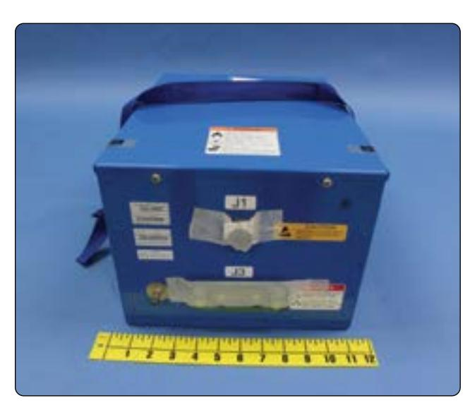

considerably smaller, more compact, and much lighter in weight than rotary inverters. Depending on the output power rating required, static inverters that are no larger than a typical airspeed indicator can be used in aircraft systems. Some of the features of static inverters are:

- 1. High efficiency
- 2. Low maintenance, long life
- 3. No warmup period required
- 4. Capable of starting under load
- 5. Extremely quiet operation
- 6. Fast response to load changes

Static inverters are commonly used to provide power for such frequency sensitive instruments as the attitude gyro and directional gyro. They also provide power for autosyn and magnesyn indicators and transmitters, rate gyros, radar, and other airborne applications. *Figure 12-208* is a schematic of a typical small jet aircraft auxiliary battery system. It shows the battery as input to the inverter and the output inverter circuits to various subsystems.

## **Semiconductors**

To understand why solid-state devices function as they do, it is necessary to examine the composition and nature of semiconductors. The two most common materials used for semiconductors are germanium and silicon. The essential characteristic of these elements is that each atom has four valence electrons to share with adjacent atoms in forming bonds. While both elements are used in semiconductor construction, silicon is preferred in most modern applications due to its ability to operate over a wider range of temperatures. The nature of a bond between two silicon atoms is such that each atom provides one electron to share with the other. The two electrons shared are in fact shared equally between the two atoms. This form of sharing is known as a covalent bond. Such bonds are very stable and hold the two atoms together very tightly requiring much energy to break this bond. *[Figure 12-209]* In this case, all of the outer electrons are used to make covalent bonds with other silicon atoms. In this condition, because all of the outer shell atoms are used, silicon takes on the characteristic of a good insulator, due to the fact that there are no open positions available for electrons to migrate through the orbits.

For the silicon crystal to conduct electricity, there must be some means available to allow some electrons to move from place to place within the crystal, regardless of the covalent bonds present between the atoms. One way to accomplish this is to introduce an impurity, such as arsenic or phosphorus, into the crystal structure, which either provides an extra electron or create a vacant position in the outer shell for electrons

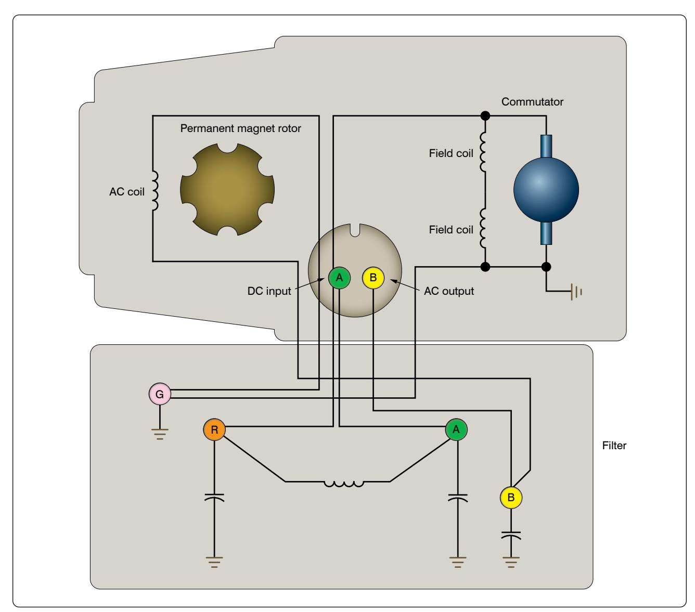

**Figure 12-201.** *Internal wiring diagram of single-phase permanent magnet rotary inverter.*

to pass though. The method used to create this condition is called doping.

### **Doping**

Doping is the process by which small amounts of additives called impurities are added to the semiconductor material to increase their current flow by adding a few electrons or a few holes. Once the material is doped, it then falls into one of two categories: the N-type semiconductor and the P-type semiconductor.

An N-type semiconductor material is one that is doped with an N-type or a donor impurity. Elements such as phosphorus, arsenic, and antimony are added as impurities and have five outer electrons to share with other atoms. This causes the semiconductor material to have an excess electron. Due to the surplus of electrons, the electrons are then considered the majority current carriers. This electron can easily be moved with only a small applied electrical voltage. Current flow in an N-type silicon material is similar to conduction in a copper wire. That is, with voltage applied across the material, electrons will move through the crystal towards the positive terminal just like current flows in a copper wire.

A P-type semiconductor is one that is doped with a P-type or an acceptor impurity. Elements such as boron, aluminum, and gallium have only three electrons in the valence shell to share with the silicon atom. Those three electrons form covalent bonds with adjacent silicon atoms. However, the expected fourth bond cannot be formed and a complete connection is impossible here, leaving a "hole" in the structure of the crystal. There is an empty place where an electron would naturally go, and often an electron moves into that space.

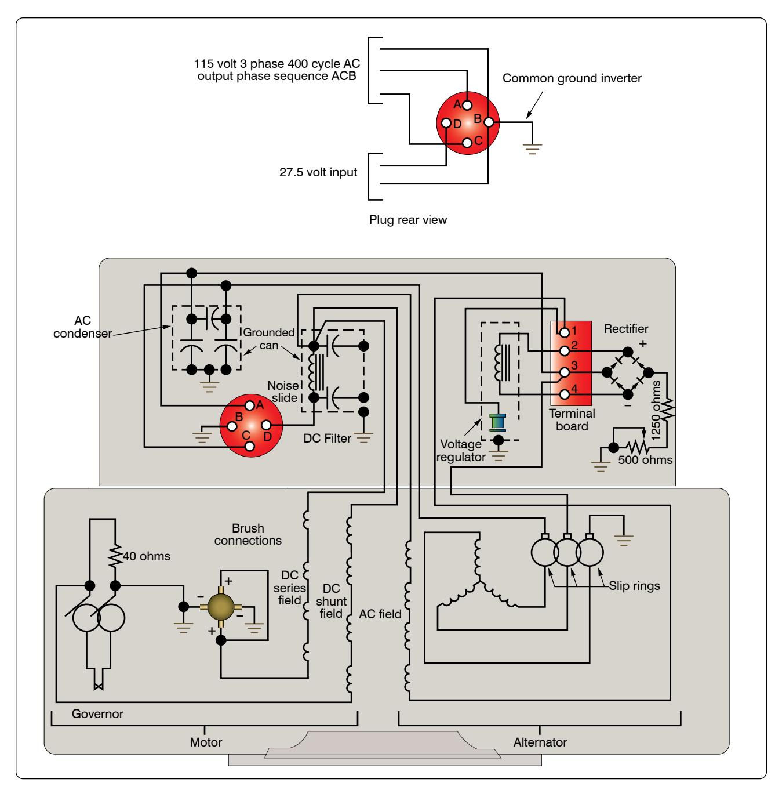

**Figure 12-202.** *Internal wiring diagram of three-phase, revolving armature.*

However, the electron filling the hole left a covalent bond behind to fill this empty space, which leaves another hole behind as it moves. Another electron may then move into that particular hole, leaving another hole behind. As this progression continues, holes appear to move as positive charges throughout the crystal. This type of semiconductor material is designated P-type silicon material. *Figure 12-210* shows the progression of a hole moving through a number of atoms. Notice that the hole illustrated at the far left of top depiction of *Figure 12-210* attracts the next valence electron into the vacancy, which then produces another

vacancy called a hole in the next position to the right. Once again, this vacancy attracts the next valence electron. This exchange of holes and electrons continues to progress and can be viewed in one of two ways. The first way that this flow can be seen as that of electron movement. The electron is shown in *Figure 12-210* as moving from the right to the left through a series of holes. Likewise, the second depiction in *Figure 12-210* of the motion of the vacated hole can be seen as migrating from the left to the right. This view is often called hole movement. The valence electron in the structure progresses along a path detailed by the arrows. Holes,

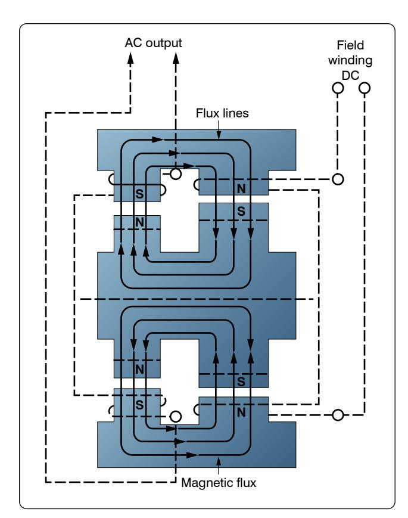

**Figure 12-203.** *Diagram of basic inductor-type inverter.*

however, move along a path opposite that of the electrons.

## **PN Junctions & the Basic Diode**

A single type of semiconductor material by itself is not very useful. Useful applications are developed only when a single component contains both P-type and N-type materials. The semiconductor diode is also known as a PN junction diode. This is a two-element semiconductor device that makes use of the rectifying properties of a PN junction to convert alternating current into direct current by permitting current flow in one direction only.

*Figure 12-211* illustrates the electrical characteristics of an unbiased diode, which means that no external voltage is applied. The P-side in the illustration is shown to have many holes, while the N-side shows many electrons. The electrons on the N-side tend to diffuse out in all directions. When an electron enters the P region, it becomes a minority carrier. By definition, a minority carrier is an electron or hole, whichever is the less dominant carrier in a semiconductor device. In P-type materials, electrons are the minority carrier and in N-type material, the hole is considered the minority carrier. With so many holes around the electron, the electron soon drops into a hole. When this occurs, the hole then disappears, and the conduction band electron becomes a valence electron.

Each time an electron crosses the PN junction, it creates a pair of ions. *Figure 12-211* shows this area outlined by dashed lines. The circled plus signs and the circled negative signs are the positive and negative ions, respectively. These ions are fixed in the crystal and do not move around like electrons or holes in the conduction band. Thus, the depletion zone constitutes a layer of a fixed charge. An electrostatic field, represented by a small battery in *Figure 12-211*, is established across the junction between the oppositely charged ions.

The junction barrier is an electrostatic field, which has been created by the joining of a section of N-type and P-type material. Because holes and electrons must overcome this field to cross the junction, the electrostatic field is usually called a barrier. Because there is a lack or depletion of free electrons and holes in the area around the barrier, this area is called the depletion region. *[Figure 12-211]* As the diffusion of electrons and holes across the junction continue, the strength of the electrostatic field increases until it is strong enough to prevent electrons or holes from crossing over. At this point, a state of equilibrium exists, and there is no further movement across the junction. The electrostatic field created at the junction by the ions in the depletion zone is called a barrier.

### **Forward Biased Diode**

*Figure 12-212* illustrates a forward biased PN junction. When an external voltage is applied to a PN junction, it is called bias. In a forward biased PN junction or diode, the negative voltage source is connected to the N-type material and the positive voltage source is connected to the P-type material. In this configuration, the current can easily flow. If a battery is used to bias the PN junction and it is connected in such a way that the applied voltage opposes the junction field, it has the effect of reducing the junction barrier and consequently aids in the current flow through the junction.

The electrons move toward the junction and the right end of the diode becomes slightly positive. This occurs because electrons at the right end of the diode move toward the junction and leave positively charged atoms behind. The positively charged atoms then pull electrons into the diode from the negative terminal of the battery.

When electrons on the N-type side approach the junction, they recombine with holes. Basically, electrons are flowing into the right end of the diode, while the bulk of the electrons in the N-type material move toward the junctions. The left edge of this moving front of electrons disappears by dropping into holes at the junction. In this way, there is a continuous current of electrons from the battery moving toward the junction.

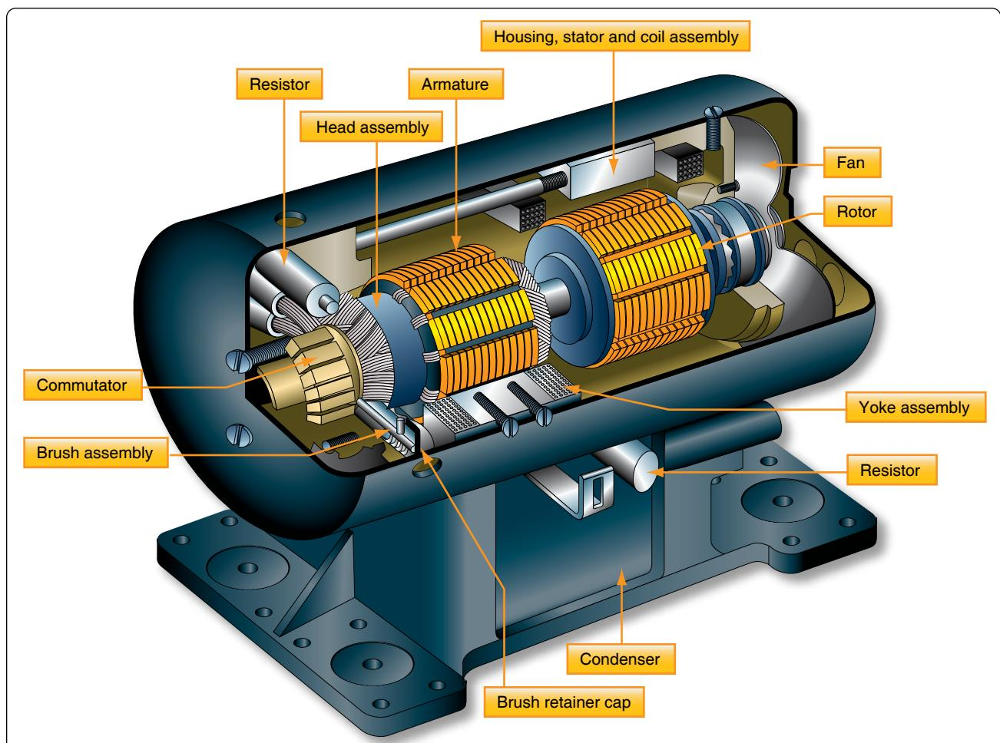

**Figure 12-204.** *Cutaway view of inductor-type rotary inverter.*

When the electrons hit the junction, they then become valence electrons. Once a valence electron, they can then move through the holes in the P-type material. When the valence electrons move through the P-type material from the right to the left, a similar movement is occurring with the holes by moving from the left side of the P-type material to the right. Once the valence electron reaches the end of the diode, it then flows back into the positive terminal of the battery.

#### In summary:

- 1. Electron leaves negative terminal of the battery and enters the right end (N-type material) of the diode.
- 2. Electron then travels through the N-type material.
- 3. The electron nears the junction and recombines and becomes a valence electron.
- 4. The electron now travels through the P-type material as a valence electron.
- 5. The electron then leaves the diode and flows back to the positive terminal of the battery.

### **Reverse Biased Diode**

When the battery is turned around as shown in *Figure 12-213*, then the diode is reverse biased and current does not flow. The most noticeable effect seen is the widened depletion zone.

The applied battery voltage is in the same direction as the depletion zone field. Because of this, holes and electrons tend to move away from the junction. Simply stated, the negative terminal attracts the holes away from the junction, and the positive terminal attracts the electrons away from the barrier. Therefore, the result is a wider depletion zone. This action increases the barrier width because there are more negative ions on the P-side of the junction and more positive ions on the N-side of the junction. This increase in the number of ions at the junction prevents current flow across the barrier by the majority carriers.

To summarize, the important thing to remember is that these PN junction diodes offer very little resistance to current when the diode is forward biased. Maximum resistance happens

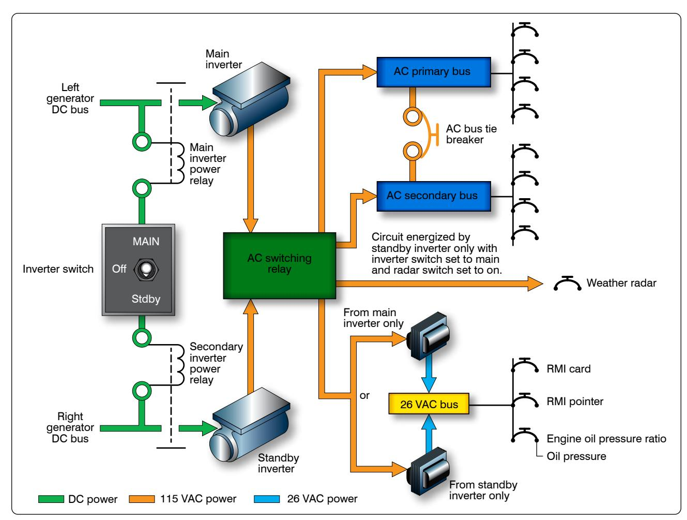

**Figure 12-205.** *A typical aircraft AC power distribution system using main and standby rotary inverters.*

**Figure 12-206.** *Static inverter.*

when the diode is reversed biased. *Figure 12-214* shows a graph of the current characteristics of a diode that is biased in both directions.

# **Rectifiers**

Many devices in an aircraft require high amperage, low voltage DC for operation. This power may be furnished by DC engine-driven generators, motor generator sets, vacuum tube rectifiers, or dry disk or solid-state rectifiers.

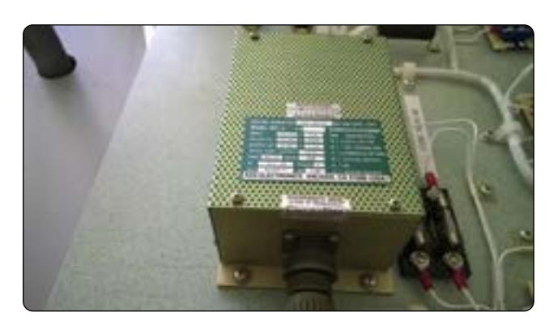

In aircraft with AC systems, a special DC generator is not desirable since it would be necessary for the engine accessory section to drive an additional piece of equipment. Motor generator sets, consisting of air-cooled AC motors that drive DC generators, eliminate this objection because they operate directly off the AC power system. Vacuum tube or various types of solid-state rectifiers provide a simple and efficient method of obtaining high voltage DC at low amperage. Dry disk and solid-state rectifiers, on the other hand, are an excellent source of high amperage at low voltage.

A rectifier is a device that transforms AC into DC by limiting or regulating the direction of current flow. The principal types of rectifiers are dry disk and solid state. Solid-state, or semiconductor, rectifiers have replaced virtually all other types; and, since dry disk and motor generators are largely limited to older model aircraft, the major part of the study of rectifiers is devoted to solid-state devices used for rectification. The two methods discussed in this handbook

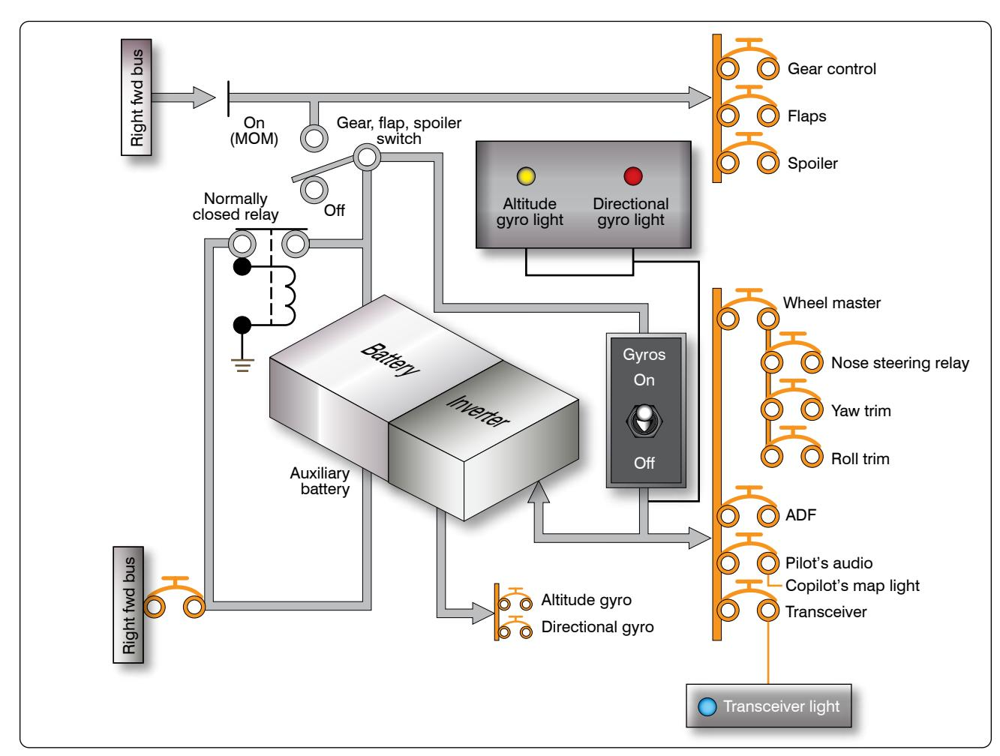

**Figure 12-208.** *Auxiliary battery system using static inverter.*

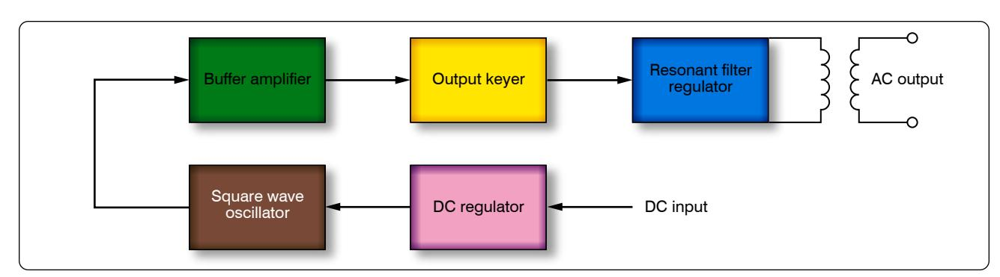

**Figure 12-207.** *Regulated sine wave static inverter.*

are the half-wave rectifier and the full-wave rectifier.

## **Half-Wave Rectifier**

*Figure 12-215* illustrates the basic concept of a half-wave rectifier. When an AC signal is on a positive swing as shown in *Figure 12-215A*, the polarities across the diode and the load resistor are also positive. In this case, the diode is forward biased and can be replaced with a short circuit as shown in the figure. The positive portion of the input signal appears across the load resistor with no loss in potential across the series diode.

*Figure 12-215B* now shows the input signal being reversed. Note that the polarities across the diode and the load resistor are also reversed. In this case, the diode is now reverse biased and can be replaced with an equivalent open circuit. The current in the circuit is now 0 amperes and the voltage drop over the load resistor is 0 volts. The resulting waveform for a complete

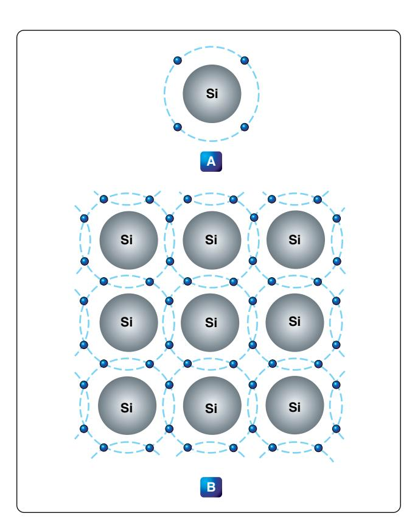

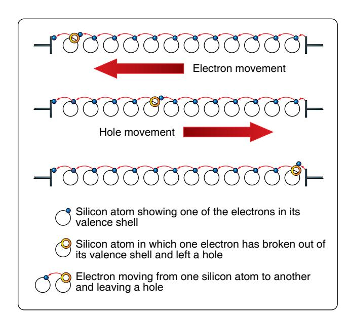

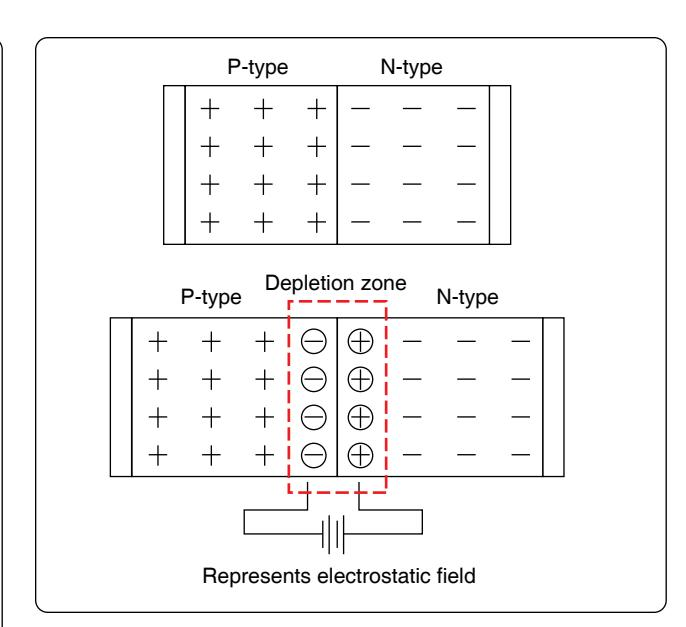

**Figure 12-209.** *Valence electrons.*

**Figure 12-210.** *A hole moving through atoms.*

**Figure 12-211.** *Depletion region.*

sinusoidal input can be seen at the far right of *Figure 12-215*. The output waveform is a reproduction of the input waveform minus the negative voltage swing of the wave. For this reason, this type of rectifier is called a half-wave rectifier.

## **Full-Wave Rectifier**

*Figure 12-216* illustrates a more common use of the diode as a rectifier. This type of a rectifier is called a full-wave bridge rectifier. The term "full-wave" indicates that the output is a continuous sequence of pulses rather than having gaps that appear in the half-wave rectifier.

*Figure 12-216C* shows the initial condition, during which, a positive portion of the input signal is applied to the network. Note the polarities across the diodes. Diodes D2 and D4 are reverse biased and can be replaced with an open circuit. Diodes D1 and D3 are forward biased and act as an open circuit. The current path through the diodes is clear to see, and the resulting waveform is developed across the load resistor.

During the negative portion of the applied signal, the diodes reverse their polarity and bias states. The result is a network shown in *Figure 12-216D*. Current now passes through diodes D4 and D2, which are forward biased, while diodes D1 and D3 are essentially open circuits due to being reverse biased. Note that during both alternations of the input waveform, the current passes through the load resistor in the same direction. This results in the negative swing of the waveform being flipped up to the positive side of the time line.

### **Dry Disk**

Dry disk rectifiers operate on the principle that electric current flows through a junction of two dissimilar conducting materials more readily in one direction than it does in the opposite direction. This is true because the resistance to current flow in one direction is low, while in the other direction it is high. Depending on the materials used, several amperes may flow in the direction of low resistance but only

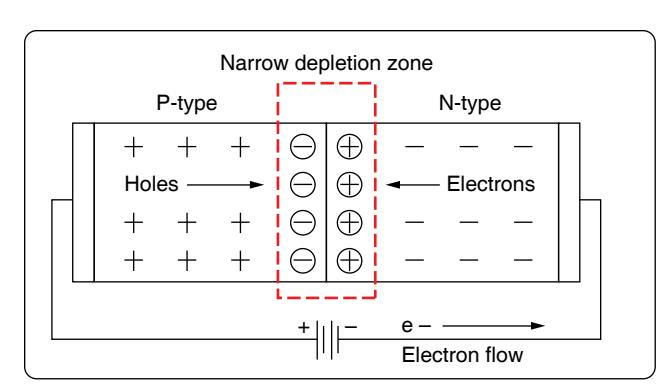

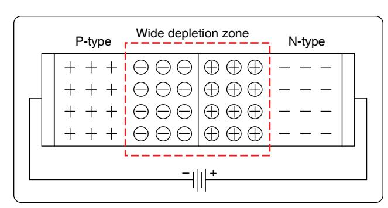

**Figure 12-212.** *Forward biased PN junction.*

**Figure 12-213.** *Reversed diode.*

a few milliamperes in the direction of high resistance.

Three types of dry disk rectifiers may be found in aircraft: the copper oxide rectifier, the selenium rectifier, and the magnesium copper-sulfide rectifier. The copper oxide rectifier consists of a copper disk upon which a layer of copper oxide has been formed by heating. *[Figure 12-217]* It may also consist of a chemical copper oxide preparation spread evenly over the copper surface. Metal plates, usually lead plates, are pressed against the two opposite faces of the disk to form a good contact. Current flow is from the copper to the copper oxide.

The selenium rectifier consists of an iron disk, similar to a washer, with one side coated with selenium. Its operation is similar to that of the copper oxide rectifier. Current flows from the selenium to the iron.

The magnesium copper sulfide rectifier is made of washershaped magnesium disks coated with a layer of copper sulfide. The disks are arranged similarly to the other types. Current flows from the magnesium to the copper sulfide.

## **Types of Diodes**

Today, there are many varieties of diodes that can be grouped into one of several basic categories.

### *Power Rectifier Diodes*

The rectifier diode is usually used in applications that require high current, such as power supplies. The range in which the diode can handle current can vary anywhere from one ampere to hundreds of amperes. One common example of diodes is the series of diodes, part numbers 1N4001 to 1N4007. The "1N" indicates that there is only one PN junction, or that the device is a diode. The average current carrying range for these rectifier diodes is about one ampere with a peak inverse voltage between 50 volts to 1,000 volts. Larger rectifier diodes can carry currents up to 300 amperes when forward biased and have a peak inverse voltage of 600 volts. A recognizable feature of the larger rectifier diodes is that they are encased in metal in order to provide a heat sink. *[Figure 12-218]* 

### *Zener Diodes*

Zener diodes (sometimes called "breakdown diodes") are designed so that they break down (allow current to pass) when the circuit potential is equal to or in excess of the desired reverse bias voltage. The range of reverse bias breakdown-voltages commonly found can range from 2 volts to 200 volts depending on design. Once a specific reverse bias voltage has been reached, the diode conducts and behaves like a constant voltage source. Within the normal operating range, the zener functions as a voltage regulator, waveform clipper, and other related functions. Below the desired voltage, the zener blocks the circuit like any other diode biased in the reverse direction. Because the zener diode allows free flow in one direction when it is used in an AC circuit, two diodes connected in opposite directions must be used. This takes care of both alternations of current. Power ratings of these devices range from about 250 milliwatts to 50 watts.

### *Special Purpose Diodes*

The unique characteristics of semiconductor material have allowed for the development of many specialized types of diodes. A short description of some of the more common diode types is given for general familiarization. *[Figure 12-219]*

### *Light-Emitting Diode (LED)*

In a forward biased diode, electrons cross the junction and fall into holes. As the electrons fall into the valence band, they radiate energy. In a rectifier diode, this energy is dissipated as heat. However, in the light-emitting diode (LED), the energy is dissipated as light. By using elements such as gallium, arsenic, and phosphorous, an LED can be designed to radiate colors, such as red, green, yellow, blue, and infrared light. LEDs that are designed for the visible light portion of the spectrum are useful for instruments, indicators, and even cabin lighting. The advantages of the LED over the incandescent lamps are longer life, lower voltage, faster on and off operations, and less heat.

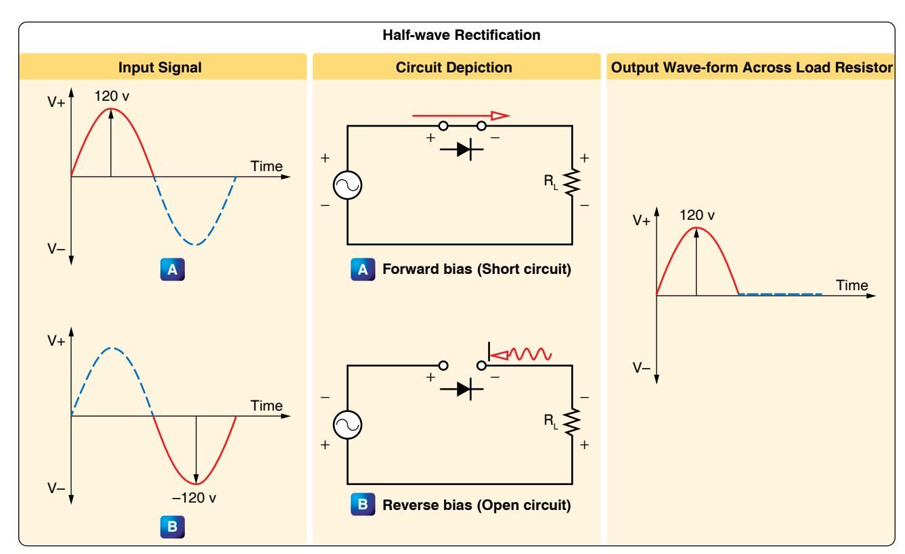

**Figure 12-215.** *Basic concept of half-wave rectifier.*

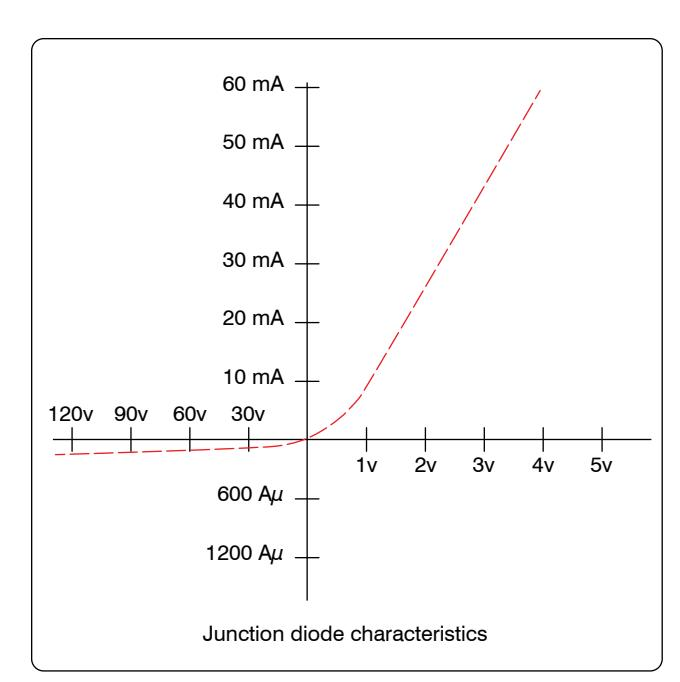

**Figure 12-214.** *Diode biased in both directions.*

## *Liquid Crystal Displays (LCD)*

The liquid crystal display (LCD) has an advantage over the LED in that it requires less power to operate. Where LEDs commonly operate in the milliwatt range, the LCD operates

in the microwatt range. The liquid crystal is encapsulated between two glass plates. When voltage is not applied to the LCD, the display is clear. However, when a voltage is applied, the result is a change in the orientation of the atoms of the crystals. The incident light is then reflected in a different direction. A frosted appearance results in the regions that have voltage applied and permits distinguishing of numeric values.

## *Photodiode*

Thermal energy produces minority carriers in a diode. The higher the temperature, the greater the current in a reverse current diode. Light energy can also produce minority carriers. By using a small window to expose the PN junction, a photodiode can be built. When light falls upon the junction of a reverse-biased photodiode, electrons-hole pairs are created inside the depletion layer. The stronger the light, the greater the number of light-produced carriers, which in turn causes a greater magnitude of reverse-current. Because of this characteristic, the photodiode can be used in light detecting circuits.

### *Varactors*

The varactor is simply a variable-capacitance diode. The reverse voltage applied controls the variable-capacitance of the diode. The transitional capacitance decreases as the reverse voltage is increasingly applied. In many

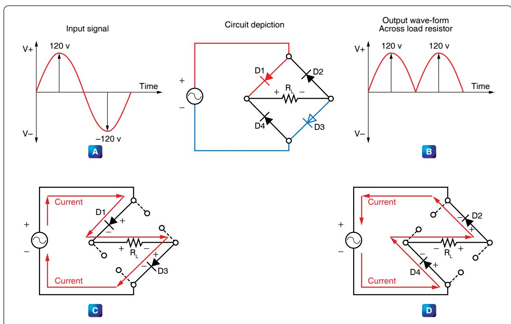

applications, the varactor has replaced the old mechanically tuned capacitors. Varactors can be placed in parallel with an inductor and provide a resonant tank circuit for a tuning circuit. By simply varying the reverse voltage across the varactor, the resonant frequency of the circuit can be adjusted.

#### *Schottky Diodes*

Schottky diodes are designed to have metal, such as gold, silver, or platinum, on one side of the junction and doped silicon, usually an N-type, on the other side of the junction. This type of a diode is considered a unipolar device because free electrons are the majority carrier on both sides of the junction. The Schottky diode has no depletion zone or charge storage, which means that the switching time can be as high as 300 MHz. This characteristic exceeds that of the bipolar diode.

### **Diode Identification**

*Figure 12-218* illustrates a number of methods employed for identifying diodes. Typically manufacturers place some form of an identifier on the diode to indicate which end is the anode and which end is the cathode. Dots, bands, colored bands, the letter 'k' or unusual shapes indicate the cathode end of the diode.

## **Introduction to Transistors**

The transistor is a three-terminal device primarily used to amplify signals and control current within a circuit. *[Figure 12-220]* The basic two-junction semiconductor must have one type of region sandwiched between two of the other type. The three regions in a transistor are the collector (C), which is moderately doped, the emitter (E), which is heavily doped, and the base (B), which is significantly less doped. The alternating layers of semiconductor material type provide the common commercial name for each type of transistor. The interface between the layers is called a junction. Selenium and germanium diodes previously discussed are examples of junction diodes. Note that the sandwiched layer or base is significantly thinner than the collector or the emitter. In general, this permits a "punching through" action for the carriers passing between the collector and emitter terminals.

#### **Classification**

The transistors are classified as either NPN or PNP according to the arrangement of their N and P-materials. The NPN transistor is formed by introducing a thin region of P-material between two regions of N-type material. The opposite is true for the PNP configuration.

The two basic types of transistors along with their circuit

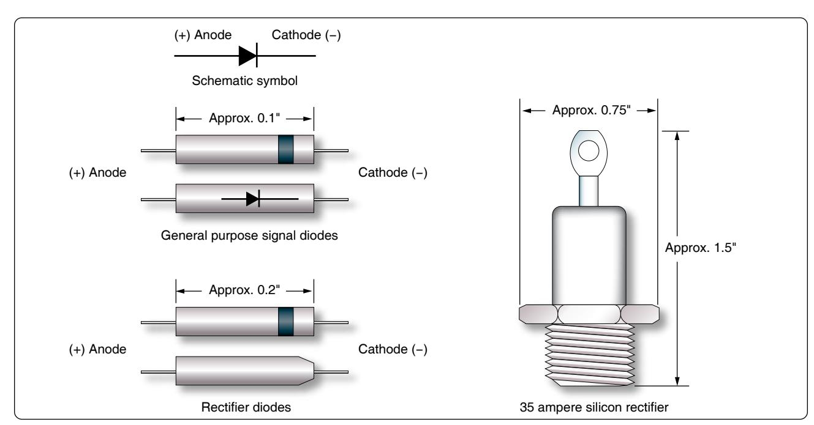

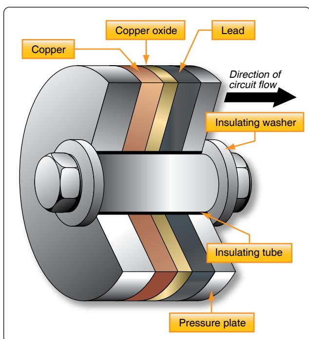

**Figure 12-217.** *Copper oxide dry disk rectifier.*

symbols are shown in *Figure 12-221*. Note that the two symbols are different. The horizontal line represents the base, and two angular lines represent the emitter and collector. The angular line with the arrow on it is the emitter, while the line without is the collector. The direction of the arrow on the emitter determines whether or not the transistor is a PNP or an NPN type. If the arrow is pointing in, the transistor is a PNP. On the other hand, if the arrow is pointing out, then it is an NPN type.

### **Transistor Theory**

As discussed in the section on diodes, the movement of the electrons and holes can be considered current. Electron current moves in one direction, while hole current travels in the opposite direction. In transistors, both electrons and holes act as carriers of current.

A forward biased PN junction is comparable to a lowresistance circuit element, because it passes a high current for a given voltage. On the other hand, a reverse-biased PN junction is comparable to a high-resistance circuit element. By using Ohm's Law formula for power (P = I2R) and assuming current is held constant through both junctions, it can be concluded that the power developed across the high resistance junction is greater than that developed across a low resistance junction. Therefore, if a crystal were to contain two PN junctions, one forward biased and the other reverse biased, and a low-power signal injected into the forward biased junction, a high-power signal could be produced at the reverse-biased junction.

To use the transistor as an amplifier, some sort of external bias voltage must modify each of the junctions. The first PN junction (emitter-base) is biased in the forward direction. This produces a low resistance. The second junction, which is the collector-base junction, is reverse biased to produce a high resistance. *[Figure 12-222]*

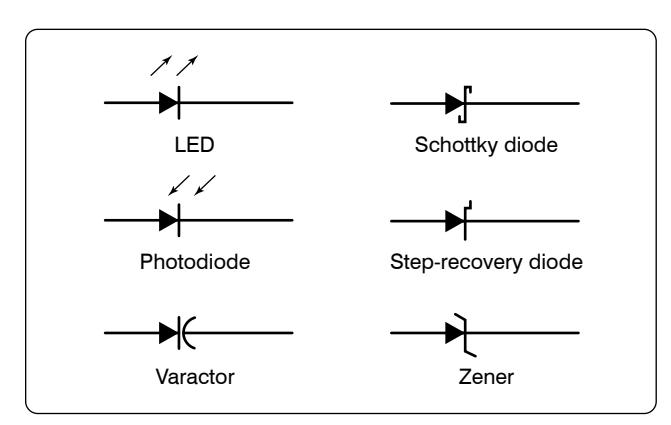

**Figure 12-219.** *Schematic symbols for special purpose diodes.*

With the emitter-base junction biased in the forward direction, electrons leave the negative terminal of the battery and enter the N-material. These electrons pass easily through the emitter, cross over the junction, and combine with the hole in the P-material in the base. For each electron that fills a hole in the P-material, another electron leaves the P-material, which creates a new hole and enters the positive terminal of the battery.

The second PN junction, which is the base-collector junction, is reverse biased. This prevents the majority carriers from crossing the junction, thus creating a high-resistance circuit. It is worth noting that there still is a small current passing through the reversed PN junction in the form of minority carriers—that is, electrons in the P-material and holes in the N-material. The minority carriers play a significant part in the operation of the NPN transistor.

*Figure 12-223* illustrates the basic interaction of the NPN junction. There are two batteries in the circuit used to bias the NPN transistor. Vbb is considered the base voltage supply, rated in this illustration at 1 volt, and the battery voltage Vcc, rated at 6 volts, is called the collector voltage supply.

Current within the external circuit is simply the movement of free electrons originating at the negative terminal of the battery and flowing to the N-material. *[Figure 12-223]* As the electrons enter the N-material, they become the majority carrier and move through the N-material to the emitter-base PN junction. This emitter-base junction is forward biased at about 0.65 to 0.7 volts positive with respect to the emitter and presents no resistance to the flow of electrons from the emitter into the base, which is composed of P-material. As these electrons move into the base, they drop into available holes. For every electron that drops into a hole, another electron exits the base by way of the base lead and becomes the base current or Ib. Of course, when one electron leaves the base, a new hole is formed. From the standpoint of the collector, these electrons that drop into holes are lost and of no use. To reduce this loss of electrons, the transistor is designed so that the base is very thin in relation to the emitter and collector, and the base is lightly doped.

Most of the electrons that move into the base fall under the influence of the reverse bias of the collector. While collectorbase junction is reverse biased with respect to the majority carriers, it behaves as if it is forward biased to the electrons or minority carriers in this case. The electrons are accelerated through the collector-base junction and into the collector. The collector is comprised of the N-type material; therefore, the electrons once again become the majority carrier. Moving easily through the collector, the electrons return to the positive terminal of the collector supply battery Vcc, which is shown in *Figure 12-223* as Ic.

Because of the way this device operates to transfer current (and its internal resistances) from the original conduction path to another, its name is a combination of the words "transfer" and "resistor"—transistor.

### **PNP Transistor Operation**

The PNP transistor generally works the same way as the NPN transistor. The primary difference is that the emitter, base, and collector materials are made of different material than the NPN. The majority and minority current carriers are the opposite in the PNP to that of the NPN. In the case of the PNP, the majority carriers are the holes instead of the electrons in the NPN transistor. To properly bias the PNP, the polarity of the bias network must be reversed.

### **Identification of Transistors**

*Figure 12-224* illustrates some of the more common transistor lead identifications. The methods of identifying leads vary due to a lack of a standard and require verification using manufacturer information to properly identify. However, a short description of the common methods is discussed below.

*Figure 12-224D* shows an oval-shaped transistor. The collector lead in this case is identified by the wide space between it and the lead for the base. The final lead at the far left is the emitter. In many cases, colored dots indicate the collector lead, and short leads relative to the other leads indicate the emitter. In a conventional power diode, as seen in *Figure 12-224E*, the collector lead is usually a part of the mounting bases, while the emitter and collector are leads or tines protruding from the mounting surface.

## **Field Effect Transistors**

Another transistor design that has become more important than the bipolar transistor is the field-effect transistor (FET). The primary difference between the bipolar transistor and the FET is that the bipolar transistor has two PN junctions and

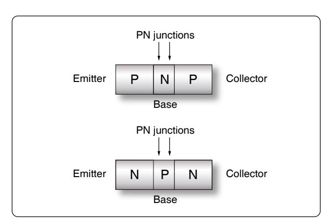

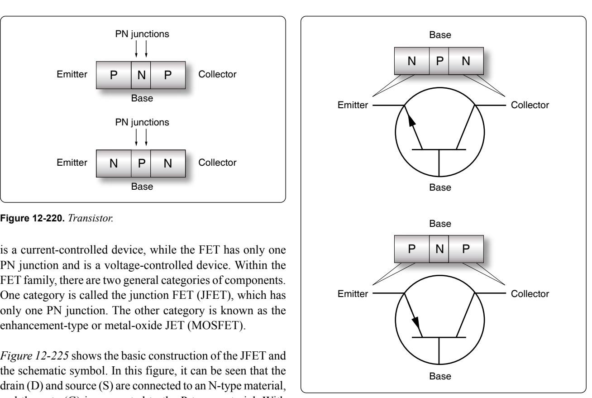

**Figure 12-221.** *Two basic transistors with circuit symbols.*

is a current-controlled device, while the FET has only one PN junction and is a voltage-controlled device. Within the FET family, there are two general categories of components. One category is called the junction FET (JFET), which has only one PN junction. The other category is known as the enhancement-type or metal-oxide JET (MOSFET).

*Figure 12-225* shows the basic construction of the JFET and the schematic symbol. In this figure, it can be seen that the drain (D) and source (S) are connected to an N-type material, and the gate (G) is connected to the P-type material. With gate voltage Vgg set to 0 volts and drain voltage Vdd set to some positive voltage, a current flows between the source and the drain, through a narrow band of N-material. If then, Vgg is adjusted to some negative voltage, the PN junction is reverse biased, and a depletion zone (no charge carriers) is established at the PN junction. By reducing the region of noncarriers, it has the effect of reducing the dimensions of the N-channel, resulting in a reduction of source to drain current.

Because JFETs are voltage-controlled devices, they have some advantages over the bipolar transistor. One such advantage is that because the gate is reverse biased, the circuit that it is connected to sees the gate as a very high resistance. This means that the JFET has less of an insertion influence in the circuit. The high resistance also means that less current is used.

Like many other solid-state devices, careless handling and static electricity can damage the JFET. Technicians should take all precautions to prevent such damage.

## **Metal-Oxide-Semiconductor FET (MOSFET)**

*Figure 12-226* illustrates the general construction and the schematic symbol of the MOSFET transistor. The biasing arrangement for the MOSFET is essentially the same as that for the JFET. The term "enhancement" comes from the idea that when there is no bias voltage applied to the gate (G), then there is no channel for current conduction between the

source (S) and the drain (D). By applying a greater voltage on the gate (G), the P-channel begins to materialize and grow in size. Once this occurs, the source (S) to drain (D) current Id increases. The schematic symbol reflects this characteristic by using a broken line to indicate that the channel does not exist without a gate bias.

### **Common Transistor Configurations**

A transistor may be connected in one of three different configurations: common-emitter (CE), common-base (CB), and common-collector (CC). The term "common" is used to indicate which element of the transistor is common to both the input and the output. Each configuration has its own characteristics, which makes each configuration suitable for particular applications. A way to determine what configuration you may find in a circuit is to first determine which of the three transistor elements is used for the input signal. Then, determine the element used for the output signal. At that point, the remaining element, (base, emitter, or collector) is the common element to both the input and output, and thus you determine the configuration.

### *Common-Emitter (CE) Configuration*

This is the configuration most commonly used in amplifier

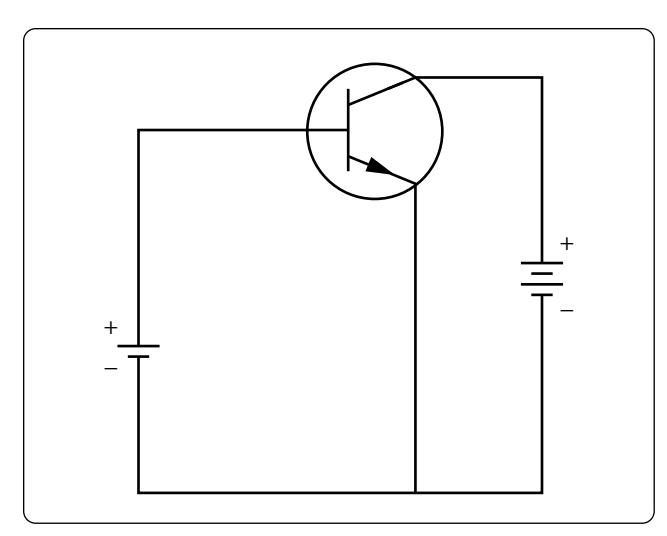

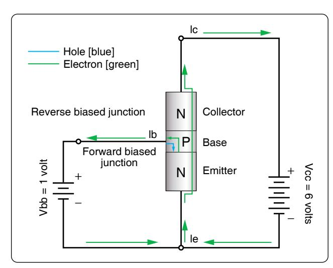

**Figure 12-222.** *NPN transistor.*

**Figure 12-223.** *NPN Junction.*

circuits because they provide good gains for voltage, current, and power. The input signal is applied to the base-emitter junction, which is forward biased (low resistance), and the output signal is taken off the collector-emitter junction, which is reverse biased (high resistance). Then the emitter is the common element to both input and output circuits. *[Figure 12-227]*

When the transistor is connected in a CE configuration, the input signal is injected between the base and emitter, which is a low-resistance, low-current circuit. As the input signal goes positive, it causes the base to go positive relative to the emitter. This causes a decrease in the forward bias, which in turn reduces the collector current IC and increases the collector voltage (EC being more negative). During the negative portion of the input signal, the voltage on the base is driven more negative relative to the emitter. This increases the forward bias and allows an increase in collector current IC and a decrease in collector voltage (EC being less negative and going positive). The collector current, which flows through the reverse-biased junction, also flows through a high-resistance load resulting in a high level of amplification.

Because the input signal to the CE goes positive when the output goes negative, the two signals are 180° out of phase. This is the only configuration that provides a phase reversal. The CE is the most popular of the three configurations because it has the best combination of current and voltage gain. Gain is a term used to indicate the magnitude of amplification. Each transistor configuration has its unique gain characteristics even though the same transistors are used.

#### *Common-Collector (CC) Configuration*

This transistor configuration is usually used for impedance matching. It is also used as a current driver due to its high current gain. It is also very useful in switching circuits since it has the ability to pass signals in either direction. *[Figure 12-227]*

In the CC circuit, the input signal is applied to the base, and the output signal is taken from the emitter, leaving the collector as the common point between the input and the output. The input resistance of the CC circuit is high, while the output resistance is low. The current gain is higher than that in the CE, but it has a lower power gain than either the CE or CB configuration. Just like the CB configuration, the output signal of the CC circuit is in phase with the input signal. The CC is typically referred to as an emitter-follower because the output developed on the emitter follows the input signal applied to the base.

### *Common-Base (CB) Configuration*

The primary use of this configuration is for impedance matching because it has low input impedance and high output resistance. Two factors, however, limit the usefulness of this circuit application. First is the low-input resistance and second is its lack of current, which is always below 1. Since the CB configuration gives voltage amplification, there are some applications for this circuit, such as microphone amplifiers. *[Figure 12-227]*

In the CB circuit, the input signal is applied to the emitter and the output signal is taken from the collector. In this case, both the input and the output have the base as a common element. When an input signal is applied to the emitter, it causes the emitter-base junction to react in the same manner as that in the CE circuit. When an input adds to the bias, it increases the transistor current; conversely, when the signal opposes the bias, the current in the transistor decreases.

The signal adds to the forward bias, since it is applied to the emitter, causing the collector current to increase. This increase in IC results in a greater voltage drop across the

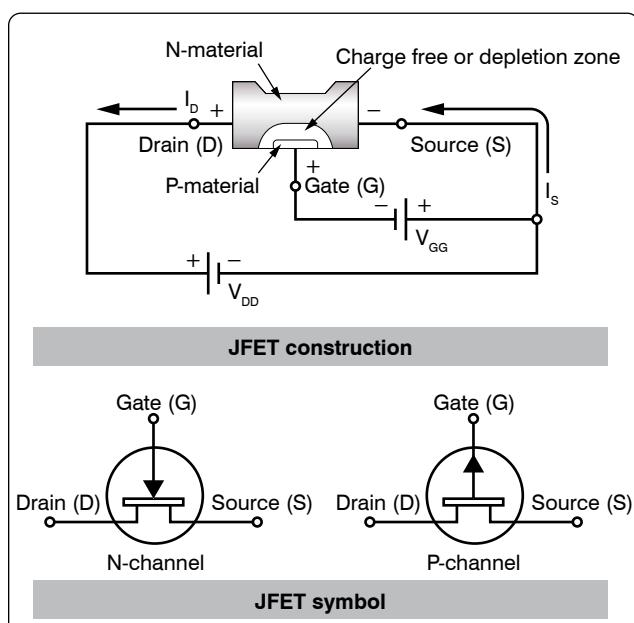

**Figure 12-225.** *JFET and the schematic symbol.*

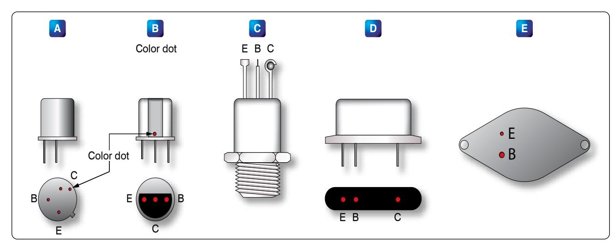

**Figure 12-224.** *Common transistor lead identifications.*

load resistor RL, thus lowering the collector voltage EC. The collector voltage, in becoming less negative, swings in a positive direction and is therefore in phase with the incoming positive signal.

## **Vacuum Tubes**

The use of vacuum tubes in aircraft electrical and electronic systems has rapidly declined due to the many advantages of using transistors. However, some systems still employ vacuum tubes in special applications, and possibly some older model aircraft still in service are equipped with devices that use vacuum tubes. While these components may still be in service, their infrequent occurrence does not warrant a detailed discussion.

Originally, vacuum tubes were developed for radio work. They are used in radio transmitters as amplifiers for controlling voltage and current, as oscillators for generating audio and radio frequency signals, and as rectifiers for converting AC into DC. While there are many types of vacuum tubes for a variety of applications, the most common types fall into one of the following families: (1) diode, (2) triode, (3) tetrode, and (4) pentode. Each of these vacuum tube types operates on the following fundamental principles.

When a piece of metal is heated, the speed of the electrons in the metal is increased. If the metal is heated to a high enough temperature, the electrons are accelerated to the point where some of them actually leave the surface of the metal. In a vacuum tube, electrons are supplied by a piece of metal called a cathode, which is heated by an electric current. Within limits, the hotter the cathode, the greater the number of electrons it gives off or emits.

is usually coated with special chemical compounds. If an external field does not draw the emitted electrons away, they form about the cathode into a negatively-charged cloud called the space charge. The accumulation of negative electrons near the emitter repels others coming from the emitter. The emitter, if insulated, becomes positive because of the loss of electrons. This establishes an electrostatic field between the cloud of negative electrons and the now positive cathode. A balance is reached when only enough electrons flow from the cathode to the area surrounding it to supply the loss caused by diffusion of the space charge.

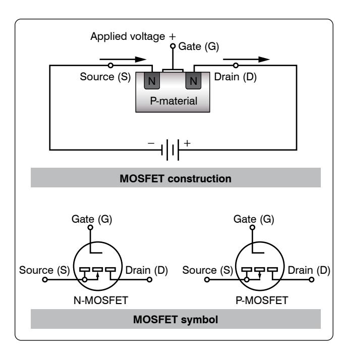

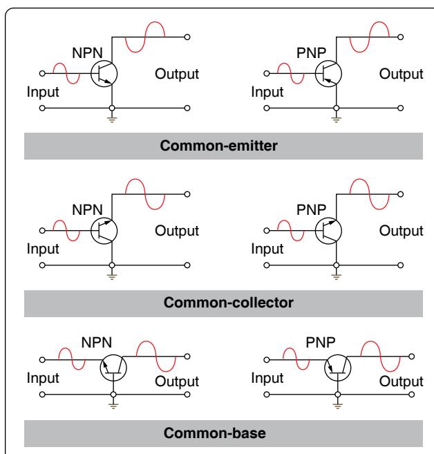

**Figure 12-226.** *General construction and schematic symbol of MOSFET transistor.*

**Figure 12-227.** *Transistor configurations (common-emitter, common-collector, common-base).*

# **Filtering**

One of the more common uses of the capacitor and inductor that the technician may find in the field is that of the filter.

### **Filtering Characteristics of Capacitors**

The nature of capacitance opposes a voltage change across its terminal by storing energy in its electrostatic field. Whenever the voltage tends to rise, the capacitor converts this voltage change to stored energy. When the voltage tends to fall, the capacitor converts this stored energy back to voltage. The use of a capacitor for filtering the output of a rectifier is illustrated in *Figure 12-228*. The rectifier is shown as a block, and the capacitor C1 is connected in parallel with the load R1.

The capacitor C1 is chosen to offer very low impedance to the AC ripple frequency and very high impedance to the DC component. The ripple voltage is therefore bypassed to ground through the low impedance path of the capacitor, while the DC voltage is applied unchanged to the load. The effect of the capacitor on the output of the rectifier can be seen in the waveshapes shown in *Figure 12-229*. Dotted lines show the rectifier output, while the solid lines show the effect of the capacitor. In this example, full-wave rectifier outputs are shown. The capacitor C1 charges when the rectifier voltage output tends to increase and discharges when the voltage output tends to decrease. In this manner, the voltage across the load R1 is kept fairly constant.

### **Filtering Characteristics of Inductors**

The inductance provided by an inductor may be used as a filter, because it opposes a change in current through it by storing energy in its electromagnetic field. Whenever the current increases, the stored energy in the electromagnetic field increases. When the current through the inductor decreases, the inductor supplies the energy back into the circuit in order to maintain the existing flow of current. The use of an inductor for filtering the output of a rectifier is shown in *Figure 12-230.* Note that in this network the inductor L1 is in series with the load R1.

The inductance L1 is selected to offer high impedance to the AC ripple voltage and low impedance to the DC component. The result is a very large voltage drop across the inductor and a very small voltage drop across the load R1. For the DC component, however, a very small voltage drop occurs across the inductor and a very large voltage drop across the load. The effect of an inductor on the output of a full-wave rectifier in the output waveshape is shown in *Figure 12-231*.

### **Common Filter Configurations**

Capacitors and inductors are combined in various ways to provide more satisfactory filtering than can be obtained with a single capacitor or inductor. These are referred to collectively as LC filters. Several combinations are shown schematically in *Figure 12-232*. Note that the L, or inverted L-type, and the T-type filter sections resemble schematically the corresponding letters of the alphabet. The pi-type filter section resembles the Greek letter pi (π) schematically.

All the filter sections shown are similar in that the inductances are in series and the capacitances are in parallel with the load. The inductances must, therefore, offer very high impedance and the capacitors very low impedance to the ripple frequency. Since the ripple frequency is comparatively low, the inductances are iron core coils having large values of inductance (several henries). Because they offer such high impedance to the ripple frequency, these coils are called chokes. The capacitors must also be large (several microfarads) to offer very little opposition to the ripple frequency. Because the voltage across the capacitor is DC, electrolytic capacitors are frequently used as filter capacitors. Always observe the correct polarity in connecting electrolytic capacitors.

LC filters are also classified according to the position of the capacitor and inductor. A capacitor input filter is one in which the capacitor is connected directly across the output terminals of the rectifier. A choke input filter is one in which a choke precedes the filter capacitor.

If it is necessary to increase the applied voltage to more than a single rectifier can tolerate, the usual solution is to stack them. These rectifiers are similar to resistors added in series. Each resistor drops a portion of the applied voltage rather than the total voltage. The same theory applies to rectifiers added in series or stacked. Series stacking increases the voltage rating. If, for example, a rectifier is destroyed with an applied voltage exceeding 50 volts, and it is to be used in a circuit with an applied voltage of 150 volts, stacking of diodes can be employed. The result is shown in *Figure 12-233*.

### **Basic LC Filters**

Analog filters are circuits that perform signal processing functions, specifically intended to remove unwanted signal components, such as ripple, and enhance desired signals. The simplest analog filters are based on combinations of inductors and capacitors. The four basic categories of filters discussed are: low-pass, high-pass, band-pass and band-stop. All these types are collectively known as passive filters, because they do not depend on any external power source.

The operation of a filter relies on the characteristic of variable inductive and capacitive reactance based on the applied frequency. In review, the inductor blocks high-frequency signals (high reactance) and conducts low-frequency signals (low reactance), while capacitors do the reverse. A filter in which the signal passes through an inductor, or in which a capacitor provides a path to earth, presents less attenuation (reduction) to a low-frequency signal than to a high-frequency signal and is considered a low-pass filter. If the signal passes through a capacitor, or has a path to ground through an inductor, then the filter presents less attenuation to high-frequency signals than low-frequency signals and is then considered a high-pass filter. Typically after an AC signal is rectified, the pulses of voltage are changed to usable form of DC by way of filtering.

### *Low-Pass Filter*

A low-pass filter is a filter that passes low frequencies well, but attenuates (reduces) higher frequencies. The so-called cutoff frequency divides the range of frequencies that are passed and the range of frequencies that are stopped. In other words, the frequency components higher than the cutoff frequency are stopped by a low-pass filter. The actual amount of attenuation for each frequency varies by filter design.

An inductive low-pass filter inserts an inductor in series with the load, where a capacitive low-pass filter inserts a resistor in series and a capacitor in parallel with the load. The former filter design tries to block the unwanted frequency signal while the latter tries to short it out. *Figure 12-234* illustrates this type of circuit and the frequency/current flow response.

## *High-Pass Filter (HPF)*

A high-pass filter (HPF) is a filter that passes high frequencies well, but attenuates (reduces) frequencies lower than the cutoff frequency. The actual amount of attenuation for each frequency varies once again depending on filter design. In some cases, it is called a low-cut filter. A HPF is essentially the opposite of a low-pass filter.

It is useful as a filter to block any unwanted low frequency components of a signal while passing the desired higher frequencies. *Figure 12-235* illustrates this type of circuit and the frequency/current flow response.

## *Band-Pass Filter*

A band-pass filter is basically a combination of a highpass and a low-pass. There are some applications where a particular range of frequencies need to be singled out or filtered from a wider range of frequencies. Band-pass filter circuits are designed to accomplish this task by combining the properties of low-pass and high-pass into a single filter. *Figure 12-236* illustrates this type of circuit and the frequency/current flow response.

# *Band-Stop Filter*

In signal processing, a band-stop filter or band-rejection filter is a filter that passes most frequencies unaltered, but attenuates those in a range to very low levels. It is the opposite of a bandpass filter. A notch filter is a band-stop filter with a narrow stopband (high Q factor). Notch filters are used in live sound reproduction (public address (PA) systems) and in instrument

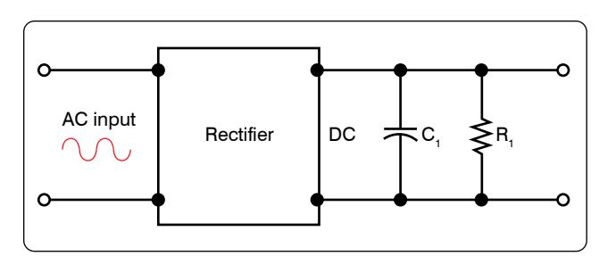

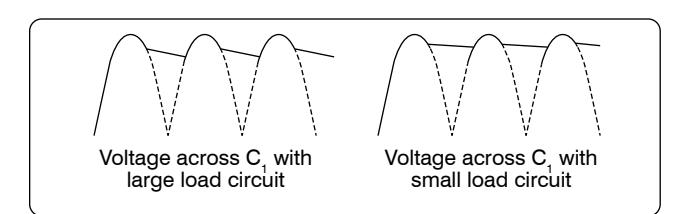

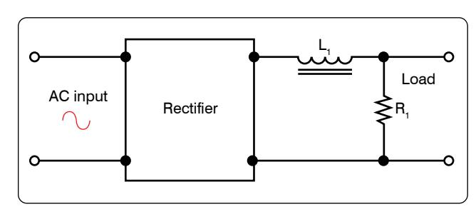

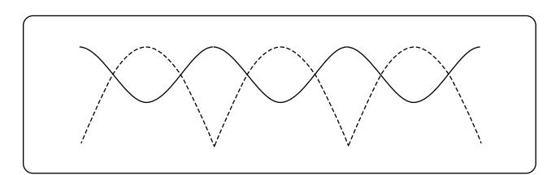

**Figure 12-228.** *A capacitor used as a filter.*

**Figure 12-229.** *Half-wave and full-wave rectifier outputs using capacitor filter.*

amplifier (especially amplifiers or preamplifiers for acoustic instruments, such as acoustic guitar, mandolin, bass instrument amplifier, etc.) to reduce or prevent feedback, while having little noticeable effect on the rest of the frequency spectrum. Other names include "band limit filter," "T-notch filter," "bandelimination filter," and "band-rejection filter."

Typically, the width of the stop-band is less than 1 to 2 decades (that is, the highest frequency attenuated is less than 10 to 100 times the lowest frequency attenuated). In the audio band, a notch filter uses high and low frequencies that may be only semitones apart.

A band-stop filter is the general case. A notch filter is a specific type of band-stop filter with a very narrow range. Also called band-elimination, band-reject, or notch filters, this kind of filter passes all frequencies above and below a particular range set by the component values. Not surprisingly, it can be made out of a low-pass and a high-pass filter, just like the band-pass design, except that this time we connect the two filter sections in parallel with each other instead of in series. *Figure 12-237* illustrates this type of circuit and the

## **Amplifier Circuits**

An amplifier is a device that enables an input signal to control an output signal. The output signal has some or all of the characteristics of the input signal but generally is a greater magnitude than the input signal in terms of voltage, current, or power. Gain is the basic function of all amplifiers. Because of this gain, we can expect the output signal to be greater than the input signal. For example, if we have an input signal of 1 volt and an output signal of 10 volts, then the gain factor can be determined by:

Gain = Signal out /signal in

Gain = 10 V/1 V = 10

Voltage gain is usually used to describe the operation of a small gain amplifier. In this type of an amplifier, the output signal voltage is larger than the input signal voltage. Power gain, on the other hand, is usually used to describe the operation of large signal amplifiers. In the case of power gain amplifiers, the gain is not based on voltage but on watts. A power amplifier is an amplifier in which the output signal power is greater than the input signal power. Most power amplifiers are used as the final stage of amplification and drive the output device. The output device could be a flight deck or cabin speaker, an indicator, or antenna. Whatever the device, the power to make it work comes from the final stage of amplification. Drivers for autopilot servos are sometimes contained in line replaceable units (LRUs) called autopilot amplifiers. These units take the low signal commands from the flight guidance system and amplify the signals to a level usable for driving the servo motors.

### **Classification**

The classification of a transistor amplifier circuit is determined by the percentage of the time that the current flows through the output circuit in relation to the input signal. There are four classifications of operation: A, AB, B, and C. Each class of operation has a certain use and characteristic. No individual class of amplifiers is considered the best. The best use of an amplifier is a matter of proper selection for the particular operation desired.

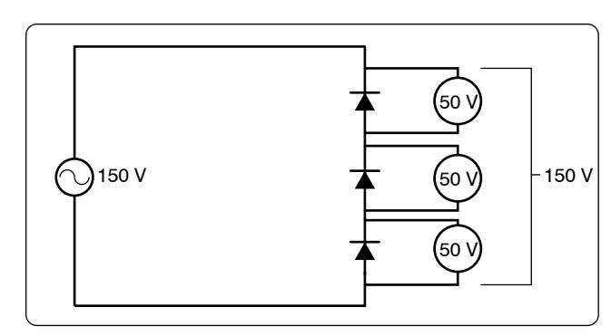

**Figure 12-233.** *Stacking diodes in a circuit.*

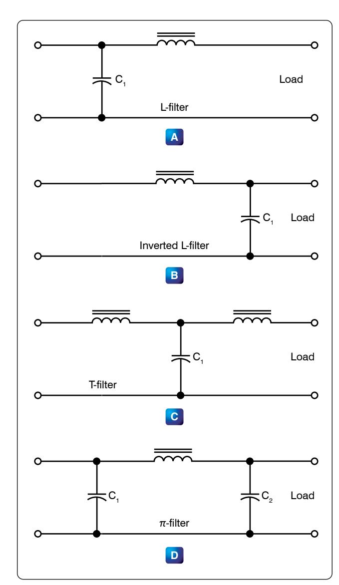

**Figure 12-232.** *LC filters.*

#### *Class A*

In the Class A operation, the current in the transistor flows for 100 percent or 360° of the input signal. *[Figure 12-238]* Class A operation is the least efficient class of operation but provides the best fidelity. Fidelity simply means that the output signal is a good reproduction of the input signal in all respects other than the amplitude, which is amplified. In some cases, there may be some phase shifting between the input signal and the output signal. Typically, the phase difference is 180°. If the output signal is not a good reproduction of the input signal, then the signal is said to be distorted. Distortion is any undesired change to the signal from the input to the output.

The efficiency of an amplifier refers to the amount of power

delivered to the output compared to the power supplied to the circuit. Every device in the circuit consumes power in order to operate. If the amplifier operates for 360° of input signal, then it is using more power than if it was using only 180° of input signal. The more power consumed by the amplifier, the less there is available for the output signal. Usually the Class A amplifier is used where efficiency is of little concern and where fidelity in reproduction is desired.

#### *Class AB*

In the Class AB operation, the transistor current flows for more than 50 percent but less than 100 percent of the input signal. *[Figure 12-239]* Unlike the Class A amplifier, the output signal is distorted. A portion of the output circuit appears to be truncated. This is due to the lack of current through the transistor during this point of operation. When the emitter in this case becomes positive enough, the transistor cannot conduct because the base to emitter junction is no longer forward biased. The input signal going positive beyond this point does not produce any further output and the output remains level. The Class AB amplifier has a better efficiency and a poorer fidelity than the Class A amplifier. These amplifiers are used when an exact reproduction of the input is not required but both the positive and negative portions of the input signals need to be available on the output.

### *Class B*

In Class B operation, the transistor current flows for only 50 percent of the input signal. *[Figure 12-240]* In this illustration, the base-emitter bias does not allow the transistor to conduct whenever the input signal is greater than zero. In this case, only the negative portion of the input signal is reproduced. Unlike the rectifier, the Class B amplifier does not only reproduce half of the input signal, but it also amplifies it. Class B amplifiers are twice as efficient as the Class A amplifier because the amplifying device only uses power for half of the input signal.

#### *Class C*

In Class C operations, transistor current flows for less than 50 percent of the input signal. *[Figure 12-241]* This class of

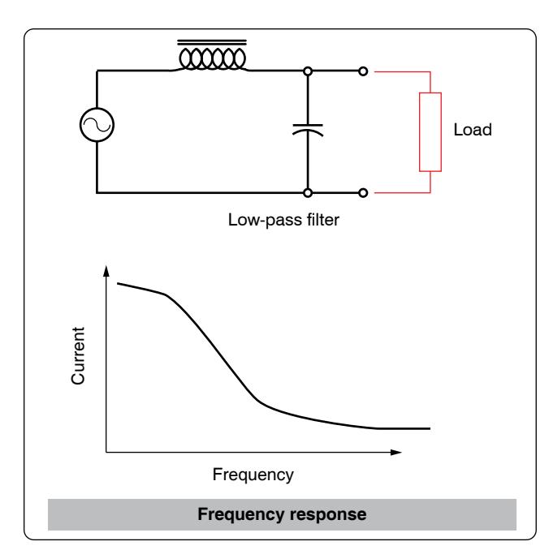

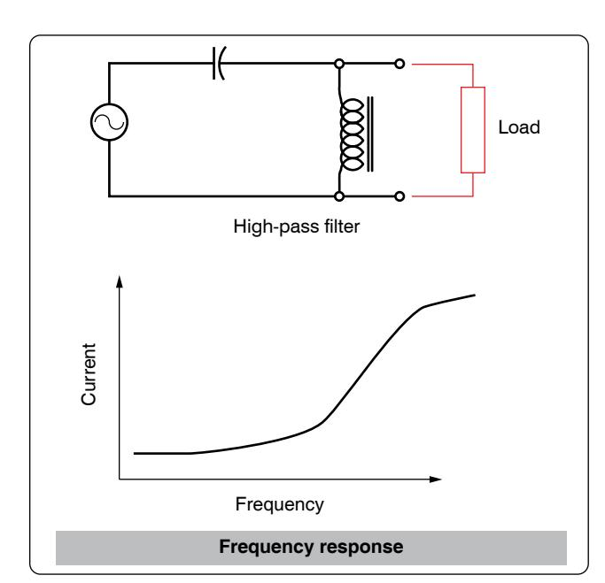

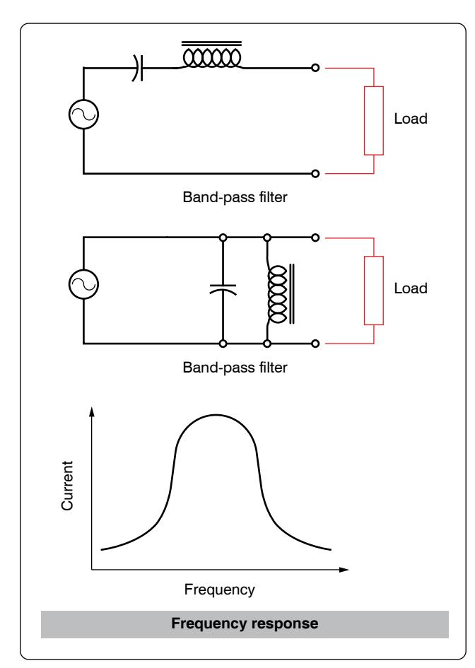

**Figure 12-234.** *Low-pass filter.*

operation is the most efficient. Because the transistor does not conduct except during a small portion of the input signal, this is the most efficient class of amplifier. The distortion of the Class C amplifier is greater (poor fidelity) than the Class A, AB, and B amplifiers because a small portion of the input signal is reproduced on the output. Class C amplifiers are used when the output signal is used for only small portions of time.

#### **Methods of Coupling**

Coupling is used to transfer a signal from one stage on an amplifier to another stage. Regardless of whether an amplifier is a single stage or one in a series of stages, there must be a method for the signal to enter and leave the circuit. Coupling is the process of transferring the energy between circuits. There are a number of ways for making this transfer and to discuss these methods in detail goes beyond the scope of this handbook. However, four methods are listed below with a brief description of their operation.

#### *Direct Coupling*

Direct coupling is the connection of the output of one stage directly to the input of the next stage. Direct coupling provides a good frequency response because no frequency-sensitive components, such as capacitors and inductors, are used. Yet this method is not used very often due to the complex power supply requirements and the impedance matching problems.

#### *RC Coupling*

RC coupling is the most common method of coupling and

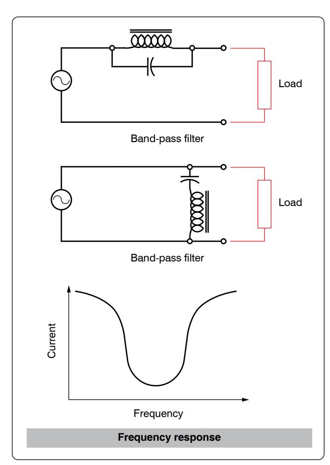

**Figure 12-237.** *Band-stop filter.*

uses a coupling capacitor and signal developing resistors. *[Figure 12-242]* In this circuit, R1 acts as a load resistor for Q1 and develops the output signal for that stage. The capacitor C1 blocks the DC bias signal and passes the AC output signal. R2 then becomes the load over which the passes AC signal is developed as an input to the base of Q2. This arrangement allows for the bias voltage of each stage to be blocked, while the AC signal is passed to the next stage.

#### *Impedance Coupling*

Impedance coupling uses a coil as a load for the first stage but otherwise functions just as an RC coupling. *[Figure 12-243]* This method is similar to the RC coupling method. The difference is that R1 is replaced with inductor L1 as the output load. The amount of signal developed on the output load depends on the inductive reactance of the coil. In order for the inductive reactance to be high, the inductance must be large; the frequency must be high or both. Therefore, load inductors should have relatively large amounts of inductance and are most effective at high frequencies.

### *Transformer Coupling*

Transformer coupling uses a transformer to couple the signal

from one stage to the next. *[Figure 12-244]* The transformer action of T1 couples the signal from the first stage to the second stage. The primary coil of T1 acts as a load for the output of the first stage while the secondary coil acts as the developing impedance for the second stage Q2. Transformer coupling is very efficient and the transformer can aid in impedance matching.

### **Feedback**

Feedback occurs when a small portion of the output signal is sent back to the input signal to the amplifier. There are two types of feedback in amplifiers:

- 1. Positive (regenerative)
- 2. Negative (degenerative)

The main difference between these two signals is whether the feedback signal adds to the input signal or if the feedback signal diminishes the input signal.

When the feedback is positive, the signal being returned to the input is in phase with the input signal and thus interferes constructively. *Figure 12-245* illustrates this concept applied in the amplified circuit through a block diagram. Notice that the feedback signal is in phase with the input signal, which regenerates the input signal. This results in an output signal with amplitude greater than would have been without the constructive, positive feedback. This type of positive feedback is what causes an audio system to squeal.

*Figure 12-245* also illustrates with a block diagram how negative or degenerative feedback occurs. In this case, the feedback signal is out of phase with the input signal. This causes destructive interference and degenerates the input signal. The result is a lower amplitude output signal than would have occurred without the feedback.

### **Operational Amplifiers (OP AMP)**

An operational amplifier (OP AMP) is designed to be used with other circuit components and performs either computing functions or filtering. *[Figure 12-246]* Operational amplifiers are usually high-gain amplifiers with the amount of gain governed by the amount of feedback.

Operational amplifiers were originally developed for analog computers and used to perform mathematical functions. Today many devices use the operational amplifier for DC amplifiers, AC amplifiers, comparators, oscillators, and filter circuits. The widespread use is due to the fact that the OP AMP is a versatile device, small, and inexpensive. Built into the integrated chip, the operational amp is used as a basic building block of larger circuits.

There are two inputs to the operational amplifier, inverting (−) and non-inverting (+), and there is one output. The polarity

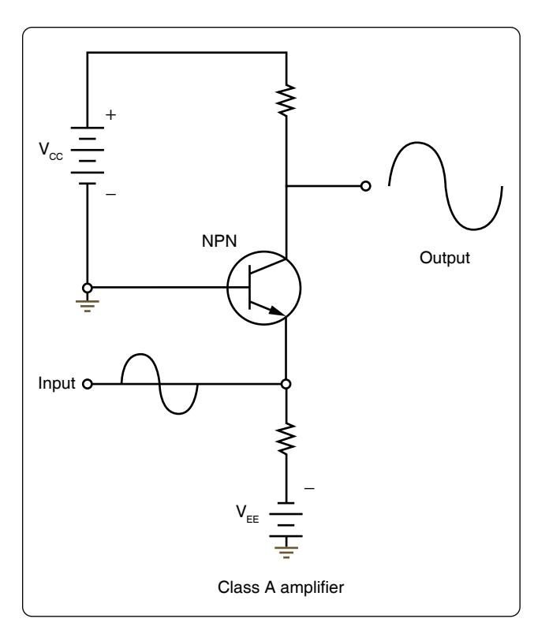

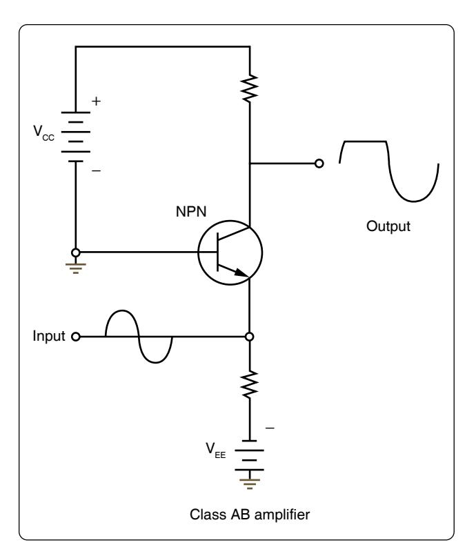

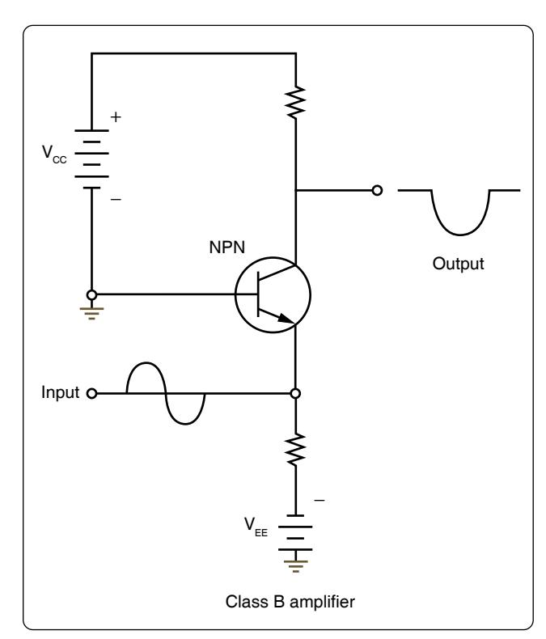

**Figure 12-238.** *Simplified Class A amplifier circuit.* **Figure 12-239.** *Simplified Class AB amplifier circuit.*

**Figure 12-240.** *Simplified Class B amplifier circuit.*

of a signal applied to the inverting input (−) is reversed at the output. A signal applied to the non-inverting (+) input retains its polarity on the output. To be classified as an operational amplifier, the circuit must have certain characteristics:

- 1. Very high gain
- 2. Very high input impedance
- 3. Very high output impedance

This type of a circuit can be made up of discrete components, such as resistors and transistors. However, the most common form of an operational amplifier is found in the integrated circuit. This integrated circuit or chip contains the various stages of the operational amplifier and can be treated as if it were a single stage.

#### *Applications*

The number of applications for OP AMPs is too numerous to detail in this handbook. However, the technician occasionally comes across these devices in modern aircraft and should be able to recognize their general purpose in a circuit. Some of the basic applications are:

- 1. Go/no-go detectors
- 2. Square wave circuits
- 3. Non-inverting amplifier
- 4. Inverting amplifier

- 5. Half-wave rectifier

Input Impedance coupled amplifier Output Q1 C1 Q2 VCC L1

**Figure 12-243.** *Simplified impedance coupling circuit.*

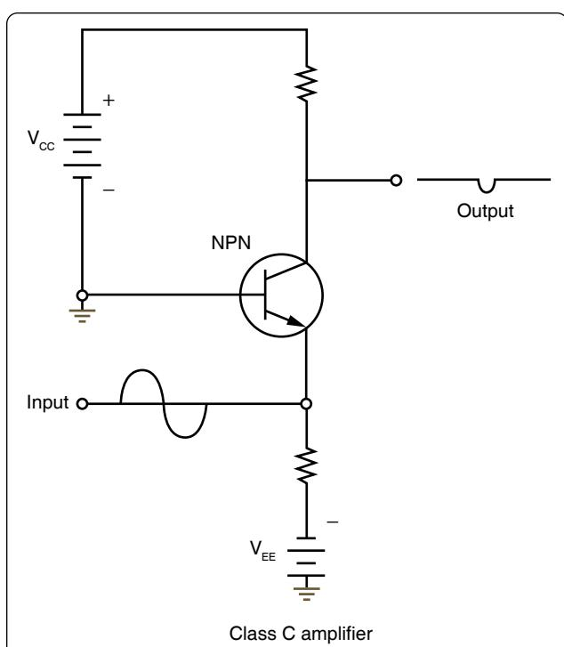

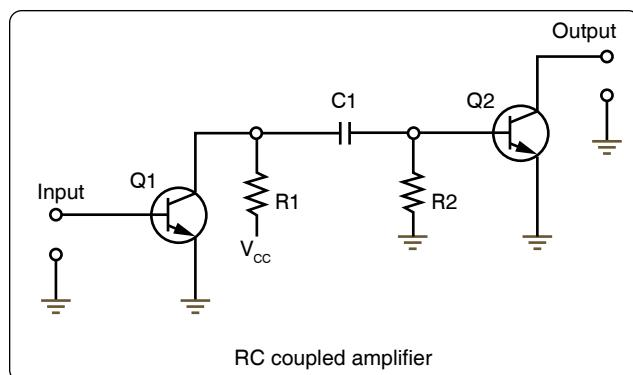

**Figure 12-241.** *Simplified Class C amplifier circuit.*

**Figure 12-242.** *Simplified RC coupling circuit.*

# **Magnetic Amplifiers**

Magnetic amplifiers do not amplify magnetism but use electromagnetism to amplify a signal. Essentially, the magnetic amplifier is a power amplifier with a very limited frequency response. The frequency range most commonly associated with the magnetic amplifier is 100 Hz and less, which places it in the audio range. As a technical point, the magnetic amplifier is a low-frequency amplifier.

Advantages of the magnetic amplifier are:

- 1. Very high efficiency, on the order of approximately 90 percent
- 2. High reliability
- 3. Very rugged, able to withstand vibrations, moisture, and overloads
- 4. No warm-up time

Some of the disadvantages of the magnetic amplifier are:

- 1. Incapacity to handle low-voltage signals
- 2. Not usable in high-frequency applications
- 3. Time delay associated with magnetic affects
- 4. Poor fidelity

The basic operating principles of the magnetic amplifier are fairly simple. Keep in mind that all amplifiers are current control devices. In this particular case, power that is delivered to the load is controlled by a variable inductance.

If an AC voltage is applied to the primary winding of an iron core transformer, the iron core is magnetized and demagnetized at the same frequency as that of the applied voltage. This, in turn, induces a voltage in the transformers secondary winding. The output voltage across the terminals of the secondary depends on the relationship of the number of turns in the primary and the secondary of the transformer.

The iron core of the transformer has a saturation point after which the application of a greater magnetic force produces no change in the intensity of magnetization. Hence, there is no change in transformer output, even if the input is greatly increased. The magnetic amplifier circuit in *Figure 12-247* is used to explain how a simple magnetic amplifier functions.

- 1. Assume that there is 1 ampere of current in coil A, which has 10 turns of wire. If coil B has 10 turns of wire, an output of 1 ampere is obtained if coil B is properly loaded.
- 2. By applying direct current to coil C, the core of the magnetic amplifier coil can be further magnetized. Assume that coil C has the proper number of turns and, upon the application of 30 milliamperes, that the core