# Fundamentals of Electricity & Electronics

# Chapter 12

# **Introduction**

This chapter addresses the fundamental concepts that are the building blocks for advanced electrical knowledge and practical troubleshooting. Some of the questions addressed are: How does energy travel through a copper wire and through space? What is electric current and electromotive force? What makes a landing light turn on or a hydraulic pump motor run? Each of these questions requires an understanding of many basic principles. By adding one basic idea on top of other basic ideas, it becomes possible to answer most of the interesting and practical questions about electricity or electronics.

Our understanding of electrical current must begin with the nature of matter. All matter is composed of molecules. All molecules are made up of atoms, which are themselves made up of electrons, protons, and neutrons.

# **General Composition of Matter**

#### **Matter**

Matter can be defined as anything that has mass and volume and is the substance of which physical objects are composed. Essentially, it is anything that can be touched. Matter is what all things are made of; whatever occupies space, has mass, and is perceptible to the senses in some way. Weight is an indirect method of determining mass, but it is not the same. Weight is a measure of the pull of gravity acting on the mass of an object. The more mass an object has, the more it weighs under the earth's force of gravity. Mathematically, weight can be stated as follows:

Weight = Mass × Gravity

Categories of matter are ordered by molecular activity. The four categories or states are: solids, liquids, gases, and plasma. For the purposes of the aircraft technician, only solids, liquids, and gases are considered.

# **Element**

An element is a substance that cannot be reduced to a simpler form by chemical means. Iron, gold, silver, copper, and oxygen are examples of elements. Beyond this point of reduction, the element ceases to be what it is.

#### **Compound**

A compound is a chemical combination of two or more elements. Water is one of the most common compounds and is made up of two hydrogen atoms and one oxygen atom.

# **Molecule**

The smallest particle of matter that can exist and still retain its identity, such as water (H2O), is called a molecule. *[Figure 12-1]* Substances composed of only one type of atom are called elements. But most substances occur in nature as compounds, that is, combinations of two or more types of atoms. It would no longer retain the characteristics of water if it were compounded of one atom of hydrogen and two atoms of oxygen. If a drop of water is divided and then divided again and again until it cannot be divided any longer, it is still water.

# **Atom**

The atom is considered to be the most basic building block of all matter. Atoms are composed of three subatomic particles: protons, neutrons, and electrons. These three particles determine the properties of the specific atoms. Elements are substances composed of the same atoms with specific properties. Oxygen is an example of this. The main property that defines each element is the number of neutrons, protons, and electrons. Hydrogen and helium are examples of elements. Both of these elements have neutrons, protons, and electrons but differ in the number of those items. This difference alone accounts for the variations in chemical and physical properties of these two different elements. There are over 100 known elements in the periodic table. *[Figure 12-2]* They are categorized according to their properties on that table. The kinetic theory of matter also states that the particles that make up the matter are always moving. Thermal expansion is considered in the kinetic theory and explains why matter contracts when it is cool and expands when it is hot, with the exception of water/ice.

# **Electrons, Protons, & Neutrons**

At the center of the atom is the nucleus, which contains protons and neutrons. Protons are positively-charged particles, and neutrons are neutrally-charged particles. A neutron has approximately the same mass as the proton. The third particle of the atom is the electron that is a negatively-

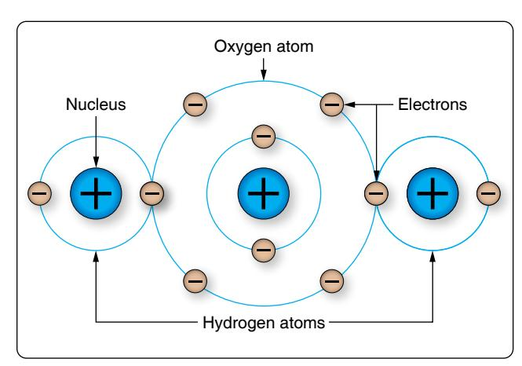

**Figure 12-1.** *A water molecule.*

charged particle with a very small mass compared to the proton. The proton's mass is approximately 1,837 times greater than the electron. Due to the proton and the neutron location in the central portion of the atom (nucleus) and the electron's position at the distant periphery of the atom, it is the electron that undergoes the change during chemical reactions. Since a proton weighs approximately 1,845 times as much as an electron, the number of protons and neutrons in its nucleus determines the overall weight of an atom. The weight of an electron is not considered in determining the weight of an atom. Indeed, the nature of electricity cannot be defined clearly because it is not certain whether the electron is a negative charge with no mass (weight) or a particle of matter with a negative charge.

Hydrogen represents the simplest form of an atom. *[Figure 12-3]* At the nucleus of the hydrogen atom is one proton and at the outer shell is one orbiting electron. At a more complex level is the oxygen atoms, which has eight electrons in two shells orbiting the nucleus with eight protons and eight neutrons. *[Figure 12-4]* When the total positive charge of the protons in the nucleus equals the total negative charge of the electrons in orbit around the nucleus, the atom is said to have a neutral charge.

# **Electron Shells & Energy Levels**

Electrons require a certain amount of energy to stay in an orbit. This particular quantity is called the electron's energy level. By its motion alone, the electron possesses kinetic energy, while the electron's position in orbit determines its potential energy. The total energy of an electron is the main factor that determines the radius of the electron's orbit. Electrons of an atom appear only at certain definite energy levels (shells). The spacing between energy levels is such that when the chemical properties of the various elements are cataloged, it is convenient to group several closely spaced permissible energy levels together into electron shells. The maximum number of electrons that can be contained in any shell or sub-shell is the same for all atoms and is defined as electron capacity = 2n2. In this equation, n represents the energy level in question. The first shell can only contain two electrons; the second shell can only contain eight electrons; the third, 18, and so on until we reach the seventh shell for the heaviest atoms, which have six energy levels. Because the innermost shell is the lowest energy level, the shell begins to fill up from the shell closest to the nucleus and fill outward as the atomic number of the element increases. However, an energy level does not need to be completely filled before electrons begin to fill the next level. The Periodic Table of Elements should be checked to determine an element's electron configuration.

# *Valence Electrons*

Valence is the number of chemical bonds an atom can form. Valence electrons are electrons that can participate in chemical bonds with other atoms. The number of electrons in the outermost shell of the atom is the determining factor in its valence. Therefore, the electrons contained in this shell are called valence electrons.

#### *Ions*

Ionization is the process by which an atom loses or gains electrons. Dislodging an electron from an atom causes the atom to become positively charged. This net positivelycharged atom is called a positive ion or a cation. An atom that has gained an extra number of electrons is negatively charged and is called a negative ion or an anion. When atoms are neutral, the positively-charged proton and the negativelycharged electron are equal.

# *Free Electrons*

Valence electrons are found drifting midway between two nuclei. Some electrons are more tightly bound to the nucleus of their atom than others and are positioned in a shell or sphere closer to the nucleus, while others are more loosely bound and orbit at a greater distance from the nucleus. These outermost electrons are called "free" electrons because they can be easily dislodged from the positive attraction of the protons in the nucleus. Once freed from the atom, the electron can then travel from atom to atom, becoming the flow of electrons commonly called current in a practical electrical circuit.

# **Electron Movement**

# *Conductors, Insulators, and Semiconductors*

The valence of an atom determines its ability to gain or lose an electron, which ultimately determines the chemical and electrical properties of the atom. These properties can be categorized as being a conductor, semiconductor, or insulator, depending on the ability of the material to produce free electrons. When a material has a large number of free

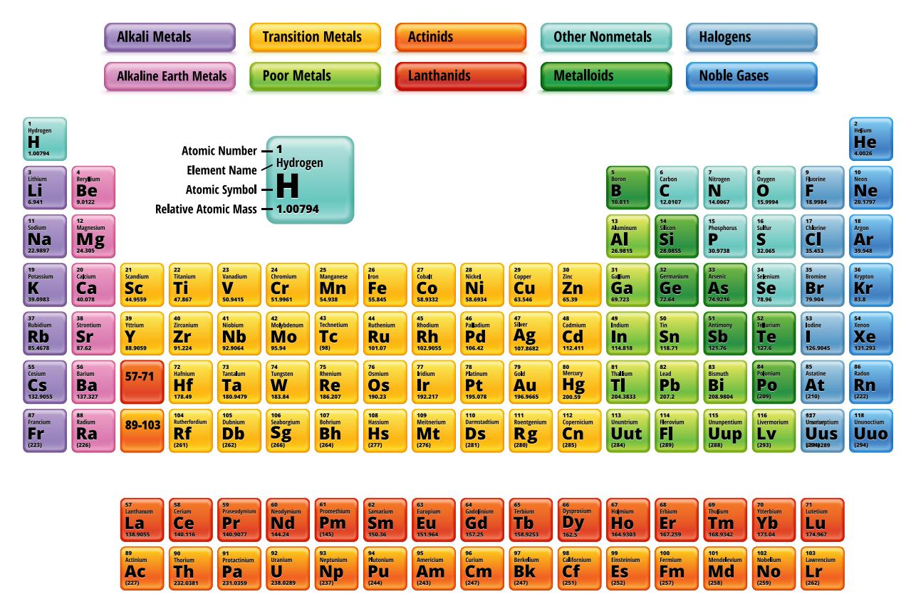

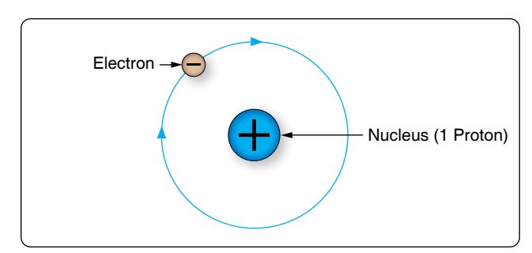

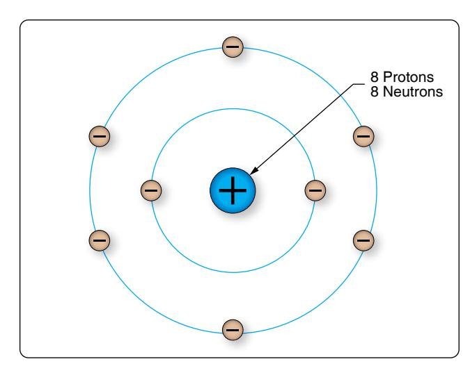

**Figure 12-3.** *Hydrogen atom.*

**Figure 12-4.** *Oxygen atom.*

**Figure 12-2.** *Periodic table of elements.*

electrons available, a greater current can be conducted in the material.

#### *Conductors*

Elements such as gold, copper, and silver possess many free electrons and make good conductors. The atoms in these materials have a few loosely bound electrons in their outer orbits. Energy in the form of heat can cause these electrons in the outer orbit to break loose and drift throughout the material. Copper and silver have one electron in their outer orbits. At room temperature, a piece of silver wire has billions

of free electrons.

# *Insulators*

Insulators are materials that do not conduct electrical current very well or not at all, such as glass, ceramic, and plastic. Under normal conditions, atoms in these materials do not produce free electrons. The absence of free electrons means that electrical current cannot be conducted through the material. Only when the material is in an extremely strong electrical field will the outer electrons be dislodged. This action is called breakdown and usually causes physical damage to the insulator.

# *Semiconductors*

The material properties of semiconductors fall in between conductors and insulators. In their pure state, they are not good at conducting or insulating. Semiconductors can operate like a conductor or insulator depending on what external load is placed on the material. Semiconductors are used to make transistors and integrated circuits. Silicon and germanium are the most widely used semiconductor materials. For a more detailed explanation on this topic, refer to page 12-98 in this chapter.

#### **Metric Based Prefixes Used for Electrical Calculations**

In any system of measurements, a single set of units is usually not sufficient for all the computations involved in electrical repair and maintenance. Small distances, for example, can usually be measured in inches, but larger distances are more meaningfully expressed in feet, yards, or miles. Since electrical values often vary from numbers that are a millionth part of a basic unit of measurement to very large values, it is often necessary to use a wide range of numbers to represent the values of units, such as volts, amperes, or ohms. A series of prefixes that appear with the name of the unit have been devised for the various multiples or submultiples of the basic units. There are 12 of these prefixes, which are also known as conversion factors. Four of the most commonly used prefixes in electrical work are:

Mega (M) means one million (1,000,000).

Kilo (k) means one thousand (1,000).

Milli (m) means one-thousandth (1⁄1,000).

Micro (μ) means one-millionth (1⁄1,000,000).

Kilo is one of the most extensively used conversion factors. It explains the use of prefixes with basic units of measurement. Kilo means 1,000, and when used with volts, is expressed as kilovolt, meaning 1,000 volts. The symbol for kilo is the letter "k." Thus, 1,000 volts is one kilovolt or 1 kV. Conversely, one volt would equal one-thousandth of a kV, or 1 ⁄1,000 kV. This could also be written 0.001 kV.

Similarly, the word "milli" means one-thousandth, and thus, 1 millivolt equals one-thousandth (1⁄1000) of a volt. *Figure 12-5* contains a complete list of the multiples used to express electrical quantities, together with the prefixes and symbols used to represent each number.

# **Static Electricity**

Electricity is often described as being either static or dynamic. The difference between the two is based simply on whether the electrons are at rest (static) or in motion (dynamic). Static electricity is a buildup of an electrical charge on the surface of an object. It is considered "static" due to the fact that there is no current flowing as in alternate current (AC) or direct current (DC) electricity. Static electricity is usually caused when non-conductive materials, such as rubber, plastic, or glass, are rubbed together causing a transfer of electrons, which results in an imbalance of charges between the two materials. The fact that there is an imbalance of charges between the two materials means that the objects will exhibit an attractive or repulsive force.

# **Attractive and Repulsive Forces**

One of the most fundamental laws of static electricity, as well as magnetics, deals with attraction and repulsion. Like charges repel each other and unlike charges attract each other. All electrons possess a negative charge and as such repel each other. Similarly, all protons possess a positive charge and as such repel each other. Electrons (negative) and protons (positive) are opposite in their charge and attract each other.

For example, if two pith balls are suspended, as shown in *Figure 12-6*, and each ball is touched with the charged glass rod, some of the charge from the rod is transferred to the balls. The balls now have similar charges and, consequently, repel each other as shown in part B of *Figure 12-6*. If a plastic rod is rubbed with fur, it becomes negatively charged and the fur is positively charged. By touching each ball with these differently charged sources, the balls obtain opposite charges and attract each other as shown in part C of *Figure 12-6*.

Although most objects become charged with static electricity by means of friction, a charged substance can also influence objects near it by contact. *[Figure 12-7]* If a positively-charged rod touches an uncharged metal bar, it draws electrons from the uncharged bar to the point of contact. Some electrons enter the rod, leaving the metal bar with a deficiency of electrons (positively charged) and making the rod less positive than it was or, perhaps, even neutralizing its charge completely.

A method of charging a metal bar by induction is demonstrated in *Figure 12-8*. A positively-charged rod is brought near, but does not touch, an uncharged metal bar. Electrons in the metal bar are attracted to the end of the bar nearest the positivelycharged rod, leaving a deficiency of electrons at the opposite end of the bar. If this positively-charged end is touched by a neutral object, electrons will flow into the metal bar and

| Number            | Prefix | Symbol |
|-------------------|--------|--------|
| 1,000,000,000,000 | tera   | t      |
| 1,000,000,000     | giga   | g      |
| 1,000,000         | mega   | M      |
| 1,000             | kilo   | k      |
| 100               | hecto  | h      |
| 10                | deka   | dk     |
| 0.1               | deci   | d      |
| 0.01              | centi  | c      |
| 0.001             | milli  | m      |
| 0.000001          | micro  | µ      |

0.000000001 nano n 0.000000000001 pico p **Figure 12-5.** *Prefixes and symbols for multiples of basic quantities.*

neutralize the charge. The metal bar is left with an overall excess of electrons.

# **Electrostatic Field**

A field of force exists around a charged body. This field is an electrostatic field (sometimes called a dielectric field) and is represented by lines extending in all directions from the charged body and terminating where there is an equal and opposite charge.

To explain the action of an electrostatic field, lines are used to represent the direction and intensity of the electric field of force. As illustrated in *Figure 12-9*, the intensity of the field is indicated by the number of lines per unit area, and the direction is shown by arrowheads on the lines pointing in the direction in which a small test charge would move (or tend to move) if acted upon by the field of force.

Either a positive or negative test charge can be used, but it has been arbitrarily agreed that a small positive charge is always used in determining the direction of the field. Thus, the direction of the field around a positive charge is always away from the charge because a positive test charge would be repelled. *[Figure 12-9]* On the other hand, the direction of the lines about a negative charge is toward the charge, since a positive test charge is attracted toward it.

*Figure 12-10* illustrates the field around bodies having like charges. Positive charges are shown, but regardless of the type of charge, the lines of force would repel each other if the charges were alike. The lines terminate on material objects and always extend from a positive charge to a negative charge. These are imaginary lines used to show the direction a real force takes.

It is important to know how a charge is distributed on an object. *Figure 12-11* shows a small metal disk on which a concentrated negative charge has been placed. By using an electrostatic detector, it can be shown that the charge is spread evenly over the entire surface of the disk. Since the metal disk provides uniform resistance everywhere on its surface, the mutual repulsion of electrons results in an even distribution over the entire surface.

Another example, shown in *Figure 12-12*, is the charge on a hollow sphere. Although the sphere is made of conducting material, the charge is evenly distributed over the outside surface. The inner surface is completely neutral. This phenomenon is used to safeguard operating personnel of the large Van de Graaff static generators used for atom smashing. The safest area for the operators is inside the large sphere, where millions of volts are being generated.

The distribution of the charge on an irregularly-shaped object differs from that on a regularly-shaped object. *Figure 12-13* shows that the charge on such objects is not evenly distributed. The greatest charge is at the points, or areas of sharpest curvature, of the objects.

# **Electrostatic Discharge (ESD) Considerations**

One of the most frequent causes of damage to a solidstate component or integrated circuits is the electrostatic discharge (ESD) from the human body when one of these devices is handled. Careless handling of line replaceable units (LRUs), circuit cards, and discrete components can cause unnecessarily time consuming and expensive repairs. This damage can occur if a technician touches the mating pins for a card or box. Other sources for ESD can be the top of a toolbox that is covered with a carpet. Damage can be avoided by discharging the static electricity from your body by touching the chassis of the removed box, by wearing a grounding wrist strap, and exercising good professional handling of the components in the aircraft. This can include placing protective caps over open connectors and not placing an ESD-sensitive component in an environment that causes damage. Parts that are ESD sensitive are typically shipped in bags specially designed to protect components from electrostatic damage.

Other precautions that should be taken with working with electronic components are:

- 1. Always connect a ground between test equipment and circuit before attempting to inject or monitor a signal.
- 2. Ensure test voltages do not exceed maximum allowable voltage for the circuit components and transistors.
- 3. Ohmmeter ranges that require a current of more than one milliampere in the test circuit should not be used for testing transistors.

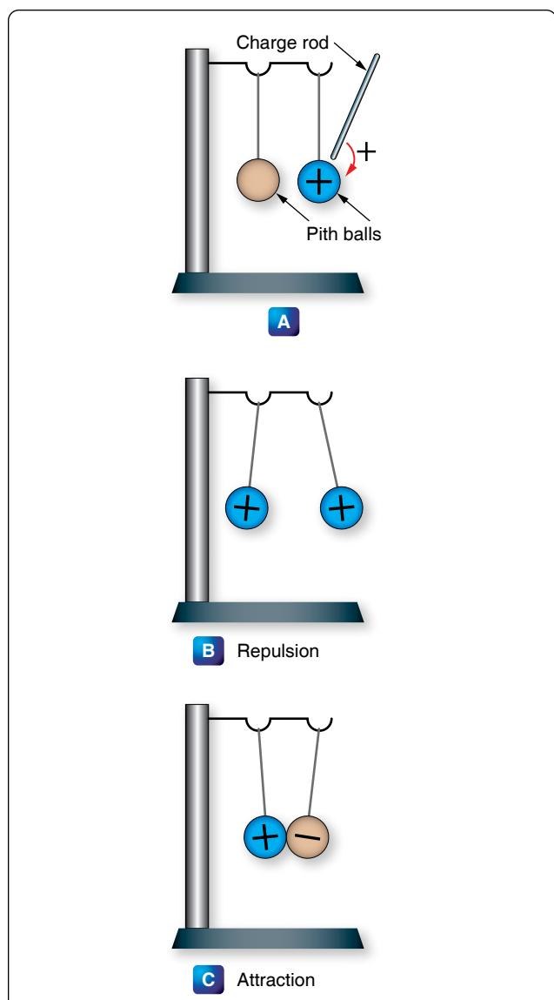

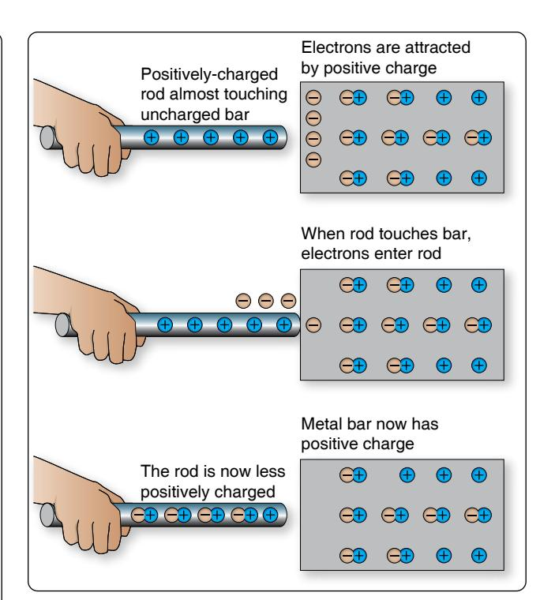

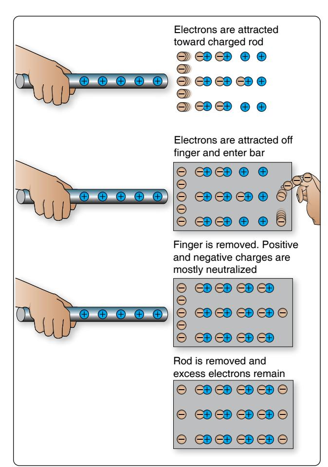

**Figure 12-6.** *Reaction of like and unlike charges.*

**Figure 12-7.** *Charging by contact.*

- 4. The heat applied to a diode or transistor, when soldering is required, should be kept to a minimum by using low-wattage soldering irons and heat sinks.
- 5. Do not pry components of a circuit board.
- 6. Power must be removed from a circuit before replacing a component.
- 7. When using test probes on equipment and the space between the test points is very close, keep the exposed portion of the leads as small as possible to prevent shorting.

# **Magnetism**

Magnetism is defined as the property of an object to attract certain metallic substances. In general, these substances are ferrous materials; that is, materials composed of iron or iron

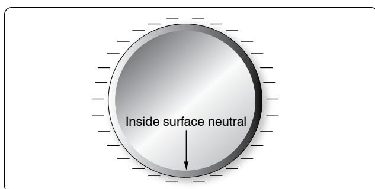

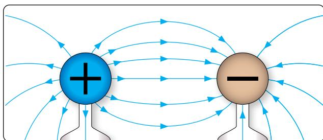

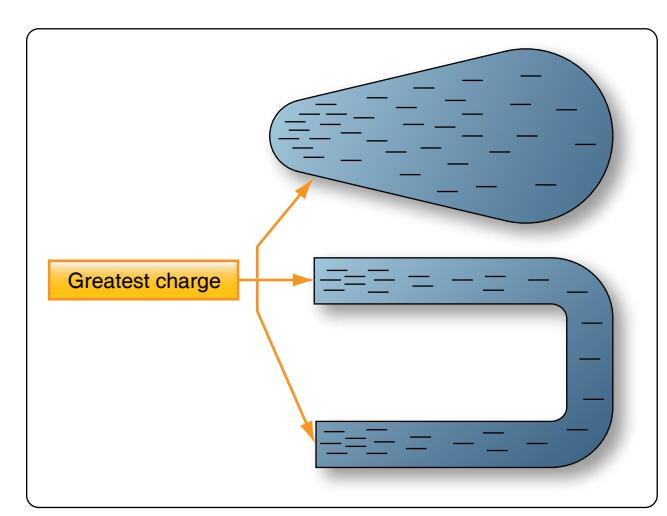

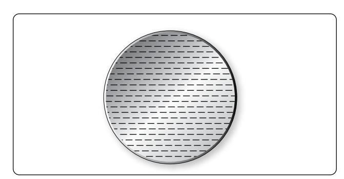

**Figure 12-9.** *Direction of electric field around positive and negative charges.* **Figure 12-12.** *Charge on a hollow sphere.*

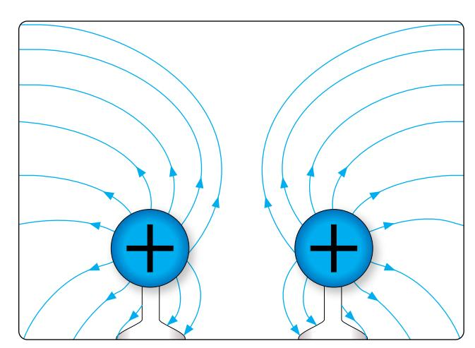

**Figure 12-10.** *Field around two positively-charged bodies.*

alloys, such as soft iron, steel, and alnico. These materials, sometimes called magnetic materials, include at least three nonferrous materials: nickel, cobalt, and gadolinium, which are magnetic to a limited degree. All other substances are considered nonmagnetic. A few of these non-magnetic substances can be classified as diamagnetic since they are repelled by both poles of a magnet.

Magnetism is an invisible force, the ultimate nature of which has not been fully determined. It can best be described by the effects it produces. Examination of a simple bar magnet similar to that illustrated in *Figure 12-14* discloses some basic characteristics of all magnets. If the magnet is suspended to

swing freely, it aligns itself with the earth's magnetic poles. One end is labeled "N," meaning the North seeking end or pole of the magnet. If the "N" end of a compass or magnet is referred to as North seeking rather than North, there is no conflict in referring to the pole it seeks, which is the North magnetic pole. The opposite end of the magnet, marked "S" is the South seeking end and points to the South magnetic pole. Since the earth is a giant magnet, its poles attract the ends of the magnet. These poles are not located at the geographic poles.

The somewhat mysterious and completely invisible force of a magnet depends on a magnetic field that surrounds the magnet. *[Figure 12-15]* This field always exists between the poles of a magnet and arranges itself to conform to the shape of any magnet.

The theory that explains the action of a magnet holds that each molecule making up the iron bar is itself a tiny magnet, with both North and South poles as illustrated in *Figure 12-16A*. These molecular magnets each possess a magnetic field, but in an unmagnetized state, the molecules are arranged at random throughout the iron bar. If a magnetizing force, such as stroking with a lodestone, is applied to the unmagnetized

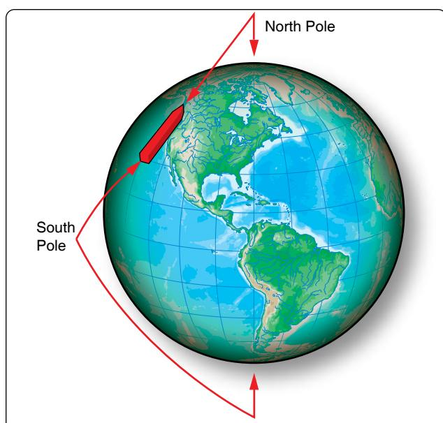

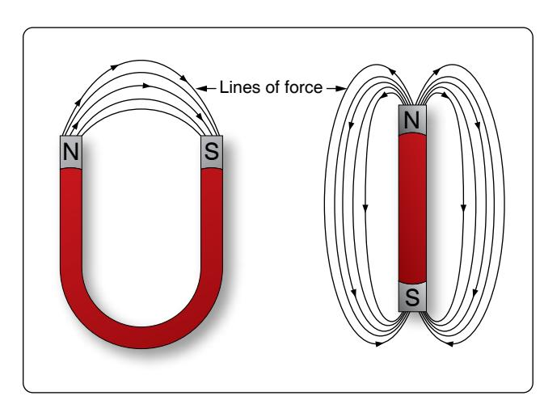

**Figure 12-14.** *One end of magnetized strip points to the magnetic North pole.*

**Figure 12-15.** *Magnetic field around magnets.*

bar, the molecular magnets rearrange themselves in line with the magnetic field of the lodestone, with all North ends of the magnets pointing in one direction and all South ends in the opposite direction. *[Figure 12-16B]* In such a configuration, the magnetic fields of the magnets combine to produce the total field of the magnetized bar.

When handling a magnet, avoid applying direct heat, hammering, or dropping it. Heating or sudden shock creates misalignment of the molecules, causing the strength of a magnet to decrease. When a magnet is to be stored, devices known as "keeper bars" are installed to provide an easy path for flux lines from one pole to the other. This promotes the retention of the molecules in their North-South alignment.

The presence of the magnetic force or field around a magnet can best be demonstrated by the experiment illustrated in *Figure 12-17*. A sheet of transparent material, such as glass or Lucite™, is placed over a bar magnet and iron filings are sprinkled slowly on this transparent shield. If the glass or Lucite™ is tapped lightly, the iron filings arrange themselves in a definite pattern around the bar, forming a series of lines from the North to South end of the bar to indicate the pattern of the magnetic field.

As shown, the field of a magnet is made up of many individual forces that appear as lines in the iron filing demonstration. Although they are not "lines" in the ordinary sense, this word is used to describe the individual nature of the separate forces making up the entire magnetic field. These lines of force are also referred to as magnetic flux.

They are separate and individual forces, since one line will never cross another; indeed, they actually repel one another. They remain parallel to one another and resemble stretched rubber bands, since they are held in place around the bar by the internal magnetizing force of the magnet.

The demonstration with iron filings further shows that the magnetic field of a magnet is concentrated at the ends of the magnet. These areas of concentrated flux are called the North and South poles of the magnet. There is a limit to the number of lines of force that can be crowded into a magnet of a given size. When a magnetizing force is applied to a piece of magnetic material, a point is reached where no more lines of force can be induced or introduced. The material is then said to be saturated.

The characteristics of the magnetic flux can be demonstrated by tracing the flux patterns of two bar magnets with like poles together. *[Figure 12-18]* The two like poles repel one another because the lines of force will not cross each other. As the arrows on the individual lines indicate, the lines turn aside as

the two like poles are brought near each other and travel in a path parallel to each other. Lines moving in this manner repel each other, causing the magnets as a whole to repel each other.

By reversing the position of one of the magnets, the attraction of unlike poles can be demonstrated. *[Figure 12-19]* As the unlike poles are brought near each other, the lines of force rearrange their paths and most of the flux leaving the North pole of one magnet enters the South pole of the other. The tendency of lines of force to repel each other is indicated by the bulging of the flux in the air gap between the two magnets.

To further demonstrate that lines of force do not cross one another, a bar magnet and a horseshoe magnet can be positioned to display a magnetic field similar to that of

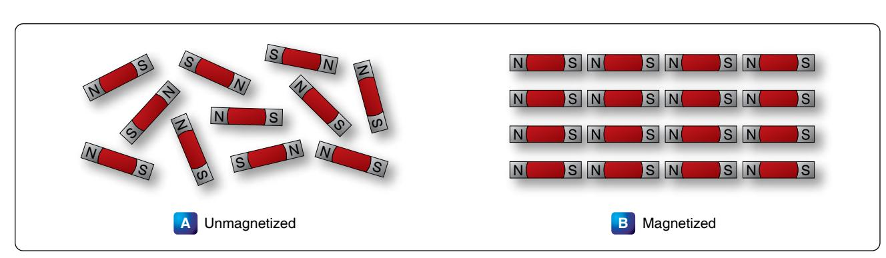

**Figure 12-16.** *Arrangement of molecules in a piece of magnetic material.*

of one. The nonferrous metals with a permeability greater than one, such as nickel and cobalt, are called paramagnetic. The term ferromagnetic is applied to iron and its alloys, which have by far the greatest permeability. Any substance, such as bismuth, having a permeability of less than one, is considered diamagnetic.

Reluctance, the measure of opposition to the lines of force through a material, can be compared to the resistance of an electrical circuit. The reluctance of soft iron, for instance, is much lower than that of air. *Figure 12-24* demonstrates that a piece of soft iron placed near the field of a magnet can distort the lines of force, which follow the path of lowest reluctance through the soft iron.

The magnetic circuit can be compared in many respects to an electrical circuit. The magnetomotive force, causing lines of force in the magnetic circuit, can be compared to the electromotive force (emf) or electrical pressure of an electrical circuit. The magnetomotive force is measured in gilberts, symbolized by the capital letter "F." The symbol for the intensity of the lines of force, or flux, is the Greek letter phi, and the unit of field intensity is the gauss. An individual line of force, called a maxwell, in an area of one square centimeter produces a field intensity of one gauss. Using reluctance rather than permeability, the law for magnetic circuits can be stated: a magnetomotive force of one gilbert causes one maxwell, or line of force, to be set up in a material when the reluctance of the material is one.

# **Types of Magnets**

Magnets are either natural or artificial. Since naturally occurring magnets or lodestones have no practical use, all magnets considered in this chapter are artificial or manmade. Artificial magnets can be further classified as permanent magnets, which retain their magnetism long after the magnetizing force has been removed, and temporary magnets, which quickly lose most of their magnetism when the external magnetizing force is removed.

*Figure 12-20*. The magnetic fields of the two magnets do not combine, but are rearranged into a distorted flux pattern.

The two bar magnets may be held in the hands and the North poles brought near each other to demonstrate the force of repulsion between like poles. In a similar manner, the two South poles can demonstrate this force. The force of attraction between unlike poles can be felt by bringing a South and a North end together. *[Figure 12-21]*

*Figure 12-22* illustrates another characteristic of magnets. If the bar magnet is cut or broken into pieces, each piece immediately becomes a magnet itself, with a North and South pole. This feature supports the theory that each molecule is a magnet, since each successive division of the magnet produces more magnets.

Since the magnetic lines of force form a continuous loop, they form a magnetic circuit. It is impossible to say where in the magnet they originate or start. Arbitrarily, it is assumed that all lines of force leave the North pole of any magnet and enter at the South pole.

There is no known insulator for magnetic flux, or lines of force, since they pass through all materials. However, they do pass through some materials more easily than others. Thus, it is possible to shield items, such as instruments, from the effects of the flux by surrounding them with a material that offers an easier path for the lines of force. *Figure 12-23* shows an instrument surrounded by a path of soft iron, which offers very little opposition to magnetic flux. The lines of force take the easier path, the path of greater permeability, and are guided away from the instrument.

Materials such as soft iron and other ferrous metals are said to have a high permeability, the measure of the ease with which magnetic flux can penetrate a material. The permeability scale is based on a perfect vacuum with a rating of one. Air and other nonmagnetic materials are so close to this that they are also considered to have a rating

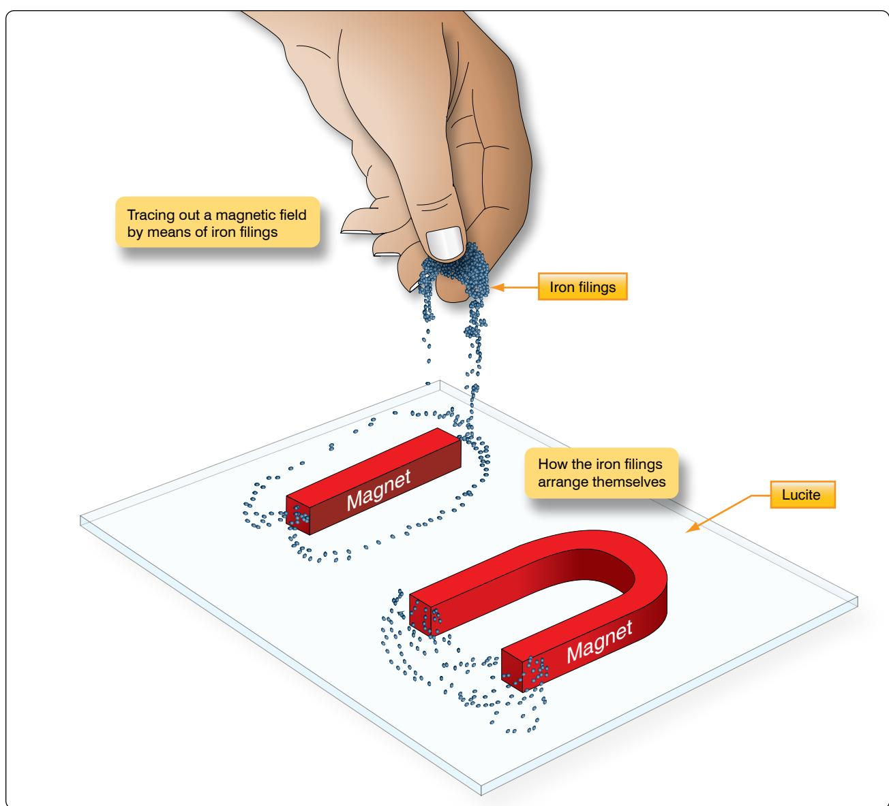

**Figure 12-17.** *Tracing out a magnetic field with iron filings.*

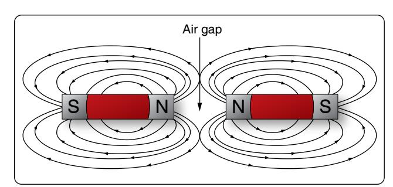

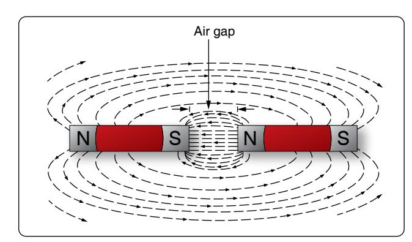

**Figure 12-18.** *Like poles repel.*

**Figure 12-19.** *Unlike poles attract.*

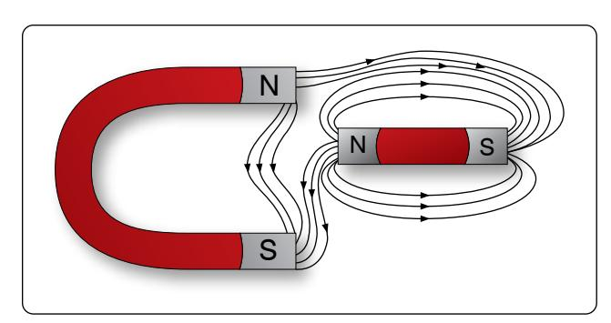

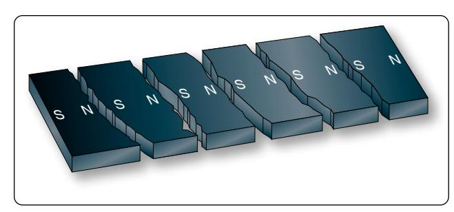

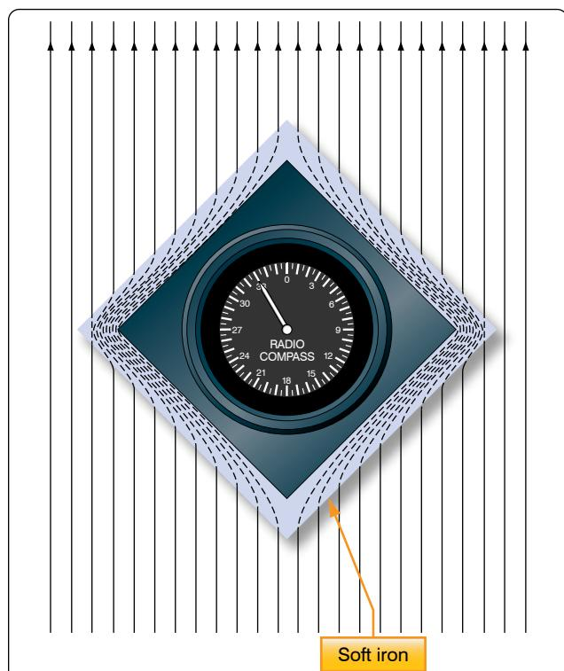

**Figure 12-20.** *Bypassing flux lines.*

**Figure 12-22.** *Magnetic poles in a broken magnet.*

**Figure 12-23.** *Magnetic shield.*

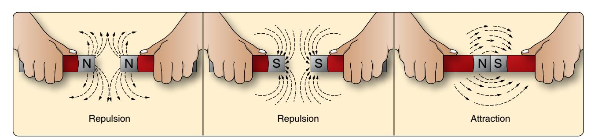

**Figure 12-21.** *Repulsion and attraction of magnet poles.*

Modern permanent magnets are made of special alloys that have been found through research to create increasingly better magnets. The most common categories of magnet materials are made out of aluminum-nickel-cobalt (alnicos), strontium-iron (ferrites, also known as ceramics), neodymium-iron-boron (neo magnets), and samariumcobalt. Alnico, an alloy of iron, aluminum, nickel and cobalt, is considered one of the very best. Others with excellent magnetic qualities are alloys such as Remalloy™ and Permendur™.

The ability of a magnet to hold its magnetism varies greatly with the type of metal and is known as retentivity. Magnets made of soft iron are very easily magnetized but quickly lose most of their magnetism when the external magnetizing force is removed. The small amount of magnetism remaining, called residual magnetism, is of great importance in such electrical applications as generator operation.

Horseshoe magnets are commonly manufactured in two forms. *[Figure 12-25]* The most common type is made from a long bar curved into a horseshoe shape, while a variation of this type consists of two bars connected by a third bar, or yoke.

Magnets can be made in many different shapes, such as balls, cylinders, or disks. One special type of magnet is the ring magnet, or Gramme ring, often used in instruments. This is a closed loop magnet, similar to the type used in transformer cores, and is the only type that has no poles.

Sometimes special applications require that the field of force lie through the thickness rather than the length of a piece of metal. Such magnets are called flat magnets and are used as pole pieces in generators and motors.

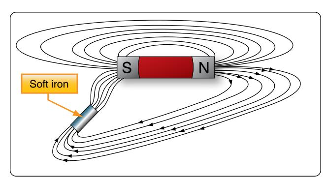

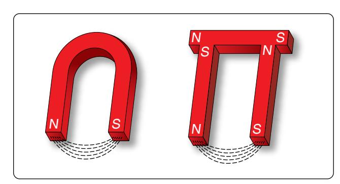

**Figure 12-24.** *Effect of a magnetic substance in a magnetic field.* **Figure 12-25.** *Two forms of horseshoe magnets.*

# **Electromagnetism**

In 1820, the Danish physicist, Hans Christian Oersted, discovered that the needle of a compass brought near a current carrying conductor would be deflected. When the current flow stopped, the compass needle returned to its original position. This important discovery demonstrated a relationship between electricity and magnetism that led to the electromagnet and to many of the inventions on which modern industry is based.

Oersted discovered that the magnetic field had no connection with the conductor in which the electrons were flowing, because the conductor was made of nonmagnetic copper. The electrons moving through the wire created the magnetic field around the conductor. Since a magnetic field accompanies a charged particle, the greater the current flow, the greater the magnetic field. *Figure 12-26 i*llustrates the magnetic field around a current carrying wire. A series of concentric circles around the conductor represent the field, which if all the lines were shown would appear more as a continuous cylinder of such circles around the conductor.

As long as current flows in the conductor, the lines of force remain around it. *[Figure 12-27]* If a small current flows through the conductor, there will be a line of force extending out to circle A. If the current flow is increased, the line of force increases in size to circle B, and a further increase in current expands it to circle C. As the original line (circle) of force expands from circle A to B, a new line of force appears at circle A. As the current flow increases, the number of circles of force increases, expanding the outer circles farther from the surface of the current carrying conductor.

If the current flow is a steady nonvarying direct current, the magnetic field remains stationary. When the current stops, the magnetic field collapses and the magnetism around the conductor disappears.

A compass needle is used to demonstrate the direction of the magnetic field around a current carrying conductor. *Figure 12-28A* shows a compass needle positioned at right

angles to, and approximately one inch from, a current carrying conductor. If no current were flowing, the North seeking end of the compass needle would point toward the earth's magnetic pole. When current flows, the needle lines itself up at right angles to a radius drawn from the conductor. Since the compass needle is a small magnet, with lines of force extending from South to North inside the metal, it turns until the direction of these lines agrees with the direction of the lines of force around the conductor. As the compass needle is moved around the conductor, it maintains itself in a position at right angles to the conductor, indicating that the magnetic field around a current carrying conductor is circular. As shown in *Figure 12-28B*, when the direction of current flow through the conductor is reversed, the compass needle points in the opposite direction, indicating the magnetic field has reversed its direction.

A method used to determine the direction of the lines of force when the direction of the current flow is known is shown in *Figure 12-29*. If the conductor is grasped in the left hand, with the thumb pointing in the direction of current flow, the fingers will be wrapped around the conductor in the same direction as the lines of the magnetic field. This is called the left-hand rule.

Although it has been stated that the lines of force have direction, this should not be construed to mean that the lines have motion in a circular direction around the conductor. Although the lines of force tend to act in a clockwise or counterclockwise direction, they are not revolving around the conductor.

Since current flows from negative to positive, many illustrations indicate current direction with a dot symbol on the end of the conductor when the electrons are flowing toward and a plus sign when the current is flowing away from the observer. *[Figure 12-30]*

When a wire is bent into a loop and an electric current flows through it, the left-hand rule remains valid. *[Figure 12-31]* If the wire is coiled into two loops, many of the lines of force become large enough to include both loops. Lines of force

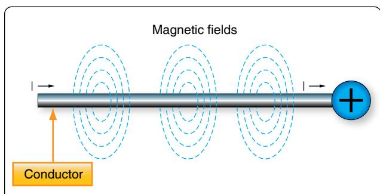

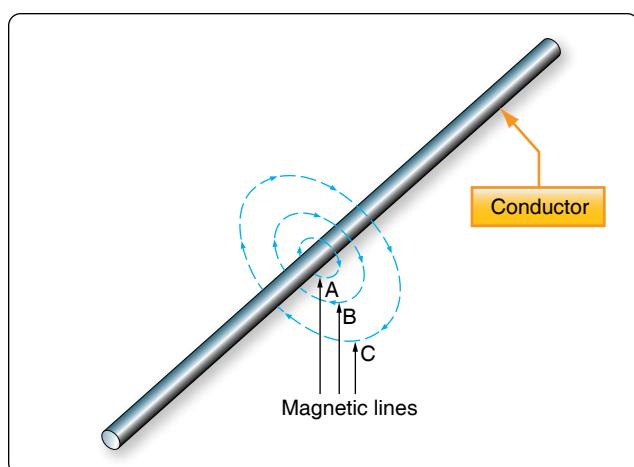

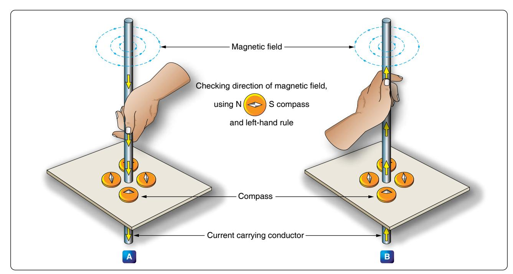

**Figure 12-26.** *Magnetic field formed around a conductor in which current is flowing.*

**Figure 12-27.** *Expansion of magnetic field as current increases.*

go through the loops in the same direction, circle around the outside of the two coils, and come in at the opposite end. *[Figure 12-32]*

When a wire contains many such loops, it is called a coil. The lines of force form a pattern through all the loops causing a high concentration of flux lines through the center of the coil. *[Figure 12-33]*

In a coil made from loops of a conductor, many of the lines of force are dissipated between the loops of the coil. By placing a soft iron bar inside the coil, the lines of force are concentrated in the center of the coil, since soft iron has a greater permeability than air. *[Figure 12-34]* This combination of an iron core in a coil of wire loops, or turns, is called an electromagnet, since the poles (ends) of the coil possess the characteristics of a bar magnet.

> The addition of the soft iron core does two things for the current carrying coil. First, the magnetic flux is increased. Second, the flux lines are more highly concentrated.

> When direct current flows through the coil, the core becomes magnetized with the same polarity (location of North and South poles) as the coil would have without the core. If the current is reversed, the polarity is also reversed.

> The polarity of the electromagnet is determined by the left-hand rule in the same manner as the polarity of the coil without the core was determined. If the coil is grasped in the left hand in such a manner that the fingers curve

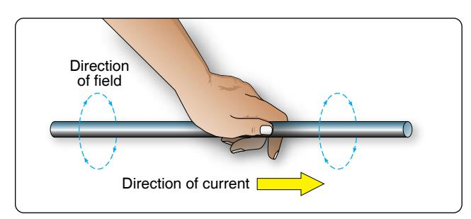

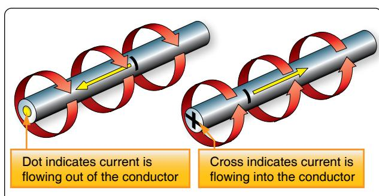

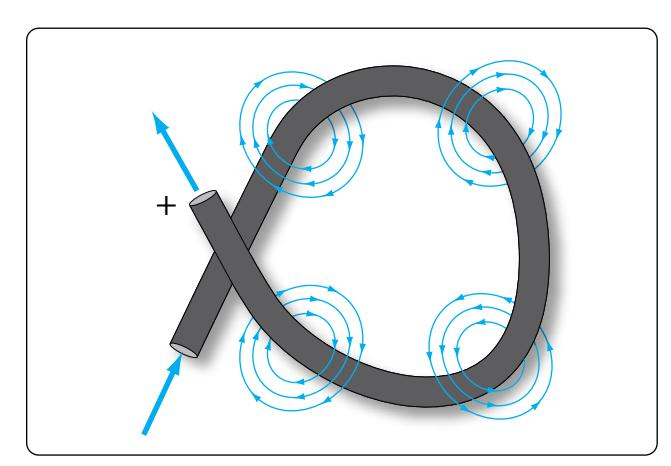

**Figure 12-29.** *Left-hand rule.*

around the coil in the direction of electron flow (minus to plus), the thumb points in the direction of the North pole. *[Figure 12-35]*

The strength of the magnetic field of the electromagnet can be increased by either increasing the flow of current or the number of loops in the wire. Doubling the current flow approximately doubles the strength of the field. In a similar manner, doubling the number of loops approximately doubles magnetic field strength. Finally, the type of metal in the core is a factor in the field strength of the electromagnet.

A soft iron bar is attracted to either pole of a permanent magnet and, likewise, is attracted by a current carrying coil. The lines of force extend through the soft iron, magnetizing it by induction and pulling the iron bar toward the coil. If the bar is free to move, it is drawn into the coil to a position near the center where the field is strongest. *[Figure 12-36]*

Electromagnets are used in electrical instruments, motors, generators, relays, and other devices. Some electromagnetic devices operate on the principle that an iron core held away from the center of a coil is rapidly pulled into a center position when the coil is energized. This principle is used in the solenoid, also called solenoid switch or relay, in which the iron core is spring-loaded off center and moves to complete a circuit when the coil is energized.

Today's technician will find that there are two competing schools of thought and analytical practices regarding the flow of electricity. The two are called the conventional current theory and the electron theory.

# **Conventional Flow**

Of the two, the conventional current theory was the first to be developed and, through many years of use, this method has become ingrained in electrical publications. The theory was initially advanced by Benjamin Franklin who reasoned that current flowed out of a positive source into a negative source or an area that lacked an abundance of charge. The notation assigned to the electric charges was positive (+) for the abundance of charge and negative (−) for a lack of charge. It then seemed natural to visualize the flow of current as being from the positive (+) to the negative (−).

# **Electron Flow**

Later discoveries were made that proved just the opposite is true. Electron flow is what actually happens when an abundance of electrons flow out of the negative (−) source to an area that lacks electrons or the positive (+) source. Both conventional flow and electron flow are used in industry. Many publications in current use employ both electron flow and conventional flow methods. From the practical standpoint of the technician troubleshooting a system, it makes little to no difference which way current is flowing as long as it is used consistently in the analysis. The Federal Aviation Administration (FAA) officially defines current flow using electron theory (negative to positive).

# **Electromotive Force (Voltage)**

Unlike current, which is easy to visualize as a flow, voltage is a variable that is determined between two points. Often, we refer to voltage as a value across two points. It is the electromotive force (emf) or the push or pressure felt in a

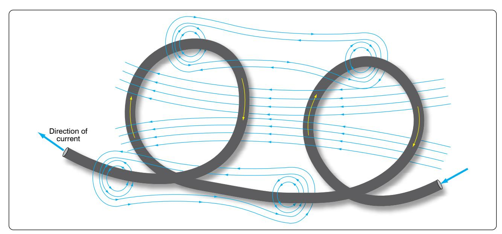

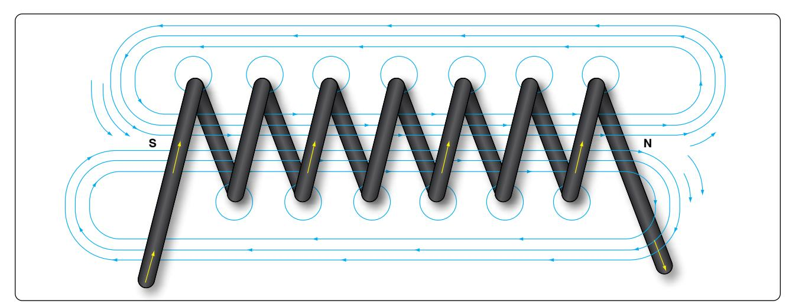

**Figure 12-32.** *Magnetic field around a conductor with two loops.*

**Figure 12-33.** *Magnetic field of a coil.*

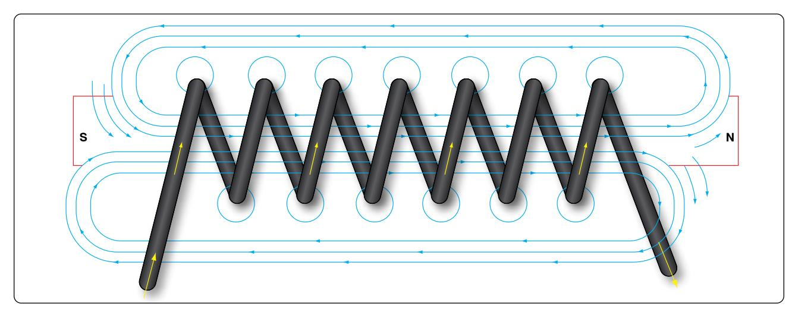

**Figure 12-34.** *Electromagnet.*

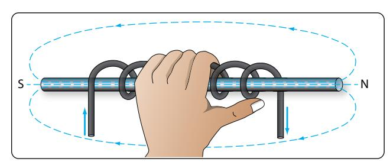

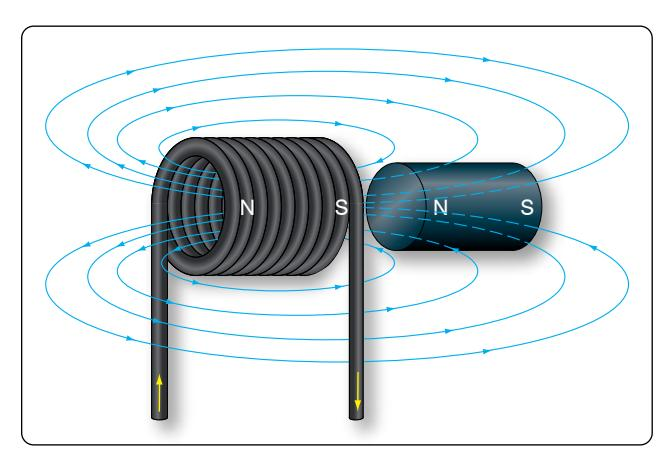

**Figure 12-35.** *Left-hand rule applied to a coil.*

conductor that ultimately moves the electrons in a flow. The symbol for emf is the capital letter "E."

Across the terminals of the typical aircraft battery, voltage can be measured as the potential difference of 12 volts or 24 volts. That is to say that between the two terminal posts of the battery, there is an emf of 12 or 24 volts available to push current through a circuit. Relatively free electrons in the negative terminal move toward the excessive number of positive charges in the positive terminal. Recall from the discussion on static electricity that like charges repel each other but opposite charges attract each other. The net result is a flow or current through a conductor. There cannot be a flow in a conductor unless there is an applied voltage from a battery, generator, or ground power unit. The potential difference, or the voltage across any two points in an electrical system, can be determined by:

Where

E = *E*

Q E = Potential difference in volts *E* = Energy expanded or absorbed in joules (J) Q = Charge measured in coulombs

*Figure 12-37* illustrates the flow of electrons of electric current. Two interconnected water tanks demonstrate that when a difference of pressure exists between the two tanks, water flows until the two tanks are equalized. The illustration shows the level of water in tank A to be at a higher level, reading 10 psi (higher potential energy) than the water level in tank B, reading 2 psi (lower potential energy). Between the two tanks, there is 8-psi potential difference. If the valve in the interconnecting line between the tanks is opened, water flows from tank A into tank B until the level of water (potential energy) of both tanks is equalized. It is important to note that it was not the pressure in tank A that caused the water to flow; rather, it was the difference in pressure between tank A and tank B that caused the flow.

This comparison illustrates the principle that electrons move, when a path is available, from a point of excess electrons (higher potential energy) to a point deficient in electrons (lower potential energy). The force that causes this movement is the potential difference in electrical energy between the two points. This force is called the electrical pressure or the potential difference or the electromotive force (electron moving force).

# **Current**

Electrons in motion make up an electric current. This electric current is usually referred to as "current" or "current flow," no matter how many electrons are moving. Current is a measurement of a rate at which a charge flows through some region of space or a conductor. The moving charges are the free electrons found in conductors, such as copper, silver, aluminum, and gold. The term "free electron" describes a condition in some atoms where the outer electrons are loosely bound to their parent atom. These loosely bound electrons can be easily motivated to move in a given direction when an external source, such as a battery, is applied to the circuit. These electrons are attracted to the positive terminal of the battery, while the negative terminal is the source of the electrons. The greater amount of charge moving through the conductor in a given amount of time translates into a current.

Current = Charge Time or I = Q t

Where:

I = current in amperes (A) Q = charge in coulombs (C)

T = time

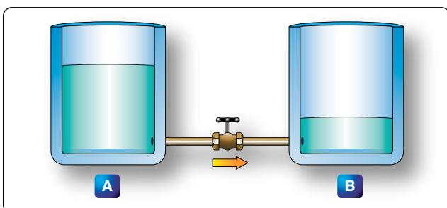

**Figure 12-37.** *Difference of pressure.*

The System International (SI) unit for current is the ampere (A), where

1A = 1 C s

One ampere (A) of current is equivalent to 1 coulomb (C) of charge passing through a conductor in 1 second. One coulomb of charge equals 6.28 billion electrons. The symbol used to indicate current in formulas or on schematics is the capital letter "I."

When current flow is one direction, it is called direct current (DC). Later in the handbook, the form of current that periodically oscillates back and forth within the circuit is discussed. The present discussion is only concerned with the use of DC.

The velocity of the charge is actually an average velocity and is called drift velocity. To understand the idea of drift velocity, think of a conductor in which the charge carriers are free electrons. These electrons are always in a state of random motion similar to that of gas molecules. When a voltage is applied across the conductor, an emf creates an electric field within the conductor and a current is established. The electrons do not move in a straight direction but undergo repeated collisions with other nearby atoms. These collisions usually knock other free electrons from their atoms, and these electrons move on toward the positive end of the conductor with an average velocity called the drift velocity, which is relatively a slow speed. To understand the nearly instantaneous speed of the effect of the current, it is helpful to visualize a long tube filled with steel balls as shown in *Figure 12-38*. It can be seen that a ball introduced in one end of the tube, which represents the conductor, will immediately cause a ball to be emitted at the opposite end of the tube. Thus, electric current can be viewed as instantaneous, even though it is the result of a relatively slow drift of electrons.

# **Ohm's Law (Resistance)**

The two fundamental properties of current and voltage are related by a third property known as resistance. In any electrical circuit, when voltage is applied to it, a current results. The resistance of the conductor determines the amount of current that flows under the given voltage. In most cases, the greater the circuit resistance, the less the current. If the resistance is reduced, then the current increases. This relation is linear in nature and is known as Ohm's Law.

By having a linearly proportional characteristic, it is meant that if one unit in the relationship increases or decreases by a certain percentage, the other variables in the relationship increase or decrease by the same percentage. An example would be if the voltage across a resistor is doubled, then the current through the resistor doubles. It should be added that this relationship is true only if the resistance in the circuit remains constant. If the resistance changes, current also changes. A graph of this relationship is shown in *Figure 12-39*, which uses a constant resistance of 20Ω. The relationship between voltage and current in this example shows voltage plotted horizontally along the X axis in values from 0 to 120 volts, and the corresponding values of current are plotted vertically in values from 0 to 6.0 amperes along the Y axis. A straight line drawn through all the points where the voltage and current lines meet represents the equation I = E⁄20 and is called a linear relationship.

If E = 10 V Then 10 V 20 Ω = 0.5 A If E = 60 V Then 60 V 20 Ω = 3 A If E = 120 V Then 120V 20 Ω = 6 A

Ohm's Law may be expressed as an equation, as follows:

Equation 1

I = E R

I = current in amperes (A)

E = voltage (V)

R = resistance (Ω)

Where I is current in amperes, E is the potential difference measured in volts, and R is the resistance measured in ohms.

**Figure 12-38.** *Electron movement.*

If any two of these circuit quantities are known, the third may be found by simple algebraic transposition. With this equation, we can calculate current in a circuit if the voltage and resistance are known. This same formula can be used to calculate voltage. By multiplying both sides of the equation 1 by R, we get an equivalent form of Ohm's Law, which is:

Equation 2 E = I (R)

Finally, if we divide equation 2 by I, we solve for resistance, This relationship is true only if the resistance in the circuit remains constant. If the resistance changes, current also changes. A graph of this relationship is shown in *Figure 12-39*, which uses a constant resistance of 20Ω. The relationship between voltage and current in this example shows voltage plotted horizontally along the X axis in values from 0 to 120 volts. The corresponding values of current are plotted vertically in values from 0 to 6.0 amperes along the Y axis. A straight line drawn through all the points where the voltage and current lines meet represents the equation I = E⁄20 and is called a linear relationship.

Equation 3

R = E I

All three formulas presented in this section are equivalent to each other and are simply different ways of expressing Ohm's Law.

The various equations, which may be derived by transposing the basic law, can be easily obtained by using the triangles in *Figure 12-40*.

The triangles containing E, R, and I are divided into two parts, with E above the line and I × R below it. To determine an unknown circuit quantity when the other two are known, cover the unknown quantity with a thumb. The location of the remaining uncovered letters in the triangle indicate the mathematical operation to be performed. For example, to find I, refer to *Figure 12-40A*, and cover I with the thumb. The uncovered letters indicate that E is to be divided by R, or I = E⁄R. To find R, refer to *Figure 12-40B*, and cover R with the thumb. The result indicates that E is to be divided by I, or R = E⁄I. To find E, refer to *Figure 12-40C*, and cover E with the thumb. The result indicates I is to be multiplied by R, or E = I × R. This chart is useful when learning to use Ohm's Law. It should be used to supplement the beginner's knowledge of the algebraic method.

# **Resistance of a Conductor**

While wire of any size or resistance value may be used, the word "conductor" usually refers to materials that offer low resistance to current flow, and the word "insulator" describes materials that offer high resistance to current. There is no distinct dividing line between conductors and insulators; under the proper conditions, all types of material conduct some current. Materials offering a resistance to current flow midway between the best conductors and the poorest conductors (insulators) are sometimes referred to as "semiconductors," and find their greatest application in the field of transistors.

The best conductors are materials, chiefly metals, which possess a large number of free electrons; conversely, insulators are materials having few free electrons. The best conductors are silver, copper, gold, and aluminum; but some nonmetals, such as carbon and water, can be used as conductors. Materials such as rubber, glass, ceramics, and plastics are such poor conductors that they are usually used as insulators. The current flow in some of these materials is so low that it is usually considered zero. The unit used to measure resistance is called the ohm. The symbol for the ohm is the Greek letter omega (Ω). In mathematical formulas, the capital letter "R" refers to resistance. The resistance of a conductor and the voltage applied to it determine the number of amperes of current flowing through the conductor. Thus, 1 ohm of resistance limits the current flow to 1 ampere in a conductor to which a voltage of 1 volt is applied.

# **Factors Affecting Resistance**

- 1. The resistance of a metallic conductor is dependent on the type of conductor material. It has been pointed out that certain metals are commonly used as conductors because of the large number of free electrons in their outer orbits. Copper is usually considered the best available conductor material, since a copper wire of a particular diameter offers a lower resistance to current flow than an aluminum wire of the same diameter. However, aluminum is much lighter than copper, and for this reason, as well as cost considerations, aluminum is often used when the weight factor is important.
- 2. The resistance of a metallic conductor is directly proportional to its length. The longer the length of a given size of wire, the greater the resistance. *Figure 12-41* shows two wire conductors of different lengths. If 1 volt of electrical pressure is applied across

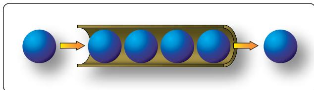

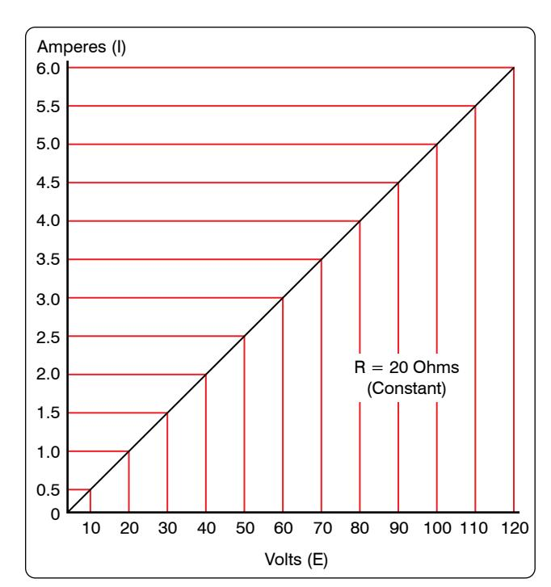

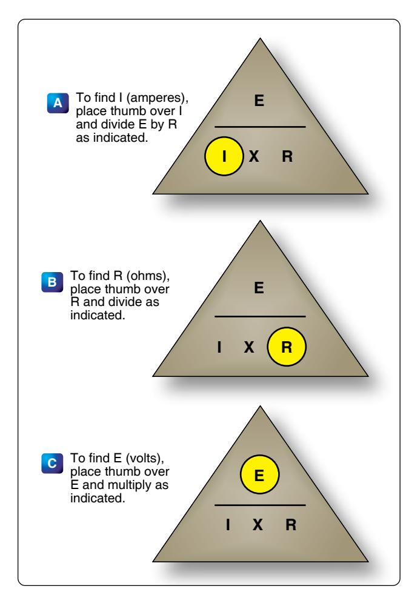

**Figure 12-39.** *Voltage vs. current in a constant-resistance circuit.*

**Figure 12-40.** *Ohm's law chart.*

the two ends of the conductor that is 1 foot in length, and the resistance to the movement of free electrons is assumed to be 1 ohm, the current flow is limited to 1 ampere. If the same size conductor is doubled in length, the same electrons set in motion by the 1 volt applied now find twice the resistance; consequently, the current flow is reduced by one-half.

- 3. The resistance of a metallic conductor is inversely proportional to the cross-sectional area. This area may be triangular or even square, but is usually circular. If the cross-sectional area of a conductor is doubled, the resistance to current flow is reduced in half. This is true because of the increased area in which an electron can move without collision or capture by an atom. Thus, the resistance varies inversely with the cross-sectional area of a conductor.
- 4. The fourth major factor influencing the resistance of a conductor is temperature. Although some substances, such as carbon, show a decrease in resistance as the ambient (surrounding) temperature increases, most materials used as conductors increase in resistance as temperature increases. The resistance of a few alloys, such as constantan and Manganin™, change very little as the temperature changes. The amount of increase in the resistance of a 1 ohm sample of a conductor, per degree rise in temperature above 0° Centigrade (C), the assumed standard, is called the temperature coefficient of resistance. For each metal, this is a different value. For example, for copper the value is approximately

0.00427 ohm. Thus, a copper wire having a resistance of 50 ohms at a temperature of 0 °C has an increase in resistance of 50 × 0.00427, or 0.214 ohm, for each degree rise in temperature above 0 °C. The temperature coefficient of resistance must be considered where there is an appreciable change in temperature of a conductor during operation. Charts listing the temperature coefficient of resistance for different materials are available. *Figure 12-42* shows a table for "resistivity" of some common electric conductors.

The resistance of a material is determined by four properties: material, length, area, and temperature. The first three properties are related by the following equation at T = 20 °C (room temperature):

(ρ × 1) A R =

Where

R = resistance in ohms

ρ = resistivity of the material in circular

mil-ohms per foot

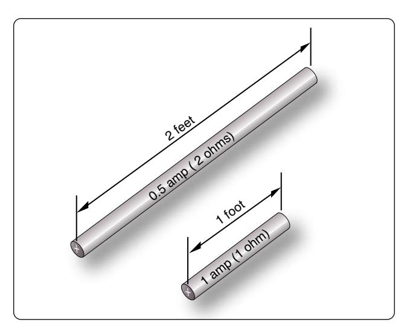

| Conductor Material | Resistivity (ohm meters @ 20 °C) |
|--------------------|----------------------------------|
| Silver             | 1.64 × 10-8                      |
| Copper             | 1.72 × 10-8                      |
| Aluminum           | 2.83 × 10-8                      |
| Tungsten           | 5.50 × 10-8                      |
| Nickel             | 7.80 × 10-8                      |
| Iron               | 12.0 × 10-8                      |
| Constantan         | 49.0 × 10-8                      |
| Nichrome II        | 110 × 10-8                       |

l = length of the sample in feet A = area in circular mils

#### **Resistance and Relation to Wire Sizing** *Circular Conductors (Wires/Cables)*

Because it is known that the resistance of a conductor is directly proportional to its length, and if we are given the resistance of the unit length of wire, we can readily calculate the resistance of any length of wire of that particular material having the same diameter. Also, because it is known that the resistance of a conductor is inversely proportional to its cross-sectional area, and if we are given the resistance of a length of wire with unit cross-sectional area, we can calculate the resistance of a similar length of wire of the same material with any cross-sectional area. Therefore, if we know the resistance of a given conductor, we can calculate the resistance for any conductor of the same material at the same temperature. From the relationship:

(ρ × 1) A R =

It can also be written:

R1 R2 =11 12 =A1 A2

If we have a conductor that is 1 meter (m) long with a crosssectional area of 1 (millimeter) mm2 and has a resistance of 0.017 ohm, what is the resistance of 50 m of wire from the same material but with a cross-sectional area of 0.25 mm2?

R1 R2 =11 12 =A1 A2 R2 = 0.017 Ω × 50 m 1 m × 1 mm2 0.25 mm2 = 3.4 Ω

While the SI units are commonly used in the analysis of electric circuits, electrical conductors in North America are still being manufactured using the foot as the unit length and the mil (one thousandth of an inch) as the unit of diameter. Before using the equation R = (ρ × l)⁄A to calculate the resistance of a conductor of a given American wire gauge (AWG) size, the cross-sectional area in square meters must be determined using the conversion factor 1 mil = 0.0254 mm. The most convenient unit of wire length is the foot. Using these standards, the unit of size is the mil-foot. Thus, a wire has unit size if it has a diameter of 1 mil and length of 1 foot.

In the case of using copper conductors, we are spared the task of tedious calculations by using a table as shown in *Figure 12-43*. Note that cross-sectional dimensions listed on the table are such that each decrease of one gauge number equals a 25 percent increase in the cross-sectional area. Because of this, a decrease of three gauge numbers represents an increase in cross-sectional area of approximately 2:1. Likewise, change of ten wire gauge numbers represents a 10:1 change in cross-sectional area—also, by doubling the crosssectional area of the conductor, the resistance is cut in half. A decrease of three wire gauge numbers cuts the resistance of the conductor of a given length in half.

# *Rectangular Conductors (Bus Bars)*

To compute the cross-sectional area of a conductor in square mils, the length in mils of one side is squared. In the case of a rectangular conductor, the length of one side is multiplied by the length of the other. For example, a common rectangular bus bar (large, special conductor) is 3 ⁄8 inch thick and 4 inches wide. The 3 ⁄8-inch thickness may be expressed as 0.375 inch. Since 1,000 mils equal 1 inch, the width in inches can be converted to 4,000 mils. The cross-sectional area of the rectangular conductor is found by converting 0.375 to mils (375 mils × 4,000 mils = 1,500,000 square mils).

# **Power and Energy**

# **Power in an Electrical Circuit**

This section covers power in the DC circuit and energy consumption. Whether referring to mechanical or electrical systems, power is defined as the rate of energy consumption

| AWG Number | Diameter in mils | Ohms per 1,000 ft. |
|------------|------------------|--------------------|
| 0000       | 460.0            | 0.04901            |
| 000        | 409.6            | 0.06180            |
| 00         | 364.8            | 0.07793            |
| 0          | 324.9            | 0.09827            |
| 1          | 289.3            | 0.1239             |
| 2          | 257.6            | 0.1563             |
| 3          | 229.4            | 0.1970             |
| 4          | 204.3            | 0.2485             |
| 5          | 181.9            | 0.3133             |
| 6          | 162.0            | 0.3951             |
| 8          | 128.5            | 0.6282             |
| 10         | 101.9            | 0.9989             |
| 12         | 80.81            | 1.588              |
| 14         | 64.08            | 2.525              |
| 16         | 50.82            | 4.016              |
| 18         | 40.30            | 6.385              |
| 20         | 31.96            | 10.15              |
| 22         | 25.35            | 16.14              |
| 24         | 20.10            | 25.67              |
| 26         | 15.94            | 40.81              |
| 28         | 12.64            | 64.9               |
| 30         | 10.03            | 103.2              |

**Figure 12-43.** *Conversion table when using copper conductors.*

or conversion within that system—that is, the amount of energy used or converted in a given amount of time.

From the scientific discipline of physics, the fundamental expression for power is:

 *E* t P =

Where

P = power measured in watts (W)

*E* = energy (*E* is a script E) measured in joules (J)

and t = time measured in seconds (s)

The unit measurement for power is the watt (W), which refers to a rate of energy conversion of 1 joule (J)/second. Therefore, the number of joules consumed in 1 second is equal to the number of watts. A simple example is given below.

Suppose 300 joules of energy is consumed in 10 seconds. What would be the power in watts?

General formula energy time P = 300 J 10 s P = P = 30 W

The watt is named for James Watt, the inventor of the steam engine. Watt devised an experiment to measure the power of a horse in order to find a means of measuring the mechanical power of his steam engine. One horsepower is required to move 33,000 pounds 1 foot in 1 minute. Since power is the rate of doing work, it is equivalent to the work divided by time. Stated as a formula, this is:

33,000 ft-lb 60 s Power = P = 550 ft-lb/s

Electrical power can be rated in a similar manner. For example, an electric motor rated as a 1 horsepower motor requires 746 watts of electrical energy.

### **Power Formulas Used in the Study of Electricity**

When current flows through a resistive circuit, energy is dissipated in the form of heat. Recall that voltage can be expressed in the terms of energy and charge as given in the expression:

 *E* Q E =

E = potential difference in volts

*E* = energy expanded or absorbed in joules (J)

Q = charge measured in coulombs

Current I, can also be expressed in terms of charge and time as given by the expression:

Charge Time Current = or Q T I =

Where:

I = current in amperes (A)

Q = charge in coulombs (C) T = time

When voltage *W*⁄Q and current Q⁄t are multiplied, the charge Q is divided out leaving the basic expression from physics:

E × I = *E* Q ×  *E* t = *E* t = power

can then be given by the equation:

General Power Formula P = I (E)

Where P = Power I = Current E = Volts

If a circuit has a known voltage of 24 volts and a current of 2 amps, then the power in the circuit is:

P = I (E) P = 2A (24V) P = 48W

Now recall Ohm's Laws that state E = I(R). If we now substitute IR for E in the general formula, we get a formula that uses only current I and resistance R to determine the power in a circuit.

P = I (IR)

Second Form of Power Equation

P = I2R

If a circuit has a known current of 2 amps and a resistance of 100 Ω, then the power in the circuit is:

P = I2R P = (2A)2 100 Ω P = 400 W

Using Ohm's Law, which can be stated as I = E⁄R, we can again make a substitution such that power can be determined by knowing only the voltage (E) and resistance (R) of the circuit.

E R P = ( )(E)

Third Form of Power Equation

E2 R P =

If a circuit has a known voltage of 24 volts and a resistance of 20 Ω, then the power in the circuit is:

E2 R P = (24 V)2 20 Ω P = P = 28.8 W

#### **Power in a Series & Parallel Circuit**

The total power dissipated in both a series and parallel circuit is equal to the sum of the power dissipated in each resistor in the circuit. Power is simply additive and can be stated as:

PT = P1 + P2 + P3 + ……PN

*Figure 12-44* provides a summary of all the possible transpositions of the Ohm's Law formula and the power formula.

#### **Energy in an Electrical Circuit**

Energy is defined as the ability to do work. Because power is the rate of energy usage, power used over a span of time is actually energy consumption. If power and time are multiplied together, we get energy.

The joule is defined as a unit of energy. There is another unit of measure which is perhaps more familiar. Because power is expressed in watts and time in seconds, a unit of energy can be called a watt-second (Ws) or more recognizable from the electric bill, a kilowatt-hour (kWh). Refer to Chapter 5, Physics, for further discussion on energy.

#### **Sources of Electricity**

Electrical energy can be produced in a number of methods. The four most common are pressure, chemical, thermal, and light.

#### *Pressure Source*

This form of electrical generation is commonly known as piezoelectric (piezo or piez taken from Greek: to press; pressure; to squeeze) is a result of the application of mechanical pressure on a dielectric or non-conducting crystal. The most common piezoelectric materials used today are crystalline quartz and Rochelle salt. However, Rochelle salt is being superseded by other materials, such as barium titanate.

The application of a mechanical stress produces an electric polarization, which is proportional to this stress. This polarization establishes a voltage across the crystal. If a circuit is connected across the crystal, a flow of current can be observed when the crystal is loaded (pressure is applied). An opposite condition can occur, where an application of a voltage between certain faces of the crystal can produce a mechanical distortion. This effect is commonly referred to as the piezoelectric effect.

Piezoelectric materials are used extensively in transducers for converting a mechanical strain into an electrical signal. Such devices include microphones, phonograph pickups, and vibration-sensing elements. The opposite effect, in which a mechanical output is derived from an electrical signal input, is also widely used in headphones and loudspeakers.

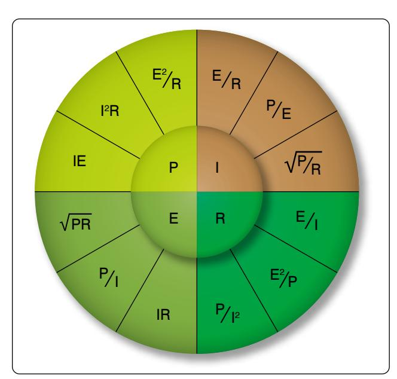

**Figure 12-44.** *Ohm's Law formula.*

#### *Chemical Source*

Chemical energy can be converted into electricity; the most common form of this is the battery. A primary battery produces electricity using two different metals in a chemical solution like alkaline electrolyte, where a chemical reaction between the metals and the chemicals frees more electrons in one metal than in the other. One terminal of the battery is attached to one of the metals, such as zinc; the other terminal is attached to the other metal, such as manganese oxide. The end that frees more electrons develops a positive charge and the other end develops a negative charge. If a wire is attached from one end of the battery to the other, electrons flow through the wire to balance the electrical charge.

# *Thermal Sources*

The most common source of thermal electricity found in the aviation industry comes from thermocouples. Thermocouples are widely used as temperature sensors. They are cheap and interchangeable, have standard connectors, and can measure a wide range of temperatures. Thermocouples are pairs of dissimilar metal wires joined at least at one end, which generate a voltage between the two wires that is proportional to the temperature at the junction. This is called the Seebeck effect, in honor of Thomas Seebeck who first noticed the phenomena in 1821. It was also noticed that different metal combinations have a different voltage difference. Thermocouples are used to measure cylinder head temperatures and Turbine Inlet Temperature (TIT).

#### *Light Sources*

A solar cell or a photovoltaic cell is a device that converts

light energy into electricity. Fundamentally, the device contains certain chemical elements that, when exposed to light energy, release electrons.

Photons in sunlight are taken in by the solar panel or cell, where they are absorbed by semiconducting materials, such as silicon. Electrons in the cell are broken loose from their atoms, allowing them to flow through the material to produce electricity. The complementary positive charges that are also created are called holes (absence of electron) and flow in the direction opposite of the electrons in a silicon solar panel.

Solar cells have many applications and have historically been used in earth orbiting satellites or space probes, handheld calculators, and wrist watches.

#### **Schematic Representation of Electrical Components**

The schematic is the most common place where the technician finds electronic symbols. The schematic is a diagram that depicts the interconnection and logic of an electronic or electrical circuit. Many symbols are employed for use in the schematic drawings, blueprints, and illustrations. This section briefly outlines some of the more common symbols and explains how to interpret them.

# *Conductors*

The schematic depiction of a conductor is simple enough. This is generally shown as a solid line. However, the line types may vary depending on who drew the schematics and what exactly the line represents. While the solid line is used to depict the wire or conductor, schematics used for aircraft modifications can also use other line types, such as a dashed to represent "existing" wires prior to modification and solid lines for "new" wires.

There are two methods employed to show wire crossovers and wire connections. *Figure 12-45* shows the two methods of drawing wires that cross: version A and version B. *Figure 12-46* shows the two methods for drawing wire that connect version A and version B. If version A in *Figure 12-45* is used to depict crossovers, then version A for wire connections in *Figure 12-46* is used. The same can then be said about the use of version B methods. The technician encounters both in common use.

*Figure 12-47* shows a few examples of the more common wire types that the technician encounters in schematics. They are the single wire, single shielded, shielded twisted pair or double, and the shielded triple. This is not an exhaustive list of wire types but a fair representation of how they are depicted. *Figure 12-47* also shows the wires having a wire number. These are shown for the sake of illustration and vary from one

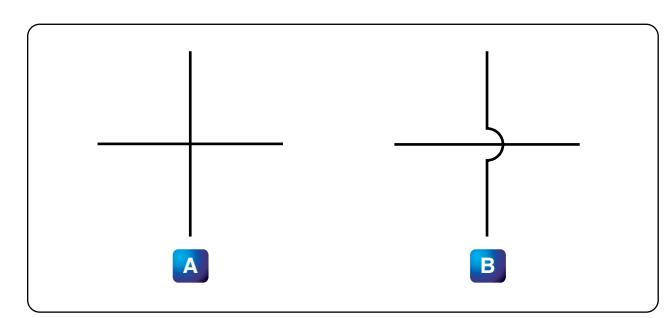

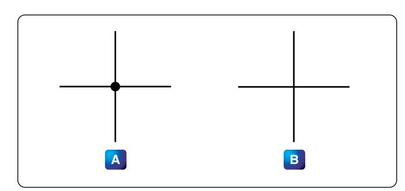

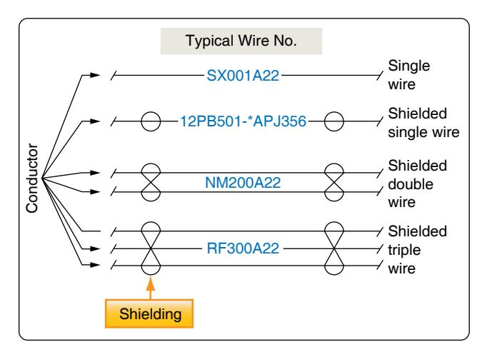

**Figure 12-45.** *Unconnected crossover wires.*

**Figure 12-46.** *Connected wires.*

**Figure 12-47.** *Common wire types.*

installation agency to another. For further understanding of a wire numbering system, consult the appropriate wiring guide published by the agency that drew the prints. Regardless of the specifics of the wire numbering system, organizations that exercise professional wiring practices have the installed wire marked in some manner. This is an aid to the technician who has to troubleshoot or modify the system at a later date.

# **Types of Resistors**

# **Fixed Resistor**

Fixed resistors have built into the design a means of opposing current. *[Figure 12-48]* The general use of a resistor in a circuit is to limit the amount of current flow. There are a number of methods used in construction and sizing of a resistor that control properties, such as resistance value, the precision of the resistance value, and the ability to dissipate heat. While in some applications the purpose of the resistive element is used to generate heat, such as in propeller anti-ice boots, heat typically is the unwanted loss of energy.

# **Carbon Composition**

The carbon composed resistor is constructed from a mixture of finely grouped carbon/graphite, an insulation material for filler, and a substance for binding the material together. The amount of graphite in relation to the insulation material determines the ohmic or resistive value of the resistor. This mixture is compressed into a rod, which is fitted with axial leads or "pigtails." The finished product is sealed in an insulating coating for isolation and physical protection.

There are other types of fixed resistors in common use. Included in this group are:

- Carbon film
- Metal-oxide
- Metal film
- Metal glaze

The construction of a film resistor is accomplished by depositing a resistive material evenly on a ceramic rod. This resistive material can be graphite for the carbon film resistor, nickel chromium for the metal film resistor, metal and glass for the metal glaze resistor, and metal and an insulating oxide for the metal-oxide resistor.

# **Resistor Ratings**

#### *Color Code*

It is very difficult to manufacture a resistor to an exact standard of ohmic values. Fortunately, most circuit requirements are not extremely critical. For many uses, the actual resistance in ohms can be 20 percent higher or lower than the value marked on the resistor without causing difficulty. The percentage variation between the marked value and the actual value of a resistor is known as the "tolerance" of a resistor. A resistor coded for a 5 percent tolerance is not more than 5 percent higher or lower than the value indicated by the color code.

The resistor color code is made up of a group of colors, numbers, and tolerance values. Each color is represented by a number, and in most cases, by a tolerance value. *[Figure 12-49]*

When the color code is used with the end-to-center band marking system, the resistor is normally marked with bands of color at one end of the resistor. The body or base color of the resistor has nothing to do with the color code, and in no way indicates a resistance value. To prevent confusion, this body is never the same color as any of the bands indicating resistance value.

| Color Black | Resistor color code Number 0 | Tolerance — |
|-------------|------------------------------|-------------|
| Brown       | 1                            | 1%          |
| Red         | 2                            | 2%          |
| Orange      | 3                            | 3%          |
| Yellow      | 4                            | 4%          |
| Green       | 5                            | 5%          |
| Blue        | 6                            | 6%          |
| Violet      | 7                            | 7%          |
| Gray        | 8                            | 8%          |
| White       | 9                            | 9%          |
| Gold        | —                            | 5%          |
| Silver      | —                            | 10%         |
| No color    | —                            | 20%         |

**Figure 12-49.** *Resistor color code.*

# **Color Band Decoding**

When the end-to-center band marking system is used, either three or four bands mark the resistor.

- 1. The first color band (nearest the end of the resistor) indicates the first digit in the numerical resistance value. This band is never gold or silver in color.
- 2. The second color band always indicates the second digit of ohmic value. It is never gold or silver in color. *[Figure 12-50]*
- 3. The third color band indicates the number of zeros to be added to the two digits derived from the first and second bands, except in the following two cases:
  - (a) If the third band is gold in color, the first two digits must be multiplied by 10 percent.
  - (b) If the third band is silver in color, the first two digits must be multiplied by 1 percent.
- 4. If there is a fourth color band, it is used as a multiplier for percentage of tolerance, as indicated in the color code chart in *Figure 12-49*. If there is no fourth band, the tolerance is understood to be 20 percent.

*Figure 12-50* illustrates the rules for reading the resistance value of a resistor marked with the end-to-center band system. This resistor is marked with three bands of color, which must be read from the end toward the center.

There is no fourth color band; therefore, the tolerance is understood to be 20 percent. 20 percent of 250,000 Ω, equals 50,000 Ω.

Since the 20 percent tolerance is plus or minus,

Maximum resistance = 250,000 Ω + 50,000 Ω = 300,000 Ω

Minimum resistance = 250,000 Ω − 50,000 Ω

= 200,000 Ω

The following paragraphs provide a few extra examples of resistor color band decoding. *Figure 12-51* contains a resistor with another set of colors. This resistor code should be read as follows:

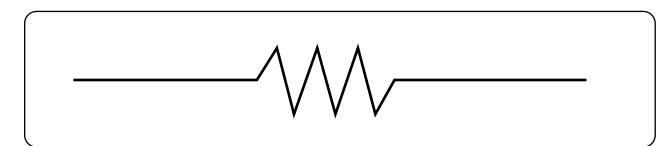

The resistance of this resistor is 86,000 ±10 percent ohms. The maximum resistance is 94,600 ohms, and the minimum resistance is 77,400 ohms.

Another example is the resistance of the resistor in *Figure 12-52* is 960 ±5 percent ohms. The maximum resistance is 1,008 ohms, and the minimum resistance is 912 ohms. Sometimes circuit considerations dictate that the tolerance must be smaller than 20 percent. *Figure 12-53* shows an example of a resistor with a 2 percent tolerance. The resistance value of this resistor is 2,500 ±2 percent ohms. The maximum resistance is 2,550 ohms, and the minimum resistance is 2,450 ohms.

*Figure 12-54* contains an example of a resistor with a black third color band. The color code value of black is zero, and the third band indicates the number of zeros to be added to the first two digits.

In this case, a zero number of zeros must be added to the first two digits; therefore, no zeros are added. Thus, the resistance value is 10 ±1 percent ohms. The maximum resistance is 10.1 ohms, and the minimum resistance is 9.9 ohms. There are two exceptions to the rule stating the third color band indicates the number of zeros. The first of these exceptions is illustrated in *Figure 12-55*. When the third band is gold in color, it indicates that the first two digits must be multiplied by 10 percent. The value of this resistor in this case is:

10 × 0.10 ±2% = 1 = 0.02 ohms

When the third band is silver, as is the case in *Figure 12-56*, the first two digits must be multiplied by 1 percent. The value

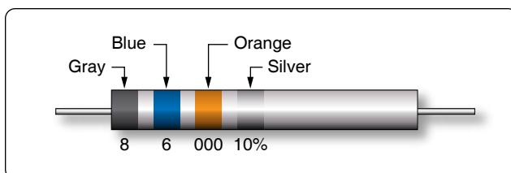

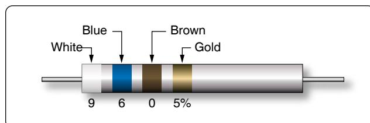

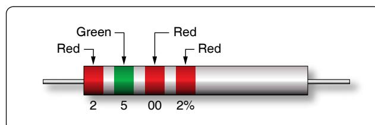

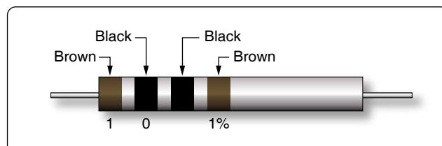

**Figure 12-51.** *Resistor color code example.*

**Figure 12-52.** *Resistor color code example.*

**Figure 12-53.** *Resistor with two percent tolerance.*

**Figure 12-54.** *Resistor with black third color band.*

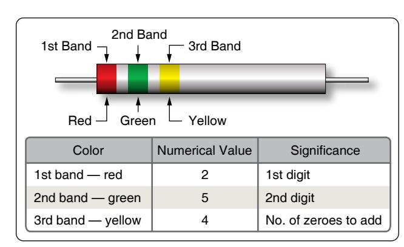

**Figure 12-50.** *End-to-center band marking.*

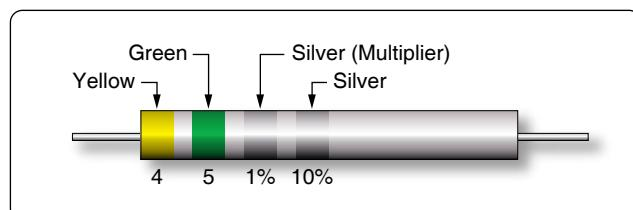

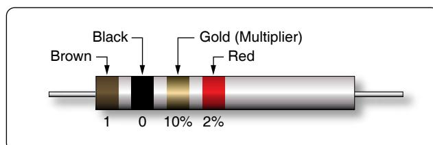

**Figure 12-55.** *Resistor with gold third band.*

# **Wire-Wound**

Wire-wound resistors typically control large amounts of current and have high power ratings. Resistors of this type are constructed by winding a resistance wire around an insulating rod usually made of porcelain. The windings are coated with an insulation material for physical protection and heat conduction. Both ends of the windings are connected to terminals, which are used to connect the resistor to a circuit. *[Figure 12-57]*

A wire-wound resistor with tap is a special type of fixed resistor that can be adjusted. These adjustments can be made by moving a slide bar tap or by moving the tap to a preset incremental position. While the tap may be adjustable, the adjustments are usually set at the time of installation to a specific value and then operated in service as a fixed resistor. Another type of wire-wound resistor is constructed of Manganin wire, used when high precision is needed.

# **Variable Resistors**

Variable resistors are constructed so that the resistive value can be changed easily. This adjustment can be manual or automatic, and the adjustments can be made while the system that it is connected to is in operation. There are two basic types of manual adjustors: the rheostat and the potentiometer.

# *Rheostat*

A rheostat is a variable resistor used to vary the amount of current flowing in a circuit. *[Figure 12-58] Figure 12-59* shows a rheostat connected in series with an ordinary resistance in a series circuit. As the slider arm moves from point A to B, the amount of rheostat resistance (AB) is increased. Since the rheostat resistance and the fixed resistance are in series, the total resistance in the circuit also increases, and the current in the circuit decreases. On the other hand, if the slider arm is moved toward point A, the total resistance decreases and the current in the circuit increases.

**Figure 12-57.** *Wire-wound resistors.*

# *Potentiometer*

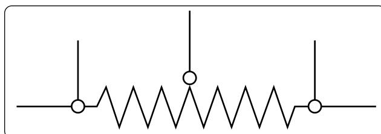

The potentiometer is considered a three-terminal device. *[Figure 12-60]* As illustrated, terminals 1 and 2 have the entire value of the potentiometer resistance between them. Terminal 3 is the wiper or moving contact. Through this wiper, the resistance between terminals 1 and 3 or terminals 2 and 3 can be varied. While the rheostat is used to vary the current in a circuit, the potentiometer is used to vary the voltage in a circuit. A typical use for this component can be found in the volume controls on an audio panel and input devices for flight data recorders, among many other applications.

In *Figure 12-61A*, a potentiometer is used to obtain a variable voltage from a fixed voltage source to apply to an electrical load. The voltage applied to the load is the voltage between points 2 and 3. When the slider arm is moved to point 1, the entire voltage is applied to the electrical device (load); when the arm is moved to point 3, the voltage applied to the load is zero. The potentiometer makes possible the application of any voltage between zero and full voltage to the load.

The current flowing through the circuit of *Figure 12-61* leaves the negative terminal electron flow of the battery and divides one part flowing through the lower portion of the potentiometer (points 3 to 2) and the other part through the load. Both parts combine at point 2 and flow through the upper portion of the potentiometer (points 2 to 1) back to the positive terminal of the battery. In View B of *Figure 12-61*, a potentiometer and its schematic symbol are shown.

In choosing a potentiometer resistance, the amount of current drawn by the load should be considered, as well as the current flow through the potentiometer at all settings of the slider arm. The energy of the current through the potentiometer is dissipated in the form of heat.

It is important to keep this wasted current as small as possible by making the resistance of the potentiometer as large as practicable. In most cases, the resistance of the potentiometer can be several times the resistance of the load. *Figure 12-62* shows how a potentiometer can be wired to function as a rheostat.

#### *Linear Potentiometers*

In a linear potentiometer, the resistance between both terminal and the wiper varies linearly with the position of the wiper. To illustrate, one quarter of a turn on the potentiometer results in one quarter of the total resistance. The same relationship exists when one-half or three-quarters of potentiometer movement. *[Figure 12-63]*

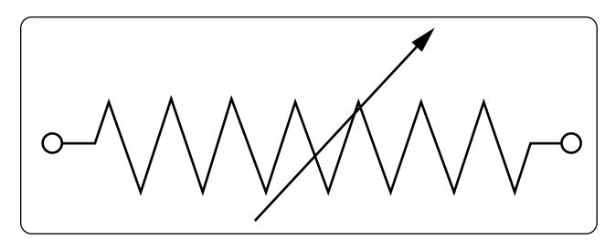

tapered potentiometer. *[Figure 12-64]* Keep in mind that one-half of full potentiometer travel does not necessarily correspond to one-half the total resistance of the potentiometer.

# **Thermistors**

The thermistor is a type of a variable resistor that is temperature sensitive. *[Figure 12-65]* This component has a negative temperature coefficient, which means that as the sensed temperature increases, the resistance of the thermistor decreases.

# **Photoconductive Cells**

The photoconductive cell is similar to the thermistor. Like the thermistor, it has a negative temperature coefficient. Unlike the thermistor, the resistance is controlled by light intensity. This kind of component can be found in radio control heads where the intensity of the ambient light is sensed through the photoconductive cell resulting in the backlighting of the control heads to adjust to the flight deck lighting conditions. *[Figure 12-66]*

# **Circuit Protection Devices**

Perhaps the most serious trouble in a circuit is a direct short. The term "direct short" describes a situation in which some point in the circuit, where full system voltage is present, comes in direct contact with the ground or return side of the circuit. This establishes a path for current flow that contains no resistance other than that present in the wires carrying the current, and these wires have very little resistance.

Most wires used in aircraft electrical circuits are small gauge, and their current carrying capacity is quite limited. The size of the wires used in any given circuit is determined

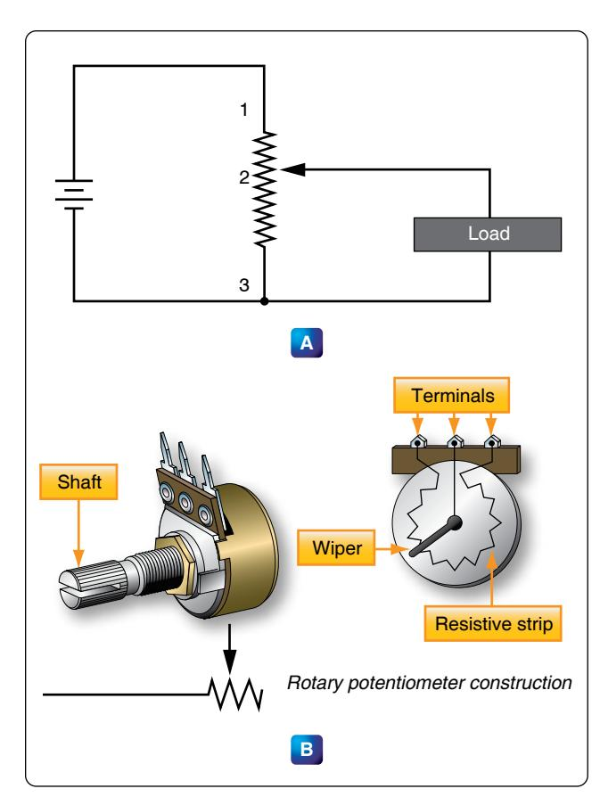

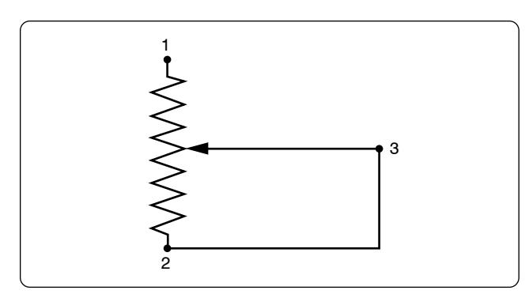

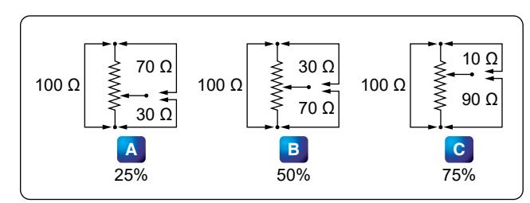

**Figure 12-61.** *Potentiometer and schematic symbol.*

**Figure 12-62.** *Potentiometer wired to function as rheostat.*

**Figure 12-63.** *Linear potentiometer schematic.*

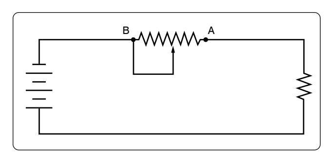

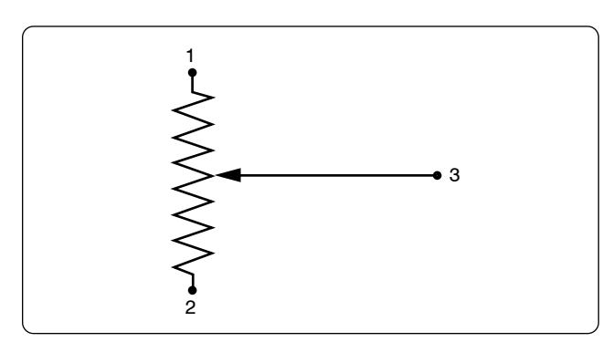

**Figure 12-59.** *Rheostat connected in series.*

**Figure 12-60.** *Potentiometer schematic symbol.*

by the amount of current the wires are expected to carry under normal operating conditions. Any current flow in excess of normal, such as the case of a direct short, would cause a rapid generation of heat. If the excessive current flow caused by the short is left unchecked, the heat in the wire could cause a portion of the wire to melt and at the very least, open the circuit.

To protect aircraft electrical systems from damage and failure caused by excessive current, several kinds of protective devices are installed in the systems. Fuses, circuit breakers, thermal protectors, and arc fault circuit breakers are used for this purpose.

Circuit protective devices, as the name implies, all have a common purpose—to protect the units and the wires in the circuit. Some are designed primarily to protect the wiring and to open the circuit in such a way as to stop the current flow when the current becomes greater than the wires can safely carry. Other devices are designed to protect a unit in the circuit by stopping the current flow to it when the unit becomes excessively warm.

#### **Fuse**

Fuses are used to protect the circuit from over current conditions. *[Figure 12-67A]* The fuse is installed in the circuit so that all the current in the circuit passes through it. In most fuses, the strip of metal is made of an alloy of tin and bismuth, which melts and opens the circuit when the current exceeds

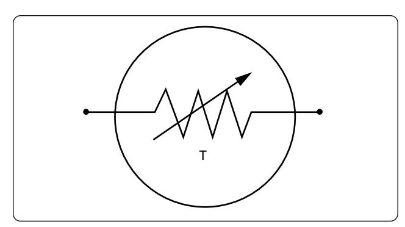

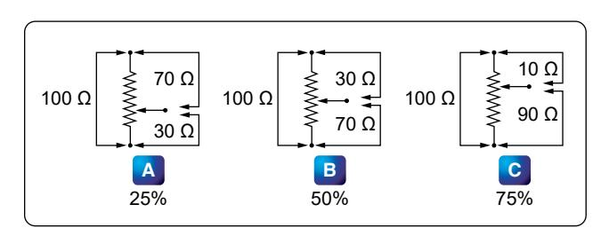

**Figure 12-65.** *Schematic symbol for thermistor.*

**Figure 12-66.** *Photoconductive cell schematic symbol component.*

**Figure 12-64.** *Tapered potentiometer.*

the rated capacity of the fuse. For example, if a 5-amp fuse is placed into a circuit, the fuse allows currents up to 5 amps to pass. Because the fuse is intended to protect the circuit, it is quite important that its capacity match the needs of the circuit in which it is used.

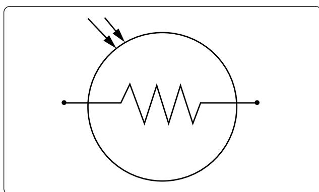

When replacing a fuse, consult the applicable manufacturer's instructions to be sure a fuse of the correct type and capacity is installed. Fuses are installed in two types of fuse holders in aircraft. "Plug-in holders" or in-line holders are used for small and low capacity fuses. "Clip" type holders are used for heavy high capacity fuses and current limiters.

# **Current Limiter**

The current limiter is very much like the fuse. However, the current limiter link is usually made of copper and will stand a considerable overload for a short period of time. Like the fuse, it opens up in an over current condition in heavy current circuits such as 30 amp or greater. These are used primarily to sectionalize an aircraft circuit or bus. Once the limiter is opened, it must be replaced. The schematic symbol for the current limiter shows two triangles pointing to each other with a line on both sides of the triangles. [*Figure 12-67B*].

# **Circuit Breaker**

The circuit breaker is commonly used in place of a fuse and is designed to break the circuit and stop the current flow when the current exceeds a predetermined value. Unlike the fuse, the circuit breaker can be reset; whereas the fuse or current limiter must be replaced. *[Figure 12-68]*

There are several types of circuit breakers in general use in aircraft systems. One is a magnetic type. When excessive current flows in the circuit, it makes an electromagnet strong enough to move a small armature, which trips the breaker. Another type is the thermal overload switch or breaker. This consists of a bimetallic strip which, when it becomes overheated from excessive current, bends away from a catch on the switch lever and permits the switch to trip open.

Most circuit breakers must be reset by hand. If the overload condition still exists, the circuit breaker trips again to prevent damage to the circuit. At this point, it is usually not advisable to continue resetting the circuit breaker, but to initiate troubleshooting to determine the cause. Repeated resetting of a circuit breaker can lead to circuit or component damage or worse, the possibility of a fire or explosion. Automatic reset type circuit breakers are not allowed in aircraft. Circuit breakers are commonly grouped on a circuit breaker panel that is accessible to the flight crew. *Figure 12-69* shows a circuit breaker and a circuit breaker panel.

# *Arc Fault Circuit Breaker*

In recent years, the arc fault circuit breaker has begun to provide an additional layer of protection beyond that of the thermal protection already provided by conventional circuit breakers. The arc fault circuit breaker monitors the circuit for an electrical arcing signature, which can indicate possible wiring faults and unsafe conditions. These conditions can lead to fires or loss of power to critical systems. The arc fault circuit breaker is only beginning to make an appearance in the aircraft industry and is not widely used like the thermal type of circuit breaker.

# **Thermal Protectors**

A thermal protector, or switch, is used to protect a motor. It is designed to open the circuit automatically whenever the temperature of the motor becomes excessively high. It has two positions—open and closed. The most common use for a thermal switch is to keep a motor from overheating. If a

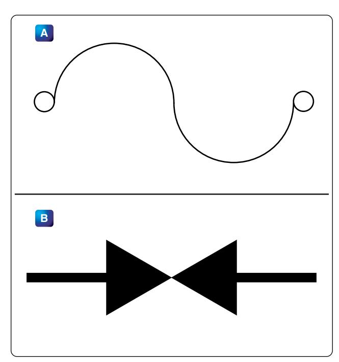

**Figure 12-67.** *Schematic symbol for fuse (A) and current limiter (B).*

malfunction in the motor causes it to overheat, the thermal switch breaks the circuit intermittently.

The thermal switch contains a bimetallic disk, or strip, that bends and breaks the circuit when it is heated. This occurs because one of the metals expands more than the other when they are subjected to the same temperature. When the strip or disk cools, the metals contract and the strip returns to its original position and closes the circuit.

#### **Control Devices**

Components in the electrical circuits are typically not all intended to operate continuously or automatically. Most of them are meant to operate at certain times, under certain conditions, to perform very definite functions. There must be some means of controlling their operation. Either a switch, or a relay, or both may be included in the circuit for this purpose.

#### *Switches*

Switches control the current flow in most aircraft electrical circuits. A switch is used to start, to stop, or to change the direction of the current flow in the circuit. The switch in each circuit must be able to carry the normal current of the circuit and must be insulated heavily enough for the voltage of the circuit. *Figure 12-70* shows various switches used in aircraft electrical systems.

An understanding of some basic definitions of the switch is necessary before any of the switch types are discussed. The number of poles, throws, and positions they have designates toggle switches, as well as some other type of switches.

Pole—the switch's movable blade or contactor. The number of poles is equal to the number of circuits, or paths for current flow, that can be completed through the switch at any one time.

Throw—indicates the number of circuits, or paths for current, that it is possible to complete through the switch with each pole or contactor.

Positions—indicates the number of places at which the operating device (toggle, plunger, and so forth) comes to rest and at the same time open or close one or more circuits.

# *Toggle Switch*

#### *Single-Pole, Single-Throw (SPST)*

The single-pole, single-throw (SPST) switch allows a connection between two contacts. One of two conditions exist. Either the circuit is open in one position or closed in the other position. *[Figure 12-71]*

#### *Single-Pole, Double-Throw (SPDT)*

The single-pole, double-throw (SPDT) switch is shown in *Figure 12-72*. With this switch, contact between one contact can be made between one contact and the other.

#### *Double-Pole, Single-Throw (DPST)*

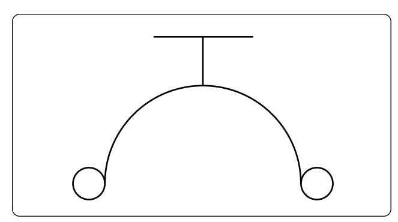

The double-pole, single-throw (DPST) switch connection can be made between one set of contacts and either of two other sets of contacts. *[Figure 12-73]*

#### *Double-Pole, Double-Throw (DPDT)*

The schematic symbol for the double-pole, double-throw (DPDT) switch is shown in *Figure 12-74*. This type of switch makes a connection from one set of contacts to either of two other sets of contacts.

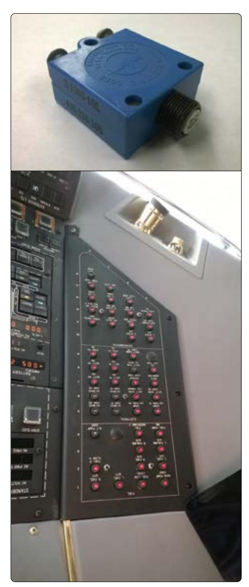

**Figure 12-69.** *Circuit breaker assembly for aircraft electrical system.*

**Figure 12-70.** *Various types of switches used in modern aircraft.*

and must be held in the ON position to complete the circuit is a momentary contact two-position switch. One that comes to rest at either of two positions, opening the circuit in one position and closing it in another, is a two-position switch. A toggle switch that comes to rest at any one of three positions is a three-position switch.

A switch that stays open, except when it is held in the closed position, is a normally open switch (usually identified as NO). One that stays closed, except when it is held in the open position is a normally closed switch (NC). Both kinds are spring loaded to their normal position and return to that position as soon as they are released.

Locking toggles require the operator to pull out on the switch toggle before moving it in to another position. Once in the new position, the switch toggle is release back into a lock, which then prevents the switch from inadvertently being moved.

#### *Microswitches*

A microswitch opens or closes a circuit with a very small movement of the tripping device (1 ⁄16 inch or less). This is what gives the switch its name, since micro means small.

Microswitches are usually pushbutton switches. They are used primarily as limit switches to provide automatic control of landing gears, actuator motors, and the like. *Figure 12-75* shows a normally closed microswitch in cross-section and illustrates how these switches operate. When the operating plunger is pressed in, the spring and the movable contact are pushed, opening the contacts and the circuit. *Figure 12-76* shows a pushbutton microswitch.

# *Rotary Selector Switches*

A rotary selector switch takes the place of several switches. When the knob of the switch is rotated, the switch opens one circuit and closes another. Ignition switches and voltmeter selector switches are typical examples of this kind of switch. *[Figure 12-77]*

#### *Pushbutton Switches*

Pushbutton switches have one stationary contact and one

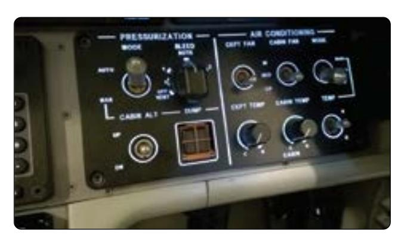

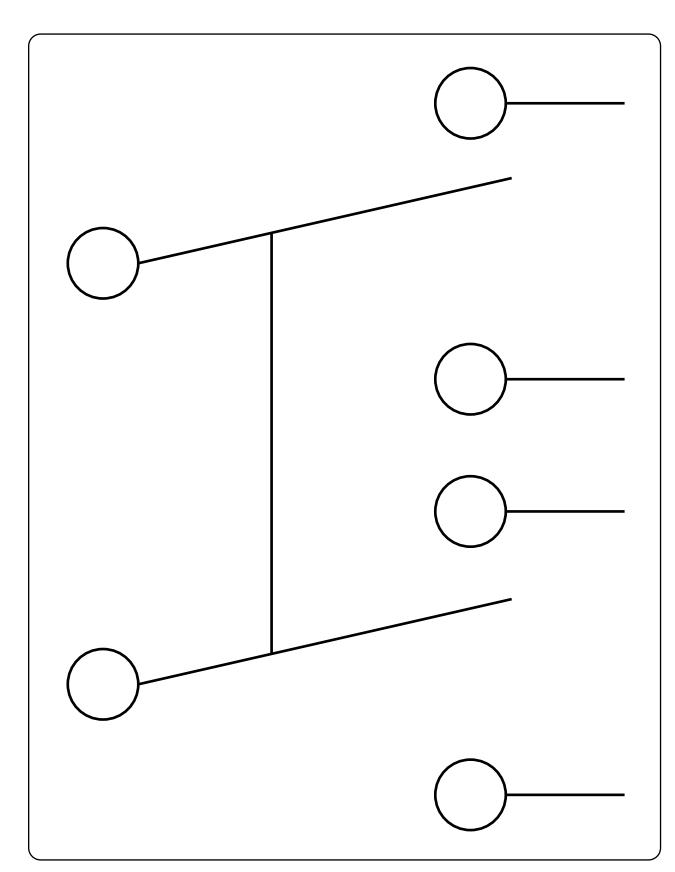

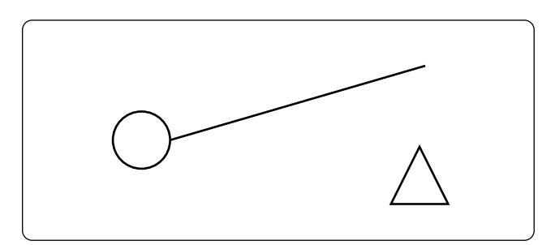

**Figure 12-74.** *Double-pole, double-throw switch schematic symbol.*

**Figure 12-72.** *Single-pole, double-throw switch schematic symbol.*

**Figure 12-71.** *Single-pole, single-throw switch schematic symbol.*

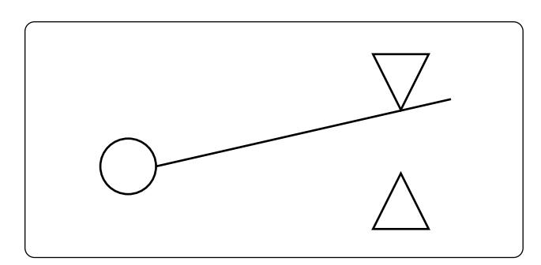

movable contact. The movable contact is attached to the pushbutton. The pushbutton is either an insulator itself or is insulated from the contact. This switch is spring loaded and designed for momentary contact.

# *Lighted Pushbutton Switches*

Another more common switch found in today's aircraft is the lighted pushbutton switch. This type of switch takes the form of a 5 ⁄8-inch to 1-inch cube with incandescent or LED lights to indicate the function of the switch. Switch designs come in a number of configurations; the two most common are the alternate action and momentary action and usually have a two-pole or four-pole switch body. Other less common

switch actions are the alternate and momentary holding coil configurations. The less known holding or latching coil switch bodies are designed to have a magnetic coil inside the switch body that is energized through two contacts in the base of the switch. When the coil is energized and the switch is pressed, the switch contacts remain latched until power is removed from the coil. This type of design allows for some degree of remote control over the switch body. *[Figure 12-78]*

The display optics of the lighted pushbutton switch provide the crew with a clear message that is visible under a wide range of lighting conditions with very high luminance and wide viewing angles. While some displays are simply a transparent screen that is backlit by an incandescent light, the higher quality and more reliable switches are available in sunlight readable displays and night vision (NVIS) versions. Due to the sunlight environment of the flight deck, displays utilizing standard lighting techniques "washout" when viewed in direct sunlight. Sunlight readable displays are designed to minimize this effect.

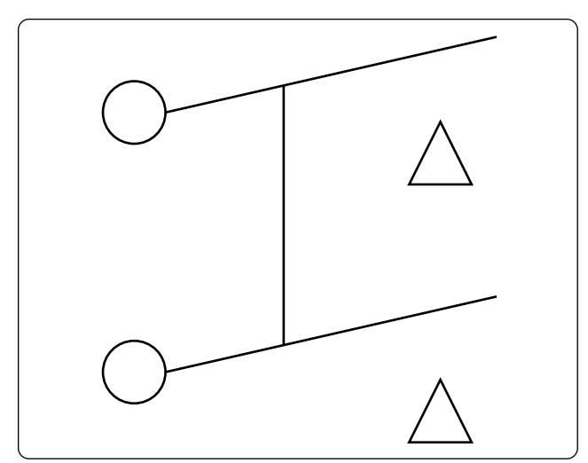

Lighted pushbutton switches can also be used in applications where a switch is not required and the optics are only for indications. This type of an indicator is commonly called an annunciator.

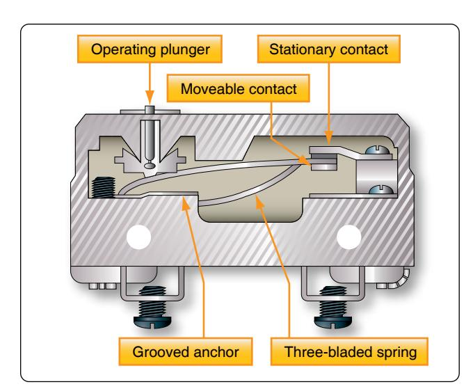

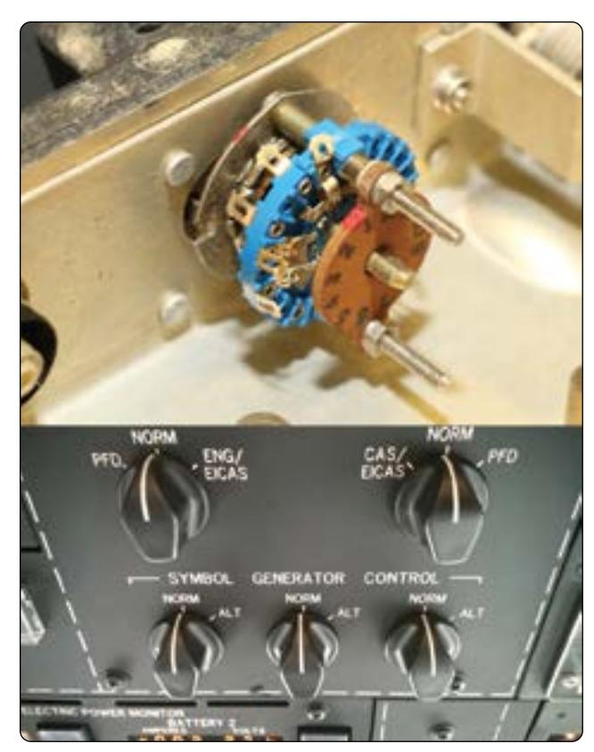

**Figure 12-75.** *Cross-section of a microswitch.*

**Figure 12-77.** *Rotary switches.*

# *Dual In-Line Parallel (DIP) Switches*

The acronym "DIP" switch is defined as Dual In-Line Parallel switch in reference to the physical layout. DIP switches are commonly found in card cages, and line replaceable units (LRU) and are used in most cases to adjust gains, control configurations, and so forth. Each one of the switches is generally an SPST slide or rocker switch. The technician may find this switch in packages ranging in size from DIP2 through DIP32. Some of the more common sizes are DIP4 and DIP8.

#### *Switch Guards*

Switch guards are covers that protect a switch from unintended operation. Prior to the operation of the switch, the guard is usually lifted. Switch guards are commonly found on systems such as fire suppression and override logics for various systems. *Figure 12-79A* shows a traditional switch with a guard while *Figure 12-79B* shows a pushbutton switch with a guard. The guard needs to be moved before the switch can be pushed.

#### *Relays*

A relay is simply an electromechanical switch where a small amount of current can control a large amount of current. *[Figure 12-80]* When a voltage is applied to the coil of the

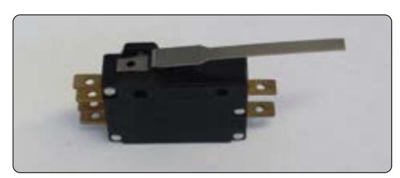

relay, the electromagnet is energized due to the current. When energized, an electromagnetic field pulls the common (C) or arm of the relay down. When the arm or common is pulled down, the circuit between the arm and the normally closed (NC) contacts is opened and the circuit between the arm and the normally open (NO) contacts are closed. When the energizing voltage is removed, the spring returns the arm contacts back to the normally closed (NC) contacts. The relay usually has two connections for the coil. The (+) side is designated as X1 and the ground-side of the coil is designated as X2.

# **Series DC Circuits**

The series circuit is the most basic electrical circuit and provides a good introduction to basic circuit analysis. The series circuit represents the first building block for all of the circuits to be studied and analyzed. *Figure 12-81* shows this simple circuit with nothing more than a voltage source or battery, a conductor, and a resistor. This is classified as a series circuit because the components are connected end-toend, so that the same current flows through each component equally. There is only one path for the current to take and the battery and resistor are in series with each other. Next is to make a few additions to the simple circuit in *Figure 12-81*.

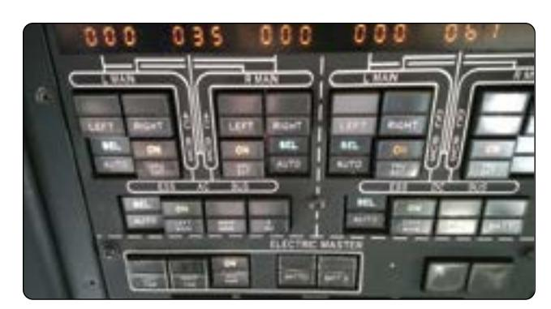

**Figure 12-79.** *(A) Red guarded switch. (B) Pushbutton switch with a guard.*

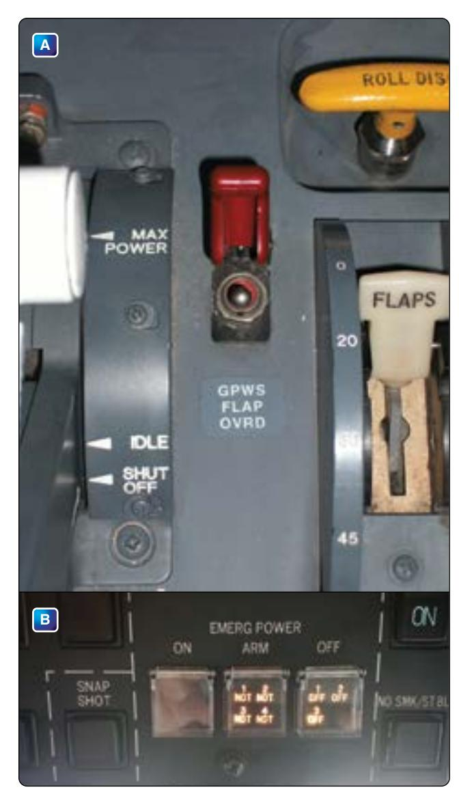

**Figure 12-78.** *Lighted pushbutton switches.*

detail regarding the values. With these values, we can now begin to learn more about the nature of the circuit. In this configuration, there is a 12-volt DC source in series with two resistors, R1 = 10 Ω and R2 = 30 Ω. For resistors in a series configuration, the total resistance of the circuit is equal to the sum of the individual resistors. The basic formula is:

RT = R1 + R2 + R3 + ………RN

For *Figure 12-82*, this will be:

RT = 10 Ω + 30 Ω

RT = 40 Ω

Now that the total resistance of the circuit is known, the current for the circuit can be determined. In a series circuit, the current cannot be different at different points within the circuit. The current through a series circuit is always the same through each element and at any point. Therefore, the current in the simple circuit can now be determined using Ohm's Law:

Formula, E = I (R)

Solve for current, E R I =

The variables, E = 12 V and RT = 40 Ω

Substitute variables, 12 V 40 Ω I =

Current in circuits, I = 0.3 A

Ohm's Law describes a relationship between the variables of voltage, current, and resistance that is linear and easy to illustrate with a few extra calculations. First is the act of changing the total resistance of the circuit while the other two remain constant. In this example, the RT of the circuit in *Figure 12-82* is doubled.

Formula, E = I (R)

Solve for current, E R I =

The variables, E = 12 V and RT = 80 Ω

Substitute variables, 12 V 80 Ω I =

Current in circuits, I = 0.15 A

It can be seen quantitatively and intuitively that when the resistance of the circuit is doubled, the current is reduced by half the original value.

Next, reduce the RT of the circuit in *Figure 12-82* to half of its original value. The effects on the total current are:

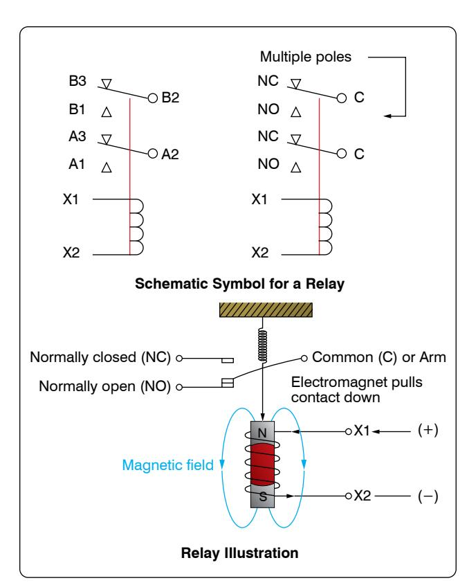

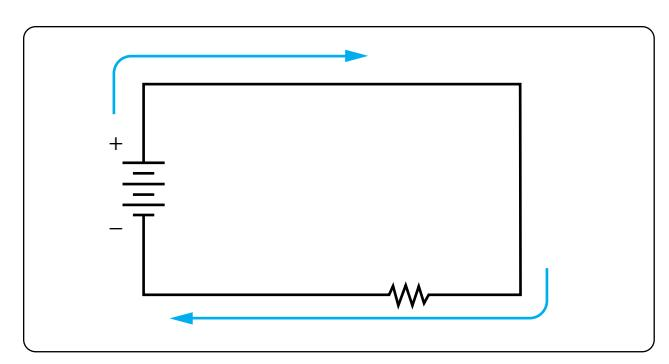

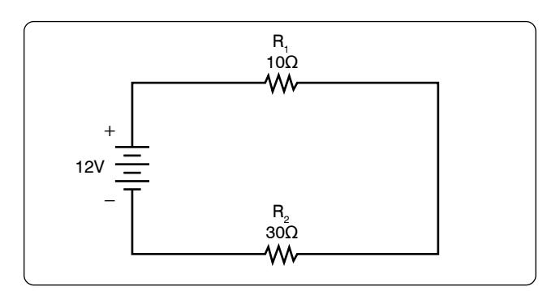

**Figure 12-80.** *Basic relay.*

**Figure 12-81.** *Simple DC circuit.*

Formula, E = I (R)

Solve for current, E R I =

The variables, E = 12 V and RT = 20 Ω

Substitute variables, 12 V 20 Ω I =

Current in circuits, I = 0.6 A

# **Voltage Drops & Further Application of Ohm's Law**

The example circuit in *Figure 12-83* is used to illustrate the idea of voltage drop. It is important to differentiate between voltage and voltage drop when discussing series circuits. Voltage drop refers to the loss in electrical pressure or emf caused by forcing electrons through a resistor. Because there are two resistors in the example, there are separate voltage drops. Each drop is associated with each individual resistor. The amount of electrical pressure required to force a given number of electrons through a resistance is proportional to the size of the resistor.

In *Figure 12-83*, the values used to illustrate the idea of voltage drop are:

Current, I = 1 mA

R1 = 1 kΩ

R2 = 3 kΩ

R3 = 5 kΩ

The voltage drop across each resistor is calculated using Ohm's Law. The drop for each resistor is the product of each resistance and the total current in the circuit. Keep in mind that the same current flows through series resistor.

Formula: E = I (R)

Voltage across R1: E1 = IT (R1) E1 = 1 mA (1 kΩ) = 1 volt

Voltage across R2: E2 = IT (R2) E2 = 1 mA (3 kΩ) = 3 volt

Voltage across R3: E3 = IT (R3) E3 = 1 mA (5 kΩ) = 5 volt

The source voltage can now be determined, which can then be used to confirm the calculations for each voltage drop. Using Ohm's Law:

Formula: E = I (R)

Source voltage = current × the total resistance ES = I (RT)

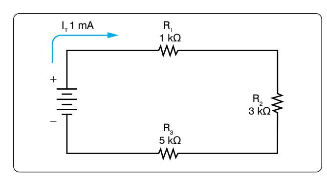

**Figure 12-83.** *Example of three resistors in series.*

RT = 1 kΩ + 3 kΩ + 5 kΩ RT = 9 kΩ

Now: ES = I (RT)

Substitute ES = 1 mA (9 kΩ) ES = 9 volts

Simple checks to confirm the calculation and to illustrate the concept of the voltage drop add up the individual values of the voltage drops and compare them to the results of the above calculation.

1 volt + 3 volts + 5 volts = 9 volts

#### **Voltage Sources in Series**

A voltage source is an energy source that provides a constant voltage to a load. Two or more of these sources in series equals the algebraic sum of all the sources connected in series. The significance of pointing out the algebraic sum is to indicate that the polarity of the sources must be considered when adding up the sources. The polarity is indicated by a plus or minus sign depending on the source's position in the circuit.

In *Figure 12-84,* all of the sources are in the same direction in terms of their polarity. All of the voltages have the same sign when added up. In the case of *Figure 12-84*, three cells of a value of 1.5 volts are in series with the polarity in the same direction. The addition is simple enough:

ET = 1.5v + 1.5v + 1.5v = +4.5 volts

However, in *Figure 12-85*, one of the three sources has been turned around, and the polarity opposes the other two sources. Again the addition is simple:

ET = + 1.5v − 1.5v + 1.5v = +1.5 volts

#### **Kirchhoff's Voltage Law**

A law of basic importance to the analysis of an electrical circuit is Kirchhoff's Voltage Law. This law simply states that the algebraic sum of all voltages around a closed path or loop is zero. Another way of saying it: the sum of all the voltage drops equals the total source voltage. A simplified formula showing this law is shown below:

With three resistors in the circuit:

ES – E1 – E2 – E3 … –EN = 0 volts

Notice that the sign of the source is opposite that of the individual voltage drops. Therefore, the algebraic sum equals zero. Written another way:

ES = E1 + E2 + E3 … +EN

The source voltage equals the sum of the voltage drops. The polarity of the voltage drop is determined by the direction of the current flow. When going around the circuit, notice that the polarity of the resistor is opposite that of the source voltage. The positive on the resistor is facing the positive on the source, and the negative on the resistor is facing the negative on the source.

*Figure 12-86* illustrates the very basic idea of Kirchhoff's Voltage Law. There are two resistors in this example. One has a drop of 14 volts and the other has a drop of 10 volts. The source voltage must equal the sum of the voltage drops around the circuit. By inspection, it is easy to determine the source voltage as 24 volts.

*Figure 12-87* shows a series circuit with three voltage drops and one voltage source rated at 24 volts. Two of the voltage drops are known. However, the third is not known. Using Kirchhoff's Voltage Law, the third voltage drop can be determined.

With three resistors in the circuit: ES – E1 – E2 – E3 = 0 volts

Substitute the known values:

24v – 12v – 10v − E3 = 0

Collect known values: 2v – E3 = 0

Solve for the unknown: E3 = 2 volts Determine the value of E4 in *Figure 12-88*. For this example, I = 200mA.

First, the voltage drop across each of the individual resistors must be determined.

E1 = I (R1) E1 = (200 mA) (10 Ω)

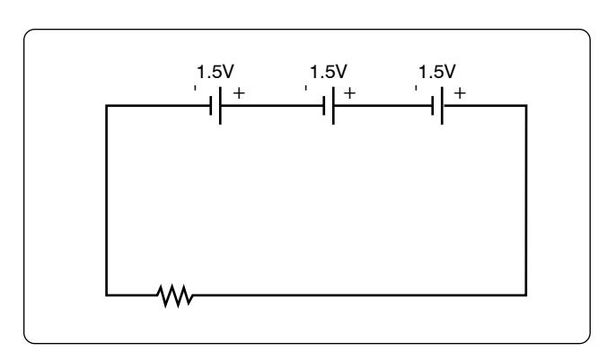

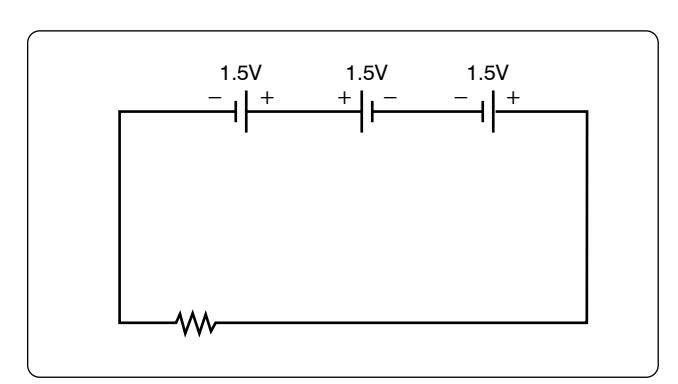

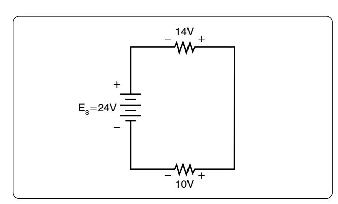

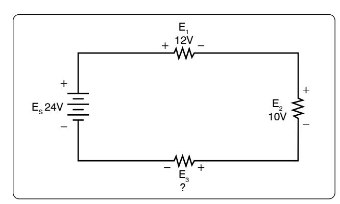

**Figure 12-84.** *Voltage sources in series add algebraically.*

**Figure 12-86.** *Kirchhoff's Voltage Law.*

Voltage drop across R1 E1 = 2 volts

E2 = I (R2) E2 = (200 mA) (50 Ω)

Voltage drop across R2 E2 = 10 volts

E3 = I (R3) E3 = (200 mA) (100 Ω)

Voltage drop across R3 E3 = 20 volts

Kirchhoff's Voltage Law is now employed to determine the voltage drop across E4.

With four resistors in the circuit ES – E1 – E2 – E3 – E4 = 0 volts

Substituting values:

100v – 2v – 10v – 20v – E4 = 0

Combine: 68v – E4 = 0

Solve for unknown: E4 = 68v

Using Ohm's Law and substituting in E4, the value for R4 can now be determined.

Ohm's Law: E I R =

Specific application: E4 I R4 =

Substitute values: 68 V 200 mA R4 =

Value for R4: R4 = 340 Ω

# **Voltage Dividers**

Voltage dividers are devices that make it possible to obtain more than one voltage from a single power source. A voltage divider usually consists of a resistor, or resistors connected in series, with fixed or movable contacts and two fixed terminal contacts. As current flows through the resistor, different voltages can be obtained between the contacts.

Series circuits are used for voltage dividers. The voltage divider rule allows the technician to calculate the voltage across one or a combination of series resistors without having to first calculate the current in the circuit. *[Figure 12-89]* Because the current flows through each resistor, the voltage drops are proportional to the ohmic values of the constituent resistors. To understand how a voltage divider works, examine *Figure 12-90* carefully and observe the following:

Each load draws a given amount of current: I1, I2, I3. In

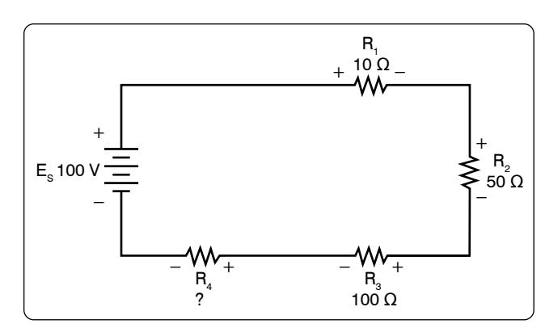

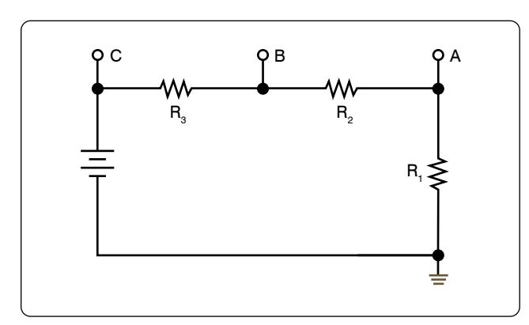

**Figure 12-88.** *Determine the unknown voltage drop.*

**Figure 12-89.** *A voltage divider circuit.*

addition to the load currents, some bleeder current (IB) flows. The current (IT) is drawn from the power source and is equal to the sum of all currents.

The voltage at each point is measured with respect to a common point. Note that the common point is the point at which the total current (IT) divides into separate currents (I1, I2, I3). Each part of the voltage divider has a different current flowing in it. The current distribution is as follows:

Through R1 — bleeder current (IB) Through R2 — IB + I1 Through R3 — IB + I1, + I2

The voltage across each resistor of the voltage divider is:

90 volts across R1 60 volts across R2 50 volts across R3

The voltage divider circuit discussed up to this point has had one side of the power supply (battery) at ground potential. In *Figure 12-91,* the common reference point (ground symbol) has been moved to a different point on the voltage divider. The voltage drop across R1 is 20 volts; however, since tap A is connected to a point in the circuit that is at the same potential as the negative side of the battery, the voltage between tap A and the reference point is a negative (−) 20 volts. Since resistors R2 and R3 are connected to the positive side of the battery, the voltages between the reference point and tap B or C are positive.

The following rules provide a simple method of determining negative and positive voltages: (1) If current enters a resistance flowing away from the reference point, the voltage drop across that resistance is positive in respect to the reference point; (2) if current flows out of a resistance toward the reference point, the voltage drop across that resistance is negative in respect to the reference point. It is the location of the reference point that determines whether a voltage is negative or positive.

Tracing the current flow provides a means for determining the voltage polarity. *Figure 12-92* shows the same circuit with the polarities of the voltage drops and the direction of current flow indicated.

The current flows from the negative side of the battery to R1. Tap A is at the same potential as the negative terminal of the battery since the slight voltage drop caused by the resistance of the conductor is disregarded; however, 20 volts of the source voltage are required to force the current through R1 and this 20-volt drop has the polarity indicated. Stated another way, there are only 80 volts of electrical pressure left in the circuit on the ground side of R1.

When the current reaches tap B, 30 more volts have been used to move the electrons through R2, and in a similar manner the remaining 50 volts are used for R3. But the voltages across R2 and R3 are positive voltages, since they are above ground potential.

*Figure 12-93* shows the voltage divider used previously. The voltage drops across the resistances are the same; however, the reference point (ground) has been changed. The voltage between ground and tap A is now a negative 100 volts, or the applied voltage.

The voltage between ground and tap B is a negative 80 volts, and the voltage between ground and tap C is a negative 50 volts.

# **Determining the Voltage Divider Formula**

*Figure 12-94* shows the example network of four resistors and a voltage source. With a few simple calculations, a formula for determining the voltage divisions in a series circuit can be determined.

The voltage drop across any particular resistor shall be called EX, where the subscript x is the value of a particular resistor (1, 2, 3, or 4). Using Ohm's Law, the voltage drop across any

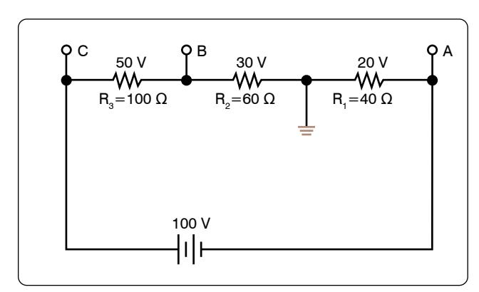

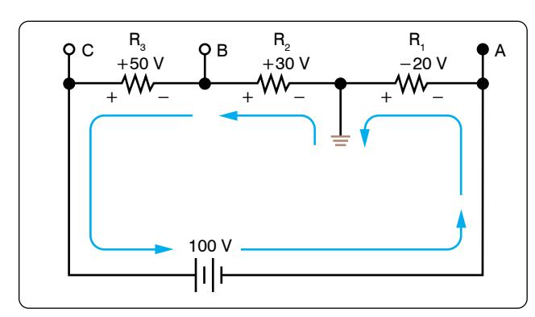

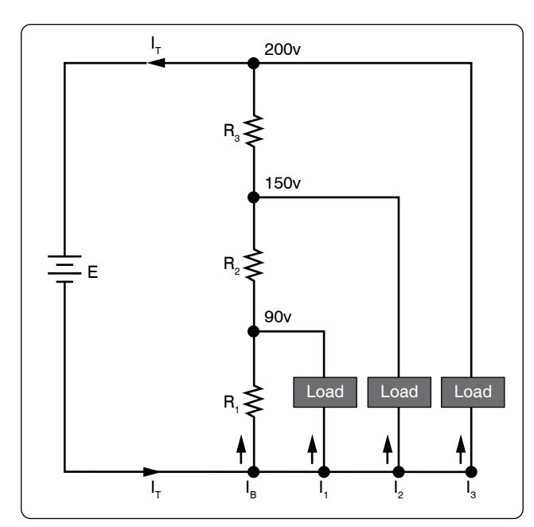

**Figure 12-92.** *Current flow through a voltage divider.*

**Figure 12-90.** *A typical voltage divider.*

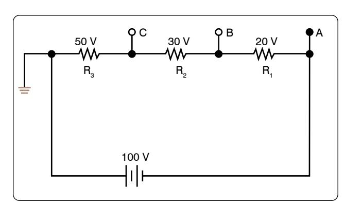

resistor can be determined.

Ohm's Law: EX = I (RX)

As seen earlier in the handbook, the current is equal to the source voltage divided by the total resistance of the series circuit.

Current: ES RT I =

The current equation can now be substituted into the equation for Ohm's Law.

Substitute: ES RT EX = ( )(RX) Algebraic rearrange: RX RT EX = ( )(ES)

This equation is the general voltage divider formula. The

explanation of this formula is that the voltage drop across any resistor or combination of resistors in a series circuit is equal to the ratio of the resistance value to the total resistance, divided by the value of the source voltage. *Figure 12-95* illustrates this with a network of three resistors and one voltage source.

RX RT EX = ( ) ES RT = 100 Ω + 300 Ω + 600 Ω = 1,000 Ω ES = 10 V

Voltage drop over 100 Ω resistor is:

100 Ω 1,000 Ω EX = ( ) 100 V E100Ω = 10 V

Voltage drop over 300 Ω resistor is:

300 Ω 1,000 Ω EX = ( ) 100 V E100 Ω = 30 V

Voltage drop over 600 Ω resistor is:

600 Ω 1,000 Ω EX = ( ) 100 V E100Ω = 60 V

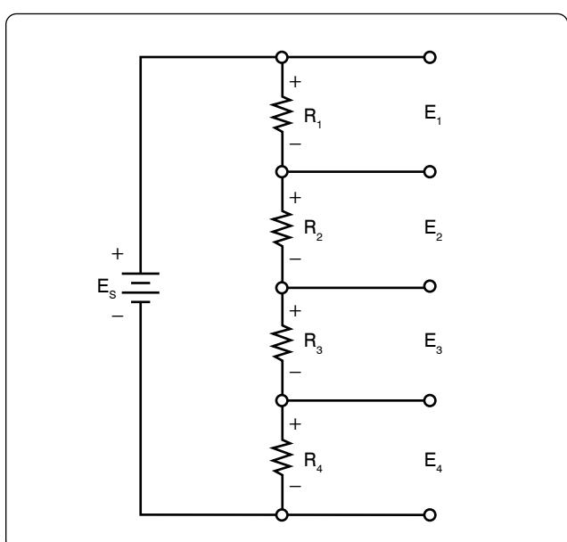

100 Ω 300 Ω 600 Ω + − + − + − + − R1 R E 2 S100 v R3

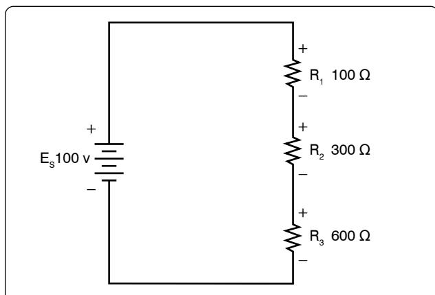

Checking work

ET = 10 V + 30 V + 60 V = 100 V

# **Parallel DC Circuits**

A circuit in which two of more electrical resistances or loads are connected across the same voltage source is called a parallel circuit. The primary difference between the series circuit and the parallel circuit is that more than one path is provided for the current in the parallel circuit. Each of these parallel paths is called a branch. The minimum requirements for a parallel circuit are the following:

- A power source
- Conductors
- A resistance or load for each current path
- Two or more paths for current flow

*Figure 12-96* depicts the most basic parallel circuit. Current flowing out of the source divides at point A in the diagram and goes through R1 and R2. As more branches are added to the circuit, more paths for the source current are provided.

# **Voltage Drops**

The first point to understand is that the voltage across any branch is equal to the voltage across all of the other branches.

# **Total Parallel Resistance**

The parallel circuit consists of two or more resistors connected in such a way as to allow current flow to pass through all of the resistors at once. This eliminates the need for current to pass one resistor before passing through the next. When resistors are connected in parallel, the total resistance of the circuit decreases. The total resistance of a parallel combination is always less than the value of the smallest resistor in the circuit. In the series circuit, the current has to pass through the resistors one at a time. This gave a resistance to the current equal the sum of all the resistors. In the parallel circuit, the current has several resistors that it can pass through, actually reducing the total resistance of the circuit in relation to any one resistor value.

The amount of current passing through each resistor varies according to its individual resistance. The total current of the circuit is the sum of the current in all branches. It can be determined by inspection that the total current is greater than that of any given branch. Using Ohm's Law to calculate the total resistance based on the applied voltage and the total current, it can be determined that the total resistance is less than any branch.

An example of this is if there was a circuit with a 100 Ω resistor and a 5 Ω resistor; while the exact value must be calculated, it still can be said that the combined resistance between the two is less than the 5 Ω.

# **Resistors in Parallel**

The formula for the total parallel resistance is as follows:

1 RT = + + + ... 1 R1 1 R2 1 R3 1 RN

If the reciprocal of both sides is taken, then the general formula for the total parallel resistance is:

RT = + + + ... 1 R1 1 R2 1 R3 1 RN 1

# **Two Resistors in Parallel**

Typically, it is more convenient to consider only two resistors at a time because this setup occurs in common practice. Any number of resistors in a circuit can be broken down into pairs. Therefore, the most common method is to use the formula

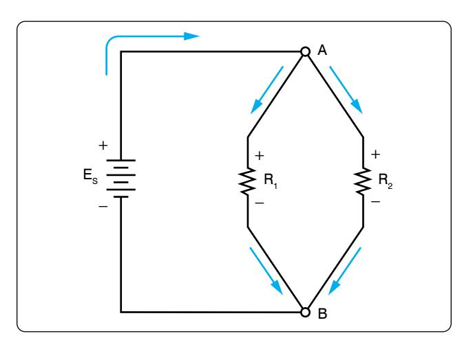

RT = + 1 R1 1 R2 1

Combining the terms in the denominator and rewriting:

RT = R1 + R2 R1R2

Put in words, this states that the total resistance for two resistors in parallel is equal to the product of both resistors divided by the sum of the two resistors. In the formula below, calculate the total resistance.

General formula RT = R1 + R2 Known values R1 = 500 Ω R2 = 400 Ω RT = 500 Ω + 400 Ω 500 Ω 400 Ω RT = 900 Ω 200,000 Ω RT = 222.22 Ω

R1R2

#### **Current Source**

A current source is an energy source that provides a constant value of current to a load even when the load changes in resistive value. The general rule to remember is that the total current produced by current sources in parallel is equal to the algebraic sum of the individual sources.

# **Kirchhoff's Current Law**

Kirchhoff's Current Law can be stated as: the sum of the currents into a junction or node is equal to the sum of the currents flowing out of that same junction or node. A junction can be defined as a point in the circuit where two or more circuit paths come together. In the case of the parallel circuit, it is the point in the circuit where the individual branches join.

General formula IT = I1 + I2 + I3

Refer to *Figure 12-97* for an example. Point A and point B represent two junctions or nodes in the circuit with three resistive branches in between. The voltage source provides a total current IT into node A. At this point, the current must divide, flowing out of node A into each of the branches according to the resistive value of each branch. Kirchhoff's Current Law states that the current going in must equal that going out. Following the current through the three branches and back into node B, the total current IT entering node B and leaving node B is the same as that which entered node A. The current then continues back to the voltage source.

*Figure 12-98* shows that the individual branch currents are:

I1 = 5 mA I2 = 12 mA

The total current flow into the node A equals the sum of the branch currents, which is: IT = I1 + I2

Substitute IT = 5 mA + 12 mA IT = 17 mA

The total current entering node B is also the same.

*Figure 12-99* illustrates how to determine an unknown current in one branch. Note that the total current into a junction of the three branches is known. Two of the branch currents are known. By rearranging the general formula, the current in branch two can be determined.

General formula IT = I1 + I2 + I3 Substitute 75 mA = 30 mA + I2 + 20 mA Solve I2 I2 = 75 mA – 30 mA – 20 mA I2 = 25 mA

#### **Current Dividers**

It can now be easily seen that the parallel circuit is a current divider. As shown in *Figure 12-96*, there is a current through each of the two resistors. Because the same voltage is applied across both resistors in parallel, the branch currents are inversely proportional to the ohmic values of the resistors. Branches with higher resistance have less current than those with lower resistance. For example, if the resistive value of R2 is twice as high as that of R1, the current in R2 is half of that of R1. All of this can be determined with Ohm's Law.

By Ohm's Law, the current through any one of the branches can be written as:

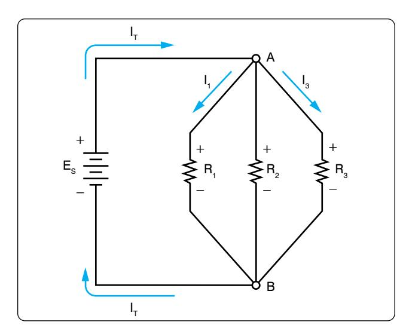

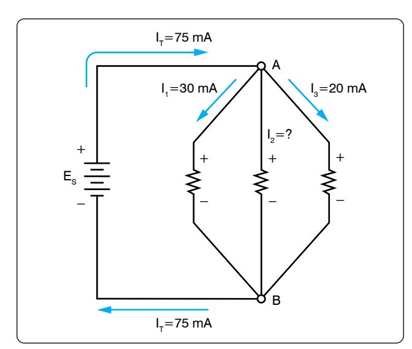

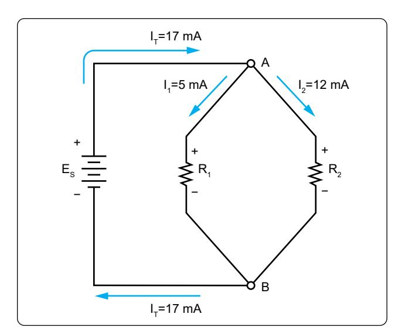

**Figure 12-97.** *Kirchhoff's Current Law.*

**Figure 12-98.** *Individual branch currents.*

IX = ES/RX

The voltage source appears across each of the parallel resistors and RX represents any one the resistors. The source voltage is equal to the total current times the total parallel resistance.

ES = ITRT Substituting ITRT for ES ITRT RX IX = Rearranging RT RX IX = ( ) IT R2 RT I2 = ( ) IT And R1 RT I1 = ( ) IT

This formula is the general current divider formula. The current through any branch equals the total parallel resistance divided by the individual branch resistance, multiplied by the total current.

# **Series-Parallel DC Circuits**

Most of the circuits that the technician encounters will not be a simple series or parallel circuit. Circuits are usually a combination of both, known as series-parallel circuits, which are groups consisting of resistors in parallel and in series. An example of this type of circuit can be seen in *Figure 12-100*. While the series-parallel circuit can initially appear to be complex, the same rules that have been used for the series and parallel circuits can be applied to these circuits.

The voltage source provides a current out to resistor R1, then to the group of resistors R2 and R3 and then to the next resistor R4 before returning to the voltage source. The first step in the simplification process is to isolate the group R2 and R3 and recognize that they are a parallel network that can be reduced to an equivalent resistor. Using the formula for parallel resistance,

R23 = R2 + R3 R2R3

R2 and R3 can be reduced to R23. *Figure 12-101* now shows an equivalent circuit with three series connected resistors. The total resistance of the circuit can now be simply determined by adding up the values of resistors R1, R23, and R4.

# **Determining the Total Resistance**

A more quantitative example for determining total resistance and the current in each branch in a combination circuit is shown in the following example. *[Figure 12-102]*

The first step is to determine the current at junction A, leading into the parallel branch. To determine the IT, the total

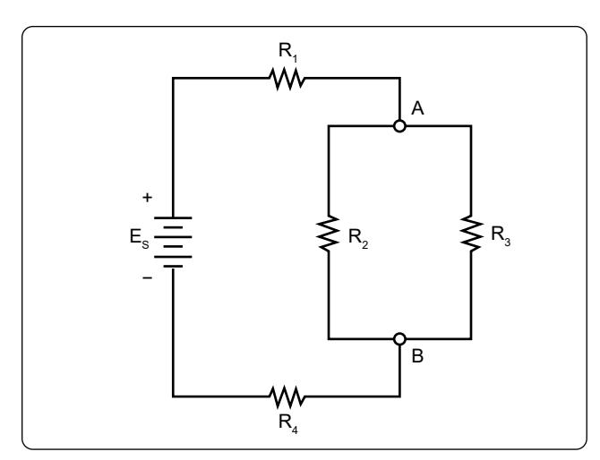

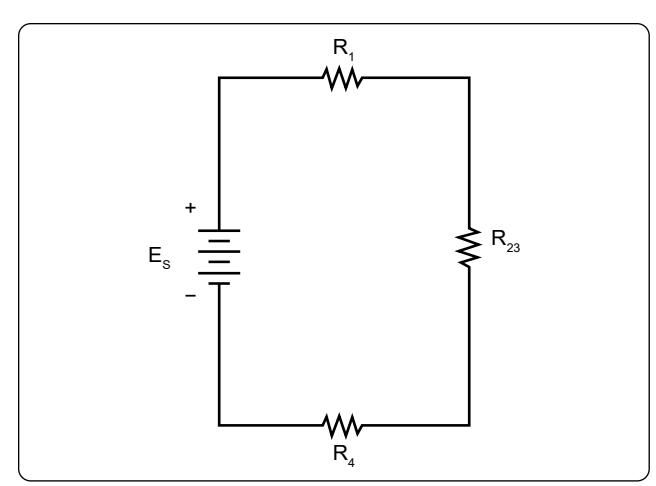

**Figure 12-101.** *Equivalent circuit with three series connected resistors.*

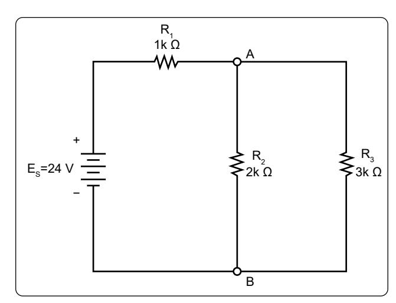

resistance RT of the entire circuit must be known. The total resistance of the circuit is given as:

RT = R1 + R23

Where R23 = ( ) Parallel network R2 + R3 R2R3

Find REQ R23 = 2k Ω + 3k Ω 2k Ω 3k Ω

Solve for REQ R23 = 5k Ω 6,000k Ω R23 = 1.2k Ω

Solve for RT RT = 1k Ω + 1.2k Ω RT = 2.2k Ω

With the total resistance RT now determined, the total IT can be determined. Using Ohm's Law:

IT = RT ES Substitute values IT = 2.2k Ω 24 V IT = 10.9 mA

The current through the parallel branches of R2 and R3 can be determined using the current divider rule discussed earlier in this handbook.

Recall Parallel Branch Resistance:

R23 = 5,000 Ω 6,000 Ω R23 = 1.2k Ω

Substitute values for I2:

I2 = x (10.9 mA) 2,000 Ω 1,200 Ω I2 = 6.54 mA

Now using Kirchhoff's Current Law, the current in the branch with R3 can be determined.

I2 + I3 = IT Recall that IT = 10.9 mA IT – I2 = I3 Also recall that I2 = 6.54 mA Subtract I2 from IT to get I3 I3 = 4.36 mA

# **Alternating Current (AC) & Voltage**

Alternating current (AC) has largely replaced direct current (DC) in commercial power systems for a number of reasons. It can be transmitted over long distances more readily and more economically than DC, since AC voltages can be

Because more and more units are being operated electrically in airplanes, the power requirements are such that a number of advantages can be realized by using AC. Space and weight can be saved since AC devices, especially motors, are smaller and simpler than DC devices. In most AC motors, no brushes are required, and commutation trouble at high altitude is eliminated. Circuit breakers operate satisfactorily under load at high altitudes in an AC system, whereas arcing is so excessive on DC systems that circuit breakers must be replaced frequently. Finally, most airplanes using a 24-volt DC system have special equipment that requires a certain amount of 400-cycle AC current.

#### **AC and DC Compared**

Many of the principles, characteristics, and effects of AC are similar to those of DC. Similarly, there are a number of differences. DC flows constantly in only one direction with a constant polarity. It changes magnitude only when the circuit is opened or closed, as shown in the DC waveform in *Figure 12-103*. AC changes direction at regular intervals, increases in value at a definite rate from zero to a maximum positive strength, and decreases back to zero; then it flows in the opposite direction, similarly increasing to a maximum negative value, and again decreasing to zero. DC and AC waveforms are compared in *Figure 12-103*.

Since AC constantly changes direction and intensity, the following two effects (to be discussed later) take place in AC circuits that do not occur in DC circuits:

- 1. Inductive reactance
- 2. Capacitive reactance

# **Generator Principles**

After the discovery that an electric current flowing through a conductor creates a magnetic field around the conductor, there was considerable scientific speculation about whether a magnetic field could create a current flow in a conductor. In 1831, Faraday discovered that this could be accomplished.

To show how an electric current can be created by a magnetic field, a demonstration similar to *Figure 12-104* can be used. Several turns of a conductor are wrapped around a cylindrical form, and the ends of the conductor are connected together to form a complete circuit, which includes a galvanometer. If a simple bar magnet is plunged into the cylinder, the galvanometer can be observed to deflect in one direction from its zero (center) position. *[Figure 12-104A]*

When the magnet is at rest inside the cylinder, the galvanometer shows a reading of zero, indicating that no

In *Figure 12-104C*, the galvanometer indicates a current flow in the opposite direction when the magnet is pulled from the cylinder.

The same results may be obtained by holding the magnet stationary and moving the cylinder over the magnet, indicating that a current flows when there is relative motion between the wire coil and the magnetic field. These results obey a law first stated by the German scientist, Heinrich Lenz. Lenz's Law states that the induced current caused by the relative motion of a conductor and a magnetic field always flows in such a direction that its magnetic field opposes the motion.

When a conductor is moved through a magnetic field, an emf is induced in the conductor. *[Figure 12-105]* The direction (polarity) of the induced emf is determined by the magnetic lines of force and the direction the conductor is moved through the magnetic field. The generator left-hand rule (not to be confused with the left-hand rules used with a coil) can be used to determine the direction of the induced emf. *[Figure 12-106]* The left-hand rule is summed up as follows:

The first finger of the left hand is pointed in the direction of the magnetic lines of force (North to South), the thumb is pointed in the direction of movement of the conductor through the magnetic field, and the second finger points in the direction of the induced emf.

When a loop conductor is rotated in a magnetic field, a voltage is induced in each side of the loop. *[Figure 12-107]* The two sides cut the magnetic field in opposite directions, and although the current flow is continuous, it moves in opposite directions with respect to the two sides of the loop. If sides A and B and the loop are rotated half a turn and the sides of the conductor have exchanged positions, the induced emf in each wire reverses its direction, since the wire formerly cutting the lines of force in an upward direction is now moving downward.

The value of an induced emf depends on three factors:

- 1. Number of wires moving through the magnetic field
- 2. Strength of the magnetic field
- 3. Speed of rotation

# **Generators of Alternating Current**

Generators used to produce an alternating current are called AC generators or alternators.

The simple generator constitutes one method of generating an alternating voltage. *[Figure 12-108]* It consists of

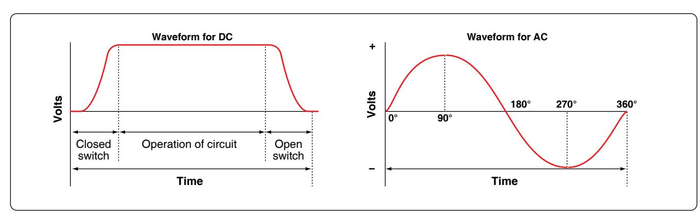

**Figure 12-103.** *DC and AC voltage curves.*

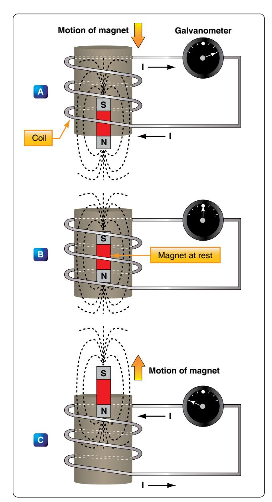

**Figure 12-104.** *Inducing a current flow.*

a rotating loop, marked A and B, placed between two magnetic poles, N and S. The ends of the loop are connected to two metal slip rings (collector rings), C1 and C2. Current is taken from the collector rings by brushes. If the loop is considered as separate wires A and B, and the left-hand rule for generators is applied, then it can be observed that as wire A moves up across the field, a voltage is induced which causes the current to flow inward. As wire B moves down across the field, a voltage is induced which causes the current to flow outward. When the wires are formed into a loop, the voltages induced in the two sides of the loop are combined. Therefore, for explanatory purposes, the action of either conductor, A or B, while rotating in the magnetic field is similar to the action of the loop.

*Figure 12-109* illustrates the generation of AC with a simple loop conductor rotating in a magnetic field. As it is rotated in a counterclockwise direction, varying values of voltages are induced in it.

# *Position 1*

The conductor A moves parallel to the lines of force. Since it cuts no lines of force, the induced voltage is zero. As the conductor advances from position 1 to position 2, the voltage induced gradually increases.

#### *Position 2*

The conductor is now moving perpendicular to the flux and cuts a maximum number of lines of force; therefore, a maximum voltage is induced. As the conductor moves beyond position 2, it cuts a decreasing amount of flux at each instant, and the induced voltage decreases.

# *Position 3*

At this point, the conductor has made one-half of a revolution and again moves parallel to the lines of force, and no voltage is induced in the conductor. As the A conductor passes position 3, the direction of induced voltage now reverses since the A conductor is moving downward, cutting flux

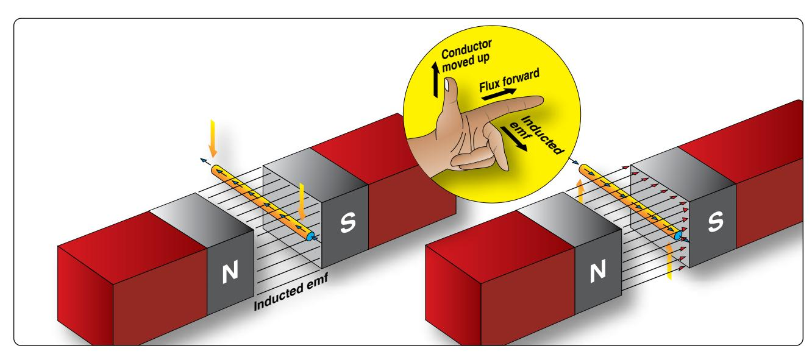

**Figure 12-106.** *An application of the generator left-hand rule.*

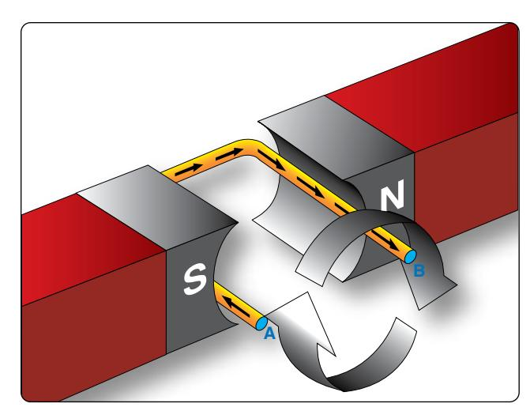

**Figure 12-107.** *Voltage induced in a loop.*

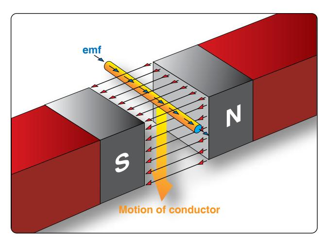

**Figure 12-105.** *Inducing an emf in a conductor.*

in the opposite direction. As the A conductor moves across the South pole, the induced voltage gradually increases in a negative direction, until it reaches position 4.

# *Position 4*

Like position 2, the conductor is again moving perpendicular to the flux and generates a maximum negative voltage. From position 4 to 5, the induced voltage gradually decreases until the voltage is zero, and the conductor and wave are ready to start another cycle.

# *Position 5*

The curve shown at position 5 is called a sine wave. It represents the polarity and the magnitude of the instantaneous values of the voltages generated. The horizontal base line is divided into degrees, or time, and the vertical distance above or below the base line represents the value of voltage at each particular point in the rotation of the loop.

# **Cycle and Frequency**

# *Cycle Defined*

A cycle is a repetition of a pattern. Whenever a voltage or current passes through a series of changes, returns to the starting point, and then again starts the same series of changes, the series is called a cycle. The cycle is represented by the symbol of a wavy line in a circle ~ . In the cycle of voltage shown in *Figure 12-110*, the voltage increases from zero to a maximum positive value, decreases to zero; then increases to a maximum negative value, and again decreases to zero. At this point, it is ready to go through the same series of changes. There are two alternations in a complete cycle: the positive alternation and the negative. Each is half a cycle.

# *Frequency Defined*

The frequency is the number of cycles of AC per second (1

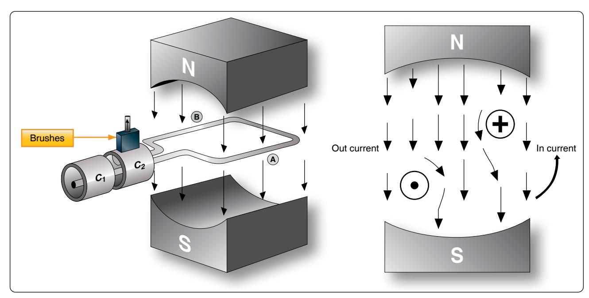

**Figure 12-108.** *Simple generator.*

second). The standard unit of frequency measurement is the hertz (Hz). *[Figure 12-111]* In a generator, the voltage and current pass through a complete cycle of values each time a coil or conductor passes under a North and South pole of the magnet. The number of cycles for each revolution of the coil or conductor is equal to the number of pairs of poles. The frequency, then, is equal to the number of cycles in one revolution multiplied by the number of revolutions per second (rps).

Expressed in equation form:

F = × 2 60 Number of poles rpm

where P ⁄2 is the number of pairs of poles, and rpm/60 the number of revolutions per second. If in a 2-pole generator, the conductor is turning at 3,600 rpm, the revolutions per second are:

rps = = 60 revolutions per second 60 3,600

Since there are 2 poles, P ⁄2 is 1, and the frequency is 60 cycles per second (cps). In a 4-pole generator with an armature speed of 1,800 rpm, substitute in the equation:

F = × as follows 2 60 P rpm

F = × 2 60 4 1,800

F = 2 × 30

F = 60 cps

# *Period Defined*

The time required for a sine wave to complete one full cycle is called a period. *[Figure 12-110]* The period of a sine wave is inversely proportional to the frequency: the higher the frequency, the shorter the period. The mathematical relationship between frequency and period is given as:

Period is t = f 1 Frequency is f = t 1

#### *Wavelength Defined*

The distance that a waveform travels during a period is commonly referred to as a wavelength and is indicated by the Greek letter lambda (l). The measurement of wavelength is taken from one point on the waveform to a corresponding point on the next waveform. *[Figure 12-110]*

# **Phase Relationships**

In addition to frequency and cycle characteristics, alternating voltage and current also have a relationship called "phase." In a circuit that is fed (supplied) by one alternator, there must be a certain phase relationship between voltage and current if the circuit is to function efficiently. In a system fed by two or more alternators, not only must there be a certain phase relationship between voltage and current of one alternator, but there must be a phase relationship between the individual voltages and the individual currents. Also, two separate circuits can be compared by comparing the phase

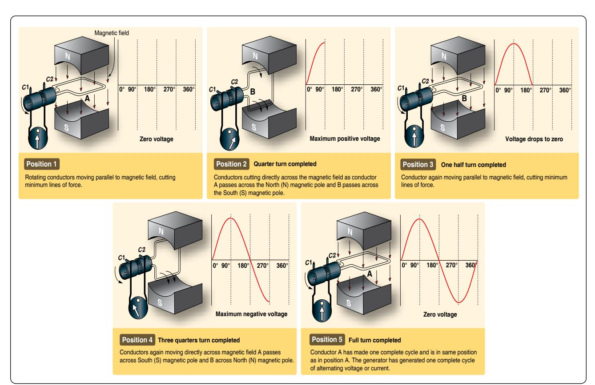

**Figure 12-109.** *Generation of a sine wave.*

characteristics of one to the phase characteristics of the other.

# *In Phase Condition*

*Figure 12-112A* shows a voltage signal and a current signal superimposed on the same time axis. Notice that when the voltage increases in the positive alternation that the current also increases. When the voltage reaches its peak value, so does the current. Both waveforms then reverse and decrease back to a zero magnitude, then proceed in the same manner in the negative direction as they did in the positive direction. When two waves, such as these in *Figure 12-112A*, are exactly in step with each other, they are said to be in phase. To be in phase, the two waveforms must go through their maximum and minimum points at the same time and in the same direction.

# *Out of Phase Condition*

When two waveforms go through their maximum and minimum points at different times, a phase difference exists between the two. In this case, the two wave-forms are said to be out of phase with each other. The terms lead and lag are often used to describe the phase difference between waveforms. The waveform that reaches its maximum or minimum value first is said to lead the other waveform. *Figure 12-112B* shows this relationship. Voltage source one starts to rise at the 0° position and voltage source two

starts to rise at the 90° position. Because voltage source one begins its rise earlier in time (90°) in relation to the second voltage source, it is said to be leading the second source. On the other hand, the second source is said to be lagging the first source. When a waveform is said to be leading or lagging, the difference in degrees is usually stated. If the two waveforms differ by 360°, they are said to be in phase with each other. If there is a 180° difference between the two signals, then they are still out of phase even though they are both reaching their minimum and maximum values at the same time. *[Figure 12-112C]*

A practical note of caution: When encountering an aircraft that has two or more AC busses in use, it is possible that they may be split and not synchronized to be in phase with each other. When two signals that are not locked in phase are mixed, much damage can occur to aircraft systems or avionics.

# **Values of Alternating Current**

There are three values of AC: instantaneous, peak, and effective root mean square (RMS).

#### *Instantaneous Value*

An instantaneous value of voltage or current is the induced voltage or current flowing at any instant during a cycle. The sine wave represents a series of these values. The instantaneous

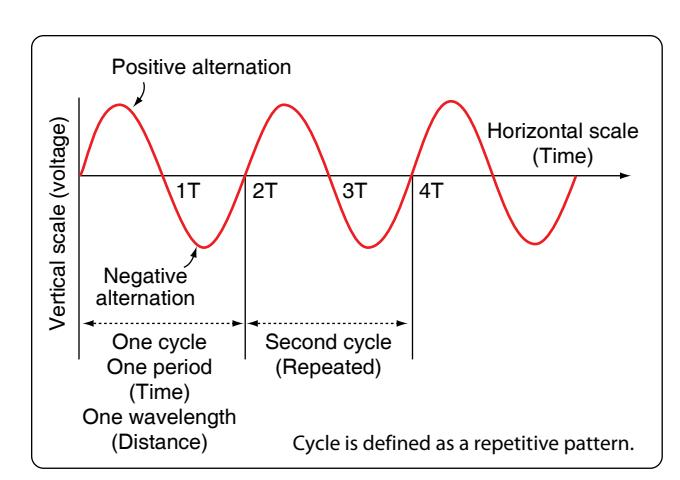

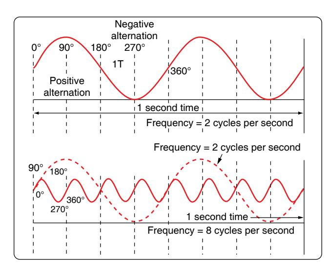

**Figure 12-110.** *Cycle of voltage.*

**Figure 12-111.** *Frequency in cycles per second.* value of the voltage varies from zero at 0° to maximum at 90°, back to zero at 180°, to maximum in the opposite direction at 270°, and to zero again at 360°. Any point on the sine wave is considered the instantaneous value of voltage.

# *Peak Value*

The peak value is the largest instantaneous value. The largest single positive value occurs when the sine wave of voltage is at 90°, and the largest single negative value occurs when it is at 270°. Maximum value is 1.41 times the effective value. These are called peak values.

# *Effective Value*

The effective value is also known as the RMS value or root mean square, which refers to the mathematical process by which the value is derived. Most AC voltmeters display the effective or RMS value when used. The effective value is less than the maximum value, being equal to .707 times the maximum value.

The effective value of a sine wave is actually a measure of the heating effect of the sine wave. *Figure 12-113* illustrates what happens when a resistor is connected across an AC voltage source. In *Figure 12-113A*, a certain amount of heat is generated by the power in the resistor. *Figure 12-113B* shows the same resistor now inserted into a DC voltage source. The value of the DC voltage source can now be adjusted so that the resistor dissipates the same amount of heat as it did when it was in the AC circuit. The RMS or effective value of a sine wave is equal to the DC voltage that produces the same amount of heat as the sinusoidal voltage.

The peak value of a sine wave can be converted to the corresponding RMS value using the following relationship.

Vrms = ( 0.5 ) × Vp

Vrms = 0.707 × Vp

This can be applied to either voltage or current.

Algebraically rearranging the formula and solving for Vp can also determine the peak voltage. The resulting formula is:

Vp = 1.414 × Vrms

Thus, the 110 volt value given for AC supplied to homes is only 0.707 of the maximum voltage of this supply. The maximum voltage is approximately 155 volts (110 × 1.41 = 155 volts maximum).

In the study of AC, any values given for current or voltage are assumed to be effective values unless otherwise specified. In practice, only the effective values of voltage and current are used. Similarly, AC voltmeters and ammeters measure the effective value.

# **Opposition to Current Flow of AC**

There are three factors that can create an opposition to the flow of electrons (current) in an AC circuit. Resistance, similar to resistance of DC circuits, is measured in ohms and has a direct influence on AC regardless of frequency. Inductive reactance and capacitive reactance, on the other hand, oppose current flow only in AC circuits, not in DC circuits. Since AC constantly changes direction and intensity, inductors and capacitors may also create an opposition to current flow in AC circuits. It should also be noted that inductive reactance and capacitive reactance may create a phase shift between the voltage and current in an AC circuit. Whenever analyzing an AC circuit, it is very important to consider the resistance, inductive reactance, and the capacitive reactance. All three have an effect on the current of that circuit.

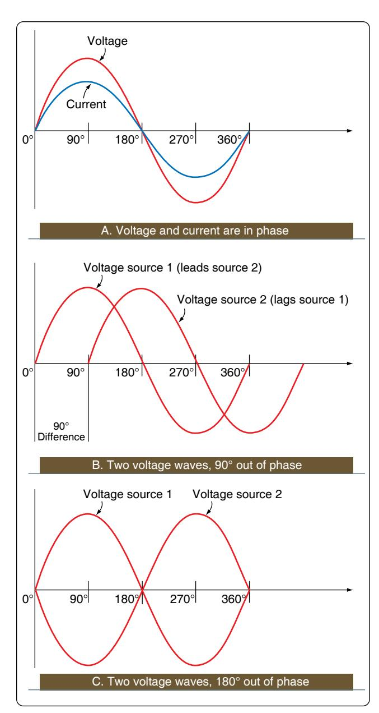

**Figure 12-112.** *In phase and out of phase conditions.*

# **Capacitance**

Another important property in AC circuits, besides resistance and inductance, is capacitance. While inductance is represented in a circuit by a coil, capacitance is represented by a capacitor. In its most basic form, the capacitor is constructed of two parallel plates separated by a nonconductor called a dielectric. In an electrical circuit, a capacitor serves as a reservoir or storehouse for electricity.

# **Capacitors in Direct Current**

When a capacitor is connected across a source of DC, such as a storage battery in the circuit shown in *Figure 12-114A*, and the switch is then closed, the plate marked B becomes positively

charged, and the A plate negatively charged. Current flows in the external circuit during the time the electrons are moving from B to A. The current flow in the circuit is at a maximum the instant the switch is closed, but continually decreases thereafter until it reaches zero. The current becomes zero as soon as the difference in voltage of A and B becomes the same as the voltage of the battery. If the switch is opened as shown in *Figure 12-114B*, the plates remain charged. Once the capacitor is shorted, it discharges quickly as shown *Figure 12-114C*.

It should be clear that during the time the capacitor is being charged or discharged, there is current in the circuit, even though the circuit is broken by the gap between the capacitor plates. Current is present only during the time of charge and discharge, and this period of time is usually short.

# **The Resistor/Capacitor (RC) Time Constant**

The time required for a capacitor to attain a full charge is proportional to the capacitance and the resistance of the circuit. The resistance of the circuit introduces the element of time into the charging and discharging of a capacitor.

When a capacitor charges or discharges through a resistance, a certain amount of time is required for a full charge or discharge. The voltage across the capacitor does not change instantaneously. The rate of charging or discharging is determined by the time constant of the circuit. The time constant of a series resistor/capacitor (RC) circuit is a time interval that equals the product of the resistance in ohms and the capacitance in farad and is symbolized by the Greek letter tau (τ).

τ = RC

The time in the formula is the time required to charge to 63 percent of the voltage of the source. The time required to bring the charge to about 99 percent of the source voltage is approximately 5 τ. *[Figure 12-115]*

The measure of a capacitor's ability to store charge is its capacitance. The symbol used for capacitance is the letter C.

As can be seen from *Figure 12-115,* there can be no continuous movement of DC through a capacitor. A good capacitor blocks DC and passes the effects of pulsing DC or AC.

# **Units of Capacitance**

Electrical charge, which is symbolized by the letter Q, is measured in units of coulombs. The coulomb is given by the letter C, as with capacitance. Unfortunately, this can be confusing. One coulomb of charge is defined as a charge having 6.28 × 1018 electrons. The basic unit of capacitance is the farad and is given by the letter f. By definition, one

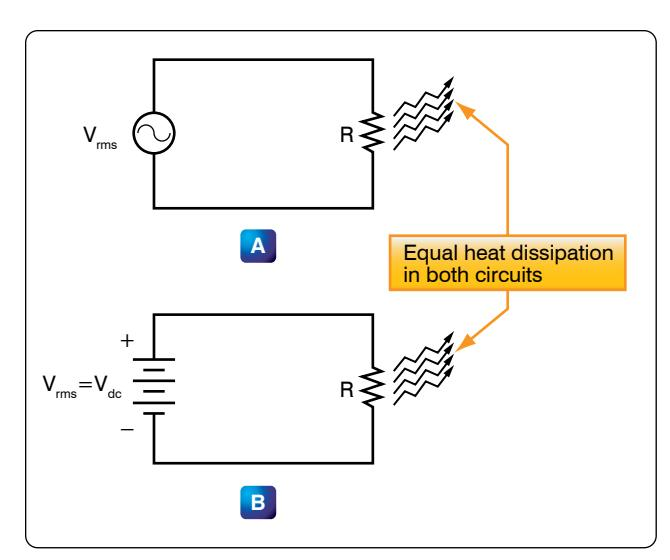

**Figure 12-113.** *Sine wave effective value.*

farad is one coulomb of charge stored with one volt across the plates of the capacitor. The general formula for capacitance in terms of charge and voltage is:

Where C = E Q C = capacitance measured in farads E = applied voltage measured in volts Q = charge measured in coulombs

In practical terms, one farad is a large amount of capacitance. Typically, in electronics, much smaller units are used. The two more common smaller units are the microfarad (μF), which is 10-6 farad, and the picofarad (pF), which is 10-12 farad.

# **Voltage Rating of a Capacitor**

Capacitors have their limits as to how much voltage can be applied across the plates. The aircraft technician must be aware of the voltage rating, which specifies the maximum DC voltage that can be applied without the risk of damage to the device. This voltage rating is typically called the breakdown voltage, the working voltage, or simply the voltage rating. If the voltage applied across the plates is too great, the dielectric breaks down and arcing occurs between the plates. The capacitor is then short circuited, and the possible flow of DC through it can cause damage to other parts of the equipment.

A capacitor that can be safely charged to 500 volts DC cannot be safely subjected to AC or pulsating DC whose effective values are 500 volts. An alternating voltage of 500 volts (RMS) has a peak voltage of 707 volts, and a capacitor to which it is applied should have a working voltage of at least 750 volts. The capacitor should be selected so that its working voltage is at least 50 percent greater than the highest voltage to be applied.

The voltage rating of the capacitor is a factor in determining the actual capacitance, because capacitance decreases as the thickness of the dielectric increases. A high-voltage capacitor that has a thick dielectric must have a larger plate area in order to have the same capacitance as a similar low voltage capacitor having a thin dielectric.

# **Factors Affecting Capacitance**

- 1. The capacitance of parallel plates is directly proportional to their area. A larger plate area produces a larger capacitance and a smaller area produces less capacitance. If we double the area of the plates, there is room for twice as much charge. The charge that a capacitor can hold at a given potential difference is doubled, and since C = Q/E, the capacitance is doubled.
- 2. The capacitance of parallel plates is inversely proportional to their spacing.
- 3. The dielectric material affects the capacitance of parallel plates. The dielectric constant of a vacuum is defined as 1, and that of air is very close to 1. These values are used as a reference, and all other materials have values specified in relation to air (vacuum).

The strength of some commonly used dielectric materials is listed in *Figure 12-116*. The voltage rating also depends on frequency because the losses, and the resultant heating effect, increase as the frequency increases.

### **Types of Capacitors**

Capacitors come in all shapes and sizes and are usually marked with their value in farads. They may also be divided into two groups: fixed and variable. The fixed capacitors, which have approximately constant capacitance, may then be further divided according to the type of dielectric used. Some varieties are: paper, oil, mica, electrolytic and ceramic capacitors. *Figure 12-117* shows the schematic symbols for a fixed and variable capacitor.

# *Fixed Capacitors*

#### *Mica Capacitors*

The fixed mica capacitor is made of metal foil plates that are separated by sheets of mica, which form the dielectric. The whole assembly is covered in molded plastic, which keeps out moisture. Mica is an excellent dielectric and withstands higher voltages than paper without allowing arcing between the plates. Common values of mica capacitors range from approximately 50 microfarads to about 0.02 microfarads. *[Figure 12-118]*

#### **Ceramic**

The ceramic capacitor is constructed with materials, such as titanium acid barium for a dielectric. Internally these

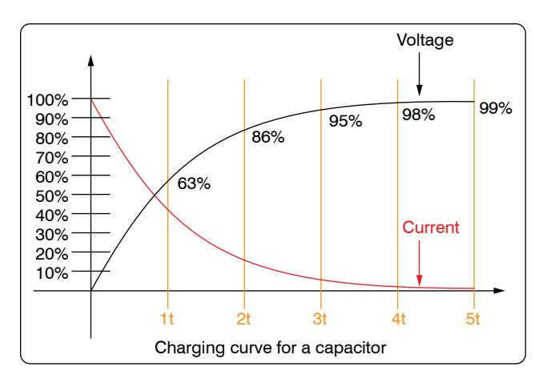

**Figure 12-115.** *Capacitance discharge curve.*

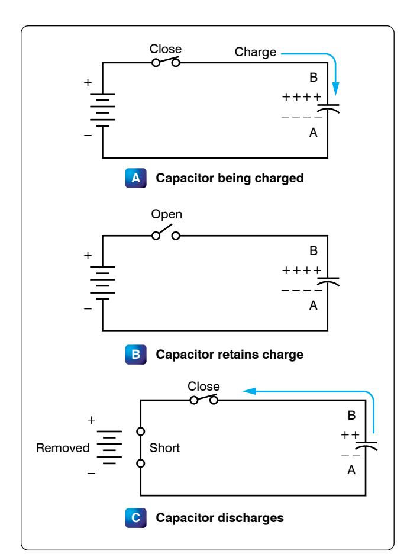

**Figure 12-114.** *Capacitors in direct current.*

capacitors are not constructed as a coil, so they are well suited for use in high-frequency applications. They are shaped like a disk, available in very small capacitance values, and very small sizes. This type is fairly small, inexpensive, and reliable. Both the ceramic and the electrolytic are the most widely available and used capacitor.

#### **Electrolytic**

Two kinds of electrolytic capacitors are in use: wet electrolytic and dry electrolytic. The wet electrolytic capacitor is designed of two metal plates separated by an electrolyte with an electrolyte dielectric, which is basically conductive salt in solvent. For capacitances greater than a few microfarads, the plate areas of paper or mica capacitors must become very large; thus, electrolytic capacitors are usually used instead. These units provide large capacitance in small physical sizes. Their values range from 1 to about 1,500 microfarads. Unlike the other types, electrolytic capacitors are generally polarized, with the positive lead marked with a "+" and the negative lead marked with a "−" and should only be subjected to direct voltage or pulsating direct voltage only.

The electrolyte in contact with the negative terminal, either in paste or liquid form, comprises the negative electrode. The dielectric is an exceedingly thin film of oxide deposited on the positive electrode of the capacitor. The positive electrode, which is an aluminum sheet, is folded to achieve maximum area. The capacitor is subjected to a forming process during manufacture in which current is passed through it. The flow of current results in the deposit of the thin coating of oxide on the aluminum plate.

The close spacing of the negative and positive electrodes gives rise to the comparatively high-capacitance value, but allows greater possibility of voltage breakdown and leakage of electrons from one electrode to the other.

The electrolyte of the dry electrolytic unit is a paste contained in a separator made of an absorbent material, such as gauze or paper. The separator not only holds the electrolyte in place but also prevents it from short circuiting the plates. Dry electrolytic capacitors are made in both cylindrical and rectangular block form and may be contained either within cardboard or metal covers. Since the electrolyte cannot spill, the dry capacitor may be mounted in any convenient position. *[Figure 12-119]*

# **Tantalum**

Similar to the electrolytic, these capacitors are constructed with a material called tantalum, which is used for the electrodes. They are superior to electrolytic capacitors, having better temperature and frequency characteristics. When tantalum powder is baked in order to solidify it, a crack forms inside. This crack is used to store an electrical charge. Like electrolytic capacitors, the tantalum capacitors are also polarized and are indicated with the "+" and "−" symbols.

# **Polyester Film**

In this capacitor, a thin polyester film is used as a dielectric. These components are inexpensive, temperature stable, and widely used. Tolerance is approximately 5–10 percent. It

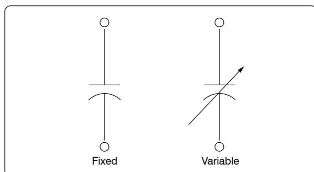

| Dielectric     | K   | Dielectric Strength (volts per .001 inch) |
|----------------|-----|-------------------------------------------|
| Air Paper      | 1.0 | 80                                        |
| (1) Paraffined | 2.2 | 1,200                                     |
| (2) Beeswaxed  | 3.1 | 1,800                                     |
| Glass          | 4.2 | 200                                       |
| Castor Oil     | 4.7 | 380                                       |
| Bakelite       | 6.0 | 500                                       |
| Mica           | 6.0 | 2,000                                     |
| Fiber          | 6.5 | 50                                        |

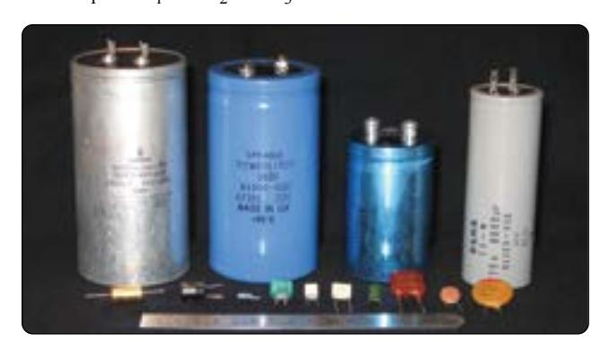

**Figure 12-117.** *Schematic symbols for a fixed and variable capacitor.*

#### **Oil Capacitors**

In radio and radar transmitters, voltages high enough to cause arcing, or breakdown, of paper dielectrics are often used. Consequently, in these applications capacitors that use oil or oil impregnated paper for the dielectric material are preferred. Capacitors of this type are considerably more expensive than ordinary paper capacitors, and their use is generally restricted to radio and radar transmitting equipment. *[Figure 12-120]*

#### *Variable Capacitors*

Variable capacitors are mostly used in radio tuning circuits, and they are sometimes called "tuning capacitors." They have very small capacitance values, typically between 100 pF and 500 pF.

# **Trimmers**

The trimmer is actually an adjustable or variable capacitor, which uses ceramic or plastic as a dielectric. Most of them are color coded to easily recognize their tunable size. The ceramic type has the value printed on them. Colors are: yellow (5 pF), blue (7 pF), white (10 pF), green (30 pF), and brown (60 pF).

# **Varactors**

A voltage-variable capacitor or varactor is also known as a variable capacitance diode or a varicap. This device utilizes the variation of the barrier width in a reversed-biased diode. Because the barrier width of a diode acts as a non-conductor, a diode forms a capacitor when reversed biased. Essentially, the N-type material becomes one plate and the junctions are the dielectric. If the reversed-bias voltage is increased, then the barrier width widens, effectively separating the two capacitor plates and reducing the capacitance.

# **Capacitors in Series**

When capacitors are placed in series, the effective plate separation is increased and the total capacitance is less than that of the smallest capacitor. Additionally, the series

combination is capable of withstanding a higher total potential difference than any of the individual capacitors. *Figure 12-121* is a simple series circuit. The bottom plate of C1 and the top plate of C2 is charged by electrostatic induction. The capacitors charge as current is established through the circuit. Since this is a series circuit, the current must be the same at all points. Since the current is the rate of flow of charge, the amount of charge (Q) stored by each capacitor is equal to the total charge.

QT = Q1 + Q2 + Q3

According to Kirchhoff's Voltage Law, the sum of the voltages across the charged capacitors must equal the total voltage, ET. This is expressed as:

ET = E1 + E2 + E3

Equation E = Q/C can now be substituted into the voltage equation where we now get:

= + + CT C1 C2 C3 QT Q1 Q2 Q3

Since the charge on all capacitors is equal, the Q terms can be factored out, leaving us with the equation:

= + + CT C1 C2 C3 1 1 1 1

If C1 = 10 μF, C2 = 5 μF and C3 = 8 μF

Then = + + CT 10 μF 5 μF 8 μF 1 1 1 1

CT = = 2.35 μF 0.425 μF 1

#### **Capacitors in Parallel**

When capacitors are connected in parallel, the effective plate area increases, and the total capacitance is the sum of the individual capacitances. *Figure 12-122* shows a simplified parallel circuit. The total charging current from the source divides at the junction of the parallel branches. There is a separate charging current through each branch so that a different charge can be stored by each capacitor. Using Kirchhoff's Current Law, the sum of all of the charging currents is then equal to the total current. The sum of the charges (Q) on the capacitors is equal to the total charge. The voltages (E) across all of the parallel branches are equal. With all of this in mind, a general equation for capacitors in parallel can be determined as:

QT = Q1 + Q2 + Q3

Because Q = CE: CTET = C1E1 + C2E2 + C3E3

Voltages can be factored out because:

ET = E1 + E2 + E3

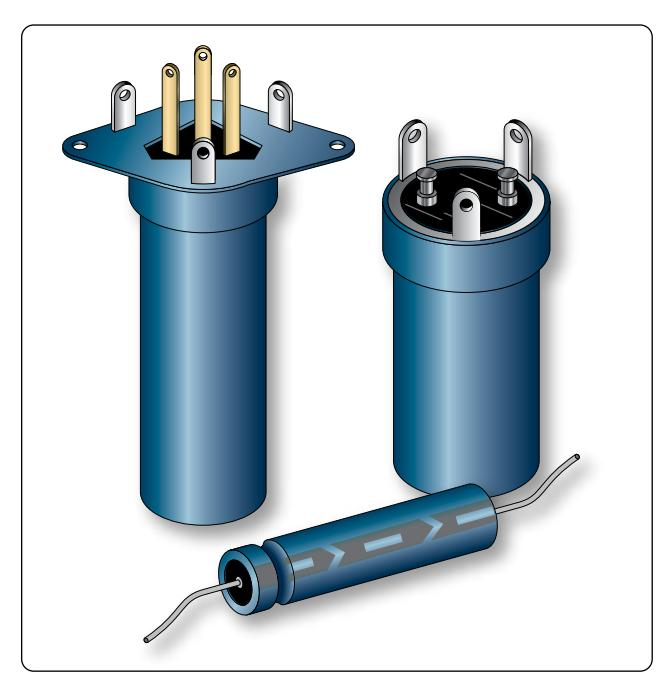

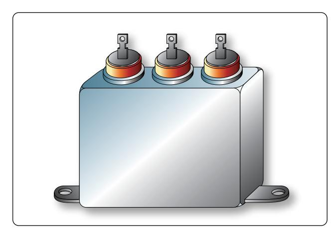

CT = C1 + C2 + C3

Consider the following example:

If C1 = 330 μF, C2 = 220 μF

Then CT = 330 μF + 220 μF = 550 μF

#### **Capacitors in Alternating Current**

If a source of AC is substituted for the battery, the capacitor acts quite differently than it does with DC. When AC is applied in the circuit, the charge on the plates constantly changes. *[Figure 12-123]* This means that electricity must flow first from Y clockwise around to X, then from X counterclockwise around to Y, then from Y clockwise around to X, and so on. Although no current flows through the insulator between the plates of the capacitor, it constantly flows in the remainder of the circuit between X and Y. In a circuit where there is only capacitance, current leads the applied voltage as contrasted with a circuit in which there is inductance, where the current lags the voltage.

#### **Capacitive Reactance Xc**

The effectiveness of a capacitor in allowing an AC flow to pass depends upon the capacitance of the circuit and the applied frequency. To what degree a capacitor allows an AC flow to pass depends largely upon the capacitive value of the capacitor given in farads (f). The greater the capacitance of the capacitor, the greater the number of electrons, measured in Coulombs, necessary to bring the capacitor to a fully charged state. Once the capacitor approaches or actually reaches a fully charged condition, the polarity of the capacitor opposes the polarity of the applied voltage, essentially acting then as an open circuit. To further illustrate this characteristic and how it manifests itself in an AC circuit, consider the following. If a capacitor has a large capacitive value, meaning that it requires a relatively large number of electrons to bring it to a fully charged state,

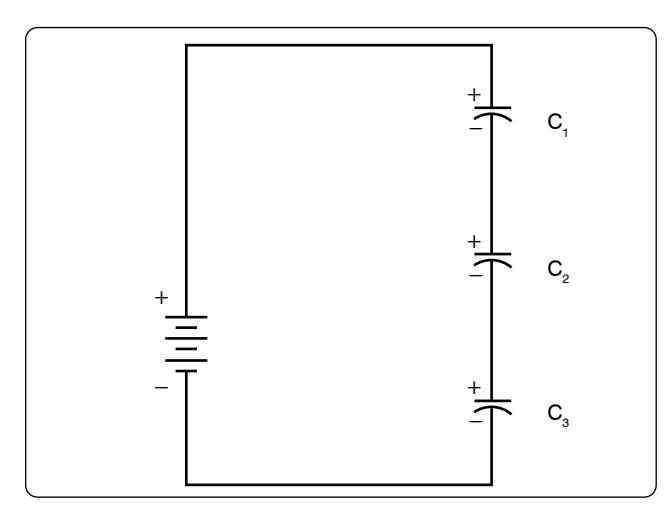

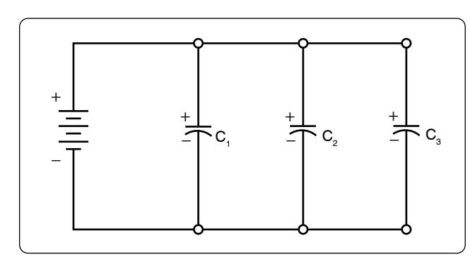

then a rather high-frequency current can alternate through the capacitor without the capacitor ever reaching a full charge. In this case, if the frequency is high enough and the capacitance large enough that there is never enough time for the capacitor to ever reach a full charge, it is possible that the capacitor may offer very little or no resistance to the current. However, the smaller the capacitance, the fewer electrons are required to bring it up to a full charge and it is more likely that the capacitor will build up enough of an opposing charge that it can present a great deal of resistance to the current if not to the point of behaving like an open circuit. In between these two extreme conditions lies a continuum of possibilities of current opposition depending on the combination of applied frequency and the selected capacitance. Current in an AC circuit can be controlled by changing the circuit capacitance in a similar manner that resistance can control the current. The actual AC reactance Xc, which just like resistance, is measured in ohms (Ω). Capacitive reactance Xc is determined by the following:

Xc = 2πfC 1

Where Xc = capacitive reactance f = frequency in cps C = capacity in farads 2π = 6.28

#### **Sample Problem:**

A series circuit is assumed in which the impressed voltage is 110 volts at 60 cps, and the capacitance of a condenser is 80 Mf. Find the capacitive reactance and the current flow.

#### **Solution:**

To find capacitive reactance, the equation Xc = 1/(2πfC) is used. First, the capacitance, 80 Mf, is changed to farads by dividing 80 by 1,000,000, since 1 million microfarads is equal to 1 farad. This quotient equals 0.000080 farad. This is substituted in the equation and:

Xc = 6.28 × 60 × 0.000080 1

Xc = 33.2 ohms reactance

Once the reactance has been determined, Ohm's Law can then be used in the same manner as it is used in DC circuits to determine the current.

Current = , or Capacitive reactance Voltage I = Xc E

Find the current flow:

I = Xc E I = 33.2 110

I = 3.31 amperes

# **Capacitive Reactances in Series and in Parallel**

When capacitors are connected in series, the total reactance is equal to the sum of the individual reactances. Thus,

Xct = (Xc)1 + (Xc)2

The total reactance of capacitors connected in parallel is found in the same way total resistance is computed in a parallel circuit:

(Xc)t = + + 1 (Xc)1 1 (Xc)2 1 (Xc)3 1

#### **Phase of Current and Voltage in Reactive Circuits**

Unlike a purely resistive circuit, the capacitive and inductive reactance has a significant effect on the phase relationship between the applied AC voltage and the corresponding

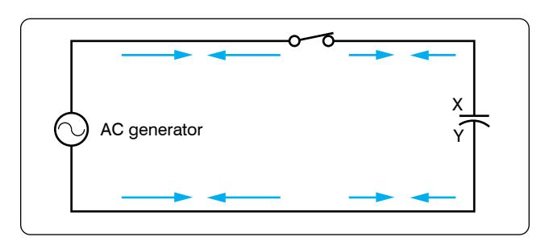

current in the circuit.

In review, when current and voltage pass through zero and reach maximum value at the same time, the current and voltage are said to be in phase. *[Figure 12-124A]* If the current and voltage pass through zero and reach the maximum values at different times, the current and voltage are said to be out of phase. In a circuit containing only inductance, the current reaches a maximum value later than the voltage, lagging the voltage by 90°, or one-fourth cycle. *[Figure 12-124B]*

In a circuit containing only capacitance, the current reaches its maximum value ahead of the voltage and the current leads the voltage by 90°, or one-fourth cycle. *[Figure 12-124C]* The amount the current lags or leads the voltage in a circuit depends on the relative amounts of resistance, inductance, and capacitance in the circuit.

# **Inductance**

# **Characteristics of Inductance**

Michael Faraday discovered that by moving a magnet through a coil of wire, a voltage was induced across the coil. If a complete circuit was provided, then a current was also induced. The amount of induced voltage is directly proportional to the rate of change of the magnetic field with respect to the coil. The simplest of experiments can prove that when a bar magnet is moved through a coil of wire, a voltage is induced and can be measured on a voltmeter. This is commonly known as Faraday's Law or the Law of Electromagnetic Induction, which states that the induced emf or electromagnetic force in a closed loop of wire is proportional to the rate of change of the magnetic flux through a coil of wire.

Conversely, current flowing through a coil of wire produces a magnetic field. When this wire is formed into a coil, it then becomes a basic inductor. The magnetic lines of force around each loop or turn in the coil effectively add to the lines of force around the adjoining loops. This forms a strong magnetic field within and around the coil. *Figure 12-125A* shows a coil of wire strengthening a magnetic field. The magnetic lines of force around adjacent loops are deflected into an outer path when the loops are brought close together. This happens because the magnetic lines of force between adjacent loops are in opposition with each other. The total magnetic field for the two loops is shown in *Figure 12-125B*. As more loops are added close together, the strength of the magnetic field increases. *Figure 12-125C* illustrates the combined effects of many loops of a coil. The result is a strong electromagnet.

The primary aspect of the operation of a coil is its property to oppose any change in current through it. This property is called inductance. When current flows through any conductor, a magnetic field starts to expand from the center of the wire. As the lines of magnetic force grow outward through the conductor, they induce an emf in the conductor itself. The induced voltage is always in the direction opposite to the direction of the current flow. The effects of this countering emf are to oppose the immediate establishment of the maximum current. This effect is only a temporary condition. Once the current reaches a steady value in the conductor, the lines of magnetic force no longer expand and the countering emf is no longer present.

At the starting instant, the countering emf nearly equals the applied voltage, resulting in a small current flow. However, as the lines of force move outward, the number of lines cutting the conductor per second becomes progressively smaller, resulting in a diminished counter emf. Eventually, the counter emf drops to zero and the only voltage in the circuit is the applied voltage and the current is at its maximum value.

# **The RL Time Constant**

Because the inductors basic action is to oppose a change in its current, it then follows that the current cannot change instantaneously in the inductor. A certain time is required for the current to make a change from one value to another. The rate at which the current changes is determined by a time constant represented by the Greek letter τ. The time constant for the RL circuit is:

τ = R L Where τ = seconds L = inductance (H) R = resistance (Ω)

In a series RL circuit, the current increases to 63 percent of its full value in 1 time constant after the circuit is closed. This buildup is similar to the buildup of voltage in a capacitor when charging an RC circuit. Both follow an exponential curve and reach 99 percent value after the 5th time constant. *[Figure 12-126]*

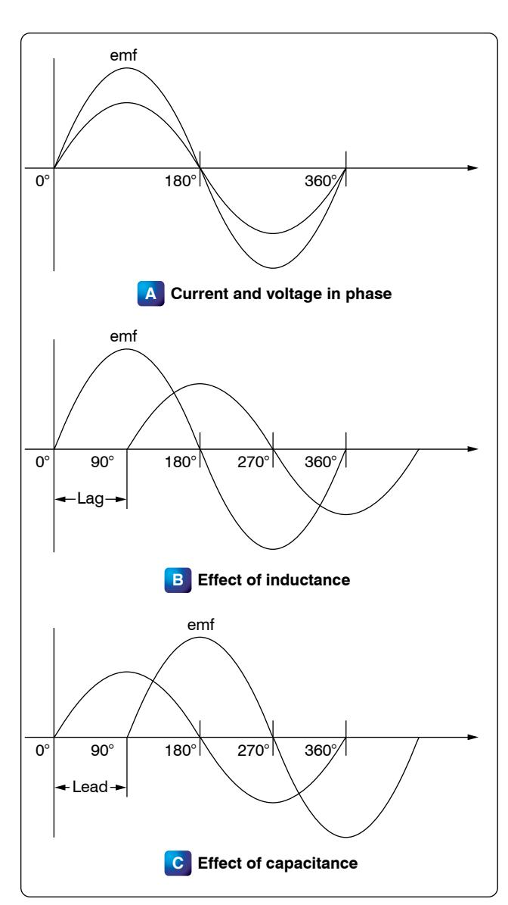

**Figure 12-124.** *Phase of current and voltage.* 

- 1. The number of turns: Doubling the number of turns in a coil produces a field twice as strong if the same current is used. As a general rule, the inductance varies as the square of the number of turns.
- 2. The cross-sectional area of the coil: The inductance of a coil increases directly as the cross-sectional area of the core increases. Doubling the radius of a coil increases the inductance by a factor of four.
- 3. The length of a coil: Doubling the length of a coil, while keeping the same number of turns, halves the value of inductance.
- 4. The core material around which the coil is formed: Coils are wound on either magnetic or nonmagnetic materials. Some nonmagnetic materials include air, copper, plastic, and glass. Magnetic materials include nickel, iron, steel, or cobalt, which have a permeability that provides a better path for the magnetic lines of force and permit a stronger magnetic field.

# **Self-Inductance**

The characteristic of self-inductance was summarized by German physicist Heinrich Lenz in 1833, and gives the direction of the induced emf resulting from electromagnetic induction. This is commonly known as Lenz's Law, which states: The emf induced in an electric circuit always acts in such a direction that the current it drives around a closed circuit produces a magnetic field, which opposes the change in magnetic flux.

Self-inductance is the generation of a voltage in an electric circuit by a changing current in the same circuit. Even a straight piece of wire has some degree of inductance because current in a conductor produces a magnetic field. When the current in a conductor changes direction, there is a corresponding change in the polarity of the magnetic field around the conductor. Therefore, a changing current produces a changing magnetic field around the wire. To further intensify the magnetic field, the wire can be rolled into a coil, which is called an inductor. The changing magnetic field around the inductor induces a voltage across the coil. This induced emf is called self-inductance and tends to oppose any change in current within the circuit. This property is usually called inductance and symbolized with the letter L.

# **Types of Inductors**

Inductors used in radios can range from a straight wire at UHF to large chokes and transformers used for filtering the ripple from the output of power supplies and in audio amplifiers. *Figure 12-127* shows the schematic symbols for common inductors. Values of inductors range from nano-henries to tens of henries.

Inductors are classified by the type of core and the method of

winding them. The number of turns in the inductor winding and the core material determine the capacity of the inductor. Cores made of dielectric material like ceramics, wood, and paper provide small amounts of stored energy while cores made of ferrite substances have a much higher degree of stored energy. The core material is usually the most important aspect of the inductors construction. The conductors typically used in the construction of an inductor offer little resistance to the flow of current. However, with the introduction of a core, resistance is introduced in the circuit and the current now builds up in the windings until the resistance of the core is overcome. This buildup is stored as magnetic energy in the core. Depending on the core resistance, the buildup soon reaches a point of magnetic saturation, and it can be released when necessary. The most common core materials are: air, solid ferrite, powdered ferrite, steel, toroid, and ferrite toroid.

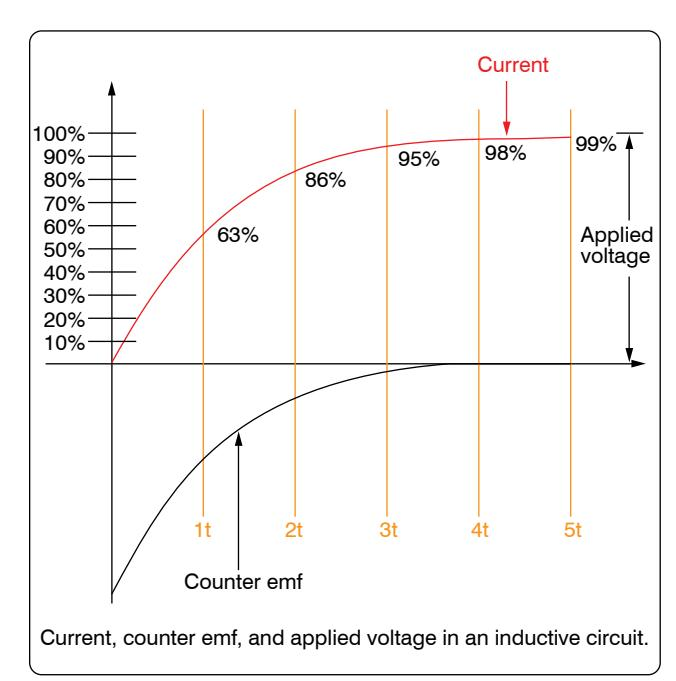

**Figure 12-126.** *Inductor curve.*

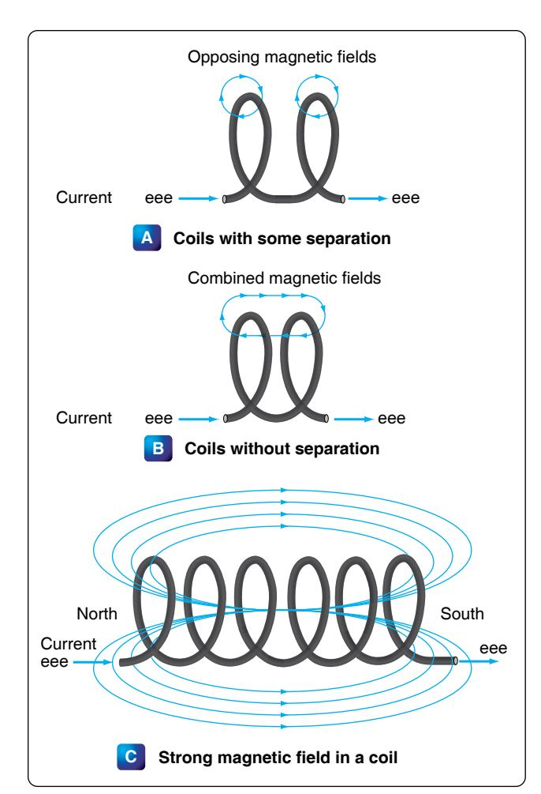

**Figure 12-125.** *Many loops of a coil.*

#### **Units of Inductance**

The henry is the basic unit of inductance and is symbolized with the letter H. An electric circuit has an inductance of one henry when current changing at the rate of one ampere per second induces a voltage of one volt into the circuit. In many practical applications, millihenries (mH) and microhenries (μH) are more common units. The typical symbol for an inductor is shown in *Figure 12-127*.

#### **Inductors in Series**

If we connect two inductors in series, the same current flows through both inductors and, therefore, both are subject to the same rate of change of current. *[Figure 12-128]* When inductors are connected in series, the total inductance LT, is the sum of the individual inductors. The general equation for n number of inductors in series is:

LT = L1 + L2 + L3 + … LN

#### **Inductors in Parallel**

When two inductors are connected in parallel, each must have the same potential difference between the terminals. *[Figure 12-129]* When inductors are connected in parallel, the total inductance is less than the smallest inductance. The general equation for n number of inductors in parallel is:

LT = + + 1 L1 1 L2 1 L3 1 LN 1 + . . .

A simple example would be:

L1 = 10 mH, L2 = 5 mH, L3 = 2 mH

LT = + + 1 10 mH 1 5 mH 1 2 mH 1

LT = 0.8 mH 1

LT = 1.25 mH

# **Inductive Reactance**

Alternating current is in a constant state of change; the effects of the magnetic fields are a continuously inducted voltage opposition to the current in the circuit. This opposition is called inductive reactance, symbolized by XL, and is measured in ohms just as resistance is measured. Inductance is the property of a circuit to oppose any change in current and is measured in henries. Inductive reactance is a measure of how much the countering emf in the circuit opposes current

Inductor

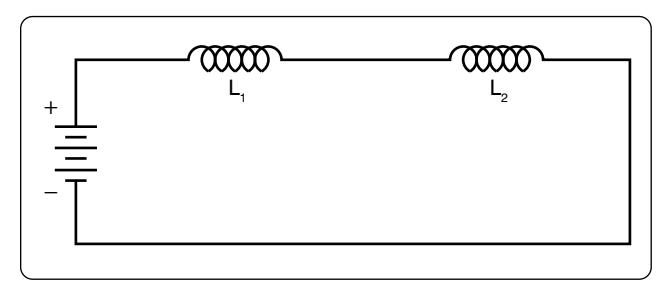

The inductive reactance of a component is directly proportional to the inductance of the component and the applied frequency to the circuit. By increasing either the inductance or applied frequency, the inductive reactance likewise increases and presents more opposition to current in the circuit. This relationship is given as:

XL = 2πfL Where: XL = inductive reactance in ohms f = frequency in cycles per second π = 3.1416 L = inductance

In *Figure 12-130*, an AC series circuit is shown in which the inductance is 0.146 henry and the voltage is 110 volts at a frequency of 60 cps. Inductive reactance is determined by the following method.

XL = 2π × f × L XL = 6.28 × 60 × 0.146 XL = 55 ohm

In any circuit where there is only resistance, the expression for the relationship of voltage and current is given by Ohm's Law: I = E/R. Similarly, when there is inductance in an AC circuit, the relationship between voltage and current can be expressed as:

Current = or I = Voltage E Reactance XL

Where:

 XL = inductive reactance of the circuit in ohms I = E XL I = 110 55 I = 2 amperes

In AC series circuits, inductive reactances are added like resistances in series in a DC circuit. *[Figure 12-131]* Thus, the total reactance in the illustrated circuit equals the sum of

The total reactance of inductors connected in parallel is found the same way as the total resistance in a parallel circuit. *[Figure 12-132]* Thus, the total reactance of inductances connected in parallel, as shown, is expressed as:

(XL)T = + + 1 (XL)1 1 (XL)2 1 (XL)3 1

# **AC Circuits**

#### **Ohm's Law for AC Circuits**

The rules and equations for DC circuits apply to AC circuits only when the circuits contain resistance alone, as in the case of lamps and heating elements. In order to use effective values of voltage and current in AC circuits, the effect of inductance and capacitance with resistance must be considered.

The combined effects of resistance, inductive reactance, and capacitive reactance make up the total opposition to current flow in an AC circuit. This total opposition is called impedance and is represented by the letter Z. The unit for the measurement of impedance is the ohm.

#### **Series AC Circuits**

If an AC circuit consists of resistance only, the value of the impedance is the same as the resistance, and Ohm's Law for an AC circuit, I = E/Z, is exactly the same as for a DC circuit. In *Figure 12-133,* a series circuit containing a lamp with 11 ohms resistance connected across a source is illustrated. To find how much current flows if 110 volts DC is applied and how much current flows if 110 volts AC are applied, the following examples are solved:

I = E R I = (where Z = R) E Z I = 110 V 11 W I = 110 V 11 W I = 10 amperes DC I = 10 amperes AC

When AC circuits contain resistance and either inductance or capacitance, the impedance, Z, is not the same as the

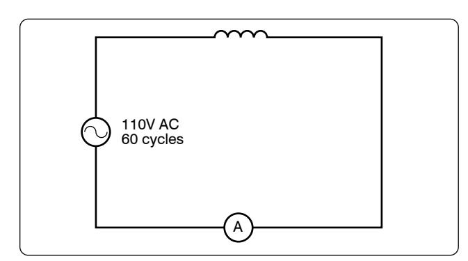

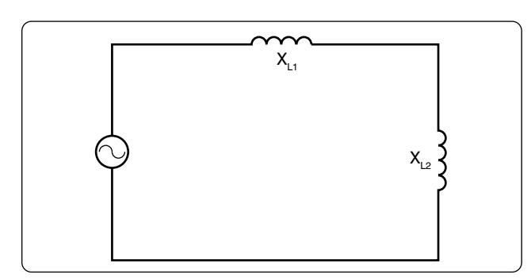

**Figure 12-130.** *AC circuit containing inductance.*

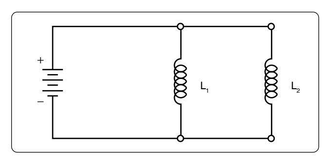

**Figure 12-129.** *Two inductors in parallel.*

resistance, R. The impedance of a circuit is the circuit's total opposition to the flow of current. In an AC circuit, this opposition consists of resistance and reactance, either inductive or capacitive or elements of both.

Resistance and reactance cannot be added directly, but they can be considered as two forces acting at right angles to each other. Thus, the relation between resistance, reactance, and impedance may be illustrated by a right triangle. *[Figure 12-134]*

Since these quantities may be related to the sides of a right triangle, the formula for finding the impedance, or total opposition to current flow in an AC circuit, can be found by using the law of right triangles. This theorem, called the Pythagorean theorem, applies to any right triangle. It states that the square of the hypotenuse is equal to the sum of the squares of the other two sides. Thus, the value of any side of a right triangle can be found if the other two sides are known. If an AC circuit contains resistance and inductance, as shown in *Figure 12-135*, the relation between the sides can be stated as:

Z2 = R2 + XL 2

The square root of both sides of the equation gives

Z = R2 + XL 2

This formula can be used to determine the impedance when the values of inductive reactance and resistance are known. It can be modified to solve for impedance in circuits containing capacitive reactance and resistance by substituting XC in the formula in place of XL. In circuits containing resistance with both inductive and capacitive reactance, the reactances can be combined, but because their effects in the circuit are exactly opposite, they are combined by subtraction:

X = XL − XC or X = XC − XL (the smaller number is always subtracted from the larger)

inductance connected in series is connected to a source of 110 volts at 60 cps. The resistive element is a lamp with 6 ohms resistance, and the inductive element is a coil with an inductance of 0.021 henry. What is the value of the impedance and the current through the lamp and the coil?

#### *Solution:*

First, the inductive reactance of the coil is computed:

XL = 2π × f × L

XL = 6.28 × 60 × 0.021

XL = 8 ohms inductive reactance

Next, the total impedance is computed:

Z = R2 + XL 2

Z = 62 + 82

Z = 36 + 64

Z = 100

Z = 10 ohms impedance

Then the current flow,

I = E Z

I = 110 10

I = 11 amperes current

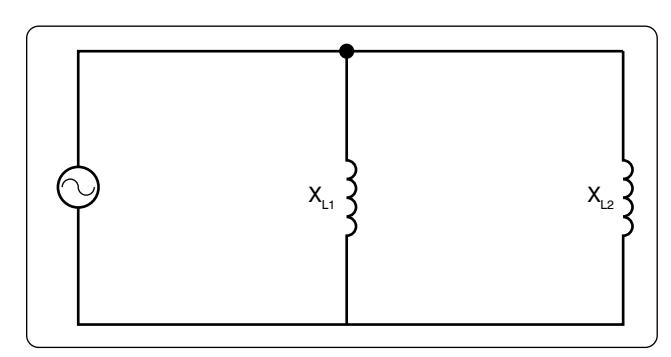

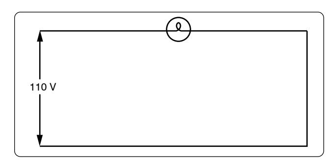

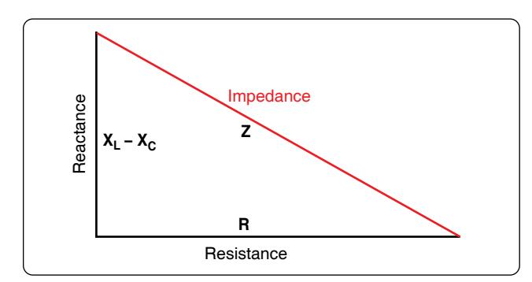

**Figure 12-133.** *Applying DC and AC to a circuit.*

ER = I × R ER = 11 × 6 = 66 volts

The voltage drop across the inductance (EXL) is:

EXL = I × XL EXL = 11 × 8 = 88 volts

The sum of the two voltages is greater than the impressed voltage. This results from the fact that the two voltages are out of phase and, as such, represent the maximum voltage. If the voltage in the circuit is measured by a voltmeter, it is approximately 110 volts, the impressed voltage. This can be proved by the equation:

E = (ER)2 + (EXL)2

E = 662 + 882

E = 4,356 + 7,744

E = 12,100

E = 110 volts

In *Figure 12-136*, a series circuit is illustrated in which a capacitor of 200 µf is connected in series with a 10 ohm lamp. What is the value of the impedance, the current flow, and the voltage drop across the lamp?

#### *Solution:*

First, the capacitance is changed from microfarads to farads. Since 1 million microfarads equal 1 farad, then:

200 μf = = 0.000200 farads 200 1,000,000 XC = 1 2πfC XC = 1 6.28 × 60 × 0.000200 farads XC = 1 0.07536

XC = 13 ohms capacitive reactance To find the impedance,

Z = R2 + XC 2 Z = 102 + 132 Z = 100 + 169 Z = 269 Z = 16.4 ohms capacitive reactance

To find the current,

I = E Z I = 110 16.4

I = 6.7 amperes

The voltage drop across the lamp (ER) is:

ER = 6.7 × 10 ER = 67 volts

The voltage drop across the capacitor (EXC) is

EXC = I × XC

EXC = 6.7 × 13

EXC = 86.1 volts

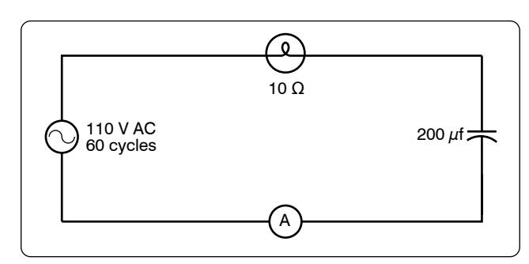

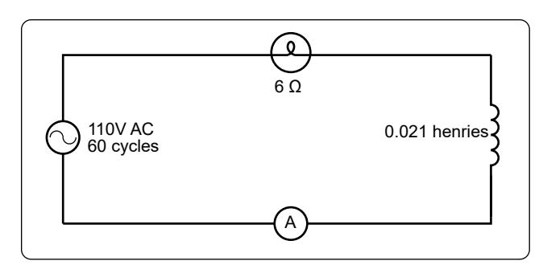

**Figure 12-135.** *A circuit containing resistance and inductance.*

The sum of these two voltages does not equal the applied voltage, since the current leads the voltage. To find the applied voltage, use the following formula:

ET = (ER)2 + (EXC)2 ET = 672 + 86.12 ET = 4,489 + 7,413 ET = 11,902 ET = 110 volts

When the circuit contains resistance, inductance, and capacitance, the following equation is used to find the impedance:

Z = R2 + (XL – XC)2

**Example:** What is the impedance of a series circuit, consisting of a capacitor with a reactance of 7 ohms, an inductor with a reactance of 10 ohms, and a resistor with a resistance of 4 ohms? *[Figure 12-137]*

#### *Solution:*

Z = R2 + (XL – XC) 2 Z = 42 + (10 – 7)2 Z = 42 + 32 Z = 25 Z = 5 ohms

Assuming that the reactance of the capacitor is 10 ohms and the reactance of the inductor is 7 ohms, then XC is greater than XL. Thus,

Z = R2 + (XL – XC)2 Z = 42 + (7 – 10)2 Z = 42 + (–3)2 Z = 16 + 9 Z = 25 Z = 5 ohms

#### **Parallel AC Circuits**

The methods used in solving parallel AC circuit problems are basically the same as those used for series AC circuits. Out of phase voltages and currents can be added by using the law of right triangles. However, in solving circuit problems, the currents through the branches are added since the voltage drops across the various branches are the same and are equal to the applied voltage. In *Figure 12-138*, a parallel AC circuit containing an inductance and a resistance is shown schematically. The current flowing through the inductance, IL, is 0.0584 ampere, and the current flowing through the resistance is 0.11 ampere. What is the total current in the circuit?

#### *Solution:*

IT = IL 2 + IR 2 = (0.0584)2 + (0.11)2 = 0.0155 = 0.1245 ampere

Since inductive reactance causes voltage to lead the current, the total current, which contains a component of inductive current, lags the applied voltage. If the current and voltages are plotted, the angle between the two, called the phase angle, illustrates the amount the current lags the voltage.

In *Figure 12-139*, a 112-volt generator is connected to a load consisting of a 2 µf capacitance and a 10,000-ohm resistance in parallel. What is the value of the impedance and total current flow?

#### *Solution:*

First, find the capacitive reactance of the circuit:

XC = 1 2πfC

Changing 2 μf to farads and entering the values into the formula given:

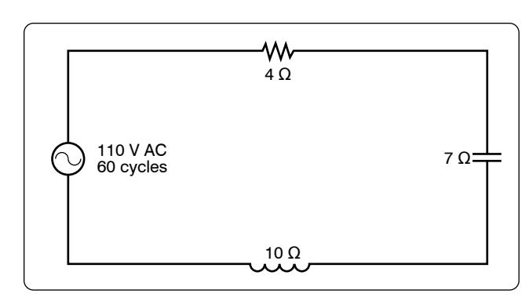

**Figure 12-137.** *A circuit containing resistance, inductance, and capacitance.*

= 1 2 × 3.14 × 60 × 0.000002 = or 1 10,000 0.00075360 7.536 = 1,327 XC capacitive reactance

To find the impedance, the impedance formula used in a series AC circuit must be modified to fit the parallel circuit:

Z = R2 + XC 2 RXC = (10,000)2 + (1,327)2 10,000 × 1,327 = 0.1315 W (approximately)

To find the current through the capacitance:

IC = E XC IC = 110 1,327 = 0.0829 ampere

To find the current flowing through the resistance:

IR = E R = 110 10,000 = 0.011 ampere

To find the total current in the circuit:

IT 2 = IR 2 + IC 2 IT = IL 2 + IR 2 = 0.0836 ampere (approximately)

#### **Resonance**

It has been shown that both inductive reactance:

(XL = 2πfL)

and capacitive reactance:

XC = 1 2πfC

are functions of an AC frequency. Decreasing the frequency decreases the ohmic value of the inductive reactance, but a decrease in frequency increases the capacitive reactance. At some particular frequency, known as the resonant frequency, the reactive effects of a capacitor and an inductor is equal. Since these effects are the opposite of one another, they will cancel, leaving only the ohmic value of the resistance to oppose current flow in a circuit. If the value of resistance is small or consists only of the resistance in the conductors, the value of current flow can become very high.

In a circuit where the inductor and capacitor are in series, and the frequency is the resonant frequency, or frequency of resonance, the circuit is said to be "in resonance" and is referred to as a series resonant circuit. The symbol for resonant frequency is Fn.

If, at the frequency of resonance, the inductive reactance is equal to the capacitive reactance, then:

XL = XC, or 2πfL = 1 2πfC

Dividing both sides by 2 fL,

Fn2 = 1 (2π) 2LC

Extracting the square root of both sides gives:

Fn = 1 2π LC

Where Fn is the resonant frequency in cps, C is the capacitance in farads, and L is the inductance in henries. With this formula, the frequency at which a capacitor and inductor is resonant can be determined.

To find the inductive reactance of a circuit use:

XL = 2πfL

The impedance formula used in a series AC circuit must be modified to fit a parallel circuit.

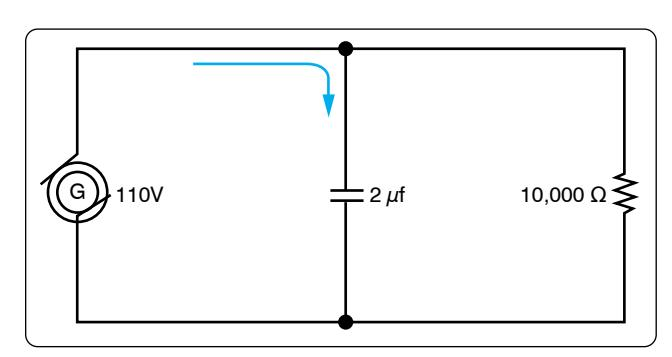

**Figure 12-139.** *A parallel AC circuit containing capacitance and resistance.*

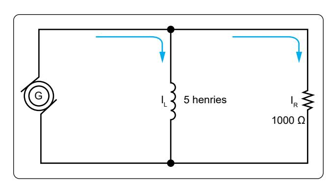

**Figure 12-138.** *AC parallel circuit containing inductance and resistance.*

 Z = R2 = XL 2 XL

To find the parallel networks of inductance and capacitive reactors, use:

X = XL + XC XL + XC

To find the parallel networks with resistance capacitive and inductance, use:

Z = XL 2 XC 2 + (RXL – RXC)2 R XL XC

Since at the resonant frequency XL cancels XC, the current can become very large, depending on the amount of resistance. In such cases, the voltage drop across the inductor or capacitor is often higher than the applied voltage.

In a parallel resonant circuit, the reactances are equal and equal currents flow through the coil and the capacitor. *[Figure 12-140]*

Since the inductive reactance causes the current through the coil to lag the voltage by 90°, and the capacitive reactance

causes the current through the capacitor to lead the voltage by 90°, the two currents are 180° out of phase. The canceling effect of such currents would mean that no current would flow from the generator and the parallel combination of the inductor and the capacitor would appear as infinite impedance. In practice, no such circuit is possible, since some value of resistance is always present, and the parallel circuit, sometimes called a tank circuit, acts as very high impedance. It is also called an antiresonant circuit, since its effect in a circuit is opposite to that of a series resonant circuit, in which the impedance is very low.

#### **Power in AC Circuits**

In a DC circuit, power is obtained by the equation, P = EI, (watts equal volts × amperes). Thus, if 1 ampere of current flows in a circuit at a pressure of 200 volts, the power is 200 watts. The product of the volts and the amperes is the true power in the circuit.

# **True Power Defined**

True power of any AC circuit is commonly referred to as the working power of the circuit. True power is the power consumed by the resistance portion of the circuit and is measured in watts. True power is symbolized by the letter P and is indicated by any wattmeter in the circuit. True power is calculated by the formula:

P = I2 × Z

#### *Apparent Power Defined*

Apparent power in an AC circuit is sometimes referred to as the reactive power of a circuit. Apparent power is the power consumed by the entire circuit, including both the resistance and the reactance. Apparent power is symbolized by the letter S and is measured in volt-amps (VA). Apparent power is a product of the effective voltage multiplied by the effective current. Apparent power is calculated by the formula:

S = I2 × Z

Only when the AC circuit is made up of pure resistance is the apparent power equal to the true power. *[Figure 12-141]* When there is capacitance or inductance in the circuit, the current and voltage are not exactly in phase, and the true power is less than the apparent power. The true power is obtained by a wattmeter reading. The ratio of the true power to the apparent power is called the power factor and is usually expressed in percent. In equation form, the relationship is:

Power Factor (PF) = 100 × watts (True Power) volts × amperes (Apparent Power)

**Example:** A 220-volt AC motor takes 50 amperes from the line, but a wattmeter in the line shows that only 9,350 watts

**Figure 12-140.** *A parallel resonant circuit.*

are taken by the motor. What are the apparent power and the power factor?

#### *Solution:*

Apparent power = Volts × Amperes

Apparent power = 220 × 50 = 11,000 watts or volt-amperes.

(PF) = Watts (True Power) × 100 VA (Apparent Power)

(PF) = 9,350 × 100 11,000

(PF) = 85, or 85%

#### **Transformers**

A transformer changes electrical energy of a given voltage into electrical energy at a different voltage level. It consists of two coils that are not electrically connected, but are arranged so that the magnetic field surrounding one coil cuts through the other coil. When an alternating voltage is applied to (across) one coil, the varying magnetic field set up around that coil creates an alternating voltage in the other coil by mutual induction. A transformer can also be used with pulsating DC, but a pure DC voltage cannot be used, since only a varying voltage creates the varying magnetic field that is the basis of the mutual induction process.

A transformer consists of three basic parts. *[Figure 12-142]*  These are an iron core, which provides a circuit of low reluctance for magnetic lines of force; a primary winding, which receives the electrical energy from the source of applied voltage; and a secondary winding, which receives electrical energy by induction from the primary coil.

The primary and secondary of this closed core transformer are wound on a closed core to obtain maximum inductive effect between the two coils.

There are two classes of transformers: voltage transformers, used for stepping up or stepping down voltages; and current transformers used in instrument circuits. In voltage transformers, the primary coils are connected in parallel across the supply voltage. *[Figure 12-143A]* The primary windings of current transformers are connected in series in the primary circuit. *[Figure 12-143B]* Of the two types, the voltage transformer is the more common.

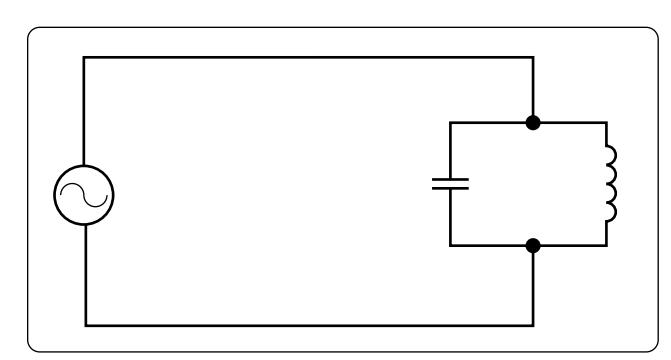

There are many types of voltage transformers. Most of these are either step-up or step-down transformers. The factor that determines whether a transformer is a step-up or stepdown type is the "turns" ratio. The turns ratio is the ratio of the number of turns in the primary winding to the number of turns in the secondary winding. For example, the turns ratio of the step-down transformer is 5 to 1, since there are five times as many turns in the primary as in the secondary. *[Figure 12-144A]* The step-up transformer has a 1 to 4 turns ratio. *[Figure 12-144B]*

The ratio of the transformer input voltage to the output voltage is the same as the turns ratio if the transformer is 100 percent efficient. Thus, when 10 volts are applied to the primary of the transformer, two volts are induced in the secondary. *[Figure 12-144A]* If 10 volts are applied to the primary of the transformer, the output voltage across the terminals of the secondary is 40 volts. *[Figure 12-144B]*

No transformer can be constructed that is 100 percent efficient, although iron core transformers can approach this figure. This is because all the magnetic lines of force set up in the primary do not cut across the turns of the secondary coil. A certain amount of the magnetic flux, called leakage flux, leaks out of the magnetic circuit. The measure of how well the flux of the primary is coupled into the secondary is called the "coefficient of coupling." For example, if it is assumed that the primary of a transformer develops 10,000 lines of force and only 9,000 cut across the secondary, the coefficient of coupling would be 0.9. Stated another way, the transformer would be 90 percent efficient.

When an AC voltage is connected across the primary terminals of a transformer, an AC flows and self induces a voltage in the primary coil that is opposite and nearly equal to the applied voltage. The difference between these two voltages allows just enough current in the primary to magnetize its core. This is called the exciting, or magnetizing, current. The magnetic field caused by this exciting current cuts across the secondary coil and induces a voltage by mutual induction.

If a load is connected across the secondary coil, the load current flowing through the secondary coil produces a magnetic field that tends to neutralize the magnetic field produced by the primary current. This reduces the self-induced (opposition) voltage in the primary coil and allows more primary current