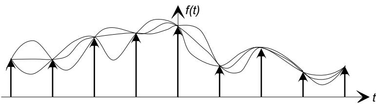
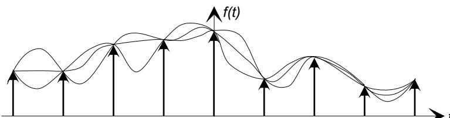
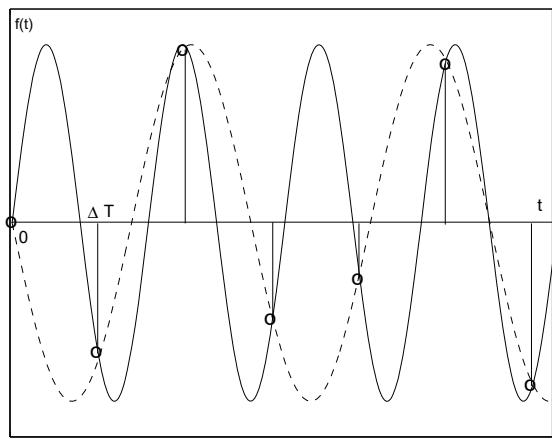
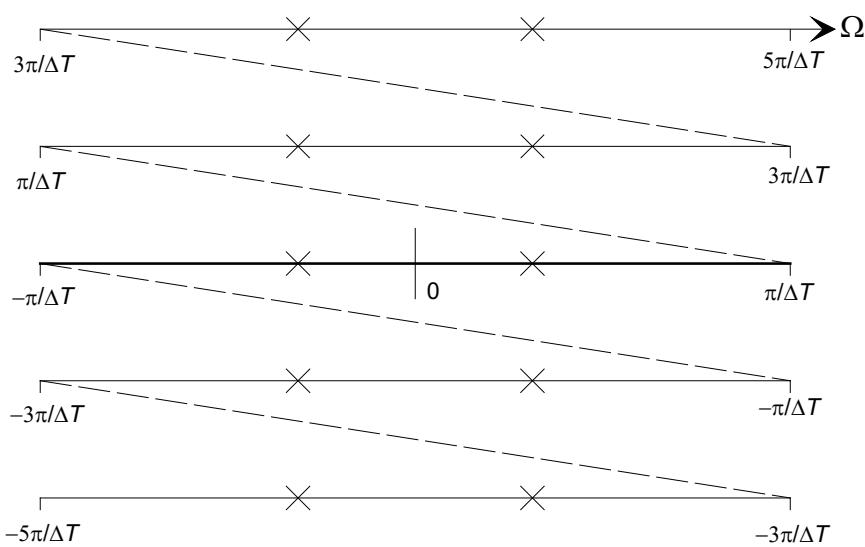
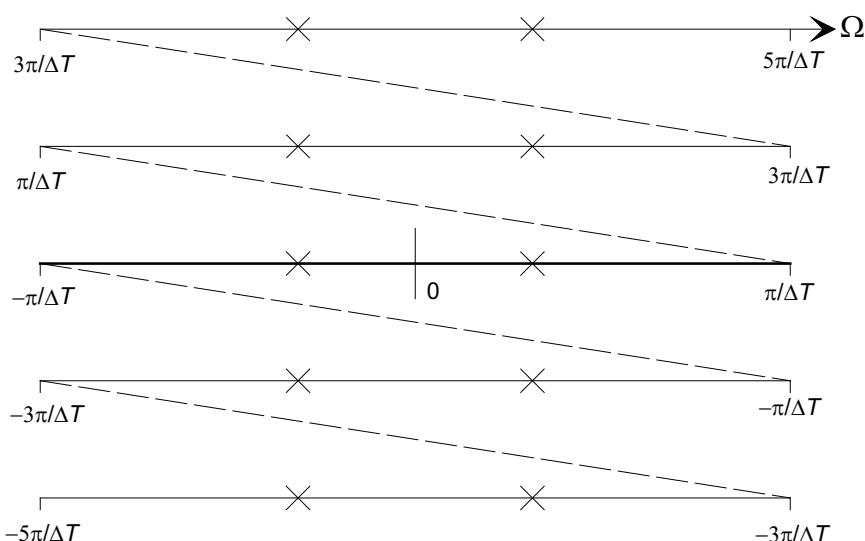
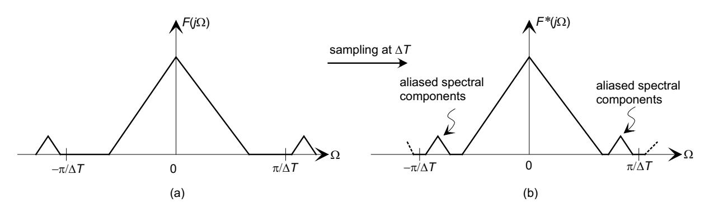
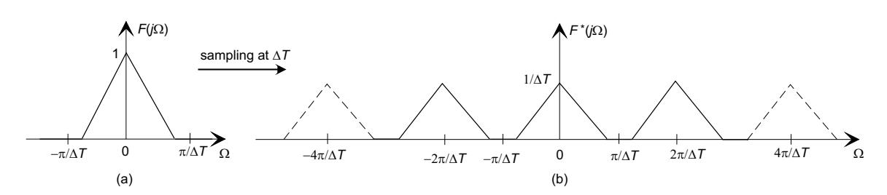
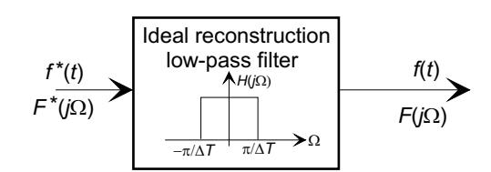
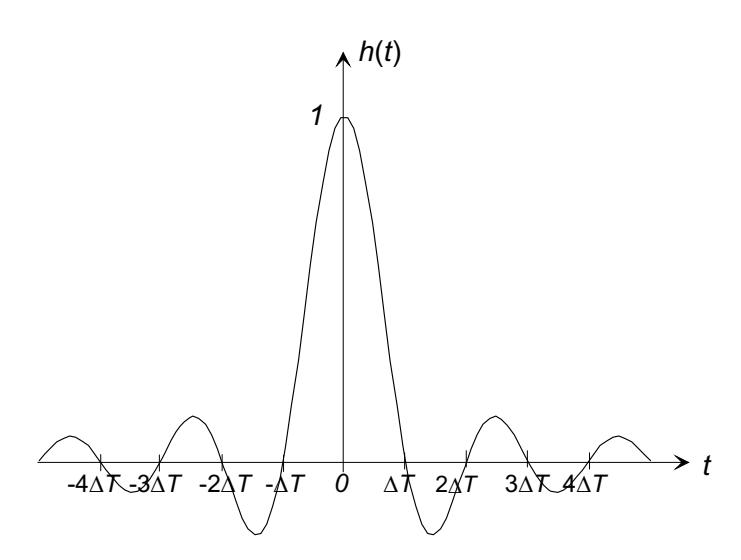
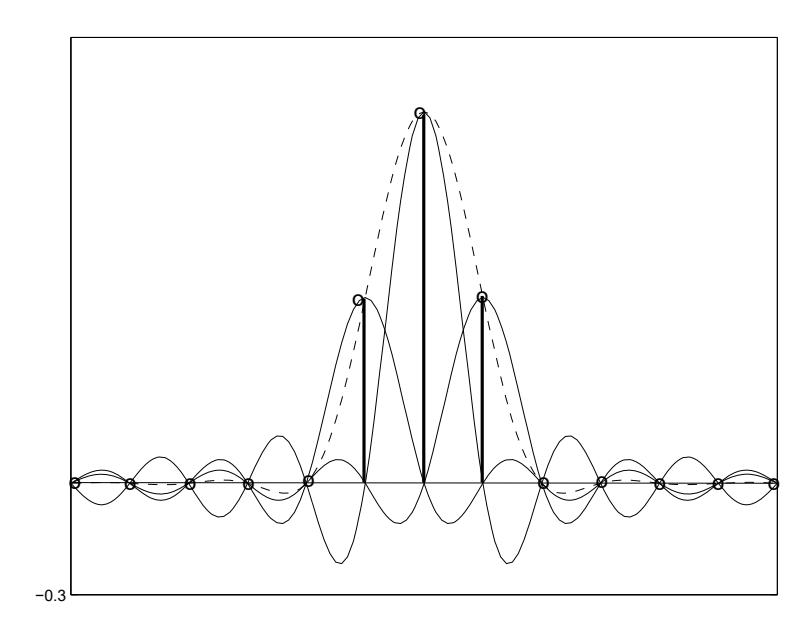

MIT OpenCourseWare <http://ocw.mit.edu>

### 2.161 Signal Processing: Continuous and Discrete Fall 2008

For information about citing these materials or our Terms of Use, visit: [http://ocw.mit.edu/terms.](http://ocw.mit.edu/terms)

#### **1 The Sampling Theorem**

# Massachusetts Institute of Technology Department of Mechanical Engineering 2.161 Signal Processing - Continuous and Discrete Fall Term 2008

### **Lecture 10**1

### **Reading:**

- Class Handout: Sampling and the Discrete Fourier Transform
- Proakis & Manolakis (4th Ed.) Secs. 6.1 6.3, Sec. 7.1
- Oppenheim, Schafer & Buck (2nd Ed.) Secs. 4.1 4.3, Secs. 8.1 8.5

Given a set of samples {fn} and its generating function f(t), an important question to ask is whether the sample set uniquely defines the function that generated it? In other words, given {fn} can we unambiguously reconstruct f(t)? The answer is clearly no, as shown below, where there are obviously many functions that will generate the given set of samples.

In fact there are an infinity of candidate functions that will generate the same sample set.

The Nyquist sampling theorem places restrictions on the candidate functions and, if satisfied, will uniquely define the function that generated a given set of samples. The theorem may be stated in many equivalent ways, we present three of them here to illustrate different aspects of the theorem:

- A function f(t), sampled at equal intervals ΔT, can not be unambiguously reconstructed from its sample set {fn} unless it is known a-priori that f(t) contains no spectral energy at or above a frequency of π/ΔT radians/s.
- In order to uniquely represent a function f(t) by a set of samples, the sampling interval ΔT must be sufficiently small to capture more than two samples per cycle of the highest frequency component present in f(t).
- There is only one function f(t) that is band-limited to below π/ΔT radians/s that is satisfied by a given set of samples {fn}.

1copyright c D.Rowell 2008

�� � � 2πm fn = A sin(anΔT + φ)= A sin a + nΔT + φ ΔT

Note that the sampling rate, Fs =1/ΔT, must be greater than twice the highest cyclic frequency Fmax in f(t). Thus if the frequency content of f(t) is limited to Ωmax radians/s (or Fmax cycles/s) the sampling interval ΔT must be chosen so that

π ΔT< Ωmax

or equivalently

1 ΔT< 2Fmax

The minimum sampling rate to satisfy the sampling theorem FN =Ωmax/π samples/s is known as the Nyquist rate.

### **1.1 Aliasing**

Consider a sinusoid

f(t)= A sin(at + φ)

sampled at intervals ΔT, so that the sample set is

{fn} = {A sin(anΔT + φ)} ,

and noting that sin(t)= sin(t +2kπ) for any integer k,

where m is an integer, giving the following important result:

Given a sampling interval of ΔT, sinusoidal components with an angular frequency a and a +2πm/ΔT, for any integer m, will generate the same sample set.

In the figure below, a sinusoid is undersampled and a lower frequency sinusoid, shown as a dashed line, also satisfies the sample set.

0

This phenomenon is known as aliasing. After sampling any spectral component in F(jΩ) above the Nyquist frequency π/ΔT will "masquerade" as a lower frequency component within the reconstruction bandwidth, thus creating an erroneous reconstructed function. The phenomenon is also known as frequency folding since the high frequency components will be "folded" down into the assumed system bandwidth.

One-half of the sampling frequency (i.e. 1/(2ΔT) cycles/second, or π/ΔT radians/second) is known as the aliasing frequency,or folding frequency for these reasons.

The following figure shows the effect of folding in another way. In (a) a function f(t) with Fourier transform F(j Ω) has two disjoint spectral regions. The sampling interval ΔT is chosen so that the folding frequency π/ΔT falls between the two regions. The spectrum of the sampled system between the limits −π/ΔT< Ω ≤ π/ΔT is shown in (b). The frequency components above the aliasing frequency have been folded down into the region −π/ΔT< Ω ≤ π/ΔT.

# **1.2 Anti-Aliasing Filtering:**

Once a sample set {fn} has been taken, there is nothing that can be done to eliminate the effects of aliased frequency components. The only way to guarantee that the sample set unambiguously represents the generating function is to ensure that the sampling theorem criteria have been met, either by

*-*

*-*

� ∞ � � �� 1 2πn F-(j Ω) = F j Ω − . ΔT ΔT n=−∞

- 1. Selecting a sampling interval ΔT sufficiently small to capture all spectral components, or
- 2. Processing the continuous-time function f(t) to "eliminate" all components at or above the Nyquist rate.

The second method involves the use of a continuous-time processor before sampling f(t). A low-pass aanti-aliasing filter is used to eliminate (or at least attenuate) spectral components at or above the Nyquist frequency. Ideally the anti-aliasing filter would have a transfer function

� 1 for |Ω| <π/ΔT H(j Ω) = 0 otherwise,.

- -

 -

--

In practice it is not possible to design a filter with such characteristics, and a more realistic goal is to reduce the offending spectral components to insignificant levels, while maintaining the fidelity of components below the folding frequency.

# **1.3 Reconstruction of a Function from its Sample Set**

We saw in Lecture 9 that the spectrum F-(j Ω) of a sampled function f -(t) is infinite in extent and consists of a scaled periodic extension of F(j Ω) with a period of 2π/ΔT, i.e.

If it is assumed that the sampling theorem was obeyed during sampling, the repetitions in F-(j Ω) will not overlap, and in fact f(t) will be entirely specified by a single period of F-(j Ω). Therefore to reconstruct f(t) we can pass f -(t) through an ideal low-pass filter with transfer function H(j Ω) that will retain spectral components in the range −π/ΔT< Ω <π/ΔT and reject all other frequencies.

� ΔT for |Ω| <π/ΔT H(j Ω) = 0 otherwise,

� � ∞ ∞ f(t)= f -(t) ⊗ h(t)= h(σ) f(t − σ)δ(t − nΔT − σ)dσ ∞ n=−∞ �∞ � ∞ sin (πσ/ΔT) = f(t − σ)δ(t − nΔT − σ)dσ πσ/ΔT n=−∞ ∞ �∞ sin (π(t − nΔT)/ΔT) = f(nΔT) , π(t − nΔT)/ΔT n=−∞

If the transfer function of the reconstruction filter is

in the absence of aliasing in f ∗(t), that is no overlap between replications of F(j Ω) in F∗(j Ω), the filter output will be

y(t)= F −1 {F-(j Ω)H(j Ω)} = F −1 {F(j Ω)} = f(t).

The filter's impulse response h(t)is

h(t)= F −1 {H(j Ω)} = sin (πt/ΔT) , πt/ΔT

and note that the impulse response h(t) = 0 at times t = ±nΔT for n =1, 2, 3,... (the sampling times). The output of the reconstruction filter is the convolution of the input function f -(t) with the impulse response h(t),

� ∞ � � �� 1 2nπ F-(j Ω) = F j Ω − ΔT T n=−∞

� F-(j Ω) = � ∞ f -(t)e−jΩt dt = � ∞ �∞ f(t)δ(t − nΔT)e−jΩt dt −∞ −∞ n=−∞ ∞ = f(nΔT)e−jΩnΔT n=−∞

#### **2 The Discrete Fourier Transform (DFT)**

or in the case of a finite data record of length N

N �−1 sin (π(t − nΔT)/ΔT) f(t)= fn . π(t − nΔT)/ΔT n=0

This is known as the cardinal (or Whittaker) reconstruction function. It is a superposition of shifted sinc functions, with the important property that at t = nΔT, the reconstructed function f(t)= fn. This can be seen by letting t = nΔT, in which case only the nth term in the sum is nonzero. Between the sample points the interpolation is formed from the sum of the sinc functions. The reconstruction is demonstrated below, where a sample set (N = 13) with three nonzero samples is reconstructed. The individual sinc functions are shown, together with the sum (dashed line). Notice how the zeros of the sinc functions fall at the sample points.

We saw in Lecture 8 that the Fourier transform of the sampled waveform f ∗(t) can be written as a scaled periodic extension of F(j Ω)

We now look at a different formulation of F∗(j Ω). The Fourier transform of the sampled function f -(t)

� N−1 F∗ (j Ω) = f(nΔT)e−jΩnΔT n=0

� N−1 Fm = fn e−j2πmn/N for m =0, 1, 2,...,N − 1 n=0

� N−1 1 j2πmn/N fn = Fm e for n =0, 1, 2,...,N − 1 N m=0

by reversing the order of integration and summation, and using the sifting property of δ(t). We note:

- F-(j Ω) is a continuous function of Ω, but is computed from the sample points f(nΔT) in f(t).
- We have shown that F-(j Ω) is periodic in Ω with period Ω0 =2π/ΔT.

We now restrict ourselves to a finite, causal waveform f(t) in the interval 0 ≤ t<nΔT,so that it has N samples, and let

which is known as the Discrete-Time Fourier Transform (DTFT).

As a further restriction consider computing a finite set of N samples of F∗(j Ω) in a single period, from Ω = 0 to 2π/ΔT, that is at frequencies

2πm Ωm = for m =0, 1, 2,...,N − 1 NΔT

-

% 

 -

-

and writing Fm = F-(j Ωm)= F-(j 2πm/NΔT), the DTFT becomes

where fn = f(nΔT). This equation is known as the Discrete Fourier Transform (DFT) and relates the sample set {fn} to a set of samples of its spectrum {Fm} – both of length N. The DFT can be inverted and the sample set {fn} recovered as follows:

which is known as the inverse DFT (IDFT). These two equations together form the DFT pair.

- The DFT operations are a transform pair between two sequences {fn} and {Fm}.
- The DFT expressions do not explicitly involve the sampling interval ΔT or the sampled frequency interval Ω = 2π/(nΔT).
- • Simple substitution into the formulas will show that both Fm and fn are periodic with period N, that is fn+pN = fn and Fm+pN = Fm for any integer p.

The inverse transform is easily demonstrated:

1 N−1 1 N−1 �N−1 � � j 2πmn/N � �fk e−j 2πmk/N j 2πmn/N fn = Fm e = e N N m=0 m=0 k=0 1 N−1 N−1 j 2πm(n−k)/N = �fk � e N k=0 m=0 1 = (Nfn) = fn N

since

N−1 � � N e = for n = k j 2πm(n−k)/N 0 otherwise. m=0

As in the continuous Fourier transform case, we adopt the notations

DFT {fn} ⇐⇒ {Fm} {Fm} = DFT {fn} {fn} = IDFT {Fm}

to indicate DFT relationships.