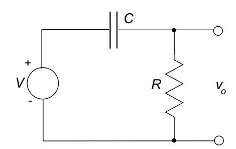
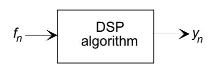
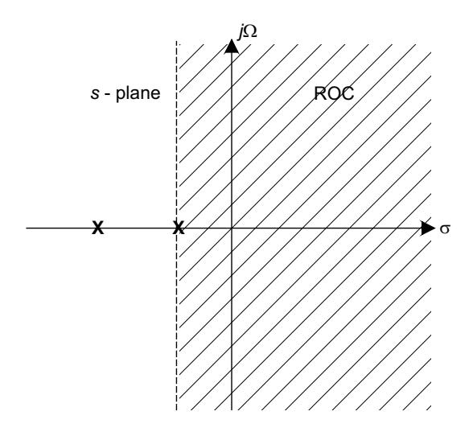
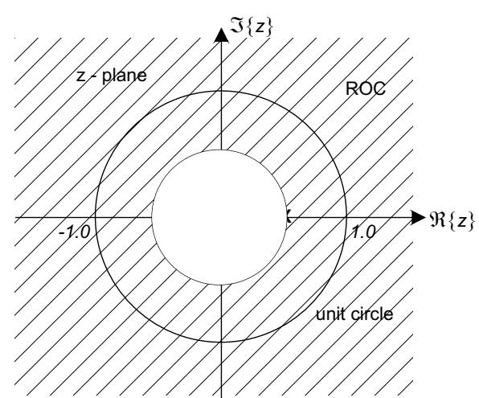
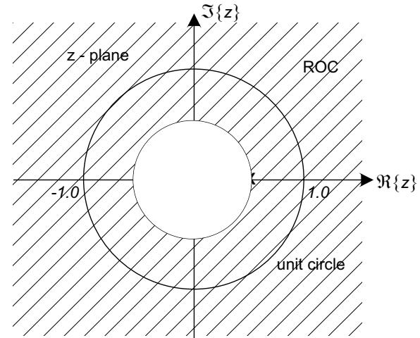
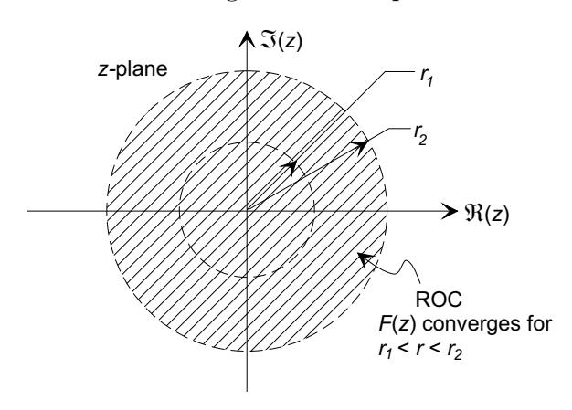
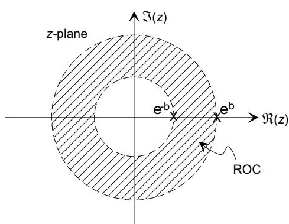
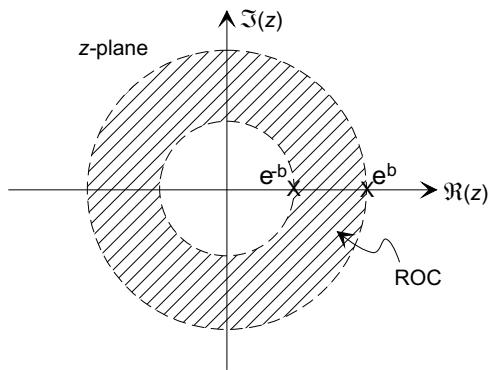

MIT OpenCourseWare <http://ocw.mit.edu>

#### 2.161 Signal Processing: Continuous and Discrete Fall 2008

For information about citing these materials or our Terms of Use, visit: [http://ocw.mit.edu/terms.](http://ocw.mit.edu/terms)

#### **1 Introduction to Time-Domain Digital Signal Processing**

# Massachusetts Institute of Technology Department of Mechanical Engineering 2.161 Signal Processing - Continuous and Discrete Fall Term 2008

# **Lecture 13**1

### **Reading:**

- Proakis & Manolakis, Chapter 3 (The z-transform)
- Oppenheim, Schafer & Buck, Chapter 3 (The z-transform)

Consider a continuous-time filter

*-*

such as simple first-order RC high-pass filter:

described by a transfer function

H(s)= RCs RCs +1.

The ODE describing the system is

τ dy dt + y = τ df dt

where τ = RC is the time constant.

Our task is to derive a simple discrete-time equivalent of this prototype filter based on samples of the input f(t) taken at intervals ΔT.

1copyright c D.Rowell 2008

� � N M yn = aiyn−i + bifn−i i=1 i=0

� N yn = aiyn−i + b0fn i=0

If we use a backwards-difference numerical approximation to the derivatives, that is

dx (x(nΔT) − x((n − 1)ΔT) ≈ dt ΔT

and adopt the notation yn = y(nΔT), and let a = τ/ΔT,

a(yn − yn−1)+ yn = a(fn − fn−1)

and solving for yn

a a a yn = yn−1 + fn − fn−1 1+ a 1+ a 1+ a

which is a first-order difference equation, and is the computational formula for a sampleby-sample implementation of digital high-pass filter derived from the continuous prototype above. Note that

- The "fidelity" of the approximation depends on ΔT, and becomes more accurate when ΔT τ .
- At each step the output is a linear combination of the present and/or past samples of the output and input. This is a recursive system because the computation of the current output depends on prior values of the output.

In general, regardless of the design method used, a LTI digital filter implementation will be of a similar form, that is

where the ai and bi are constant coefficients. Then as in the simple example above, the current output is a weighted combination of past values of the output, and current and past values of the input.

- If ai ≡ 0 for i =1 ...N, so that

� M yn = bifn−i i=0

The output is simply a weighted sum of the current and prior inputs. Such a filter is a non-recursive filter with a finite-impulse-response (FIR), and is known as a moving average (MA) filter, or an all-zero filter.

- If bi ≡ 0 for i =1 ...M, so that

only the current input value is used. This filter is a recursive filter with an infiniteimpulse-response (IIR), and is known as an auto-regressive (AR) filter, or an all-pole filter.

� � N M yn = aiyn−i + bifn−i i=1 i=0

� 1 n =0 δn = 0 otherwise. - *-*

� ∞ fn = fkδn−k k=−∞

� ∞ yn = fkhn−k k=−∞

#### **2 The Discrete-time Convolution Sum**

- With the full difference equation

the filter is a recursive filter with an infinite-impulse response (IIR), and is known as an auto-regressive moving-average (ARMA) filter.

For a continuous system

*-*

the output y(t), in response to an input f(t), is given by the convolution integral:

� ∞ y(t)= f(τ )h(t − τ )dτ 0

where h(t) is the system impulse response.

For a LTI discrete-time system, such as defined by a difference equation, we define the pulse response sequence {h(n)} as the response to a unit-pulse input sequence {δn}, where

If the input sequence {fn} is written as a sum of weighted and shifted pulses, that is

then by superposition the output will be a sequence of similarly weighted and shifted pulse responses

which defines the convolution sum, which is analogous to the convolution integral of the continuous system.

#### **The** z**-Transform 3**

The z-transform in discrete-time system analysis and design serves the same role as the Laplace transform in continuous systems. We begin here with a parallel development of both the z and Laplace transforms from the Fourier transforms.

� ∞ F∗ (jΩ) = fne−jnΩΔT n=0

� � {wn} = fnr−n

� ∞ W∗ (jΩ) = F˜∗ (jΩ|r)= � fnr−n� e−jnΩΔT n=0 ∞ = �fn � rejΩΔT �−n n=0

� ∞ F(z)= F˜∗ (jΩ|r)= fnz−n n=0

#### **The Laplace Transform**

**(1)** We begin with causal f(t) and find its Fourier transform (Note that because f(t)is causal, the integral has limits of 0 and ∞):

� ∞ F(jΩ) = f(t)e−jΩt dt 0

**(2)** We note that for some functions f(t) (for example the unit step function), the Fourier integral does not converge.

**(3)** We introduce a weighted function

w(t)= f(t)e−σt

and note

lim w(t)= f(t) σ→0

The effect of the exponential weighting by e−σt is to allow convergence of the integral for a much broader range of functions f(t).

**(4)** We take the Fourier transform of w(t)

� ∞ W(jΩ) = F˜(jΩ|σ)= � f(t)e−σt� e−jΩt dt 0 � ∞ = f(t)e−(σ+jΩ)dt 0

and define the complex variable s = σ + jΩso that we can write

� ∞ F(s)= F˜(jω|σ)= f(t)e−stdt 0

F(s) is the one-sided Laplace Transform. Note that the Laplace variable s = σ + jΩ is expressed in Cartesian form.

#### **The Z transform**

**(1)** We sample f(t) at intervals ΔT to produce f ∗(t). We take its Fourier transform (and use the sifting property of δ(t)) to produce

**(2)** We note that for some sequences fn (for example the unit step sequence), the summation does not converge.

**(3)** We introduce a weighted sequence

and note

lim {wn} = {fn} r→1

The effect of the exponential weighting by r−n is to allow convergence of the summation for a much broader range of sequences fn.

**(4)** We take the Fourier transform of wn

and define the complex variable z = rejΩΔT so that we can write

F(z) is the one-sided Z-transform. Note that z = rejΩΔT is expressed in polar form.

� ∞ Z {fn}⊗{gn} = fmgn−m ⇐⇒ F(z)G(z) m=−∞

� ∞ F(z)= fnz−n n=−∞

#### **The Laplace Transform** (contd.)

**(5)** For a causal function f(t), the region of convergence (ROC) includes the s-plane to the right of all poles of F(jΩ).

**(6)** If the ROC includes the imaginary axis, the FT of f(t)is F(jΩ):

F(jΩ) = F(s)|s=jΩ

**(7)** The convolution theorem states

� ∞ L f(t)⊗g(t)= f(τ )g(t−τ )dτ ⇐⇒ F(s)G(s) −∞

**(8)** For an LTI system with transfer function H(s), the frequency response is

H(s)|s=jΩ = H(jΩ)

if the ROC includes the imaginary axis.

### **The Z transform** (contd.)

**(5)** For a right-sided (causal) sequence {fn} the region of convergence (ROC) includes the z-plane at a radius greater than all of the poles of F(z).

**(6)** If the ROC includes the unit circle, the DFT of {fn}, n =0, 1,...,N − 1. is {Fm} where

Fm = F(z)|z=ejωm = F(ejωm),

where ωm =2πm/N for m =0, 1,...,N − 1. **(7)** The convolution theorem states

**(8)** For a discrete LSI system with transfer function H(z), the frequency response is

H(z)|z=ejω = H(ejω) |ω|≤ π

if the ROC includes the unit circle.

From the above derivation, the Z-transform of a sequence {fn} is

where z = r ej ω is a complex variable. For a causal sequence fn = 0 for n< 0, the transform

� can be written ∞ F(z)= fnz−n n=0

� � � ∞ �fnr−n� &lt; ∞ n=−∞

� 0 n< 0 un = 1 n ≥ 0

**Example:** The finite sequence {f0,...,f3} = {5, 3, −1, 4} has the z-transform

F(z)=5z0 +3z−1 − z−2 +4z−3

**The Region of Convergence:** For a given sequence, the region of the z-plane in which the sum converges is defined as the region of convergence (ROC). In general, within the ROC

and the ROC is in general an annular region of the z-plane:

- **(a)** The ROC is a ring or disk in the z-plane.
- **(b)** The ROC cannot contain any poles of F(z).
- **(c)** For a finite sequence, the ROC is the entire z-plane (with the possible exception of z =0 and z = ∞.
- **(d)** For a causal sequence, the ROC extends outward from the outermost pole.
- **(e)** for a left-sided sequence, the ROC is a disk, with radius defined by the innermost pole.
- **(f)** For a two sided sequence the ROC is a disk bounded by two poles, but not containing any poles.
- **(g)** The ROC is a connected region.

z**-Transform Examples:** In the following examples {un} is the unit step sequence,

and is used to force a causal sequence.

(1) {fn} = {δn} (the digital pulse sequence) From the definition of F(z):

F(z) = 1z0 = 1 for all z.

(2) {fn} = {anun}

� nz−n � F(z) = ∞ a = ∞ � az−1 �n n=0 n=0

n Z F(z) = 1 = z {a } ←→ for z &gt; a. 1 − az−1 z − a | |

since

∞ 1 � n x = for x &lt; 1. 1 − x n=0

(3) {fn} = {un} (the unit step sequence).

∞ 1 z F(z) = �z−n = = for z &lt; 1 1 − z−1 z − 1 | | n=0

from (2) with a = 1.

(4) {fn} = � e−bnun � .

∞ ∞ F(z) = � e−bnz−n = �� e−b z−1 �n n=0 n=0

� e−bn� Z 1 z F(z) = = for z &gt; e−b . z−1 z − e ←→ −bn 1 − e−b | |

from (2) with a = e−b .

n (5) {fn} = � e−b| | � .

0 ∞ F(z) = � � e−b z �−n +�� e−b z−1 �n − 1 n=−∞ n=0 1 1 = 1 − e−bz + 1 − e−bz−1 − 1

Note that the item f0 = 1 appears in each sum, therefore it is necessary to subtract 1.

n b � e−b| | � Z F(z) = 1 − e−2b for e−b ←→ &lt; z &lt; e . (1 − e−bz)(1 − e−bz−1) | |

(6) {fn} = { e−jω0nun} = {cos(ω0n)un} − j {sin(ω0n)un} . F(z) = Z {cos(ω0n)un} − jZ {sin(ω0n)un}

From (1)

1 F(z) = 1 − e−jω0 z−1 for |z| &gt; 1 1 − cos(ω0)z−1 − j sin(ω0) = 1 − 2 cos(ω0)z∗−1 + z−2 z2 − cos(ω0)z − j sin(ω0)z2 = z2 − 2 cos(ω0)z + 1

and therefore

z2 − cos(ω0)z Z {cos(ω0n)un} = for z &gt; 1 2 z − 2 cos(ω0)z + 1 | | sin(ω0)z2 Z {sin(ω0n)un} = for z &gt; 1 2 z − 2 cos(ω0)z + 1 | |

Properties of the z-Transform: Refer to the texts for a full description. We simply summarize some of the more important properties here.

### (a) Linearity:

Z a {fn} + b {gn} ←→ aF(z) + bG(z) ROC: Intersection of ROCf and ROCg.

# (b) Time Shift:

Z z−m {fn−m} ←→ F(z) ROC: ROCf except for z = 0 if k < 0, or z = ∞ if k > 0.

If gn = fn−m,

∞ ∞ fkz−(k+m) G(z) = � fn−mz−n = � = z−mF(z). n=−∞ k=−∞

This is an important property in the analysis and design of discrete-time systems. We will often have recourse to a unit-delay block:

*f y = f n n z n - 1 - 1* U n i t D e l a y

#### (c) Convolution:

Z {fn} ⊗ {gn} ←→ F(z)G(z) ROC: Intersection of ROCf and ROCg.

∞ where {fn} ⊗ {gn} = � fkgn−k is the convolution sum. k=−∞

Let

∞ ∞ � ∞ � Y (z) = � ynz−n = � � fkgn−k z−n n=−∞ n=−∞ k=−∞ ∞ � ∞ � ∞ ∞ = � fk � gn−kz−(n−k) z−k = � fkz−k � gmz−m k=−∞ n=−∞ k=−∞ m=−∞ = F(z)G(z)

# (d) Conjugation of a complex sequence:

� fn � Z←→ F(z) ROC: ROCf

### (e) Time reversal:

Z F(1/z) ROC: 1 < z < 1 {f−n} ←→ r1 | | r2

where the ROC of F(z) lies between r1 and r2.

# (e) Scaling in the z-domain:

Z F(a−1 {anfn} ←→ z) ROC: |a| r1 &lt; |z| &lt; |a| r2

where the ROC of F(z) lies between r1 and r2.

### (e) Differentiation in the z-domain:

{nfn} Z dF(z) ←→ −z ROC: r2 &lt; z &lt; r1 dz | |

where the ROC of F(z) lies between r1 and r2.