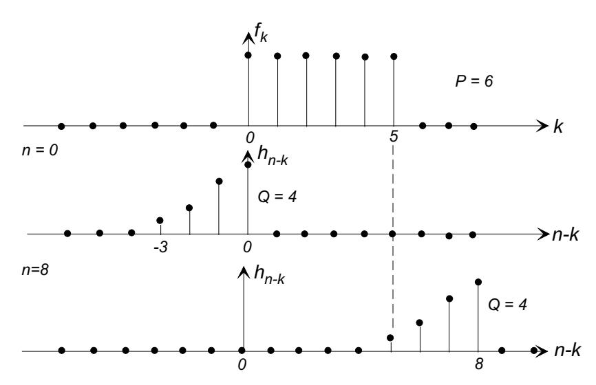
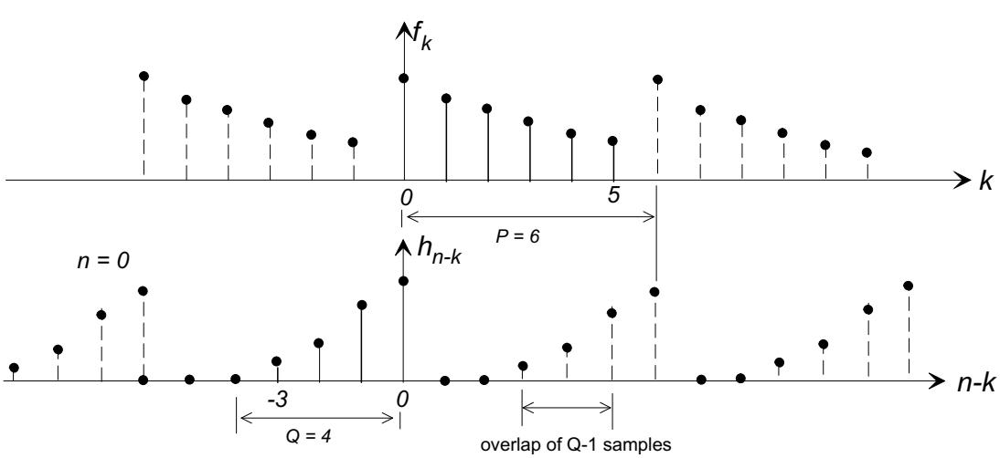
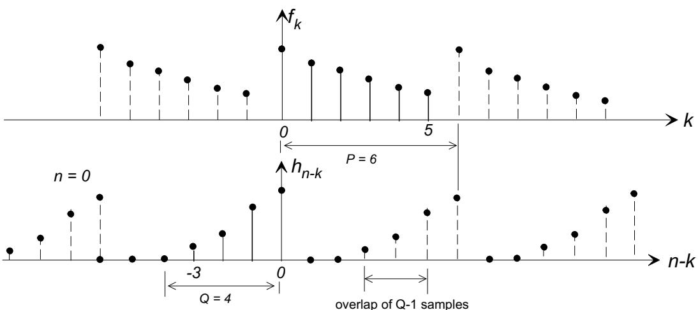
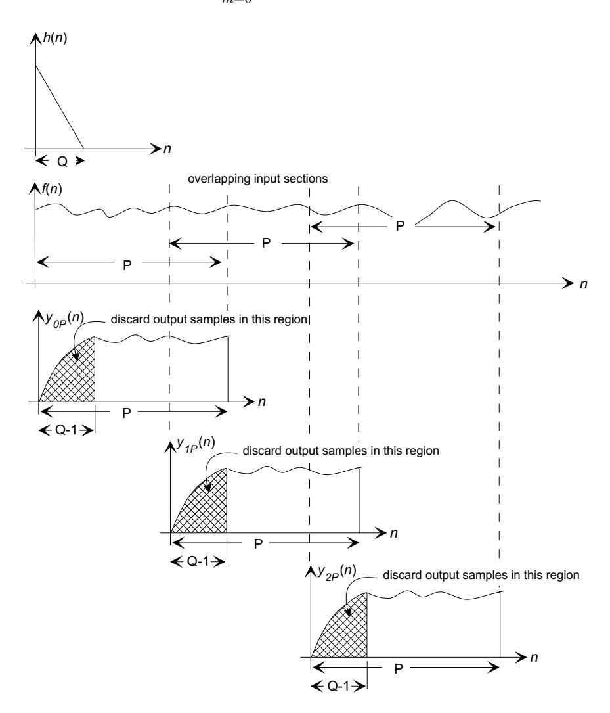
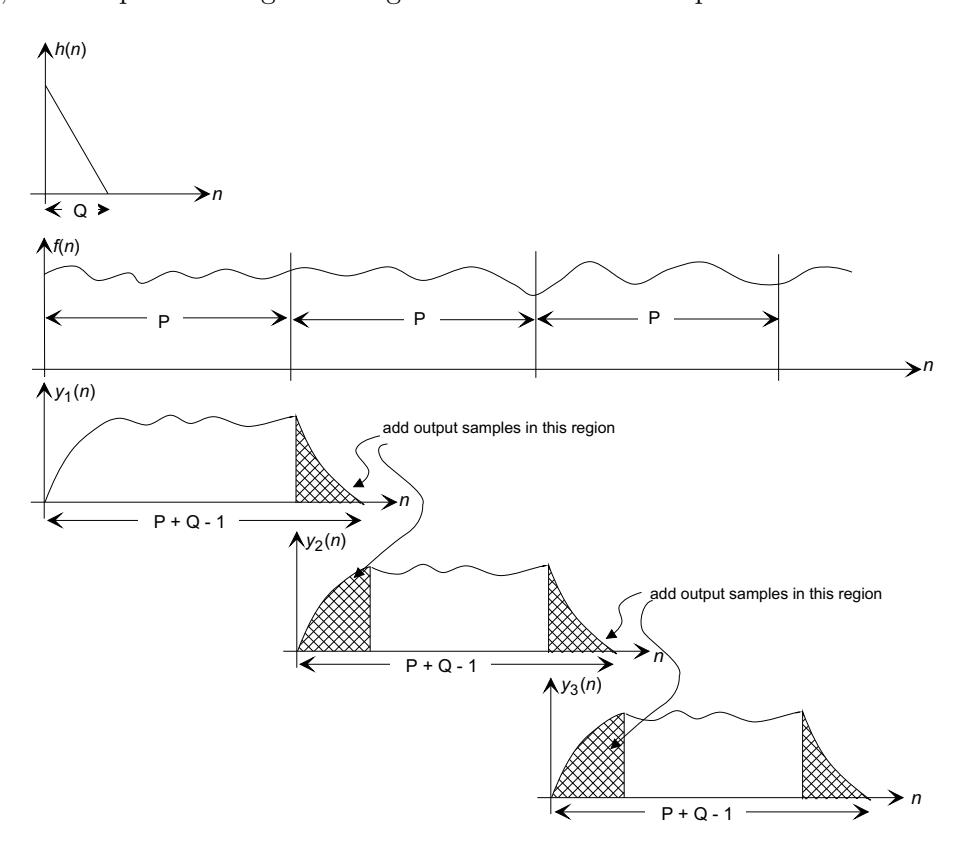
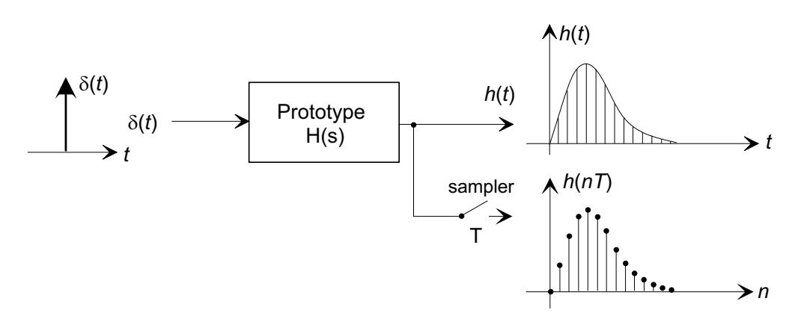
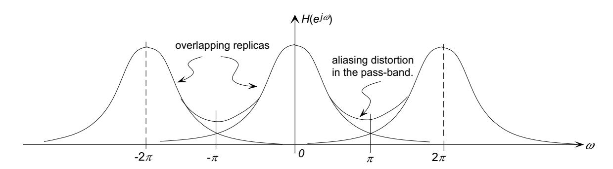
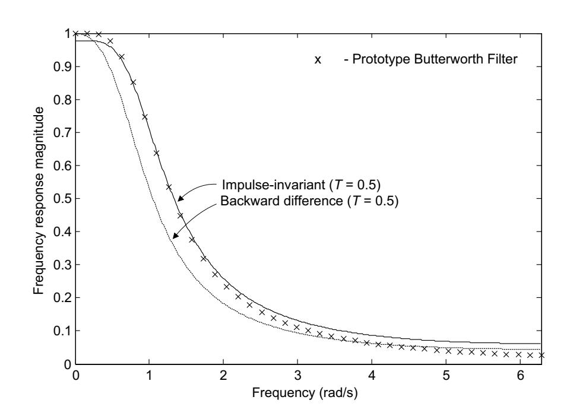

MIT OpenCourseWare <http://ocw.mit.edu>

#### 2.161 Signal Processing: Continuous and Discrete Fall 2008

For information about citing these materials or our Terms of Use, visit: [http://ocw.mit.edu/terms.](http://ocw.mit.edu/terms)

� yn = fkhn−k. k=−∞

#### **1 FFT Convolution for FIR Filters**

# Massachusetts Institute of Technology Department of Mechanical Engineering 2.161 Signal Processing - Continuous and Discrete Fall Term 2008

## **Lecture 18**1

#### **Reading:**

- Proakis and Manolakis: 7.3.1, 7.3.2, 10.3
- Oppenheim, Schafer, and Buck: 8.7.3, 7.1

The response of an FIR filter with impulse response {hk} to an input {fk} is given by the linear convolution ∞

The length of the convolution of two finite sequences of lengths P and Q is N = P + Q − 1. The following figure shows a sequence {fn} of length P = 6, and a sequence {hn} of length Q = 4 reversed and shifted so as to compute the extremes of the convolved sequence y0 and y8.

The convolution property of the DFT suggests that the FFT might be used to convolve two equal length sequences

yn = IDFT {DFT {fn} .DFT {hn}} .

1copyright c D.Rowell 2008

However, DFT convolution is a circular convolution, involving periodic extensions of the two sequences. The following figure shows the circular convolution of length 6, on two sequences {fn} of length P = 6 and {hn} of length Q = 4. The periodic extensions cause overlap in the first Q − 1 samples, generating "wrap-around" errors in the DFT convolution.

- DFT convolution of two sequences of length P and Q (P ≥ Q) in DFTs of length P
  - 1. Produces an output sequence of length P, whereas linear convolution produces an output sequence of length P + Q − 1.
- 2. Introduces wrap-around error in the first Q−1 samples of the output sequence. **The solution is to zero-pad both input sequences to a length** N ≥ P +Q−1 **and then to use DFT convolution with the length** N **sequences.**

For example, if {fn} is of length P = 237, and {hn} is of length Q = 125, for error-free convolution we must perform the DFTs in length N ≥ 237 + 125 − 1 = 461. If the available FFT routine is radix-2, we should choose N=512.

**The use of the FFT for Filtering Long Data Sequences:** The DFT convolution method provides an attractive alternative to direct convolution when the length of the data record is very large. The general method is to break the data into manageable sections, then use the FFT to to perform the convolution and then recombine the output sections. Care must be taken, however, to avoid wrap-around errors. There are two basic methods used for convolving long data records. Let the impulse response {hn} have length Q.

**Overlap-Save Method:** (Also known as the overlap-discard,or select-savings method.) In this method the data is divided into blocks of length P samples, but with successive blocks overlapping by Q − 1. The DFT convolution is done on each block with length P, and wrap-around errors are allowed to contaminate the first Q − 1 samples of the output. These initial samples are then discarded, and only the error-free P − (Q − 1) samples are saved in the output record.

� ymP (n +(Q − 1)),n =0,...,P − (Q − 1) ym(n)= 0, otherwise.

� ∞ y(n)= ym(n − m(P − Q + 1)). m=0

With the overlap of the data blocks, in the mth block the samples are

fm(n)= f(n + m(P − (Q − 1))), n =0,...,P − 1,

and after DFT convolution in length P, giving ymP (n), the output is taken as

and the output is formed by concatenating all such records:

**Overlap-Add Method:** In this method the data is divided into blocks of length P, but the DFT convolution is done in zero-padded blocks of length N = P + Q − 1 so that

� � N M yn = akyn−k + bkfn−k k=1 k=0

#### **2 The Design of IIR Filters**

wrap-around errors do not occur. In this case the output is identical to the linear convolution of the two blocks, with an initial rise of length Q − 1 samples, and a trailing section also of length Q − 1 samples. It is easy to show that if the trailing section of the mth output block is overlapped with the initial section of the (m + 1)th block, the samples add together to generate the correct output values.

MATLAB's fftfilt() function performs DFT convolution using the overlap-add method.

An IIR filter is characterized by a recursive difference equation

and a rational transfer function of the form

b0z0 + b1z−1 + ... + bMz−M H(z)= z0 + a1z−1 + ... + aN z−N

IIR filters have the advantage that they can give a better cut-off characteristic than a FIR filter of the same order, but have the disadvantage that the phase response cannot be well controlled.

� � 1 − z−1 n ns → . T

The most common design procedure for digital IIR filters is to design a continuous filter in the s-plane, and then to transform that filter to the z-plane. Because the mapping between the continuous and discrete domains cannot be done exactly, the various design methods are at best approximations.

# **2.1 Design By Approximation of Derivatives:**

Perhaps the simplest method for low-order systems is to use backward-difference approximation to continuous domain derivatives.

## **Example 1**

Suppose we wish to make a discrete-time filter based on a prototype first-order high-pass filter

s Hp(s)= . s + a

The differential equation describing this filter is

dy df + ay = dt dt

The backward-difference approximation to a derivative based on samples taken at intervals T apart is

dx xn − xn−1 ≈ dt T

and substitution into the differential equation gives

yn − yn−1 fn − fn−1 + ayn = T T

or

1 1 yn = yn−1 + (fn − fn−1) 1+ aT 1+ aT

The transfer function is

1 − z−1 z − 1 H(z)= = (1 + aT)1 + z−1 (1 + aT)z +1

This example indicates that the method uses the transformation

1 − z−1 s → T

in Hp(s). For higher order terms

#### **Example 2**

Convert the continuous low-pass Butterworth filter with Ωc = 1 rad/s to a digital filter with a sampling time T =0.5 s. The transfer function is

1 Hp(s)= √ . s2 + 2s +1

The discrete-time transfer function is

1 H(z)= � −1 �2 √ � −1 � 1−z 1−z + 2 +1 T T T2 = √ √ (1 + 2T + T2) − (2 + 2T)z−1 + z−2

and with T =0.5s,

0.25 H(z)= 1.9571 − 2.7071z−1 + z−2

The frequency response of this filter is plotted in Example 4.

In general, the backward-difference does not lead to satisfactory digital filters that mimic the prototype filter characteristics. (See Proakis and Manolakis, Sec. 10.3.1).

#### **2.2 Design by Impulse-Invariance:**

In the impulse-invariant design method the impulse response {hn} of the digital filter is taken to be proportional to the samples of the impulse response hp(t) of the continuous filter Hp(s) with a sampling interval of T seconds. The most common form is

hn = Thp(nT).

Then

H(z) = TZ {hp(nT)} = TZT � L−1 {Hp(s)} �

since hp(t) = L−1 {Hp(s)}, and where ZT {} indicates the z-transform of a continuous function with sampling interval T.

#### Example 3

Find the impulse-invariant IIR filter from the prototype continuous filter

a Hp(s) = . s + a

Solution: Using Laplace transform tables

hp(t) = L−1 � a � = a e−at. s + a

and from z-transform tables

� a a e−at� ZT = . 1 − e−aT z−1

The IIR filter is

� a e−at� = aT H(z) = TZT 1 − e−aT z−1

and the difference equation is

yn = e−aT yn−1 + aTfn

For the digital filter ∞ H( ej ΩT ) = H(z)| j ΩT = �hk e−j kΩT z= e k=0

and the DTFT of the samples of the continuous prototype's impulse response is

∞ 1 ∞ � � 2πk �� DTFT {hp(nT)} = �hp(kT) e−j kΩT = � Hp j Ω − . T T k=0 k=−∞

Then if hn = Thp(nT),

∞ � � 2πk �� H( ej ΩT ) = � Hp j Ω − . T k=−∞

The discrete-time frequency response is therefore a superposition of shifted replicas of the frequency response of the prototype. As a result, aliasing will be present in H( ej ω) if the prototype's frequency response |Hp(j Ω)| �= 0 for |Ω| ≥ π/T.

For this reason the impulse-invariance method is not suitable for the design of high-pass or band-stop filters, which by definition require a prototype Hp(s) with a non-zero frequency response at Ω = π/T.

## Example 4

Design an impulse-invariant filter based on the second-order low-pass Butterworth prototype used in Example 2, with T = 0.5 s.

1 Hp(s) = s2 + √2s + 1

Solution: From z-transform tables

� � β �� e−aT sin(βT)z ZT L−1 (s + a)2 + β2 = z2 + 2z e−aT cos(βT)z + e−2aT

and Hp(s) may be written in this form

1 Hp(s) = (s + 1/ √2)2 + (1/ √2)2

so that a = 1/ √2, and β = 1/ √2. Substituting these values,

0.1719z−1 H(z) = TZT � L−1 {Hp(s)} � = 1 − 1.3175z−1 + 0.4935z−2

The frequency response of the impulse-invariant, and backward-difference (from Example 2) filters are compared with the prototype below:

The MATLAB function

[bz, az] = impinvar(bs, as, Fs)

will compute the numerator az, and denominator bz coefficients for an impulse-invariant filter from the continuous prototype coefficients bs and as, with a sampling frequency Fs. The filter in Example 4 can be designed in a single line: [bz, az] = impinvar(1, [1 sqrt(2) 1], 2).