6.002 Fall 2000 Lecture 3

**6.002 CIRCUITS AND**

**ELECTRONICS**

Superposition, Thévenin and Norton

∑ = 0 *loop Vi* z Circuit composition rules z Node method – the workhorse of 6.002 KCL at nodes using *V* 's referenced from ground (KVL implicit in " ") ( )*ji* − *ee G* z KVL: KCL: ∑ = 0 *node i I* VI

# **Review**

## Circuit Analysis Methods

6.002 Fall 2000 Lecture 3

Consider

# **Linearity**

Write node equations –

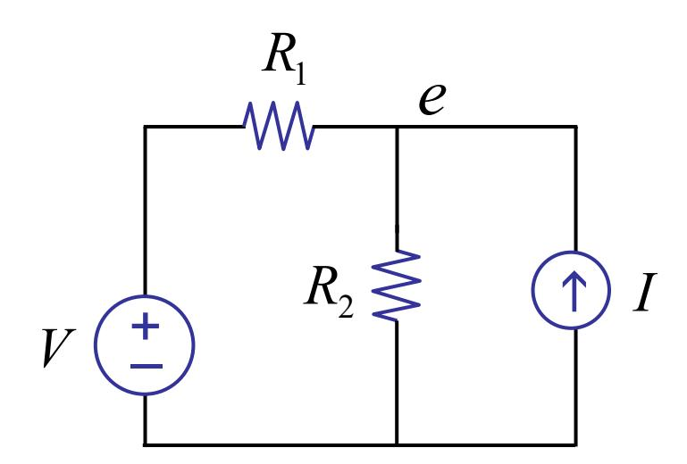

0 21 =−+ − *I R e R e V*

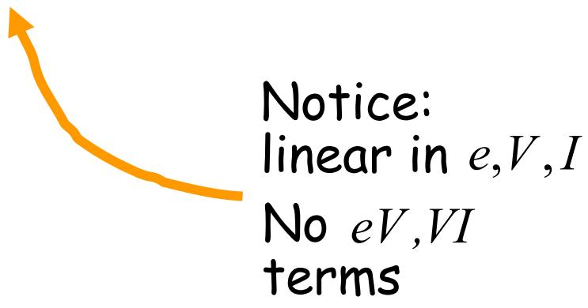

6.002 Fall 2000 Lecture 3

Consider

# **Linearity**

Write node equations --

Rearrange --

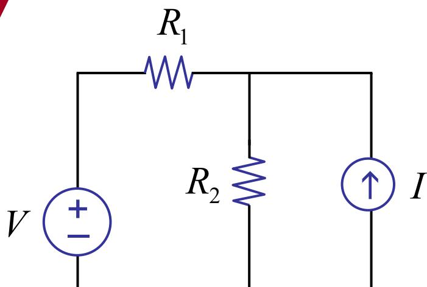

0 21 =−+ − *I R e R e V* linear in *e V*,, *I*

*I*

*R*

*V*

*e*

*RR*

+= ⎥

⎦

⎤ ⎢

⎣

⎡

+

1 2 1

11

*G e* = *S*

conductance

matrix

node

voltages

linear sum

of sources

6.002 Fall 2000 Lecture 3

# **Linearity**

or *I RR R R V RR R e* 21 21 21 2 + + + =

*ae V* += *a V*2211 +…+ *b I* + *b I*2211 +…

Write node equations --

Rearrange --

0 21 =−+ − *I R e R e V* linear in *e V*,, *I*

*I R V e RR* += ⎥ ⎦ ⎤ ⎢ ⎣ ⎡ + 1 2 1 11

*G e* = *S*

conductance matrix

node

voltages

linear sum

of sources

Linear!

6.002 Fall 2000 Lecture 3

Linearity Homogeneity ⇒ Superposition

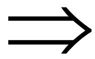

6.002 Fall 2000 Lecture 3

### Linearity Homogeneity Superposition

#### Homogeneity

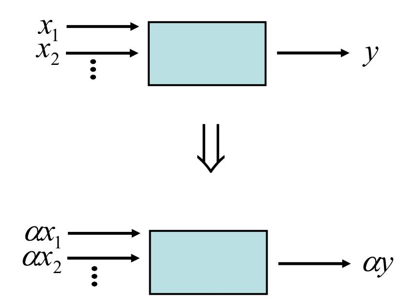

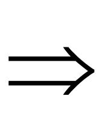

6.002 Fall 2000 Lecture 3

### Linearity Homogeneity Superposition

#### Superposition

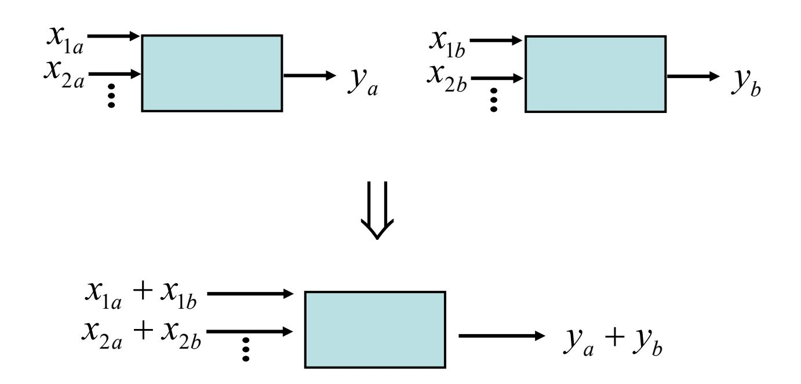

6.002 Fall 2000 Lecture 3

### Linearity Homogeneity Superposition

## Specific superposition example:

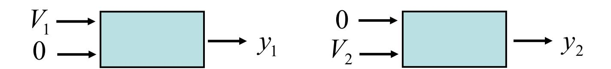

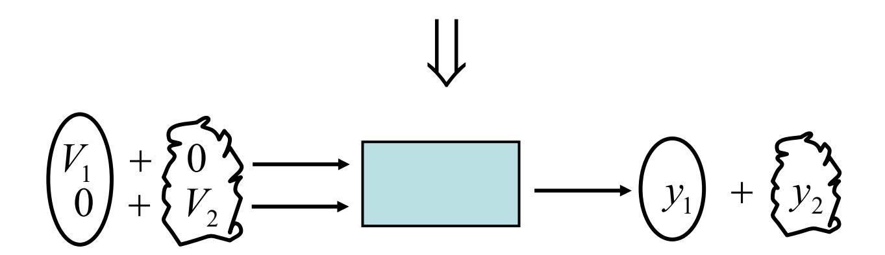

## Method 4: Superposition method

The output of a circuit is determined by summing the responses to each source acting alone.

independent sources only

6.002 Fall 2000 Lecture 3

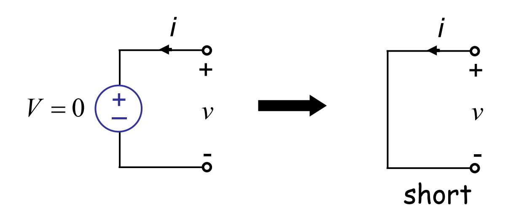

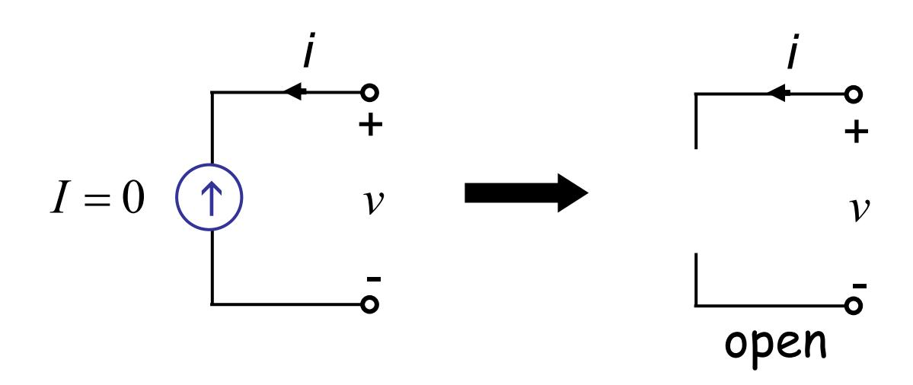

6.002 Fall 2000 Lecture 3

## **Back to the example** Use superposition method

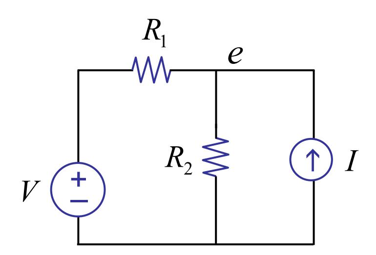

6.002 Fall 2000 Lecture 3

## **Back to the example** Use superposition method

## *V* acting alone

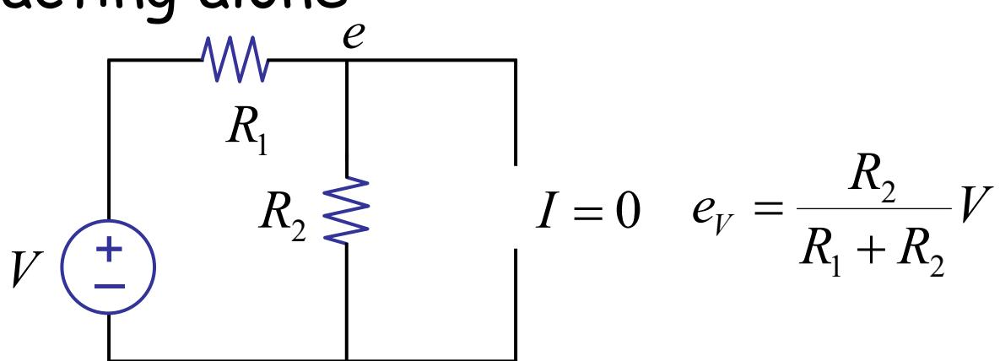

## *I* acting alone

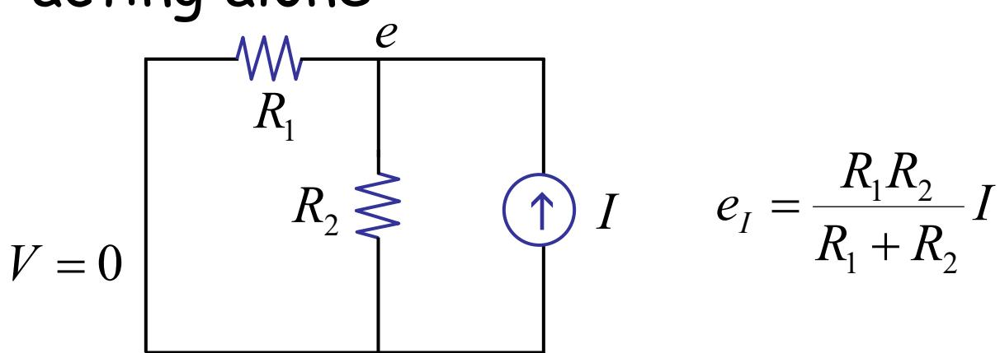

*I RR R R V RR R eee IV* 21 21 21 2 + + + =+=

## sum superposition

**Voilà !**

6.002 Fall 2000 Lecture 3

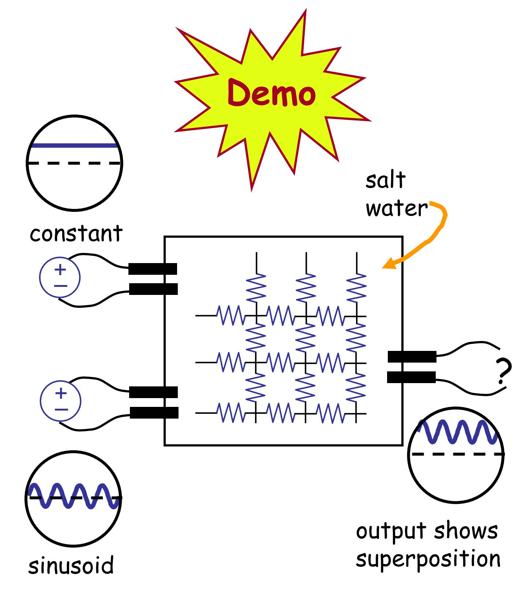

## Consider **Yet another method…**

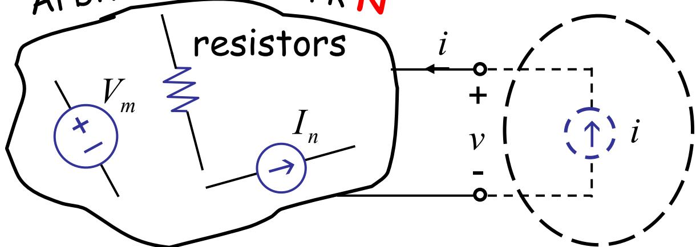

no

units

By setting

0

,0

=

=∀

*i*

*Inn*

0

,0

=

∀ =

*i*

*Vmm*

All

0

,0

=∀

∀ =

*mm*

*nn V*

*I*

Arbitrary network **N**

## By superposition

*v V I Ri n*

*n m n*

*m*

= α *m* + ∑∑ β +

resistance

units

independent of external excitation and behaves like a voltage " " *TH v*

also independent of external excitement & behaves like a resistor

Or

*vv R i* = *TH* + *TH*

As far as the external world is concerned (for the purpose of I-V relation), "Arbitrary network N" is indistinguishable from:

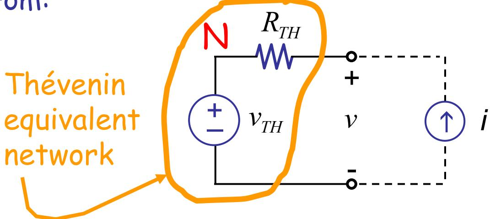

*RTH TH v* open circuit voltage at terminal pair (a.k.a. port) resistance of network seen from port ( 's, 's set to 0) *Vm n I*

6.002 Fall 2000 Lecture 3

## Method 4: The Thévenin Method

Replace network N with its Thévenin equivalent, then solve external network E.

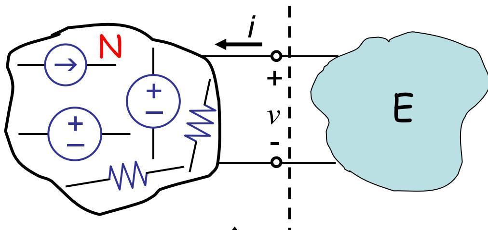

Thévenin equivalent

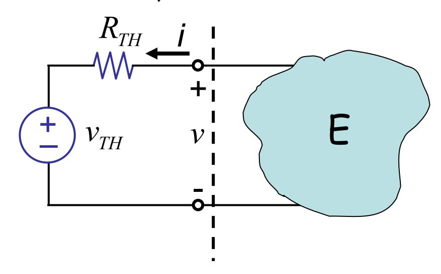

6.002 Fall 2000 Lecture 3

# Example:

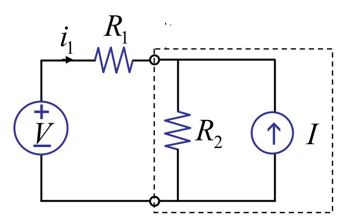

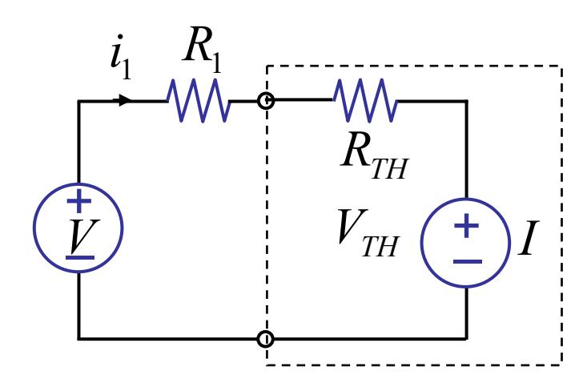

*TH TH RR V V i* + − = 1 1

# Example:

: *RTH RTH* = *R*2 + - *RTH R*2

: *VTH* 2 *TH* = *IRV* + - *VTH R*2 J*I*

6.002 Fall 2000 Lecture 3

#### Graphically, *vv R i* = *TH* + *TH*

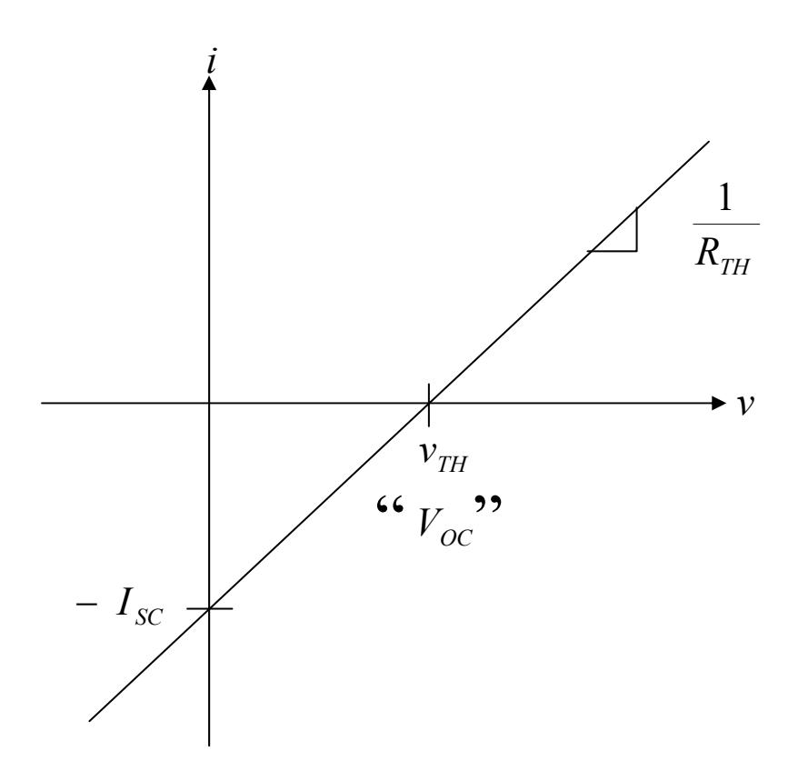

Open circuit () *i* ≡ 0 *TH* = *vv VOC*

Short circuit () *v* ≡ 0 *TH TH R v i* − = *SC* − *I*

6.002 Fall 2000 Lecture 3

Method 5:

# The Norton Method

in recitation, see text

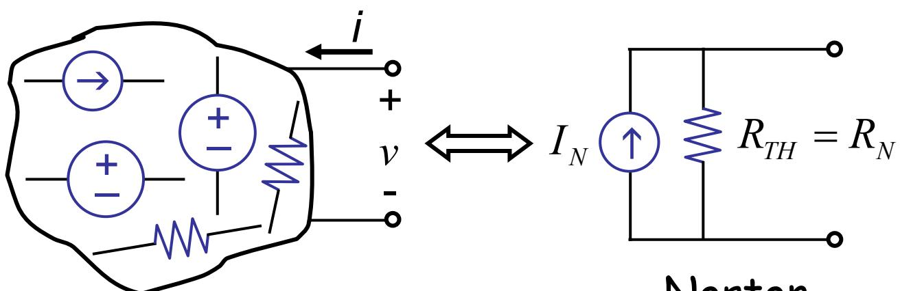

Norton equivalent

*TH TH N R V I* =

6.002 Fall 2000 Lecture 3

# Summary

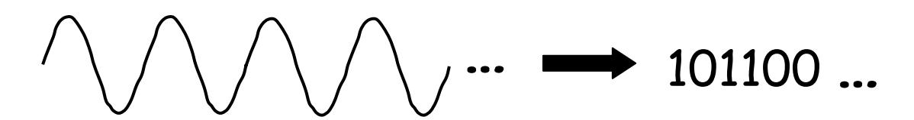

#### Discretize matter

LMD LCA Physics EE

 R, I, V Linear networks Analysis methods (linear) KVL, KCL, I — V Combination rules Node method Superposition Thévenin Norton Next Nonlinear analysis Discretize voltage