# **Linear Circuits Analysis. Superposition, Thevenin /Norton Equivalent circuits**

So far we have explored time-independent (resistive) elements that are also linear.

A *time-independent elements* is one for which we can plot an i/v curve. The current is only a function of the voltage, it does not depend on the rate of change of the voltage. We will see latter that capacitors and inductors are not time-independent elements. Timeindependent elements are often called *resistive* elements.

Note that we often have a time dependent signal applied to time independent elements. This is fine, we only need to analyze the circuit characteristics at each instance in time. We will explore this further in a few classes from now.

# **Linearity**

A function *f* is linear if for any two inputs x1 and x2

*fx*1 + *x*2 ( )= *fx*1 ( )+ *fx*2 ( )

Resistive circuits are linear. That is if we take the set {xi} as the inputs to a circuit and f({xi}) as the response of the circuit, then the above linear relationship holds. The response may be for example the voltage at any node of the circuit or the current through any element.

Let's explore the following example.

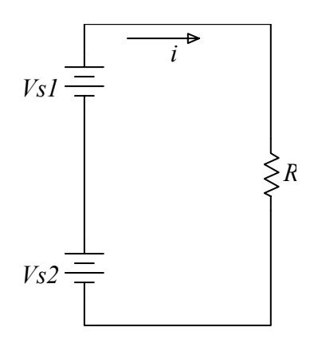

KVL for this circuit gives

*Vs*12 +*Vs* −*iR* = 0 (1.1)

Or

*Vs*1 *Vs i* 2 *R* + = (1.2)

And as we see the response of the circuit depends linearly on the voltages and . A useful way of viewing linearity is to consider suppressing sources. A voltage source is suppressed by setting the voltage to zero: that is by short circuiting the voltage source. *Vs*1 *Vs*2

Consider again the simple circuit above. We could view it as the linear superposition of two circuits, each of which has only one voltage source.

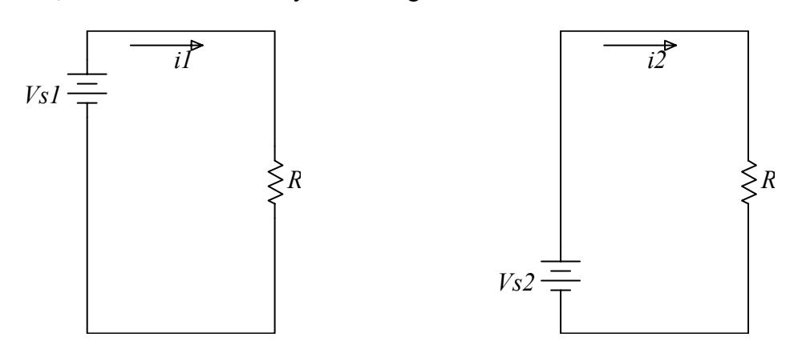

The total current is the sum of the currents in each circuit.

12 1 12 *ii i Vs Vs*2 *R R Vs Vs R* = + =+ + = (1.3)

Which is the same result obtained by the application of KVL around of the original circuit.

If the circuit we are interested in is linear, then we can use superposition to simplify the analysis. For a linear circuit with multiple sources, suppress all but one source and analyze the circuit. Repeat for all sources and add the results to find the total response for the full circuit.

Independent sources may be suppressed as follows:

Voltage sources:

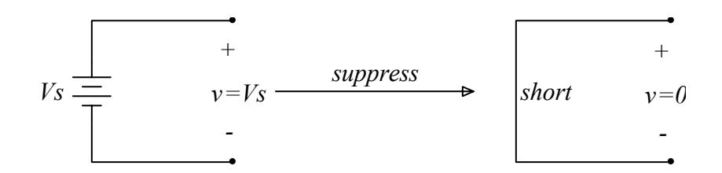

Current sources:

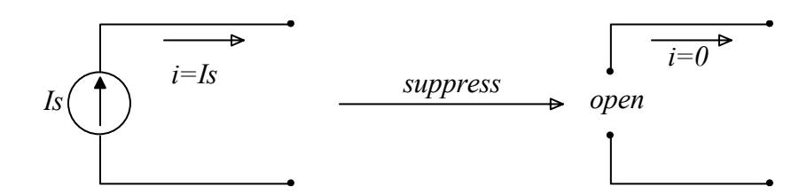

An example:

Consider the following example of a linear circuit with two sources. Let's analyze the circuit using superposition.

*R1 Vs R2 Is i1 i2 + -*

First let's suppress the current source and analyze the circuit with the voltage source acting alone.

*R1 Vs R2 i1v i2v + -*

So, based on just the voltage source the currents through the resistors are:

*iv*1 = 0 (1.4)

2 2 *Vs iv R* = (1.5)

Next we calculate the contribution of the current source acting alone

*R1 R2 i1i + - i2i Is v1*

Notice that R2 is shorted out (there is no voltage across R2), and therefore there is no current through it. The current through *R1* is *Is*, and so the voltage drop across *R1* is,

*vI* 1= *sR*1 (1.6)

And so

*i*1 = *Is* (1.7)

2 2 *Vs i R* = (1.8)

How much current is going through the voltage source *Vs*?

### Another example:

For the following circuit let's calculate the node voltage *v*.

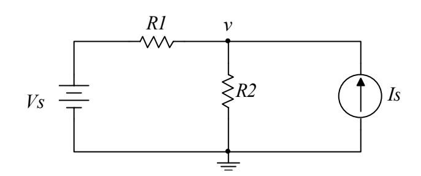

Nodal analysis gives:

0 12 *Vs v v Is R R* − + − = (1.9)

or

2 1 2 12 12 *R R R vVs Is R RR R* = + ++ (1.10)

We notice that the answer given by Eq. (1.10) is the sum of two terms: one due to the voltage and the other due to the current.

Now we will solve the same problem u[sing sup](#page-4-0)erposition

The voltage *v* will have a contribution *v1* from the voltage source *Vs* and a contribution *v2* from the current source *Is*.

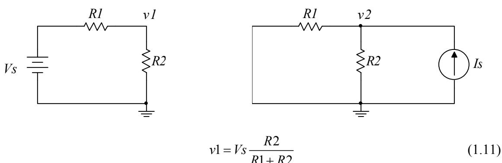

12 *R R* = +

And

12 2 12 *R R vIs R R* = + (1.12)

Adding voltages v1 and v2 we obtain the result given by Eq. [\(1.10\).](#page-4-0)

## **More on the i-v characteristics of circuits.**

As discussed during the last lecture, the *i-v* characteristic curve is a very good way to represent a given circuit.

A circuit may contain a large number of elements and in many cases knowing the *i-v*  characteristics of the circuit is sufficient in order to understand its behavior and be able to interconnect it with other circuits.

The following figure illustrates the general concept where a circuit is represented by the box as indicated. Our communication with the circuit is via the port A-B. This is a single port network regardless of its internal complexity.

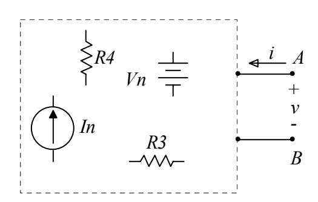

If we apply a voltage *v* across the terminals A-B as indicated we can in turn measure the resulting current *i* . If we do this for a number of different voltages and then plot them on the *i-v* space we obtain the *i-v* characteristic curve of the circuit.

For a general linear network the i-v characteristic curve is a linear function

*im*= *v* + *b* (1.13)

Here are some examples of *i-v* characteristics

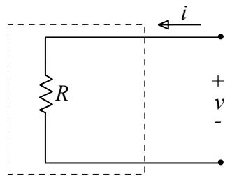

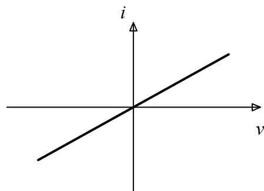

In general the *i-v* characteristic does not pass through the origin. This is shown by the next circuit for which the current *i* and the voltage *v* are related by

*iR* +*Vs* −=*v* 0 (1.14)

or

*vVs i R* − = (1.15)

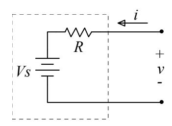

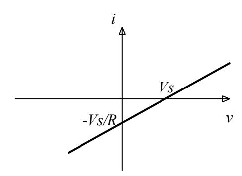

Similarly, when a current source is connected in parallel with a resistor the i-v relationship is

*v iIs R* = −+ (1.16)

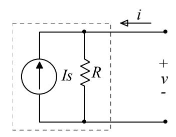

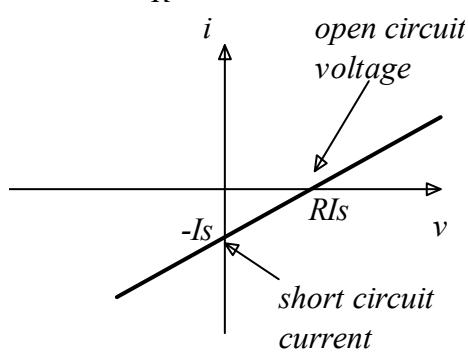

# **Thevenin Equivalent Circuits.**

For linear systems the *i-v* curve is a straight line. In order to define it we need to identify only two pints on it. Any two points would do, but perhaps the simplest are where the line crosses the *i* and *v* axes.

These two points may be obtained by performing two simple measurements (or make two simple calculations). With these two measurements we are able to replace the complex network by a simple equivalent circuit.

This circuit is known as the **Thevenin Equivalent Circuit.**

Since we are dealing with linear circuits, application of the principle of superposition results in the following expression for the current *i* and voltage *v* relation.

0 *j j jj im*=+*v m V* + *b I* ∑ ∑ *j j* (1.17)

Where *Vj* and *j I* are voltage and current sources in the circuit under investigation and the coefficients *mj* and *j b* are functions of other circuit parameters such as resistances.

And so for a general network we can write

*im*= *v* + *b* (1.18)

Where

*m* = *m*0 (1.19)

And

*j j j jj bm* = *V* + *b j* ∑ ∑ *I* (1.20)

Thevenin's Theorem is stated as follows:

A linear one port network can be replaced by an equivalent circuit consisting of a voltage source *VTh* in series with a resistor *Rth*. The voltage *VTh* is equal to the open circuit voltage across the terminals of the port and the resistance *RTh* is equal to the open circuit voltage *VTh* divided by the short circuit current *Isc*

The procedure to calculate the Thevenin Equivalent Circuit is as follows:

- 1. Calculate the equivalent resistance of the circuit (*RTh*) by setting all voltage and current sources to zero
- 2. Calculate the open circuit voltage *Voc* also called the Thevenin voltage *VTh*

The equivalent circuit is now

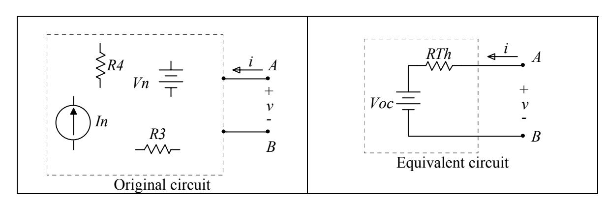

If we short terminals A-B, the short circuit current *Isc* is

*VTh Isc RTh* = (1.21)

Example:

Find *vo* using Thevenin's theorem

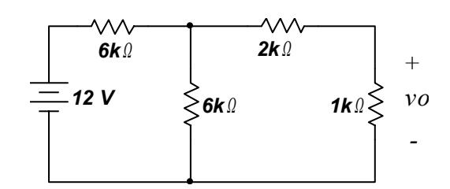

The 1kΩ resistor is the load. Remove it and compute the open circuit voltage Voc or VTh.

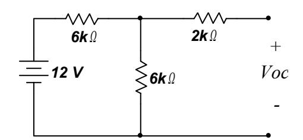

Voc is 6V. Do you see why?

Now let's find the Thevenin equivalent resistance *RTh*.

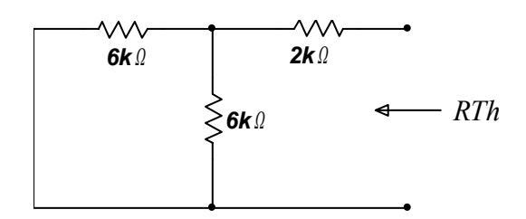

*RTh* = 6/ *k*Ω / 6*k*Ω+Ω 2*k* =Ω 5*k*

And the Thevenin circuit is

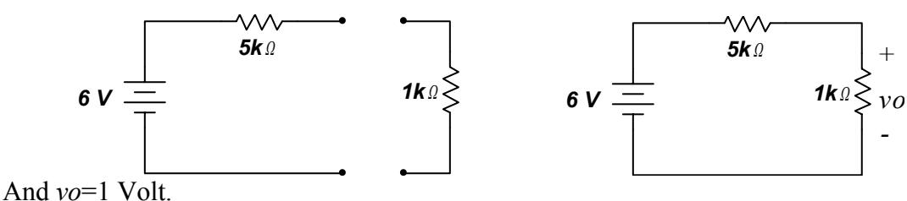

And *vo*=1 Volt.

Another example:

Determine the Thevenin equivalent circuit seen by the resistor *RL*.

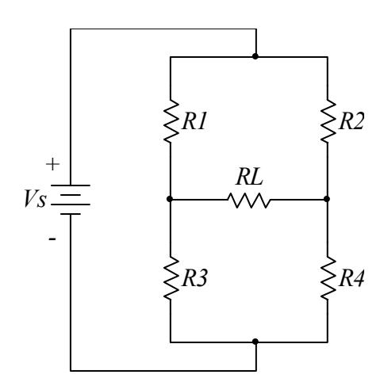

Resistor *RL* is the load resistor and the balance of the system is interface with it. Therefore in order to characterize the network we must look the network characteristics in the absence of *RL*.

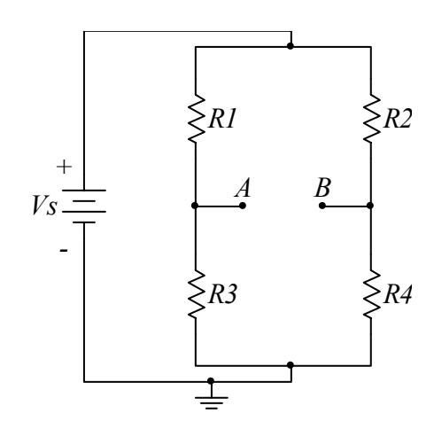

First lets calculate the equivalent resistance *RTh*. To do this we short the voltage source resulting in the circuit.

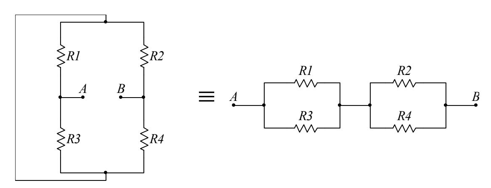

The resistance seen by looking into port *A-B* is the parallel combination of

13 13 13 *R R R R R* = + (1.22)

In series with the parallel combination

24 24 24 *R R R R R* = + (1.23)

*RTh* = *R*13+ *R*24 (1.24)

The open circuit voltage across terminals A-B is equal to

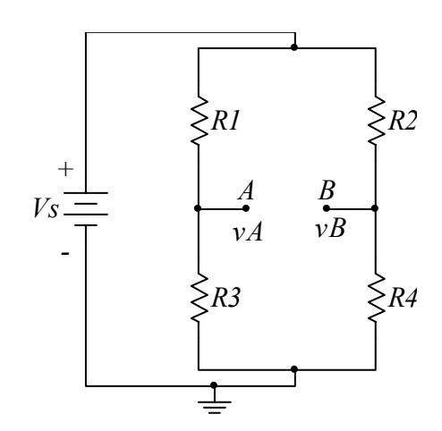

3 4 13 2 4 *VTh vA vB R R Vs R RR R* = − ⎛ =− ⎜⎟ ⎝⎠ ++ ⎞ (1.25)

And we have obtained the equivalent circuit with the Thevenin resistance given by Eq. [\(1.24\)](#page-10-0) and the Thevenin voltage given by Eq. [\(1.25\).](#page-11-0)

# **The Wheatstone Bridge Circuit as a measuring instrument.**

Measuring small changes in large quantities – is one of the most common challenges in measurement. If the quantity you are measuring has a maximum value, Vmax, and the measurement device is set to have a dynamic range that covers 0 - Vmax, then the errors will be a fraction of Vmax. However, many measurable quantities only vary slightly, and so it would be advantageous to make a difference measurement over the limited range , Vmax- Vmin. The *Wheatstone bridge* circuit accomplishes this.

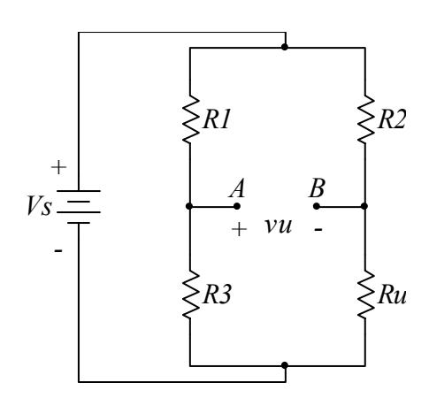

The Wheatstone bridge is composed of three known resistors and one unknown, *Ru*, by measuring either the voltage or the current across the center of the bridge the unknown resistor can be determined. We will focus on the measurement of the voltage *vu* as indicated in the above circuit.

The analysis can proceed by considering the two voltage dividers formed by resistor pairs *R1, R3* and *R2, R4*.

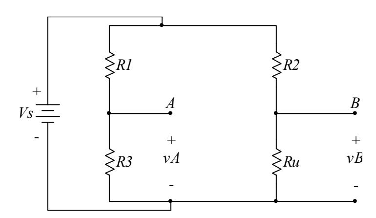

The voltage *vu* is given by

*vu* = *vA*− *vB* (1.26)

3 13 *R vA Vs R R* = + (1.27)

And

2 *Ru vB Vs R Ru* = + (1.28)

And *vu* becomes:

3 13 2 *R Ru vu Vs R RR Ru* ⎛ = ⎜ − ⎝⎠ ++ ⎞ ⎟ (1.29)

A typical use of the Wheatstone bridge is to have *R1=R2* and *R3 ~ Ru*. So let's take

*Ru* = *R*3+ε (1.30)

Under these simplifications,

3 13 2 33 13 13 *RRu vu Vs RR R Ru RR Vs RR RR* ε ε ⎛⎞ =− ⎜⎟ ⎝ ++ ⎛⎞ + =− ⎜⎟ ⎝⎠ ++ + ⎠ (1.31)

3 As discussed above we are interested in the case where the variation in *Ru* is small, that is in the case where ε *R*1+ *R* . Then the above expression may be approximated as,

13 *vu Vs R R* ε + (1.32)

# **The Norton equivalent circuit**

A linear one port network can be replaced by an equivalent circuit consisting of a current source *In* in parallel with a resistor *Rn*. The current *In* is equal to the short circuit current through the terminals of the port and the resistance *Rn* is equal to the open circuit voltage *Voc* divided by the short circuit current *In.*

The Norton equivalent circuit model is shown below:

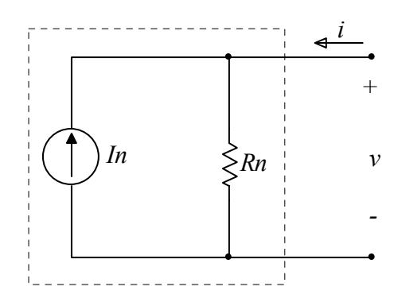

By using KCL we derive the *i-v* relationship for this circuit.

0 *v iIn Rn* + − = (1.33)

or

*v i In Rn* = − (1.34)

For *i* = 0 (open circuit) the open circuit voltage is

*Voc* = *InRn* (1.35)

And the short circuit current is

*Isc* = *In* (1.36)

If we choose *Rn* = *RTh* and *Voc In RTh* = the Thevenin and Norton circuits are equivalent

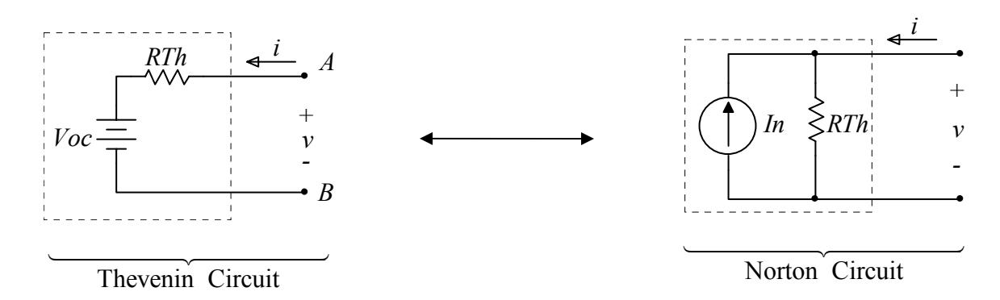

We may use this equivalence to analyze circuits by performing the so called source transformations (voltage to current or current to voltage).

For example let's consider the following circuit for which we would like to calculate the current *i* as indicated by using the source transformation method.

*6* Ω *3* Ω *6* Ω *3* Ω *3 V 2 A i*

By performing the source transformations we will be able to obtain the solution by simplifying the circuit.

First, let's perform the transformation of the part of the circuit contained within the dotted rectangle indicated below:

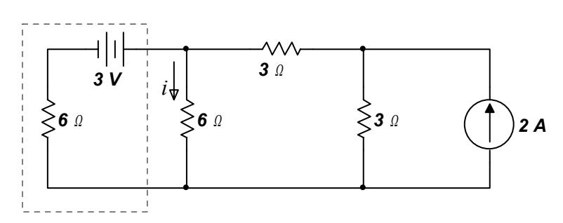

The transformation from the Thevenin circuit indicated above to its Norton equivalent gives

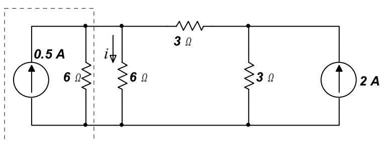

Next let's consider the Norton equivalent on the right side as indicated below:

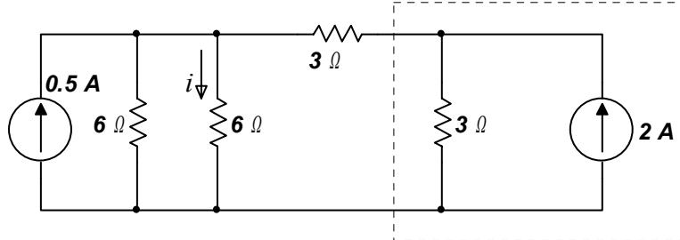

The transformation from the Norton circuit indicated above to a Thevenin equivalent gives

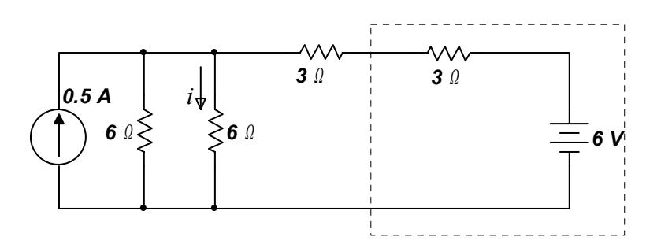

Which is the same as

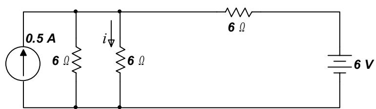

By transforming the Thevenin circuit on the right with its Norton equivalent we have

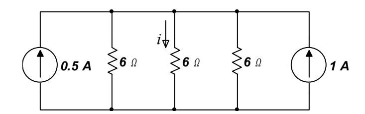

And so from current division we obtain

13 1 32 2 *i* ⎛⎞ = ⎜⎟ = ⎝⎠ *A* (1.37)

Another example: Find the Norton equivalent circuit at terminals *X-Y.* 

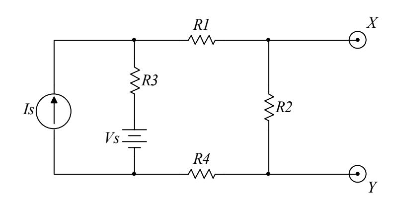

First we calculate the equivalent resistance across terminals X-Y by setting all sources to zero. The corresponding circuit is

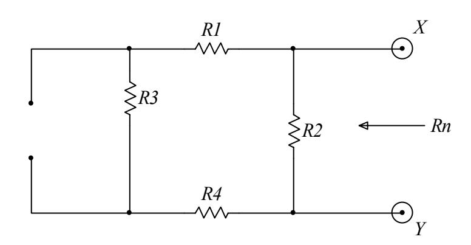

And *Rn* is

2( 1 3 4) 1 234 *R RR R Rn R RR R* + + = ++ + (1.38)

Next we calculate the short circuit current

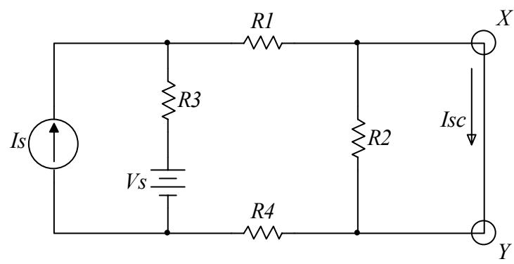

Resistor R2 does not affect the calculation and so the corresponding circuit is

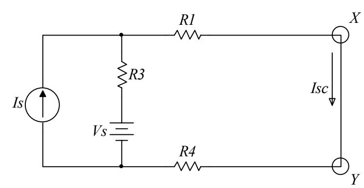

By applying the mesh method we have

3 13 4 *Vs IsR Isc In RR R* − = = ++ (1.39)

With the values for *Rn* and *Isc* given by Equations [\(1.38\)](#page-17-0) and [\(1.39\)](#page-18-0) the Norton equivalent circuit is defined

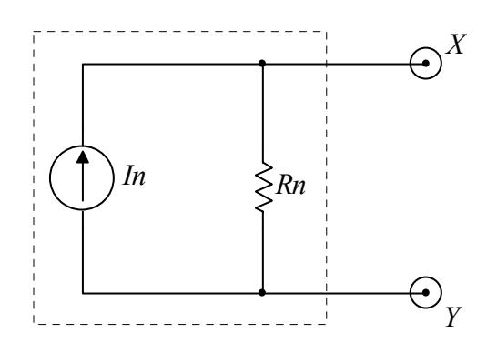

## **Power Transfer.**

In many cases an electronic system is designed to provide power to a load. The general problem is depicted on [Figure 1](#page-19-0) where the load is represented by resistor *RL*.

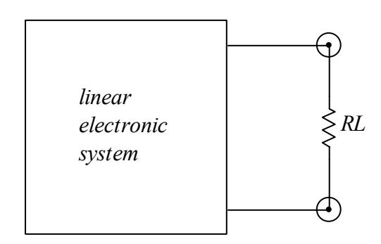

**Figure 1.** 

By considering the Thevenin equivalent circuit of the system seen by the load resistor we can represent the problem by the circuit shown on [Figure 2.](#page-19-1)

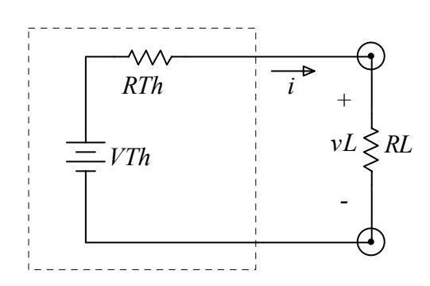

**Figure 2** 

The power delivered to the load resistor *RL* is

(1.40) 2 *Pi* = *RL*

The current *i* is given by

*VTh i RTh RL* = + (1.41)

And the power becomes

2 *VTh P RTh RL* ⎛ ⎞ = ⎜ ⎟ ⎝⎠ + *RL* (1.42)

For our electronic system, the voltage *VTh* and resistance *RTh* are known. Therefore if we vary *RL* and plot the power delivered to it as a function of *RL* we obtain the general behavior shown on the plot of [Figure](#page-20-0) 3.

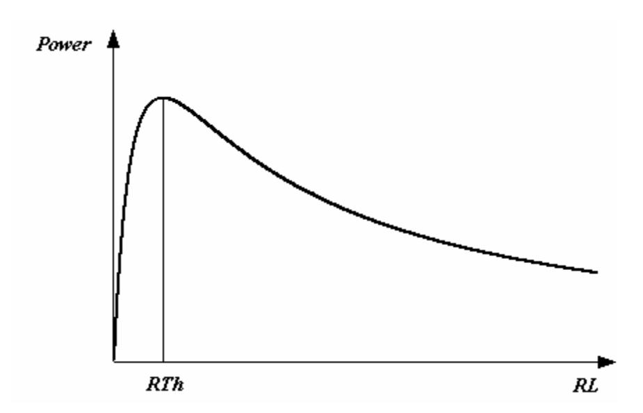

**Figure 3.** 

The curve has a maximum which occurs at *RL=RTh*.

In order to show that the maximum occurs at *RL=RTh* we differentiate Eq. [\(1.42\)](#page-19-2) with respect to *RL* and then set the result equal to zero.

2 2 4 () 2 ( () *dP RTh RL RL RTh RL VTh dRL RTh RL* ⎡ +− + )⎤ = ⎢ ⎥ ⎣ + ⎦ (1.43)

and

0 *dP RL RTh dRL* = →− = 0 (1.44)

and so the maximum power occurs when the load resistance *RL* is equal to the Thevenin equivalent resistance *RTh*. [1](#page-20-1)

Condition for maximum power transfer:

*RLR* = *Th* (1.45)

The maximum power transferred from the source to the load is

2 max 4 *VTh P RTh* = (1.46)

1 By taking the second derivative 2 2 *dP dRL* and setting *RL=RTh* we can easily show that 2 2 0 *dP dRL* < , thereby the point *RL=RTh* corresponds to a maximum.

Example:

For the Wheatstone bridge circuit below, calculate the maximum power delivered to resistor *RL*.

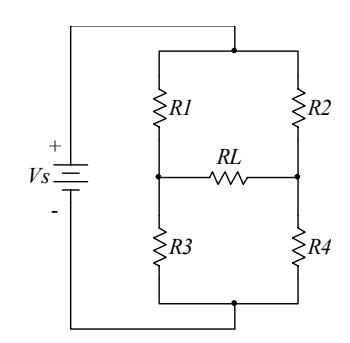

Previously we calculated the Thevenin equivalent circuit seen by resistor RL. The Thevenin resistance is given by Equation [\(1.24\)](#page-10-0) and the Thevenin voltage is given by Equation [\(1.25\).](#page-11-0) Therefore the system reduces to the following equivalent circuit connected to resistor *RL*.

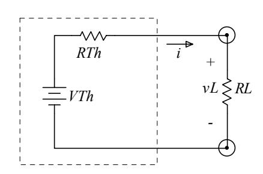

For convenience we repeat here the values for *RTh* and *VTh*.

3 4 13 2 4 *R R VTh Vs R RR R* ⎛ = ⎜ − ⎝⎠ ++ ⎞ ⎟ (1.47)

13 2 4 13 2 4 *R RR R RTh R RR R* =+ ++ (1.48)

The maximum power delivered to RL is

2 2 2 34 13 2 4 max 4 13 2 4 4 13 2 4 *RR Vs VTh RR R R P RTh RR R R RR R R* ⎛⎞ ⎜⎟ − ⎝ + + == ⎛⎞ ⎜⎟ + ⎝⎠ ++ ⎠ (1.49)

In various applications we are interested in decreasing the voltage across a load resistor by without changing the output resistance of the circuit seen by the load. In such a situation the power delivered to the load continues to have a maximum at the same resistance. This circuit is called an attenuator and we will investigate a simple example to illustrate the principle.

Consider the circuit shown of the following Figure.

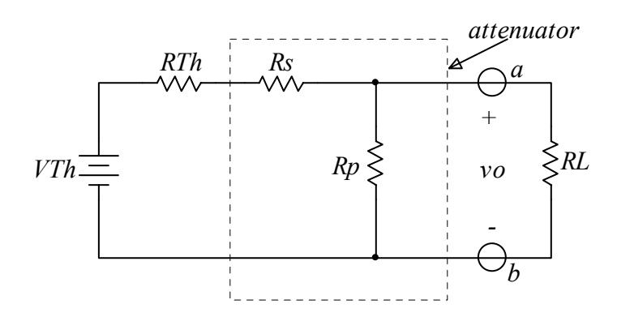

The network contained in the dotted rectangle is the attenuator circuit. The constraints are as follows:

- 1. The equivalent resistance seen trough the port *a-b* is *RTh*
- 2. The voltage *vo* = *kVTh*

Determine the requirements on resistors *Rs* and *Rp*.

First let's calculate the expression of the equivalent resistance seen across terminals *a-b*. By shorting the voltage source the circuit for the calculation of the equivalent resistance is

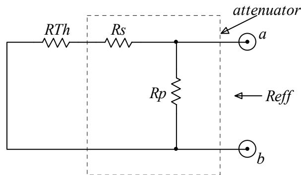

The effective resistance is the parallel combination of *Rp* with *Rs+RTh.*

()// ( ) *Reff RTh Rs Rp RTh Rs Rp RTh Rs Rp* = + + = ++ (1.50)

Which is constrained to be equal to *RTh*.

(*RTh Rs*)*Rp RTh RTh Rs Rp* + = ++ (1.51)

The second constraint gives

*Rp kVTh VTh RpRTh Rs* = ++ (1.52)

And so the constant *k* becomes:

*Rp k RpRTh Rs* = ++ (1.53)

By combining Equations [\(1.51\)](#page-23-0) and [\(1.53\)](#page-23-1) we obtain

1 *k Rs R k Th* − = (1.54)

And

1 1 *Rp R k* = − *Th* (1.55)

The maximum power delivered to the load occurs at *RTh* and is equal to

22 4 *kVTh Pmax RTh* = (1.56)

# Representative Problems:

P1. Find the voltage *vo* using superposition. (Ans. 4.44 Volts)

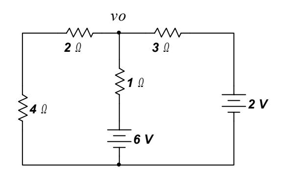

P2. Calculate *io* and *vo* for the circuit below using superposition (Ans. *io*=1.6 A, *vo*=3.3 V)

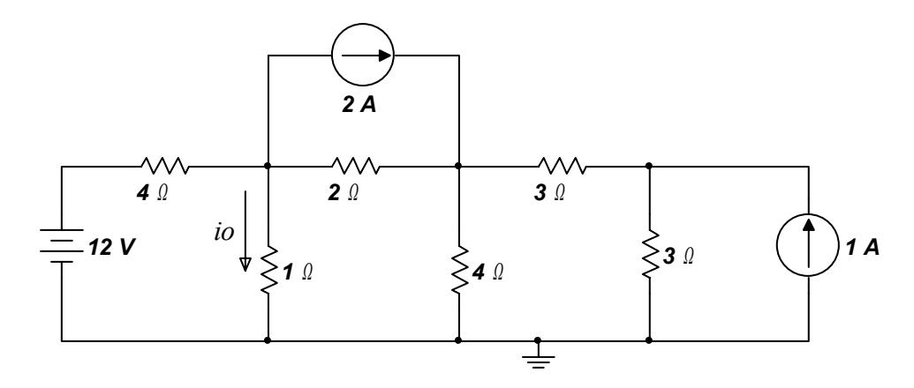

P3. using superposition calculate *vo* and *io* as indicated in the circuit below (Ans. *io*=1.35 A, *vo*=10 V)

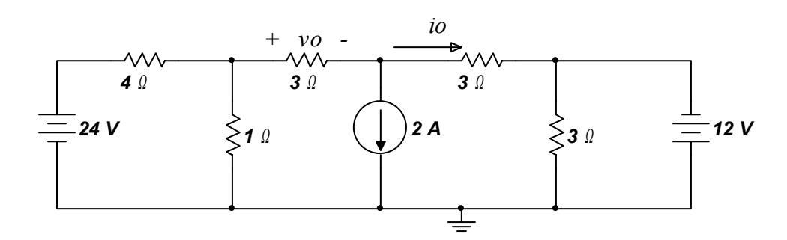

P4. Find the Norton and the Thevenin equivalent circuit across terminals *A-B* of the circuit. (Ans. *InA* =1.25 , *Rn* =1.7Ω , *VTh* = 2.12*V* )

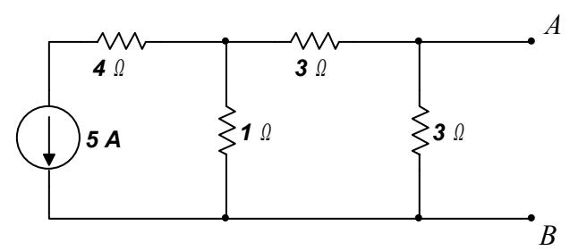

P5. Calculate the value of the resistor R so that the maximum power is transferred to the 5Ω resistor. (Ans. 10Ω)

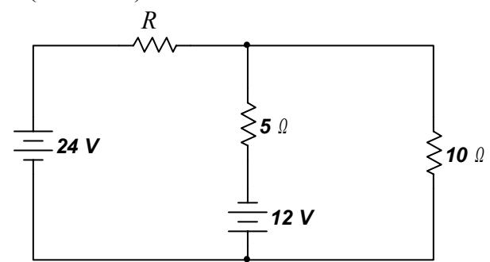

P6. Determine the value of resistor *R* so that maximum power is delivered to it from the circuit connected to it.

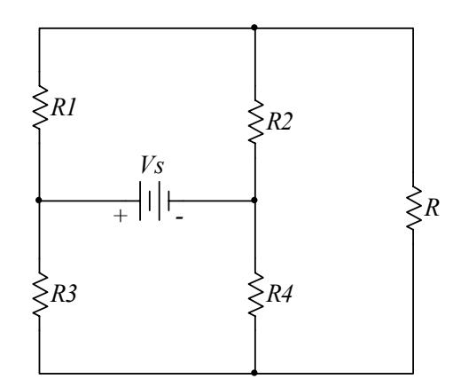

P7 The box in the following circuit represents a general electronic element. Determine the relationship between the voltage across the element to the current flowing through it as indicated.

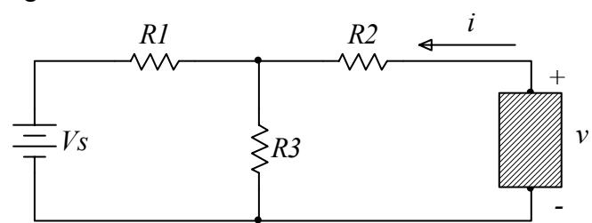