### **Signals and Systems:**

Material for the classes on:

2/10/06 2/14/06 2/16/06

The goals of the following three classes are:

Define and explore various types of signals

Explore the concept of a system and define LTI systems Explore time and frequency domain representation of signals Review Fourier series/transform. Focus on their physical/practical significance Sampling and Nyquist rates. The phenomenon of aliasing. Numbering systems Conversion between types of signals

A signal represents a set of one or more variables and is used to convey the characteristic information (or the attributes) of a physical phenomenon.

The world around us is full of signals. Indeed our connection with the world is through the various signals that our senses can interpret for their corresponding physical phenomena: the human voice, the sounds of nature, the light we see, the heat we feel, are all signals.

The classification of a signal is based on: (1) how is it represented in time and (2) how is its amplitude allowed to vary.

There are four basic types of signals based on the above classification. They are:

| any value.          | Continuous time, continuous value. Defined for each instant of time and its amplitude may vary continuously with time and assume                                                                                                                          |
|---------------------|-----------------------------------------------------------------------------------------------------------------------------------------------------------------------------------------------------------------------------------------------------------|
| o                   | Signals from transducers                                                                                                                                                                                                                                  |
| o any value values. | Analog signals Discrete time, continuous value. Defined at discrete instants of time and its amplitude may vary continuously with time and assume Continuous time, discrete value. Defined for each instant of time and its amplitude may assume discrete |
| o values            | Signal is sampled at discrete times and the output assumes discrete values Discrete time, discrete value. Defined at discrete instants of time and its output may assume discrete                                                                         |
| o                   | Digital signals                                                                                                                                                                                                                                           |

In general we will use time as the independent variable when we represent a signal. This is appropriate in the study of electrical and electronic systems but there are many other cases in which signals depend on some other variable. For example, in some engineering applications the signal may be the pressure along a pipe or it might be the pressure profile on an airplane wing or it might be the temperature profile across the cross section of a fuel rod of a nuclear reactor.

In this class we will focus on electrical signals (voltage, current, energy) that vary in time. An important class of time-varying signals is the periodic signal. Mathematically, a periodic signal *x*(*t*) is one that satisfies the equation

*xt*() =+ *xt*( *nT* ), for *n* = 1, 2,3,… (1.1)

Where *T* is the period of the signal *x*(*t*). In our study of electronic systems we will encounter periodic signals of various types. Some of the most common are shown schematically on Figure 1.

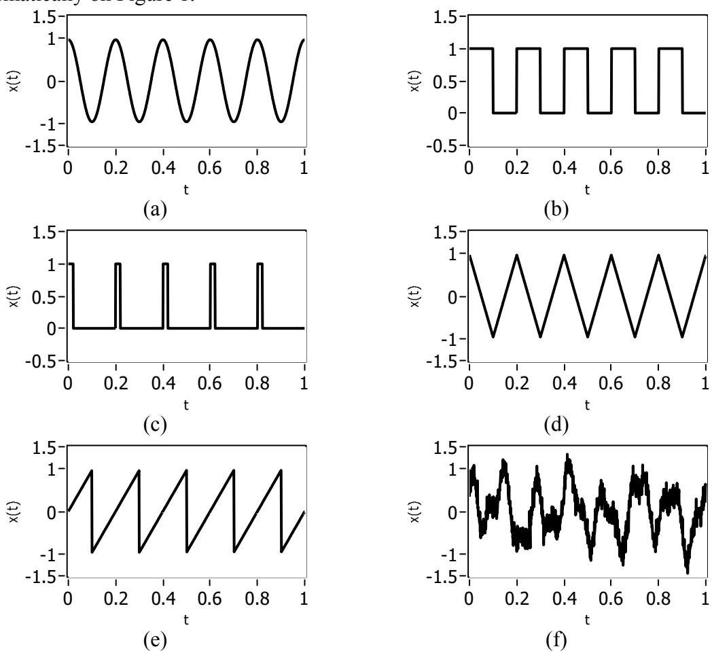

Figure 1. (a) sine wave signal, (b) square wave signal, (c) pulse train signal, (d) triangular wave signal, (e) sawtooth signal, (f) arbitrary periodic signal with noise – one period shown

Before proceeding let's define and calculate some of the most relevant parameters describing a signal.. The most frequently encountered signal, the generic sinusoidal signal, is given by the function,

*xt*() = Αsin(ω*t* +φ) (1.2)

In the study of electronics we encounter this signal very frequently where x(t) may represent a voltage, a current or energy.

The parameters describing the signal of Eq. [\(1.2\)](#page-3-0) are: *A* - the amplitude, ω - the radian frequency, and φ - the phase.

The radian frequency ω is given in units of radians/sec and is related to the frequency *f* given in cycles/sec. or Hz by

ω = 2π *f* (1.3)

The period *T* of the signal is

1 2 *T f* π ω == (1.4)

The phase φ represents a "shift" of the signal relative to origin (0 *t* = ) . Figure 2 illustrates the various parameters just described in a graphical fashion.

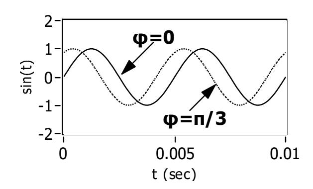

Figure 2. Sinusoidal signal with a phase of 0 degrees and 60 degrees.

In many applications involving time-varying signals, the relevant measurement parameters might be an average values of the signal. The electrical signal delivering the standard 120 Volt household electricity is a good example. The household electrical signal is a sinusoid with a frequency of either 60 or 50 Hz depending on location. The 120 Volts correspond to an average value of the signal and not to its amplitude. Figure 3 shows the typical 120 Volt signal measured at a wall outlet. Note that the amplitude of the signal is 170 Volts, not 120 Volts. So where does this number 120 Volts come form? It is certainly not a simple average since that would be zero for a signal symmetric about zero. 120 Volts is a number which gives an indication of the fluctuations of the signal about the average value. It is called the **root-mean square** value of the signal and as we

will see later when we study electrical signals in detail, it is important since it is related to energy content of the signal. The **root-mean square** value of a signal *Vt*( ) is defines as

2 0 1 () *T Vrms V T* = ∫ *t dt* (1.5)

For *Vt*() = cos(ω*t*) , is calculated as follows. *Vrms*

22 0 22 0 2 0 2 2 0 1 cos ( ) cos ( ) 2 1 cos(2 ) 22 1 cos(2 ) 22 2 2 *T rms zero Vt dt T tdt tdt tdt* ω ω ω π ω ω π ω ω π =Α =Α ⎡ ⎤ =Α + ⎢ ⎥ ⎣⎦ ⎡Α ⎤ =Α + ⎢ ⎥ ⎣ ⎦ Α = ⌠ ⎮ ⌡ ⌠ ⎮ ⌡ ∫ ∫ (1.6)

For our electricity example, 120 Volts *Vrms* = and thus the amplitude of the corresponding sinusoidal signal is 170 Volts as indicated on Figure 3.

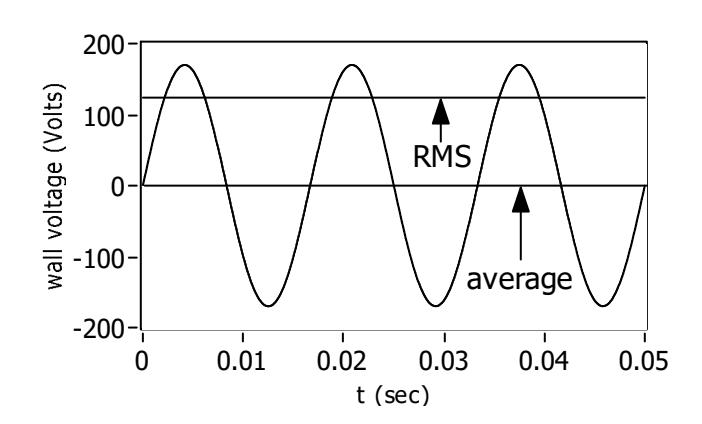

Figure 3. 120 Volt electrical signal

In some situations certain signals may prevent others from been received and understood. For example, our ability to listen to a conversation may be compromised by the engine noise of a low flying airplane or a by a passing train. In these situations the signals are still transmitted and received by our auditory system but we are unable to extract the

useful information contained in them. The signal of interest to us is corrupted by the "noise" of the airplane engine.

The signal to noise ratio (*SNR*)describes the relative amounts of information and noise in a signal.

#### Information in signal Information in noise *SNR* =

Since signals usually have a very wide dynamic range (can vary over many order of magnitude) the *SNR* is given in decibels (dB) defined as follows.

10 () 20 log *s n A SNR dB A* ⎛⎞ = ⎜ ⎝⎠⎟ (1.7)

where *As* is the amplitude of the signal and is the amplitude of the noise. Figure 4 shows a sinusoidal with various values of *SNR An*

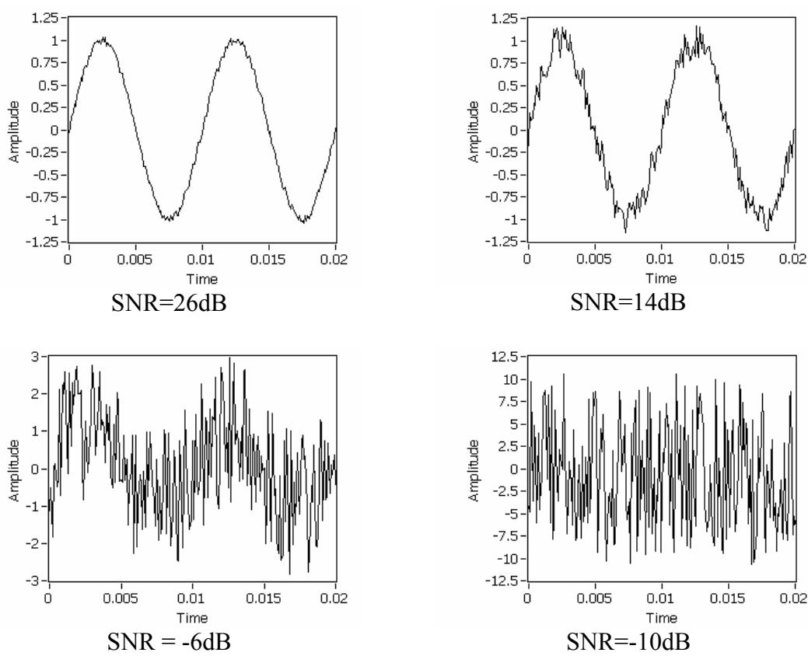

Figure 4. Signals with noise of various *SNR*.

Systems.

Signals are always associated with one or more systems. For example, a certain system may generate the signal while another may operate on it in order to process it or to extract relevant information from it. The representation of a system with its associated input and output signals is shown on Figure 5. The input signal is also called the excitation signal and the output is also called the response signal. The system may thus be represented by an operator F which may be designed to perform any desirable operation on the input signal *x*(*t*) resulting in the output signal *yt*( ). In electronics, for example, the system may be an amplifier where the excitation input voltage is operated on by the operator F to produce the output with an amplification ( ) *in v t* ( ) *out v t A* such that

() () () *in out in vt* ⎯⎯→= *v t Av t* F

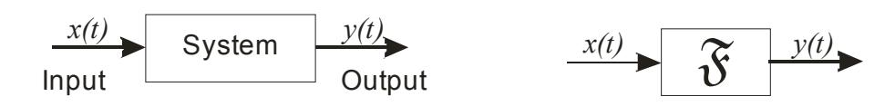

Figure 5. Block diagram of a system

Some common forms of the operator F are shown on the following table.

|            |            |                | t                            |
|------------|------------|----------------|------------------------------|
| Integral   | ⎯⎯ xt () → | ∫ ⎯ y          |                              |
|            |            | ⎯ () t         |                              |
|            |            |                | () ( )                       |
|            |            | ⎯→             | yt = x τ d τ ∫               |
| Amplifier  | xt () ⎯⎯→  | y () t A ⎯⎯⎯→  | yt () = Ax ( t )             |
| Multiplier | ⎯⎯ xt () → | y ( t ) ⊗ ⎯⎯⎯→ | 1 2 yt () = x () t x ( t )   |
| Adder      | ⎯⎯ xt () → | y ( t ) ⊕ ⎯⎯⎯→ | 1 2 yt () = x () t + x ( t ) |

The characteristics of the System operator F are fundamental in system analysis. We are particularly interested in linear, time invariant (LTI) systems.

### **A linear system is one which is both homogeneous and additive.**

A **homogeneous system** is one for which a scaled input voltage produces an equally scaled output voltage. Figure 6 illustrates the principle of homogeneity where can be any constant. *m*

F *mx(t) my(t)*

An additive system is one for which,

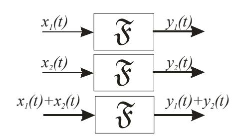

Figure 7. Demonstration of system additivity.

The general definition of a linear system is one that can be homogeneous and additive. If ( ) is the response of a system to an input 1 *y t x*1 (*t*) and *y*2 (*t*) is the response of a system to an input *x*2 (*t*) then if the system is linear the response to the signal , where and *b* are any constants is 1 2 *ax* ()*t* + *bx* (*t*) *a* 1 2 *ay* ()*t* + *by* (*t*) . This very important property of linear systems is called the **principle of superposition** which we may represent mathematically as

(1.8) 12 1 2 *ax* ()*t* +⎯ *bx* ()*t* ⎯→+ *ay* ()*t by* (*t*) F

In out study of electronic systems we will make extensive use of this property in order to obtain solutions of what seemingly appear difficult problems.

A **time invariant** system is one for which a delay 0 τ in the application of the excitation signal (input) results in the same delay in the response signal (output). For example if an input signal, *x*(*t*), to a system described by the operator F results in the output *yt*( ) like,

*x*(*t*) ⎯⎯→ *y*( ) F *t* (1.9)

0 ) 0 *xt*() −⎯ τ ⎯→− *y*(*t* τ F (1.10)

Then the system is time-invariant if

The interconnections between systems is also a very important consideration for their overall behavior. In electronic systems special attention is paid to their input and output characteristics. When systems are connected together the output characteristics of a system must "match" the input characteristics of the system that it connects to. As an

example consider two systems representing water storage tanks. The input of the system is characterized by its ability to receive a certain flow rate of water. The output represents a pump with the capability to supply a certain flow rate of water. The block diagram of these interconnected systems is shown on Figure 8. For optimal system operation, the rate at which the pump at the output of the system -tank1- supplies the water must be compatible with the rate at which the system -tank2- can accept the water. In electronics we have an analogy where the input and output characteristics of the system refer to the resistance seen by the signals at the input and output of the system. In the case of electronics we must "match" the two resistances for optimal operation of the electronic system. We will explore these principles in detail as we design and investigate electronic devices and systems.

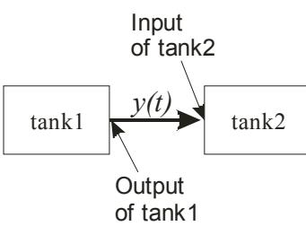

Figure 8. Block diagram of an interconnected system

In practical systems, the **System** block indicated on Figure 5 is usually made up of various subsystems, components or devices each performing a specific task. In general, the components and devices incorporated in a **System** may themselves be considered as subsystems. For example, the block diagram of a digital sound recording system, comprised of a microphone, electronics for amplification and filtering, an analog to digital converter (ADC), a computer, a digital to analog converter (DAC), an amplifier, and a speaker is shown on Figure 9. The dotted rectangle represents the complete system which is comprised of various other subsystems.

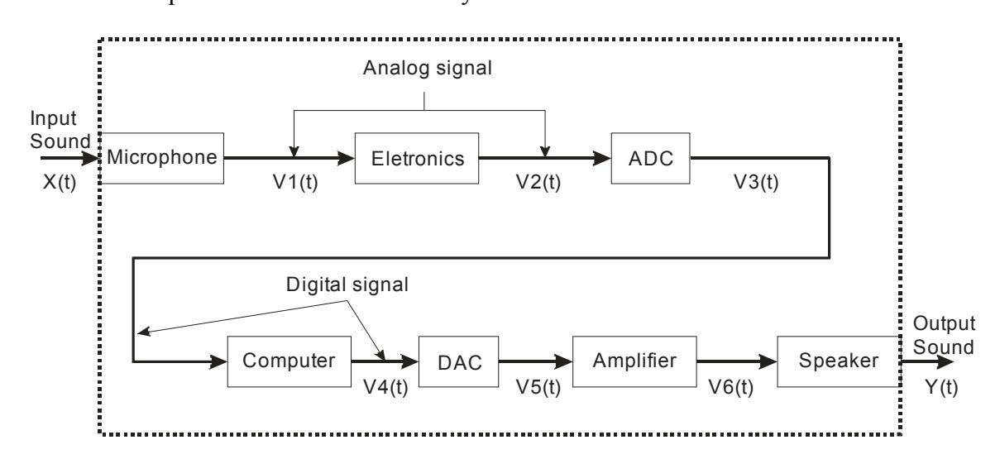

Figure 9. Block diagram of sound recording system

The microphone is a transducer which may be considered as a system that converts the pressure variations in the input signal X(t) to the voltage signal V1(t). In turn V1(t) is processed by the electronics module resulting in the signal V2(t). The electronics module may perform such operations as amplification, filtering and offsetting. Both signals V1(t) and V2(t) are time continuous analog signals. Signal V2(t) is in turn operated by module ADC resulting in signal V3(t) which is now a digital signal (discrete time) that may be further processed by the computer.

The conversion of the analog signal V2(t) to the digital signal V3(t) involves three very important operations: (1) sampling, (2) quantization and (3) encoding.

*Sampling* is the process by which the signal values are acquired at discrete points in time. This is a non-linear process since information is irrevocably lost.

*Quantization* is the process by which the continuum of amplitude values is converted to a finite number of values (quantized values). This is a non-linear process since information is irrevocably lost.

*Encoding* is the process of converting each quantized value to a binary number represented by a binary bit pattern. No information is lost in this translation.

We will explore these operations in later sections. For now let's establish the framework for signal representation and analysis.

#### **Time and frequency domain**

Physical signals, such as the voltage output of a microphone or the electrical signal output of a strain or a pressure gage, are usually represented as function of time. These signals may be manipulated (amplified, filtered, offset etc.) in the time domain and many applications deal with signals solely in the time domain.

However, it is often convenient and frequently necessary, when signal analysis and processing is required, to represent the signal in the frequency domain. A signal in the frequency domain shows "how much" of the signal is associated with a certain frequency. Figure 10 shows the time domain and the frequency domain representation of a sinusoidal signal with a frequency of 1kHz. Since this is a signal with a single frequency of 1 kHz, the frequency domain representation of the signal is a single line at a frequency of 1kHz. The height of the line at the frequency of 1 kHz corresponds to the magnitude or strength of the signal at that frequency.

As another example consider the signal given by the function

*x(t )* =+ *1 cos(1000*π*t )* + *2 sin(600*π*t )* (1.11)

This signal is plotted on Figure 11. The two frequencies present in the resulting signal are 500Hz and 300Hz.Therefore, in the frequency domain representation only these two frequencies contain signal information as shown on Figure 11. Note the strength of the signal as represented in the frequency domain.

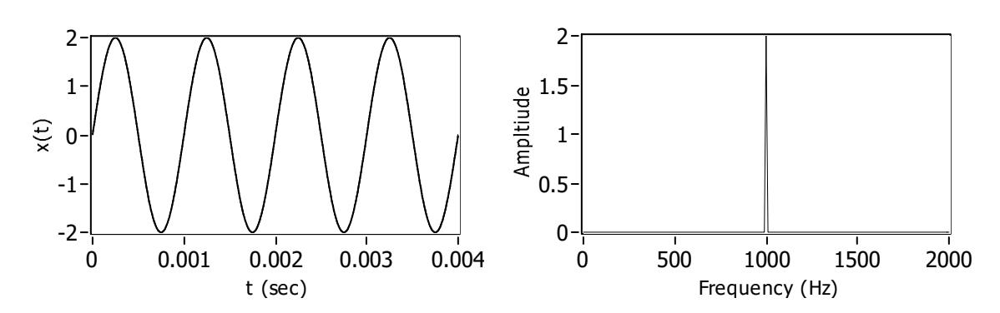

Figure 10. Time and frequency domain representation of a sinusoidal signal.

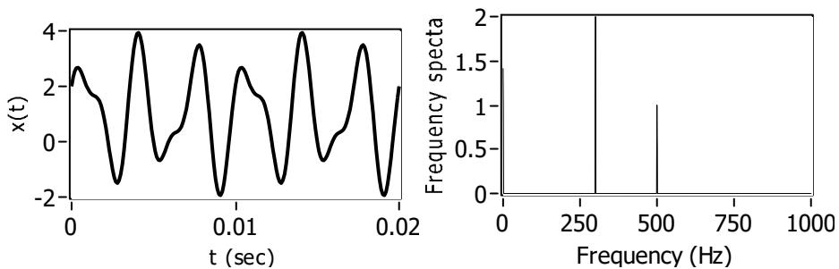

Figure 11. Time and frequency domain representation of the signal

Signals may in general contain a large number of frequencies and in this case the frequency domain representation of the signal becomes very useful. A signal with large variations in its rate of change in the time domain contains proportionally larger number of frequencies. Compare the two signals shown on Figure 12. The signal on Figure 12 (a) appears to be "smoother" than the signal on Figure 12(b). Indeed the frequency content of the signal in 12(b) is higher than that of the signal in 12(a).

In the frequency domain representation of the signals, information exists only at the frequencies of the sinusoids comprising the signals. Furthermore the frequency domain representation contain details about the relative strength of the various frequency components as can be seen by comparing the mathematical expression of the signals to their corresponding frequency domain representations. We will explore this concept further in the following sections.

In the case of the square wave signal where the slope at the transitions becomes infinite, the frequency content of the signal is also infinite. Signals with finite frequency content are called band-limited signals.

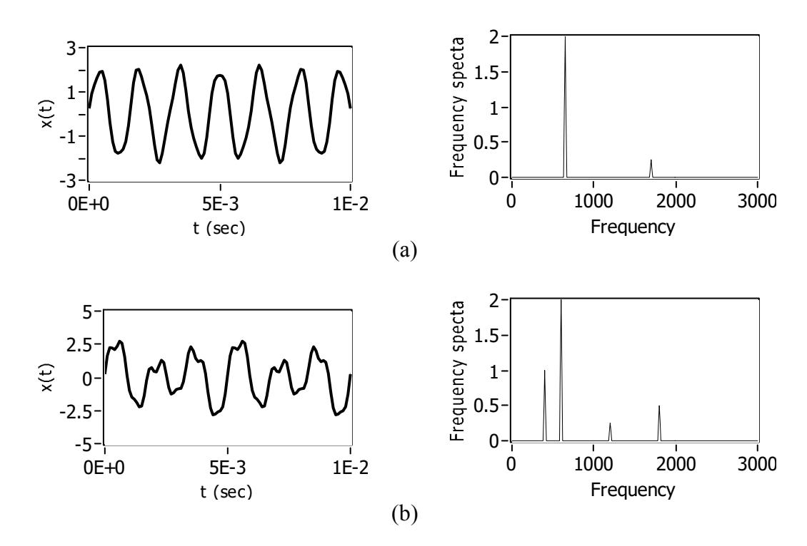

Figure 12. Comparing signals in the frequency and the time domain. (a) 1 4 *x*(*tt* ) =+ 2sin(650(2π ) ) cos(1800(2π )*t*)

(b) 11

24 *x*(*tt* ) =+ 2sin(600(2π ) ) sin(1800(2ππ )*t*) + sin(400(2 )*t*) + cos(1200(2π )*t*)

The graphical representation of signals in the frequency domain just presented will be enhanced by the appropriate mathematical representation of signals in the frequency domain. The theory of complex numbers is essential in understanding frequency domain representation. In the following section the concepts of Fourier analysis will provide us with a very powerful tool for the general transformation of a signal from the time domain to the frequency domain and equivalently from the frequency domain to the time domain.

#### Complex number arithmetic: A review

A complex number may be represented in rectangular form as follows:

*ca* =+ *jb* Rectangular format of complex number (1.12)

The number *j* = −1 . *a* is the real part of the complex number and *b* is the imaginary part of the complex number.

The complex conjugate of a complex number is obtained by replacing with . For the number given by Eq. [\(1.12\)](#page-13-0) is *ca j* − *j j* ∗ = − *b*

The magnitude of the complex number is

\*2 magnitude == *cc* (*a* + *jb*)(*a* − *jb*) = *r* = *a* + *b*2 (1.13)

And the phase is

1 phase tan *b a* θ − ⎛ ⎞ == ⎜ ⎟ ⎝⎠ (1.14)

The graphical representation of the complex number in the complex plane is:

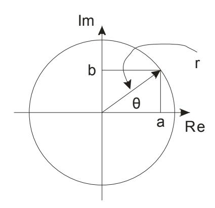

Euler's identity is an important relationship in the theory of complex numbers. It states:

cos sin *j e j* φ =+ φ φ (1.15)

From the graphical representation of a complex number and Euler's identity we may represent the complex number in polar form as

(cos sin ) Polar format of complex number (1.16) *j cr j re* θ =+ θθ =

Example: Convert the number *c* = 5 − *j*6 to polar form *j cre* θ = .

First let's calculate the magnitude. 22 *r* =+ 5 6 = 25+ 36 = 7.81

The phase is 1 6 tan 50.19 5.41 radians 5 *o* θ − ⎛⎞ − == ⎜⎟ − = ⎝⎠

And the complex number in polar form is . 5.41 7.81 *j ce* =

The graphical representation of this number is

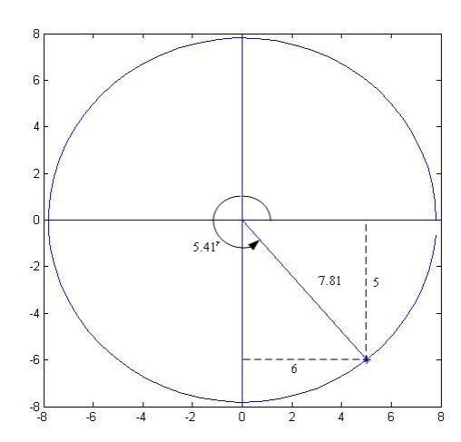

Example: Convert the number 3 *j ce* π = to rectangular form.

The magnitude of the number is 1 and the phase is π/3.

The rectangular form is *ca* =+ *jb* and thus we need to evaluate *a* and *b* .

From Euler's identity we know that 3 *ar* cos cos 1/ 2 π = θ = = and

3 *br*sin sin 3 / 2 π == θ =

And the number in rectangular form is *cj* =+13

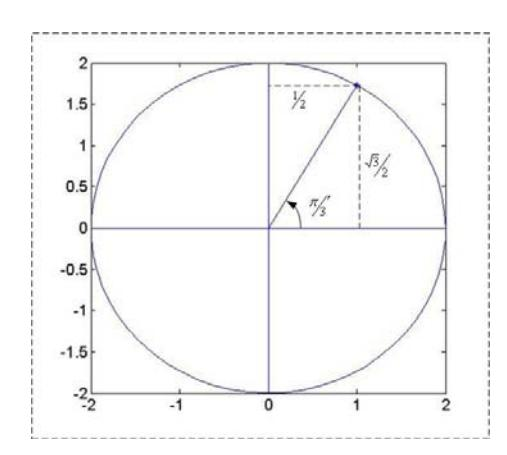

#### **Impulse Function. A review**

In science and engineering there are many examples when an action occurs at an instant in time or at certain point in space. For example the force exerted on a baseball when it is hit by a bat is of very short duration. Also, the point test used in materials testing applies a very localized force on a material. The mathematical representation of this type of action is

2 0 1 () 0 *t t t* ε ε ε ε ε δ ε ⎧ <− ⎪ ⎪ = ⎨ −<τ &lt; ⎪ ⎪> ⎩ (1.17)

For which we also impose the condition:

()*tdt* 1 ε δ +∞ −∞ = ∫ (1.18)

The function may be thought of as a rectangular pulse of width ε and height 1/ε as shown on Figure 13(a). In the limit ε → 0 , the height 1/ε increases in such a way that the total area is 1. This leads to the definition

0 ()*t* lim ( ) ε δ δ *t* → = (1.19)

The function δ (*t*) is called the unit impulse function which is also known as the Dirac Delta function or simply as the Delta function. The graphical representation of the Delta function is shown on Figure 13(b)

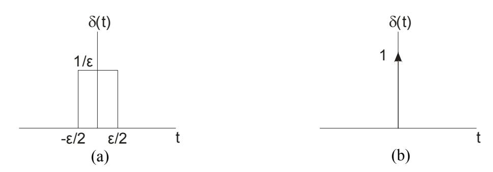

Figure 13. Delta function (a) visualization and (b) symbol

For a more general representation, the function 0 δ (*tt* − ) represents is shifted Delta function and represents an impulse centered at 0 *t* = *t* . The graphical and mathematical representations of this general Delta function is,

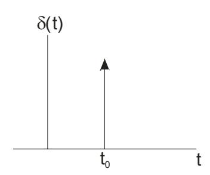

0 00 () 1 () 0 for *tdt tt* δτ δ ττ +∞ −∞ −= − =≠ ∫ (1.20)

The usefulness of the Delta function results not from what it represents but rather from what it can do. The two fundamental properties, and default definitions, of the Delta function are:

0 2 2 0 () *jf jf ee df* πτ πτ δτ τ ∞ − −∞ −≡ ∫ (1.21)

0 *ft*() (*t* )*dt f* ( ) 0 δ τ ∞ −∞ −= ∫ τ (1.22)

Equation [\(1.22\)](#page-16-0) is referred to as the sampling property of the Delta function and it is a very important property used extensively in signal analysis.

### **Fourier Transform and the Fourier Series.**

The Fourier transform (FT) is a mathematical function that transforms a signal from the time domain, *x*(*t*), to the frequency domain, *X* ( *f* ) . The time to frequency domain transformation is given by:

(1.23) 2 () ( ) *jf t Xf x t e dt* π +∞ − −∞ = ∫

Equivalently, the inverse Fourier transform may be used to convert a signal from the frequency domain to the time domain as follows:

2 () ( ) *jf t x tX f e* π +∞ −∞ = ∫ *df* (1.24)

) *df* When the Fourier transform is to be expressed in terms of the angular frequency ω (rad/sec rather than the frequency *f* (Hz) the conversion is achieved by letting *d*ω = 2π . Therefore Eqs. [\(1.23\)](#page-17-0) and [\(1.24\)](#page-17-1) when written in terms of ω take the form

() ( ) (1.25) *jt X x t e* ω ω +∞ − −∞ = ∫ *dt*

1 () ( ) 2 *jt x tX e* ω ω *d*ω π +∞ −∞ = ∫ (1.26)

The Fourier transform is the most used mathematical function in signal processing and data analysis. It gives the tools to visualize, by looking into the frequency domain, signal characteristics that are not directly observable in the time domain.

An illustrative example is the signal associated with sound. Figure 14(a) shows the voltage signal as a function of time corresponding to the sound of the middle C note of a piano. The important information of a sound signal is its frequency content. This information is revealed when we transform the signal to the frequency domain as shown on Figure 14(b). The frequency domain representation of the signal clearly shows us that the signal has, besides the fundamental frequency of 261 Hz, additional frequency components. These additional frequencies (the harmonics) tell us about the sound characteristics of the piano and indeed they are the reason for the richness and the uniqueness of each instrument.

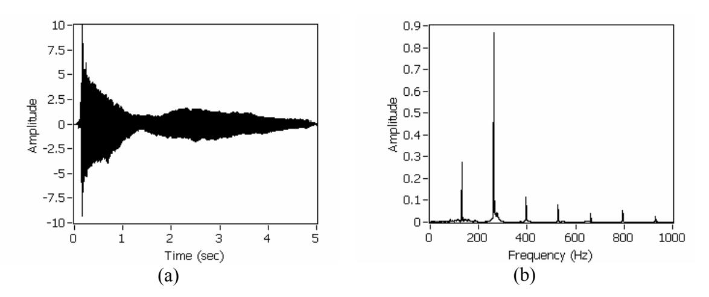

Figure 14. (a) the time domain signals of a middle C note of a piano represented as a voltage from a microphone. (b) Fourier transform of the signal represents the same signal in the frequency domain.

Before proceeding with the physical and thus the practical significance of FT let's become more familiar with the process by calculating the transform for various practical signals. We will look at periodic as well as non-periodic signals. Let's start with the calculation of the Fourier transform of the signal

0 *vt*( ) = sin(ω *t*) (1.27)

This is our familiar sine wave characterized by a frequency of 0 2πω . Since this signal represents - by definition - a single frequency, we anticipate that in the frequency domain, all information will be contained at that frequency. So let's proceed with the calculation to determine the Fourier transform of *vt*( ) which is given by

 (1.28) 0 () sin( ) *jt V t* ω ω ω ∞ − −∞ = ∫ *e dt*

By using Euler's identity, Eq. [\(1.15\),](#page-13-1) we obtain,

() 00 00 () ( ) () 2 1 2 *jt j t jt jt j t ee Ve j je e d* ωω ωω ω ω ω ∞ − − −∞ ∞ −+ −− −∞ − = =− ⌠ ⎮ ⌡ ∫ *dt t* (1.29)

*dt* (1.30) 0 ( ) 0 2( ) *j t e* ωω πδ ω ω ∞ −+ −∞ += ∫

According to Eq. [\(1.21\),](#page-16-1)

 (1.31) 0 ( ) 0 2( ) *j t e* ωω πδ ω ω ∞ −− −∞ −= ∫ *dt*

Therefore, Eq. [\(1.29\)](#page-18-0) becomes

*Vj* () ωπ =+ [δ (ω ω0 ) −δ (ω −ω0 )] (1.32)

The graphical representation of *V* (ω) is shown on Figure 15.

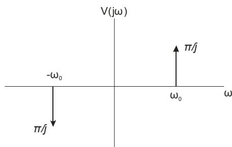

Figure 15. Fourier transform of a sine wave.

Similarly the Fourier transform of the signal

0 *vt*() = cos(ω *t*) (1.33)

Is calculated as follows

() [] 00 00 0 () ( ) 00 () cos( ) 2 1 2 () ( ) *jt jt j t jt jtj t Vt e dt ee edt ee* ω ωω ω ωω ω ω ωω πδ ω ω δ ω ω ∞ − −∞ ∞ − − −∞ ∞ −− −+ −∞ = + = =+ =− + + ⌠ ⎮ ⌡ ∫ ∫ *dt* (1.34)

Figure 16 shows the Fourier transform of the cosine signal.

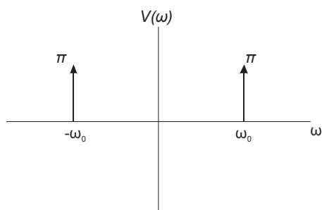

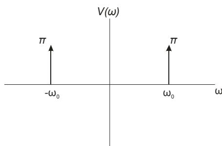

Figure 16. Fourier transform of a cosine wave.

The rectangular pulse function given by

1, 1/ 2 () 0, 1/ 2 *x yx x* ⎧< ⎪ = ⎨ ⎪ > ⎩ (1.35)

represents another very useful signal in electronics and engineering in general.

The transform *Y*(ω) of the pulse function is

[ [] ] () 1/ 2 1/ 2 1/ 2 1/ 2 1/ 2 2 0 () ( ) cos( ) sin( ) sin 2cos( ) *jt jt Yy t e dt edt jt dt* ω ω ωτ ω ωτ +∞ − −∞ − − − = = =− == ∫ ∫ ∫ ∫ *dt* (1.36)

Figure 17 shows the plot of the rectangular function and its Fourier transform.

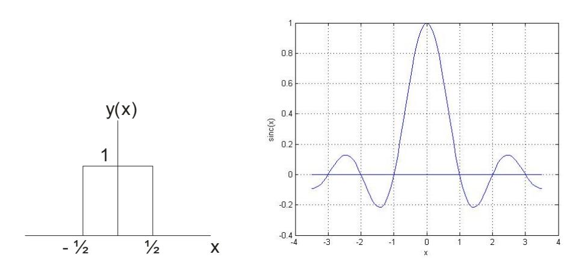

Figure 17. rectangular pulse and its Fourier transform

Similarly, the Fourier transform of the shifted rectangular pulse

2, 1 3 () 0, 1, 3 *x yx xx* ⎧ << = ⎨ ⎩ < > (1.37)

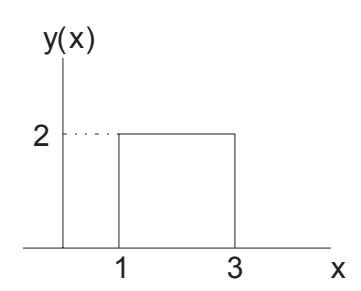

(1.38) 3 1 () ( ) 2 *jt jt Yy t e edt* ω +∞ − −∞ − = = ∫ ∫ *dt*

Let's simplify the above integral by changing variables asξ = *t* − 2 .

1 (2) 1 1 2 1 2 () 2 2 sin 4 *j j j j Ye d ee e* ωξ ω ωξ *d* ωξ ξ ω ω −+ − − − − − = = = ∫ ∫ (1.39)

#### Unit impulse function

The Fourier transform of the Delta function, given by Eq. [\(1.20\),](#page-16-2) is

 (1.40) 0 0 () ( ) *jt jt tt e dt e* ω ωδ +∞ − −∞ − ∆= − = ∫

For the graphical representation of 0*t* = 0 δ (*t*) and ∆(ω) is shown on Figure 18.

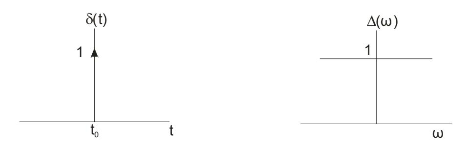

Figure 18. Delta function and its Fourier transform.

So now let's explore further the physical significance of the Fourier transform by investigating how the energy content of a signal is represented in the time domain and the frequency domain. From fundamental conservation principles we should expect that the estimation of global parameter such as energy should be the same regardless of how the signal is represented.

The total energy content of signal *x*(*t*) is given by

2 2 () ( ) ( ) where ( ) is the complex conjugate of ( ) 1 () ( ) 2 1 () ( ) 2 1 () () 2 1 () 2 *jt jt Ex t dt x tx t dt x t x t xt X e d dt X x t e dt d XX d Xd* ω ωω π ωω π ωω ω π ωω π ∞ −∞ ∞ ∗∗ −∞ ∞ ∞ ∗− −∞ −∞ ∞ ∞ ∗− −∞ −∞ ∞ ∗ −∞ ∞ −∞ ≡ = ⎡⎤ ⎣⎦ ⎡⎤ = ⎢⎥ ⎣⎦ ⎡⎤ = ⎢⎥ ⎣⎦ = = ⌠ ⎮ ⌡ ⌠ ⎮ ⌡ ∫ ∫ ∫ ∫ ∫ ∫ (1.41)

The expression 2 () 2 *X* ω π represents the energy per unit frequency and thus the expression 1 2 () 2 *X* ω *d*ω π ∞ −∞ ∫ is the total energy content of the signal *X* (ω) in the frequency domain. Therefore we have shown that the Fourier transformation is an energy conservation transformation.

2 1 () ( ) 2 2 *x tdt X* ω *d*ω π ∞∞ −∞ −∞ = ∫ ∫ (1.42)

This is a very important result since it enables us to extract global signal parameters such as energy by looking at either the time or the frequency domain.

The Fourier transform results may be presented in a variety of ways. It may be represented as:

- The amplitude: plot the amplitude of the sinusoidal component at the appropriate frequency.
- The RMS amplitude: plot the RMS amplitude of the sinusoidal component at the appropriate frequency.
- Power spectrum: plots values that are proportional to the square of RMS amplitude.

The plots of Figure 19 show a sine wave with a frequency of 300 Hz and the corresponding frequency domain representation.

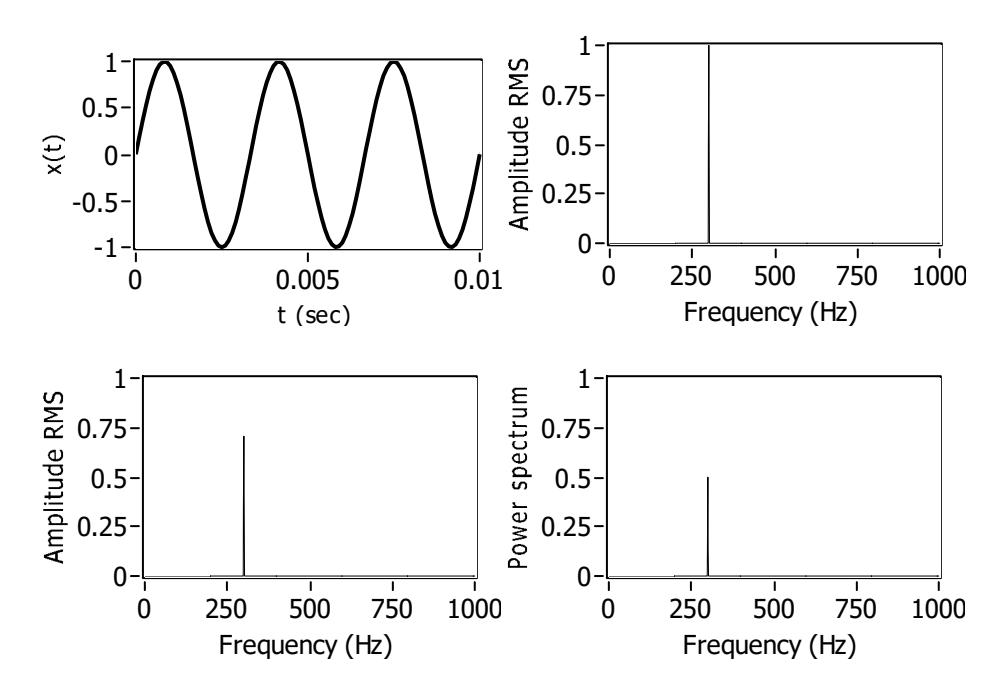

Figure 19. Sine wave signal and various forms of its frequency domain representation.

As another example let's consider the signal shown on Figure 20(a) and its calculated Fourier transform on 20(b). From the FT we see that there are three identifiable frequency components in our signal: 60 Hz, 300 Hz and 500 Hz. In the laboratory environment many systems pick up an undesirable 60 Hz "noise" from fluorescent lights and other devices, including wiring, that are powered by a 60 Hz wall power. Our example is a simplified but representative case of such a scenario. In order to deal with these type of undesirable signals we first have to identify their existence and ascertain their relative energy contribution to the signal of interest. The Fourier transform gives the tool to make this determination.

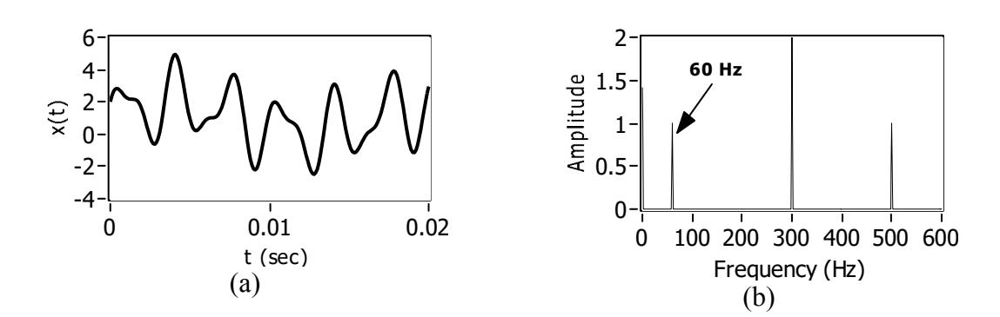

Figure 20. Signal containing a 60 Hz "noise" and its amplitude spectrum. The composite signal is given by Hz noise =+ π + ππ + *60 x(t ) 1 cos(1000 t ) 2 sin(600 t ) sin(120 t )*

### Summary:

Some of the fundamental properties of Fourier transform are:

## Check all these.

| Time domain Linearity 1 2 ax () t + bx ( t ) 1 aX ( ) ω Product 1 2 x () tx ( t ) 1 X ( ) ω Differentiation dx ( t ) dt j X ω ( ω ( ) X ω Integration () t x τ d τ ∫−∞ j ω Time delay xt ( ) − τ j e X ωτ − Frequency shift ( ) o j t e x t − ω X ( ω − | Frequency domain 2 + bX ( ) ω 2 X ∗ ( ) ω ) Χ (0) ( ) δ ω + 2 ( ) ω ) ω ο |
|---------------------------------------------------------------------------------------------------------------------------------------------------------------------------------------------------------------------------------------------------------|---------------------------------------------------------------------------|
| x () t dt +∞ ∫−∞                                                                                                                                                                                                                                        |                                                                           |
| 1 Energy conservation                                                                                                                                                                                                                                   | 2                                                                         |
| 2                                                                                                                                                                                                                                                       | ( )                                                                       |
|                                                                                                                                                                                                                                                         | X ω d ω                                                                   |
| +∞ ∫−∞ (Parseval’s theorem) π                                                                                                                                                                                                                           |                                                                           |
| Frequency shift ( ) o j t e x t − ω X ( ω − ω                                                                                                                                                                                                           | ) ο                                                                       |
| Time scaling x ( ) at                                                                                                                                                                                                                                   |                                                                           |
| a                                                                                                                                                                                                                                                       | a                                                                         |
| π                                                                                                                                                                                                                                                       | ⎛ ⎞ ⎜ ⎟ ⎝ ⎠ ω X                                                           |
| Duality X ( t ) x ( ) − ω                                                                                                                                                                                                                               |                                                                           |
| Convolution 1 2 x () t x ∗ ( t ) 1 X X ( ) ω                                                                                                                                                                                                            | 2 ( ) ω                                                                   |

#### **Fourier series and its relation to Fourier transform.**

Fourier series is just a special case of Fourier transform. In fact the Fourier series is associated with periodic signals, while the Fourier transform is a more general representation of non-periodic signals in the frequency domain.

Periodic signal may be represented by a linear combination of sinusoids whose frequencies vary by a constant integer value. Since we may also represent a sinusoid with complex exponentials, by using Euler's formula, the functional form of this linear combination of complex exponentials is known as the Fourier series of the periodic signal and it is given by

() *jk t k k x t c e* ω +∞ =−∞ = ∑ (1.43)

The coefficients are in general a complex numbers, *k c kk ca jb* = + *k* , and are given by

2 0 1 () *T jk t k cx t e T* Τ − = ∫ *dt* (1.44)

where*T* is the period of *x*(*t*) and the integration is performed over one period. The coefficients are called the **Fourier series coefficients or the spectral coefficients** of the function *k c x*(*t*) and they represent a measure of how much signal (the strength of the signal) there is at each frequency *k*ω . Therefore, the task in determining the Fourier series representation of a certain signal is that of determining the complex coefficients . *k c*

If the signal *x*(*t*) is real then its Fourier series representation is reduced to

0 ( 1 () cos( ) sin( ) *k k k x ta a k*ω*t b k*ω*t* ) ∞ = =+∑ − (1.45)

where,

() () 0 0 2 0 0 1 () 2 () cos 1,2,3, 2 ()sin 1,2,3, *T T k T T k T ax t dt T ax t k t dt k T bx t k t dt k T* π π = = == ∫ ∫ ∫ … … = (1.46)

The coefficient is just the average value of the signal 0 *a x*(*t*) . In calculating the integrals of Eqs. [\(1.46\)](#page-25-0) it is useful to keep in mind the orthogonality properties of functions. For example

0 0 0 0 1 sin 2 sin 2 1/ 2 0 00 0 1 cos 2 cos 2 1/ 2 0 10 1 sin 2 cos 2 0 *T T T mn tt mn dt m TT T mn mn tt mn dt m TT T mn tt mm dt TT T* ππ ππ ππ ⎧ ≠ ⎛⎞ ⎛ ⎞ ⎪ *n n* ⎜⎟ ⎜ ⎟ = ⎨ =≠ ⎝⎠ ⎝ ⎠ ⎪ ⎩ = = ⎧ ≠ ⎛⎞ ⎛ ⎞ ⎪ ⎜⎟ ⎜ ⎟ = ⎨ =≠ ⎝⎠ ⎝ ⎠ ⎪ ⎩ = = ⎛⎞ ⎛⎞ ⎜⎟ ⎜⎟ = ⎝⎠ ⎝⎠ ⌠ ⎮ ⌡ ⌠ ⎮ ⌡ ⌠ ⎮ ⌡ (1.47)

As an example let's calculate the Fourier series of the periodic square wave shown on Figure 21.

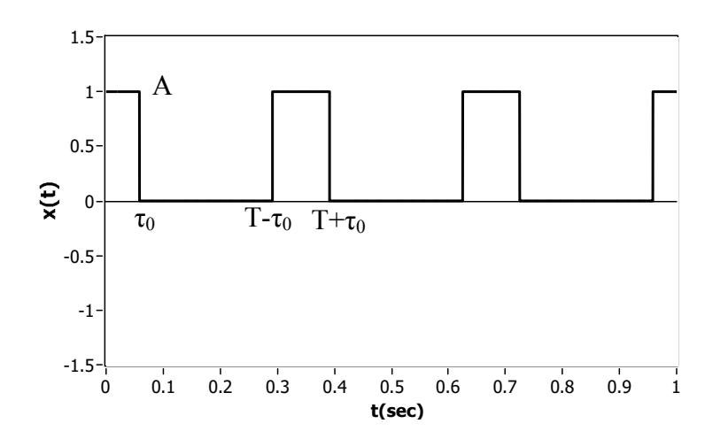

Figure 21. Square wave signal

The period of the square wave is T and its frequency, the fundamental frequency, is 0 ω = 2/ π *T* . Furthermore, the duty factor of the signal is defined as, 0 2 df *T* τ ≡ = and it is arbitrary. Since the signal is an even function of t, the Fourier coefficients *b* and *a* are given by 0 *k k*

0 0 0 00 00 0 0 00 0 0 0 2 2 2 sin( ) *jk t k jk jk A ae dt T jA jk t k kT Ae e kT j A k kT e* ω ωτ ωτ ω ω ω ωτ ω − − − − = − =≠ ⎡⎤ − = ⎢⎥ ⎣⎦ = ∫ (1.48)

For *k* = 0 we have

0 0 0 0 2 *A adt A TT* τ − = = ∫ (1.49)

where is the average value of the signal. 0 *a*

The Fourier series of the square wave is

0 1 0 00 1 0 () cos( ) 2 2sin( ) co *k k k xt a a k t A A kk* s( ) *Tk T* ω τ ω τω*t* ω ∞ = ∞ = =+ =+ ∑ ∑ (1.50)

Let's consider the case of a 50% duty factor square wave signal, shown on Figure 22(a) for which 0 τ = *T* /4 . The first 5 non-zero coefficients are:

01 3 5 7 44 4 0, , , , 35 *aa a a a* 4 π ππ 7 == = − = = − π

Plots (b), - (f) of Figure 22 show the Fourier series representation for a number of harmonics, starting with the first and ending with the fifth. As the number of harmonics used in the approximation increases the approximation becomes closer and closer to the square wave signal.

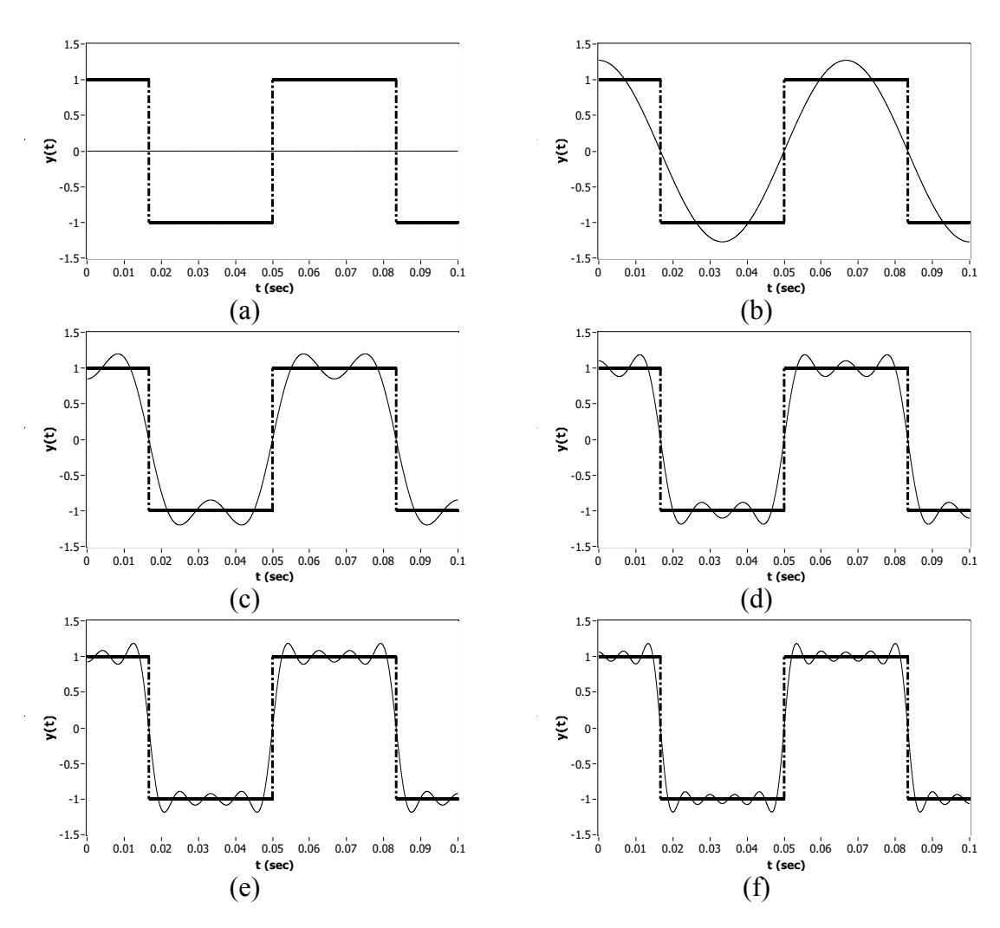

Figure 22. 50% duty factor square wave (a) and its 1st five Fourier harmonics (b) – (f)

For a deeper understanding let's explore the significance of the coefficients . A plot of the magnitude of the coefficients as a function of is shown on Figure 23. Each value of *k* corresponds to a frequency called a harmonic which are integer multiples of the frequency of the square wave also called the fundamental frequency. The magnitude of the coefficients is related to the relative strength of the signal at the corresponding frequencies. The *k a k a k k a k* dependence of the magnitude is an indication of the relatively "slow" rate of convergence of the series. This implies that a large number of harmonics is required in order to reproduce a square wave; a direct consequence of the discontinuities associated with the square wave signal. The magnitude plot of the Fourier coefficients is directly related to the Fourier transform of the square pulse given by Eq. [\(1.36\).](#page-20-0)

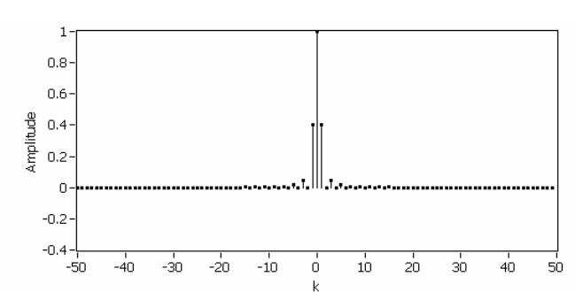

Figure 23. Plot the values 2 0 sin 2 2 *k A a k kT* τ π π ⎛ = ⎜ ⎝⎠ ⎞ ⎟ as a function of *k* for 4 0 τ /1 Τ= /

It is also instructive to plot the frequency spectrum of the Fourier coefficients for various values of the duty factor 0 τ / Τ .

Figure 24 shows a plot of for *k a*

00 0 0 0 0 (*ab* )τ / Τ=1/ 4,( )ττ / Τ=1/12,(*c*) / Τ =1/16,(*d*)τ / Τ=1/ 32,(*e*)τ / Τ=1/ 64,( *f* )τ / Τ =1/128 The plot shows the amplitude of as a function of , the mode number. Our first observation is that the frequency spectrum of has an oscillatory behavior with a slowly decreasing envelope. The decrease is proportional to 1/ . *k a k k a k*

We also notice that the spacing between these harmonics is a function of the so called duty factor. As 0 τ → 0 the square wave signal approaches a series of Delta functions. We notice that as the pulses become narrower in the time domain the Fourier series coefficients is distributed over a wider range in the frequency domain.

Therefore we see that narrow time signals require many harmonics in order to reproduce the original signal. Broader time signals require fewer harmonics for the reproduction since the amplitude of the higher harmonics tend to decrease more rapidly. In fact as 0 τ / Τ→ 0 , the first crossing of the coefficient goes to ∞ and there is a very broad spectrum containing many harmonics which all essentially have the same amplitude.

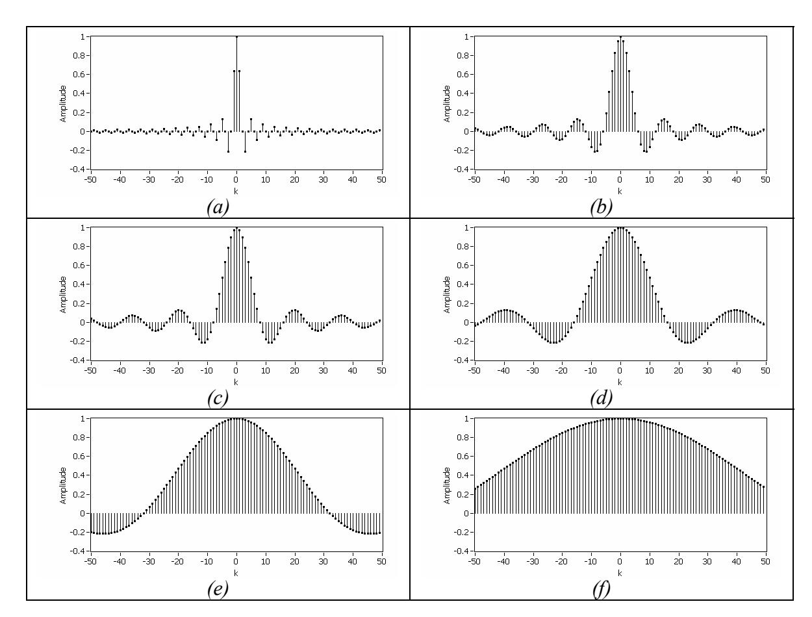

Figure 24. Fourier series coefficients for square waves of various duty factors. 00 0 0 0 0 (*ab* )τ / Τ=1/ 4,( )ττ /Τ=1/12,(*c*) / Τ=1/16,(*d*)τ /Τ=1/ 32,(*e*)τ /Τ=1/ 64,( *f* )τ /Τ=1/128

At the discontinuities of the signal there are certain important observations to be made. First, note that the approximation passes through the average value of the signal. This is given by the coefficient which for the signal used on Figures 25 is zero. 0 *a* We also observe from the results shown on Figure 25 that the error of the approximation, ε = (real signal) - (approximated signal), shown by the rippled thick solid line in the curves of Figure 25, decreases as the number of terms used in the approximation increases.

As the number of terms increases the ripple concentrates in the vicinity of the discontinuities. Closer observation indicates that, as the number of terms increases, the maximum amplitude of the error remains unchanged and its location moves closer and closer to the discontinuities. The maximum ripple can be shown to be about 10% of the signal value for all finite values of *k* .

The ripple at the discontinuities and its properties just described is called Gibbs phenomenon.

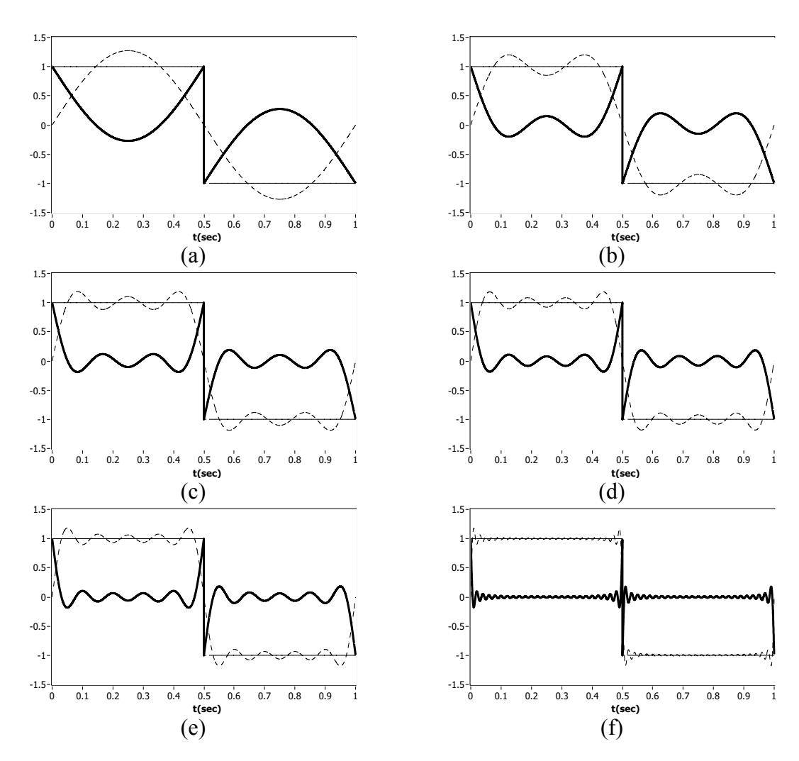

Figure 25: Gibbs phenomenon

The FT of any periodic signal is always composed of just impulses. The area of these impulses are the FS coefficients for the exponential form.

Fourier series expansion of:

Triangular wave. Figure 26.

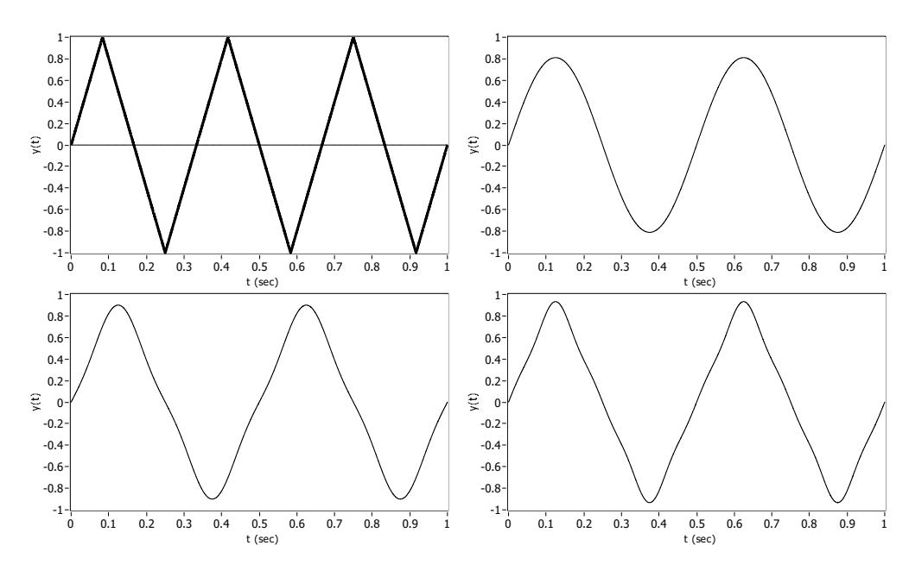

Figure 26.

() 2 22 1,3,5, 8 sin( ) () sin *k k A yt k f t k* π π ∞ = = ∑ …

Sawtooth wave Figure 27

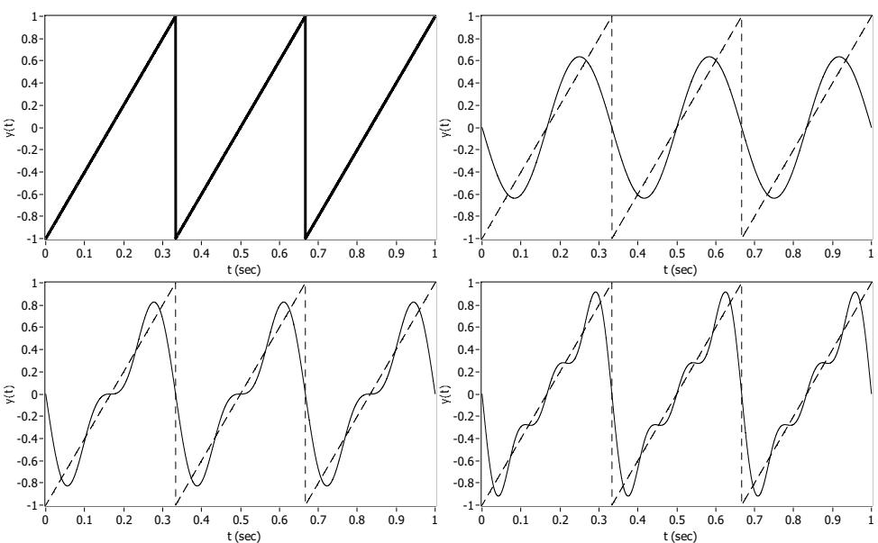

Figure 27

() 1 11 () sin 2 *k y t Average k f t k* π π ∞ = =− ∑

Half wave rectified signal

2 2,4,6, 21 ( ) sin( ) cos( ) 21 *k AA yt f t k f t* ππ *k* ∞ = Α =+ − − ∑ …

Full wave rectified signal

2 1 24 1 () cos( ) *k* 41 *AA yt k f t* ππ *k* ∞ = =− − ∑

#### **Sampling**

Transducers generate continuous time signals but computers and microprocessors, that are used to process these signals, operate at discrete times. These discrete time signals are generated by **sampling** the continuous time signal at regular intervals.

*Sampling is thus the process which generates a discrete time signal from a continuous time signal.* 

The fundamental question therefore is how to sample a continuous time signal so that the resulting sampled signal retains the information of the original signal. The sampling process is depicted graphically on Figure 28. 28(a) shows a signal x(t) and Figure 28(c) the corresponding sampled signal sampled at intervals τs. **2**

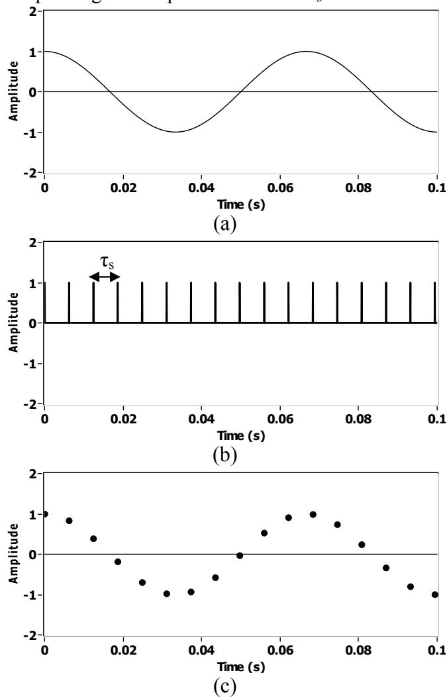

Figure 28. (a) original signal, (b) sampling waveform, (c) resulting discrete time signal

Figure 28(b) depicts the sampling wave form which may be thought of as a series of narrow periodic pulses with period *s* τ . From the analytical perspective these pulses may be thought of as delta functions. In practice these are narrow pulses produced by some type of clocking device in the circuit of interest.

Intuitively we know that in order to reconstruct a certain signal the number of samples per period of the sampled signal must be above a certain minimum value. The signals shown on Figure 29 are sampled with the same rate. The sampled points are indicated with the solid dot. It is intuitively apparent that the plot in 29 (b) is sampled frequently enough for reconstruction, while the plot on 29(a) can not be reconstructed with the sampled signal.

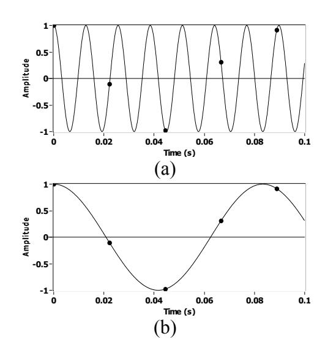

Figure 29. Sampling of a "fast" varying (a) and a "slow" varying (b) signal.

In order to be able to reconstruct the original signal from the sampled signal the following two related constraints must be satisfied.

- 1. The original signal must be band-limited (i.e. must have a finite frequency content)
- 2. The samples must be taken with a sampling frequency ( 1/ ) *s s f* = τ which is higher than twice the highest frequency ( ) *Hf* present in the original signal.

These statements form the famous *Sampling Theorem* or the *Nyquist-Shannon Sampling Theorem* . The critical frequency (2 ) *Hf* which must be exceeded by the sampling frequency is called the *Nyquist rate.* The frequency ( ) *Hf* that corresponds to one-half the Nyquist rate is also called the *Nyquist Frequency Nyquist H f* = *f* .

In terms of the Fourier transform, the original continuous time signal can be recovered from the sampled signal if the frequency spectrum of the original signal can be extracted from the frequency spectrum of the sampled signal. For a mathematical proof of this theorem see Alan Oppenheim, Signals and Systems, Prentice hall or go to the original articles.[1](#page-35-0)

 1 H. Nyquist, "Certain Topics in Telegraph Transmission theory," AIEE Transactions, 1928, p. 617 C. E. Shannon, "Communication in the presence of noise" Proceedings of IRE, January 1949, pp. 10-21

#### **Aliasing**

When the sampling frequency is less than twice the bandwidth of a signal the time continues signal can not reconstructed from the samples. As we saw in our Fourier series analysis when the pulses are spaced further apart in time the Fourier harmonics get closer together. At some point there is an overlap of the impulse spectra and reconstruction of the original signal becomes impossible. This is called aliasing.

 The mathematics of this is given in the accompanying notes. Here we present an intuitive graphical representation of the phenomenon on Figure 30. On Figure 30(a) we see the generic Fourier transform of a cosine signal of frequency ω0 .

On Figure 30(b) we present a scenario where the sampling frequency 0 4 ω*s* = ω . Note now that the frequency of interest ω0 remains within the rectangle defined by the / 2 ω*s* regions.

Figure 30(c) shows another case for which 0 5/ 2 ω*s* = ω . Here again the frequency of interest remains within the rectangle defined by the / 2 ω*s* regions.

Finally on Figure 30(d) 0 3/ 2 ω*s* = ω the frequency ω0 has moved outside the / 2 ω*s* regions. In the / 2 ω*s* regions now appears the lower frequency ω*s* −ω0 .

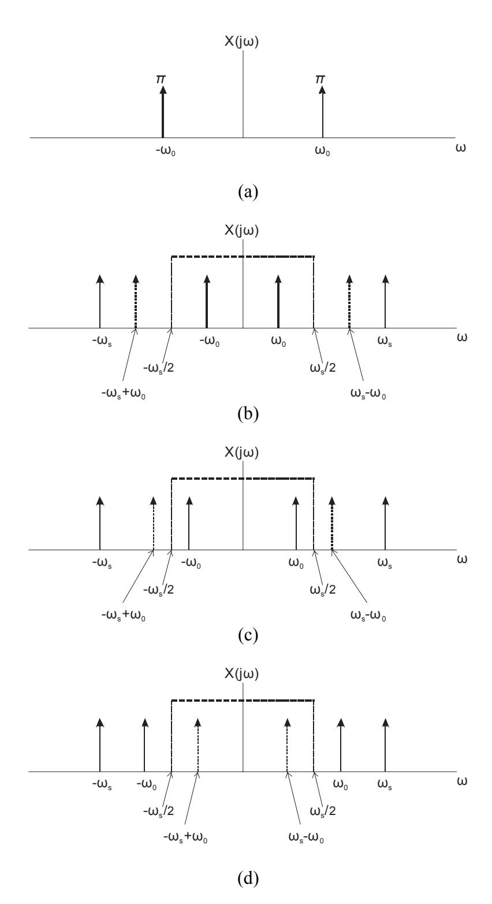

Figure 30. Oversampling and undersampling showing aliasing. (a) transform of the cosine wave. (b) sampling the cosine signal with 0 4 ω*s* = ω (No aliasing). (c) sampling the cosine signal with 0 5/ 2 ω*s* = ω (No aliasing). (d) sampling with 0 3/ 2 ω*s* = ω (Aliasing)

#### **Numbering systems: A review**

Before proceeding with the last two steps – quantization and encoding – in the process of [co](#page-38-0)nverting an analog signal to a digital signal let's review the fundamental rules that govern the representation of numbers in the various numbering systems. We primarily interested in the conversion of analog signals to digital signals.

#### **Binary Code.**

In digital electronics the signals are formed with only two voltage values, HI and LOW, or level **1** and level **0** and it is called binary digital signal.[2](#page-38-1) Therefore, the information contained in the digital signal is represented by the numbers **1** and **0**. In most digital systems the state 1 corresponds to a voltage range from 2V to 5V while the state 0 corresponds to a voltage range from a fraction of a volt to 1 volts.

Digital operations are performed by creating and operating on binary numbers. Binary numbers are comprised of the digits 0 and 1 and are based on powers of 2.

Each digit of a binary number, 0 or 1, is called a bit. Four bits together is a nibble, 8 bits is called a byte. (8, 16, 32, 64 bit arrangements are also called words) The left most bit is called the Least Significant Bit (LSB) while the rightmost bit is called the Most Significant Bit (MSB). The schematic below illustrates the general structure of a binary number and the associated labels.

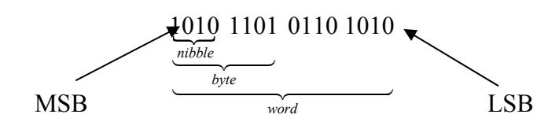

 2 In addition to binary digital systems and its associated binary logic, multivalued logic also exists but we will not consider it in our discussion.

# **Binary to Decimal Conversion.**

The conversion of a binary number to a decimal number may be accomplished by taking the successive powers of 2 and summing for the result.

For example let's consider the four bit binary number 0101. The conversion to a decimal number (base 10) is illustrated below.

N N N N 32 1 0 10 01 0 1 0x2 1x2 0x2 1x2 04 0 1 = ⇓⇓ ⇓⇓ ↓↓ ↓ ↓ ++ + ++ + 5

For this four bit binary number the range of powers of 2 goes from 0, corresponding to the LSB, to 3, corresponding to the MSB. The number 5 is shown as to indicate that it is a decimal number (power of 10). 10 5

The signal represented on Figure 31(a) has a value of 5 V at time=6τ. The binary representation of that value is 0101 and it is shown on Figure 31(b) replacing Level 4. We will see more of this later when we consider the fundamentals of the device which converts the analog signal to a digital signal.

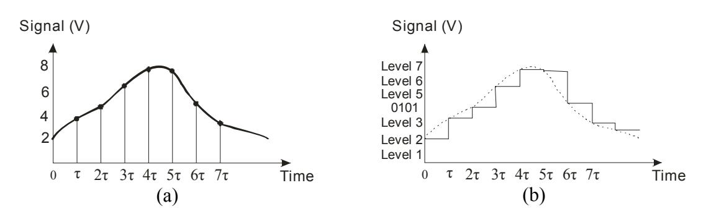

Figure 31. Digitization process.

In the next few examples we will use the subscript 2 to indicate a binary number but the subscripts will be omitted after that.

Examples:

Verify the Binary to Decimal conversion

210 210 210 210 21 21 1111 = 15 1111 0000 = 240 1111 1111 = 255 1101 1011 = 219 0001 0101 1011 = 347 1001 0101 1011 = 2395 0 0

# **Decimal to Binary Conversion.**

The conversion of a decimal number to a binary number is accomplished by successively dividing the decimal number by 2 and recording the remainder as 0 or 1. Here is an example of the conversion of decimal number 125 to binary.

125 62 1 2 62 31 0 2 31 15 1 2 15 71 2 0111 1101 7 31 2 3 11 2 1 0 1 2 ⎫ = + ⎪ ⎪ ⎪ =+ ⎪ ⎪ =+ ⎪ ⎪ ⎪ =+ ⎪ ⎬ ⇒ ⎪ =+ ⎪ ⎪ ⎪ =+ ⎪ ⎪ ⎪ =+ ⎪ ⎪ ⎪⎭ LSB MSB

Practice number conversion by verifying the conversions from decimal to binary:

| Decimal | Binary         |
|---------|----------------|
| 69      | 0100 0101      |
| 299     | 0001 0010 1011 |
| 756     | 0010 1111 0100 |

Representation of fractions and signed numbers.

A fractional number may be represented as a binary fraction by simply extending the procedure used in representing integer numbers. For example,

13.7510 = 1101.11002

The procedure is clearly visualized by considering the following mapping

32 1 0 1 2 3 4 22 2 2 2 2 2 2 8 4 2 1 0.5 0.25 0.125 0.0625 11 0 1 . 1 1 0 0 13 . 75 −− − −

Signed binary numbers may be represented by assigning the MSB to indicate the sign. A 0 is used to indicate a positive number and a 1 is used to indicate a negative number.

For example, an 8 bit signed binary number represents the decimal numbers from -128 to +127.

Two's complement is used to represent negative numbers. The use of 2's complement simplifies the operation of subtraction since the circuit is only required to perform the operation of addition.

The 2's complement of a binary number is obtained by subtracting each digit of the binary number from digit 1. This is equivalent to replacing all 1's by 0's and all 0's by 1's.

Negative numbers of 2's compliment can then be found by adding 1 to the complement of a positive number.

For example, the 2's complement of the 8 bit binary number 0000 1110 is 1111 0001 = 1010

The negative number of this 2's complement representation is 1111 0110 = -1010

The procedure is outlined in the following

10 10 0000 1010 binary number (10 ) 1111 0101 2's complement +1 1111 0110 −10

The table below shows the 2's complement representation of a few numbers. Fill in the empty spaces.

| Decimal | 2’s  | complement |
|---------|------|------------|
| 0       | 0000 | 0000       |
| -1      | 1111 | 1111       |
| -2      | 1111 | 1110       |
| -3      | 1111 | 1101       |
| -4      | 1111 | 1100       |
| -10     | 1111 | 0110       |

### **Quantization and Encoding**

#### **Analog to Digital Conversion**

The electrical signals (voltage or current) generated by a transducer is an analog signal. The amplitude of the signal corresponds to the value of the physical phenomenon that the transducer detects. The signal values are continuous in time.

The processing of the signal by a digital system requires the conversion of the analog signal to a digital signal. The analog to digital conversion is not a continuous process but it happens at discrete time intervals. Furthermore the magnitude of the digital signal at the time of conversion corresponds to the magnitude of the analog signal.

The analog to digital converter (ADC) is a device that receives as its input the analog signal along with instructions regarding the sampling rate (how often is a conversion going to be performed3 [\)](#page-43-0) and scaling parameters corresponding to the desired resolution of the system. The output of the ADC is a binary number at each sampling time.

In the preceding section on Sampling we explored the conditions on the sampling rate.

The following schematic shows the basic structure of an 8 bit ADC.

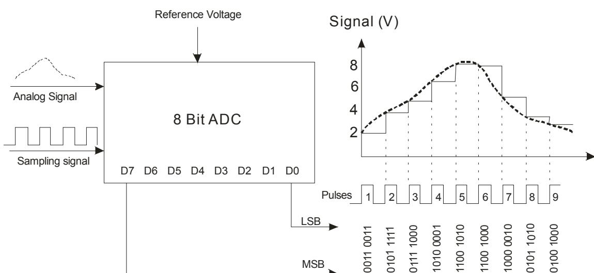

The selection of an 8 bit ADC sets the resolution of our conversion and the selection of the scale for the analog signal determines the measurement resolution for our ADC. In out example the 8 bit ADC implies 28 = 256 different levels within the maximum signal range.

 3 The sampling frequency must be larger than the highest frequency of the analog signal to be converted. In fact as stated by the "Sampling Theorem" *The sampling frequency must be at greater than 2 times the bandwidth of the input signal*.

Since we are measuring a voltage with possible values between 0V and 10V, our 8 bit ADC is not able to resolve voltages smaller than 8 mV = 39mV. If our ADC has a resolution of 16 bits, like the one that you have in your laboratory, the resolution, for the same measurement range, would be 16 mV=0.15mV.

The table below summarizes the conversion process

| Pulse | Signal Value | Level       | Binary number |
|-------|--------------|-------------|---------------|
| 1     | 2            |             |               |
|       |              | 2 256 51    |               |
|       |              | 10 =        | 0011 0011     |
| 2     | 3.7          |             |               |
|       |              | 3.7 256 95  |               |
|       |              | 10 =        | 0101 1111     |
| 3     | 4.7          | 4.7 256 120 |               |
|       |              | 10 =        | 0111 1000     |
| 4     | 6.3          | 6.3 256 161 |               |
|       |              | 10 =        | 1010 0001     |
| 5     | 7.9          | 7.9 256 202 |               |
|       |              | 10 =        | 1100 1010     |
| 6     | 7.8          | 7.8 256 200 |               |
|       |              | 10 =        | 1100 1000     |
| 7     | 5.1          | 5.1256 130  |               |
|       |              | 10 =        | 1000 0010     |
| 8     | 3.5          |             |               |
|       |              | 3.5 256 90  |               |
|       |              | 10 =        | 0101 1010     |