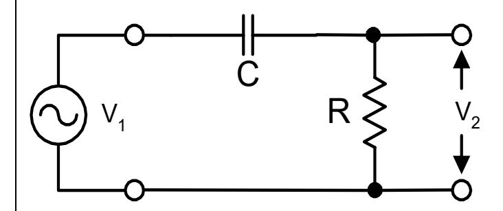
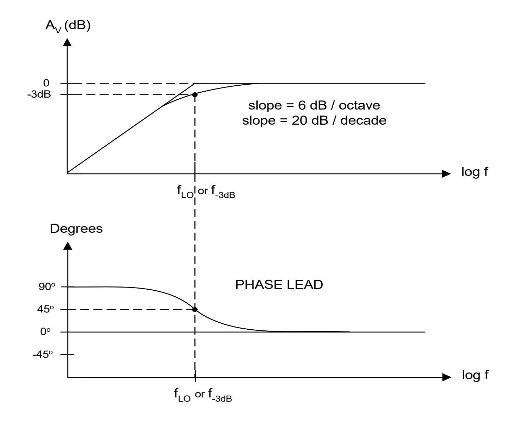

## DEPARTMENT OF ELECTRICAL ENGINEERING AND COMPUTER SCIENCE **MASSACHUSETTS INSTITUTE OF TECHNOLOGY** CAMBRIDGE, MASSACHUSETTS 02139

## High-Pass Filter Basics [Differentiator]

C 1CRs CRs 1CRj CRj Cj 1 R R V V A 1 2 v + = +ω ω = ω + ==

