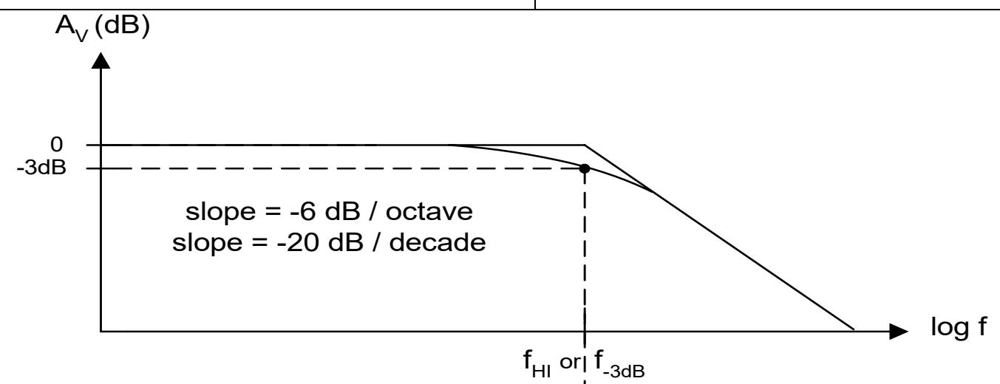
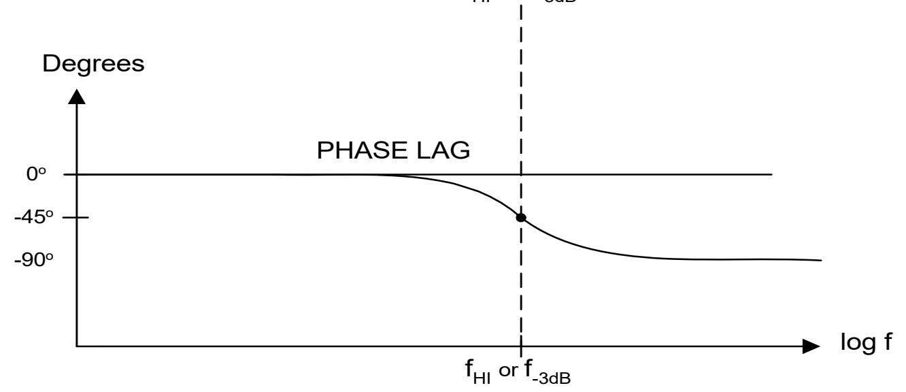

## DEPARTMENT OF ELECTRICAL ENGINEERING AND COMPUTER SCIENCE **MASSACHUSETTS INSTITUTE OF TECHNOLOGY** CAMBRIDGE, MASSACHUSETTS 02139

## Low-Pass Filter Basics [Integrator]

R

V1 V C 2

R 1sC 1 A v + =

1CRj 1 Cj 1 R Cj 1 XjR Xj V V A C C 1 2 v +ω = ω + ω = −+ − ==

Low-Pass Filter Basics 1 of 1 08/07/07 Cite as: Ron Roscoe, course materials for 6.101 Introductory Analog Electronics Laboratory, Spring 2007. MIT OpenCourseWare (http://ocw.mit.edu/), Massachusetts Institute of Technology. Downloaded on [DD Month YYYY].