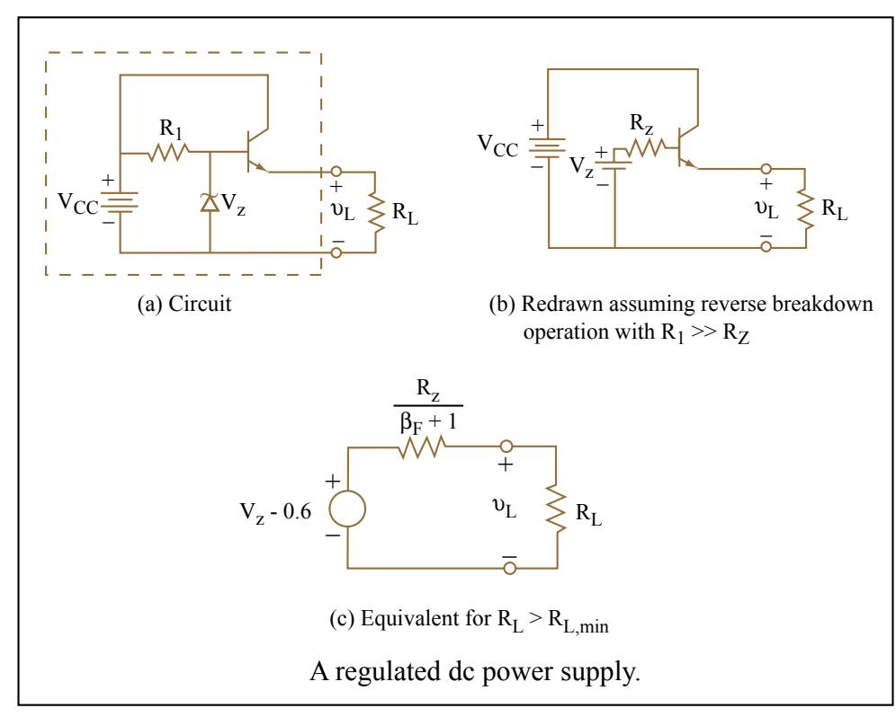

Figure 10.11a shows a variation of the emitter-follower theme, this time combined with a Zener diode operating in reverse breakdown to produce a regulated dc output voltage across a load resistor RL. Once again, the VCC supply is playing a dual role, both as collector supply and as bias supply for both the base input to the transistor and the Zener diode. If we assume that the Zener is operating in reverse breakdown, and if we assume that the Zener impedance RZ is much less than R1 (see Section 8.3.4 and Fig. 8.23), we can redraw this circuit as in Fig. 10.11b.

Drawing on our analysis of the emitter follower, we have immediately from Eq. 10.23 that

 ( ) ( ) *v* ( ) *R RR L V FL ZF L* = *Z* + ++ ⎡ ⎣ ⎢ ⎤ ⎦ ⎥ − β β 1 1 06. (10.40)

which for (βF + 1)RL >> RZ is effectively independent of RL**.** Thus the emitter follower is acting like a dc voltage source of magnitude Vz *-* 0.6. The output voltage in our approximate analysis is also independent of VCC. Thus any ripple that might be present on the VCC supply is strongly attenuated by this regulator. Emitter followers can be used in this way to obtain well-filtered dc supply voltages at relatively modest cost.

The equivalent circuit of Fig. 10.11c shows the Thevenin resistance of the regulated supply is RZ/(βF *+* 1). Derivation of this resistance from Eq. 10.40 is left as an exercise. Also left as an exercise is the derivation that the regulator works only for RL > RL min where

*R RV VV L Z F CC* min ( .) ( )( = *Z* ) − +− 1 06 β 1 (10.41)

Figure by MIT OpenCourseWare.

As a practical case, assume VCC *=* 12 V, VZ= 6.2 V, RZ *=* 10 Ω*,* R1 = 1 kΩ and βF = 50. In that case the regulated output voltage is vL = 5.6 V for RL min = 20 Ω. Equivalently, this supply can deliver regulated load current up to a maximum of vL/RL min *=* 280 mA.