RC circuits Thevenin's theorem

# 8.022 (E&M) – Lecture 9

### Topics:

### Last time

### Electromotive force:

 How to solve simple circuits: 2 *P* =*VI RI* = How does a battery work and its internal resistance Kirchhoff's first rule: at any node, sum of the currents in = sum of the currents out (conservation of charge at nodes) Kirchhoff's second rule: around any closed loops, the sum of EMF and potential drops is 0 (electrostatic field is conservative) Power dissipated by a resistor:

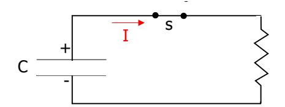

### Capacitors in circuits

 A new way of looking at problems: Until now: charges at rest or constant currents When capacitors present: currents vary over time

0Æ V0=Q0/C Consider the following situation: A capacitor C with charge Q A resistor R in series connected by switch s What happens when switch s is closed?

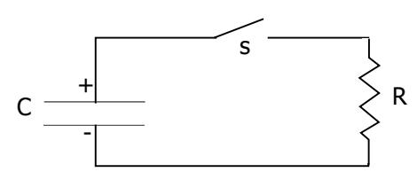

G. Sciolla – MIT 8.022 – Lecture 9

4

### Discharging capacitors: qualitative

 0 Before switch s is closed: Difference in potential between C plates: V No current circulating in the circuit (open)

 After switch s is closed: Æ VC decreases Æ I Difference in potential between capacitor plates will induce current I As I flows, charge difference on capacitor decreases decreases over time

G. Sciolla – MIT 8.022 – Lecture 9

### Discharging capacitors: quantitative

 law: Æ Q(t) Æ Vol 0 *Q IR C*− = *R* 0 *C*  + = Apply second Kirchhoff's EMF supplied by capacitor C: V=Q/C NB: this is true at any moment in time V(t) tage drop on the resistor: -IR Not useful in this form since I=I(Q) I=-dQ/dt (- sign because C is losing charge) Easy integral yields to exponential decay of the charge: *Q dQ dt* 

0 () *t Qt Qe RC* − =

G. Sciolla – MIT 8.022 – Lecture 9

6

*R*0, *C Q*  + = To solve rewrite as: *Q dQ dQ dt dt RC* = −

0 () 0 0 0 () ln () *Qt t Q t RC dQ dt Q Qt t Q Qt Qe* − =− =− = ∫ ∫ *RC RC* 

NB: τ =RC is called "decay constant" of the circuit

G. Sciolla – MIT 8.022 – Lecture 9

### How to integrate RC circuits

Integrate both sides:

R C s ------- C s + - + + + + + + + I V

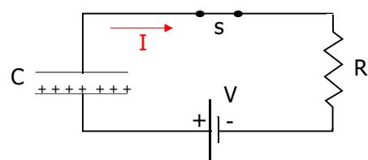

### Solution of RC circuit

- Solution: τ is called "decay constant" it Units of RC: Æ [RC]=s Æ [RC]=s Derive the current: 0 () *t Qt Qe RC* − = 0 0 () = *t t dQ d RC Q It Q e e dt RC*  ⎛ − ⎞ − =− ⎜ ⎟ ⎝ ⎠
  - G. Sciolla MIT 8.022 Lecture 9 Exponential decay of charge stored in capacitor =RC of the circu After a time RC, the charge decreased by 1/e w.r.t. original value cgs: [R]= statvolt s /esu; [C]=esu/statvolt SI: [R]=V/A; [C]=C/V; A=C/s Same exponential decay as for Q(t) *RC dt* = −

8

### Charging capacitors

 Now 3 elements in circuit: EMF, capacitor and resistor Capacitor starts uncharged

 l C reaches V What happens when switch s is closed? When s is closed, current wil suddenly flow and C will charge As C charges, E opposite to EMF builds up and slows down current I(t) stops when V

G. Sciolla – MIT 8.022 – Lecture 9

------- R C s + - + + + + + + + I V

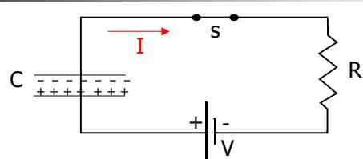

### Charging capacitor: solve the circuit

 NB: + because the capacitor is now charging! First order differential equation Solution: 0 *Q V C* − − = 0 *dQ Q R V dt C* + − = () 1 *t Qt e RC* ⎛ − ⎞ = ⎜ − ⎟ ⎝ ⎠ G. Sciolla – MIT 8.022 – Lecture 9 Solve using Kirchhoff's second law: I(t)=+dQ/dt *IR CV* 

### Details of integration

() 0 0 ' ( ) - ' - *Q t dQ dt Q t CV Q*  = = = = ∫ =−∫ ⇒ ( ) - ( ) 1 *t RC t RC t e CV C t V V Q C e*  − ⎛ − ⎞ = ⎜ − ⎟ ⎝ =− ⇒ − ⎠ = ln *Q Q t t t RC Q t CV RC* 

( ) ' ' *dQ Q R V dt C dQ dt Q*  − + − = − ⇒ To solve 0 , rewrite as: Setting: Q'= *dQ Q CV dt RC Q CV RC*  = − = −

G. Sciolla – MIT 8.022 – Lecture 9 10

Integrating between t=0 and t:

# Graphical solution

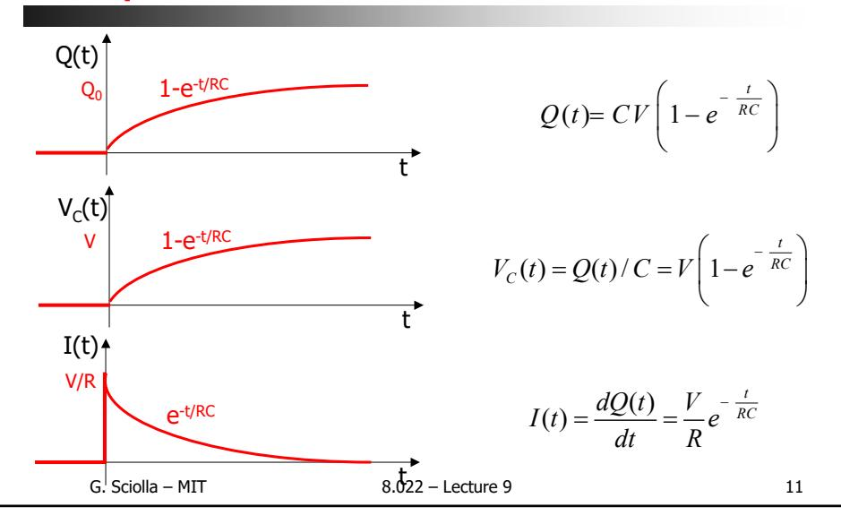

# Important comments

 At t=0: I=V/R as if C were a short circuit At t=infinity it 1 0 *t t Q RC RC V V V e R e C R*  ⎛ − ⎞ − − − = − ⎜ − ⎟ − = ⎝ ⎠ ( ) 1 ; ( ) *t t RC C V V t V e e R* ⎛ − ⎞ − = ⎜ − ⎟ = ⎝ ⎠ Solution of RC circuit: Are Kirchhoff's laws valid at any moment in time? Asymptotic behavior of the capacitor: , I=0 as if C were an open circu Conclusion: no need to solve the differential equation! Solution is an exponential with time constant RC Asymptotic behavior of C gives initial/final values for V(t) and I(t) *IR V* OK! *RC I t* 

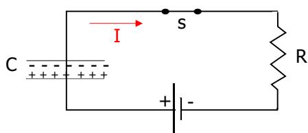

# Time constant of RC circuit (E9)

 Simple RC circuit with VEMF = 3 V C = 1.3 F R = 11.7 Ω What are VC and I? Questions: Verify that time constant is RC

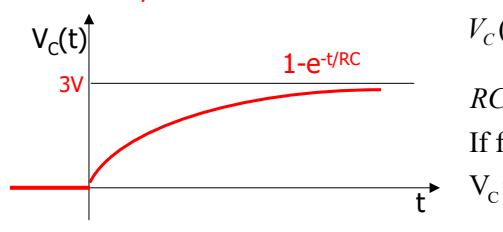

() 1 *t RC V t V e C* ⎛ − ⎞ = ⎜ − ⎟ ⎝ ⎠ *EMF* 

15.2

V ( )=1.9 V

*RC s* 

=

⇒

G. Sciolla – MIT 8.022 – Lecture 9 13

EMV

If formula is correct

=V 1-1/e when t=15.2

# Verify time constant (E8)

 VEMF = squared 5 V pulses µF 2Ω R1 = 100 Ω C and I(R1) RC circuit with Variable C initially = 0.3 Variable R initially = 400 Display on scope V Verify that time constant is RC

R1

C R2

V

A

G

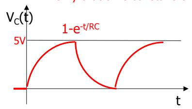

IAG(t) 10mA

e

t

G. Sciolla – MIT 8.022 – Lecture 9 14

EMF

-t/RC

# Verify time constant (E8)

 VEMF = squared 5 V pulses µF 2Ω R1 = 100 Ω RC circuit with Variable C initially = 0.3 Variable R initially = 400

#### τ Assuming =RC…

 What happens when we double C? τ1 τ0Æ V (IAG R'=2R=2(R1+R2') Æ R2': 400 Æ 900 Ω =RC'=2RC=2 ) raises (falls) twice as fast How should we change R2 to have the same effect?

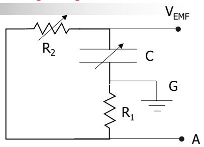

G. Sciolla – MIT 8.022 – Lecture 9 15

# More complicated RC circuits

 What if the RC circuit is more than just a series of R and C? Consider the following circuit:

 itor Solution: Calculate Q(t) on the capac Kirckhoff's laws will solve it: TEDIOUS! Use Thevenin's Theorem

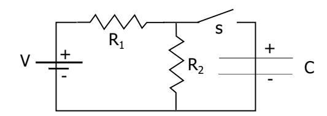

G. Sciolla – MIT 8.022 – Lecture 9 16

OC T where VOC RT=VOC/I short or RT=Req wi In our case: Any combination of resistors and EMFs with 2 terminals can be replaced with a series of a battery V and a resistor R is the open circuit voltage short where I is the current going through the shorted terminals th all the EMF shorted

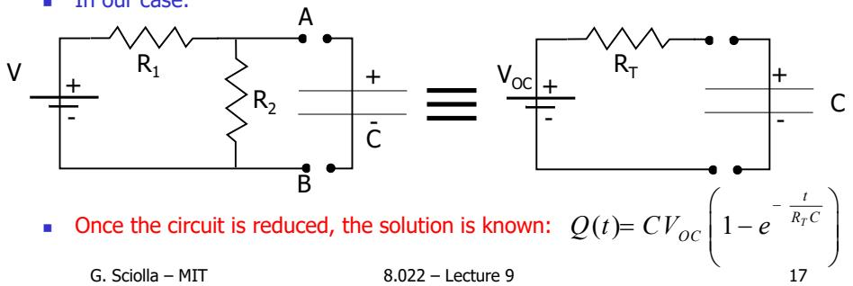

# Thevenin equivalence

### Thevenin's theorem:

# Thevenin's demonstration

#### OC Prove that V is the open circuit voltage

 Æ So VOC i Æ Æ OC ( ) 1 ) *OC t R C*  ⎛ ⎞ = ⎜ − − ⎟ ⎝ ⎠ () 1 ( ) *C t R C*  ⎛ ⎞ = ⎜ − − ⎟ ⎝ ⎠ Since is the asymptot c V for the capacitor Since for t infinity, C open circuit: V = V of the open circuit *Q t CV* exp( exp *V t V OC* 

- T=VOC/I with I l i i Æ short=VOC/RT Æ RT=VOC/I
- G. Sciolla MIT 8.022 Lecture 9 18 Prove that R short short= current through shorted terminals There is on y one current go ng through the reduced c rcuit At t=0, C behaves like a short At t=0 I short

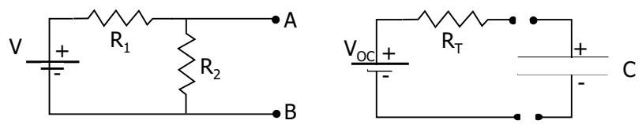

# Solve the actual problem

Calculate VOC and RT=VOC/I for our problem: short

C + - + V R1 R2 C + - + - VOC RT ≡

1 12

1 12 ( )

2 1 2 ( )

1

() 1

()

*VR e R R* 

*V It e R* 

+ −

+ −

⎛ ⎞

⇒ = ⎜ − ⎟

+ ⎜ ⎟ ⎝ ⎠

⇒ =

2 1 2 *OC V V R RR*  ⎪ = + ⎪

2

1

12 1 2

R

NB:

*OC short*  *V R* 

*V RR I R R* 

⎨ =

⎪ = = ⎩ +

G. Sciolla – MIT 8.022 – Lecture 9 19

*t R R CR R* 

*t R R CR R* 

*Qt C* 

short

Thevenin

This is R1//R2, same resistance we would get if we sh

Shorting C is makes R irrelevant in the circuit: I

orted EMF!

 and V : When we have a messy system or resistors and EMFs, we can reduce it to a simple R+EMF in series just measuring Ishort open

### Careful:

 linear relati Thevenin works only when the elements in the box follow Ohm's law, i.e. on between V and I

VOC ≡ + - RT Any unknown combination of Rs and EMFs

G. Sciolla – MIT 8.022 – Lecture 9 20

# Thoughts on Thevenin

### The importance of Thevenin:

# Oscillating circuit (E13)

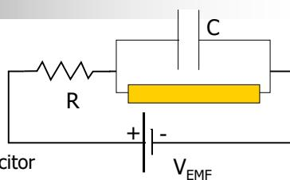

 RC circuit with: VEMF = 1 kV C = 0.1 µF R R = 2.5 MΩ + - Fluorescent light in parallel with capacitor VEMF (RFL<<< R when current flows; ~infinite otherwise) Why is light flashing at ν~ 1Hz? Initially the capacitor will start charging (no current through the lamp) When VC>certain value ~ 1kV Æ current flows through fluorescent light discharging the capacitor very quickly The process will start again ν~1/τ=1/RC=4 Hz

G. Sciolla – MIT 8.022 – Lecture 9 21

# Oscillating circuit (E13)

 VEMF = 1 kV C = 0.1 µF R = 2.5 MΩ

Fluorescent light in parallel with capacitor

(RFL<<<

 Charging: τcharge=RC Discharge: FL T=R//RFL~RFL τ =RT FLC<< NB: charging and discharging time constants are very different! fluorescent light is ~ open circuit: fluorescent light has a (very small) resistance R Thevenin: R discharge C~R

R

V

C

+ -

G. Sciolla – MIT 8.022 – Lecture 9 22

RC circuit with:

R when current flows; ~infinite otherwise)

EMF

# Norton's theorem

parallel of a current generator IN T where Any combination of resistors and EMFs with 2 terminals can be replaced with a and a resistor R

 RT i IN = VOC/RT is the equivalent resistance of the circuit w th all the EMF shorted and all the current sources open (same as Thevenin!)

C

+ -

+ -

V R1

R2 C

+

- ≡ I RT N

12

1 2

1 2 2 1 2 1 2 1

//

/( ) //

*OC N* 

*RR R R R* 

*RR* 

*V VR V I R RR R* 

⎧ = = ⎪

⎪ + ⎨ + ⎪ = = = ⎪⎩

G. Sciolla – MIT 8.022 – Lecture 9 23

*R R* 

# Summary and Outlook

 Today: RC circuits Thevenin's theorem Next time: Magnetism Remember: don't miss office hours Bring your problems and let's find solutions together!