**NONRESIDENT TRAINING COURSE**

**SEPTEMBER 1998**

# **Navy Electricity and Electronics Training Series**

**Module 16—Introduction to Test Equipment**

**NAVEDTRA 14188**

**Although the words "he," "him," and "his" are used sparingly in this course to enhance communication, they are not intended to be gender driven or to affront or discriminate against anyone.**

### **PREFACE**

By enrolling in this self-study course, you have demonstrated a desire to improve yourself and the Navy. Remember, however, this self-study course is only one part of the total Navy training program. Practical experience, schools, selected reading, and your desire to succeed are also necessary to successfully round out a fully meaningful training program.

**COURSE OVERVIEW**: To introduce the student to the subject of Test Equipment who needs such a background in accomplishing daily work and/or in preparing for further study.

**THE COURSE**: This self-study course is organized into subject matter areas, each containing learning objectives to help you determine what you should learn along with text and illustrations to help you understand the information. The subject matter reflects day-to-day requirements and experiences of personnel in the rating or skill area. It also reflects guidance provided by Enlisted Community Managers (ECMs) and other senior personnel, technical references, instructions, etc., and either the occupational or naval standards, which are listed in the *Manual of Navy Enlisted Manpower Personnel Classifications and Occupational Standards*, NAVPERS 18068.

**THE QUESTIONS**: The questions that appear in this course are designed to help you understand the material in the text.

**VALUE**: In completing this course, you will improve your military and professional knowledge. Importantly, it can also help you study for the Navy-wide advancement in rate examination. If you are studying and discover a reference in the text to another publication for further information, look it up.

> *1998 Edition Prepared by OTMCS Richard Hall*

Published by NAVAL EDUCATION AND TRAINING PROFESSIONAL DEVELOPMENT AND TECHNOLOGY CENTER

> **NAVSUP Logistics Tracking Number 0504-LP-026-8410**

# **Sailor's Creed**

**"**I am a United States Sailor.

I will support and defend the Constitution of the United States of America and I will obey the orders of those appointed over me.

I represent the fighting spirit of the Navy and those who have gone before me to defend freedom and democracy around the world.

I proudly serve my country's Navy combat team with honor, courage and commitment.

I am committed to excellence and the fair treatment of all."

## **TABLE OF CONTENTS**

| CHAPTER | PAGE                                                                                                                            |
|---------|---------------------------------------------------------------------------------------------------------------------------------|
| 1.      | Test Equipment Administration and Use.................................................................. 1-1                     |
| 2.      | Miscellaneous Measurements................................................................................... 2-1               |
| 3.      | Basic Meters 3-1                                                                                                                |
| 4.      | Common Test Equipment......................................................................................... 4-1              |
| 5.      | Special-Application Test Equipment........................................................................ 5-1                  |
| 6.      | The Oscilloscope and Spectrum Analyzer................................................................ 6-1                      |
| I.      | Glossary.................................................................................................................. AI-1 |
| II.     | References Used to Develop This TRAMAN AII-1                                                                                    |
| INDEX   | INDEX-1                                                                                                                         |

# **CREDITS**

 The figures listed below and included in this edition of NEETS, Module 16, *Introduction to Test Equipment*, were provided by Huntron Instruments, Inc. Permission to use these illustrations is gratefully acknowledged. Permission to reproduce these illustrations must be obtained from the source.

SOURCE FIGURE Huntron Instruments, Inc. 5-22, 5-23, 5-24, 5-25, 5-26, 5-27, 5-28 A&B, 5-29, 5-30, 5-31, 5-32, 5-33, 5-34, 5-35, 5-36, 5-37, 5-38

# **NAVY ELECTRICITY AND ELECTRONICS TRAINING SERIES**

The Navy Electricity and Electronics Training Series (NEETS) was developed for use by personnel in many electrical- and electronic-related Navy ratings. Written by, and with the advice of, senior technicians in these ratings, this series provides beginners with fundamental electrical and electronic concepts through self-study. The presentation of this series is not oriented to any specific rating structure, but is divided into modules containing related information organized into traditional paths of instruction.

The series is designed to give small amounts of information that can be easily digested before advancing further into the more complex material. For a student just becoming acquainted with electricity or electronics, it is highly recommended that the modules be studied in their suggested sequence. While there is a listing of NEETS by module title, the following brief descriptions give a quick overview of how the individual modules flow together.

**Module 1,** *Introduction to Matter, Energy, and Direct Current*, introduces the course with a short history of electricity and electronics and proceeds into the characteristics of matter, energy, and direct current (dc). It also describes some of the general safety precautions and first-aid procedures that should be common knowledge for a person working in the field of electricity. Related safety hints are located throughout the rest of the series, as well.

**Module 2,** *Introduction to Alternating Current and Transformers,* is an introduction to alternating current (ac) and transformers, including basic ac theory and fundamentals of electromagnetism, inductance, capacitance, impedance, and transformers.

**Module 3,** *Introduction to Circuit Protection, Control, and Measurement,* encompasses circuit breakers, fuses, and current limiters used in circuit protection, as well as the theory and use of meters as electrical measuring devices.

**Module 4,** *Introduction to Electrical Conductors, Wiring Techniques, and Schematic Reading,* presents conductor usage, insulation used as wire covering, splicing, termination of wiring, soldering, and reading electrical wiring diagrams.

**Module 5,** *Introduction to Generators and Motors,* is an introduction to generators and motors, and covers the uses of ac and dc generators and motors in the conversion of electrical and mechanical energies.

**Module 6,** *Introduction to Electronic Emission, Tubes, and Power Supplies,* ties the first five modules together in an introduction to vacuum tubes and vacuum-tube power supplies.

**Module 7**, *Introduction to Solid-State Devices and Power Supplies,* is similar to module 6, but it is in reference to solid-state devices.

**Module 8,** *Introduction to Amplifiers,* covers amplifiers.

**Module 9,** *Introduction to Wave-Generation and Wave-Shaping Circuits,* discusses wave generation and wave-shaping circuits.

**Module 10,** *Introduction to Wave Propagation, Transmission Lines, and Antennas,* presents the characteristics of wave propagation, transmission lines, and antennas.

**Module 11,** *Microwave Principles,* explains microwave oscillators, amplifiers, and waveguides.

**Module 12,** *Modulation Principles,* discusses the principles of modulation.

**Module 13,** *Introduction to Number Systems and Logic Circuits,* presents the fundamental concepts of number systems, Boolean algebra, and logic circuits, all of which pertain to digital computers.

**Module 14,** *Introduction to Microelectronics,* covers microelectronics technology and miniature and microminiature circuit repair.

**Module 15,** *Principles of Synchros, Servos, and Gyros,* provides the basic principles, operations, functions, and applications of synchro, servo, and gyro mechanisms.

**Module 16,** *Introduction to Test Equipment,* is an introduction to some of the more commonly used test equipments and their applications.

**Module 17,** *Radio-Frequency Communications Principles,* presents the fundamentals of a radiofrequency communications system.

**Module 18,** *Radar Principles,* covers the fundamentals of a radar system.

**Module 19,** *The Technician's Handbook,* is a handy reference of commonly used general information, such as electrical and electronic formulas, color coding, and naval supply system data.

**Module 20,** *Master Glossary,* is the glossary of terms for the series.

**Module 21,** *Test Methods and Practices,* describes basic test methods and practices.

**Module 22,** *Introduction to Digital Computers,* is an introduction to digital computers.

**Module 23,** *Magnetic Recording,* is an introduction to the use and maintenance of magnetic recorders and the concepts of recording on magnetic tape and disks.

**Module 24,** *Introduction to Fiber Optics,* is an introduction to fiber optics.

Embedded questions are inserted throughout each module, except for modules 19 and 20, which are reference books. If you have any difficulty in answering any of the questions, restudy the applicable section.

Although an attempt has been made to use simple language, various technical words and phrases have necessarily been included. Specific terms are defined in Module 20, *Master Glossary*.

Considerable emphasis has been placed on illustrations to provide a maximum amount of information. In some instances, a knowledge of basic algebra may be required.

Assignments are provided for each module, with the exceptions of Module 19, *The Technician's Handbook*; and Module 20, *Master Glossary*. Course descriptions and ordering information are in NAVEDTRA 12061, *Catalog of Nonresident Training Courses*.

Throughout the text of this course and while using technical manuals associated with the equipment you will be working on, you will find the below notations at the end of some paragraphs. The notations are used to emphasize that safety hazards exist and care must be taken or observed.

### **WARNING**

AN OPERATING PROCEDURE, PRACTICE, OR CONDITION, ETC., WHICH MAY RESULT IN INJURY OR DEATH IF NOT CAREFULLY OBSERVED OR FOLLOWED.

### **CAUTION**

AN OPERATING PROCEDURE, PRACTICE, OR CONDITION, ETC., WHICH MAY RESULT IN DAMAGE TO EQUIPMENT IF NOT CAREFULLY OBSERVED OR FOLLOWED.

### **NOTE**

An operating procedure, practice, or condition, etc., which is essential to emphasize.

## **INSTRUCTIONS FOR TAKING THE COURSE**

### **ASSIGNMENTS**

The text pages that you are to study are listed at the beginning of each assignment. Study these pages carefully before attempting to answer the questions. Pay close attention to tables and illustrations and read the learning objectives. The learning objectives state what you should be able to do after studying the material. Answering the questions correctly helps you accomplish the objectives.

### **SELECTING YOUR ANSWERS**

Read each question carefully, then select the BEST answer. You may refer freely to the text. The answers must be the result of your own work and decisions. You are prohibited from referring to or copying the answers of others and from giving answers to anyone else taking the course.

### **SUBMITTING YOUR ASSIGNMENTS**

To have your assignments graded, you must be enrolled in the course with the Nonresident Training Course Administration Branch at the Naval Education and Training Professional Development and Technology Center (NETPDTC). Following enrollment, there are two ways of having your assignments graded: (1) use the Internet to submit your assignments as you complete them, or (2) send all the assignments at one time by mail to NETPDTC.

**Grading on the Internet:** Advantages to Internet grading are:

- you may submit your answers as soon as you complete an assignment, and
- you get your results faster; usually by the next working day (approximately 24 hours).

In addition to receiving grade results for each assignment, you will receive course completion confirmation once you have completed all the assignments. To submit your assignment answers via the Internet, go to:

### **http://courses.cnet.navy.mil**

**Grading by Mail:** When you submit answer sheets by mail, send all of your assignments at one time. Do NOT submit individual answer sheets for grading. Mail all of your assignments in an envelope, which you either provide yourself or obtain from your nearest Educational Services Officer (ESO). Submit answer sheets to:

> COMMANDING OFFICER NETPDTC N331 6490 SAUFLEY FIELD ROAD PENSACOLA FL 32559-5000

**Answer Sheets:** All courses include one "scannable" answer sheet for each assignment. These answer sheets are preprinted with your SSN, name, assignment number, and course number. Explanations for completing the answer sheets are on the answer sheet.

**Do not use answer sheet reproductions:** Use only the original answer sheets that we provide—reproductions will not work with our scanning equipment and cannot be processed.

Follow the instructions for marking your answers on the answer sheet. Be sure that blocks 1, 2, and 3 are filled in correctly. This information is necessary for your course to be properly processed and for you to receive credit for your work.

### **COMPLETION TIME**

Courses must be completed within 12 months from the date of enrollment. This includes time required to resubmit failed assignments.

### **PASS/FAIL ASSIGNMENT PROCEDURES**

If your overall course score is 3.2 or higher, you will pass the course and will not be required to resubmit assignments. Once your assignments have been graded you will receive course completion confirmation.

If you receive less than a 3.2 on any assignment and your overall course score is below 3.2, you will be given the opportunity to resubmit failed assignments. **You may resubmit failed assignments only once.** Internet students will receive notification when they have failed an assignment--they may then resubmit failed assignments on the web site. Internet students may view and print results for failed assignments from the web site. Students who submit by mail will receive a failing result letter and a new answer sheet for resubmission of each failed assignment.

### **COMPLETION CONFIRMATION**

After successfully completing this course, you will receive a letter of completion.

### **ERRATA**

Errata are used to correct minor errors or delete obsolete information in a course. Errata may also be used to provide instructions to the student. If a course has an errata, it will be included as the first page(s) after the front cover. Errata for all courses can be accessed and viewed/downloaded at:

### **http://www.advancement.cnet.navy.mil**

### **STUDENT FEEDBACK QUESTIONS**

We value your suggestions, questions, and criticisms on our courses. If you would like to communicate with us regarding this course, we encourage you, if possible, to use e-mail. If you write or fax, please use a copy of the Student Comment form that follows this page.

### **For subject matter questions:**

E-mail: n315.products@cnet.navy.mil Phone: Comm: (850) 452-1001, ext. 1728 DSN: 922-1001, ext. 1728 FAX: (850) 452-1370 (Do not fax answer sheets.) Address: COMMANDING OFFICER NETPDTC N315 6490 SAUFLEY FIELD ROAD PENSACOLA FL 32509-5237

### **For enrollment, shipping, grading, or completion letter questions**

E-mail: fleetservices@cnet.navy.mil Phone: Toll Free: 877-264-8583 Comm: (850) 452-1511/1181/1859 DSN: 922-1511/1181/1859 FAX: (850) 452-1370 (Do not fax answer sheets.) Address: COMMANDING OFFICER NETPDTC N331 6490 SAUFLEY FIELD ROAD PENSACOLA FL 32559-5000

### **NAVAL RESERVE RETIREMENT CREDIT**

If you are a member of the Naval Reserve, you will receive retirement points if you are authorized to receive them under current directives governing retirement of Naval Reserve personnel. For Naval Reserve retirement, this course is evaluated at 5 points. (Refer to *Administrative Procedures for Naval Reservists on Inactive Duty,* BUPERSINST 1001.39, for more information about retirement points.)

### THIS PAGE LEFT BLANK INTENTIONALLY.

### **Student Comments**

**Course Title:** *NEETS Module 16 Introduction to Test Equipment*

**NAVEDTRA:** 14188 **Date**:

### **We need some information about you**:

Rate/Rank and Name: SSN: Command/Unit

Street Address: City: State/FPO: Zip

**Your comments, suggestions, etc**.:

**Privacy Act Statement:** Under authority of Title 5, USC 301, information regarding your military status is requested in processing your comments and in preparing a reply. This information will not be divulged without written authorization to anyone other than those within DOD for official use in determining performance.

NETPDTC 1550/41 (Rev 4-00)

# **CHAPTER 1 TEST EQUIPMENT ADMINISTRATION AND USE**

### **LEARNING OBJECTIVES**

Learning objectives are stated at the beginning of each chapter. These learning objectives serve as a preview of the information you are expected to learn in the chapter. The comprehensive check questions included are based on the objectives. By successfully completing the NRTC, you indicate that you have met the objectives and have learned the information.

Upon completing this chapter, you should be able to:

- 1. Describe the Ship Configuration and Logistic Support Information System (SCLSIS).
- 2. State the differences between calibration and repair.
- 3. Explain the various calibration status labels used by the Navy.
- 4. List the procedures for obtaining repairs to test equipment.
- 5. Describe the Metrology Automated System for Uniform Recall and Reporting (MEASURE) System and the purpose of the Metrology Equipment Recall and Reporting (METER) card and recall schedule.
- 6. Describe major test equipment references available to you.
- 7. Explain the purposes and benefits of testing.
- 8. State the safety precautions involved in working with test equipment.
- 9. List three precautions you should observe to avoid damaging electric measuring instruments.
- 10. State the correct procedures for using a safety shorting probe.
- 11. Describe resistance, voltage, and current measurements in terms of purposes, methods, and instruments used.
- 12. Describe how capacitance and inductance are measured.
- 13. Explain the operation of bridges in the measurement of unknown resistances, capacitances, and inductances.

### **INTRODUCTION**

One purpose of this chapter is to acquaint you with the practical use of test equipment. The presence of adequate test equipment in your shop is not in itself a "cure-all" for making repairs to complex electronic equipment. You must know how to best use the equipment available. First, however, you must understand the basis of electronic theory and be able to apply it to the system under repair.

Another purpose of this chapter is to introduce you to calibration and repair procedures, and basic voltage and current measurements. You will also learn how ac bridges are used for precise measurements of resistance, capacitance, and inductance.

Much of the theory of operation and practical applications of the basic types of test instruments used in electrical and electronic circuits are found in the instruction books and technical manuals that accompany various equipments. You should read and understand these books before you attempt to use any test instrument. You should also know the established safety precautions to ensure your safety and safe equipment operating procedures to protect equipment from damage.

### **TEST EQUIPMENT IDENTIFICATION**

One of the first things you must learn as a maintenance technician is how to identify the various electronic equipment and components by their appropriate nomenclatures. You will find that several methods are used to identify test equipment used; this may be somewhat confusing to you at first. For example, a Tektronix Model 541A oscilloscope can also be identified as a CBTV-541A. The Joint Electronics Type Designation System (JETDS) is used by all branches of the military to identify equipment by a system of standardized nomenclatures.

*Q-1. What system is currently used by all branches of the military to identify test equipment?*

### **ELECTRONIC TEST EQUIPMENT CLASSIFICATION**

The Electronic Test Equipment Classification Board was established in 1973 to control the increased use of undesirable electronic test equipment (ETE) in fleet and shore activities. The board classifies electronic test equipments as GENERAL PURPOSE (GPETE) or SPECIAL PURPOSE (SPETE) and assigns responsibility for their management. Items classified as general purpose are managed by the Space and Warfare Systems Command (SPAWARSYSCOM). Items classified as special purpose are managed by the individual systems command that generates the requirement.

GPETE is test equipment that has the capability, without modification, to generate, modify, or measure a range of parameters of electronic functions required to test two or more equipments or systems of basically different design.

Special-purpose electronic test equipment (SPETE) is specifically designed to generate, modify, or measure a range of parameters of electronic functions of a specific or peculiar nature required to test a single system or equipment. These special test equipments are procured by the systems command that has the responsibility for the system/equipment requiring the SPETE for maintenance.

*Q-2. Name the two classes of test equipment.*

*Q-3. What test equipment is designed to generate, modify, or measure a range of parameters of electronic functions of a specific nature required to test a single system or equipment?*

Until the ETE classification board was established, the uncontrolled increase in use of nonstandard GPETE had resulted in loss of inventory control and increased support costs. NESEA has the responsibility for evaluating requests to purchase nonstandard GPETE and for recommending its approval or disapproval to NAVSEA. NAVSEA will then forward its final decision to the originating command for such requests.

### **SHIP CONFIGURATION AND LOGISTIC INFORMATION SYSTEM (SCLSIS) PROGRAM**

The Navy must maintain, update, and calibrate thousands of pieces of equipment. To do this, the SHIP CONFIGURATION AND LOGISTIC SUPPORT INFORMATION SYSTEM (SCLSIS) program was designed to keep track of all installed and portable equipment in the fleet. SCLSIS is used to keep up with the existence, location, and changes made to equipment. The SCLSIS program seeks to improve the quality of equipment reporting, provide information needed by other Navy management systems, and reduce record keeping. It is also designed to assist Navy supply systems that furnish spares, documentation, and training necessary to support installed and portable equipment.

Therefore, the inventory of assigned test equipment on board ship is directly related to SCLSIS records. Properly maintained SCLSIS records also show the complete inventory of test equipment on board by quantity, serial number, and location. The SCLSIS program has two basic elements: (1) VALIDATION, to establish a baseline data inventory, and (2) INVENTORY UPDATING, to correct errors or omissions and to document configuration changes.

*Q-4. Name the two basic elements of the SCLSIS program.*

### **CALIBRATION AND REPAIR PROCEDURES**

The difference between the terms *calibration* and *repair* needs to be addressed before we proceed further. Calibration is little more than checking, adjusting, or systematically aligning a test instrument to a known standard. To do this, you must ensure that the equipment you send to the calibration lab is in working order.

The calibration lab is where actual repair work becomes important. Obvious problems, such as open power cords, burned components, broken meters, and missing hardware, should be repaired or replaced before sending equipment to the calibration lab. Most calibration labs with which you will deal will be part of an intermediate maintenance activity (IMA) on board a tender.

### **CALIBRATION STATUS**

You can determine the calibration status of any test equipment by checking the calibration label or tag located on the equipment. These calibration labels or tags advise you as to whether the item is usable and within its calibration interval. Tags and labels to be used in the METROLOGY CALIBRATION (METCAL) coordination program are listed in the following paragraphs. No other calibration labels or tags are authorized to be placed on test equipment.

### **Calibrated Label**

The CALIBRATED label, shown in view A of figure 1-1, has black lettering and a white background and comes in two sizes. It is the most commonly used label in the METCAL program. This label indicates that the instrument to which it is attached is within its applicable tolerance on all parameters. If there are any qualifying conditions for use of the instrument, one of the other labels described in the next paragraphs should be used.

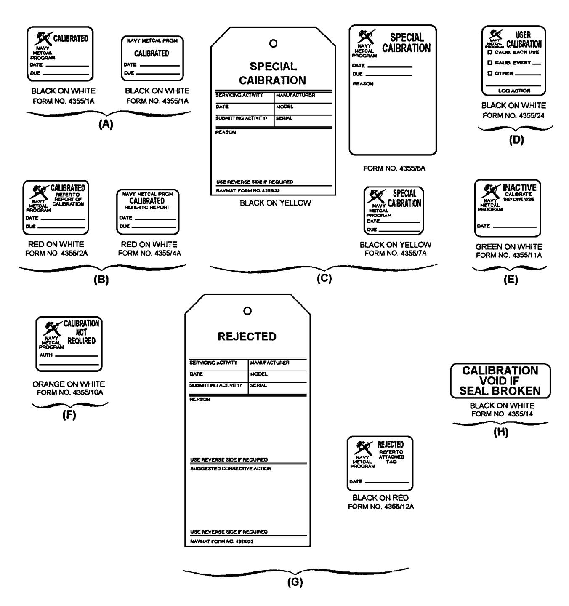

**Figure 1-1.—Calibration labels and tags.**

### **Calibrated—Refer to Report Label**

The CALIBRATED—REFER TO REPORT label, shown in view B of figure 1-1, has red lettering and a white back ground. It comes in two sizes and is used when you must know the actual measurement values to use the instrument.

*Q-5. What calibration label is used when actual measurement values must be known to use the test equipment?*

### **Special Calibration Labels**

Two SPECIAL CALIBRATION labels are shown in view C of figure 1-1 that have black lettering and a yellow background; the size and content of the labels are different. A SPECIAL CALIBRATION tag (figure 1-1, view C) is used with the smaller of the two labels. These labels or tag are used when some unusual or special condition in the calibration should be drawn to your attention.

Such special conditions may be deviations from usual calibration tolerances, multiple calibration intervals, or a requirement for in-place calibration. The special condition that resulted in the SPECIAL CALIBRATION label should be described on the large label when sufficient space is available on the instrument or on the tag when the small label is used. Brief descriptions of special conditions are provided in the following paragraphs.

### *Q-6. An instrument that must be calibrated in place requires what type of calibration label?*

In cases where you do not require full instrument capability, the calibration can be performed with reduced tolerances or cover less than all ranges and parameters. This approach is often used when the instrument does not meet full calibration tolerances on certain ranges or parameters, but can still meet user requirements. On the other hand, the special calibration may be for higher accuracy than usual on a short-term basis upon your specific request.

MULTIPLE CALIBRATION INTERVALS.—Some instruments have components that require calibration less frequently than the rest of the instrument. For example, the attenuator in a signal generator may require calibration every 12 months, whereas the rest of the instrument parameters should be calibrated every 4 months. Since the attenuator calibration is time consuming and may require unavailable standards, use of the multiple-interval approach can save considerable time (man-hours) as well as permit the more frequent calibration to be performed at a lower level laboratory.

When a specific instrument has been designed for multiple calibration intervals, such information is provided in the applicable calibration procedure. The SPECIAL CALIBRATION label or tag is annotated with the words MULTIPLE INTERVAL, and the type of calibration performed is indicated; for example, partial 1 of 2, 2 of 2, complete calibration, and so forth. The calibration due date reflects the due date of the next partial or complete calibration.

CALIBRATION IN-PLACE.—Some instruments should be calibrated in-place. Annotation on the SPECIAL CALIBRATION label or tag will alert both you and the calibrator that the instrument should not be removed, but should be calibrated in-place.

### **User Calibration Label**

Some test and measuring equipment (T&ME) should be calibrated by you instead of your referring the instrument to a calibration facility. For example, some instruments, such as hardness testers and densitometers, are provided with their own standards and should be calibrated each time used, or at least very frequently. Some instruments, such as oscillographic recorders, may require calibration before, during, and after each use.

Other automatic test equipment (ATE) have self-calibration tests that should be performed each time used or each day of use. Still other instruments are calibrated as part of checkout procedures performed daily or weekly and recorded in maintenance logs. Whenever recognized, the requirement for calibration

by the user and the calibration interval (each use—daily, weekly, every 100 hours—each overhaul, and so forth) is indicated in the Metrology Requirements List (METRL).

The USER CALIBRATION label, shown in view D of figure 1-1, has black lettering and a white background and is affixed when the calibration is performed by the user; however, this label is not replaced at each calibration. When the label is first attached to the instrument, it is annotated as to the appropriate calibration interval. Records of calibrations performed, when other than each time used, should be by normal maintenance practices; that is, in the maintenance log, on maintenance action forms, and so forth.

### **Inactive—Calibrate Before Use Label**

In the event that an individual instrument due for recalibration will not be used for some time in the future, you may indefinitely postpone the recalibration by affixing an inactive label to the instrument. As shown in view E of figure 1-1, the INACTIVE—CALIBRATE BEFORE USE label has green lettering and a white background. The INACTIVE label remains on the instrument until it is recalibrated. The instrument is not to be used while bearing this label.

### **Calibration Not Required Label**

Test equipment standards and T&ME not requiring calibration are shown as CALIBRATION NOT REQUIRED. This label, shown in view F of figure 1-1, has orange letters and a white background. It is attached to and should remain on the instrument indefinitely unless its calibration requirements change. If the instrument is not listed in METRL, you should use the following criteria when placing instruments in the CALIBRATION NOT REQUIRED category:

- Instrument does not make quantitative measurements nor provide quantified outputs.
- The device is "fail-safe"; that is, operation beyond specified tolerances will be apparent to the user.
- All measurement/stimulus circuits are monitored during use by calibrated instruments or are dependent on external known or calibrated sources for performance within required limits. (When determining that an instrument falls into the CALIBRATION NOT REQUIRED category, you should annotate the label as to the authority for the decision, such as METRL, technical manual, letter or message from higher authority.)

### **Rejected—refer To Attached Tag Label**

In the event that an instrument fails to meet the acceptance criteria during calibration and cannot be adequately repaired, a REJECTED—REFER TO ATTACHED TAG label is placed on the instrument and all other servicing labels removed. This label, as shown in view G of figure 1-1, has black letters and a red background. In addition to the REJECTED label, a REJECTED tag, giving the reason for rejection and other information as required, is attached to the instrument. Both the label and tag remain on the instrument until it is repaired and recalibrated. The instrument is not to be used while bearing a REJECTED label.

### **Calibration Void If Seal Broken Label**

The CALIBRATION VOID IF SEAL BROKEN label, shown in view H of figure 1-1, has black letters and a white background. It is placed over readily accessible (usually exterior) adjustments to prevent tampering by the user when such tampering could affect the calibration. The label should not be used to cover adjustments or controls that are part of the normal use and operation of the instrument. This label may also be used to prevent removal and/or interchange of plug-ins, modules, subassemblies, and so forth, when such removal or interchange would affect the calibration.

### **REPAIR PROCEDURES**

If you are unable to replace a known failed component with onboard spares, you can often locate the replacement component from other supply sources. The replacement component can then be delivered, along with the inoperative equipment, to the IMA. So by sending the repair part along with the equipment, you can reduce repair time considerably. This is particularly true when your unit is getting under way and no time is available for you to complete the repair before calibration. Most operational commands have a higher supply priority for purchase of repair parts than the IMA can use.

### **"No Reject" Policy**

IMAs have a "no reject" policy on test equipment to provide operational test equipment in a more timely manner. The "no reject" policy says, in effect, that test equipment submitted to the IMA for calibration, which is later found to require repair, will be repaired by the repair department of the IMA. Before this policy, any equipment found inoperative by the calibration lab was marked REJECTED, the reasons stated, and the equipment returned uncalibrated to the ship for repairs. The "no reject" policy does not relieve you of your responsibility to ensure your equipment is in working order prior to submitting it for calibration. Its purpose is to streamline the procedure and cut down delays in returning your equipment to you calibrated and ready to use.

### **Responsibility for Repair and Maintenance of Test Equipment**

Generally, the responsibility for repair and maintenance of test equipment is placed on maintenance personnel. In some cases, however, maintenance personnel are not authorized to make repairs. Then the test instrument must be sent to a shore repair/calibration facility.

### *Q-7. Responsibility for repair and maintenance of test equipment generally rests with what group of personnel?*

When test equipment is sent for calibration and repair, all accessories, such as probes, adapters, and calibration sheets, should be included. Only in emergencies or special situations should partial repair or calibration be attempted on test equipment designated as nonrepairable. Such emergency repairs should be noted on a tag attached to the unit and an entry made on the MEASURE card (discussed shortly). The equipment should then be sent at the earliest opportunity to an authorized facility so that permanent repairs can be made and the unit calibrated.

### **STOWAGE AND HANDLING OF TEST EQUIPMENT**

Most electronic test equipment is precision equipment. Such equipment must be handled with care to properly perform its designed functions. Rough handling, excessive heat, moisture, and dust all affect the useful life of the equipment. Bumping or dropping a test instrument may ruin the calibration of a meter, cause short circuits, or damage electronic elements inside the case. Sharp bends, creases, or dents in coaxial test cables can alter the expected attenuating effect and cause false meter readings or measurements. Forced air cooling, dust filters, and heaters are used in many pieces of equipment. This test equipment requires clean air filters for proper ventilation and a warm-up period that permits units in the equipment to maintain calibrated standards.

Electronic test equipment should be stowed in a dry location with the dust cover (if provided) in place. Dust covers for spare plug-in units should be constructed for such stowage. For ease in performing maintenance, the test equipment should be stowed at a location convenient to equipment spaces. If possible, related test equipment should be mounted in the equipment spaces. This reduces the problem of finding adequate stowage space elsewhere.

In stowage spaces, individual pieces of test equipment should be held in place by stretch seat-belttype straps. If bars are used to hold equipment on shelves, meters and control knobs should be protected by blocking the equipment to prevent it from rolling and sliding on the shelf. Test equipment too large for shelf stowage should be kept in stowage cases and tie-downs provided to secure the cases. Refer to *Stowage Guide for Portable Test Equipment*, NAVSEA ST000-AB-GYD-010/GPETE, to determine adequate stowage space and proper weight support requirements.

### **THE METROLOGY AUTOMATED SYSTEM FOR UNIFORM RECALL AND REPORTING (MEASURE)**

For the sake of simplicity, we will use the more commonly used acronym MEASURE instead of the full name to describe this system in the next discussion.

MEASURE is a data processing system designed to provide a standardized system for the recall and scheduling of test, measurement, and diagnostic equipment (TMDE) into calibration facilities. It also provides for the documentation of data pertaining to the calibration actions performed by these facilities.

The primary reference document that describes the operation of the MEASURE system is *Metrology Automated System for Uniform Recall and Reporting (MEASURE) Users Manual*, OP 43P6A. The Chief of Naval Operations oversees this program and establishes policy and guidelines.

### *Q-8. What Navy office oversees the MEASURE program?*

Each naval activity must ensure that the test equipment for which it has been assigned primary responsibility is submitted on a timely basis to a calibration activity for required calibration.

The MEASURE program is designed to assist these naval activities in the fulfillment of this responsibility. MEASURE does this by providing for the automatic scheduling and recall of all such test equipment for calibration.

Each activity submits an initial inventory, using the form shown in figure 1-2, to its Metrology Calibration Representative (METCALREP) for approval. The METCALREP then forwards the inventory to the Measure Operational Control Center (MOCC). The MOCC, based on the information contained on these inventory report forms, provides the necessary preprinted Metrology Equipment Recall and Reporting (METER) card. Figure 1-3 illustrates a MEASURE METER card.

**Figure 1-2.—MEASURE TMDF Inventory report form.**

**Figure 1-3.—MEASURE METER card.**

In part, the METER card is preprinted with information taken from the initial inventory data submitted on the inventory report forms together with such updated data as may appear on any prior METER card. The remaining information required is entered on the card by the user of the equipment or the calibration activity, as appropriate.

The METER card is used to report changes, additions, or deletions to the user activity's inventory. It is also used to report changes in custody of the item of test equipment. The procedure for filling out the METER card is outlined in the appendixes of the *MEASURE Users Manual*. Blank METER cards can be obtained through the responsible METCALREP.

A computer printout recall schedule is also generated by the MEASURE system. The purpose of this printout is to list those items of equipment that are due for calibration. Each recall schedule is composed of a set of four identical copies. One set is provided to the calibration activity as an aid to workload planning; a second set is sent to the user's activity. The recall schedule is one of several products/formats sent automatically by the MEASURE Operation Control Center to the user activity on a regular basis. The MOCC automatically distributes the following products to user activities at the intervals shown:

| DOCUMENT TITLE      | TYPE DOCUMENT                                   | INTERVAL          |
|---------------------|-------------------------------------------------|-------------------|
| Format 215          | Unmatched listing                               | As required       |
| Format 310          | Test equipment inventory                        | Monthly           |
| Format 350          | Test equipment inventory in sub-custodian order | Monthly           |
| Format 804          | Recall schedule for on-site equipment           | Monthly/Quarterly |
| Replenishment cards | Preprinted METER card                           | As required       |
| Blank METER cards   |                                                 | Initial issue     |

### **TEST EQUIPMENT REFERENCES**

Several publications that contain information concerning test equipment are required to be maintained aboard ship by type commander instructions. These requirements are usually found in the inspection checkoff list. Other publications, while not required by directive, are necessary to you as reference and study material so you will be able to administer an effective test equipment program. Technicians should become familiar with the publications/directives listed in appendix II of this module.

### **INTRODUCTION TO TROUBLESHOOTING**

Our military forces increasingly rely on electrical and electronic equipment to help perform their mission. The effectiveness of our tactical forces depends on many types of electronic systems, such as communications systems, detection systems, and fire control systems. The reliability of such equipment is determined by many factors; however, the primary factors are the quality of the equipment in use, the availability of spare parts, and the ability of maintenance personnel to perform adequate maintenance.

Maintenance is work done to correct, reduce, or counteract wear, failure, and damage to equipment. Maintenance of electrical and electronic equipment is divided into two main categories: PREVENTIVE (routine) and CORRECTIVE maintenance. Preventive maintenance consists of mechanical, electrical, and electronic checks to determine whether equipment is operating properly. It also consists of visual inspections of cabling and equipment for damage and to determine if lubrication is needed. Corrective maintenance isolates equipment failure by means of test techniques and practices; it also replaces defective parts and realigns or readjusts equipment to bring it back to proper performance.

*Q-9. What are the two main categories of maintenance?*

*Q-10. What type of maintenance involves isolating equipment troubles and replacing defective parts?*

Testing and troubleshooting are the areas of maintenance that require the greatest technical skill. Testing procedures are referred to as **measurements**, **tests**, and **checks**. The definitions of these terms often overlap, depending on their use and the results obtained. For example, a power measurement and a frequency check could constitute a test of the operation of the same radio transmitter.

*Troubleshooting* is a term which we in the electronics field use daily. But what does it mean? Troubleshooting is sometimes thought to be the simple repair of a piece of equipment when it fails to function properly. This, however, is only part of the picture. In addition to repair, you, as a troubleshooter, must be able to evaluate equipment performance. You evaluate performance by comparing your knowledge of how the equipment should operate with the way it is actually performing. You must evaluate equipment both before and after repairs are accomplished.

Equipment performance data, along with other general information for various electronic equipments, is available to help you in making comparisons. This information is provided in performance standards books for each piece of equipment. It illustrates what a particular waveform should look like at a given test point or what amplitude a voltage should be, and so forth. This data aids you in making intelligent comparisons of current and baseline operating characteristics for the specific equipment assigned to you for maintenance. ("Baseline" refers to the initial operating conditions of the equipment on installation or after overhaul when it is operating according to design.)

Remember, *maintenance* refers to all actions you perform on equipment to retain it in a serviceable condition or to restore it to proper operation. This involves inspecting, testing, servicing, repairing, rebuilding, and so forth. Proper maintenance can be performed only by trained personnel who are thoroughly familiar with the equipment. This familiarity requires a thorough knowledge of the theory of operation of the equipment.

A logical and systematic approach to troubleshooting is of the utmost importance in your performance of electronics maintenance. Many hours have been lost because of time-consuming "hit-ormiss" (often referred to as "easter-egging") methods of troubleshooting.

### **GENERAL TEST EQUIPMENT INFORMATION**

In any maintenance training program, one of your most important tasks is to learn the use of test equipment in all types of maintenance work. To be effective in maintenance work, you must become familiar not only with the common types of measuring instruments, but also with the more specialized equipment. Some examples of common types of typical measuring instruments are the ammeter, voltmeter, and ohmmeter; examples of specialized test equipment are the spectrum analyzer, dual-trace oscilloscope, and power and frequency meters.

### **TEST EQUIPMENT SAFETY PRECAUTIONS**

The electrical measuring instruments included in test equipment are delicately constructed and require certain handling precautions to prevent damage and to ensure accurate readings. In addition, to prevent injury to personnel, you must observe precautions while using test equipment. You can find a list of applicable instructions in appendix II of this module.

### **Instrument Precautions**

To prevent damage to electrical measuring instruments, you should observe the precautions relating to three hazards: mechanical shock, exposure to magnetic fields, and excessive current flow.

**MECHANICAL SHOCK**.—Instruments contain permanent magnets, meters, and other components that are sensitive to shock. Heavy vibrations or severe shock can cause these instruments to lose their calibration accuracy.

**EXPOSURE TO STRONG MAGNETIC FIELDS**.—Strong magnetic fields may permanently impair the accuracy of a test instrument. These fields may impress permanent magnetic effects on permanent magnets, moving-coil instruments, iron parts of moving-iron instruments, or in the magnetic materials used to shield instruments.

**EXCESSIVE CURRENT FLOW**.—This includes various precautions, depending on the type of instrument. When in doubt, use the maximum range scale on the first measurement and shift to lower range scales only after you verify that the reading can be made on a lower range. If possible, connections should be made while the circuit is de-energized. All connections should be checked to ensure that the instrument will not be overloaded before the circuit is reenergized.

### **Other Instrument Precautions**

Precautions to be observed to prevent instrument damage include the following:

- Keep in mind that the coils of wattmeters, frequency meters, and power meters may be carrying large quantities of current even when the meter pointer is on scale.
- Never open secondaries of current transformers when the primary is energized.
- Never short-circuit secondaries of potential transformers the primary is energized.
- Never leave an instrument connected with its pointer off-scale or deflected in the wrong direction.
- Ensure that meters in motor circuits can handle the motor starting current. This may be as high as six to eight times the normal running current.
- Never attempt to measure the internal resistance of a meter movement with an ohmmeter since the movement may be damaged by the current output from the ohmmeter.
- Never advance the intensity control of an oscilloscope to a position that causes an excessively bright spot on the screen; never permit a sharply focused spot to remain stationary for any period of time. This results in burn spots on the face of the cathode-ray tube (CRT).
- In checking electron tubes with a tube tester that has a separate "short test," always make the short test first. If the tube is shorted, no further test should be made.
- Before measuring resistance, always discharge any capacitors in the circuit to be tested. Note and record any points not having bleeder resistors or discharge paths for capacitors.
- Always disconnect voltmeters from field generating or other highly inductive circuits before you open the circuit.

### *Q-11. Which quantity (voltage or current) determines the intensity of an electrical shock?*

Situations can arise during the use of test equipment that are extremely dangerous to personnel. For example, you may have an oscilloscope plugged into one receptacle, an electronic meter plugged into

another, and a soldering iron in still another. Also, you may be using an extension cord for some equipments and not others or may be using other possible combinations. Some of the hazards presented by situations such as these include contact with live terminals or test leads. In addition, cords and test leads may be cross connected in such a manner that a potential difference exists between the metal cases of the instruments. This potential difference may cause serious or fatal shocks.

Test leads attached to test equipment should, if possible, extend from the back of the instruments away from the observer. If this is not possible, they should be clamped to the bench or table near the instruments.

At times, you may use instruments at locations where vibration is present, such as near a diesel engine. At such times, the instruments should be placed on pads of folded cloth, felt, or similar shockabsorbing material.

### **WORKING ON ENERGIZED CIRCUITS**

Insofar as is practical, you should NOT undertake repair work on energized circuits and equipment. However, it could become necessary, such as when you make adjustments on operating equipment. In such cases, obtain permission from your supervisor, then proceed with your work, but carefully observe the following safety precautions:

- DO NOT WORK ALONE.
- Station an assistant near the main switch or circuit breaker so the equipment can be immediately de-energized in case of an emergency.
- Someone qualified in first aid for electrical shock should be standing by during the entire operation.
- Ensure that you have adequate lighting. You must be able to see clearly if you are to perform the job safely and properly.
- Be sure that you are insulated from ground by an approved rubber mat or layers of dry canvas and/or wood.
- Where practical, use only one hand, keeping the other either behind you or in your pocket.
- If you expect voltage to exceed 150 volts, wear rubber gloves.
- DO NOT work on any type of electrical apparatus when you are wearing wet clothing or if your hands are wet.
- DO NOT wear loose or flapping clothing.
- The use of thin-soled shoes and shoes with metal plates or hobnails is prohibited.
- Flammable articles, such as celluloid cap visors, should not be worn.

- Remove all rings, wristwatches, bracelets, and similar metal items before working on the equipment. Also ensure that your clothing does not contain exposed metal fasteners, such as zippers, snaps, buttons, and pins.
- Do not tamper with interlock switches; that is, do not defeat their purpose by shorting them or blocking them open.
- Ensure that equipment is properly grounded before energizing.
- De-energize equipment before attaching alligator clips to any circuit.
- Use only approved meters and other indicating devices to check for the presence of voltage.
- Observe the following procedures when measuring voltages in excess of 300 volts: Turn off the equipment power. Short-circuit or ground the terminals of all components capable of retaining a charge. Connect the meter leads to the points to be measured. Remove any terminal grounds previously connected. Turn on the power and observe the voltage reading. Turn off the power. Short circuit or ground all components capable of retaining a charge. Disconnect the meter leads.
- On all circuits where the voltage is in excess of 30 volts and where decks, bulkheads, or workbenches are made of metal, you should insulate yourself from accidental grounding by using approved insulating material. The insulating material should have the following qualities: It should be dry, without holes, and should not contain conducting materials. The voltage rating for which it is made should be clearly marked on the material. The proper material should be used so that adequate protection from the voltage can be supplied. Dry wood may be used or, as an alternative, several layers of dry canvas, sheets of phenolic (resin or plastic) insulating material, or suitable rubber mats. Care should be exercised to ensure that moisture, dust, metal chips, and so forth, which may collect on insulating material, are removed at once. Small deposits of such materials can become electrical hazards. All insulating materials on machinery and in the area should be kept free of oil, grease, carbon dust, and so forth, since such deposits destroy insulation.

### **SAFETY SHORTING PROBE**

A representative shorting probe is shown in figure 1-4. An approved shorting probe is shown in NAVSEA 0967-LP-000-0100, EIMB, *General*, Section 3.

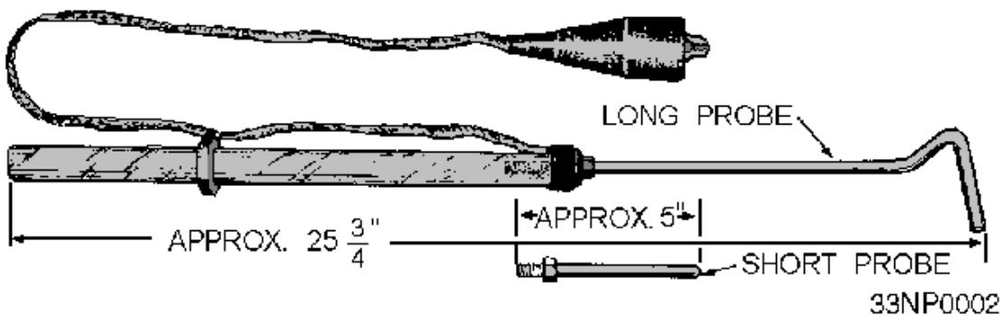

**Figure 1-4.—Representative safety shorting probe.**

### **CAUTION**

**Capacitors and cathode-ray tubes may retain their charge for a considerable period of time after having been disconnected from the power source.**

**Always assume there is a voltage present when working with circuits having high capacitance, even when the circuit has been disconnected from its power source.**

**An approved type of shorting probe should be used to discharge capacitors and cathode-ray tubes individually.**

When using the safety shorting probe, always be sure to first connect the test clip to a good ground (if necessary, scrape the paint off the grounding metal to make a good contact). Then hold the safety shorting probe by the insulated handle and touch the probe end of the shorting rod to the point to be shorted out. The probe end is fashioned so that it can be hooked over the part or terminal to provide a constant connection by the weight of the handle alone. Always take care not to touch any of the metal parts of the safety shorting probe while touching the probe to the exposed "hot" terminal. It pays to be safe; use the safety shorting probe with care.

Some equipments are provided with walk-around shorting devices, such as fixed grounding studs or permanently attached grounding rods. When that is the case, the walk-around shorting devices should be used rather than the safety shorting probe.

*Q-12. What tool is used to de-energize capacitors in a circuit that has been disconnected from its power source?*

### **WORKING ON DE-ENERGIZED CIRCUITS**

When any electronic equipment is to be repaired or overhauled, certain general safety precautions should be observed. They are as follows:

- Remember that electrical and electronic circuits often have more than one source of power. Take time to study the schematics or wiring diagrams of the entire system to ensure that all sources of power have been disconnected
- If pertinent, inform the remote station regarding the circuit on which work will be performed.
- Use one hand when turning switches on or off.
- Safety devices, such as interlocks, overload relays, and fuses, should never be altered or disconnected except for replacement. In addition, they should never be changed or modified in any way without specific authorization.
- Fuses should be removed and replaced only after the circuit has been de-energized. When a fuse "blows," the replacement should be of the same type and have the same current and voltage ratings. A fuse puller should be used to remove and replace cartridge fuses.
- All circuit breakers and switches from which power could possibly be supplied should be secured (locked if possible) in the OPEN or OFF (safe) position and danger tagged in accordance with procedures in the *Standard Organization and Regulations of the U.S. Navy*, OPNAVINST 3120.32.
- After the work has been completed, the tag (or tags) should be removed **only** by the same person who signed it (them) when the work began.
- Keep clothing, hands, and feet dry if at all possible. When you must work in wet or damp locations, place a rubber mat or other nonconductive material on top of a dry, wooden platform or stool; then use the platform or stool to sit and stand on. Use insulated tools and insulated flashlights of the molded type when you are required to work on exposed parts.

### **GROUNDING OF POWER TOOLS AND EQUIPMENT**

The possibility of electrical shock can be reduced by ensuring that all motor and generator frames, metal bases, and other structural parts of electrical and electronic equipment are at ground potential.

Normally, on steel-hull vessels, such grounds are inherently provided because the metal cases or frames of the equipment are in contact with one another and with the metal structure of the vessel. In some instances where such inherent grounding is not provided by the mounting arrangements, such as equipment supported on shock mounts, suitable ground connections must be provided.

The grounding wire used for this purpose is generally made of flexible material (copper or aluminum) that provides sufficient current-carrying capacity to ensure an effective ground. In this manner, equipment cases and frames that are not intended to be above ground potential are effectively grounded; also, the possibility of electrical shock to personnel coming in contact with metal parts of the equipment is minimized. The secondary purpose of grounding equipment is to improve the operation and continuity of service of all equipments.

Paint, grease, or other foreign matter can interfere with the positive metal-to-metal contact at the ground connection point. Therefore, all bonding surfaces (connection points or metallic junctions) must be securely fastened and free of such matter. In all instances where equipment grounding is provided, certain general precautions and preventive maintenance measures must be taken. A few of these precautions are listed below:

- Periodically clean all strap-and-clamp connectors to ensure that all direct metal-to-metal contacts are free from foreign matter.
- Check all mounting hardware for mechanical failure or loose connections.
- Replace any faulty, rusted, or otherwise unfit grounding strap, clamp, connection, or component between the equipment and the ground to the ship's hull.
- When replacing a part of the ground connection, make certain that the metallic contact surfaces are clean and that electrical continuity is re-established.
- After completing the foregoing steps, recheck to be sure that the connection is securely fastened with the correct mounting hardware. Paint the ground strap and hardware in accordance with current procedures.

Because of the electrical shock hazards that could be encountered aboard ship, plugs and convenience outlets for use with portable equipment and power tools normally are standard three-prong type. Both plugs and outlets are keyed so that the plug must be in the correct position before it can be inserted into the receptacle. To ensure that the safety factors incorporated in these devices are in serviceable condition and are safe for use, you must perform the following precautions and inspections:

- Inspect the pins of the plug to see that they are firmly in place and are not bent or damaged.
- Check the wiring terminals and connections of the plug. Loose connections and frayed wires on the plug surface must be corrected and any foreign matter removed before the plug is inserted into the receptacle.
- Use a meter to ensure that the ground pin has a resistance of less than 1 ohm equipment ground.
- Do not attempt to insert a grounded-type plug into a grounded receptacle without first aligning the plug properly.

### **CAUTION**

**Never use a power tool or a piece of portable test equipment unless you are absolutely sure that it is equipped with a properly grounded conductor.**

### **BASIC MEASUREMENTS**

Electronic measurements involve the fundamental electrical quantities of voltage and current and the inherent characteristics of resistance, capacitance, and inductance. In circuits being tested, voltage and current are dependent upon resistance, capacitance, and inductance for their distribution; therefore, voltage and current measurements are valuable aids in determining circuit component conditions and in the evaluation of symptoms. Practically any reading obtained from the use of test equipment will depend on these basic measured quantities of resistance, capacitance, and inductance.

### **VOLTAGE AND CURRENT MEASUREMENTS**

Voltage measurements may be made as part of either preventive or corrective maintenance. These measurements are made using a voltmeter. When compared with voltage charts, these measurements are a valuable aid in locating a trouble quickly and easily. However, if the sensitivity of the test voltmeter differs from that of the voltmeter used in preparing the chart, the voltage measurements must be evaluated before the true circuit conditions can be determined. (Sensitivity in voltmeters was discussed in NEETS, Module 3, *Introduction to Circuit Protection, Control, and Measurement*.)

Since many of the troubles you find in equipments and systems are the result of abnormal voltages, voltage measurements are a valuable aid in locating trouble. You can measure voltage with a voltmeter without interrupting circuit operation.

Point-to-point voltage measurement charts, usually found in equipment technical manuals, contain the normal operating voltages found in the various stages of the equipment. These voltages are usually measured between indicated points and ground unless otherwise stated. When you begin recording voltage measurements, it is a smart and safe practice to set the voltmeter on the highest range before measuring. This ensures that excessive voltages existing in the circuit will not cause overloading of the meter.

### *Q-13. On what range should you set the voltmeter prior to taking a voltage measurement?*

To increase accuracy, you should then set the voltmeter to the appropriate range for the proper comparison with the expected voltage in the voltage charts. When checking voltages, remember that a voltage reading can be obtained across a resistance, even if that resistance is open. The resistance of the meter itself forms a circuit resistance when the meter probes are placed across the open resistance. Therefore, the voltage across the component may appear to be normal or near-normal as you read the meter, but may actually be abnormal when the meter is disconnected from the circuit.

If the internal resistance of the voltmeter is approximately the same value as the resistance being tested, it will indicate a considerably lower voltage than the actual voltage present when the meter is removed from the circuit. The sensitivity (in ohms per volt) of the voltmeter used to prepare the voltage charts is provided on those charts. If a meter of similar sensitivity is available, you should use it to reduce the effects of loading.

The following precautions are general safety measures that apply to the measurement of voltages. Remember that nearly all voltages are dangerous and have often proved fatal to careless technicians. When measuring voltages, be sure to observe the following precautions:

- Set test equipment to the HIGHEST range.
- Make sure safety observer knows where to secure power for the equipment under test.
- Connect the ground lead of the voltmeter first.
- Use only one hand to take measurements (when possible), and put the other hand in your pocket or behind your back.
- If the voltage to be measured is less than 300 volts, place the end of the test probe on the point to be tested; use the polarity switch to select positive or negative readings.

- If the voltage to be measured is more than 300 volts, proceed as follows:
  - 1. Shut off circuit power.
  - 2. Discharge all filter capacitors with a shorting probe.
  - 3. Temporarily ground the point to be measured.
  - 4. Connect (clip on) the proper test lead to the high-voltage point.
  - 5. Move away from the voltmeter.
  - 6. Turn on circuit power and read the voltmeter.
  - 7. Turn off circuit power.
  - 8. Discharge all capacitors before disconnecting the meter.

### *Q-14. When taking a voltage measurement, which lead of the voltmeter should you connect to the circuit first?*

Current measurements are not often taken in the course of preventive maintenance or testing. This is because the ammeter (or other current-measuring instrument) must become an actual part of the equipment being tested. The circuit must be opened (desoldered) to connect the ammeter in series with the circuit being tested. Usually, you can take a voltage measurement and use this factor to calculate the circuit current by applying Ohm's law.

*Q-15. Is an ammeter connected in series or in parallel with the circuit under test?*

### **RESISTANCE MEASUREMENTS**

Resistance measurements are a valuable aid to you in locating defective circuits and components during corrective maintenance. Maintenance handbooks for the equipment can often be used to help you take these measurements. These handbooks often contain resistance charts that are referenced to accessible test points within the equipment. Without these charts, taking resistance measurements in a complex circuit is a slow process. The process is slow because one side of the circuit component must often be desoldered to get a true resistance measurement. However, resistance tolerances vary so widely that approximate resistance readings are adequate for most jobs.

Once the most accessible test point is found, an ohmmeter is usually used to take the resistance measurement. Because of the degree of accuracy needed when an ohmmeter is used, proper calibration and understanding of the meter scales is a must. (Topic 2 of this module will discuss these requirements in detail.) When using an ohmmeter, you must observe the following precautions:

- The circuit being tested must be completely de-energized.
- Any meters or transistors which can be damaged by the ohmmeter current must be removed before any measurement is made.

*Q-16. What must be done to a circuit before you can use an ohmmeter for testing?*

### **CAPACITANCE MEASUREMENTS**

Capacitance measurements are usually taken with a capacitance meter. Capacitance tolerances vary even more widely than resistance tolerances. Capacitance tolerances depend on the type of capacitor, the value of capacitance, and the voltage rating. The actual measurement of capacitance is very simple; however, you must make the important decision of whether to reject or to continue to use the capacitor after it has been tested.

The POWER FACTOR of a capacitor is important because it is an indication of the various losses of a capacitor. Power losses can be traced to the dielectric, such as current leakage and dielectric absorption. Current leakage is of considerable importance, especially in electrolytic capacitors.

*Q-17. What is the term used to refer to the losses which can be traced to the dielectric of a capacitor?*

### **INDUCTANCE MEASUREMENTS**

Inductance measurements are seldom required in the course of troubleshooting. However, inductance measurements are useful in some cases; therefore, bridges (discussed in the next section) are available for making this test. You will find that many capacitance test sets can be used to measure inductance. Most capacitance test sets are furnished with inductance conversion charts if the test equipment scale is not calibrated to read the value of inductance directly.

### **CAPACITANCE, INDUCTANCE, AND RESISTANCE BRIDGES**

You can measure capacitance, inductance, and resistance for precise accuracy by using ac bridges. These bridges are composed of capacitors, inductors, and resistors in a wide variety of combinations. These bridges are operated on the principle of a dc bridge called a WHEATSTONE BRIDGE.

### **Wheatstone Bridge**

The Wheatstone bridge is widely used for precision measurements of resistance. The circuit diagram for a Wheatstone bridge is shown in figure 1-5. Resistors R1, R2, and R3 are precision, variable resistors. The value of Rx is an unknown value of resistance that must be determined. After the bridge has been properly balanced (galvanometer G reads zero), the unknown resistance may be determined by means of a simple formula. The galvanometer (an instrument that measures small amounts of current) is inserted across terminals **b** and **d** to indicate the condition of balance. When the bridge is properly balanced, no difference in potential exists across terminals **b** and **d**; when switch S2 is closed, the galvanometer reading is zero.

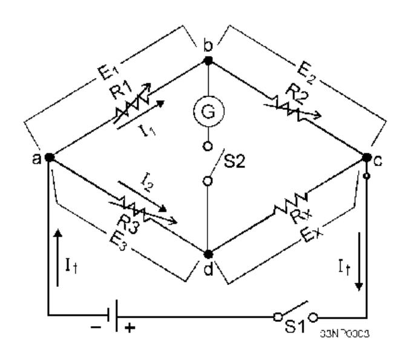

**Figure 1-5.—Wheatstone bridge.**

The operation of the bridge is explained in a few logical steps. When the battery switch S1 is closed, electrons flow from the negative terminal of the battery to point **a**. Here the current divides as it would in any parallel circuit. Part of it passes through R1 and R2; the remainder passes through R3 and Rx. The two currents, I1 and I2, unite at point **c** and return to the positive terminal of the battery. The value of I1 depends on the sum of resistance R1 and R2, and the value of I2 depends on the sum of resistances R3 and Rx. In each case, according to Ohm's law, the current is inversely proportional to the resistance.

R1, R2, and R3 are adjusted so that when S1 is closed, no current flows through **G**. When the galvanometer shows no deflection, there is no difference of potential between points **b** and **d**. All of I 1 follows the **a b c** path and all I2 follows the **a b c** path. This means that a voltage drop E1 (across R1 between points **a** and **b**) is the same as voltage drop E3 (across R3 between points a and d). Similarly, the voltage drops across R2 and Rx (E2 and Ex) are also equal. Expressed algebraically,

and

With this information, we can figure the value of the unknown resistor Rx. Divide the voltage drops across R1 and R3 by their respective voltage drops across R2 and Rx as follows:

We can simplify this equation:

then we multiply both sides of the expression by Rx to separate it:

For example, in figure 1-5, we know that R1 is 60 ohms, R2 is 100 ohms, and R3 is 200 ohms. To find the value of R x, we can use our formula as follows:

### **Use of ac Bridges**

A wide variety of ac bridge circuits (such as the Wheatstone) may be used for the precision measurement of ac resistance, capacitance, and inductance. Let's look at ac bridges in terms of functions they perform.

**RESISTANCE BRIDGE**.—An ac signal generator, as shown in figure 1-6, is used as the source of voltage. Current from the generator passes through resistors R1 and R2, which are known as the ratio arms, and through Rs and Rx. Again, Rx is known as resistance. Rs has a standard value and replaces R3 in figure 1-6. When the voltage drops across R2 and Rs are equal, the voltage drops across R2 and Rx are also equal; no difference of potential exists across the meter and no current flows through it. As we discovered with the Wheatstone bridge, when no voltage appears across the meter, the following ratio is true:

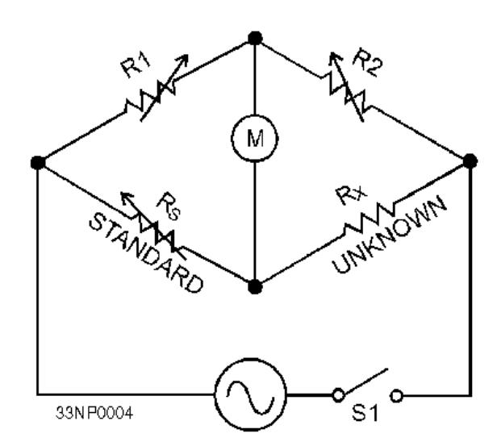

**Figure 1-6.—Resistance bridge (ac).**

For example, if in figure 1-6 we know that R1 is 20 ohms, R2 is 40 ohms, and Rs is 60 ohms, we can find the value of Rx using our formula as follows:

With the ac signal applied to the bridge, R1 and R2 are varied until a zero reading is seen on the meter. Zero deflection indicates that the bridge is balanced. (**NOTE**: In actual practice, the variables are adjusted for a minimum reading since the phase difference between the two legs will not always allow a zero reading.)

**CAPACITANCE BRIDGE**.—Because current varies inversely with resistance and directly with capacitance, an inverse proportion exists between the four arms of the bridge in figure 1-7; the right side of our expression is inverted from the resistance bridge expression as follows:

or

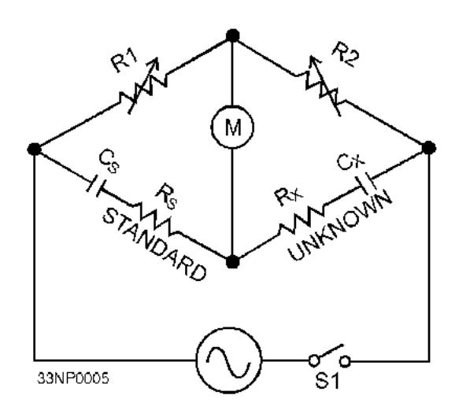

**Figure 1-7.—Capacitance bridge.**

### *Q-18. What effect does an increase in capacitance have on a capacitor's opposition to current flow?*

Because R1 and R2 are expressed in the same units, the equation R1/R2 becomes a simple multiplication factor. This equation provides a numerical value for Cx and will be in the same units as Cs (farad, microfarad, and so forth).

Similarly, the following resistance ratio exists between the four arms of the bridge, just as in the resistance bridge expression discussed earlier:

or

Thus, both the unknown resistance and capacitance, R x and Cx, can be estimated in terms of known resistance R1, R2, Rs, and known capacitance Cs.

In figure 1-7, for example, we know that R1 is 20 ohms, R2 is 40 ohms, Rs is 60 ohms, and Cs is 10 microfarads. We can find the values of Cx and Rx by using the respective formulas as follows:

and

*Q-19. When a bridge is used to measure resistance, what is the value of Rx if R1 equals 80 ohms, R2 equals 120 ohms, and R3 equals 280 ohms?*

**INDUCTANCE BRIDGE**.—The value of the unknown inductance Lx may be determined by means of the simple bridge circuit shown in figure 1-8. Ratio arms R1 and R2 are accurately calibrated resistors. Ls is a standard inductor with a known inductance; Rs is the known resistance, and Rx represents the resistance of the unknown inductor.

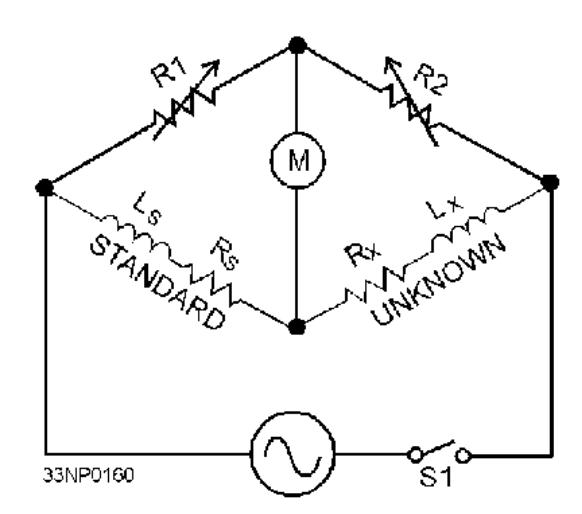

**Figure 1-8.—Inductance bridge.**

The ac signal is applied to the bridge, and variable resistors R1 and R2 are adjusted for a minimum or zero deflection of the meter, indicating a condition of balance. When the bridge is balanced, the following formulas may be used to find Lx.

(NOTE: The right side of this expression is NOT inverse as it was in the capacitance bridge.)

and

or

In figure 1-8, for example, the values of R1, R2, and Rs are 20, 40, and 60 ohms, respectively. The value of Ls is 10 millihenries. We can find the values of Rx and Lx by using their respective formulas as follows:

and

Thus, both the unknown resistance and inductance can be estimated in terms of the known values for R1, R2, Rs, and Ls.

*Q-20. When an unknown capacitance is tested with a bridge, what is the value of Cx if R1 equals 70 ohms, R2 equals 150 ohms, and Cs equals 550 microfarads?*

### **SUMMARY**

The important points of this chapter are summarized in the following paragraphs:

The **JETDS SYSTEM** is jointly used by all branches of the military to identify equipments by a system of standardized nomenclatures.

**GPETE** is test equipment that has the capability, without modifications, to generate, modify, or measure a range of parameters of electronic functions required to test two or more equipments or systems of basically different design. All GPETE are listed in *Standard General Purpose Electronic Test Equipment*, MIL-STD-1364 (series).

**SPETE** is test equipment that is specifically designed to generate, modify, or measure a range of parameters of electronic functions of a specific or peculiar nature required to test a single equipment or system.

The **SHIP CONFIGURATION AND LOGISTICS INFORMATION SYSTEM (SCLSIS)** program is designed to keep track of equipment configuration changes in the fleet.

The **SCLSIS** program has two basic elements, VALIDATION and INVENTORY UPDATING.

The **CALIBRATION STATUS** of any items of test equipment can be determined by the information recorded on the calibration label or tag located on the equipment.

The **CALIBRATED** label, with black lettering on a white background, indicates the instrument to which it is attached is within tolerance on all scales.

The **CALIBRATED—REFER TO REPORT** label, with red lettering on a white background, is used when actual measurement values must be known to use the instrument.

The **SPECIAL CALIBRATION** label, with black lettering on a yellow background, is used when some unusual or special condition in the calibration should be drawn to your attention.

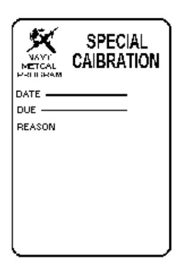

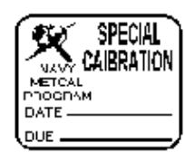

The **USER CALIBRATION** label indicates that you should calibrate the test and measuring instrument instead of sending the instrument to a calibration facility.

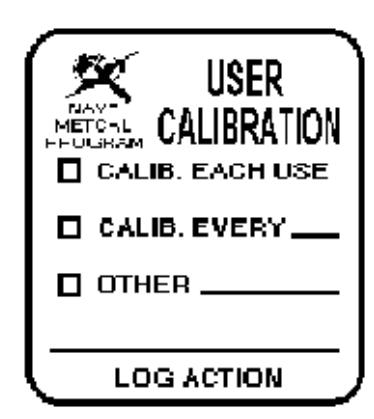

The **INACTIVE—CALIBRATE BEFORE USE** label is used when a piece of test equipment due for recalibration will not be used for some time in the future.

The **CALIBRATION NOT REQUIRED** label is used on test instruments listed in the Metrology Requirements List (METRL) as not requiring calibration.

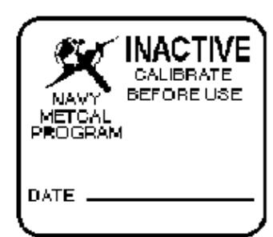

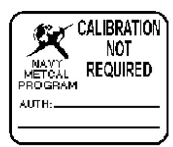

The **REJECTED** label is attached to a test instrument that fails to meet the acceptance criteria during calibration and cannot be repaired.

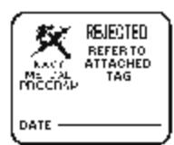

The **CALIBRATION VOID IF SEAL BROKEN** label is placed over readily accessible adjustments to prevent tampering by the user when such tampering could affect the calibration.

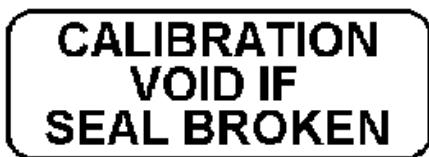

The **MEASURE** system is designed to standardize the recall and scheduling of test, measurement, and diagnostic equipment into calibration facilities and for the documentation of actions performed by the calibration facility.

**MAINTENANCE** is work done to correct, reduce, or counteract wear and damage to equipment.

**PREVENTIVE MAINTENANCE** consists of checks to determine weather equipment is functioning properly. It also consists of visual inspections of cabling and equipment for damage and to determine if lubrication is needed.

**CORRECTIVE MAINTENANCE** is used to isolate troubles by means of test techniques and practices that realign or readjust equipment or otherwise bring the equipment back up to proper performance.

**SENSITIVITY** of the voltmeter is always given on the voltage charts for a particular piece of equipment. You should always use a voltmeter of similar sensitivity to the equipment to diminish the effects of circuit loading.

**CURRENT MEASUREMENTS** are not often taken in the course of testing because the ammeter (or other current measuring device) must become an actual part of the equipment being tested. The circuit must be opened for necessary connection of the meter. Usually you can use a voltage measurement to calculate the circuit current by applying Ohm's law.

You should observe the following PRECAUTIONS when using an ohmmeter:

- 1. The circuit being tested must be completely de-energized.
- 2. Any circuit components which can be damaged by ohmmeter current must be removed before any measurement is made.

The **WHEATSTONE BRIDGE** is used for precise measurement of resistance.

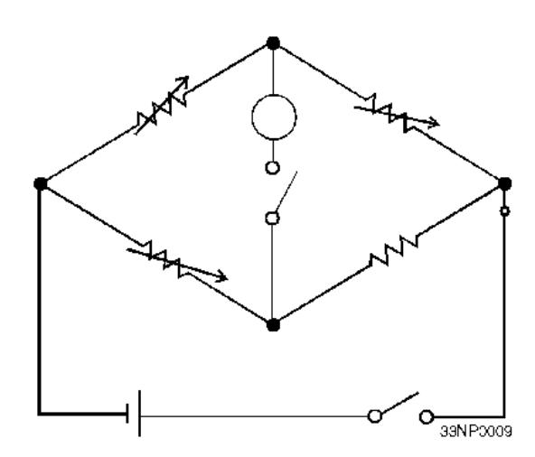

The **CAPACITANCE BRIDGE** is used for measuring an unknown capacitance.

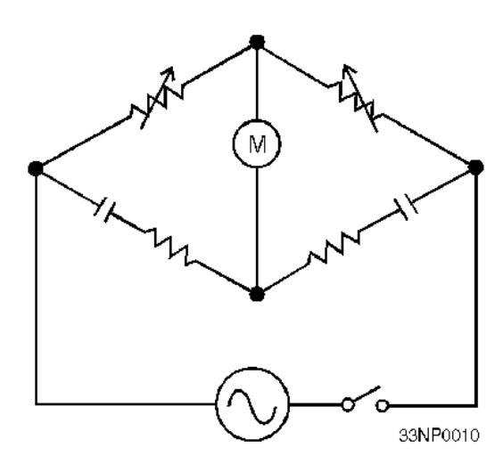

An **INDUCTANCE BRIDGE** is used to find the value of an unknown inductance.

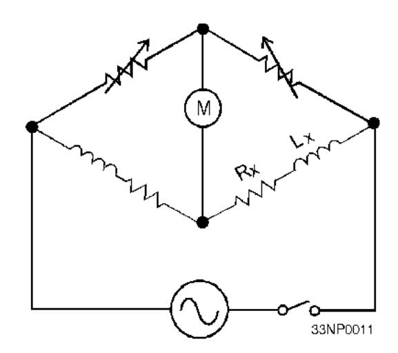

### *ANSWERS TO QUESTIONS Q1. THROUGH Q20.*

*A-1. Joint Electronics Type Designation System (JETDS). A-2. General-purpose electronic test equipment (GPETE) and special-purpose electronic test equipment (SPETE). A-3. Special-purpose electronic test equipment. A-4. Validation and updating. A-5. CALIBRATED—REFER TO REPORT. A-6. SPECIAL CALIBRATION label. A-7. Maintenance personnel. A-8. The Chief of Naval Operations. A-9. Preventive and corrective maintenance. A-10. Corrective maintenance. A-11. Current. A-12. Shorting probe. A-13. Highest. A-14. Ground. A-15. In series. A-16. It must be de-energized. A-17. Power losses. A-18. Opposition to current flow decreases. A-19. 420 ohms. A-20. 256 microfarads.*

# **CHAPTER 2 MISCELLANEOUS MEASUREMENTS**

### **LEARNING OBJECTIVES**

Upon completing this chapter, you should be able to:

- 1. Define and explain the use of the terms "dB" and "dBm" as they apply to power measurements.
- 2. Describe the use of resistive loads, bolometers, and thermocouples in power measurements.
- 3. Explain the measurement of mechanical rotation using the tachometer, stroboscope, and the strobotac.
- 4. Explain the measurement of frequency in various ranges using vibrating reeds, tuned circuits, heterodyne frequency meters, absorption wavemeters, cavity wavemeters, and frequency counters.
- 5. Describe the use of frequency-measurement devices, oscilloscopes, and spectrum analyzers in waveform analysis and maintenance.
- 6. Describe semiconductor testing and applicable terms in maintenance.

### **INTRODUCTION**

In chapter 1, you studied test equipment administration and the basic measurements that all technicians are responsible for performing. Chapter 2 presents miscellaneous measurements that are fairly common; keep in mind, however, that you may not routinely perform these measurements in your particular job. This chapter introduces you to several test instruments and components found in those test instruments. It will also serve as a review of some of the basics of electronic theory related to test equipment.

### **POWER MEASUREMENTS**

You may be required to check the power consumption and the input-signal power levels of electronic equipment. The determination of dc power is fairly simple; recall that the unit of power, the **watt**, is the product of the potential in volts and the current in amperes (*P = E* × *I*).

As discussed in NEETS, Module 2, *Introduction to Alternating Current and Transformers*, the phase angle of the voltage and current must be considered for accurate ac power measurements. The measurement of ac power is further complicated by the frequency limitations of various power meters. If there is no phase angle difference, you can compute ac power in the same manner as dc power; that is, by determining the effective value of the product of the voltage and current.

For equipments that operate in the audio-frequency (af) range, power levels have to be determined in the performance of routine checks and during corrective maintenance procedures.

Power measurements for af circuits are usually indicated in terms of decibels (dB) or decibels referenced to 1 milliwatt (dBm). Because the actual calculation of decibel measurements is seldom required, the following explanation is somewhat simplified. Most test equipment is designed to measure and indicate decibels directly. This eliminates the need for you to perform complicated calculations. Nevertheless, a basic explanation of the decibel measurement system is necessary for you to understand the significance of dB readings and amplifier-gain ratings that are expressed in decibels.

### **THE DECIBEL SYSTEM**

The basic unit of measurement in the system is not the decibel; it is the **bel**. The bel is a unit that expresses the logarithmic ratio between the input and the output of any given component, circuit, or system. It may be expressed in terms of voltage, current, or power. Most often, it is used to show the ratio between input and output power to figure gain. You can express the power gain of the amplifier (N) in bels by dividing the output (P1) by the input (P2) and taking the base 10 logarithm of the resulting quotient. The formula for determining this gain is:

If an amplifier doubles the input power, the quotient of P1 to P2 will be 2. If you consult a logarithm table, you will find that the base 10 logarithm of 2 is 0.3, making the power gain of the amplifier 0.3 bel.

*Q-1. What is the logarithmic ratio between the input and output of a given circuit called?*

Experience has shown that because the bel is a rather large unit, it is difficult to apply. A more practical unit, and one that can be used more easily, is the decibel (1/10 bel). You can convert any figure expressed in bels to decibels by multiplying that figure by 10 or simply by moving the decimal point one place to the right. Applying this rule, we find that the above ratio of 0.3 bel is equal to 3 decibels.

The decibel (dB) cannot be used to represent actual power; only the ratio of one power compared to another. To say that an amplifier has a 3 dB gain means that the output power is twice the input power. This gives no indication of the actual power represented. You must be able to state the input power for it to be meaningful. In many **applications**, a mathematical expression represents the actual power, not a power ratio. One standard reference is the dBm.

The dBm is an abbreviation used to represent power levels above or below 1 milliwatt. Negative dBm (−dBm) represents power levels below 1 milliwatt, and positive dBm (+dBm) represents power levels above 1 milliwatt. In other words, a dBm value is a specific amount of power; 0 dBm is equal to 1 milliwatt. Briefly stated, the amount of power in a given value of dBm is the power which results if 1 milliwatt is amplified or attenuated by that dB value. For example, 40 dBm represents an actual power level (watts or milliwatts) that is 40 dB above 1 milliwatt, whereas −10 dBm represents a power level that is 10 dB below 1 milliwatt. The formula for finding dBm is a variation of the dB power formula:

*Q-2. What term is used to represent power levels above or below a 1-milliwatt reference?*

You do not need to use the formula in most applications. The following shows conversions of dBm to mW:

> +20dBm = 100mW +10dBm = 10mW +7dBm = 5mW +6dBm = 4mW +4dBm = 2.5mW +3dBm = 2mW 0dBm = 1mW -3dBm = .5mW -10dBm = .1mW

For a +10 dBm level, start with the 1 milliwatt reference and move the decimal point one place to the right (+10 dBm = 10 mW). Another 10 dB increment brings the power level to +20 dBm, thereby moving the decimal point another place to the right (+20 dBm = 100 mW). For a −10 dBm level, again start with 1 milliwatt, but this time move the decimal point one place to the left (−10 dBm = .1 mW). An additional 10 dB decrease results in another decimal point shift to the left (−20 dBm = .01 mW).

For a 3 dB increase, you double the power. For a 3 dB decrease, you reduce the power by one-half (+3 dBm = 2 mW and −3 dBm = .5 mW). A +6 dBm level is an additional 3 dB change from +3 dBm. In this case, you just double the power level of the +3 dBm (+6 dBm = 4 mW).

### *Q-3. What milliwatt value is equal to +6 dBm?*

The dB change can be made in either direction. For example, +7 dBm is a decrease from +10 dBm. Reducing the +10 dBm power by one-half, we have +7 dBm, or 5 mW. A +4 dBm power level is a 3 dB decrease from +7 dBm (+4 dBm − 2.5 mW). By using this simple method, you can quickly find any power level that corresponds to a given dBm.

Some test instruments you will be using are calibrated in decibels and have a 1 milliwatt zero reference level. Figure 2-1 illustrates such an instrument. Notice that this is an ac voltmeter in which the upper scale of the meter indicates ac voltage and the lower scale indicates decibels. The zero power-level indicator on the decibel scale is located at, or near, center scale. If the power in the line being measured is more than the reference value, the meter will indicate a value to the right of the zero mark (+dB). If the power is less than the reference value, the meter will indicate a value to the left of the zero mark (−dB). Such meters are useful when recording measurements where a direct indication in decibels is desired. However, you must remember that this meter is still a voltmeter and that power measurements are not meaningful unless the circuit impedance is known. If you feel the need to review how to calculate power in ac circuits, refer to NEETS, Module 2.

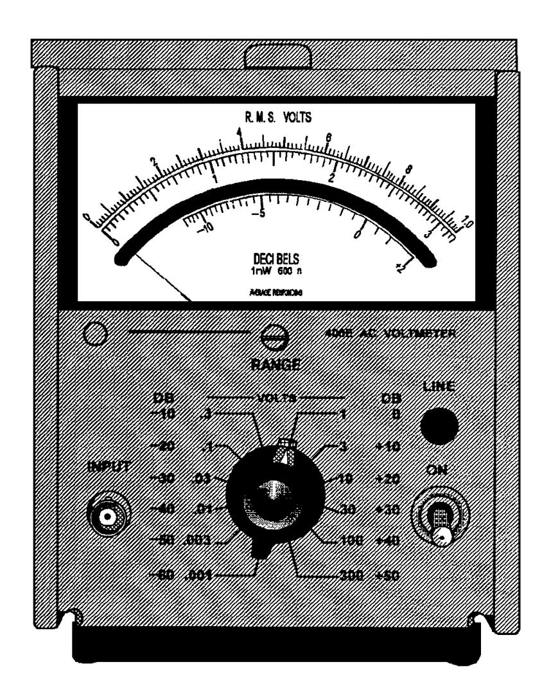

**Figure 2-1.—Ac voltmeter.**

### **MEASUREMENT METHODS**

At radio frequencies below the UHF range, power is usually determined by voltage, current, and impedance measurements. One common method used to determine the output power of radio-frequency (rf) oscillators and radio transmitters consists of connecting a known resistance to the equipment output terminals. Current flowing through this resistance is then measured and the power is calculated as the product of I2 R.

Because power is proportional to the current squared, the meter scale can be calibrated to indicate power units directly. A THERMOCOUPLE AMMETER can be used in this manner for measuring rf power. The resistor used to replace the normal load is specially designed to have low reactance and the ability to dissipate the required amount of power. Such resistors are commonly called DUMMY LOADS or DUMMY ANTENNAS.

### *Q-4. What name is given to a resistor used to replace the normal load in a circuit?*

In the UHF and SHF frequency ranges, accurately measuring the voltage, current, and resistance is difficult. These basic measurements can vary greatly, depending on where in the circuit the measurements are made. They are also affected by small changes in parts placement in the vicinity of tuned circuits.

To measure the output of microwave radio or radar transmitters, you can use test instruments that convert rf power to another form of energy, such as light or heat. These instruments can be used to indirectly measure the power. A method used to measure the effect of a resistor load on a stream of passing air can also be used to indirectly measure power. Accurate measurement of large-magnitude power also can be achieved by measuring the temperature change of a water load. The most common type of power meter for use in this frequency range employs a BOLOMETER.

### **Bolometer**

The bolometer is a loading device that undergoes changes of resistance as changes in dissipated power occur. The two types of bolometers are the BARRETTER and the THERMISTOR. The barretter is characterized by an increase in resistance as the dissipated power rises. The thermistor decreases in resistance as the power increases. In either case, resistance is measured before and after the application of rf power. If the same change in resistance is then produced by a variable dc source of power, then the rf power is equal to the measured dc power. This relationship makes possible the direct calibration of a bridge circuit in units of power. In other words, one condition of balance exists when no rf power is applied; but in the presence of power, a second condition of balance exists because of the resistance changes of the bolometer. It is this change of resistance that is calibrated in power.

### *Q-5. What are the two types of bolometers?*

**BARRETTER**.—The construction of a typical barretter is shown in figure 2-2. The fine wire (usually tungsten) is extremely small in diameter. This thin diameter allows the rf current to penetrate to the center of the wire. The wire is supported in an insulating capsule between two metallic ends, which act as connectors. Because of these physical characteristics, the barretter resembles a cartridge-type fuse. The enclosure is a quartz capsule made in two parts. One part is an insert cemented in place after the tungsten wire has been mounted. In operation, the barretter is matched to the rf line after power is applied.

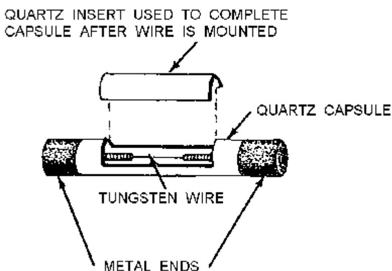

**Figure 2-2.—Typical barretter.**

**THERMISTOR**.—A high degree of precision is made possible by the thermistor; therefore, it is widely used. Figure 2-3 shows the typical construction of a bead-type thermistor. The negativetemperature coefficient comes from the use of a semiconductor as the active material. Notice that the

active material is shaped in the form of a bead. It is supported between two pigtail leads by connecting wires. The pigtail ends are embedded in the ends of the surrounding glass capsule.

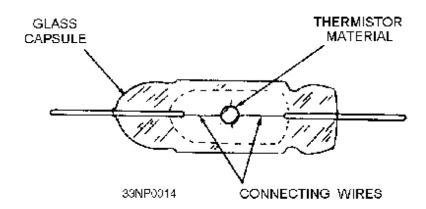

**Figure 2-3.—Bead-type thermistor.**

The negative-resistance temperature coefficient of thermistors is desirable. This is because excessive power has the effect of changing the resistance of the thermistor to an extent that causes a pronounced rf mismatch. The resulting decrease in power transfer reduces the likelihood of burnout.

### **Thermistor Bridge**

Figure 2-4, views A and B, is an example of a THERMISTOR BRIDGE used for rf power measurements. A thermistor bridge circuit includes other thermistor elements, referred to as *compensating thermistors*. These thermistors respond to fluctuations in ambient temperature so that the bridge balances and calibration are maintained over a wide temperature range. Compensating thermistors are usually in disc form so that they can be mounted on a flat metal surface, such as a chassis or a waveguide. The thermistor bridge in view B is located in the terminating section of a waveguide and contains RT-2, a bead thermistor, and two compensating thermistors, RT-1 and RT-3, on the outside of the waveguide (view A). RA-1 in view B, a calibrated attenuator, controls the amount of rf energy applied to RT-2.

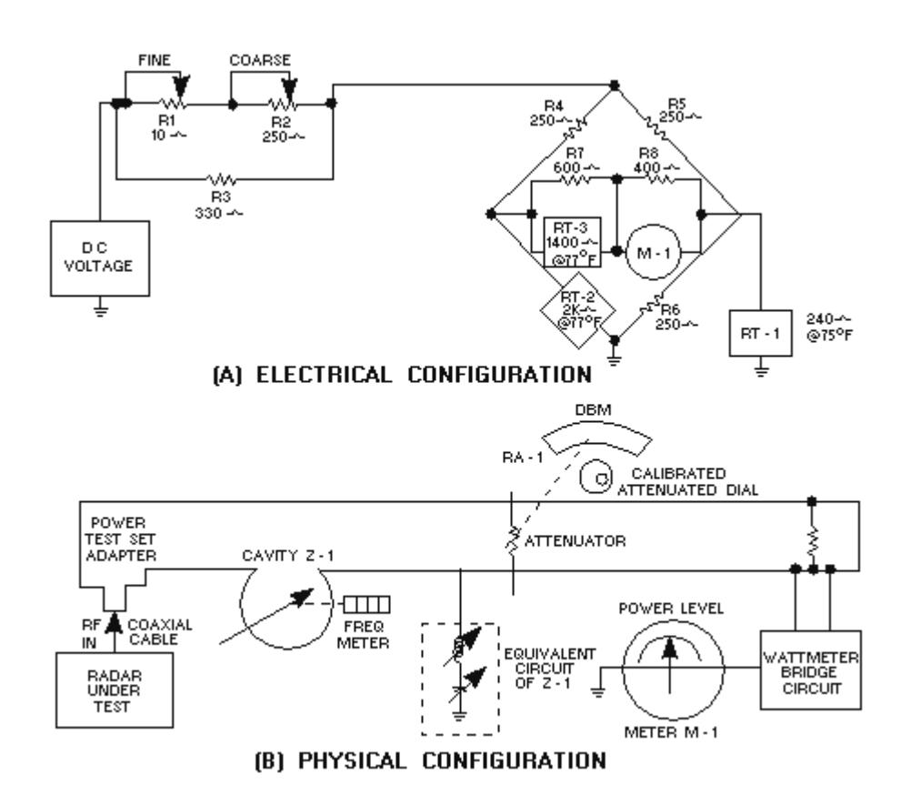

**Figure 2-4.—Thermistor bridge.**

Before power is applied, R1 and R2 in view A of figure 2-4 are used to adjust the current through RT-2. When the resistance of RT-2 reaches the equivalent parallel resistance of R6 and RT1 (122.4 ohms), the bridge is balanced. Meter M-1 reads 0 at this time. The rf signal being measured is connected to the test set and applied via the calibrated attenuator to RT-2. This causes the temperature of RT-2 to increase, thus reducing its resistance. The bridge becomes unbalanced, causing meter M-1 to deflect an amount proportional to the decrease in resistance of RT-2. Meter M-1, because of the operation of RT-2, reads average power.

### *Q-6. As the dissipated power increases, what effect does this have on the resistance of a thermistor?*

If the ambient temperature rises, the resistance of RT-1 decreases. This shunts more current around the bridge network and allows RT-2 to cool. The resistance of RT-3 decreases, maintaining meter sensitivity independent of temperature changes. Cavity Z-1 in view B of figure 2-4 is an ABSORPTION-TYPE FREQUENCY METER. This type of meter will be discussed later.

### **FREQUENCY MEASUREMENTS**

Frequency measurements are an essential part of preventive and corrective maintenance for electric and electronic equipment. Some examples of the various frequency measurements follow:

- Rotation frequencies of some electro-mechanical devices, such as electric motors, must be determined.

- The output frequency of electric power generators is checked when the engine is started and during preventive maintenance routines.
- Equipment that operates in the af range must be adjusted to operate at the correct frequencies.
- Radio transmitters must be accurately tuned to the assigned frequencies to provide reliable communications and to avoid interference with radio circuits operating on other frequencies.
- Radar sets must be properly tuned to obtain satisfactory performance.

As you can see from the above examples, frequency measurement does indeed play a valuable role in maintenance. These measurements can be divided into two broad categories: MECHANICAL-ROTATION FREQUENCY measurement and ELECTRICAL-OUTPUT FREQUENCY measurement. Depending upon your job and/or the type of command to which you are assigned, you may be tasked with performing one or both of these types of measurements.

### **MECHANICAL-ROTATION FREQUENCY MEASUREMENT**

The rotating frequency (speed in revolutions per minute) of armatures in electric motors and enginedriven generators, as well as the blade speed in turbines, is measured with devices called TACHOMETERS, STROBOSCOPES, and STROBOTACS.

### **Tachometer**

A tachometer is an instrument that measures the rate at which a shaft is turning. Although tachometers are installed on machinery, such as generators and engines, you may need to determine the speed of a rotating machine that is not equipped with a tachometer. In these instances, you will be required to use a PORTABLE TACHOMETER. Portable hand-held tachometers measure speed by direct contact with the shaft of the measured unit. Portable tachometers are for use only during testing and should not be used continuously. The common types of portable tachometers are the CENTRIFUGAL and the CHRONOMETRIC.

**CENTRIFUGAL TACHOMETER**.—A centrifugal-type tachometer is illustrated in figure 2-5, view A. View B shows the internal arrangement of the centrifugal tachometer; refer to view B in this discussion. In the centrifugal tachometer, centrifugal force acts upon fly weights that are connected by links to upper and lower collars. The upper collar is affixed to a drive shaft; the lower collar is free to move up and down the shaft. A spring, which fits over the shaft, connects the upper and lower collars.

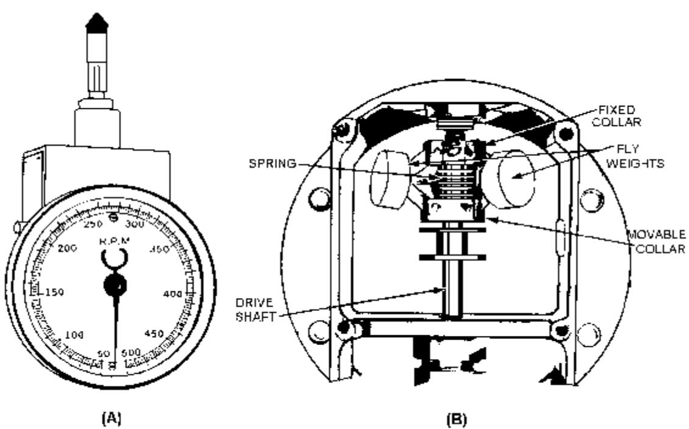

**Figure 2-5.—Centrifugal tachometer.**

Each portable centrifugal tachometer has a small rubber-covered wheel and a number of hard rubber tips. You fit the appropriate tip or wheel on the end of the tachometer drive shaft, and hold it against the shaft to measure speed of rotation. As the drive shaft begins to rotate, the fly weights rotate with it. Centrifugal force tends to pull the fly weights away from the center, causing the lower collar to rise and compress the spring. The lower collar is attached to a pointer, and its upward motion, restricted by the spring tension, causes an increase in the indication on the dial face.

When properly used, a centrifugal tachometer will indicate correct shaft speed as long as it is in contact with the machine shaft under test. A portable centrifugal tachometer has three ranges: low (50 to 500 rpm), medium (500 to 5,000 rpm), and high (5,000 to 50,000 rpm).

**CHRONOMETRIC TACHOMETER**.—The chronometric tachometer (figure 2-6) is a combination watch and revolution counter. It measures the average number of revolutions of a shaft per minute. The chronometric tachometer also comes with hard rubber tips, which must be inserted over the drive shaft.

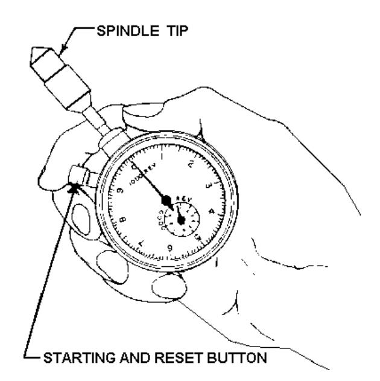

**Figure 2-6.—Chronometric tachometer.**

When applied to a rotating shaft, the outer drive shaft of this tachometer runs free until a starting button is depressed to start the timing element. In figure 2-6, note the starting button beneath the index finger. The chronometric tachometer retains readings on its dial after its drive shaft has been disengaged from a rotating shaft and until the pointers are returned to 0 by the reset button (usually the starting button). The range of a chronometric tachometer is usually from 0 to 10,000 rpm and from 0 to 3,000 feet per minute (fpm).

### **Stroboscope**

The rotation frequencies of recording devices and teletypewriter motors can be measured by the use of a STROBOSCOPE. The stroboscope is an instrument that allows you to view rotating or reciprocating objects intermittently and produces the optical effect of a slowing down or stopping motion. For example, electric fan blades revolving at 1,800 rpm will appear stationary if you look at them under a light that flashes uniformly 1,800 times per minute. At 1,799 flashes per minute, the blades will appear to rotate forward at 1 rpm; at 1,801 flashes per minute, they will appear to rotate backward at 1 rpm.

When the flashing rate of the light is adjustable, you can calibrate the control in flashes (or revolutions) per minute. The stationary image you see when the rate of the lamp and the rotational rate of a shaft are equal lets you record a very precise speed measurement.

### **Strobotac**

The STROBOTAC (figure 2-7) is an electronic flash device in which the flash duration is very short (a few millionths of a second). (Table 2-1 contains a description of the controls and indicators shown on the strobotac in figure 2-7.) Because of this short flash duration, the strobotac can measure very rapid motion. The box contains a swivel mount with a STROBOTRON LAMP in a reflector, an electronic pulse generator to control the flashing rate, and a power supply that operates from the ac power line. The flashing rate is controlled by the large knob; the corresponding speed (rpm) is indicated on an illuminated dial that is viewed through windows in the knob.

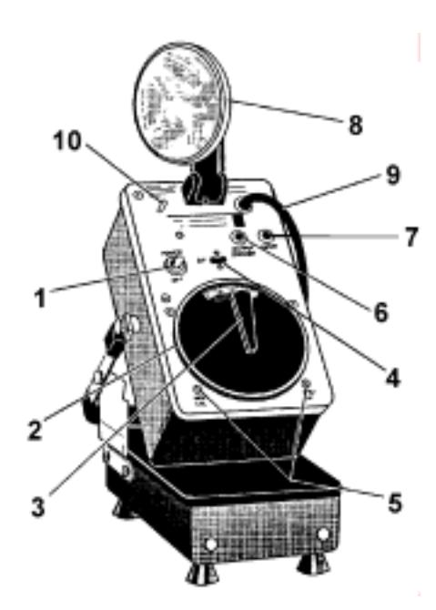

**Figure 2-7.—Electronic strobotac.**

**Table 2-1.—Strobotac Controls and Indicators**

| NO  | NAME                       | USE                                                                                                                             |
|-----|----------------------------|---------------------------------------------------------------------------------------------------------------------------------|
| 1.  | POWER switch               | Turns power on and off.                                                                                                         |
| 2.  | RPM control                | Controls the flashing rate of light as the fluted rim is rotated.                                                               |
| 3.  | Range switch               | Selects any of three rpm (internal oscillator) ranges, plus three external-input positions: Rpm ranges Intensity External input |
|     |                            | 110-690 rpm High 700 rpm max                                                                                                    |
|     |                            | 170-4170 rpm Med 4000 rpm max*                                                                                                  |
|     |                            | 4000-25,000 rpm Low 25,000 rpm max                                                                                              |
| 4.  | CALibration indicator lamp | Indicates the correct setting of CALibration adjustments for calibrating the RPM dial to power-line frequency.                  |
| 5.  | HIGH CAL, LOW CAL          | Calibration adjustments used to calibrate the RPM dial.                                                                         |
| 6.  | OUTPUT TRIGGER jack        | A trigger pulse is available at this jack for strobotac types                                                                   |
| 7.  | INPUT jack                 | Used for connecting the stroboscope to an external contactor.                                                                   |
| 8.  | Reflector-lamp assembly    | Produces and aims the flashing light.                                                                                           |
| 9.  | Power cord                 | A permanently attached 6-foot power cord. For storage, the pin.                                                                 |
| 10. | Holder pin                 | Used to secure the plug-end of the power cord when unit is to be stored in its case.                                            |

The normal speed range is from 110 to 25,000 rpm. At speeds below 600 rpm, "flicker" becomes a problem because the human eye cannot retain successive images long enough to create the illusion of continuous motion. The life of the strobotron lamp is approximately 250 hours if used at flashing speeds of less than 5,000 rpm, or 100 hours if used at higher speeds.

### **ELECTRICAL OUTPUT FREQUENCY**

All alternating voltage sources are generated at a set frequency or range of frequencies. A FREQUENCY METER provides a means of measuring this frequency. The electrical output frequency of ac power generators can be measured by a vibrating reed, a tuned circuit, or by a crossed-coil, iron-vane type meter. The vibrating-reed device is the simplest type of frequency meter. It has the advantage of being rugged enough to be mounted on generator control panels.

A simplified diagram of a vibrating-reed frequency meter is shown in figure 2-8, views A through D. In view A, you can see that the current to be measured flows through the coil and exerts maximum attraction on the soft-iron armature twice during each cycle. The armature is attached to the bar, which is mounted on a flexible support. Reeds of suitable dimensions to have natural vibration frequencies of 110, 112, 114, and so forth, up to 130 hertz are mounted on the bar (view B). The reed with a frequency of 110 hertz is marked 55 hertz; the one with a frequency of 112 hertz is marked 56 hertz; the one with a frequency of 120 hertz is marked 60 hertz, and so forth.

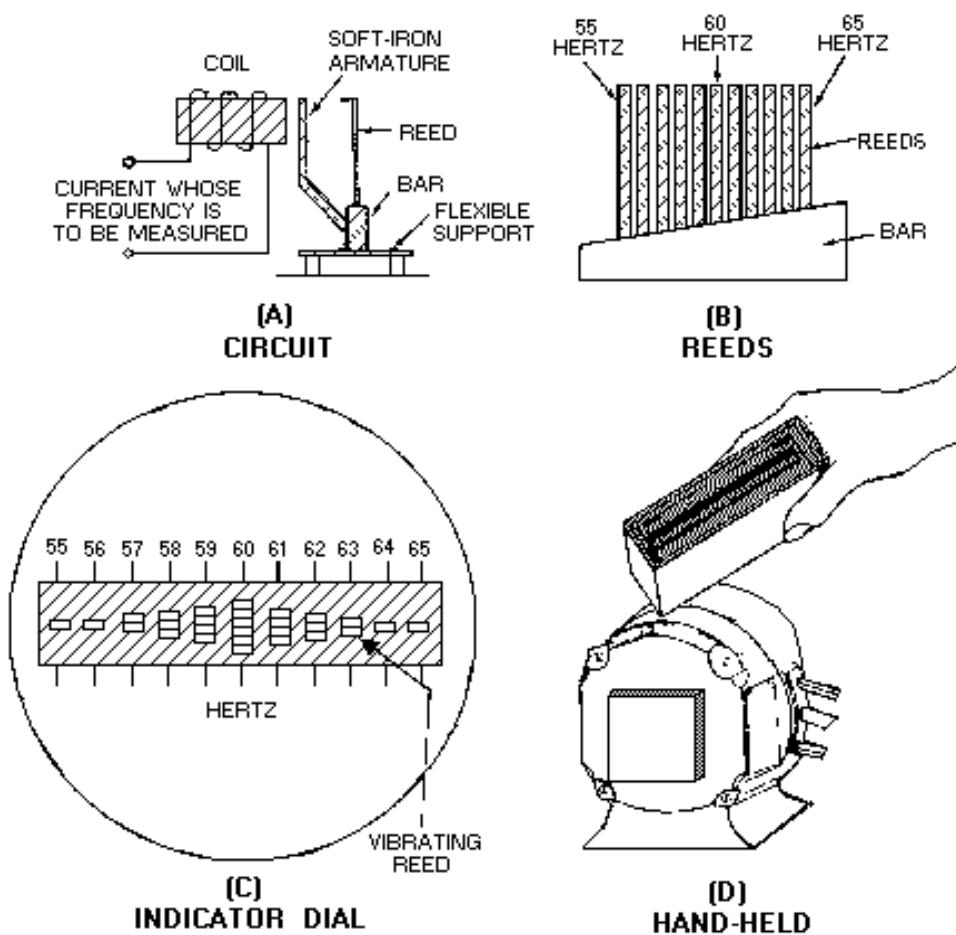

**Figure 2-8.—Vibrating-reed frequency meter.**

When the coil is energized by a current with a frequency between 55 and 65 hertz, all the reeds are vibrated slightly; but, the reed having a natural frequency closest to that of the energizing current vibrates through a larger amplitude. The frequency is read from the scale value opposite the reed having the greatest amplitude of vibration.

In some instruments, the reeds are the same length; but they are weighted by different amounts at the top so they will have different natural rates of vibration. An end view of the reeds in the indicator is shown in view C. If the energizing current has a frequency of 60 hertz, the reed marked 60 will vibrate the greatest amount, as shown. View D shows a hand-held vibrating-reed frequency meter mounted on the casing of a motor-generator.

### **Tuned Circuits**

TUNED CIRCUITS are used as filters for the passage or rejection of specific frequencies. BANDPASS FILTERS and BAND-REJECT FILTERS are examples of this type. Tuned circuits have certain characteristics that make them ideal for certain types of filters, especially where a high degree of selectivity is desired. A series-tuned circuit offers a low impedance to currents of the particular frequency to which the circuit is tuned and a relatively high impedance to currents of all other frequencies. A parallel-tuned circuit, on the other hand, offers a very high impedance to currents of its natural, or resonant, frequency and a relatively low impedance to others. If you feel you need to review the subject of tuned circuits at this time, refer to NEETS, Module 9, *Introduction to Wave-Generation and Wave-Shaping Circuits*, for more information on these circuits and their applications.

### **AUDIO FREQUENCIES**

Frequency measurements in the af range can be made by the comparison method or the directreading frequency meter. Frequency comparisons can be made by the use of a calibrated af generator in conjunction with either an oscilloscope or a modulator and a zero-beat indicating device. Direct-reading frequency measurements can be made by instruments using series, frequency-selective electrical networks, bridge test sets having null indicators, or counting-type frequency meters.

### **Heterodyne Frequency Meters**

Heterodyne frequency meters are available in several varieties. They measure the frequency of the unknown signal by matching the unknown signal with a locally generated signal of the same frequency obtained from a calibrated, precision oscillator. This method is normally referred to as *zero beating*. When a perfect frequency match is obtained, it is indicated by the absence of a beat note (zero beat). The technician generally uses a set of headphones to detect a zero-beat condition in the equipment being tested.

The basic heterodyne meter (figure 2-9) is a calibrated variable oscillator, which heterodynes against the frequency to be measured. Coupling is accomplished between the frequency meter and the output of the equipment under test. (NOTE: This coupling should be in accordance with the step-by-step procedures listed in the technical manual for the frequency meter.) The calibrated oscillator is then tuned so that the difference between the oscillator frequency and the unknown frequency is in the af range. This difference in frequency is known as the BEAT FREQUENCY. As the two frequencies are brought closer to the same value, the tone in the headset will decrease in pitch until it is replaced by a series of rapid clicks. As the process is continued, the clicks will decrease in rapidity until they stop altogether. This is the point of zero beat; that is, the point at which the frequency generated in the oscillator of the frequency meter is equal to the frequency of the unknown signal being measured.

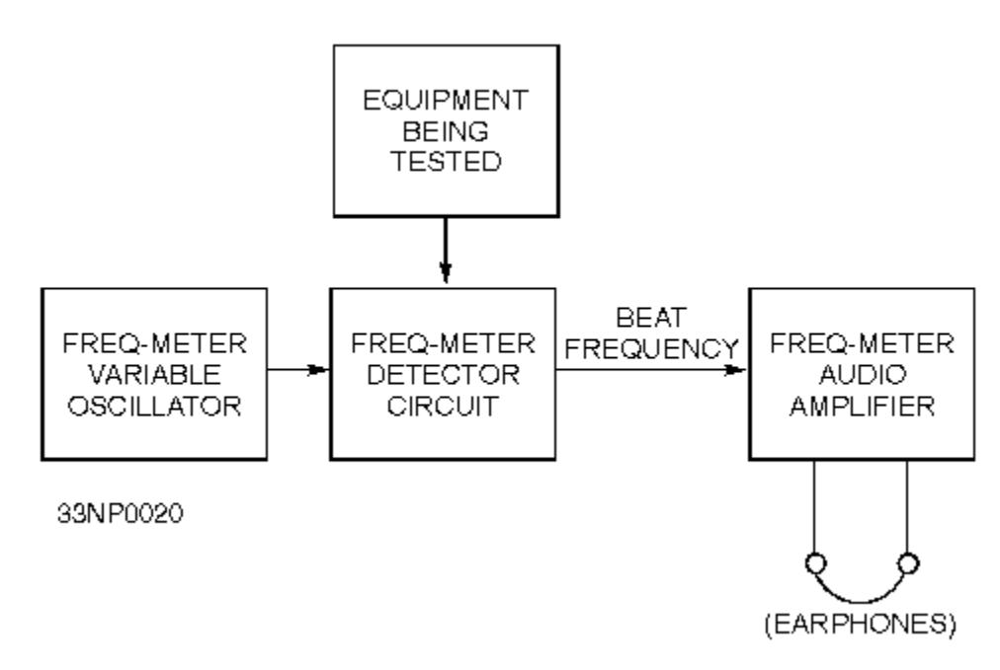

**Figure 2-9.—Basic heterodyne meter (block diagram).**

### *Q-7. In a heterodyne-type frequency meter, what is the difference between the oscillator frequency and the unknown frequency?*

For all practical purposes, the point of zero beat can be assumed when the clicks are heard at infrequent intervals. Figure 2-10 illustrates the zero-beat concept. Maintaining a condition of absolute silence in the earphones is extremely difficult when you are making this measurement. When the incoming signal is strong, the clicks are sharp and distinct. When the signal is weak, the zero-beat condition is evidenced by a slowly changing "swishing" or "rushing" sound in the headset. After the zero beat is obtained, the dial reading corresponds to the frequency measured.

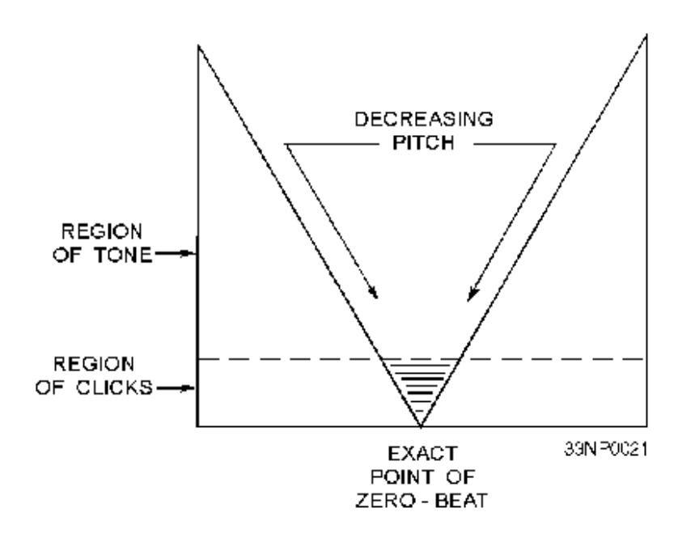

**Figure 2-10.—Graph of sound heard in earphone when zero beating.**

The manufacturer's calibration book is a very important part of the frequency meter package; in fact, the book is so important that it bears the same serial number as the heterodyne-type frequency meter itself. Contained in this book is a list of the dial settings and the corresponding frequencies produced by that meter at those dial settings. Operating instructions for the meter are also included.

### **Absorption Wavemeter**

WAVEMETERS are calibrated resonant circuits used to measure frequency. The accuracy of wavemeters is not as high as that of heterodyne-type frequency meters; however, they have the advantage of being comparatively simple and can be easily carried.

### *Q-8. What equipment uses a calibrated resonant circuit to measure frequency?*

Any type of resonant circuit can be used in wavemeter applications. The exact kind of circuit used depends on the frequency range for which the meter is intended. Resonant circuits consisting of coils and capacitors are used for VLF through VHF wavemeters.

The simplified illustration of an absorption wavemeter, shown in figure 2-11, consists of a pickup coil, a fixed capacitor, a lamp, a variable capacitor, and a calibrated dial. When the wavemeter's components are at resonance, maximum current flows in the loop, illuminating the lamp to maximum brilliance. The calibrated dial setting is converted to a frequency by means of a chart, or graph, in the instruction manual. If the lamp glows very brightly, the wavemeter should be coupled more loosely to the circuit. For greatest accuracy, the wavemeter should be coupled so that its indicator lamp provides only a faint glow when tuned to the resonant frequency.

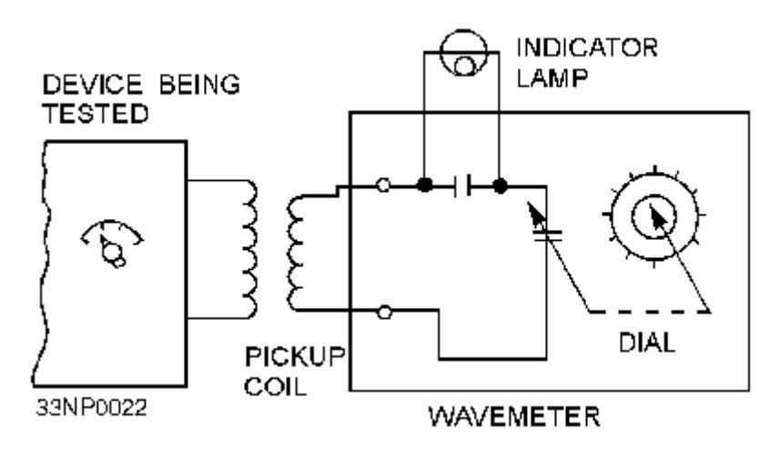

**Figure 2-11.—Absorption wavemeter circuit.**

### **FREQUENCIES ABOVE THE AUDIO RANGE**

The signal frequencies of radio and radar equipments that operate in the UHF and SHF ranges can be measured by resonant, cavity-type wavemeters or resonant, coaxial-line-type wavemeters. When properly calibrated, resonant-cavity and resonant-coaxial line wavemeters are more accurate and have better stability than wavemeters used for measurements in the LF to VHF ranges. These frequency-measuring instruments are often furnished as part of the equipment. They are also available as general-purpose test sets.

Although many wavemeters are used in performing various functions, the cavity-type wavemeter is the type most commonly used. Only this type is discussed in some detail.

### **Cavity Wavemeter**

Figure 2-12 shows a typical CAVITY WAVEMETER. The wavemeter is of the type commonly used for the measurement of microwave frequencies. The device uses a resonant cavity. The resonant frequency of the cavity is varied by means of a plunger, which is mechanically connected to a micrometer mechanism. Movement of the plunger into the cavity reduces the cavity size and increases the resonant frequency. Conversely, an increase in the size of the cavity (made by withdrawing the plunger) lowers the resonant frequency. The microwave energy from the equipment being tested is fed into the wavemeter through one of two inputs, **A** or **B**. The crystal rectifier then detects (rectifies) the signal. The rectified current is indicated on current meter **M**.

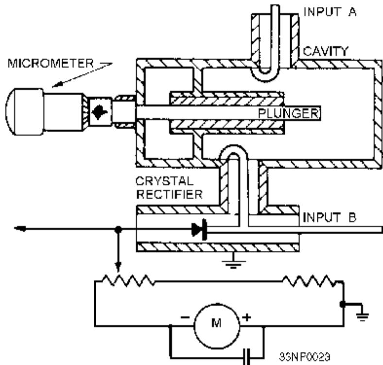

**Figure 2-12.—Typical cavity wavemeter.**

### **Electronic Frequency Counters**

Another device used to measure frequencies above the audio range is the ELECTRONIC FREQUENCY COUNTER. Since this instrument will be covered in detail in a later chapter, only a brief description is provided at this time.

The electronic frequency counter is a high-speed electronic counter with an accurate, crystalcontrolled time base. This combination provides a frequency counter that automatically counts and displays the number of events occurring in a precise time interval. The frequency counter itself does not generate any signal; it merely counts the recurring pulses fed to it.

### **WAVEFORM ANALYSIS**

WAVEFORM ANALYSIS can be made by observing displays of voltage and current variations with respect to time or by harmonic analysis of complex signals. Waveform displays are particularly valuable for adjusting and testing pulse-generating, pulse-forming, and pulse-amplifying circuits. The waveform visual display is also useful for determining signal distortion, phase shift, modulation factor, frequency, and peak-to-peak voltage.

Waveform analysis is used in various electrical and electronic equipment troubleshooting. This section will briefly discuss the oscilloscope and spectrum analyzer to provide you with basic knowledge of this test equipment.

*Q-9. Name two instruments used to analyze waveforms.*

### **USE OF THE OSCILLOSCOPE**

The CATHODE-RAY OSCILLOSCOPE (CRO or O-SCOPE) is commonly used for the analysis of waveforms generated by electronic equipment. Several types of cathode-ray oscilloscopes are available for making waveform analysis. The oscilloscope required for a particular test is determined by characteristics such as input-frequency response, input impedance, sensitivity, sweep rate, and the methods of sweep control. The SYNCHROSCOPE is an adaptation of the cathode-ray oscilloscope. It features a wide-band amplifier, triggered sweep, and retrace blanking circuits. These circuits are desirable for the analysis of pulse waveforms.

Oscilloscopes are also part of some harmonic analysis test equipments that display harmonic energy levels. To effectively analyze waveform displays, you must know the correct wave shape. The maintenance instructions manual for each piece of equipment illustrates what waveforms you should observe at the various test points throughout the equipment. Waveforms that will be observed at any one selected test point will differ; each waveform will depend on whether the operation of the equipment is normal or abnormal.

The display observed on a cathode-ray oscilloscope is ordinarily one similar to those shown in figure 2-13. Views A and B show the instantaneous voltage of the wave plotted against time. Elapsed time (view A) is indicated by horizontal distance, from left to right, across the etched grid (graticule) placed over the face of the tube. The amplitude (view B) of the wave is measured vertically on the graph.

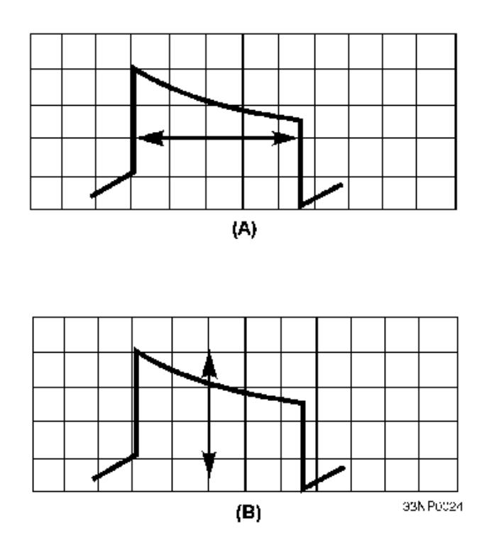

**Figure 2-13.—Typical waveform displays.**

The oscilloscope is also used to picture changes in quantities other than simply the voltages in electric circuits. For example, if you need to see the changes in waveform of an electric current, you must first send the current through a small resistor. You can then use the oscilloscope to view the voltage wave across the resistor. Other quantities, such as temperatures, pressures, speeds, and accelerations, can be translated into voltages by means of suitable transducers and then viewed on the oscilloscope. A detailed discussion of the oscilloscope is presented in chapter 6 of this module.

### **USE OF THE SPECTRUM ANALYZER**

The SPECTRUM ANALYZER is a device that sweeps over a band of frequencies to determine (1) what frequencies are being produced by a specific circuit under test and (2) the amplitude of each frequency component. To accomplish this, the spectrum analyzer first presents a pattern on a display. Then the relative amplitudes of the various frequencies of the spectrum of the pattern are plotted (see figure 2-14). On the vertical, or Y axis, the **amplitudes** are plotted; on the horizontal, or X axis, the frequencies (time base) are plotted. The overall pattern of this display indicates the proportion of power present at the various frequencies within the SPECTRUM (fundamental frequency with sideband frequencies).

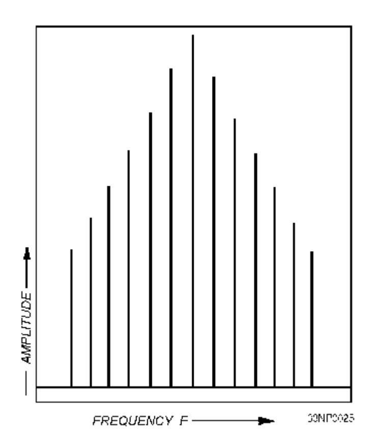

**Figure 2-14.—Spectrum analyzer pattern.**

### *Q-10. What device sweeps a band of frequencies to determine frequencies and amplitudes of each frequency component?*

The spectrum analyzer is used to examine the frequency spectrum of radar transmissions, local oscillators, test sets, and other equipment operating within its frequency range. Proper interpretation of the displayed frequency spectrum enables you to determine the degree of efficiency of the equipment under test. With experience, you will be able to determine definite areas of malfunctioning components within equipment. In any event, successful spectrum analysis depends on the proper operation of a spectrum analyzer and your ability to correctly interpret the displayed frequencies. Later, in chapter 6, we will discuss the various controls, indicators, and connectors contained on the spectrum analyzer.

### **TESTING SEMICONDUCTOR DEVICES**

Because of the reliability of semiconductor devices, servicing techniques developed for transistorized equipment differ from those normally used for electron-tube circuits. Electron tubes are usually considered to be the circuit component most susceptible to failure and are normally the first components to be tested. Transistors, however, are capable of operating in excess of 30,000 hours at maximum rating without failure. They are often soldered in the circuit in much the same manner as resistors and capacitors. Therefore, they are NOT so quickly removed for testing as tubes.

Substitution of a semiconductor diode or transistor known to be in good condition is one method of determining the quality of a questionable semiconductor device. This method should be used only after you have made voltage and resistance measurements. This ensures the circuit has no defect that might

damage the substitute semiconductor device. If more than one defective semiconductor is present in the equipment section where trouble has been localized, the semiconductor replacement method becomes cumbersome. Several semiconductors may have to be replaced before the trouble is corrected. To determine which stage(s) failed and which semiconductors are not defective, you must test all the removed semiconductors. You can do this by observing whether the equipment operates correctly as you reinsert each of the removed semiconductor devices into the equipment.

### **TESTING DIODES**

Semiconductor diodes, such as general-purpose germanium and silicon diodes, power silicon diodes, and microwave silicon diodes, can be tested effectively under actual operating conditions. However, crystal-rectifier testers are available to determine dc characteristics that provide an indication of crystaldiode quality.

A common type of crystal-diode test set is a combination ohmmeter-ammeter. Measurements of forward resistance, back resistance, and reverse current can be made with this equipment. Using the results of these measurements, you can determine the relative condition of these components by comparing their measured values with typical values obtained from test information furnished with the test set or from the manufacturer's data sheets. A check that provides a rough indication of the rectifying property of a diode is the comparison of the back-and-forward resistance of the diode at a specified voltage. A typical back-to-forward-resistance ratio is on the order of 10 to 1, and a forward-resistance value of 50 to 80 ohms is common.

*Q-11. What is the typical back-to-forward resistance ratio of a good-quality diode?*

### **Testing Diodes with an Ohmmeter**

A convenient test for a semiconductor diode requires only an ohmmeter. The back-and-forward resistance can be measured at a voltage determined by the battery potential of the ohmmeter and the resistance range at which the meter is set. When the test leads of the ohmmeter are connected to the diode, a resistance will be measured that is different from the resistance indicated if the leads are reversed. The smaller value is called the FORWARD RESISTANCE, and the larger value is called the BACK RESISTANCE. If the ratio of back-to-forward resistance is greater than 10 to 1, the diode should be capable of functioning as a rectifier. However, keep in mind that this is a very limited test that does not take into account the action of the diode at voltages of different magnitudes and frequencies. (**NOTE**: This test should never be used to test crystal mixer diodes in radars. It will destroy their sensitivity.)

### **Testing Diodes with Oscilloscopes**

An oscilloscope can be used to graphically display the back-and-forward resistance characteristics of a crystal diode. A circuit used in conjunction with an oscilloscope to make this test is shown in figure 2- 15. This circuit uses the oscilloscope line-test voltage as the test signal. A series circuit (composed of resistor R1 and the internal resistance in the line-test circuit) decreases a 3-volt, open-circuit test voltage to a value of approximately 2 volts peak to peak.

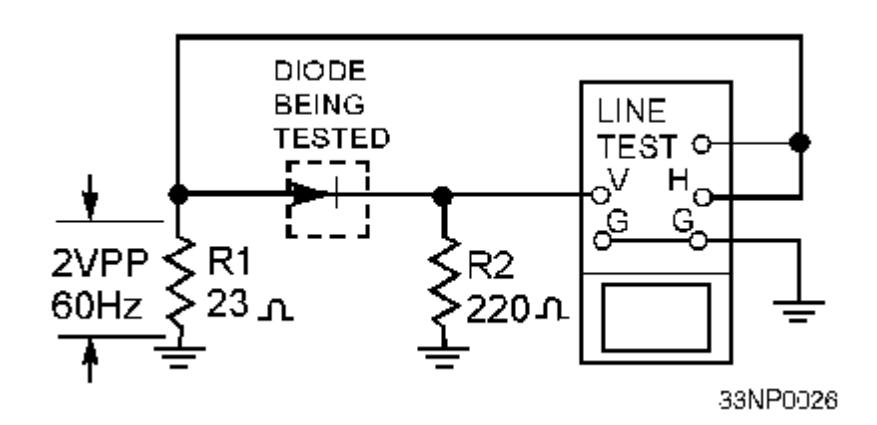

**Figure 2-15.—Testing semiconductor diodes with an oscilloscope.**

The test signal applied to the crystal diode is also connected to the horizontal input of the oscilloscope. The horizontal sweep represents the voltage applied to the diode under test. The voltage developed across current-measuring resistor R2 is applied to the vertical input of the oscilloscope. Because this voltage is proportional to the current through the diode being tested, the vertical deflection will indicate crystal current. The resulting oscilloscope trace for a normal diode is similar to the curve shown in figure 2-16.

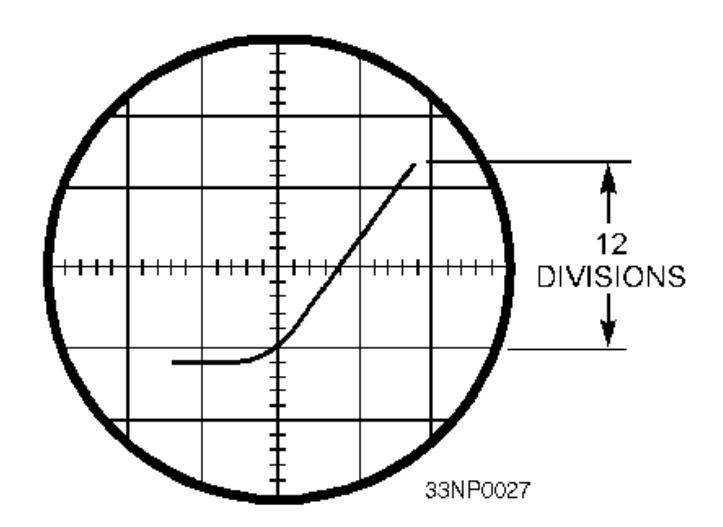

**Figure 2-16.—Characteristic curve of a semiconductor diode.**

To test Zener diodes, you must use a higher voltage than the oscilloscope line-test signal. This test can be made with a diode test set or with the circuit shown in figure 2-17. In this circuit, rheostat R1 is used to adjust the input voltage to a suitable value for the Zener diode being tested. Resistor R2 limits the current through the diode. The signal voltage applied to the diode is also connected to the horizontal input of the oscilloscope. The voltage developed across current-measuring resistor R3 is applied to the vertical input of the oscilloscope. The horizontal sweep represents the applied voltage, and the vertical deflection indicates the current through the diode being tested. Figure 2-18 shows the characteristic pattern of a Zener diode. Note the sharp increase in current at the Zener voltage (avalanche) point. For the Zener diode to be usable, this voltage must be within limits specified by the manufacturer.

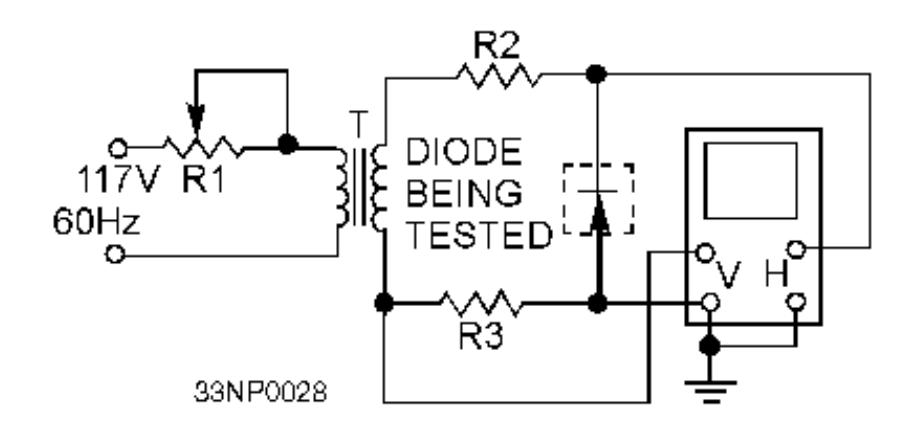

**Figure 2-17.—Testing a Zener diode.**

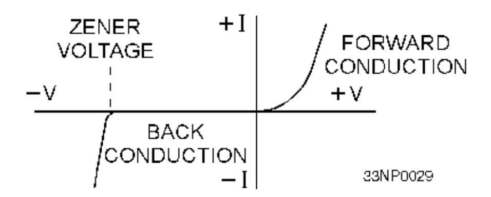

**Figure 2-18.—Zener diode characteristic curve.**

### **TESTING TRANSISTORS**

Most transistorized equipments use printed circuit boards on which components are neatly arranged. This arrangement makes the transistors and other components easy to reach while you are troubleshooting and servicing the equipment. While investigating with test probes, however, you must be careful to prevent damage to the printed wiring.

One of the outstanding advantages of transistors is their reliability. Tube failures account for over 90 percent of the failures in electron-tube equipments. Transistors, however, are long lived. This factor, among others, decreases maintenance required to keep transistorized equipment operating. The techniques used in testing transistorized equipment are similar to those for maintaining electron-tube circuits. Basically, these techniques include several checks and inspections.

### **Power Supply Checks**

When using test equipment to localize a trouble, you should check the power supply to see that its output voltages are present and of the correct values. Improper power supply voltages can cause odd effects. You will prevent many headaches by checking the power supply first.

### **Visual Inspection**

Visual inspection is a good maintenance technique. Occasionally, you will find loose wires or faulty connections, making extensive voltage checks unnecessary.

### **Transistor Checks**

Transistors can be checked by substitution. Transistors, however, have a characteristic known as *leakage current*, which may affect the results obtained when the substitution method is used.

The leakage current may influence the current gain or amplification factor of the transistor. Therefore, a particular transistor might operate properly in one circuit and not in another. This characteristic is more critical in certain applications than in others. As the transistor ages, the amount of leakage current tends to increase. One type of transistor checker used is the semiconductor test set. This test set can be used either for in-circuit or out-of-circuit tests or for collector leakage current or current gain. You should use extreme care when substituting transistors. More and more transistors have specific current and breakdown voltage requirements that may affect how they operate within a given circuit.

*Q-12. As a transistor ages, what happens to the leakage current?*

### **Voltage Checks**

Voltage measurements provide a means of checking circuit conditions in a transistorized circuit just as they do in checking conditions in a tube circuit. The voltages, however, are much lower than in a tube circuit. The bias voltage between the base and emitter, for instance, is usually 0.05 to 0.20 volts. When making checks, observe polarity.

### **Resistance Checks**

Transistors have little tendency to burn or change value because of low voltage in their circuits. They can, however, be permanently damaged by high-voltage conditions that occur when the collector voltage is increased. They can also be permanently damaged when the ambient temperature increases and causes excessive collector current flow. Transistors are easily damaged by high current; therefore, resistance measurements must not be taken with an ohmmeter that provides a maximum current output in excess of 1 milliampere. If you are not sure that the range of ohmmeter you want to use is below the 1 milliampere level, connect the ohmmeter to a milliammeter and check it. See figure 2-19 for a method of measuring the current from an ohmmeter.

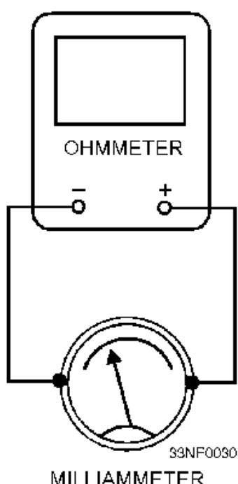

**Figure 2-19.—Measuring current passed by an ohmmeter.**

Resistance measurements usually are not made in transistorized circuits, except when you are checking for open windings in transformers and coils. When a resistance check is required, the transistors are usually removed from the circuit. Resistance checks cannot test all the characteristics of transistors, especially transistors designed for high frequencies or fast switching. The ohmmeter is capable of making simple transistor tests, such as open and short tests.

Refer to NEETS, Module 7, *Introduction to Solid-State Devices and Power Supplies*, for a review of transistor and semiconductor terms and theory.

### **SUMMARY**

The important points of this chapter are summarized in the following paragraphs:

The **BEL** is a unit that expresses the logarithmic ratio between the input and output of any given component, circuit, or system and can be expressed in terms of voltage, current, or power.

Any figure expressed in bels can be converted to DECIBELS by multiplying the figure by 10. The decibel cannot be used to represent actual power, only a ratio of one power to another.

The abbreviation dBm is used to represent power levels above or below a 1 milliwatt reference level.

A **BOLOMETER** is a device that undergoes changes in resistance as changes in dissipated power occur. The two types of bolometers most often used are the barretter and the thermistor.

**FREQUENCY MEASUREMENTS** can be divided into two broad categories: mechanical-rotation frequency and electrical-output frequency measurements.

**MECHANICAL ROTATION** frequency is measured using a device called a TACHOMETER. Three basic tachometers are used for measuring mechanical rotation frequency—the CENTRIFUGAL tachometer, the CHRONOMETRIC tachometer, and the STROBOSCOPIC tachometer.

**ELECTRICAL-OUTPUT** frequencies of ac generators can be measured by VIBRATING-REED devices or TUNED CIRCUITS.

**AUDIO FREQUENCIES** can be measured by a process known as ZERO BEATING. This is done by matching an unknown signal with a locally generated signal of the same frequency obtained from a calibrated high-precision oscillator. As the two frequencies are brought closer to the same value, they reach a point of zero beat. This is when the frequency generated in the oscillator is equal to the frequency of the unknown signal being measured. Another term for zero beating is HETERODYNING.

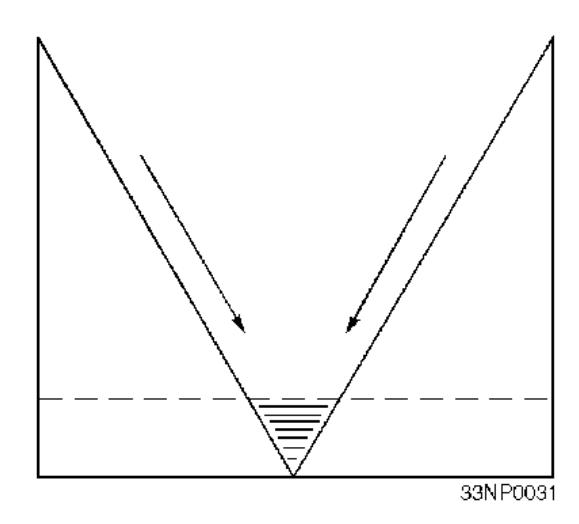

**WAVEMETERS** are calibrated resonant circuits used to measure frequency. Any type of resonant circuit can be used in wavemeter applications. The type used depends on the frequency range for which the meter is intended.

For measuring frequencies in the microwave range, the CAVITY WAVEMETER is the type most commonly used.

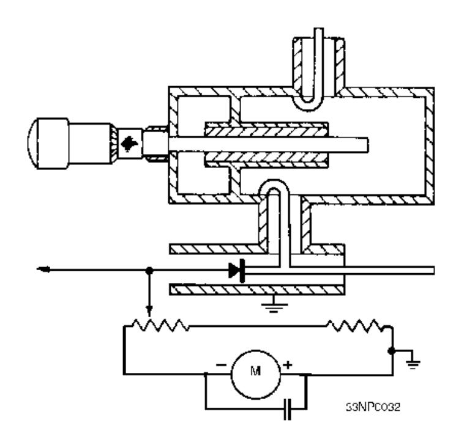

The **CATHODE-RAY OSCILLOSCOPE** and the SPECTRUM ANALYZER are used to perform WAVEFORM ANALYSIS.

A typical **BACK-TO-FORWARD-RESISTANCE** ratio for a diode is 10 to 1.

### *ANSWERS TO QUESTIONS Q1. THROUGH Q12.*

*A-1. Bel. A-2. dBm. A-3. 4 mW. A-4. Dummy load or dummy antenna. A-5. Barretter and thermistor. A-6. It increases. A-7. Beat frequency. A-8. Wavemeter. A-9. Oscilloscope and spectrum analyzer. A-10. Spectrum analyzer. A-11. 10-to-1 ratio. A-12. It tends to increase.*

# **CHAPTER 3 BASIC METERS**

### **LEARNING OBJECTIVES**

Upon completing this chapter, you should be able to:

- 1. Describe the basic theory of the galvanometer.
- 2. Describe the basic theory of the D'Arsonval meter movement.
- 3. State the proper procedure for connecting an ammeter to a circuit.
- 4. Define ammeter sensitivity.
- 5. State the proper procedure for connecting a voltmeter to a circuit.
- 6. Describe possible effects on a circuit caused by the connection of a voltmeter.
- 7. Define voltmeter sensitivity.
- 8. Describe the internal operation of an ohmmeter with the use of a block diagram.
- 9. Describe the operating procedure for using a megohmmeter.
- 10. Describe the use of the electrodynamometer-type meter as a voltmeter, ammeter, and wattmeter.
- 11. Describe the factors that limit wattmeter capability.
- 12. Describe an open circuit, a ground, a short, and the tests used to check for these conditions.

### **INTRODUCTION**

When troubleshooting, testing, or repairing electronic equipment, you will use various meters and other types of test equipment to check for proper circuit voltages, currents, resistances, and to determine if the wiring is defective. You may be able to connect these test instruments to a circuit and take readings without knowing just *how* the instruments operate. However, to be a competent technician, you need to be able to do more than merely read a test instrument. You need a basic knowledge of how test instruments operate. This chapter discusses the operating principles of some of the test instruments you will use in equipment troubleshooting.

### **METERS**

The best and most expensive measuring instrument is of no use to you unless you know what you are measuring and what each reading indicates. Remember that the purpose of a meter is to measure quantities existing within a circuit. For this reason, when the meter is connected to the circuit, it must not change the condition of the circuit.

### **METER POWER SOURCE**

Meters are either SELF-EXCITED or EXTERNALLY EXCITED. Self-excited meters operate from their own power sources. Externally excited meters get their power from the circuit to which they are connected. Most common meters (voltmeters, ammeters, and ohmmeters) that you use in your work operate on the electromagnetic principle. All measuring instruments must have some form of indicating device, usually a meter, to be of any use to you. The most basic indicating device used in instruments that measure current and voltage operates by using the interaction between the magnetic fields associated with current flow in the circuit. Before continuing, you might want to review the properties of magnetism and electromagnetism in NEETS, Module 1, *Introduction to Matter, Energy, and Direct Current*.

*Q-1. What meters operate from their own power sources?*

### **BASIC METER MOVEMENT**

A stationary, permanent-magnet, moving-coil meter is the basic meter movement used in most measuring instruments used for servicing electrical equipment. When current flows through the coil, a resulting magnetic field reacts with the magnetic field of the permanent magnet and causes the movable coil to rotate. The greater the intensity of current flow through the coil, the stronger the magnetic field produced; the stronger the magnetic field produced, the greater the rotation of the coil. The GALVANOMETER is an example of one type of stationary, permanent-magnet, moving-coil measuring instrument.

### **Galvanometer**

The galvanometer is used to measure very low currents, such as those in bridge circuits. In modified form, the galvanometer has the highest sensitivity of any of the various types of meters in use today. A simplified diagram of a galvanometer is shown in figure 3-1. It is different from other instruments used for the same purpose because its movable coil is suspended by means of metal ribbons instead of a shaft and jewel-bearing arrangement often used in other instruments.

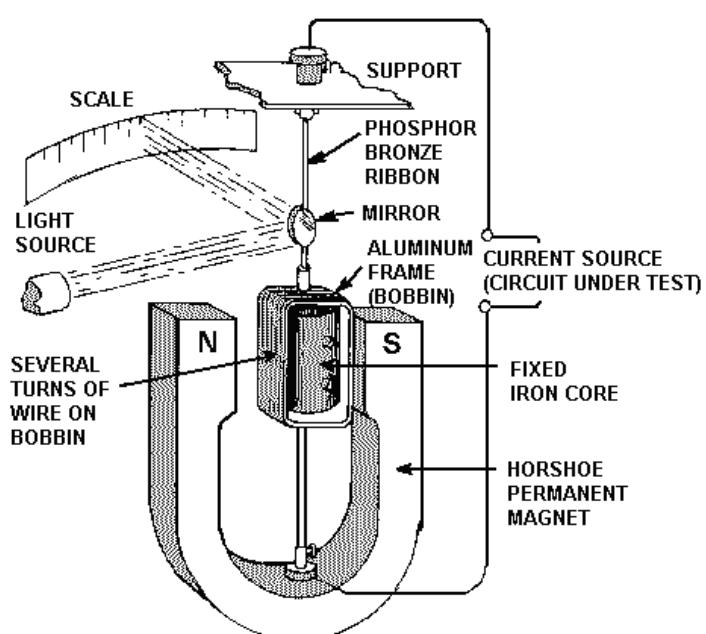

**Figure 3-1.—Simplified galvanometer.**

The movable coil is wrapped around the aluminum frame of the galvanometer. The coil is suspended between the poles of the magnet by means of thin, flat ribbons of phosphor bronze. These ribbons provide a conduction path for the current between the circuit being tested and the movable coil. The ribbons allow the coil to twist in response to the interaction of the applied current through the coil and the magnetic field of the permanent magnet. They also provide the restoring force for the coil. Basically, the restoring force is that force necessary to return the movable frame to its resting position after a reading. The ribbons restrain or provide a counterforce to the magnetic force acting on the coil. When the driving force of the coil current is removed, the restoring force provided by the ribbons returns the coil to its zero position.

### *Q-2. What physical component of a galvanometer provides the restoring force for the coil?*

To determine the amount of current flow, we must have a means to indicate the amount of coil rotation. Either of two methods may be used: (1) the **POINTER** arrangement or (2) the **LIGHT AND MIRROR** arrangement.

### *Q-3. In a galvanometer, what two methods are used to indicate the amount of coil rotation?*

In the pointer arrangement, one end of the pointer is mechanically connected to the rotating coil; as the coil moves, the pointer also moves. The other end of the pointer moves across a graduated scale and indicates the amount of current flow. The overall simplicity of this arrangement is its main advantage. However, a disadvantage of this arrangement is that it introduces a mechanical coil balancing problem, especially if the pointer is long.

### *Q-4. What is the primary disadvantage of the pointer arrangement for indicating coil rotation?*

In the light and mirror arrangement, the use of a mirror and a beam of light simplifies the problem of coil balance. When this arrangement is used to measure the turning of the coil, a small mirror is mounted on the supporting ribbon, as shown in figure 3-1. An internal light source is directed to the mirror and then reflected to the scale of the meter. As the movable coil turns, so does the mirror. This causes the light reflection to move across the graduated scale of the meter. The movement of the reflection is proportional to the movement of the coil; therefore, the intensity of the current being measured by the meter is accurately indicated.

If the beam of light and mirror arrangement is used, the beam of light is swept to the right or left across a translucent screen (scale). The translucent screen is divided uniformly with the zero reading located at center scale. If the pointer arrangement is used, the pointer is moved in a horizontal plane to the right or left across a scale that is divided uniformly with the zero reading at the center. The direction in which the beam of light or the pointer moves depends on the direction (polarity) of current through the coil.

### **D'Arsonval Meter Movement**

Most dc instruments use meters based on some form of the D'Arsonval meter movement. In D'Arsonval-type meters, the length of the conductor and the strength of the field between the poles of the magnet are fixed. Therefore, any change in current causes a proportional change in the force acting on the coil. Figure 3-2 is a simplified diagram showing the principle of the D'Arsonval movement.

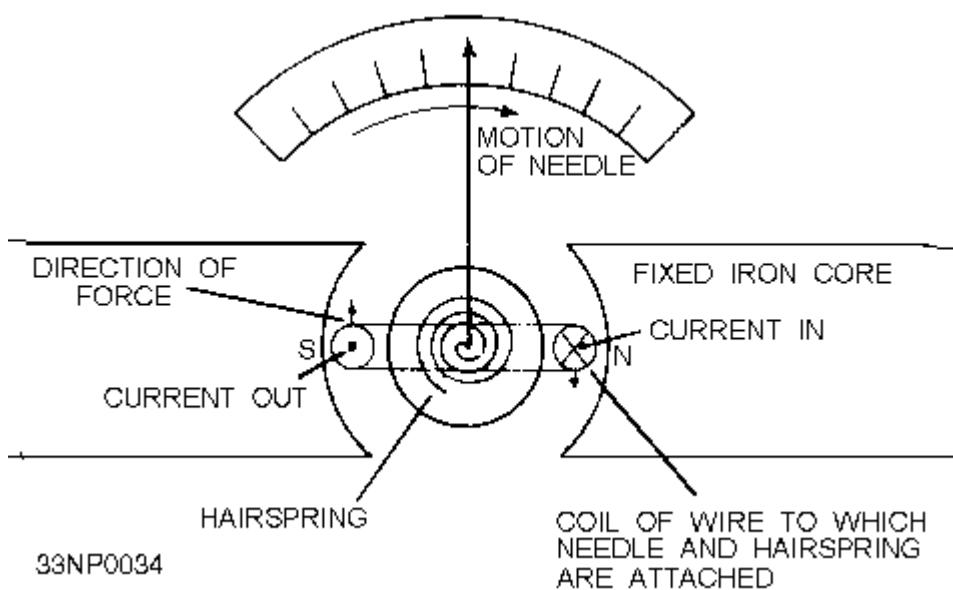

**Figure 3-2.—D'Arsonval meter movement.**

In the figure, only one turn of wire is shown; however, in an actual meter movement, many turns of fine wire would be used, each turn adding more effective length to the coil. The coil is wound on an aluminum frame (bobbin) to which the pointer is attached. Oppositely wound hairsprings (only one is shown in the figure) are also attached to the bobbin, one at either end. The circuit to the coil is completed through the hairsprings. In addition to serving as conductors, the hairsprings serve as the restoring force that returns the pointer to the zero position when no current flows.

### *Q-5. What component of the D'Arsonval meter movement completes the circuit for current flow to the coil?*

**COIL MOVEMENT**.—As we discussed previously, the deflecting (moving) force on the coil is proportional to the current flowing through the coil. This deflecting force tends to cause the coil to rotate against the restraining force of the hairsprings. When the deflecting force and the restraining force are equal, the coil and the pointer stop moving. As we have just stated, the deflecting force is proportional to the current in the coil, the angle (amount) of rotation is proportional to the deflecting force; therefore, the angle of rotation is proportional to the current through the coil. When current stops flowing through the coil, the deflecting force stops, and the restoring force of the springs returns the pointer to the zero position.

### *Q-6. What component supplies restoring force to the coil of the D'Arsonval meter movement?*

**DIRECTION OF FORCE**.—The current through the single turn of wire is in the direction indicated in the figure (away from you on the right-hand side and toward you on the left-hand side). If we apply the right-hand motor rule, the direction of force is upward on the left-hand side and downward on the right-hand side; therefore, the direction of motion of the coil and pointer is clockwise. If the current were reversed in the wire, the direction of motion of the coil and pointer would be reversed. For a review of the right-hand rule for motors, refer to NEETS, Module 5, *Introduction to Generators and Motors*.

**PRINCIPLE OF OPERATION**.—A more detailed view of the basic D'Arsonval movement, as it is used in ammeters and voltmeters, is shown in figure 3-3. The principle of operation is the same as that discussed in the simplified version. The iron core is rigidly supported between the pole pieces; it serves to

concentrate the flux in the narrow space between the iron core and the pole piece. Current flows into one hairspring, through the coil, and out the other hairspring. The restoring forces of the spiral springs return the pointer to the normal zero position when the current through the coil is interrupted. Conductors connect the hairsprings with the outside terminals of the meter. If the instrument is not DAMPED to absorb the energy of the moving element, the pointer will oscillate (vibrate) for a period of time before coming to a stop in its final position. Damping is an energy-absorbing system that prevents this.

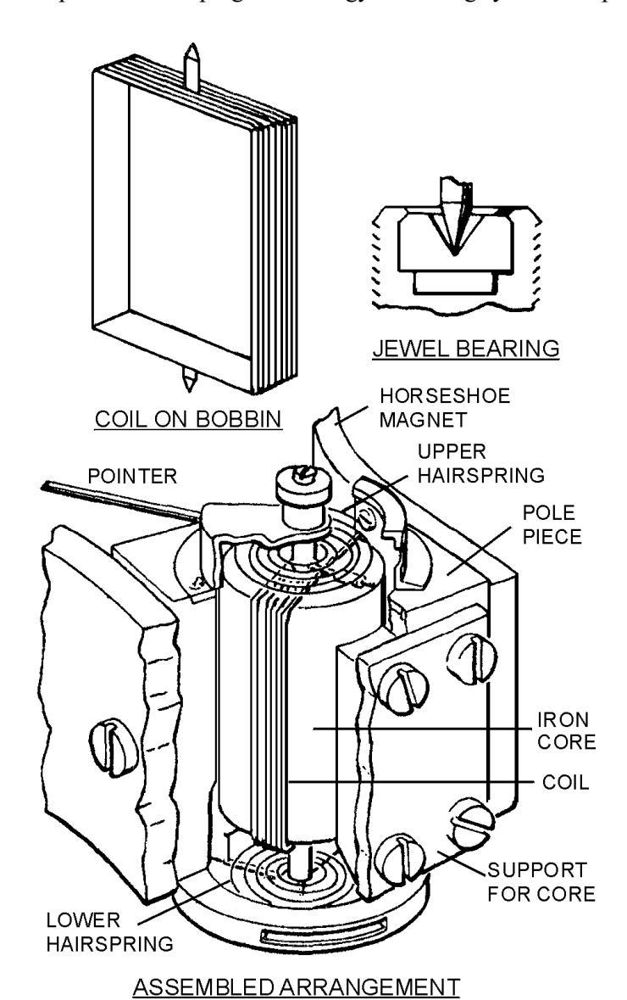

### **Figure 3-3.—Detailed view of the basic D'Arsonval meter movement.**

**DAMPING**.—This is accomplished in many D'Arsonval movements by means of the motion of the aluminum bobbin on which the coil is wound. As the bobbin rotates in the magnetic field, an electromotive force is induced into it as it cuts through the lines of force. Induced currents flow in the bobbin in a direction opposite to the motion; this causes the bobbin to go beyond its final position only once before stopping. The overall sensitivity of the meter can be increased by the use of a lightweight rotating assembly (bobbin, coil, and pointer) and by the use of jewel bearings, as shown in figure 3-3.

**POLE CONSTRUCTION**.—Note that the pole pieces in figures 3-2 and 3-3 have curved faces. You can see the advantage of this type of construction if you remember that lines of force enter and leave a magnetic field in the air gap at right angles to the coil, regardless of the angular position of the coil. Because of this type of construction, a more linear scale is possible than if the pole faces were flat.

*Q-7. What advantage is gained by using pole pieces with curved faces in the D'Arsonval meter movement?*

### **DC AMMETER**

The movable coil of the D'Arsonval meter movement we have been discussing up to now uses smallsize wire in its windings. This small-size wire places limits on the amount of current that can be safely passed through the coil. Therefore, the basic D'Arsonval movement discussed can be used to indicate or measure only very small currents. Certain circuit changes must be made to the basic D'Arsonval meter movement for it to be practical in everyday use. To measure large currents, you must use a SHUNT with the meter.

### **Shunts**

A shunt is a physically large, low-resistance conductor connected in parallel (shunt) with the meter terminals. It is used to carry the majority of the load current. Such a shunt is designed with the correct amount of resistance so that only a small portion of the total current flows through the meter coil. The meter current is proportional to the total load current. If the shunt is of such a value that the meter is calibrated in milliamperes, the instrument is called a MILLIAMMETER. If the shunt has such a value that the meter must be calibrated in terms of amperes, it is called an AMMETER.

*Q-8. What structurally large, low-resistance conductor is connected in parallel with the meter movement to prevent damage?*

**SHUNT RESISTANCE**.—A single, standardized meter movement is normally used in all ammeters, no matter what the range is for a particular meter. For example, meters with working ranges of 0 to 10 amperes, 0 to 5 amperes, or 0 to 1 ampere all use the same meter movement. The various ranges are achieved through the use of different values of shunt resistance with the same meter movement. The designer of the ammeter simply calculates the correct shunt resistance required to extend the range of the meter movement to measure any desired value of current. This shunt is then connected across the meter terminals. Shunts may be located inside the meter case (internal shunts) with the proper switching arrangements for changing them. They may also be located outside the meter case (external shunts) with the necessary leads to connect them to the meter.

**EXTERNAL SHUNTS**.—An external-shunt circuit is shown in figure 3-4, view A. Typical external shunts are shown in view B. View C shows a meter movement mounted within the case. The case provides protection against breakage, magnetic shielding in some cases, and portability.

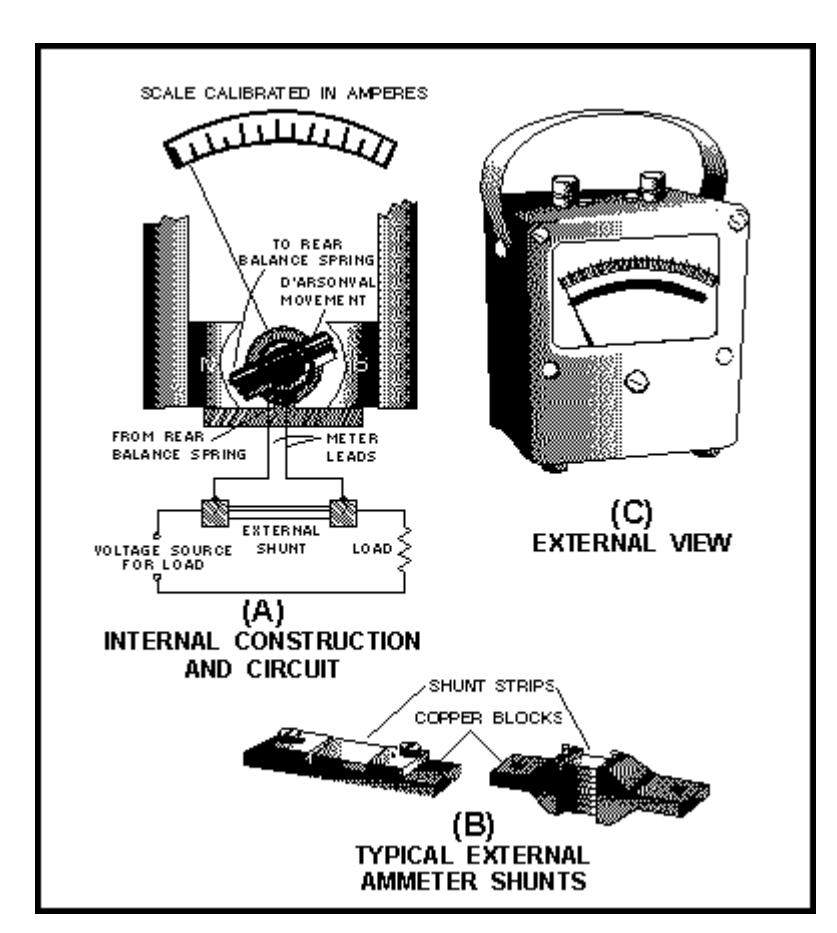

**Figure 3-4.—Dc ammeter using the D'Arsonval movement with external shunts.**

**SHUNT CONSTRUCTION**.—The shunt strips (view B of figure 3-4) are usually made of the alloy *Manganin*. Manganin has a temperature coefficient of almost zero. The zero-temperature coefficient property is desirable because of the heavy currents that often flow through shunts producing heat. A zerotemperature coefficient material is not affected by this heat; therefore, it remains stable in temperature. Most other materials increase their resistance as they are heated. If shunts were made of these materials, they would carry less current. More and more current would flow through the meter movement, and the chances of damage would increase. Using shunts constructed with zero-temperature coefficient materials eliminates this problem.

### *Q-9. What type of temperature coefficient material does not produce increased heat in response to increased current flow?*

The ends of the shunt strips are embedded in heavy copper blocks. The blocks are attached to the meter coil leads and the line terminals. To ensure accurate readings, you should not interchangeably use the meter leads for a particular ammeter with those for a meter of a different range. Slight changes in lead length and size may vary the resistance of the meter circuit. If this happens, current will also change and cause incorrect meter readings. External shunts are generally used where currents greater than 50 amperes must be measured.

**SHUNT SELECTION**.—When using an external-shunt ammeter, you should select a suitable shunt so that the scale deflection can be easily read. For example, if the scale has 150 divisions and the load current you want to measure is known to be between 50 and 100 amperes, a 150-ampere shunt would be the correct choice. Under these conditions, each division of the scale represents 1 ampere. In other words,

a full-scale deflection of the pointer would rest on the 150th division mark, indicating that 150 amperes of load current is flowing. At half-scale deflection, the pointer would rest on the 75th division mark, indicating that 75 amperes of load current is flowing.

A shunt having exactly the same current rating as the expected normal load current should **never** be selected. If you were to select such a shunt, higher than normal load currents could possibly drive the pointer off scale and damage the meter movement. A good choice of shunt values will place the indicating needle somewhere near the midscale indication when the load current you are reading is normal. For example, assume that the meter scale is divided into 100 equal divisions and you want to measure a current of 60 amperes. The shunt to use would be a 100-ampere shunt. This would make each division of the scale equal to 1 ampere. The meter indication would fall on the 60th division showing that 60 amperes of load current is flowing. Therefore, an allowance (40 amperes) remains for unexpected surge currents.

*Q-10. A good choice of shunt resistance will place the indicating pointer near what part of the meter scale with a normal load?*

**INTERNAL SHUNTS FOR METERS IN THE 0- TO 50-AMPERE RANGE**.—When measuring current ranges below 50 amperes, you will most often use internal shunts (Rshunt). In this way, you can easily change the range of the meter by means of a switching arrangement. A switch will select the correct internal shunt with the necessary current rating and resistance. Before you can calculate the required resistance of the shunt for each range, the total resistance of the meter movement must be known. For example, suppose you desire to use a 100-microampere D'Arsonval meter with an internal coil resistance of 100 ohms to measure line currents up to 1 ampere. The meter will deflect to its full-scale position when the current through the deflection coil is 100 microamperes.

Since the coil resistance is 100 ohms, you can calculate the coil's voltage (E*coil*) by using Ohm's law, as follows:

When the pointer is deflected to full scale, 100 microamperes of current flows through the coil and 0.01 volt drops across it. Remember, 100 microamperes is the maximum safe current for this meter movement. Exceeding this value will damage the meter. The shunt must carry any additional load current.

The meter coil has a 0.01 volt drop across it, and, because the shunt and coil are in parallel, the shunt also has a voltage drop of 0.01 volt. The current that flows through the shunt is the difference between the full-scale meter current and the line current being fed into the shunt. In this case, meter current is 100 microamperes. Full-scale deflection is desired only when the total current is 1 ampere. Therefore, the shunt current must equal 1 ampere minus 100 microamperes, or 0.9999 ampere. Ohm's law is again used to provide the approximate value of required shunt resistance (R*shunt*), as follows:

To increase the range of the 100-microampere meter to 1 ampere (full-scale deflection), place a 0.01 ohm shunt in parallel with the meter movement.

You can convert the 100-microampere instrument to a 10-ampere meter by using a proper shunt. The voltage drop for a full-scale deflection is still 0.01 volt across the coil and the shunt. The meter current is still 100 microamperes. The shunt current must therefore be 9.9999 amperes under full-scale deflection. Again, this is an approximate figure found by the application of Ohm's law.

You can also convert the same instrument to a 50-ampere meter by using the proper shunt resistance, as follows:

**INTERNAL SHUNTS FOR METERS IN THE MILLIAMPERE RANGE**.—The above method of computing the shunt resistance is satisfactory in most cases; however, it can only be used when the line current is in the ampere range and the meter current is relatively small compared to the load current. In such cases, you can use an approximate value of resistance for the shunt, as was done above. However, when the line current is in the milliampere range and the coil current becomes an appreciable percentage of the line current, a more accurate calculation must be made. For example, suppose you desire to use a meter movement that has a full-scale deflection of 1 milliampere and a coil resistance of 50 ohms to measure currents up to 10 milliamperes. Using Ohm's law, you can figure the voltage (E*coil*) across the meter coil (and the shunt) at full-scale deflection, as follows:

The current that flows through the shunt (I*shunt*) is the difference between the line current and the meter current, as figured below:

The shunt resistance (R*s*hunt) may then be figured, as follows:

The formula for determining the resistance of the shunt is given by R*s* = I*m* /I*s* times R*m*, where Rs is the shunt resistance in ohms; Im is the meter current at full-scale deflection; I*s* is the shunt current at fullscale deflection; and R*m* is the resistance of the meter coil. If the values given in the previous example are used in this equation, it will yield 5.55 ohms, the value previously calculated.

**SWITCHING SHUNT VALUES**.—Various values of shunt resistance can be used, by means of a suitable switching arrangement, to increase the number of current ranges that can be covered by the meter. Two switching arrangements are shown in figure 3-5. View A is the simpler of the two arrangements when a number of shunts are used to calculate the values of the shunt resistors. However, it has two disadvantages:

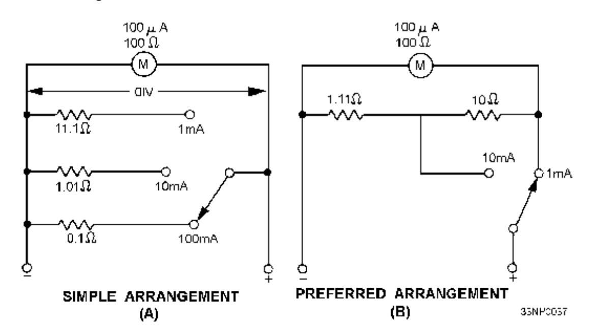

**Figure 3-5.—Ways of connecting internal meter shunts.**

- 1. When the switch is moved from one shunt resistor to another, the shunt is momentarily removed from the meter. The line current then flows through the meter coil. Even a momentary surge of current could easily damage the coil.
- 2. The contact resistance (resistance between the blades of the switch when they are in contact) is in series with the shunt, but not with the meter coil. In shunts that must pass high currents, this contact resistance becomes an appreciable part of the total shunt resistance. Because the contact resistance is of a variable nature, the ammeter indication may not be accurate.

The generally preferred method of range switching is shown in (figure 3-5, view B). Although only two ranges are shown, as many ranges as needed can be used. In this type of circuit, the contact resistance of the range-selector switch is external to the shunt and meter in each range position. The contact resistance in this case has no effect on the accuracy of the current measurement.

### **Ammeter Connections**

When you are using ammeters, a primary rule of safety is that such current-measuring instruments must always be connected **in series** with a circuit, never in parallel with it. When an ammeter is connected across a constant-potential source of appreciable voltage, the low internal resistance of the meter bypasses the circuit resistance. This results in the application of the source voltage (or a good

portion of it) directly to the meter terminals. The resulting excessive current burns up the meter coil and renders the meter useless until repaired.

### *Q-11. In what manner are current-measuring instruments connected to a circuit?*

If you do not know the approximate value of current in the circuit, you should take a reading at the highest range of the ammeter; then you should switch progressively to lower ranges until a suitable reading is obtained. Most ammeter scales indicate the current being measured in increasing values from left to right. If you connect the meter without observing proper polarity, the pointer may be deflected backwards (from right to left). This action often damages the meter movement. You should ensure that the ammeter is always connected so that the current will flow into the negative terminal and out the positive terminal. Figure 3-6 shows various circuit arrangements and the proper ammeter connection methods to measure current in various portions of the circuit.

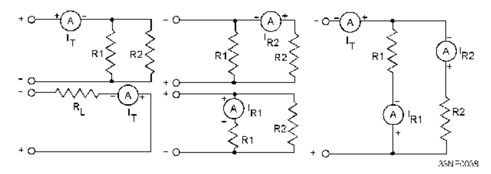

**Figure 3-6.—Proper ammeter connection.**

### *Q-12. An ammeter should always be connected so that current will flow into what terminal and out of what terminal?*

### **Ammeter Sensitivity**

Ammeter sensitivity is determined by the amount of current required by the meter coil to produce full-scale deflection of the pointer. The smaller the amount of current required to produce this deflection, the greater the sensitivity of the meter. A meter movement that requires only 100 microamperes for fullscale deflection has a greater sensitivity than a meter movement that requires 1 milliampere for the same deflection.

### *Q-13. (True or False) The larger the current required to produce full-scale deflection of the meter coil, the better the sensitivity of the meter.*

Good sensitivity is especially important in ammeters to be used in circuits in which small currents flow. As the meter is connected in series with the load, the current flows through the meter. If the internal resistance of the meter is a large portion of the load resistance, an effect known as METER-LOADING will occur. Meter-loading is the condition that exists when the insertion of a meter into a circuit changes the operation of that circuit. This condition is not desirable. The purpose of inserting a meter into a circuit is to allow the measurement of circuit current in the normal operating condition. If the meter changes the

circuit operation and changes the amount of current flow, the reading you obtain will be in error. An example of this is shown in figure 3-7.

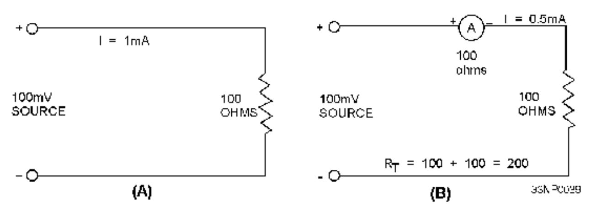

**Figure 3-7.—Ammeter loading effect.**

### *Q-14. What condition exists when the insertion of a meter into a circuit changes the operation of the circuit?*

In view A of figure 3-7, the circuit to be tested has an applied voltage of 100 millivolts and a resistance of 100 ohms. The current normally flowing in this circuit is 1 milliampere. In view B, an ammeter that requires 1 milliampere for full-scale deflection and that has an internal resistance of 100 ohms has been inserted. Since 1 milliampere of current flow is shown in view A, you might naturally assume that with the meter inserted into the circuit, a full-scale deflection will occur. You might also assume that the 1 milliampere of circuit current will be measured. However, neither of these assumptions is correct. With the ammeter inserted into the circuit, as shown in view B, the total resistance of the circuit is 200 ohms. With an applied voltage of 100 millivolts, applying Ohm's law shows the actual current (I*circuit*) to be 0.5 milliampere.

Since the meter reads 0.5 milliampere instead of the normal value of current, the meter reveals that a definite loading effect has taken place. In cases such as this, the use of ammeters, which have a lower internal resistance and a better current sensitivity, is desirable.

### **DC VOLTMETER**

Up to this point, we have been discussing the 100-microampere D'Arsonval movement and its use as an ammeter. However, it can also be used to measure voltage if a MULTIPLIER (high resistance) is placed in series with the moving coil of the meter. For low-voltage instruments, this resistance is physically mounted inside the meter case with the D'Arsonval movement. The series resistance is constructed of a wire-wound resistance that has a low temperature coefficient wound on either a spool or

card frame. For high-voltage ranges, the series resistance can be connected externally. A simplified diagram of a voltmeter is shown in figure 3-8.

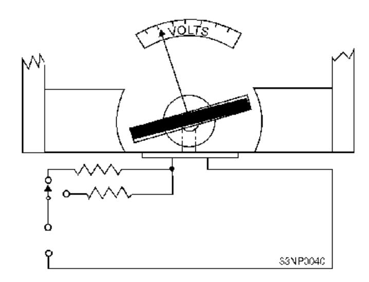

**Figure 3-8.—Internal construction and circuit of a simplified voltmeter.**

### *Q-15. What modification is made to the D'Arsonval meter movement to enable the meter to measure voltage?*

Keep in mind that the D'Arsonval meter movement uses current flow to produce a magnetic field that is proportional to the current. The meter movement is, therefore, an indicator of current flow rather than voltage. The addition of the series resistance is what allows the meter to be calibrated in terms of voltage; that is, the meter movement of a voltmeter operates because of the current flow through the meter, but the scale is marked in volts. For example, the meter movement shown in figure 3-9 has an internal resistance of 100 ohms, requires 100 microamperes for full-scale deflection, and has a voltage drop of 10 millivolts when full-scale deflection is reached. If you were to place this meter directly across a 10-volt source, an excessive current (in milliamperes) would flow. The meter would be destroyed because of the excessive current flowing through the meter movement. This can be seen in the following Ohm's law application:

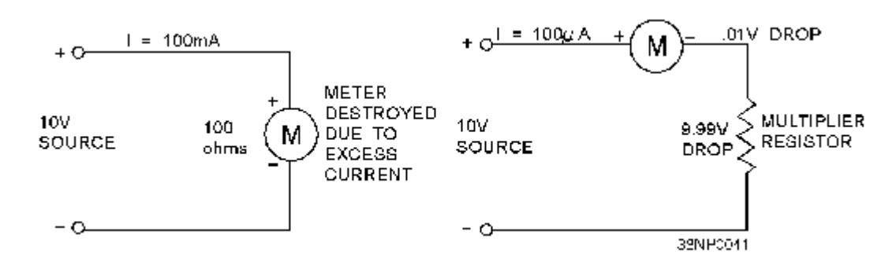

**Figure 3-9.—Use of multiplier resistors with D'Arsonval meter movement.**

Using this equation, you can see that a current through the meter of 100 milliamperes is excessive and will cause damage.

Since the normal voltage drop for the meter is 10 millivolts at full-scale deflection, some means must be supplied to drop the extra 9.99 volts without applying it directly to the meter. This is done by the addition of a multiplier resistor, as shown in figure 3-9.

### **Extending Voltmeter Ranges**

The value of series resistance is determined by the current required for full-scale deflection and by the range of the voltages to be measured. Since the current through the meter circuit is directly proportional to the applied voltage, the meter scale can be calibrated directly in volts for a fixed value of series resistance. For example, let's assume that the basic meter is to be made into a voltmeter with a fullscale deflection of 1 volt. The coil resistance of the basic meter is 100 ohms, and 100 microamperes of current causes full-scale deflection. The resistance (R *meter*) required to limit the total current in the circuit to 100 microamperes can be found as follows:

Because the meter coil already measures 100 ohms, the series resistance required is equal to 10 kilohms minus 100 ohms, or 9.9 kilohms.

### *Q-16. What factors determine the value of the multiplier resistor?*

Multirange voltmeters use one meter movement. The required resistances are connected in series with the meter by a switching arrangement. A schematic diagram of a multirange voltmeter with three ranges is shown in figure 3-10. The total meter resistance (R *meter*) for each of the three ranges, beginning with the 1-volt range, is figured by the application of Ohm's law, as follows:

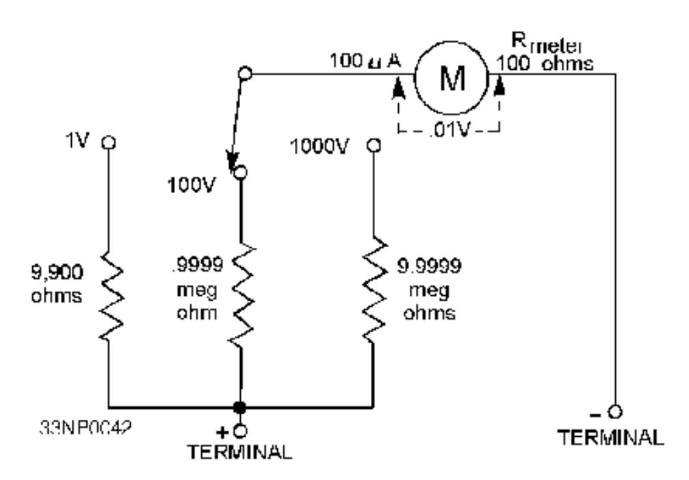

**Figure 3-10.—Multirange voltmeter.**

The actual value of the multiplying series resistor (R*series*) for each of these circuits is 100 ohms less than the total resistance. This allows for the resistance of the meter coil (R*coil*).

### **Voltmeter Circuit Connections**

When voltmeters are used, a primary rule of safety is that such voltage-measuring instruments must always be connected in **parallel** with (across) a circuit. If you are unsure of the level of the voltage to be measured, take a reading at the highest range of the voltmeter and progressively (step by step) lower the range until a suitable reading is obtained. In many cases, the voltmeter you will be using will not be a

center-zero- (0 reading is in the center) indicating instrument. Observing the correct polarity is important when connecting the instrument to the circuit. Voltmeter polarity is the same as for the dc ammeter; that is, current flows from negative to positive.

*Q-17. In what manner are voltage-measuring instruments connected to the circuit to be measured?*

### **Influence of a Voltmeter in a Circuit**

The purpose of a voltmeter is to indicate the potential difference between two points in a circuit. When a voltmeter is connected across a circuit, it shunts the circuit. If the voltmeter has a low resistance, it will draw a substantial amount of current. This action lowers the effective resistance of the circuit and changes the voltage reading. When you are making voltage measurements in high-resistance circuits, use a HIGH-RESISTANCE VOLTMETER to prevent the shunting action of the voltmeter. The effect is less noticeable in low-resistance circuits because the shunting effect is less. The problem of voltmeter shunting (sometimes called circuit loading) is illustrated in figure 3-11.

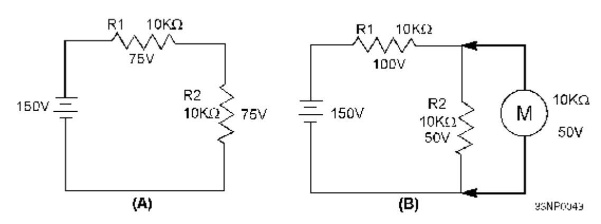

**Figure 3-11.—Shunting action caused by a voltmeter.**

*Q-18. When making voltage measurements in a high-resistance circuit, you should always use a voltmeter with what relative value of resistance?*

In view A of figure 3-11, a source of 150 volts is applied to a series circuit consisting of two 10 kilohm resistors. View A shows the voltage drop across each resistor to be 75 volts. In the 150-volt range, the voltmeter to be used has a total internal resistance of 10 kilohms. View B shows the voltmeter connected across the circuit. The parallel combination of R2 and the meter now present a total resistance of 5 kilohms. Because of the addition of the voltmeter, the voltage drops change to 100 volts across R1 and 50 volts across R2. Notice that this is not the normal voltage drop across R2. Actual circuit conditions have been altered because of the voltmeter.

### **Voltmeter Sensitivity**

The sensitivity of a voltmeter is given in ohms per volt. It is determined by dividing the sum of the resistance of the meter (R*meter*), plus the series resistance (R*series*), by the full-scale reading in volts. In equation form, sensitivity is expressed as follows:

This is the same as saying the sensitivity is equal to the reciprocal of the full-scale deflection current. In equation form, this is expressed as follows:

Therefore, the sensitivity of a 100-microampere movement is the reciprocal of 0.0001 ampere, or 10,000 ohms per volt.

*Q-19. What term is used to express the sensitivity of a voltmeter?*

### **METERS USED FOR MEASURING RESISTANCE**

The two instruments you will use most often to check continuity, or to measure the resistance of a circuit or circuit component, are the OHMMETER and the MEGGER (MEGOHMMETER). The ohmmeter is widely used to measure resistance and to check the continuity of electrical circuits and devices. Its range usually extends to only a few megohms. The megger is widely used for measuring insulation resistance, such as that between a wire and the outer surface of its insulation, and the insulation resistance of cables and insulators. The range of a megger can be extended to more than 1,000 megohms.

*Q-20. What instrument is used for measuring the insulation resistance of cables?*

### **The Ohmmeter**

A simple ohmmeter circuit is shown in figure 3-12. The ohmmeter consists of the dc milliammeter, discussed earlier in this chapter, and the added features shown below:

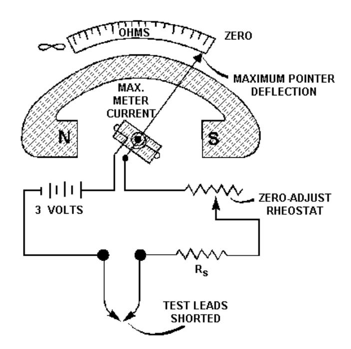

**Figure 3-12.—Simple ohmmeter circuit.**

- A source of dc potential; and
- One or more resistors (one of which is variable).

### *Q-21. What added features enable a dc milliammeter to function as an ohmmeter?*

The deflection of the pointer of an ohmmeter is controlled by the amount of battery current passing through the moving coil. Before you can measure the resistance of an unknown resistor or electrical circuit, you must calibrate the ohmmeter to be used. If the value of resistance to be measured can be estimated within reasonable limits, select a range on the ohmmeter that will give approximately half-scale deflection when the resistance is inserted between the probes. If you cannot estimate the resistance to be measured, then set the range switch on the highest scale. Whatever range you select, the meter must be calibrated to read zero before the unknown resistance is measured.

To calibrate the meter, you first short the test leads together, as shown in figure 3-12. With the test leads shorted, a complete series circuit exists. The complete series circuit consists of the 3-volt source, the resistance of the meter coil (R *meter*), the resistance of the zero-adjust rheostat, and the series multiplying resistor (R*series*). The shorted test leads cause current to flow and the meter pointer to deflect.

Notice that the zero point on the ohmmeter scale (as opposed to the zero points for voltage and current) is located at the extreme right side of the scale. With the test leads shorted, the zero-adjust potentiometer is set so that the pointer rests on the zero mark. Therefore, a full-scale deflection indicates zero resistance between the leads.

### *Q-22. A full-scale deflection on an ohmmeter scale indicates what resistance between the leads?*

If you change the range on the meter, you must "zero" (calibrate) the meter again to obtain an accurate reading. When you separate the test leads, the pointer of the meter will return to the left side of the scale. This action, as explained earlier, is caused by the restoring force of the spring tension acting on the movable coil assembly. The reading at the left side of the scale indicates an infinite resistance.

After you have adjusted the ohmmeter for zero reading, it is ready to be connected to a circuit to measure resistance. A typical circuit and ohmmeter arrangement is shown in figure 3-13. You must ensure that the power switch of the circuit to be measured is in the de-energized (OFF) position. This prevents the source voltage of the circuit from being applied to the meter, a condition that could cause severe damage to the meter movement.

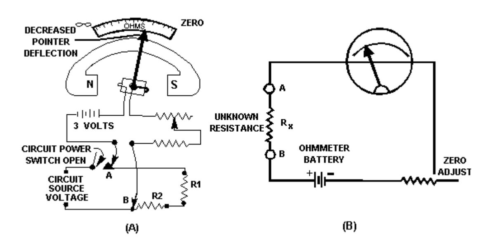

**Figure 3-13.—Measuring circuit resistance with an ohmmeter.**

Remember that the ohmmeter is an open circuit when the test leads are separated. To take a resistance reading with a meter, you must provide a path for current flow produced by the meter's battery. In view A of figure 3-13, the meter is connected at points **A** and **B** to produce this path. Connecting these test leads places resistors R1 and R2 in series with the resistance of the meter coil, the zero-adjust potentiometer, and the series multiplying resistor. Since you previously calibrated the meter, the amount of coil movement now depends only on the resistances of R1 and R2.

The addition of R1 and R2 into the meter circuit raises the total series resistance and decreases the current. This decreases the amount of pointer deflection. The pointer comes to rest at a scale reading that indicates the combined resistance of R1 and R2. If you were to replace either R1 or R2, or both, with a resistor having a larger ohmic value, the current flow in the moving coil of the meter would be decreased even more. This would further decrease the pointer deflection, and the scale indication would read a still higher circuit resistance. View B is a simplified version of the circuitry in view A.

From our ohmmeter discussion, two facts should be apparent: (1) Movement of the moving coil is proportional to the amount of current flow, and (2) the scale reading of the ohmmeter is inversely proportional to current flow in the moving coil.

The amount of circuit resistance to be measured may vary over a wide range. In some cases, it may only be a few ohms; in other cases, it may be as great as 1 megohm. Scale multiplication features are built into most ohmmeters so that they will indicate any ohmic value being measured and offer the least amount of error. Most ohmmeters are equipped with a selector switch for selecting the multiplication scale desired. For example, view A of figure 3-14 shows a typical meter that has a six-position switch. The positions are marked on the meter in multiples of 10, from R × 1 through R × 100K.

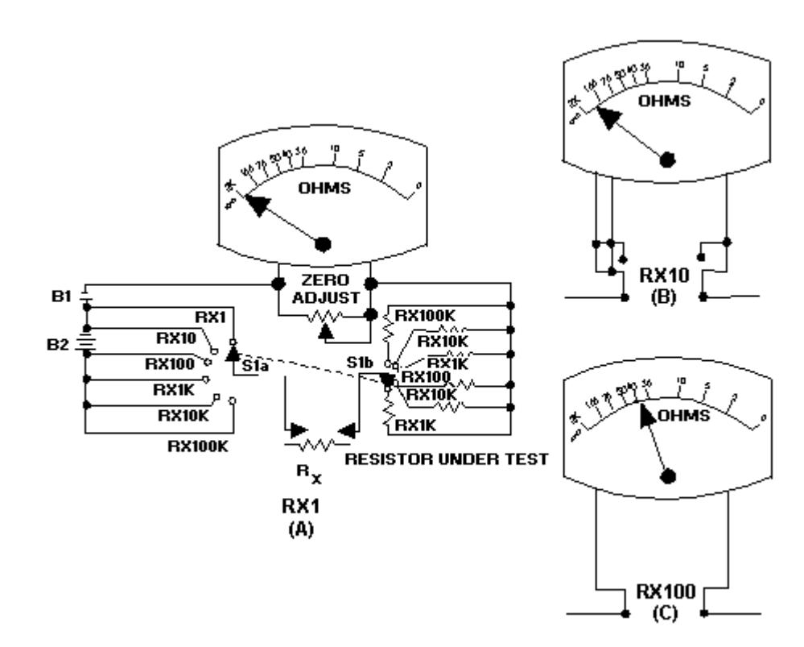

**Figure 3-14.—Ohmmeter with multiplication switch.**

The range used to measure any particular unknown resistance (Rx in view A of figure 3-14) depends on the approximate ohmic value of the unknown resistance. For instance, the ohmmeter scale of the figure is calibrated in divisions from 0 to infinity. Note that the divisions are easier to read on the right-hand portion of the scale than on the left. For this reason, if Rx is greater than 1,000 ohms and if you are using the R × 1 range, you will be unable to accurately read the indicated resistance. This happens because the combined series resistance of resistors Rx is too large for range R × 1 to allow enough battery current to flow to deflect the pointer away from infinity. You need to turn the range switch to the R × 10 position to obtain the 1,000-ohm reading.

Let's assume that you have changed the range switch to the R × 10 position and the pointer now deflects to a reading of 375 ohms, as shown in view B of figure 3-14. This would indicate to you that unknown resistance Rx has 3,750 (375 times 10) ohms of resistance. The change of range caused the deflection because resistor R × 10 has only 1/10 the resistance of resistor R × 1. Therefore, selecting the smaller series resistance allowed a battery current of sufficient value to cause a readable pointer deflection. If the R × 100 range were used to measure the same 3,750 ohm resistor, the pointer would deflect still further to the 37.5-ohm position, as shown in view C. This increased deflection would occur because resistor R × 100 has only 1/10 the resistance of resistor R × 10.

### *Q-23. The R* × *100 resistance selection on an ohmmeter has what amount of resistance compared to the R* × *10 selection?*

The circuit arrangement in view A of figure 3-14 allows the same amount of current to flow through the moving meter coil. The same amount is allowed to flow whether the meter measures 10,000 ohms on the R × 1 scale, 100,000 ohms on the R × 10 scale, or 1,000,000 ohms on the R × 100 scale.

The same amount of current must always be used to deflect the pointer to a certain position on the scale (midscale position, for example), regardless of the multiplication factor being used. Since the multiplier resistors are of different values, you must always "zero" the meter for each multiplication scale selected. When selecting a range on the ohmmeter, select the one that will result in the pointer coming to rest as close to the midpoint of the scale as possible. This will enable you to read the resistance more accurately because scale readings are more easily interpreted at or near midpoint.

### **The Megohmmeter**

An ordinary ohmmeter cannot be used for measuring multimillion ohm values of resistances, such as those in conductor insulation. To test for such insulation breakdown, you need to use a much higher potential than that supplied by the battery of an ohmmeter. This potential is placed between the conductor and the outside of the insulation. A megger (megohmmeter) is used for these tests. The megger, shown in figure 3-15, is a portable instrument consisting of two main elements: (1) a hand-driven dc generator, which supplies the necessary voltage for making the measurement, and (2) the instrument portion, which indicates the value of the resistance you are measuring. The instrument portion is of the opposed-coil type, as shown in view A. Coils **a** and **b** are mounted on movable member **c**. A fixed angular relationship exists between coils, and they are free to turn as a unit in a magnetic field. Coil **b** tends to move the pointer counterclockwise, and coil **a** tends to move it clockwise.

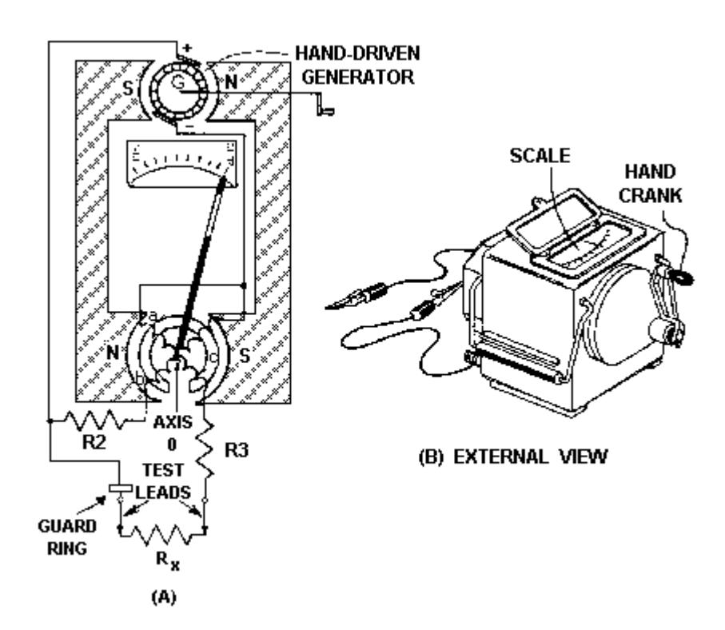

**Figure 3-15.—Megger internal circuit and external view.**

Coil **a** is connected in series with R3 and unknown resistance R*x*. The combination of coil **a**, R3, and R*x* forms a direct series path between the + and − brushes of the dc generator. Coil **b** is connected in series with R2, and this combination is also connected across the generator. Notice that the movable member (pointer) of the instrument portion of the megger has no restoring springs. Therefore, when the generator is not being operated, the pointer will float freely and may come to rest at any position on the scale.

The guard ring, shown in view A of figure 3-15, shunts any leakage currents to the negative side of the generator. This prevents such current from flowing through coil **a** and affecting the meter reading.

*Q-24. What is the purpose of the guard ring in a megohmmeter?*

If the test leads are open, no current will flow in coil **a**. However, current will flow internally through coil **b** and deflect the pointer to infinity. This reading indicates a resistance too large to measure. When a resistance, such as Rx, is connected between the test leads, current also flows in coil **a**; the pointer tends to move clockwise. At the same time, coil **b** still tends to move the pointer counterclockwise. Therefore, the moving element, composed of both coils and the pointer, comes to rest at a position in which the two forces are balanced. This position depends upon the value of Rx, which controls the amount of the current in coil **a**. Because changes in voltage affect both coils in the same proportion, the position of the moving element is independent of the voltage. If you short the test leads together, the pointer will come to rest at zero because the current in coil **a** is relatively large. Since R3 limits the current, the instrument will not be damaged under these circumstances. The external appearance of one type of megger is shown in view B of figure 3-15.

Most meggers you will use are rated at 500 volts; however, there are other types. Meggers are usually equipped with friction clutches, which are designed to slip if the generator is cranked faster than its rated speed. This prevents the generator speed and output voltage from exceeding rated values. A 1,000-volt generator is available for extended ranges. When an extremely high resistance, such as 10,000 megohms or more, is to be measured, a high voltage is needed to cause enough current flow to actuate the meter movement.

### **CAUTION**

**When using a megger, you can easily be injured or damage equipment if you do not observe the following MINIMUM safety precautions:**

- Use meggers on high-resistance measurements only (such as insulation measurements or to check two separate conductors on a cable).
- Never touch the test leads while the handle is being cranked.
- De-energize and discharge the circuit completely before connecting a megger.
- Whenever possible, disconnect the component being checked from other circuitry before using a megger

*Q-25. Most meggers you will use are rated at what voltage?*

*Q-26. The development of excessive test voltages is avoided by the use of meggers equipped with what device?*

### **ELECTRODYNAMOMETER-TYPE METERS**

The electrodynamometer-type meter differs from the galvanometer types we have just studied in that two fixed coils are used to produce the magnetic field instead of a permanent magnet. Two movable coils are also used in the electrodynamometer meter. The electrodynamometer meter is most commonly found in various types of power meters.

### *Q-27. What components in an electrodynamometer-type meter movement produce the magnetic field?*

As shown in figure 3-16, the fixed coils are connected in series and positioned coaxially (in line) with a space between them. The two movable coils are also positioned coaxially and are connected in series. The two pairs of coils (fixed pair and movable pair) are also connected in series with each other. The movable coil is pivot-mounted between the fixed coils. The main shaft on which the movable coils are mounted is restrained by spiral springs that restore the pointer to zero when no current is flowing through the coil. These springs also act as conductors for delivering current to the movable coils. Since these conducting springs are very small, the meter cannot carry a high value of current.

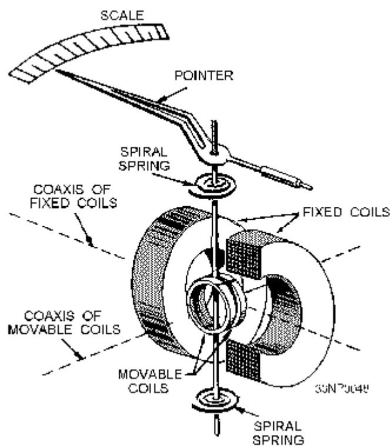

**Figure 3-16.—Internal construction of an electrodynamometer.**

*Q-28. What is the limiting factor as to the amount of current an electrodynamometer meter movement can handle?*

### **METER ACCURACY**

The meter is mechanically damped by means of aluminum vanes that move in enclosed air chambers. Although very accurate, electrodynamometer-type meters do not have the sensitivity of the D'Arsonval-type meter movement. For this reason, you will not find them used outside of the laboratory environment to a large extent.

### **METER MOVEMENT**

The primary advantage of the electrodynamometer-type meter movement is that it can be used to measure alternating as well as direct current. If you apply alternating current to the standard galvanometer-type meter, it will not produce a usable reading. Instead, the meter will vibrate at or near the zero reading. On one-half cycle of the ac, the meter is deflected to the left and on the other half cycle to the right. Since the frequencies you will be measuring are 60 hertz or greater, the meter is incapable of mechanically responding at this speed. The result is simply a vibration near the zero point; in addition, no useful reading of voltage or current is obtained. This problem does not exist with the electrodynamometer-type movement. Current flow through the stationary (fixed) coils sets up a magnetic field. Current flow through the moving coils sets up an opposing magnetic field. With two magnetic fields opposing, the pointer deflects to the right. If the current reverses direction, the magnetic fields of *both* sets of coils will be reversed. With both fields reversed, the coils still oppose each other, and the pointer still deflects to the right. Therefore, no rectifying devices are required to enable the electrodynamometer meter movement to read both ac and dc. Rectifying devices are required for the D'Arsonval-type meter movement to enable it to be used for measuring ac voltages and currents.

*Q-29. What is the primary advantage of the electrodynamometer-type meter over the D'Arsonval-type meter?*

### **VOLTMETER**

When an electrodynamometer is used as a voltmeter, no problems in construction are encountered because the current required is not more than 0.1 ampere. This amount of current can be handled easily by the spiral springs. When the electrodynamometer is used as a voltmeter, its internal connections and construction are as shown in view A of figure 3-17. Fixed coils **a** and **b** are wound of fine wire since the current flow through them will not exceed 0.1 ampere. They are connected directly in series with movable coil **c** and the series current-limiting resistor.

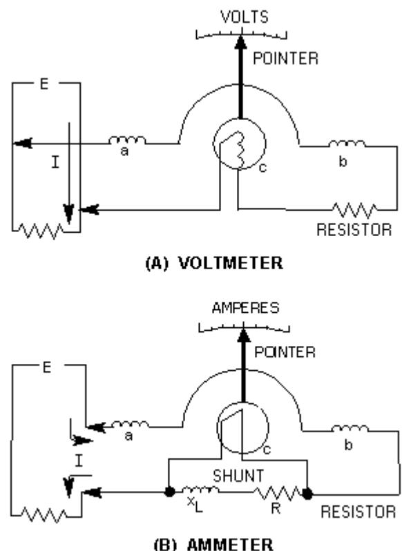

**Figure 3-17.—Circuit arrangement of electrodynamometer for use as a voltmeter and an ammeter.**

### **AMMETER**

When the electrodynamometer is used as an ammeter, a special type of construction must be used. This is because the large currents that flow through the meter cannot be carried through the moving coils. In the ammeter in view B of figure 3-17, stationary coils a and b are wound of heavier wire to carry up to 5.0 amperes. An inductive shunt (XL) is wired in parallel with the moving coils and permits only a small part of the total current to flow through the moving coil. The current flowing through the moving coil is directly proportional to the total current flowing through the instrument. The shunt has the same ratio of reactance to resistance as the moving coil does. Therefore, the instrument will be reasonably correct at frequencies at which it is used if ac currents are to be measured.

### **WATTMETER**

Electric power is measured by means of a wattmeter. This instrument is of the electrodynamometer type. As shown in figure 3-18, it consists of a pair of fixed coils, known as current coils, and a moving coil, called the voltage (potential) coil. The fixed current coils are wound with a few turns of a relatively large conductor. The voltage coil is wound with many turns of fine wire. It is mounted on a shaft that is supported in jeweled bearings so that it can turn inside the stationary coils. The movable coil carries a needle (pointer) that moves over a suitably graduated scale. Coil springs hold the needle at the zero position in the absence of a signal.

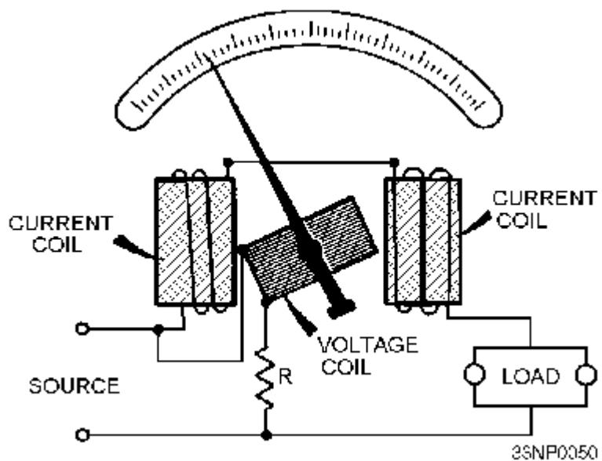

**Figure 3-18.—Simplified electrodynamometer wattmeter circuit.**

### **Wattmeter Connection**

The current coil of the wattmeter is connected in series with the circuit (load), and the voltage coil is connected across the line. When line current flows through the current coil of a wattmeter, a field is set up around the coil. The strength of this field is in phase with and proportional to the line current. The voltage coil of the wattmeter generally has a high-resistance resistor connected in series with it. The purpose for this connection is to make the voltage-coil circuit of the meter as purely resistive as possible. As a result, current in the voltage circuit is practically in phase with line voltage. Therefore, when voltage is

impressed on the voltage circuit, current is proportional to and in phase with the line voltage. Figure 3-19 shows the proper way to connect a wattmeter into a circuit.

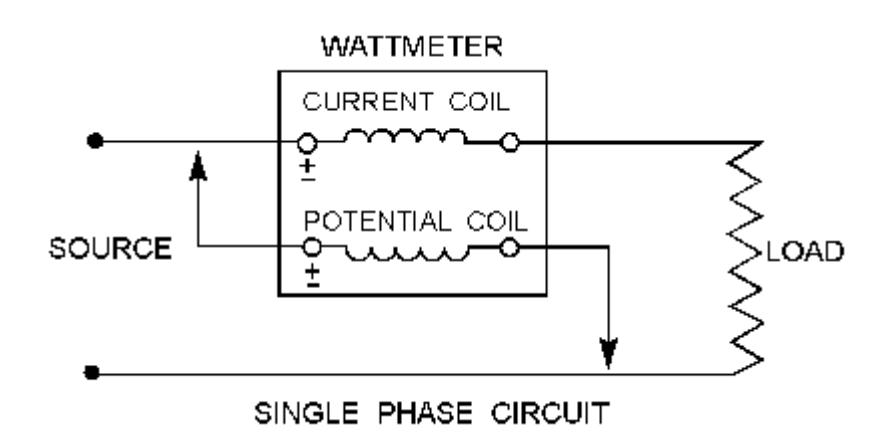

**Figure 3-19.—Wattmeter connection.**

### **Wattmeter Errors**

Electrodynamic wattmeters are subject to errors arising from such factors as temperature and frequency. For example, heat through the coils eventually causes the small springs attached to the pointer to lengthen and lose tension, which produces deflection errors. Large currents through the wattmeter also produce a noticeable deflection error. These errors are caused by the heat (I2 R) loss through coils from the application of high currents. Because of this, the maximum current range of electrodynamic wattmeters is normally restricted to approximately 20 amperes. The voltage range of wattmeters is usually limited to several hundred volts because of heat dissipation within the voltage circuit. However, the voltage range can be extended by the use of voltage multipliers.

Good-quality, portable wattmeters usually have an accuracy of 0.2 to 0.25 percent. You must remember, though, that electrodynamic wattmeter errors increase with frequency. For the higher frequency and power ranges, special types of wattmeters are made specifically for those ranges. We will discuss two such wattmeters in chapter 5 of this module.

### **Wattmeter Overloads**

The wattmeter consists of two circuits, either of which will be damaged if too much current passes through them. You should be especially aware of this fact because the reading on the instrument will not tell you whether or not the coils are being overheated. If an ammeter or voltmeter is overloaded, the pointer will indicate beyond the upper limit of its scale. In the wattmeter, both the current and potential circuit may carry such an overload that their insulations burn; yet the pointer may be only part of the way up the scale. This is because the position of the pointer depends upon the power factor of the circuit as well as upon the voltage and current. Therefore, a low power-factor circuit will provide a very low reading on the wattmeter. The reading will be low, even when the current and voltage circuits are loaded to the maximum safe limit. The safe rating for each wattmeter is always distinctly rated, not in watts, but in volts and amperes.

### **TECHNIQUES FOR METER USE**

We have considered the more common meters; now let's consider some of the techniques employed in their use. The techniques suggested here are not all-inclusive. You will find, as you develop your technical skills, other variations and techniques in use. Consider the techniques for measuring current in a circuit. You can accomplish this by placing an ammeter in series with the circuit or by measuring the voltage across a resistor of known value and using Ohm's law to figure current. This last technique has the advantage of eliminating the necessity of opening the circuit to connect the ammeter.

### **CONTINUITY TESTS**

Open circuits are those in which the flow of current is interrupted by a broken wire, defective switch, or any means by which the current cannot flow. The test used to detect open circuits (or to see if the circuit is complete or continuous) is continuity testing.

An ohmmeter (which contains its own batteries) is excellent for use in a continuity test. Normally, continuity tests are performed in circuits where the resistance is very low, such as the resistance of a copper conductor. An open is indicated in these circuits by a very high or infinite resistance between two continuously connected points.

Figure 3-20 shows a continuity test of a cable that connects two electronic units. Notice that both plugs are disconnected and the ohmmeter is in series with conductor **D** under test. The power should be off. When checking conductors **A**, **B**, and **C** (connection of ohmmeter to conductors not shown), the current from the ohmmeter flows through plug **2** (female) through conductor **A**, **B**, or **C** to plug **1** (female). From plug **1**, current passes through the jumper to the chassis, which is "grounded" to the ship's structure. The metal structure serves as the return path to the chassis of unit **2** and completes the circuit through the series-connected ohmmeter. The ohmmeter indicates a low resistance because no break exists in conductors **A**, **B**, or **C**. However, checking conductor **D** reveals an open. The ohmmeter is shown indicating maximum resistance because current cannot flow in an open circuit. With an open circuit, the ohmmeter needle is all the way to the left since it is a series-type ohmmeter (reads right to left).

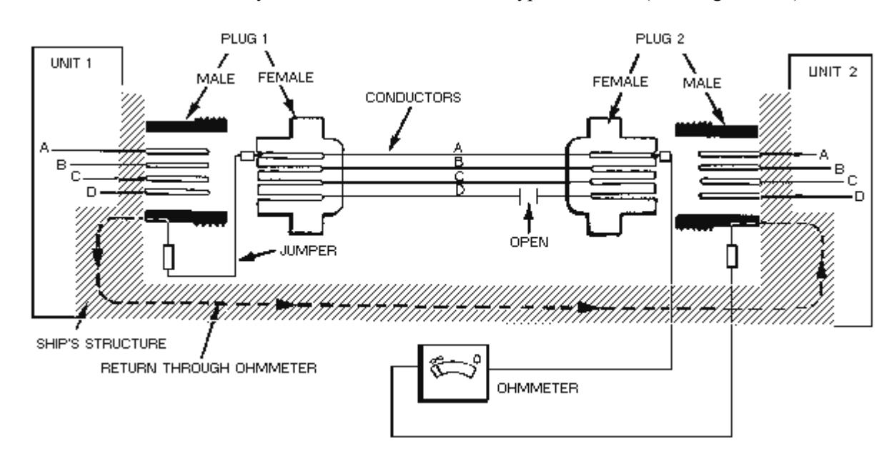

Where conditions are such that the ship's structure cannot be used as the return path, one of the other conductors (known to be good) may be used. For example, to check **D**, you can connect a jumper from pin **D** to pin **A** of plug **1** (female) and the ohmmeter leads to pins **D** and **A** of plug **2** (female). This technique will also reveal the open in the circuit.

### **TESTING FOR GROUNDS**

Grounded circuits are caused by some conducting part of the circuit making contact either directly or indirectly with the metallic structure of the ship. Grounds can have many causes. The two most common are the fraying of insulation from a wire and moisture-soaked insulation. The fraying of insulation from a wire allows bare wire to come into contact with the metal ground. Moisture-soaked insulation causes reduced insulation resistance (also classified as a ground).

Grounds are usually indicated by blown fuses or tripped circuit breakers. Blown fuses or tripped circuit breakers, however, can also result from a short circuit other than a ground. A high-resistance ground can also occur when current is increased significantly but not enough to rupture the fuse or trip the circuit breaker.

### **CAUTION**

### **Before testing any circuit, ensure the circuit under test has been de-energized and checked with a safety shorting probe.**

In testing for grounds, you may use a megger or an ohmmeter. Measuring the resistance to ground from points in a circuit determines if the point is grounded. Referring again to figure 3-20, you can see one possible means of testing a cable for grounds. If the jumper is removed from pin **D** of plug **1** (female), a test for ground can be made for each conductor in the cable. You can do this by connecting one meter lead to ground and the other to each of the pins of either of the plugs. A low resistance indicates that some part of that conductor or one of the plug assemblies is grounded. Both plugs must be removed from their units; if only one plug is removed, a false indication is possible because a conductor may be grounded through the unit.

### **TESTING FOR SHORTS**

A short circuit, other than a grounded one, is one where two conductors touch each other directly or through another conducting element. Two conductors with frayed insulation may touch and cause a short. Too much solder on the pin of a connector may short to the adjacent pin. In a short circuit, enough current may or may not flow to blow a fuse or open a circuit breaker. A short may occur between two cables carrying signals but might not be indicated by a blown fuse.

Shorts occur in many components, such as transformers, motor windings, and capacitors. The major test method used to detect shorts in such components is to measure resistance. The indicated resistance is then compared with the resistance given on schematics or in the equipment technical manuals to determine whether the measured value is within specifications.

An ohmmeter is the device used to check for shorts. You can use the ohmmeter to detect a short between two conductors by measuring the resistance between them (be sure electrical power has been disconnected). A low resistance reading indicates a short. You can test the circuit in figure 3-20 for a short by first removing the jumper and disconnecting both plugs; you then measure the resistance between the two suspended conductors.

### **WARNING**

### **The following section discusses voltage measurements on live circuits. BE SURE YOU ALWAYS FOLLOW PRESCRIBED SAFETY RULES WHEN MEASURING VOLTAGES.**

### **VOLTAGE TESTS**

Voltage tests must be made with the power applied; therefore, the prescribed safety precautions must be followed to prevent injury to personnel and damage to the equipment. You will find in your maintenance work that the voltage test is of utmost importance. It is used not only in isolating casualties to major components but also in the maintenance of subassemblies, units, and circuits. Before checking a circuit voltage, you should check the voltage of the power source to be sure that the normal voltage is being applied to the circuit.

The voltmeter is used for voltage tests. In using the voltmeter, make certain that the meter used is designed for the type of current (ac or dc) to be tested and has a scale with a suitable range. Since defective parts in a circuit can cause higher than normal voltages to be present at the point of test, the highest voltmeter range available should be used first. Once you have obtained a reading, determine if a lower scale can be used that will cause no damage to the meter movement. If so, use the lower scale. This provides a more accurate reading.

Another consideration in the circuit voltage test is the resistance and current in the circuit. A low resistance in a high-current circuit could result in considerable voltage drop, whereas the same resistance in a low-current circuit may be minimal. Abnormal resistance in part of a circuit can be checked with either an ohmmeter or a voltmeter. Where practical, an ohmmeter should be used because the test is then carried out with a "dead" circuit.

The majority of the electronic circuits you will encounter in equipment will be low-current circuits, and most voltage readings will be direct current. Also, many of the schematics will indicate the voltages at various test points. Therefore, if you suspect that a certain stage is defective, you can check the voltage by connecting a voltmeter from the test point to ground. If the suspected stage is not defective, the voltmeter readings should match the voltages given on the schematic.

Some technical manuals also contain voltage charts on which all the voltage measurements are tabulated. These charts usually indicate the sensitivity of the meter (for example, 20,000 ohms/volt) used to obtain the voltage readings for the chart. To obtain comparable results, you must use a voltmeter of the same sensitivity (or greater) as that specified. Make certain that the voltmeter is not "loading" the circuit while taking a measurement. If the meter resistance is not considerably higher than the circuit resistance, the reading will be markedly lower than the true circuit voltage because of the voltmeter's loading effect. (To calculate meter resistance, multiply the rated ohms-per-volt sensitivity value of the meter by the scale in use. For example, a 1,000-ohms-per-volt meter set to the 300-volt scale will have a resistance of 300,000 ohms.)

### **RESISTANCE TESTS**

Before checking the resistance of a circuit or of a part, make certain that the power has been turned off. Also make sure capacitors in the associated circuit are fully discharged. To check continuity, always use the lowest ohmmeter range. If the highest range is used, the meter may indicate zero, even though appreciable resistance is present in the circuit. Conversely, to check a high resistance, use the highest scale since the lower range scale may indicate infinity, even though the resistance is less than a megohm. In making resistance tests, you must remember that even though the external ohmmeter leads are

connected in parallel with the circuit to be measured, the internal meter circuitry is electrically connected in series.

In making resistance tests, take into account that other circuits containing resistances and capacitances may be in parallel with the circuit to be measured. Erroneous conclusions may be drawn from readings obtained in such cases. Remember, a capacitor blocks the dc flow from the ohmmeter. To obtain an accurate reading when other parts are connected across the suspected circuit, disconnect one end of the circuit to be measured from the equipment. For example, many of the resistors in major components and subassemblies are connected across transformer windings. To obtain a valid resistance measurement, you must isolate the resistors to be measured from the shunt resistances of the coils of the transformers.

Resistance tests are also used to check a component for grounds. In these tests, the component to be tested should be disconnected from the rest of the circuit so that no normal circuit ground will exist. Dismounting the component to be checked is not necessary. The ohmmeter is set for a high-resistance range. Then the ohmmeter is connected between ground and each electrically separate circuit of the component being tested. Any resistance reading less than infinity indicates at least a partial ground. You can also check capacitors suspected of being short-circuited by measuring the resistance. To check a capacitor suspected of being open, temporarily shunt a known good capacitor then recheck the performance of the circuit.

### **CAUTION**

### **To avoid possible damage to equipment during resistance tests, observe the following precautions:**

- Always connect an ammeter in series—*never* in parallel.
- Connect a voltmeter in parallel.
- *Never* connect an ohmmeter to a live circuit.
- Observe polarity when using a dc ammeter or a dc voltmeter.
- View meters directly from the front. When viewed from an angle off to the side, an incorrect reading will result because of OPTICAL PARALLAX. (Parallax was covered in NEETS, Module 3, *Introduction to Circuit Protection, Control, and Measurement.)*
- Always choose an instrument suitable for the measurement desired.
- Select the highest range first and then switch to the proper range.
- In using a meter, choose a scale that will result in an indication as near midscale as possible.
- Do not mount or use instruments in the presence of a strong magnetic field.
- Remember, a low internal resistance voltmeter (low sensitivity) may shunt the circuit being measured and result in incorrect readings.

### **SUMMARY**

The important points of this chapter are summarized in the following paragraphs. You should be familiar with these points before continuing with your study of test equipment.

A permanent-magnet, moving-coil meter movement (**D'ARSONVAL** movement) uses the interaction of magnetic fields to produce movement.

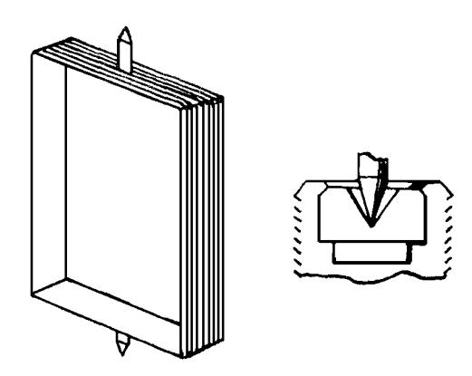

**DAMPING** is used to smooth out the vibration and to help prevent overshooting of the meter pointer.

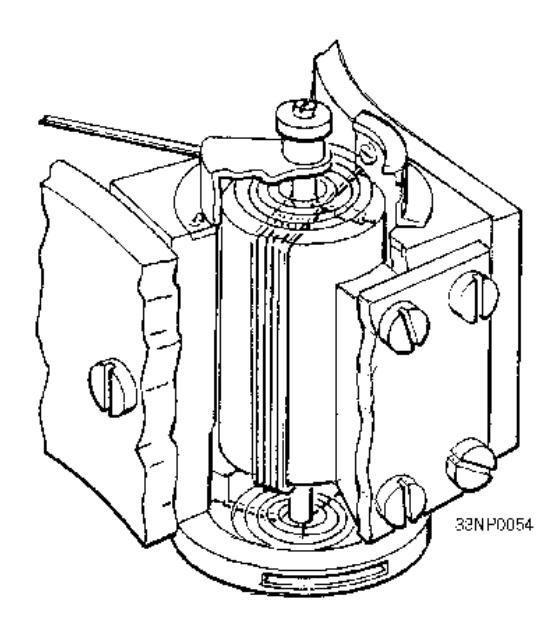

**ELECTRODYNAMOMETER** movements are usually used in wattmeters. They operate much like the D'Arsonval meter movement, except field coils are used instead of a permanent magnet. Electrodynamometer movements measure either ac or dc without the use of a rectifier.

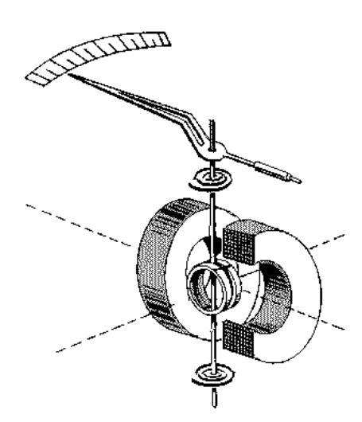

A **SHUNT** is a physically large, low-resistance conductor connected in parallel with the meter terminals. It carries the majority of the load current so that only a small portion of the total current will flow through the meter coil.

An **AMMETER** measures current and is always connected in series with the circuit being measured. An ammeter should have a low resistance so that the effect of the ammeter on the circuit will be kept to a minimum.

**VOLTMETERS** are used to measure voltage and are always connected in parallel with the circuit being measured. A voltmeter should have a high resistance compared to the circuit being measured to minimize the loading effect. Voltmeter sensitivity is expressed in ohms per volt.

**OHMMETERS** are used to measure resistance and to check continuity. An ohmmeter is electrically connected in series with the resistance being measured. The ohmmeter range, which allows a midscale deflection, should be used.

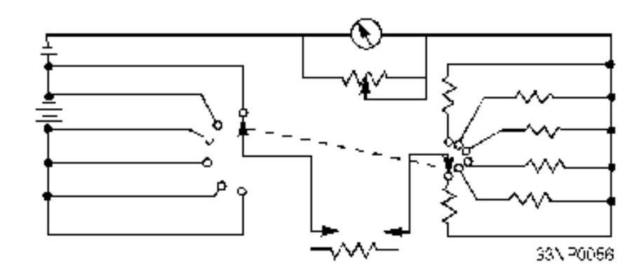

A **MEGOHMMETER (MEGGER)** is used to measure very high resistance, such as the insulation of wiring.

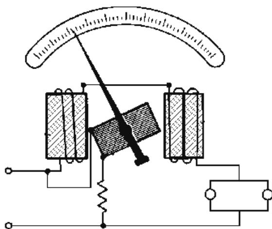

A **CONTINUITY TEST** is accomplished with an ohmmeter. This test is used to check for opens (or to see if the circuit is complete or continuous).

**GROUNDED CIRCUITS** are caused by some conducting part of the circuit making contact either directly or indirectly with the metallic structure of the ship or chassis. In testing for grounds, you may use either an ohmmeter or a megger.

A **SHORT CIRCUIT**, other than a grounded one, is where two conductors touch each other directly or through another conducting element. An ohmmeter is used to test for shorts.

### *ANSWERS TO QUESTIONS Q1. THROUGH Q29.*

*A-1. Self-excited. A-2. Phosphor bronze ribbons. A-3. The pointer arrangement and the light and mirror arrangement. A-4. Coil balance. A-5. Hairspring. A-6. Hairspring. A-7. Makes it possible to have a more linear scale than if the poles were flat. A-8. Shunt. A-9. Zero-temperature coefficient. A-10. Midscale. A-11. In series. A-12. Negative, positive.*

*A-13. False. A-14. Meter-loading. A-15. A multimeter (high resistance) is placed in series with the coil of the meter. A-16. The current required for full-scale deflection, and the range of the voltage to be measured. A-17. In parallel. A-18. High. A-19. Ohms per volt. A-20. Megohmmeter (megger). A-21.* 1. A source of dc potential. 2. One or more resistors (one of which is variable). *A-22. Zero. A-23. 1/10. A-24. Shunts leakage current, which prevents false readings. A-25. 500. A-26. Friction clutches. A-27. Fixed coils. A-28. Size of spiral conducting. A-29. The electrodynamometer-type meter can be used to measure both ac and dc currents.*

# **CHAPTER 4 COMMON TEST EQUIPMENT**

### **LEARNING OBJECTIVES**

Upon completing this chapter, you should be able to:

- 1. Describe the proper operating procedures for using the multimeter.
- 2. Describe the proper operating procedures for using the digital multimeter.
- 3. Describe the proper operating procedures for using the differential voltmeter.
- 4. Describe the proper operation of the transistor tester.
- 5. Describe the proper procedure for using the RCL bridge to measure resistance, capacitance, and inductance.

### **INTRODUCTION**

In the previous chapters, you have learned how to use some basic and miscellaneous measuring instruments to perform required maintenance and upkeep of electronic systems and components. You were also introduced to the construction and operation of basic meter movements in test equipment. This chapter will introduce you to some of the testing instruments commonly used in the Navy today.

### **MULTIMETERS**

During troubleshooting, you will often be required to measure voltage, current, and resistance. Rather than using three or more separate meters for these measurements, you can use the MULTIMETER. The multimeter contains circuitry that allows it to be used as a voltmeter, an ammeter, or an ohmmeter. A multimeter is often called a VOLT-OHM-MILLIAMMETER (VOM).

One of the greatest advantages of a VOM is that no external power source is required for its operation; therefore, no warm-up is necessary. Other advantages are its portability, versatility, and freedom from calibration errors caused by aging tubes, line voltage variations, and so forth.

*Q-1. What is one of the greatest advantages of a VOM?*

Two disadvantages are that (1) the VOM tends to "load" the circuit under test, and (2) the meter movement is easily damaged as a result of improper testing procedures.

### **CAUTION**

**Never press down on or place any object on the glass face of any multimeter. This can disable the meter movement from operating properly or cause damage.**

### **MEASURING RESISTANCE, VOLTAGE, AND CURRENT WITH A VOM**

In the discussion that follows, you will become familiar with the operation and use of the multimeter in measuring resistance, voltage, and current.

The meter selected for this discussion is the Simpson 260 multimeter, as shown in figure 4-1. The Simpson 260 is a typical VOM used in the Navy today.

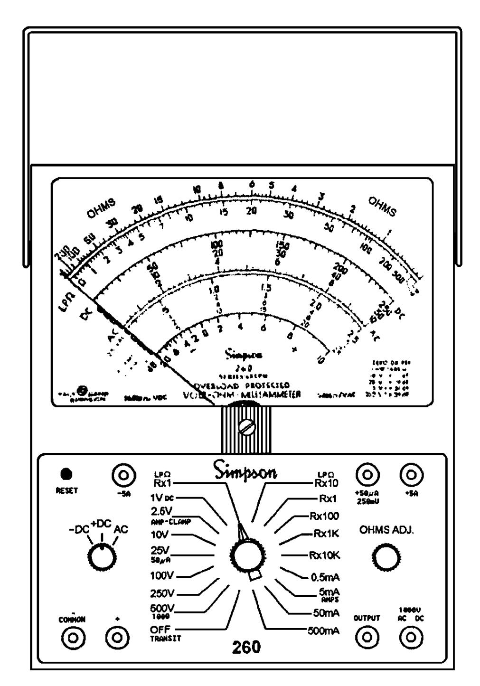

**Figure 4-1.—Simpson 260 Series 6XLP Volt-Ohm-Milliammeter (VOM).**

The multimeter has two selector switches. The switch on the lower left is the function switch, and the one in the lower center is the range switch. The function switch selects the type of current you will be measuring (+dc, −dc, or ac). The range switch is a 12-position switch that selects the range of ohmmeter, voltmeter, or milliammeter measurements you will make.

The multimeter is equipped with a pair of test leads; red is the positive lead and black is the negative, or common, lead. Eight jacks are located on the lower part of the front panel. To prepare the meter for use, simply insert the test leads into the proper jacks to obtain the circuit and range desired for each application. In most applications, the black lead will be inserted into the jack marked at the lower left with a negative sign (−) or with the word COMMON.

### **Measuring Resistance**

Before proceeding, you should be aware of the following important safety precaution that must be observed when using the ohmmeter function of a VOM:

### **CAUTION**

### **Never connect an ohmmeter to a "hot" (energized) circuit. Be sure that no power is applied and that all capacitors are discharged.**

### *Q-2. Before you connect a VOM in a circuit for an ohmmeter reading, in what condition must the circuit be?*

The internal components of the multimeter use very little current and are protected from damage by an overload protection circuit (fuse or circuit breaker). However, damage may still occur if you neglect the safety precaution in the CAUTION instructions above.

Because no external power is applied to the component being tested in a resistance check, a logical question you may ask is, Where does the power for deflection of the ohmmeter come from? The multimeter contains its own two-battery power supply inside the case. The resistive components inside the multimeter are of such values that when the leads are connected together (no resistance), the meter indicates a full-scale deflection. Because there is no resistance between the shorted leads, full-scale deflection represents zero resistance.

Before making a measurement, you must zero the ohmmeter to ensure accurate readings. This is accomplished by shorting the leads together and adjusting the OHMS ADJ control so that the pointer is pointing directly at the zero mark on the OHMS scale. The ZERO OHMS control is continuously variable and is used to adjust the meter circuit sensitivity to compensate for battery aging in the ohmmeter circuits.

An important point to remember when you are making an accurate resistance measurement is to "zero" the meter each time you select a new range. If this is not done, the readings you obtain will probably be incorrect.

When making a resistance measurement on a resistor, you must give the following considerations to the resistor being tested:

- The resistor must be electrically isolated. In some instances, a soldered connection will have to be disconnected to isolate the resistor. Generally, isolating one side of the resistor is satisfactory for you to make an accurate reading.

- The meter leads must make good electrical contact with the resistor leads. Points of contact should be checked for dirt, grease, varnish, paint or any other material that may affect current flow.
- Touch only the insulated portions of the test leads. Your body has a certain amount of resistance, which the ohmmeter will measure if you touch the uninsulated portions of the leads.

Figure 4-2 is a functional block diagram of the ohmmeter circuit in a VOM. The proper method of checking a resistor is to connect the red lead to one end of the resistor and the black lead to the other end of the resistor.

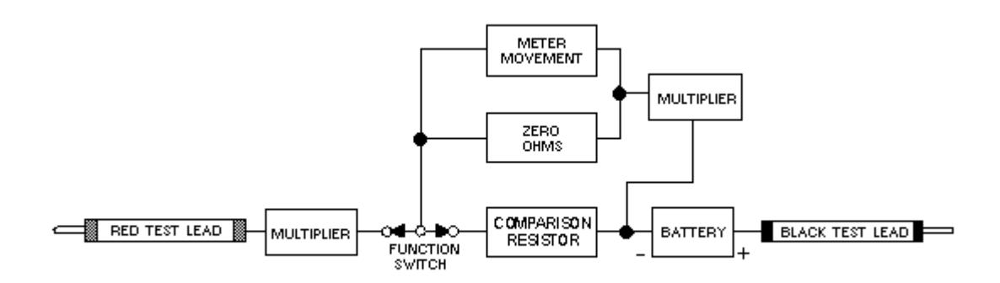

**Figure 4-2.—Functional block diagram of an ohmmeter circuit.**

Because zero resistance causes full-scale deflection, you should realize that the deflection of the meter is inversely proportional to the resistance being tested; that is, for a small resistance value, the deflection will be nearly full scale; and for a large resistance value, the deflection will be considerably less. This means that the left portion of the OHMS scale represents high resistance; the right side of the scale represents low resistance. Zero resistance (a short circuit) is indicated on the extreme right side of the scale; infinite resistance (an open circuit) is located on the extreme left side of the scale.

Notice that you read the OHMS scale on the multimeter from RIGHT to LEFT. For example, the pointer of the multimeter in figure 4-3 indicates 8.0 ohms. To determine the actual value of a resistor, multiply the reading on the meter scale by the range switch setting (R × 1, R × 100, or R × 10,000).

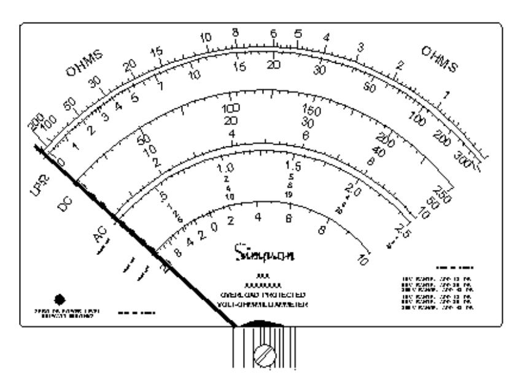

**Figure 4-3.—Ohmmeter scale.**

Notice that the scale marks are crowded on the left side of the OHMS scale, which makes them difficult to read. Therefore, the best range to select is one in which the pointer will fall in the space from midscale to slightly to the right side of midscale. The divisions in this area of the scale are evenly spaced and provide for easier reading and greater accuracy.

### *Q-3. When taking resistance readings with a VOM, you will obtain the most accurate readings at or near what part of the scale?*

To explain the relationship between the meter readings and the range switch setting, let's use an example. Suppose you have a 2,400-ohm resistor, which you have identified by the resistor color code. With the range switch in the R × 1 position, you connect the meter across the resistor. The meter point then deflects between 200 and the point labeled with the infinity symbol (∞) on the extreme left side of the scale. Because the R × 1 range is selected, you multiply the reading by 1. Obviously, the scale reading is not accurate enough. Therefore, you move the range selector switch to the next higher scale position (R × 100) to obtain a more easily read value.

In the R × 100 position, you again zero the meter. This time, the pointer moves to the 24 mark on the scale. Because the R × 100 scale is selected, the reading is multiplied by 100. This gives a more accurate reading of 2,400 ohms (24 times 100).

If you position the range switch to the R × 10,000 scale, accuracy decreases. The most accurate readings are obtained at or near midscale. Other VOM instruments have ranges with other settings, such as R × 10, R × 100, or R × 1,000, to make it easier to make such readings.

Another thing to remember when you are measuring resistance is the tolerance of the resistor. If the tolerance of the resistor in the preceding example is 10 percent, we would expect a reading between approximately 2,160 and 2,640 ohms. If the reading is not within these limits, the resistor has probably changed value and should be discarded.

An open resistor will indicate no deflection on the meter. A shorted resistor causes full-scale deflection to the right on the lowest range scale, such as if the leads were shorted together.

### **Measuring dc Voltages**

You set the multimeter to operate as a dc voltmeter by placing the function switch in either of two positions: +DC or −DC. The meter leads, as in the case of the ohmmeter function, must be connected to the proper meter jacks. When you measure dc voltages, be sure the red lead is the positive lead and the black lead is the negative, or common, lead. View A of figure 4-4 is a functional block diagram of dc voltage circuits in a multimeter. View B shows the jacks and switch positions for measuring dc voltages.

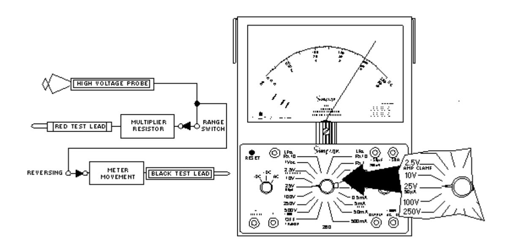

**Figure 4-4.—Functional block diagram of dc voltage circuits.**

When the meter is connected in a circuit, it becomes a circuit component. Because all meters have some resistance, they alter the circuit by changing the current. The resistance presented by the voltmeter depends on the amount of voltage being measured and the position of the function switch.

Some multimeters use a 20,000 ohms-per-volt meter sensitivity for measuring dc voltage and a 5,000 ohms-per-volt sensitivity for measuring ac voltage. The higher the meter resistance, the less it will load the circuit. The idea is to keep circuit loading to an absolute minimum so that the circuit under test is unaffected by the meter. In this way, you can get a clearer picture of what the circuit malfunction is, not the effect of the meter on the circuit.

Again, refer to figure 4-4. With the function switch set to either +DC or −DC, let's consider the effect of the range switch on the meter scale to be used. When measuring dc voltages, you have eight voltage ranges available: .25V, 2.5V, 10V, 50V, 250V, and 500V (1- and 1,000-volt special application plug-ins are also available). The setting of the range switch determines the maximum value represented on the meter. When measuring dc voltages, use the scale marked DC (figure 4-3). The last number at the extreme right side of the DC scale indicates the maximum value of the range being used. When the range switch is in the 2.5V position, the scale represents a maximum of 2.5 volts.

To simplify the relationship between the digits on the meter scale and the setting of the range switch, always use the multiple of the full-scale-deflection digits on the meter face that correspond to the numbers of the range switch. For example, use the 250 scale for the 250MV jack, 2.5V, and 250V ranges; the 50 on the scale for 50V and 500V ranges; and the 10 on the scale for the 10V and 1,000V ranges.

For explanation purposes, let's assume you wish to measure 30 volts dc. In this case, select the next higher range position, 50V. When you place the range switch to the 50V position (as shown in view B of figure 4-4), the meter pointer should rise from a little more than midscale to 30, which represents 30 volts dc.

When measuring a *known* dc voltage, position the range switch to a setting that will cause approximately midscale deflection. Readings taken near the center of the scale are the most accurate. When measuring an *unknown* dc voltage, always begin on the highest voltage range. Using the range switch, work down to an appropriate range. If the meter pointer moves to the left, you should reverse the polarity of the function switch.

### **CAUTION**

### **Always check the polarity before connecting the meter.**

### *Q-4. Besides setting up the meter for expected voltage ranges, what must be strictly observed when taking dc voltage readings?*

Now let's discuss how you take a voltage measurement on a component within a circuit. As an example, let's measure the voltage drop across the resistor shown in figure 4-5.

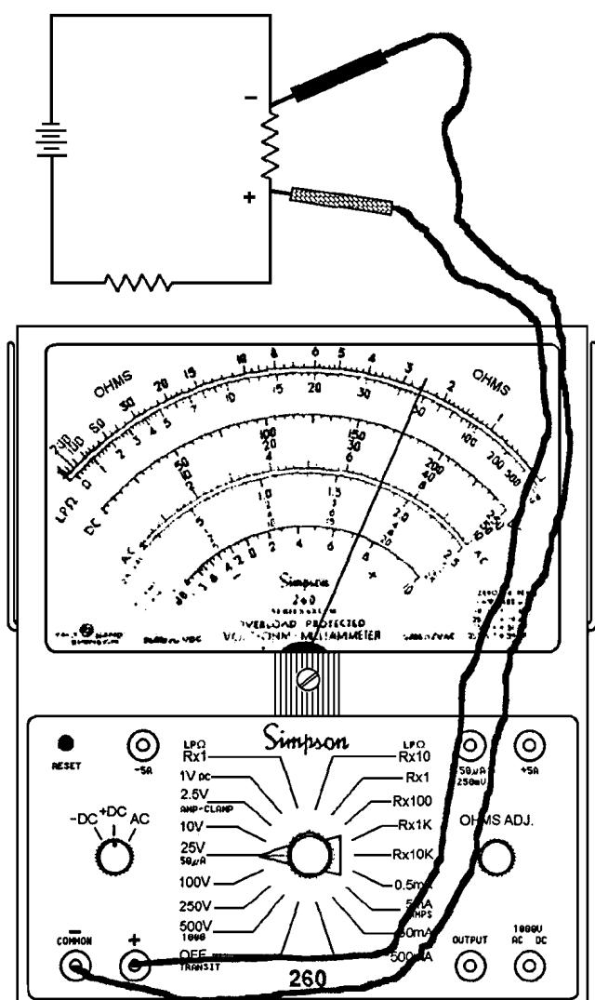

**Figure 4-5.—Measuring the voltage drop of a resistor.**

When measuring a dc voltage drop across a component in a circuit, you must connect the voltmeter in parallel with the component. As you can see in figure 4-5, the positive (red) lead is connected to the positive side of the resistor, and the negative (black) lead is connected to the negative side. A voltage reading is obtained on the meter when current flows through the resistor.

Some voltmeter readings will require the use of a ground as a reference point. Under these conditions, one voltmeter lead is connected to the equipment ground, and the other lead is connected to the test point where voltage is to be measured. Be sure to observe polarity.

### **Measuring ac Voltages**

To measure ac voltages, you must set the function switch to the AC position. The same procedure used to measure dc voltages applies, except that in reading the voltage, you use the AC volts scale (the polarity of the test leads is not important). When measuring very low or high frequencies of ac voltages, you should be aware that the multimeter has a tendency to be inaccurate. View A of figure 4-6 is a

functional block diagram of the ac and output voltage circuits in the multimeter. View B shows the jacks and switch positions used to measure ac voltages.

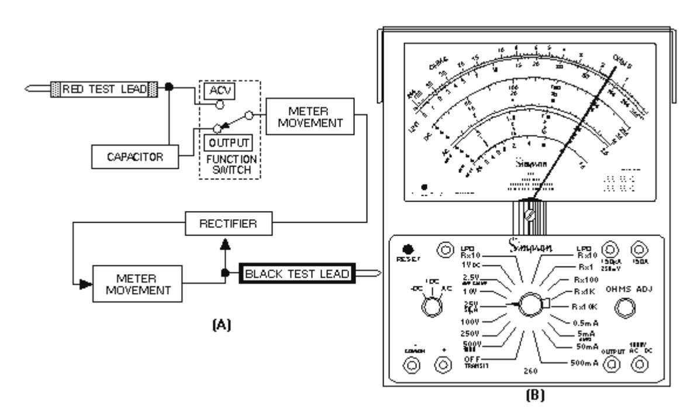

**Figure 4-6.—Functional block diagram of ac and output voltage circuits.**

### **Measuring Output Voltages**

You will often measure the ac component of an output voltage where both ac and dc voltage levels exist. This occurs primarily in amplifier circuits.

The multimeter has a 0.1-microfarad, 400-volt blocking capacitor in series with the OUTPUT jack. The capacitor blocks the dc component of the current in the circuit under test, but allows the ac component to pass on to the indicating circuits.

### **CAUTION**

### **When using OUTPUT, do not attempt to use the meter in a circuit in which the dc voltage component exceeds the 400-volt rating of the blocking capacitor.**

To use the multimeter to measure output voltage, you must follow these steps:

- 1. Set the function switch to AC.
- 2. Plug the black test lead into the COMMON jack and the red test lead into the OUTPUT jack.
- 3. Set the range switch at the appropriate range position, marked as 2.5V, 10V, 50V, or 250V.
- 4. Connect the test leads to the component being measured with the black test lead to the negative side of the component.

- 5. Turn on the power in the test circuit. Read the output voltage on the appropriate ac voltage scale. For the 2.5V range, read the value directly on the scale marked 2.5. For the 10V, 50V, or 250V range, use the red scale marked AC and read the black figures immediately above the scale.

### **Measuring Current**

The multimeter can function as an ammeter to measure current flow.

### **CAUTION**

**When using the multimeter as a current-indicating instrument,** *NEVER* **connect the test leads directly across a voltage. ALWAYS connect the instrument in series with the load.**

To use the multimeter as an ammeter, you must take the following steps:

- 1. Set the function switch at +DC (assuming the current to be positive).
- 2. Plug the black test lead in the COMMON jack and the red test lead into the + jack.
- 3. Set the range switch at one of the five ampere-range positions.
- 4. Ensure the equipment is OFF and then physically open the circuit in which the current is being measured.
- 5. Connect the VOM in series with the circuit, ensuring that proper polarity is observed when making this connection.
- 6. Turn the equipment ON and then read the current on the DC scale. (This is the same scale used to measure dc voltages.)

The setting of the range switch determines the maximum value represented by the DC scale. Always use the range scale that corresponds to the range switch setting.

### **CAUTION**

**Never attempt to measure currents greater than the setting of the range switch. Increase the range with a shunt, if necessary, but do not exceed the marked current.**

When measuring unknown currents, follow the same procedures as when measuring voltages. Always start with the highest range available and work down. Use the range that gives approximately half-scale deflection. If this procedure isn't followed, the meter could be burned out.

Figure 4-7 is a functional block diagram of the dc current circuits in a multimeter.

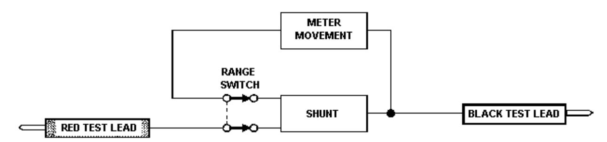

**Figure 4-7.—Functional block diagram of dc current circuits.**

### **Accessories**

A dc high-voltage probe is available for use with the multimeter. The probe extends the range of the multimeter in a safe and convenient manner. It is primarily used to measure high-voltage, low-power, dccurrent sources, such as the anode supplies in television receivers and other cathode-ray tube circuitry.

### **CAUTION**

**Do not use this probe on electrical equipment that can deliver high power under short-circuit conditions, such as from a large dc motor-generator set.**

Also available is an ac high-voltage probe. The 10,000-volt ac probe is similar to the high-voltage dc probe with the following exceptions:

- The ac high-voltage probe is designed primarily to extend the range of a 5,000-ohms-per-volt VOM.
- The probe is used with the VOM in the 10V AC position.
- You take readings on the 0-10V AC scale and multiply by 1,000.

### **ELECTRONIC DIGITAL MULTIMETER**

As you studied in chapter 3 (externally excited meters), placing a meter into a circuit causes energy to be taken from the circuit. The amount of energy taken depends on the sensitivity of the meter. In some cases, this energy loss cannot be tolerated. For example, in extremely sensitive circuits, such as oscillator grid circuits and automatic volume control circuits, degradation of normal circuit operation will occur. This often results in failure to obtain a usable indication of the fault. The use of electronic multimeters is practical in these sensitive electronic circuits. The higher the input impedance of a meter, the less the loading effect and the more accurate the measurements taken. Electronic multimeters have considerably greater input impedances than do nonelectronic multimeters.

One example of a typical electronic multimeter in use within the Navy is the electronic Model 8000A Digital Multimeter. Most electronic digital multimeters overcome the disadvantage of requiring a continuous external power source by combining an external ac source with an internal rechargeable battery. Another advantage of this meter is that it can be read directly and does not use a scale. Figure 4-8 shows the model 8000A multimeter.

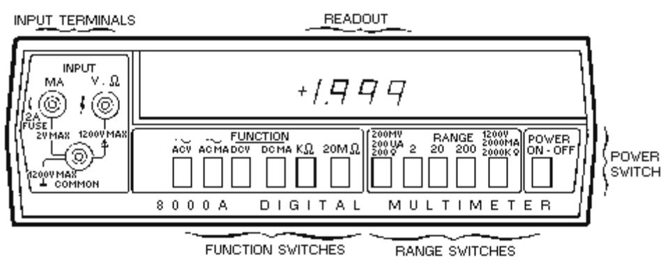

**Figure 4-8.—Digital voltmeter 8000A operating features.**

### **Operating Features**

The locations of all controls, connectors, and indicators are shown in figure 4-8. The INPUT terminals, located on the left-hand side of the meter face, provide input connections for voltage or resistance (V-?) and milliampere current (MA) measurements with respect to the common terminal. The readout section, located across the upper half of the meter face, contains light-emitting diode (LED) indicators. They display the measured input and polarity signs for dc measurements. The POWER switch, located on the lower right-hand side of the meter face, is a push-button switch used to energize the instrument. The RANGE switches, located on the lower, middle, right-hand portion of the meter face, select the voltage (200 millivolts, 2, 20, 200, or 1,200 volts), current (200 microamperes, 2, 200, or 2,000 milliamperes), and resistance (200 ohms, 2, 20, 200, or 2,000 kilohms) ranges. The FUNCTION switches, located on the lower, middle, left-hand portion of the meter face, select the voltage, current, or resistance modes. The MA input terminal is also a fuse holder for the current protection fuse.

### **Internal Battery Models**

Power is supplied by internal rechargeable batteries that allow the instrument to operate for at least 8 hours. Recharging the batteries is accomplished by switching the POWER switch to OFF and connecting the instrument to an ac power line. You can use the instrument when recharging the batteries on ac power, but the recharging time will be extended.

*Q-5. Power for the electronic digital multimeter is normally supplied by what internal power source?*

### **Overload Protection**

An overload condition is indicated by the simultaneous flashing of the display readouts. The dc voltage function can withstand up to 1,200 volts dc or 1,200 volts root-mean-square (rms) on any range.

*Q-6. How is an overload condition indicated by the electronic digital multimeter?*

The ac voltage function can sustain up to 1,200 volts rms on the 20-, 200-, and 1,200-volt ranges and 500 volts rms on the 200-millivolt and 2-volt ranges. The current input fuse is protected above 2 amperes rms. Protection for the resistance function is to 130 volts rms in the 200-ohm and 2-kilohm ranges, and 250 volts rms in the 20-kilohm through 20-megohm ranges.

### **Basic Digital Multimeter Measurement**

Table 4-1 lists the proper function push buttons, range push buttons, and input terminal connections for performing specific measurements with the model 8000A.

**Table 4-1.—Basic Measurement Instructions**

| MEASUREMENT     | FUNCTION | RANGE          |   | INPUT |                    |                 |
|-----------------|----------|----------------|---|-------|--------------------|-----------------|
| DC Volts        | DCV      | 200MV, 2,      |   |       |                    |                 |
|                 |          |                | V | ŸDQG |                    |                 |
| DC Milliamperes | DC MA    |  \$ |   |       |                    |                 |
| AC Volts        | ACV      | 200MV, 2,      |   |       |                    |                 |
|                 |          |                | V | ŸDQG |                    |                 |
| AC Milliamperes | AC MA    |  \$ |   |       |                    |                 |
| Kilohms         | K Ÿ      |     |   |       |                    |                 |
|                 |          |                | V | ŸDQG |                    |                 |
|                 |          |                |   |       | 130V rms, 200 ŸDQG |                 |
|                 |          |                |   |       | 2K ŸUDQJHV9  |                 |
|                 |          |                |   |       | rms, 20k ŸWKUX    |                 |
|                 |          |                |   |       | 2000k ŸUDQJHV    |                 |
| Megohms         | 0      | Any            | V | ŸDQG |                    |                 |
|                 |          |                |   |       | 250V rms           | Ranges switches |

### **Block Diagram Analysis**

Figure 4-9 is a block diagram of an electronic digital multimeter. Note that the block diagram divides the instrument into three major sections: the SIGNAL CONDITIONING section, the ANALOG-TO-DIGITAL CONVERTER section, and the DISPLAY section.

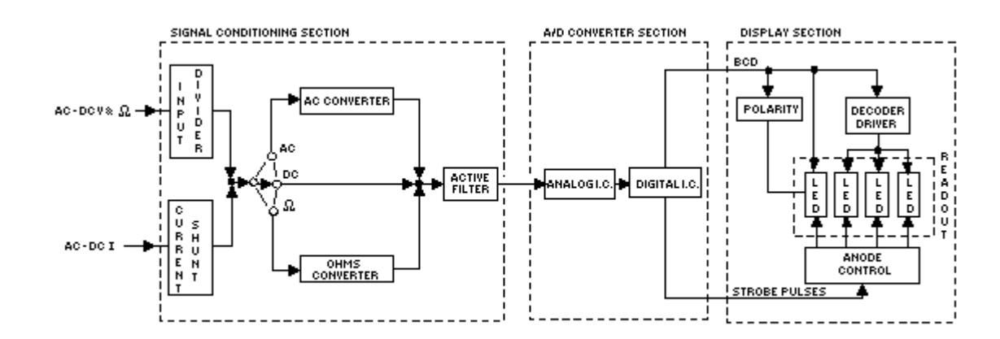

**Figure 4-9.—Model 8000A block diagram.**

The signal conditioning section provides a dc analog voltage, characteristic of the applied input, to the analog-to-digital converter section. This task is accomplished by the input voltage divider, current shunts, ac converter, active filter, and associated switching.

The analog-to-digital (a/d) converter section changes the dc output voltage from the signal conditioning section to digital information. The a/d converter uses a voltage-to-frequency conversion technique. A dc voltage at the input of the a/d converter is changed to a frequency by the analog integrated circuit (ic). This frequency is characteristic of the magnitude and polarity of the dc input voltage. Counting of the output frequency from the analog ic is accomplished by the digital ic. The resulting count is transferred in binary format to the display section. (Binary number systems are covered in NEETS, Module 13, *Introduction to Number Systems, Boolean Algebra, and Logic Circuits*.)

The display section takes the digital (binary) information from the a/d converter section, decodes it, and visually displays it. The decoded digital information is displayed on numerical LED readouts.

*Q-7. In an electronic digital multimeter, the digital information is displayed by what type of numerical readouts?*

### **Accessories**

Several accessories are available for use with the electronic digital multimeter. One accessory is the test lead kit, shown in figure 4-10. The kit contains two color-coded test leads with threaded adapters. These adapters attach to banana plugs, pin tips, test prod tips, alligator clips, and binding post lugs.

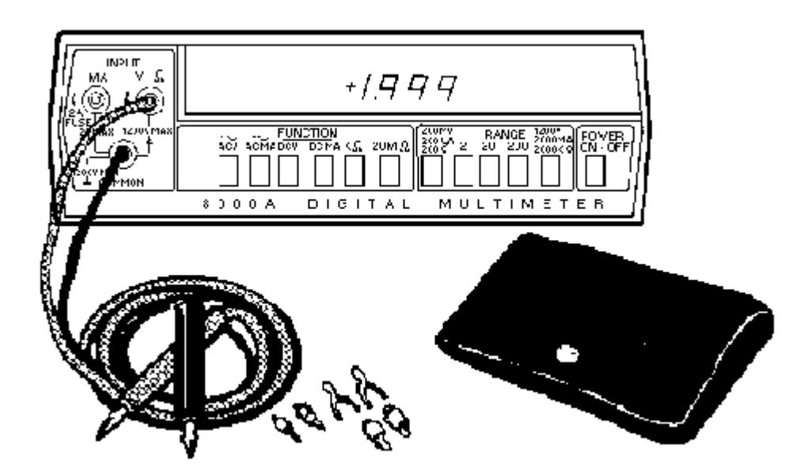

**Figure 4-10.—Test lead kit.**

Figure 4-11 shows a high-current probe. This probe extends the ac current measurement capability from 2 to 600 amperes at frequencies up to 400 hertz.

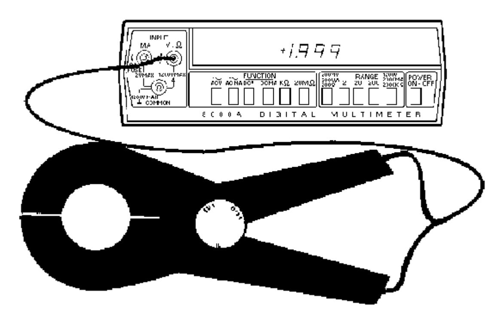

**Figure 4-11.—Ac high-current probe.**

Figure 4-12 shows a high-voltage probe. The probe extends the dc voltage range to 30 kilovolts.

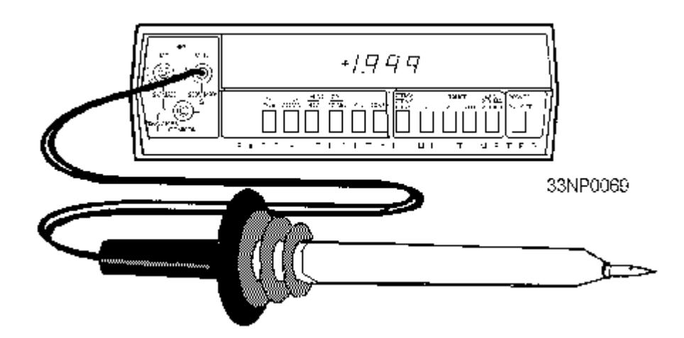

**Figure 4-12.—High-voltage probe.**

Figure 4-13 shows a high-frequency probe, which allows measurements over a frequency range of 10 kilohertz to 500 megahertz.

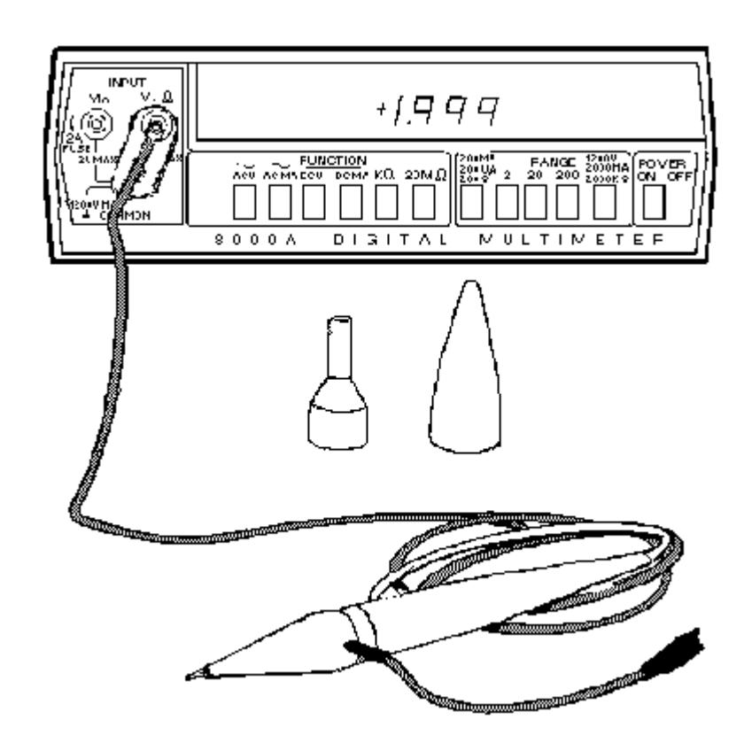

**Figure 4-13.—High-frequency probe.**

### **AC/DC DIFFERENTIAL VOLTMETER**

The DIFFERENTIAL VOLTMETER provides extremely accurate voltage measurements and is a highly reliable piece of precision test equipment. Its general function is to compare an unknown voltage with a known internal reference voltage and to indicate the difference in their values. The differential voltmeter in common use in the Navy today is the model 893A (figure 4-14).

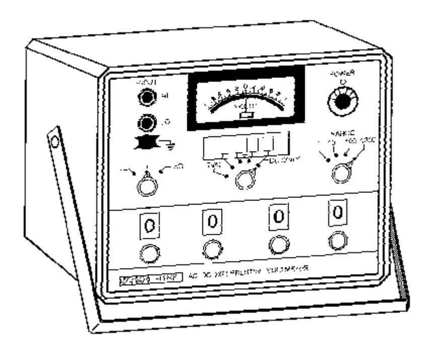

**Figure 4-14.—Ac/dc differential voltmeter.**

### *Q-8. What is the general function of the differential voltmeter?*

The differential voltmeter can be used as a conventional TRANSISTORIZED ELECTRONIC VOLTMETER (TVM) and a DIFFERENTIAL NULL VOLTMETER. It can also be used to measure variations of a voltage near some known value (NULL DETECTOR), high resistance values (MEGGOMETER), and for dBm measurements.

### **METER DESIGN CHARACTERISTICS**

The differential voltmeter is a solid-state instrument that provides the capability of making dc voltage measurements from +/− 10 microvolts to +/− 1,100 volts. Ac voltages from 0.001 to 1,100 volts can be measured over a frequency range from 5 hertz to 100 kilohertz. Both of these measurements can be made without concern for loading the circuit. The differential voltmeter has four voltage readout dials that vary the resistance of the divider assembly as described above.

The differential voltmeter uses a built-in NULL DETECTOR to measure an unknown voltage. The meter circuitry compares the unknown voltage to a known, adjustable reference voltage supplied by the meter. The reference voltage is provided by a high-voltage dc power supply and decade resistor divider assembly strings that are set by voltage readout dials. In this way, the output from the high-voltage power supply can be precisely divided into increments as small as 10 microvolts. The readout dials are used to adjust the meter pointer to 0 and the unknown voltage is then read from the voltage dials.

A primary feature of the differential voltmeter is that it does not draw current from the unknown source for dc measurements when the measurement is obtained. Therefore, the determination of the unknown dc potential is independent of its source.

### **FRONT PANEL CONTROLS**

The front panel of a typical differential voltmeter is shown in figure 4-15. With a few differences, the controls and terminals are similar to those used on other differential voltmeters. The NULL SENSE

switch selects the conventional TVM mode of operation and the various full-scale null detector sensitivity ranges when the instrument is operated in the differential mode of operation. The RANGE switch allows selection of the desired input voltage range, positions the readout dial decimal point, and selects the various ranges of the NULL SENSE switch. The readout dials provide a digital readout of the measured voltage when the instrument is in the differential mode.

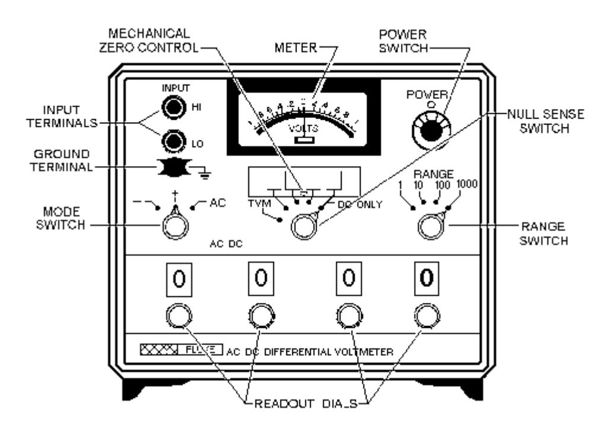

**Figure 4-15.—Controls, terminals, and indicators.**

### **MODES OF OPERATION**

There are two primary modes of operation: the conventional transistorized voltmeter mode and the differential null mode. These modes are described in the next paragraphs.

### **Conventional Transistorized Voltmeter (TVM) Mode**

When the instrument is used as a conventional transistorized dc voltmeter, the circuitry is connected as shown in figure 4-16. The null detector drives the front panel meter and provides a full-scale meter deflection for any full-scale input. Positive or negative voltage measurements are made by reversing the meter terminals through the contacts of the MODE switch.

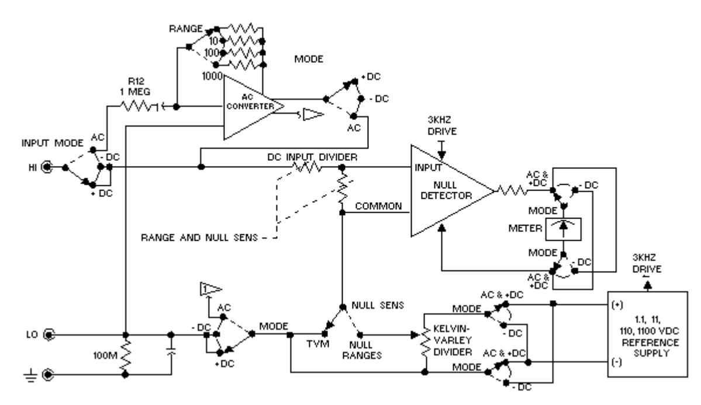

**Figure 4-16.—Ac/dc differential voltmeter block diagram.**

### **FUNCTIONAL BLOCK DIAGRAM**

Figure 4-16 is a functional block diagram of a differential voltmeter. The circuitry is made up of a reference supply, a resistive divider, a dc input divider, an ac converter, a null detector, and a meter. The circuitry is interconnected by various switching arrangements when you perform the desired ac or dc conventional or differential voltage measurements.

Placing the MODE switch in figure 4-16 to the AC position connects the instrument circuitry as a conventional transistorized ac voltmeter. A full-scale input voltage at the input terminals of the instrument results in a voltage being applied to the input of the null detector. The null detector drives the front panel meter that indicates the value of the measured ac voltage.

### **Differential Null Mode**

When the instrument is used as a dc differential voltmeter, the MODE and NULL SENS switches in figure 4-16 are placed to their respective +/− dc and desired full-scale meter sensitivity positions. In this mode of operation, the NULL SENS switch selects a suitable resistance value to determine the full-scale sensitivity of the meter. The dc input voltage applied to the instrument is then compared with the null detector, and any resulting difference is used to drive the meter. The meter terminals can be reversed through the contacts of the MODE switch for +/− dc voltage measurements.

### **TRANSISTOR TESTERS**

Laboratory transistor test sets are used in experimental work to test characteristics of transistors. For maintenance and repair, however, checking all transistor parameters is not necessary. A check of two or three performance characteristics is usually sufficient to determine whether a transistor needs to be replaced.

Two of the most important parameters used for transistor testing are the transistor CURRENT GAIN (BETA) and the COLLECTOR LEAKAGE or REVERSE CURRENT (ICO). Two other tests that can be accomplished include the electrode resistance and diode measurements. You may want to review NEETS, Module 7, *Introduction to Solid-State Devices and Power Supplies*, for a review of transistors before continuing this section.

The Semiconductor Test Set AN/USM-206A (figure 4-17) is a rugged, field-type tester designed to test transistors and semiconductor diodes. The set will measure the beta of a transistor, the resistance appearing at the electrodes, and the reverse current of a transistor or semiconductor diode. It will also measure a shorted or open condition of a diode, the forward transconductance of a field-effect transistor, and the condition of its own batteries.

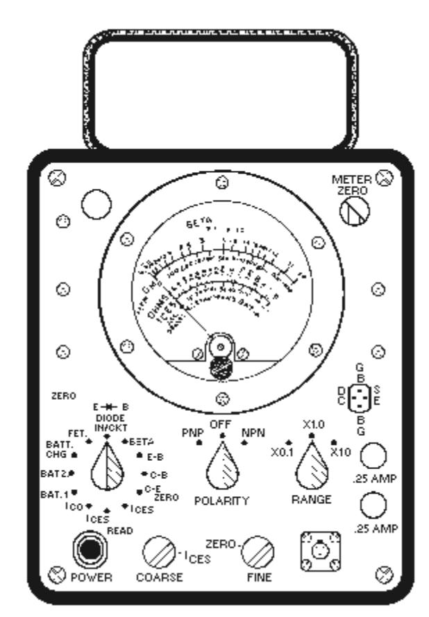

**Figure 4-17.—Semiconductor test set.**

To assure that accurate and useful information is gained from the transistor tester, you should make the following preliminary checks of the tester before testing any transistors:

- 1. With the POLARITY switch in the OFF position, the meter pointer should indicate exactly zero. (When required, rotate the meter ZERO ADJUST KNOB on the front of the meter to fulfill this requirement.) To prevent battery drain, be sure to leave the POLARITY switch in the OFF position when measurements are not actually being made.
- 2. Always check the condition of the test set batteries. To make this check, disconnect the test set power cord, place the polarity switch in the PNP position, and place the function switch first to BAT. 1and then to BAT. 2. In both BAT positions, the meter pointer should move so as to indicate within the red BAT box.

### **BETA MEASUREMENTS**

If the transistor is to be tested out of the circuit, plug it into the test jack located on the right-hand side below the meter. If the transistor is to be tested in the circuit, at least 300 ohms must exist between E-B (emitter to base), C-B (collector to base), and C-E (collector to emitter) for accurate measurement. Initial setting of the test set controls is performed as follows:

- 1. Set the function switch to BETA.
- 2. Set the POLARITY switch to PNP or NPN (depending on the type of transistor under test).
- 3. Set the RANGE switch to X10.
- 4. Adjust METER ZERO for zero meter indication (transistor disconnected).
- 5. The POLARITY switch should remain OFF while the transistor is connected to or disconnected from the test set; it should then be set to PNP or NPN, as in step 2 above.

If the beta reading is less than 10, perform the following steps:

- 1. Reset the RANGE switch to X1 and reset the meter to zero.
- 2. After connecting the yellow test lead to the emitter, the green test lead to the base, and the blue test lead to the collector, plug the test probe (not shown) into the jack located at the lower righthand corner of the test set.
- 3. When testing grounded equipment, unplug the 115-volt line cord and use battery operation. A beta reading is attained by multiplying the meter reading times the RANGE switch setting. Refer to the transistor characteristics book provided with the tester to determine if the reading is normal for the type of transistor under test.

### **ICO MEASUREMENTS**

Adjust the METER ZERO control for a zero meter indication. Plug the transistor to be tested into the jack, or connect the test leads to the device. Set the PNP/NPN switch to correspond with the type of transistor under test. Set the function switch to ICO and the RANGE switch to X0.1, X1.0, or X10, as specified by the transistor data book for allowable leakage. Read leakage on the bottom scale and multiply by the range setting figure as required.

### **ELECTRODE RESISTANCE MEASUREMENTS**

Connect the in-circuit probe test leads to the transistor with the yellow lead to the emitter, the green lead to the base, and the blue lead to the collector. Set the function switch to the OHMS E-B position and read the resistance between the emitter and base electrode on the center scale of the meter marked OHMS.

To read the resistance between the collector and base and the collector and emitter, set the function switch to OHMS C-B and OHMS C-E, respectively. These in-circuit electrode resistance measurements are used to correctly interpret the in-circuit beta measurements. The accuracy of beta times 1 and 10 range is ±15 percent only when the emitter-to-base load is equal to or greater than 300 ohms.

### **DIODE MEASUREMENTS**

Diode in-circuit quality measurements are made by connecting the green test lead to the cathode and the yellow test lead to the anode. Set the function switch to DIODE IN/CKT and the RANGE switch to

times 1 position. Ensure that the meter has been properly zeroed on this scale. If the meter reads downscale, reverse the polarity switch. If the meter reads less than midscale, the diode under test is either open or shorted. The related circuit impedance of this test is less than 25 ohms.

### **RESISTANCE-CAPACITANCE-INDUCTANCE (RCL) BRIDGES**

Resistance, capacitance, and inductance can be measured with precise accuracy by alternatingcurrent bridges. These bridges are composed of capacitors, inductors, and resistors in a wide variety of combinations. These bridges operate on the principle of the Wheatstone bridge; that is, an unknown resistance is balanced against known resistances and, after the bridge has been balanced, the unknown resistance is calculated in terms of the known resistance.

The universal Impedance Bridge, Model 250DE (shown in figure 4-18) is used to measure resistance, capacitance, and inductance (RCL) values. It is also used to make other special tests, such as determining the turns ratio of transformers and capacitor quality tests. This instrument is self-contained, except for a source of line power, and has an approximate 500-hour battery life expectancy. It has its own source of 1,000-hertz bridge current with a sensitive bridge balance indicator and an adjustable source of direct current for electrolytic capacitor and resistance testing. The bridge also contains a meter with suitable ranges to test for current leakage on electrolytic capacitors.

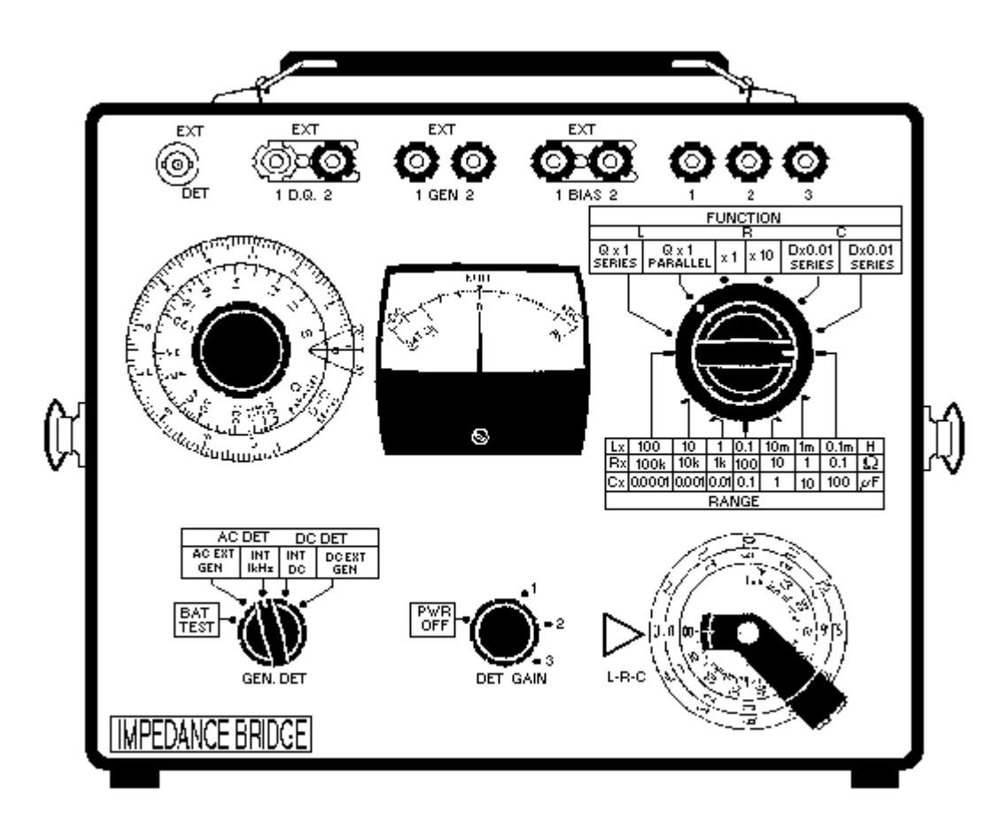

### **CONTROLS**

Figure 4-18 is a panel view of the model 250DE bridge switches, dials, controls, and connections. Refer to the figure as we briefly discuss some of the switches and dials below.

- The FUNCTION switch selects the type of bridge circuit that will measure resistance, capacitance, or inductance.
- The RANGE switch selects the multiplier for each function.
- L-R-C decade dials are a DEKASTAT decade resistor that is the main balancing element of the bridge. The setting of the dials after the bridge is balanced indicates the value of inductance, resistance, or capacitance.
- The D-Q dial is used to balance the phase of the capacitance or inductance of the bridge. The setting of the dial after the bridge is balanced indicates the value of dissipation factor (D) or storage factor (Q).
- The GEN-DET switch selects bridge generator and detector connections, ac or dc, internal or external generator. The switch also connects the internal batteries to the battery test circuit.
- The DET GAIN control adjusts the sensitivity of the ac-dc detector and turns on power to the generator.

### **CONNECTIONS**

L, R, and C terminals 1, 2, and 3 are used to connect unknown resistors, inductors, and capacitors to the bridge. Resistors and inductors are connected between terminals 1 and 2, and capacitors are connected between terminals 2 and 3. **EXT BIAS** terminals are normally connected with a shorting lug. They allow insertion of a dc voltage or current to bias capacitors or inductors. **EXT DET** connector is a BNC coaxial socket that allows an external detector to be used with the instrument. It is connected to the bridge at **ALL**

### **TIMES**.

**EXT D-Q** terminals are normally connected with a shorting lug. They allow an external rheostat to extend the range of the D-Q dial. **EXT GEN** terminals provide a connection to the bridge for an external generator. When the GEN-DET switch is in the AC EXT GEN position, the terminals connect an isolation transformer so that a grounded external generator can be used. When the GEN-DET switch is in the DC EXT GEN position, the terminals are connected directly to the bridge.

### **BATTERY**

The model 250DE bridge has a battery supply consisting of four 1.5 V dc batteries with an expected life of 500 hours. The battery power supply should be checked before each day's operation. Turn DET GAIN control to 1 and set GEN-DET switch to BATT. TEST (battery test). If the meter deflects beyond the BAT OK mark, the battery is good.

### **RESISTANCE MEASUREMENTS**

Resistance is usually measured with direct current for maximum accuracy. The model 250DE bridge can be used to measure resistance with alternating current, but external reactance compensation is usually required. On high-resistance ranges, care should be taken to avoid leakage across a resistor under test. Insulation with a resistance of 109 ohms, which is adequate for most purposes, will cause a measurement

error of 1 percent if it shunts a 10-megohm resistor. Using the following steps, you will be able to measure dc resistance ONLY:

- 1. Turn the DET GAIN control to 2.
- 2. Set the FUNCTION switch to R × 1 or R × 10.
- 3. Set L-R-C decade dials to 3.000.
- 4. Connect the unknown resistor to R-L terminals 1 and 2.
- 5. Set the GEN-DET switch to INT DC.
- 6. Adjust the RANGE switch for minimum detector deflection.
- 7. Adjust L-R-C decade dials for null, turning the DET GAIN control clockwise to increase sensitivity as necessary.
- 8. The measured resistance is the product of the L-R-C decade dial setting times the RANGE and FUNCTION switch settings.

### **CAPACITANCE MEASUREMENTS**

Capacitance is measured in terms of a two-element equivalent circuit consisting of a capacitor in series with a resistor. The internal ac generator and detector of the model 250DE bridge are tuned to 1 kilohertz. Other frequencies can be used, but an external generator and detector are required. The D and Q ranges of the bridge can be extended by use of an external rheostat connected to the terminals provided. The measured capacitance is the product of the L-R-C dial setting times the setting of the RANGE switch. Using the following steps, you can make a standard capacitance measurement:

- 1. Turn the DET GAIN control to 1.
- 2. Set the FUNCTION switch to C, D × 0.1 or D × 0.01 SERIES.
- 3. Set L-R-C decade dials to 3.000 and D-Q dial to 0.
- 4. Connect the unknown capacitor to C terminals 2 and 3.
- 5. Set the GEN DET switch to INT 1 kHz.
- 6. Adjust the RANGE SWITCH for minimum detector deflection.
- 7. Adjust L-R-C decade dials and D-Q dial alternately for a minimum meter deflection, turning the DET GAIN control clockwise to increase sensitivity as necessary.
- 8. The measured capacitance is the product of the L-R-C decade dial settings.
- 9. The measured dissipation factor (D) is the product of the D-Q setting times the FUNCTION switch setting.

### **INDUCTANCE MEASUREMENTS**

Inductance is measured in terms of a two-element equivalent circuit consisting of an inductance either in series or in parallel with a resistance. The internal ac generator and detector of the model 250DE bridge are tuned to 1 kHz. Other frequencies can be used, but like capacitance measurements, an external

generator and detector are required. When inductance is being measured in ac or dc, it should be realized that iron-core inductors are sensitive to current variations. Quantitative measurements of dc effects can be made by supplying current to the unknown inductor through the EXT BIAS terminal. Use the following steps to make inductance measurements:

- 1. Turn the DET GAIN control to 1.
- 2. Set the FUNCTION switch to L PARALLEL if Q is greater than 10 to L SERIES if Q is less than
  - 10.
- 3. Set L-R-C decade dials to 3.000 and D-Q dial to maximum.
- 4. Connect the unknown inductor to the R-L terminals 1 and 2
- 5. Set the GEN DET switch to INT 1 kHz.
- 6. Adjust the RANGE switch for minimum detector deflection.
- 7. Adjust the L-R-C decade dials and D-Q dial alternately for a minimum meter deflection, turning the DET GAIN control clockwise to increase sensitivity as necessary.
- 8. The measured inductance is the product of the L-R-C decade dial setting times the RANGE switch setting.
- 9. The measured storage factor (Q) is read directly from the D-Q dial, inner scale for parallel and outer scale for series inductance.

### **SUMMARY**

The important points of this chapter are summarized in the following paragraphs. You should be familiar with these points before continuing with your studies of test equipment.

A **MULTIMETER** is a single meter that combines the functions of a dc ammeter, a dc voltmeter, an ac ammeter, an ac voltmeter, and an ohmmeter. Observe the following safety precautions when using a multimeter:

- De-energize and discharge the circuit completely before connecting a multimeter.
- Never apply power to the circuit while you are measuring resistance with an ohmmeter.
- Connect the ammeter **in series** for current measurements and **in parallel** for voltage measurements.
- Be certain the multimeter is switched to ac before attempting to measure ac circuits.
- Observe proper dc polarity when measuring dc circuits.
- Always start with the highest voltage or current range.
- Select a final range that allows a reading near the middle of the scale.
- Adjust the "0 ohms" reading after changing resistance ranges and before making a resistance measurement.

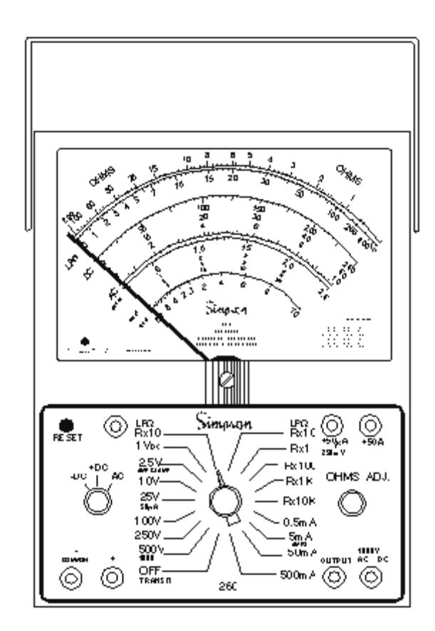

An **ELECTRONIC DIGITAL MULTIMETER** is used in sensitive electronic circuits where only extremely small amounts of energy can be extracted without disturbing the circuits under test, or causing them to be inoperative.

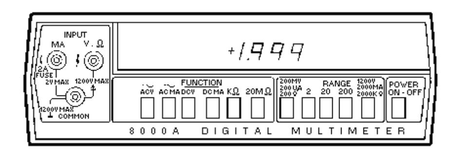

The **DIFFERENTIAL VOLTMETER** is a precision piece of test equipment used to compare an unknown voltage with an internal reference voltage and to indicate the difference in their values.

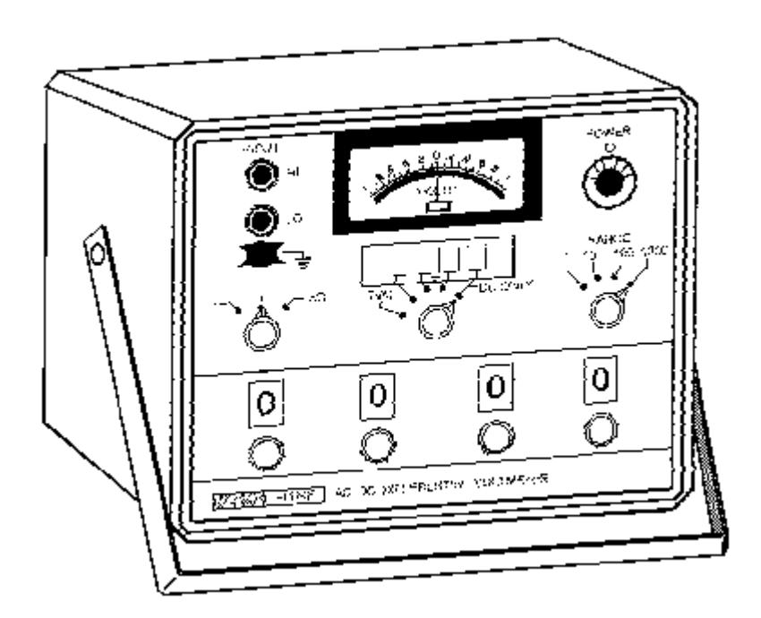

A **SEMICONDUCTOR TEST SET** is used to measure the beta of a transistor, the resistance appearing at the electrodes, and the reverse current of a transistor or semiconductor diode. It also measures a shorted or open condition of a diode, the forward transconductance of a field-effect transistor, and the condition of its own batteries.

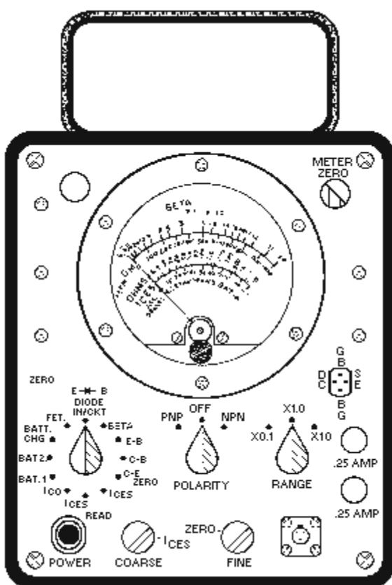

Resistance, capacitance, and inductance are measured for precise accuracy by **RCL BRIDGES**. They are composed of capacitors, inductors, and resistors and operate on the principle of the Wheatstone bridge.

### *ANSWERS TO QUESTIONS Q1. THROUGH Q8.*

*A-1. No external power source is required. A-2. De-energized. A-3. Midscale. A-4. Polarity. A-5. Rechargeable batteries. A-6. Simultaneous flashing of display readouts. A-7. Light-emitting diodes. A-8. To compare an unknown voltage with a known reference voltage and indicate the difference in their values.*

# **CHAPTER 5 SPECIAL-APPLICATION TEST EQUIPMENT**

### **LEARNING OBJECTIVES**

Upon completing this chapter, you should be able to:

- 1. Explain the theory of operation of two types of power meters.
- 2. Describe the purpose of the controls and indicators found on power meters.
- 3. Describe the proper procedure for taking power measurements for incident and reflected energy.
- 4. Describe the uses and purposes of the controls and indicators found on the signal generator.
- 5. Explain the theory of operation of a typical frequency counter.
- 6. Describe the uses and purposes of the controls and indicators found on the frequency counter.
- 7. Explain the uses and purposes of the controls and indicators found on the Huntron Tracker 2000.
- 8. Describe the proper procedures for troubleshooting with a logic probe.
- 9. Describe the proper procedures for troubleshooting using the Huntron Tracker 2000.

### **INTRODUCTION**

In chapters 3 and 4, you studied the more common pieces of test equipment. As a technician, you will routinely use this test equipment to troubleshoot and perform maintenance on electronic equipment. However, the equipments you will study in this chapter may or may not be found in your shop. This is because these equipments have specific or specialized uses. Unless your rating is involved with the equipment with which they are used, you may not have reason to use them. They are presented here so that you will be familiar with their overall function should the need arise. The equipments you will study in this chapter are power meters, signal generators, frequency counters, and integrated circuit-testing devices.

### **POWER METERS**

As a technician, you will use a POWER METER to measure power. There are various types of power meters, some of which are called WATTMETERS. Figure 5-1 shows the AN/URM-120 wattmeter, which is one type of power meter commonly used in the Navy. This particular power meter measures power directly; that is, you connect it directly between the transmitter output (rf source) and the load, most likely an antenna.

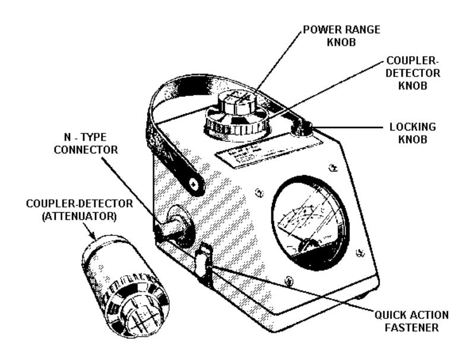

**Figure 5-1.—Wattmeter (AN/URM-120).** 

Other types of power meters measure power indirectly; that is, they sample power in other ways but not by being placed directly between the output of the transmitter and the load. Let's discuss the direct-measuring power meter first; then we'll talk about an indirect-measuring power meter.

### **DIRECT-MEASURING POWER METERS**

The direct-measuring power meter is designed to measure incident (forward) and reflected (reverse) rf power from 50 to 1,000 watts at 2 MHz to 30 MHz and 10 to 500 watts at 30 MHz to 1,000 MHz. Three separate COUPLER-DETECTORS (sometimes called ATTENUATORS), each rated to cover a portion of the frequency and power ranges, are provided with the wattmeter. These devices couple the rf signal into the wattmeter and detect the signal. The coupler-detector knob projects through the top of the wattmeter case, as shown on the AN/URM-120 wattmeter in figure 5-1.

A nameplate on the top of the POWER RANGE knob indicates the power range. The POWER RANGE knob can be rotated 360º to the desired power range. The coupler-detector rotates 180º inside the metal case for either forward or reverse power measurements. Also located inside the metal case are the indicating meter and cable for interconnecting the meter to the coupler-detector. The LOCKING knob locks the coupler-detector and POWER RANGE knobs in place.

Two N-TYPE connectors (one male and one female) are located on either side of the wattmeter case to connect the instrument between the power source and the load. The upper and lower parts of the wattmeter are held together with quick-action fasteners, which permit easy access to the inside of the wattmeter.

Power measurements are made by inserting the proper coupler-detector and connecting the wattmeter in the transmission line between the load and the rf power source. To measure *incident power* with the wattmeter, rotate the arrow on the COUPLER-DETECTOR knob toward the load, and position the POWER RANGE knob for peak meter reading. To measure *reflected power*, position the arrow toward the rf power source.

In effect, rotating the coupler-detector causes the coupler to respond only to a wave traveling in a particular direction, either *to* (incident) or *from* (reflected) the load. It will be unaffected by a wave traveling in the opposite direction. A diode rectifier in the coupler rectifies the energy detected by the

coupler. This detected rf energy is measured across a known impedance to obtain either incident or reflected power.

### **Operating the Wattmeter**

Always de-energize and tag the rf power source before measuring *incident* power. Insert the proper coupler-detector for the rf power being measured into the wattmeter case. Remove the wire shunt (not shown in figure 5-1) from the meter terminals, then connect the wattmeter into the transmission line, either at the load or the rf source. Ensure that all connections are tight.

Position the POWER RANGE knob to a value higher than the rated power of the rf source.

### **CAUTION**

### **If the rated power to be measured is not known, place the POWER RANGE knob in the highest power position before turning on the power source.**

Rotate the coupler-detector so that the arrow indicating power flow points toward the load. Turn on the rf power source. Rotate the POWER RANGE knob to the proper range for measuring and observe the point at which the indicating meter peaks.

### *Q-1. To measure incident power, you must rotate the coupler-detector of the wattmeter so that the arrow indicating power flow points toward which end of the transmission line?*

Reflected power is measured in the same manner as described for incident power, except that the coupler-detector is rotated so that the arrow points toward the rf source.

After completing power measurements, de-energize the rf source, disconnect the wattmeter from the transmission line, and place the wire shunt on the meter terminals.

### **Interpreting Power Measurements Made by the Wattmeter**

The rf power measurements made by the wattmeter are used to determine the voltage standing wave ratio (VSWR) of the load and the power absorbed by the load. (VSWR is covered in NEETS, Module 10, *Introduction to Wave Propagation, Transmission Lines, and Antennas*.) The VSWR can be determined from a chart provided in the wattmeter technical manual, or it can be calculated (as shown in the following example for a UHF transmitter) by the formula below (Pi is the incident power, and Pr is the reflected power as measured by the wattmeter):

Where:

Pi = 30 watts

Pr = 0.5 watts

The example above results in a standing wave ratio expressed as 1.3 to 1. In a perfectly matched transmission line where there is no reflected power (Pr = 0), the standing wave ratio would be 1 to 1. A standing wave ratio of 1.5 to 1 indicates a 5-percent reflection of energy (loss) and is considered to be the maximum allowable loss. So, our example is within allowable limits.

If the standing wave ratio is greater than 1.5 to 1, then the transmission line efficiency has decreased and troubleshooting is necessary. An excellent discussion of the reasons for standing wave ratio increases is presented in EIMB, *Test Methods and Practices*, NAVSEA 0967-LP-000-0130.

You can determine the rf power absorbed by the load simply by subtracting the reflected power reading from the incident power reading made by the wattmeter (30 watts - 0.5 watts = 29.5 watts).

The power meter just discussed is often described as an IN-LINE POWER METER because readings are taken while the power meter is connected in series with the transmission line. Another type of power meter used by the Navy measures power indirectly. An example of an indirect-measuring power meter is described in the next section.

### **INDIRECT-MEASURING POWER METERS**

An example of an indirect-measuring power meter is the HP-431C, shown in figure 5-2. The controls, connectors, and indicators for the power meter are illustrated in figure 5-3. This power meter can be operated from either an ac or dc primary power source. The ac source can be either 115 or 230 volts at 50 to 400 hertz. The dc source is a 24-volt rechargeable battery. Overall circuit operation of the power meter is shown in the block diagram in figure 5-4.

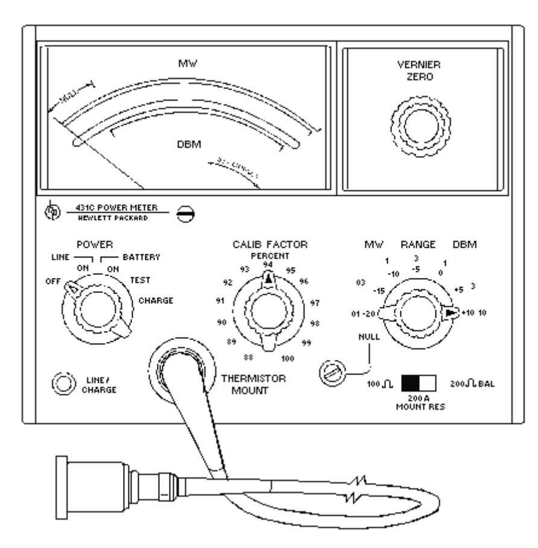

**Figure 5-2.—Power meter (HP-431C).** 

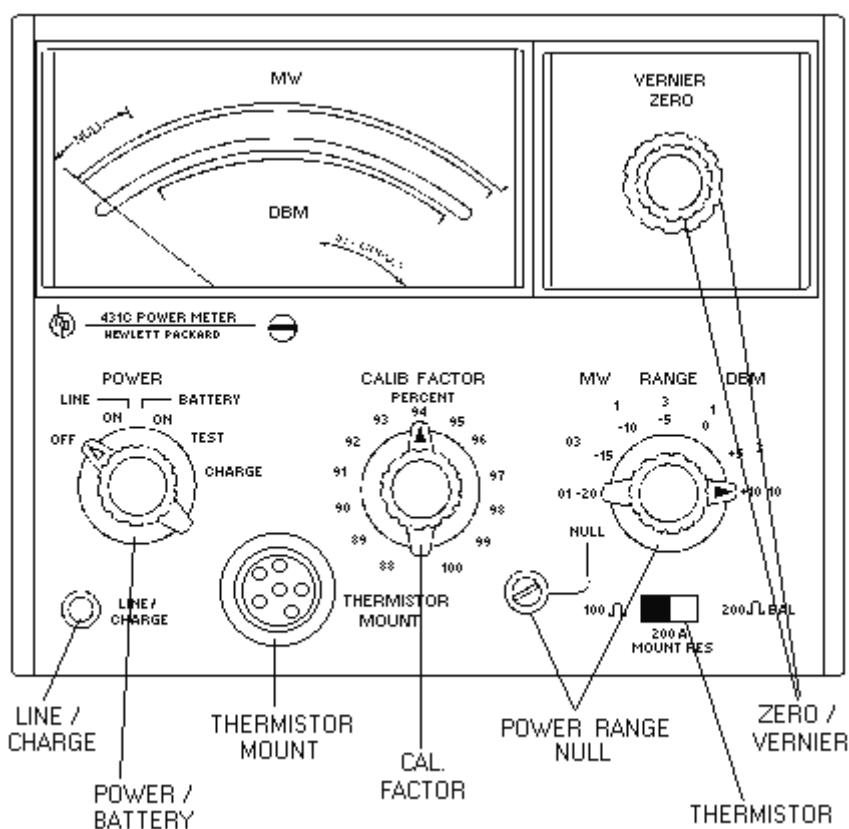

**Figure 5-3.—Power meter controls, indicators, and connectors.** 

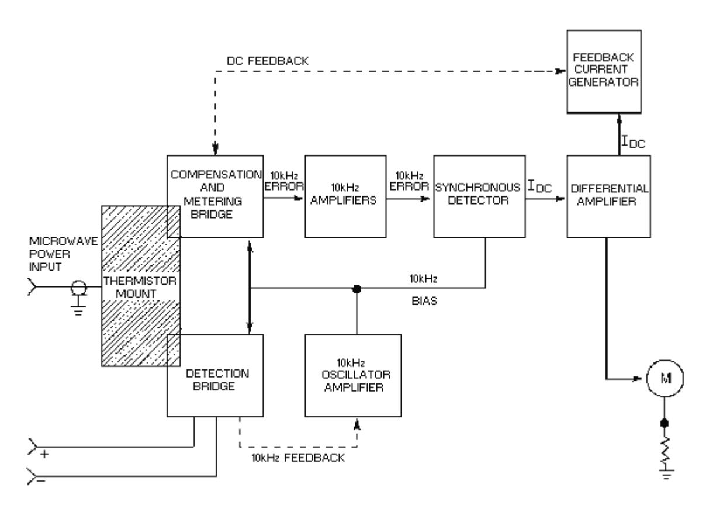

**Figure 5-4.—Power meter block diagram.** 

The HP-431C power meter *indirectly* measures microwave frequency power by using two bridge circuitsthe detection bridge and the compensation and metering bridge. The detection bridge incorporates a 10-kilohertz (kHz) oscillator in which the amplitude is determined by the amount of heating of the thermistors in that bridge caused by microwave power. (Thermistors were covered in chapter 2 of this module.) The compensation and metering bridge contains thermistors that are affected by the same microwave power heating as those of the detection bridge.

An unbalance in the metering bridge produces a 10-kHz error signal. This error signal, plus the 10 kHz bias that is taken directly from the 10-kHz OSCILLATOR-AMPLIFIER, is mixed in the SYNCHRONOUS DETECTOR. The synchronous detector produces a dc current (Idc) that is proportional to the 10-kHz error signal. The Idc error signal is fed back to the compensation and metering bridge, where it substitutes for the 10-kHz power in heating the thermistor and drives the bridge toward a state of balance. The dc output of the synchronous detector also operates the meter circuit for a visual indication of power.

### *Q-2. What condition produces the 10-kHz error signal generated by the metering bridge in the HP-431C power meter?*

The HP-431C power meter measures rf power from 10 microwatts (−20 dBm) to 10 milliwatts (+10 dBm) full scale in the 10 MHz to 18 GHz for a 50-ohm coaxial system and 2.6 GHz to 40 GHz for a waveguide system.

### **SIGNAL GENERATORS**

Standard sources of ac energy, both audio frequency (af) and radio frequency (rf), are often used in the maintenance of electronic equipment. These sources, called SIGNAL GENERATORS, are used to test and align all types of transmitters and receivers. They are also used to troubleshoot various electronic devices and to measure frequency.

The function of a signal generator is to produce alternating current (ac) of the desired frequencies and amplitudes with the necessary modulation for testing or measuring circuits. (Modulation was discussed in NEETS, Module 12, *Modulation Principles*.) It is important that the amplitude of the signal generated by the signal generator be correct. In many signal generators, output meters are included in the equipment to adjust and maintain the output at standard levels over wide ranges of frequencies.

When using the signal generator, you connect the output test signal into the circuit being tested. You can then trace the progress of the test signal through the equipment by using electronic voltmeters or oscilloscopes. In many signal generators, calibrated networks of resistors, called ATTENUATORS, are provided. You use attenuators in signal generators to regulate the voltage of the output signal. Only accurately calibrated attenuators can be used because the signal strength of the generators must be regulated to avoid overloading the circuit receiving the signal.

### *Q-3. In signal generators, what device is used to regulate the voltage of the output signal?*

There are many types of signal generators. They are classified by use and the frequency range covered as AUDIO-FREQUENCY (AF) GENERATORS, VIDEO SIGNAL GENERATORS, RADIO-FREQUENCY (RF) GENERATORS, FREQUENCY-MODULATED RF GENERATORS, and other special types, which combine frequency ranges.

### **AUDIO AND VIDEO SIGNAL GENERATORS**

AUDIO SIGNAL GENERATORS produce stable af signals used for testing audio equipment. VIDEO SIGNAL GENERATORS produce signals that include the audio range and extend into the rf range. These signal generators are used to test video amplifiers and other wideband circuits. In both audio and video signal generators (figure 5-5), major components include a POWER SUPPLY, an OSCILLATOR (or oscillators), one or more AMPLIFIERS, and an OUTPUT CONTROL.

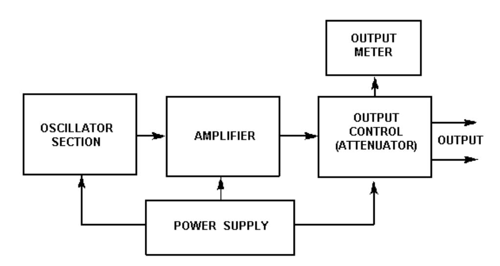

In the audio and video generators that produce a beat-frequency, the output frequency is produced by mixing the signals of two separate rf oscillators. One is fixed in frequency, and the other is variable. The difference between the frequencies of the two oscillators is equal to the desired audio or video frequency.

Audio signal generators often include resistance-capacitance (rc) oscillators in which the af is directly produced. In these signal generators, a resistance-capacitance circuit is the frequency-determining part of the oscillator. The frequency varies when *either* the resistance or the capacitance is changed in value.

In other signal generators, however, the capacitance alone is often chosen as the *only* variable element. The change in frequency that can be produced by this method is limited, and it is usually necessary to cover the entire range of the generator in frequency steps. This is usually accomplished by providing several rc circuits, each corresponding to a specific portion of the entire range of frequency values. The circuits in the oscillator are switched one at a time to provide the desired portion of the af range.

The amplifier section of the block diagram (figure 5-5) usually consists of a voltage amplifier and one or two power amplifiers, which are coupled by means of rc networks. The output of the final power amplifier is often coupled to the output control (attenuator) by means of an output transformer.

The output control section regulates the amplitude of the signal. A commonly used af signal generator is the model SPN audio oscillator shown in figure 5-6. The model SPN is a programmable synthesized signal generator designed to provide a stable, low-distortion, wide-amplitude range signal over a 1-Hz to 1.3-MHz frequency range. Additionally, the equipment provides a square wave output and means for swept operation with an external signal and can be remotely controlled via an IEEE-488 bus. For the proper operation of any test equipment, you should always refer to the specific technical manual that describes its use.

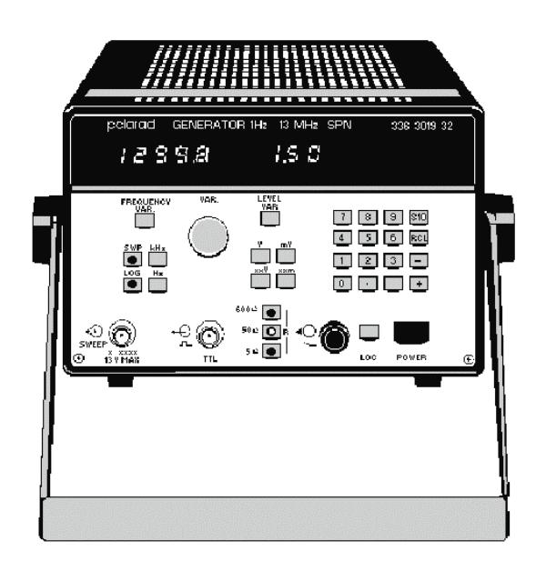

**Figure 5-6.—Model SPN audio oscillator.** 

### **RADIO-FREQUENCY (RF) SIGNAL GENERATORS**

In addition to the necessary power supply, a typical rf signal generator contains three other main sections: an OSCILLATOR CIRCUIT, a MODULATOR, and an OUTPUT CONTROL CIRCUIT. The modulator modulates the rf signal of the oscillator. In addition, most rf generators are provided with connections through which an external source of modulation of any desired waveform can be applied to the generated signal. Metal shielding surrounds the unit to prevent signals from the oscillator from affecting the circuit under test.

### *Q-4. Name the three main sections of a typical rf signal generator.*

A block diagram of a representative rf signal generator is shown in figure 5-7. The function of the oscillator stage is to produce a signal that can be accurately set in frequency at any point within the range of the generator. The type of oscillator circuit used depends on the range of frequencies for which the generator is designed. In lower frequency rf signal generators, the oscillating circuit consists of one of a group of coils combined with a variable capacitor. One of the coils is selected by the position of a range selector switch that connects the coil to a capacitor to provide an inductance-capacitance circuit. The inductive-capacitance circuit then has the correct range of resonant frequencies.

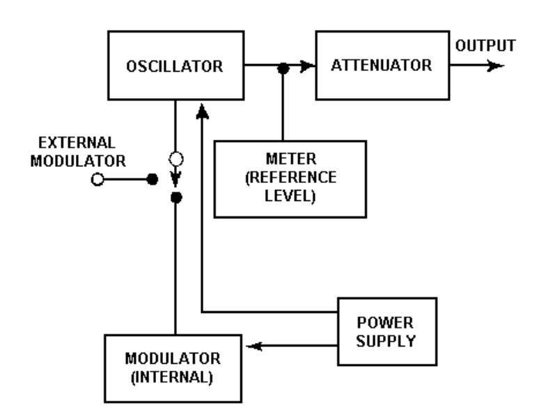

**Figure 5-7.—Rf signal generator block diagram.** 

The function of the modulator is to produce an audio (or video) modulating signal that can be superimposed on the rf signal produced by the oscillator. The modulating signal may be provided by an audio oscillator within the generator. This is termed INTERNAL MODULATION. It may also be derived from an external source. This is termed EXTERNAL MODULATION. In some signal generators, either of these two methods of modulation can be employed. In addition, a means of disabling the modulator section is available so that the pure, unmodulated signal from the oscillator can be used when desired.

### *Q-5. What is the function of the modulating circuit?*

The type of modulation selected depends on the application of the particular signal generator. The modulating signal may be a sine wave, a square wave, or pulses of varying duration. In some special generators, provision is made for pulses over a wide range of repetition rates and widths.

The output circuit of the rf signal generator usually contains a calibrated attenuator and an output level meter. The output level meter provides an indication and permits control of the output voltage of the generator. The attenuator allows you to select the amount of this output. The attenuator is made up of a group of resistors that form a voltage-dropping circuit.

It is controlled by a control calibrated in microvolts. When the control is adjusted so that the output meter reads unity (1.0), the reading on the attenuator control gives the exact value (no multiplication factor) of the output in microvolts. If an output voltage at a lower value is desired, the attenuator control is varied until the meter indicates some decimal value less than 1. This decimal is multiplied by the attenuator reading to give the actual output in microvolts.

An rf signal generator currently in wide use by the Navy is the HP 8640B (figure 5-8). The HP 8640B signal generator covers the frequency range of 500 kilohertz to 512 megahertz, and can be extended to 1,024 MHz by using adapters.

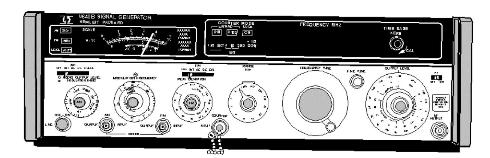

**Figure 5-8.—Rf signal generator (HP-model 8640B).** 

This completes our discussion of signal generators. The following section deals with an instrument that *measures* frequencythe FREQUENCY COUNTER.

### **FREQUENCY COUNTERS**

The signal generators you studied in the previous section *provide* signals for use in testing, aligning, and troubleshooting electronic equipment. Now, we will study the FREQUENCY COUNTER, an instrument that *measures* frequencies. Frequency counters are used to measure frequencies already in existence. An example of a typical frequency counter, the model 5328A, is shown in figure 5-9.

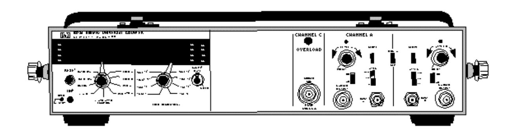

**Figure 5-9.—Model 5328A 500 MHz universal frequency counter.** 

### **GENERAL DESCRIPTION OF THE FREQUENCY COUNTER**

The following description is for the model 5328A counter only. Other counters use different techniques to derive the displayed frequency. The outputs available vary from counter to counter. For further information on other types of counters and their uses, refer to EIMB, *Test Equipment*, NAVSEA 0967-LP-000-0040.

The model 5328A is a portable, solid-state electronic frequency counter. It is used to precisely measure and display, using a nine-digit LED readout, frequency, period, period average, time interval, time interval average, and ratio of electronic frequency signals. This frequency counter can also provide a 1-MHz and 10-MHz output signal through the back-panel BNC.

### *Q-6. What frequencies are provided through the back-panel BNC?*

The model 5328A frequency counter can be divided into four major internal subsections: the main counter section, input section, power supply, and interface bus section. Additionally, two separate (front panel) input channels provide for time interval measurements. Each channel has an attenuator, trigger slope selector, level control, ac or dc coupling, and an oscilloscope marker output. A third input channel is provided to allow the measurement of 30 MHz to 500 MHz with a maximum input of 5 volts rms with a fused-protected connection.

Front-panel controls are provided for you to do the function selection, frequency resolution, sample rate, and reset display. Also, a push-button control on the front panel allows the unit to be used in the operational or standby mode (power applied to the crystal oven to eliminate warm-up). Rear-panel connectors provide the gated output frequencies and an input for an external frequency standard. A detachable front cover is used to store accessory cables and connectors.

### **Controls and Indicators**

Figures 5-10 and 5-11 show all the front- and rear-panel operating controls and indicators. Refer to tables 5-1 and 5-2 for a description of each of the numbered controls and connectors shown in figures 5- 10 and 5-11, respectively.

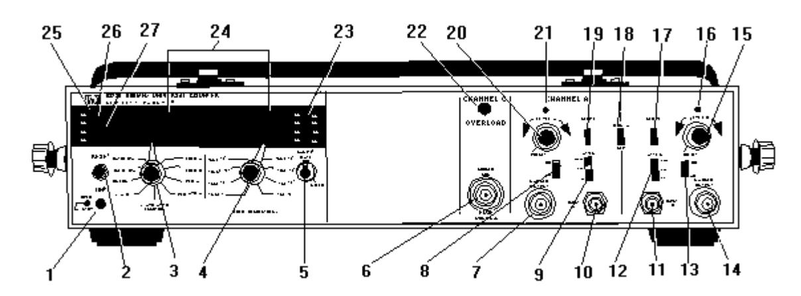

**Figure 5-10.—Front-panel controls and indicators.** 

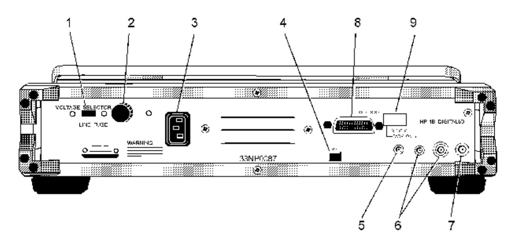

**Figure 5-11.—Rear-panel controls and connectors.** 

**Table 5-1.—Front Panel Controls and Connectors** 

| NO. NAME 1 LINE switch 2 RESET FUNCTION 3 FREQ A FREQ C PER A PER AVG A T. I. AVG A ! B T. I. A ! B CHECK RATIO C/A 3 Continued RATIO B/A Top 4 FREQ RESOLUTION, N | DESCRIPTION power supplies normal power to the unit for operation. annunciator LEDs for a LED test. channel A. channel C. channel A. switch selection made. signal applied to channel B. switch, and RESET. frequency at channel C to the frequency at channel A. frequency at channel B to the frequency at channel A. This position is blank and has no function. N GATE TIME RESOLUTION (seconds) (Hz) 1×10 -6 1 1 M 10×10 -6 100 k 10 |
|--------------------------------------------------------------------------------------------------------------------------------------------------------------------|-------------------------------------------------------------------------------------------------------------------------------------------------------------------------------------------------------------------------------------------------------------------------------------------------------------------------------------------------------------------------------------------------------------------------------------------|
| 10                                                                                                                                                                 | 2                                                                                                                                                                                                                                                                                                                                                                                                                                         |
| 10                                                                                                                                                                 | 3                                                                                                                                                                                                                                                                                                                                                                                                                                         |
| 10                                                                                                                                                                 | 4                                                                                                                                                                                                                                                                                                                                                                                                                                         |
| 10                                                                                                                                                                 | 5                                                                                                                                                                                                                                                                                                                                                                                                                                         |
| 10                                                                                                                                                                 | 6                                                                                                                                                                                                                                                                                                                                                                                                                                         |
| 10                                                                                                                                                                 | 7                                                                                                                                                                                                                                                                                                                                                                                                                                         |
|                                                                                                                                                                    | 100×10 -6                                                                                                                                                                                                                                                                                                                                                                                                                                 |
|                                                                                                                                                                    | 1×10 -3                                                                                                                                                                                                                                                                                                                                                                                                                                   |
| 5 SAMPLE RATE                                                                                                                                                      |                                                                                                                                                                                                                                                                                                                                                                                                                                           |
| 6 500 MHz, 50 "                                                                                                                                                    | This is the channel C input connector.                                                                                                                                                                                                                                                                                                                                                                                                    |
| 7, 14 OUTPUT MARKER                                                                                                                                                | These are the channel A and B Schmidt trigger outputs used to indicate when a                                                                                                                                                                                                                                                                                                                                                             |

**Table 5-1.—Front Panel Controls and Connectors—Continued** 

| 8, 13  | AC/DC              | These control the selection of ac or dc coupling for the input signal. When the   |
|--------|--------------------|-----------------------------------------------------------------------------------|
| 9, 12  | ATTEN switches     | These select the attenuation of the input signal. The signal amplitude is reduced |
| 10, 11 | INPUT A and B      | These are the input BNC connectors for channels A and B.                          |
| 15, 20 | LEVEL A/B          | These controls are used in conjunction with the ATTEN (Nos. 9, 12) to select      |
| 16, 21 | Channel A and B    |                                                                                   |
| 17, 19 | Channel A and B    |                                                                                   |
| 18     | COM A/SEP          | This is the input amplifier control switch that selects independent operation of  |
| 22     | OVERLOAD           | This indicator will flash on and off if more than 5 volts is applied to channel C |
| 23     | K, S, M, n, and Hz | These will light up to show the appropriate units multiplier of the measurement   |
| 24     | LED display        | This is a nine-digit LED display that shows the numerical measurement taken.      |
| NO.    | NAME               | DESCRIPTION                                                                       |
| 25     | OVFL               | This indicates an overflow of one or more of the most significant digits          |
| 26     | RMT                | Lights when the unit is in remote operation.                                      |
| 27     | GATE               | Lights when the counter's main gate is open and a measurement is in progress.     |

**Table 5-2.—Rear-Panel Controls and Connectors** 

| NO. | NAME               | FUNCTION                                                                         |
|-----|--------------------|----------------------------------------------------------------------------------|
| 1   | VOLTAGE            |                                                                                  |
| 2   | LINE FUSE          | This requires the insertion of a 2.0 amp fuse for 115 volt or 1.0 amp fuse for   |
| 3   | Input ac connector | Used to connect the input ac to the unit.                                        |
| 4   | ARM                | When this switch is in the OFF position, the counter is armed by the signal that |
| 5   | EXT OSC            | This input connector allows a separate outside signal to be used for the time    |
| 6   | 1 MHz OUT and 10   |                                                                                  |
| 7   | GATE/MARKER        |                                                                                  |
| 8   | HP-IB              | This is an interface bus connector that allows the unit to receive programming   |

### **Frequency Measurement**

As discussed previously, the model 5328A frequency counter is capable of measuring frequency, time period (inverse of frequency), ratio, and time interval. We will start with frequency. When the FUNCTION selector is in the FREQ A or FREQ C position, the counter measures the frequency, f, by accumulating the number of cycles, n, of the input signal that occurs over the time period, t. This is expressed by:

The basic counter elements necessary to perform this measurement are shown in figure 5-12. The INPUT AMPLIFIER/TRIGGER essentially conditions the input signal to a format that is compatible with the internal circuitry of the counter. As figure 5-12 indicates, the output of the amplifier/trigger corresponds directly to the input signal.

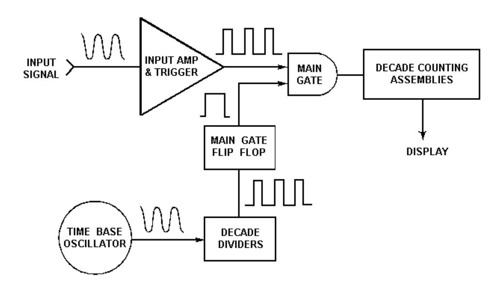

**Figure 5-12.—Basic elements of the frequency counter.** 

The TIME BASE OSCILLATOR is a 10-MHz temperature-controlled (oven-regulated) precision, crystal oscillator used for the time base element from which time, t, is derived. DECADE DIVIDERS take the time base oscillator signal as the input and provide a pulse train, whose frequency is variable in decade steps. This frequency can be controlled by the FREQ RESOLUTION, N switch. The time, t, is determined by the period of this pulse train.

The heart of the counter is the MAIN GATE. When the gate is opened, pulses from the amplifier/trigger are allowed to pass through. The opening and closing of the main gate is controlled by the decade divider output to the main gate flip-flop. The output of the MAIN GATE is then sent to the DECADE COUNTING ASSEMBLIES (DCAs), where the pulses are combined and displayed after the gate is closed.

If the FREQUENCY RESOLUTION, N selection switch, is set for 10 6, the main gate is open for 1 second, and the decade counting assemblies display the frequency of the input signal in hertz (refer to figure 5-10, FREQUENCY RESOLUTION, N selection switch).

### **Period Measurement**

Period, the inverse of frequency, can be measured with the counter by reversing the inputs to the main gate. With the FUNCTION selector switch in the PER A position, the input signal controls the duration over which the main gate is open and the decade divider output is counted by the DCAs (see figure 5-13). The duration of the count is one cycle or period of the input signal. When the FUNCTION selector is in the PER AVG A position, the unused decades in the decade divider chain are used to divide the amplifier/trigger output so that the gate remains open for decade steps of each input period rather than a single period. This is the basis for multiple period averaging. Period and period averaging techniques are used to increase measurement accuracy on low-frequency measurements.

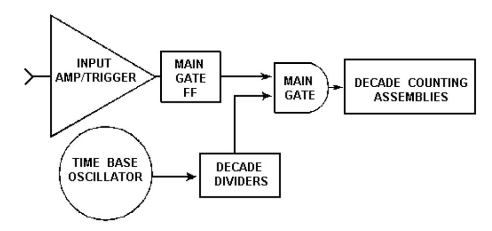

**Figure 5-13.—Measuring period.** 

### **Ratio Measurement**

Placing the FUNCTION selector switch to RATIO C/A OR B/A sets the counter to measure the ratio of the signal frequency at channel C or B to the signal frequency at channel A. Using the same configuration as in figure 5-13 and replacing the time base with a second input frequency, f2, you can measure the ratio of f 2/f. The signal at frequency f can be divided into decade steps in the same manner as multiple period averaging for higher resolution.

### **Time Interval Measurement**

Figure 5-14 illustrates the configuration for the measurement of time between two events or time interval. This is done by placing the FUNCTION selector in the T.I.AVG AB position. The START input opens the main gate, and the STOP input closes it. The START input is applied to channel A, and the STOP input is applied to channel B. The decade divider output (clock pulses) is counted, and the display shows the elapsed time between START and STOP signals, as shown in figure 5-15.

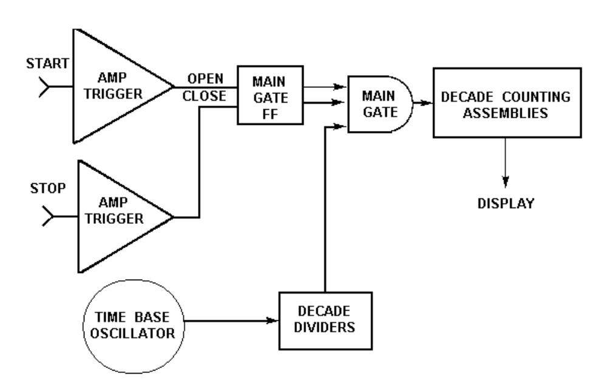

**Figure 5-14.—Basic elements of a time interval counter.** 

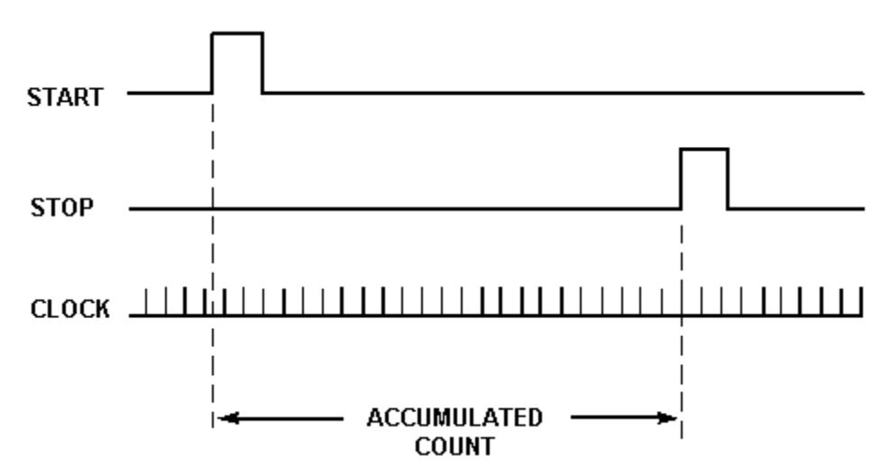

**Figure 5-15.—Clock pulses.** 

### **Resolution**

The resolution of the measurement is determined by the frequency of the counted clock (for example, a 10-MHz clock provides 100 ns resolution [see figure 5-10, FREQUENCY RESOLUTION, N selection switch]). The input amplifier, main gate, and DCAs (elements of the time interval counter) must operate at speeds consistent with the clock frequency; otherwise the instrument's resolution would be meaningless. Clock frequencies of 1, 10, and 100 MHz, and other 10n frequencies, are preferred, since the accumulated count, with the appropriate placement of the decimal point, gives a direct readout of the time interval. This explains why the conventional time interval counter is presently limited to 10 nanoseconds, a clock frequency of 100 MHz. One GHz is beyond reach, and a clock frequency of 200 MHz would require some arithmetic processing of the accumulated count in the DCAs to enable time to be displayed directly.

### **Time Interval Averaging**

The time interval averaging technique is based on the fact that if the ±1 count error is truly random, it can be reduced by averaging a number of measurements. The words "truly random" are significant. For time interval averaging to work, the time interval must (1) be repetitive and (2) have a repetition frequency that is asynchronous to the instrument's clock. Under these conditions, the resolution of the measurement is:

With averaging, resolution of a time interval measurement is limited only by the noise inherent in the instrument. The 5328A can obtain 10-picoseconds resolution. Most time interval averaging has one severe limitation: The clock period limits the minimum measurable time interval. With the FUNCTION selector switch in the T.I. AVG AB position, synchronizers are used to remove this limitation. These synchronizers enable the 5328A to measure intervals as short as 100 picoseconds.

Referring to figure 5-16, note that the input waveshape shows a repetitive time interval, which is asynchronous to the square wave clock. When these signals are applied to the main gate, with no synchronizers, an output similar to the third waveform results. Since the DCAs are designed to count at the clock frequency and are unable to accept pulses of shorter duration than the clock, the resulting counts accumulated in the DCAs will be in error, as shown in the fourth waveform. This problem is alleviated by the synchronizers, which are designed to detect leading edges of the clock pulses that occur while the gate is open. They detect and reconstruct the leading edges, making the pulses applied to the DCAs the same duration as the clock, as shown in the fifth waveform. Occasionally, when the input time interval repetition is synchronous with the internal clock, time interval averaging cannot be performed.

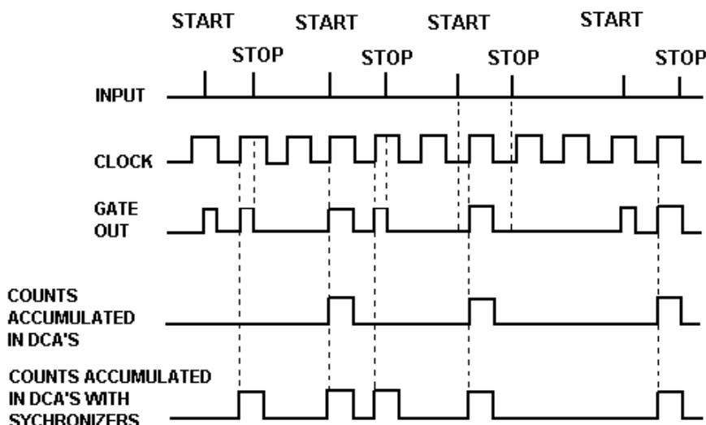

**Figure 5-16.—Synchronizer operation with time interval averaging.** 

This ends our discussion on electronic frequency counters. Now, we'll study an area of electronics test equipment that is becoming more widespread and important each daythe testing of electronic logic components. A test instrument of value for any technician who works on digital equipment is the LOGIC PROBE, which is an integrated circuit-testing device.

### **INTEGRATED CIRCUIT-TESTING DEVICES**

Digital integrated circuits are relatively easy to troubleshoot and test because of the limited numbers of input and output combinations involved in circuits. The two-state conditions in logic circuits are often referred to as (1) low or high, (2) on or off, or (3) one or zero (1 or 0).

Other terminology may also be used. Any particular integrated circuit (IC) can be tested by simply comparing it to a known good one. The LOGIC PROBE is a device that can be of great value in troubleshooting digital integrated logic circuits.

The ideal logic probe has the following characteristics:

- It will detect a steady logic level.
- It will detect a train of logic levels.
- It will detect an open circuit.
- It will detect a high-speed transient pulse.
- It will have over-voltage protection.
- It will be small, light, and easy to handle.

The use of a suitable logic probe can greatly simplify your troubleshooting of logic levels through digital integrated logic circuitry. It can immediately show you whether a specific point in the circuit is low, high, open, or pulsing. Some probes have a feature that detects and displays high-speed transient pulses as small as 10 nanoseconds wide. These probes are usually connected directly to the power supply of the device being tested, although a few have internal batteries.

Most IC failures show up in a circuit as a constant high or low level. Because of this, logic probes provide a quick, inexpensive way of locating the fault. They can also display the single, short-duration pulse that is hard to detect on an oscilloscope. Figure 5-17 shows a basic logic probe.

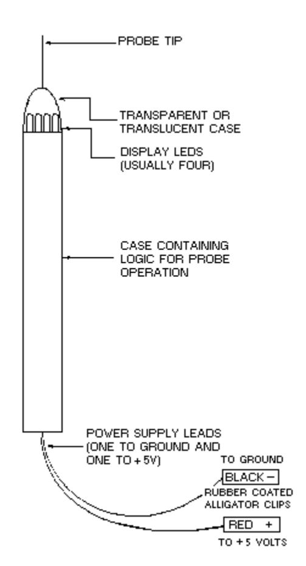

**Figure 5-17.—Basic logic probe.** 

The logic probe can be powered from the supply of the circuit under test or from a regulated dc power supply. If a separate power supply is used, the ground points of the power supply and circuit under test should be connected together.

The display LED (light-emitting diode) near the probe tip provides an immediate indication of the logic state existing in the circuit under test. The LED will provide any of four indications: (1) off, (2) dim (about one-half brilliance), (3) bright (full brilliance), and (4) flashing on and off. The LED is normally in the dim state and must be driven to one of the other three states by voltage levels at the probe tip. The LED is usually bright for inputs above the logic "1" threshold and off for inputs below the logic "0" threshold. The LED is usually dim for voltages between the logic "1" and logic "0" thresholds and for open circuits.

### *Q-7. The LED lamps of a typical logic probe are normally in what state?*

Another logic circuit analysis technique is useful with the logic probe. This technique is to run the circuit under test at its normal clock (timing) rate while monitoring for various control signals, such as RESET, START, STOP, SHIFT, TRANSFER, or CLOCK. Questions such as "Is the counter operating?" are quickly resolved by noting if the probe indicator is flashing on and off, indicating that pulse train activity is present.

This ends our discussion on logic probes. Now, we'll study another piece of electronics test equipment that is used in evaluating integrated circuits, the HUNTRON TRACKER 2000.

### **HUNTRON TRACKER 2000**

The logic probe we just discussed is but one specialized tool used to isolate problems to the component level. Another device you can use is the Huntron Tracker 2000. It is a very versatile electronic troubleshooting tool that is used to evaluate suspect components and/or locate defective components on de-energized circuit cards quickly and safely without requiring the removal of component leads. The unit provides a built-in display that allows you to visually analyze the component under test conditions.

### **CAUTION**

**Before connecting the Huntron Tracker 2000, you must first secure all power, then discharge all high-voltage capacitors.** 

### **PHYSICAL FEATURES**

Because the Tracker 2000 has so many controls and indicators, it would impractical to cover each within this chapter. We will therefore concentrate our discussion only to the externally accessible features. To find information on internal controls and indicators, you should review the most current technical manual with up-to-date changes entered for the unit being used.

### **Front Panel**

The front-panel (figure 5-18) design allows you to easily select the desired function. All the push buttons are the momentary action type and have light-emitting diode (LED) indicators embedded in them to show the functions that are active, by lighting up when active. A detailed description of each item on the front panel is provided in table 5-3.

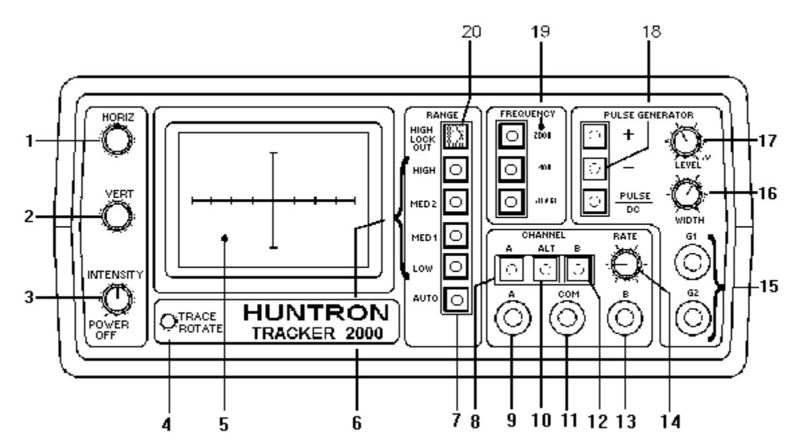

**Figure 5-18.—Front Panel.** 

**Table 5-3.—Front-Panel Controls and Connectors** 

| NO. | NAME                 | DESCRIPTION                                                                    |
|-----|----------------------|--------------------------------------------------------------------------------|
| 1   | HORIZ control        | When adjusted this controls the horizontal position of the CRT display.        |
| 2   | VERT control         | When adjusted, this controls the vertical position of the CRT display.         |
| 3   | POWER on/off and     |                                                                                |
| 4   | TRACE ROTATE control | When adjusted, this controls the trace rotation of the CRT.                    |
| 5   | CRT display          | This displays the signatures produced by the unit.                             |
| 6   | RANGE selectors      | These are push buttons that are used to select one of four impedance           |
| 7   | AUTO selector        | This push button, when selected, initiates automatic scanning of the four      |
| 8   | CHANNEL A selector   | This push button, when selected, causes channel A to be displayed on the       |
| 9   | CHANNEL A test plug  | This is a fused test lead connector that is active when channel A is selected. |
| 10  | ALT selector         | When selected, this push button causes the unit to alternate between           |
| 11  | COM test plug        | This test lead connector is the instrument common to and the common            |
| 12  | CHANNEL B selector   | This push button, when selected, causes channel B to be displayed on the       |
| 13  | CHANNEL B test plug  | This is a fused test lead connector that is active when channel B is selected. |
| 14  | RATE control         | This controls the channel alteration and/or the range scanning.                |
| 15  | G1 and G2 plugs      | These are used for the pulse generator output test leads.                      |
| 16  | WIDTH control        | This controls the duty cycle of the pulse generator.                           |
| 17  | LEVEL control        | This controls the amplitude of the internal pulse generator.                   |
| 18  | PULSE GENERATOR      |                                                                                |
| 19  | FREQUENCY selectors  | These push buttons are used to select one of the three test signal             |

### **Cathode-Ray Tube (CRT) Display**

The CRT display (figure 5-19) is used to view the signature of the component under test. The display has a graticule consisting of a horizontal and vertical axes. The horizontal axis is used to represent voltage with the vertical axis being used to represent current. The axes divide the display into four quadrants. Each quadrant displays a different portion of the signature for the component under test.

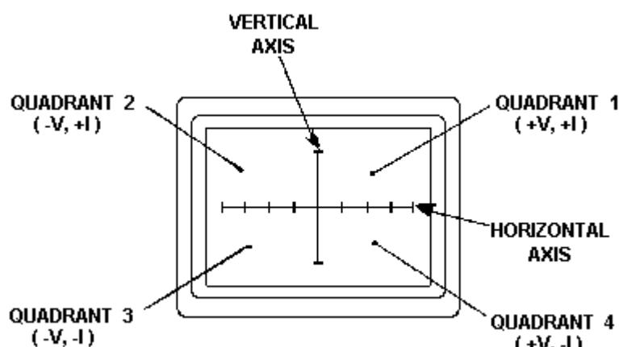

**Figure 5-19.—CRT display.** 

- Quadrant 1 displays positive voltage and positive current.
- Quadrant 2 displays negative voltage and positive current.
- Quadrant 3 displays negative voltage and negative current.
- Quadrant 4 displays positive voltage and negative current.

*Q-8. On the CRT display, what information is displayed in Quadrant 4?* 

The horizontal axis (see figure 5-19) is divided into eight equal divisions, allowing the technician to estimate the voltage at which changes occur in the signature for the component being tested. The associated approximate horizontal sensitivities for each range are:

- High = 15.0 Volts/Div.
- Medium 2 = 5.0 Volts/Div.
- Medium 1 = 3.75 Volts/Div.
- Low = 2.5 Volts/Div.

### **Back Panel**

The back panel (figure 5-20) provides three additional controls and connectors. One is the accessory output connector (ACC), which provides a clock signal and power for the Huntron Switcher Model HSR410. Next, is the power cord connector used to provide the required ac line voltage used to power the unit. The last item found on the back panel is the FOCUS control; this controls the focus for the frontpanel CRT display.

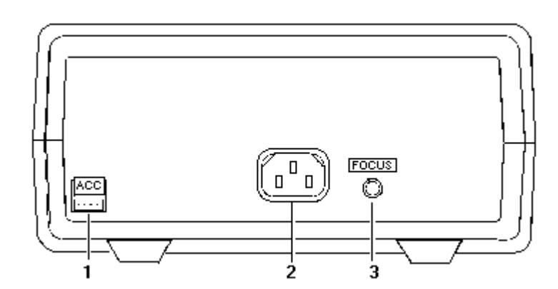

**Figure 5-20.—Back panel.** 

### **OPERATION**

The following sections explain how to use most of the front- and back-panel controls and connectors. Each control and connector has already been briefly described. To review this information, refer to figure 5-18 and table 5-3.

### **Initial Setup**

First, turn the POWER/INTENSITY knob located on the front panel to the clockwise, on, position. Under normal conditions, the unit will come on with the following LEDs illuminated: power, channel A, 50/60 Hz, low range, and pulse/DC.

Focusing the CRT is very critical for the technician to be able to properly analyze the signature being displayed. This is done by first turning the INTENSITY control to a level comfortable for the eye, and then adjusting the FOCUS control (back panel) for the narrowest possible trace.

Aligning the trace will help determine, during troubleshooting, which quadrant the portion of the signature is in during a change. With a short circuit applied to channel A (connect a cable between jack A and COM), adjust the TRACE ROTATE control until the trace is as close to parallel as possible to the vertical axis. Then, adjust the HORIZ (horizontal) control until the vertical trace is as close to even with the vertical axis as possible.

### *Q-9. When aligning the trace with a short applied to channel A, which control should be adjusted to bring the trace parallel to the vertical axis?*

With an Open applied to channel A (nothing connected to A and COM test plug), adjust the VERT (vertical) control until the horizontal trace is as close to even with the horizontal axis as possible. Once set, these adjustments should not need readjusting during the unit's operation. However, remember that each time the unit is used, this process will need to be repeated.

### **Range Selection**

Four impedance ranges (LOW, MED 1, MED 2, and HIGH) can be selected on the Tracker 2000. These ranges will become active when the appropriate front-panel button is pressed. To obtain the most useful signature display when troubleshooting a component, you should always start by selecting one of the two medium ranges (medium 1 or medium 2). If the display appears to be an open (horizontal trace), then the next higher range should be selected to get a more accurate signature for analysis. If the display appears to be a short (vertical trace), then the next lower range should be selected.

The AUTO feature, when selected, will allow the unit to automatically scan through the four ranges at a speed set by the technician using the RATE control knob. This allows the user to keep his or her hands free to hold test leads while still being able to observe the component under test signature for analysis. The HIGH LOCKOUT, when selected by the technician, prevents the unit from functioning in the HIGH range in either the manual or AUTO mode.

### **Channel Selection**

You can select two channels by pressing the channel A (test probes connected to A jack and COM) or channel B (test probes connected to B and COM jacks) push button on the front panel. When using a single channel, you should plug the red probe into the corresponding channel test jack, and plug the black test lead into the common test jack. When testing a component, you should connect the red probe to the positive terminal and the black probe to the negative terminal of the component under test. Following this procedure every time will ensure that the signature for the component under test will be displayed in the correct quadrants of the CRT display.

The ALT (alternate) mode provides automatic switching back and forth between channel A and channel B. This allows you to easily compare two components or the same test points on two circuit boards. You select the ALT mode by pressing the ALT push button on the front panel. The rate of switching between channels A and B can be varied by adjusting the RATE control knob on the front panel. You will find that the ALT mode feature is very useful for comparing a known good component with the same type of component that is of unknown quality.

Figure 5-21 shows a typical way of connecting the unit to a known good circuit board and a board under test. This test mode uses the supplied common test leads to connect two equivalent points on the boards to the common test jack. Note that the black probe is now being used in the channel B jack rather than the COM jack. When the technician uses the ALT and AUTO features together, each channel is displayed before the range selection will change. Figure 5-22 shows the sequence of these changes.

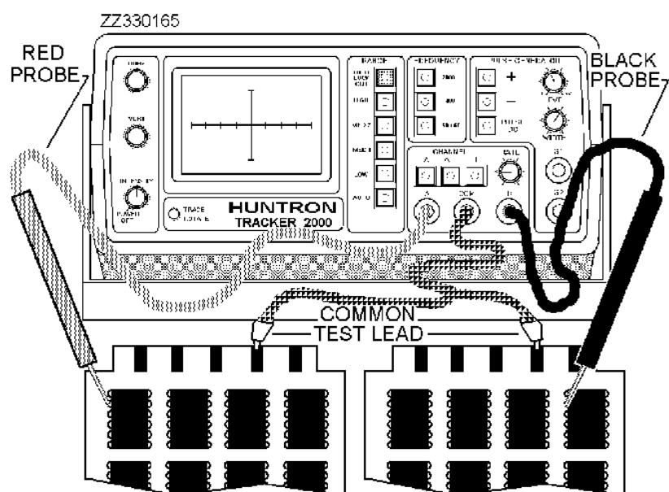

**Figure 5-21.—ALT (alternate) mode setup.** 

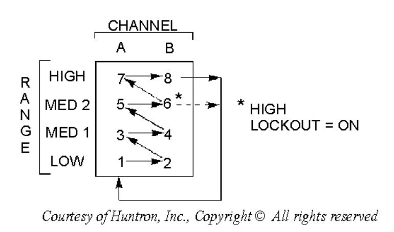

**Figure 5-22.—AUTO/ALT sequence.** 

### **Frequency Selection**

There are three test signal frequencies (50/60 Hz, 400 Hz, and 2000 Hz) that can be selected and then provided by pressing the appropriate front-panel push button. During most troubleshooting evolutions, the 50/60 Hz test signal is the best to start with. The 400 Hz and 2000 hz frequencies are generally used to view small amounts of capacitance or large amounts of inductance.

### **Pulse Generator**

A built-in pulse generator is also provided with the Tracker 2000. It allows the technician to do dynamic, in-circuit testing of certain devices in their active mode. In addition to using the red and black probes, you can connect the output of the pulse generator to the control input of the device to be tested with one of the blue micro clips provided with the unit. The pulse generator has two outputs (G1 and G2 jacks) so that three devices can also be tested in the ALT (alternate) mode. Figure 5-23 shows a way of connecting the unit in the ALT mode using the pulse generator.

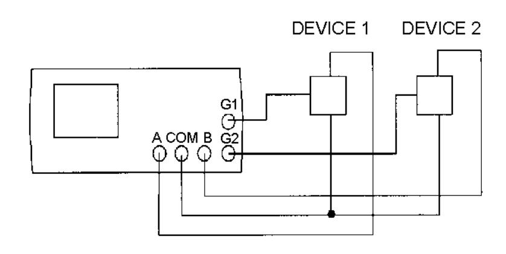

**Figure 5-23.—Pulse generator comparison mode.** 

There are a variety of output waveforms available using the pulse generator selection buttons, as shown in figure 5-24. First, the technician must select the PULSE mode or DC mode using the PULSE/DC button located on the front panel. In the PULSE mode, the PULSE/DC LED flashes at a slow rate. While in the DC mode, this LED will be continuously on.

**Figure 5-24.—Pulse generator selector chart.** 

Next, the technician needs to select the polarity of the output desired by using the positive (+) and/or negative (−) push buttons. All three buttons only function in a push-on/push-off mode and will only interact with each other to avoid the NOT ALLOWED state found in figure 5-24.

Once the specific output type has been selected, the output desired by the technician is set using the LEVEL and WIDTH controls. The LEVEL control is used to vary the magnitude of the output amplitude from zero to 5 volts (peak or DC). During the PULSE mode, the WIDTH control will adjust the cycle of the pulse output from low to 50 percent maximum (square wave).

The start of a pulse will be triggered by the appropriate zero crossing of the test signal, which results in the pulse frequency being equal to the selected test signal frequency.

The end of the pulse is determined by the WIDTH control setting, which determines the cycle length. The WIDTH control, however, has no effect when the DC mode is selected.

### **FUNCTIONAL OVERVIEW**

There are six major sections in the Tracker 2000, as shown in the block diagram in figure 5-25. The control logic section controls the selection of the channel, frequency, impedance range, and pulse generator mode according to the front-panel buttons pushed by the technician. The oscillator provides the test signal that is used by the signal and pulse generator sections. In the signal section, the test jacks are driven by the test signal, while signal conditioners monitor the jacks and produce the horizontal and vertical signals used by the CRT section to produce a component signature on the display. The pulse generator provides an added source for testing three additional terminal devices. The power supply produces all the required voltages needed to operate the Tracker 2000.

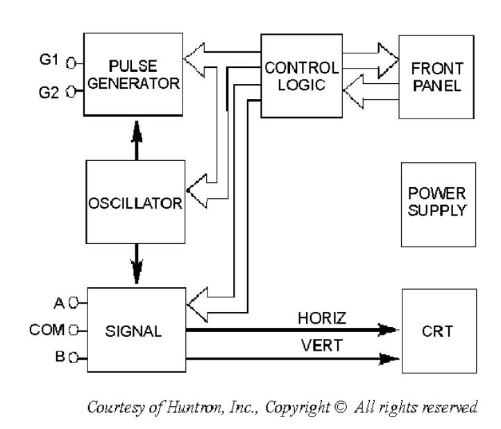

**Figure 5-25.—Tracker 2000 block diagram.** 

### **Control Logic**

The control logic senses which button is pushed on the front panel. Since the buttons are the momentary action type, the logic must remember what button was pushed, turn on the LED indicator within the button, and activate the appropriate configuration of the oscillator, signal, and pulse generator sections.

After a button is pushed, the unit will remain in that configuration until another selection is made or the power is secured. The HIGH LOCKOUT and PULSE GENERATOR push buttons are the only ones that require repetitive pressing to be turned on or off.

The channel relay is controlled by CHANNEL buttons A, ALT, and B. The relay is a single-pole, double-throw type and is de-energized for channel A and energized for channel B. If CHANNEL A is already selected and the CHANNEL B button is pressed, CHANNEL A will be canceled and CHANNEL B selected. When the ALT button is pressed, another control line is set, which enables an internal clock to toggle the channel relay on and off, causing the unit to alternate between channels A and B.

The internal clock is controlled by the RATE control knob on the front panel. When the ALT mode is active, the LEDs within the A and B buttons flash alternately, and the ALT LED is on continuously. Pressing either of the channel buttons will cancel the ALT mode, and the selected channel will then become active.

The FREQUENCY buttons (50/60, 400, and 2000 Hz) directly control the operation of the oscillator and the pulse generator. The RANGE buttons (LOW, MED 1, MED 2, and HIGH) control four relays in the signal section that select the appropriate terminal characteristics for each impedance range (table 5-4).

**Table 5-4.—Terminal Characteristics for Impedance ranges** 

| RANGE    | OPEN CIRCUIT VOLTAGE (Vp) | SHORT CIRCUIT CURRENT (mAr) |
|----------|---------------------------|-----------------------------|
| High     | 60                        | 0.57                        |
| Medium 2 | 20                        | 0.53                        |
| Medium 1 | 15                        | 8.5                         |
| Low      | 10                        | 132                         |

You can select the four ranges manually by pressing the RANGE button, or you can scan them automatically by using the AUTO function. When AUTO is activated, the control logic will follow the sequence LOW, MED 1, MED 2, and HIGH over and over if HIGH LOCKOUT is off. The current active range is always indicated by the LED for the range selected. The AUTO mode will stay active until you select a particular range by pressing its associated button. While AUTO is active, the AUTO LED is continuously on.

The speed at which the ranges are scanned is controlled by the front-panel RATE control knob. This allows you to adjust the time each range is displayed for signature analysis on the CRT display. If AUTO and ALT (alternate) are active at the same time, the RATE control affects the speed of both functions with ALT having priority. This is done so that the two channels can be compared to each other within one range before the next range is selected (figure 5-26).

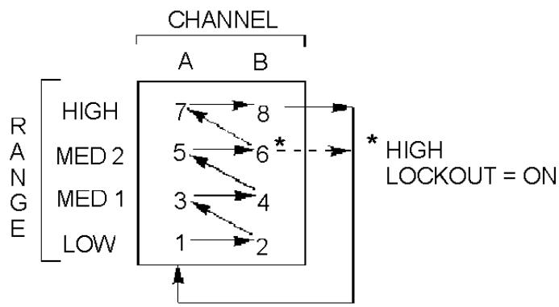

**Figure 5-26.—Range scanning sequence with AUTO and ALT active.** 

The HIGH LOCKOUT function disables the HIGH range and limits the maximum test signal to 20 volts peak vice 60 volts peak. When you select the manual mode (AUTO off), activating the HIGH LOCKOUT prevents the HIGH range from being selected. If the HIGH range is active when the HIGH LOCKOUT is pressed, the HIGH range is canceled and the next lower range (MED 2) will be selected and become active. When you select the AUTO mode, the RANGE sequence with the HIGH LOCKOUT active will start with LOW, and sequence through MED 1, MED 2, back to LOW, and continue until the AUTO mode is stopped.

The PULSE GENERATOR buttons (positive [+], negative [−], and PULSE/DC) toggle control lines that change the polarity and output type of the pulse generator.

### **Oscillator**

The oscillator produces a constant amplitude, low distortion sine wave test signal. The frequency of the test signal is programmable between one variable frequency (50/60 Hz), and two fixed frequencies (400 Hz and 2000 Hz). The variable frequency depends on the input power line used for the Tracker 2000; a 50-Hz line produces a 50-Hz test signal, and a 60-Hz line produces a 60-Hz test signal. If a 400- Hz power line is used, an 80-Hz test signal is provided. This versatility is built in to ensure you will always have low, medium, and high frequencies to work with.

### **Signal Section**

The signal section is considered to be the heart of the Tracker 2000. In this section, the signal from the oscillator is applied across two terminals of a device being tested via the front-panel jacks.

The test signal causes a current to flow through the device and a voltage drop to occur across its terminals. The current flow causes a vertical deflection of the trace on the CRT display, while the voltage drop across the device causes a horizontal deflection of the trace on the CRT display. By combining these, the current-voltage signature of the device being tested is displayed on the CRT.

The test signal appears at the front-panel test jacks as though it is being originated by a voltage source (Vs) with a series output impedance (Zs). An equivalent circuit of the signal section is shown in figure 5-27. As you can see, the figure also shows how the terminal voltage affects the horizontal deflection plates of the CRT, and how the current through the terminals affects the vertical deflection plates through current sensing point I.

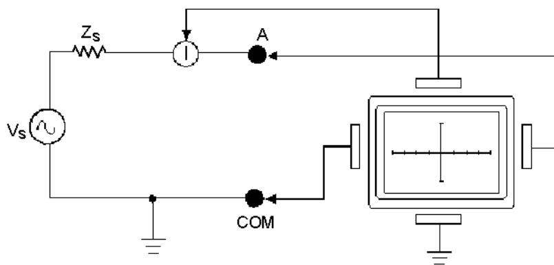

**Figure 5-27.—Signal section equivalent circuit.** 

An open circuit has zero current flowing through the terminals and maximum voltage drop across the terminals. In all ranges, this is represented by a straight horizontal trace from left to right on the CRT display, as seen in figure 5-28 view A. When a short occurs, maximum current flows through the terminals, and the voltage drop is considered to be zero. This occurs in all ranges and is represented by a straight vertical trace from top to bottom of the CRT display, as seen in figure 5-28 view B.

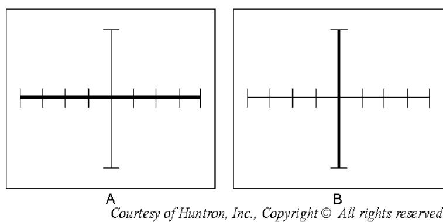

**Figure 5-28.—Open and short circuit display.** 

### **Pulse Generator**

The pulse generator provides dynamic testing for certain types of devices by driving the control input of the device under test. The normal two-terminal mode of testing can be considered a static test, since devices with three or more terminals are not tested in their active mode. However, with the pulse generator, an in-circuit active test is possible.

In the PULSE mode, this circuit uses the zero crossing of the test signal to trigger the start of the pulse. When positive (+) is enabled, a positive-going zero crossing triggers a positive pulse. When negative (−) is enabled, a negative-going zero crossing triggers a negative pulse. If both are enabled, then both positive and negative pulses are produced on alternate crossings (composite pulses). Once a pulse is triggered, its duration is set by the WIDTH control knob. Figure 5-29 shows the waveforms for three pulse polarity types at various settings of the WIDTH control.

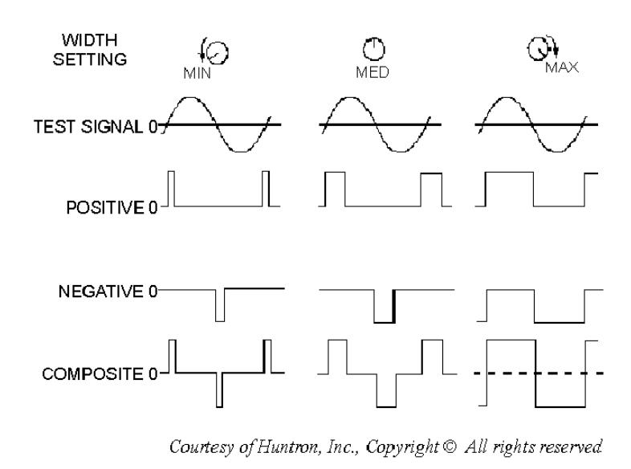

**Figure 5-29.—Pulse generator waveforms.** 

The LEVEL control adjusts the peak of each pulse from zero to 5 volts with the polarity dependent on the pulse polarity selected. When an open circuit is present, a maximum output of 5 volts peak-to-peak is present with either positive or negative selected, and 10 volts peak-to-peak when the composite pulse is active.

*Q-10. What minimum/maximum voltage level can be attained in the pulse generator section by adjusting the LEVEL control?* 

In the DC mode, a zero-to-5-volts DC level is produced at G1 and G2 on the front panel. The polarity of the level is controlled by the positive and negative buttons. By pressing the positive button, you enable a positive DC output and disable the negative button. By pressing the negative button, you enable a negative DC voltage only if the positive button is in the off position. The WIDTH control knob has no effect in the DC mode of operation.

### **CRT Display**

The CRT deflection drivers boost the low-level outputs from the signal section to the higher voltage levels needed by the deflection plates in the CRT. The HORIZ (horizontal) and VERT (vertical) controls on the front panel adjust the position of the CRT trace. The TRACE ROTATE control on the front panel is used to adjust the short circuit vertical trace to be parallel with the vertical axis on the CRT graticule.

Three other controls (INTENSITY, FOCUS, and astigmatism) are used to adjust the proper brightness and clarity of the trace. The front-panel INTENSITY control is the primary way to adjust the visual quality of the trace. FOCUS is located on the back panel and is used as your trimming adjustment. Astigmatism is an internal adjustment and is set at the factory.

### **Power Supply**

The power supply is an ac-line-operated power supply that is turned on and off by the POWER/INTENSITY knob located on the front panel. Once power is turned on, the power supply provides 12 V dc (nominal) and ±5 V dc (regulated) for normal circuit operational use in the oscillator, pulse generator, signal, and control logic sections of the Tracker 2000.

The other outputs from the power supply are provided to the CRT display section. The CRT is provided with a filament voltage of 6.3 Vrms, +180 V dc for the deflection driver circuits, and a regulated −1320 V dc for the CRT acceleration voltage.

### **COMPONENT TESTING**

Now that you have a basic understanding of how the Tracker 2000 works, we will show you a few examples of different components with values and their associated displays. Because of the large number of different values that can be given to any component, this section will present only a few.

### **Testing Resistors**

A resistance across the test probes will cause the trace of the Tracker 2000 to rotate in a counterclockwise direction around its center axis from an open circuit position. The degree of rotation is directly related to the resistance value. The higher the value, the less rotation will be observed.

**LOW RANGE**.The low range is designed to test for resistance values between 1Ω and 1K. Figure 5-30 shows the effect of resistance on the angle of rotation in low range. A 1Ω resistor causes almost 90º of rotation, and a 50Ω resistor produces a 45º rotation. A 400Ω resistor causes a very small rotation angle. Resistors lower than 1Ω will appear as a short circuit (vertical trace), and resistance values above 400Ω will look like an open circuit (horizontal trace).

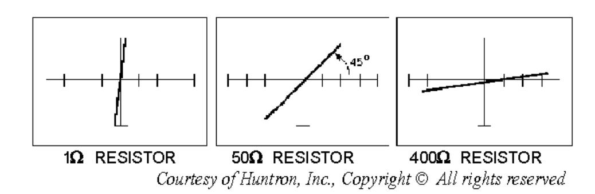

**Figure 5-30.—Effects of resistance on the rotation angle in low range.** 

**MEDIUM 1 RANGE**.The medium 1 range is designed to test for resistance values between 50Ω and 10KΩ. Figure 5-31 shows the signatures for a 50Ω resistor, a 1KΩ resistor, and a 10KΩ resistor using the medium 1 range. Resistors that are smaller than 50Ω display a signature that is almost a vertical line. A 1KΩ resistor causes a change in the angle of rotation of 45º, whereas the display of a 10KΩ resistor shows only a slight rotation. Resistance values under test higher than 10KΩ produce a signature with such a small rotation angle that it almost appears to be a horizontal line.

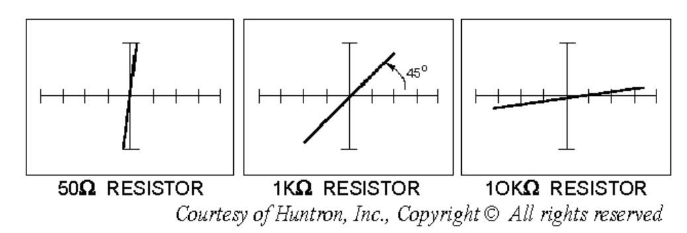

**Figure 5-31.—Effects of resistance on the rotation angle in medium 1 range.** 

### *Q-11. Medium 1 range is designed to check what resistance values?*

**MEDIUM 2 RANGE**.The medium 2 range is designed to test for resistance values between 1KΩ and 200KΩ Figure 5-32 shows the signatures for a 1KΩ resistor, a 15KΩ resistor, and a 200KΩ resistor in the medium 2 range. Resistance values that are smaller than 1KΩ will appear to be almost a vertical line. A 15KΩ resistor causes a change in the angle of rotation of 45º, whereas the display for a 200KΩ resistor shows only a slight rotation. When resistance values being tested are higher than 200KΩ, the displayed signature that they produce will have such a small rotation that it appears to be almost a horizontal line.

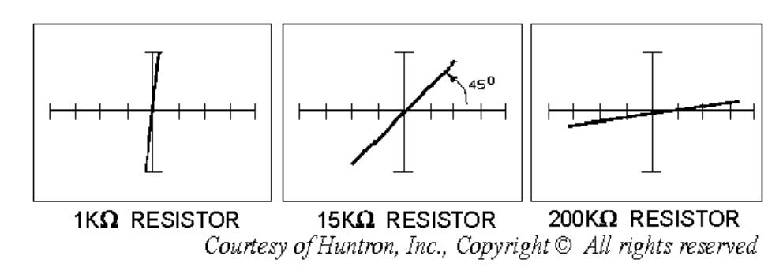

**Figure 5-32.—Effects of resistance on the rotation angle in medium 2 range.** 

**HIGH RANGE**.The high range is designed to test resistance values between 3KΩ and 1MΩ. Figure 5-33 shows the signatures that would be displayed for a 3KΩ resistor, a 50KΩ resistor, and a 1MΩ resistor using the high range. Resistors that are smaller than 3KΩ will appear to be almost a vertical line. A 50KΩ resistor will cause a change in the angle of rotation of 45º, whereas the display for a 1MΩ resistor shows only a slight rotation that is very close to a horizontal line. Resistance values higher than 1MΩ will produce such a small rotation that it appears to be a horizontal line.

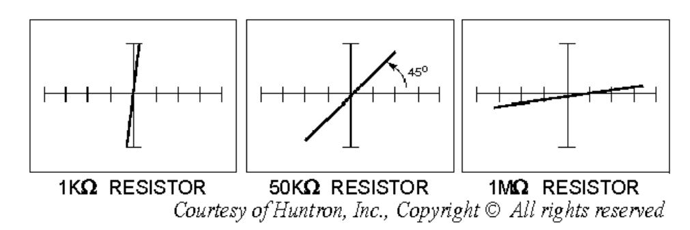

**Figure 5-33.—Effects of resistance on the rotation angle in high range.** 

### **Testing Capacitors**

When you test capacitors, the signature will be displayed as an ellipse. The size and shape of the ellipse depend on the capacitor value, test signal frequency, and the selected impedance range. Figure 5- 34 shows the signature of a 0.22µF capacitor in each of the 12 combinations of range and frequency. As you review this figure, you will notice that the signature appears to be an open circuit in the low range at 60 Hz; while in the high range at 2000 Hz, the signature appears to be a short. Between these, the signatures displayed are a variety of ellipsoids, which demonstrates that certain range and frequency combinations are better than others for examining a capacitor.

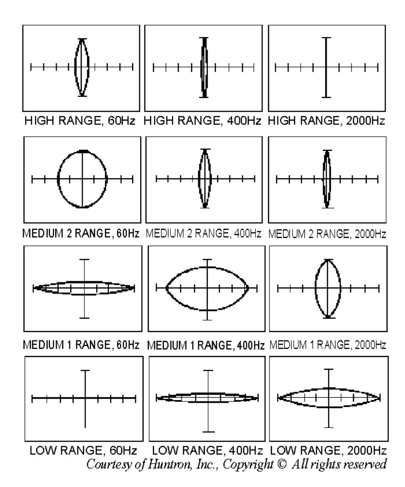

**Figure 5-34.—Signature of a 0.22**µ**F capacitor.** 

Table 5-5 lists the range of capacitance covered by each of the 12 range and frequency combinations for the Tracker 2000. The lowest value of capacitance in each combination will produce a signature of a very narrow horizontal ellipsoid. Capacitors with less of a value than these will appear to be an open. The uppermost value of capacitance in each combination will produce a very narrow vertical ellipsoid signature. Capacitors of greater value than these will appear as a vertical line signature of a short circuit.

**Table 5-5.—Min/Max Capacitance Values** 

| RANGE    |            | TEST FREQUENCY |             |
|----------|------------|----------------|-------------|
|          | 50/60 Hz   | 400 Hz         | 2000 Hz     |
| HIGH     | .001µF-1µF | 500pF-.1µF     | 100pF-.02µF |
| MEDIUM 1 | .01µF-2µF  | .001µ-.5µF     | 200pF-.05µF |
| MEDIUM 2 | .2µF-50µF  | .02µF-5µF      | .005µ-1µF   |
| LOW      | 5µF-2000µF | .5mF-100µF     | .2mF-25µF   |

### **Testing Inductors**

Inductors, like capacitors, produce an elliptical signature on the Tracker 2000. Figure 5-35 shows you the signatures produced in each of the 12 range and frequency combinations by a 250mH inductor.

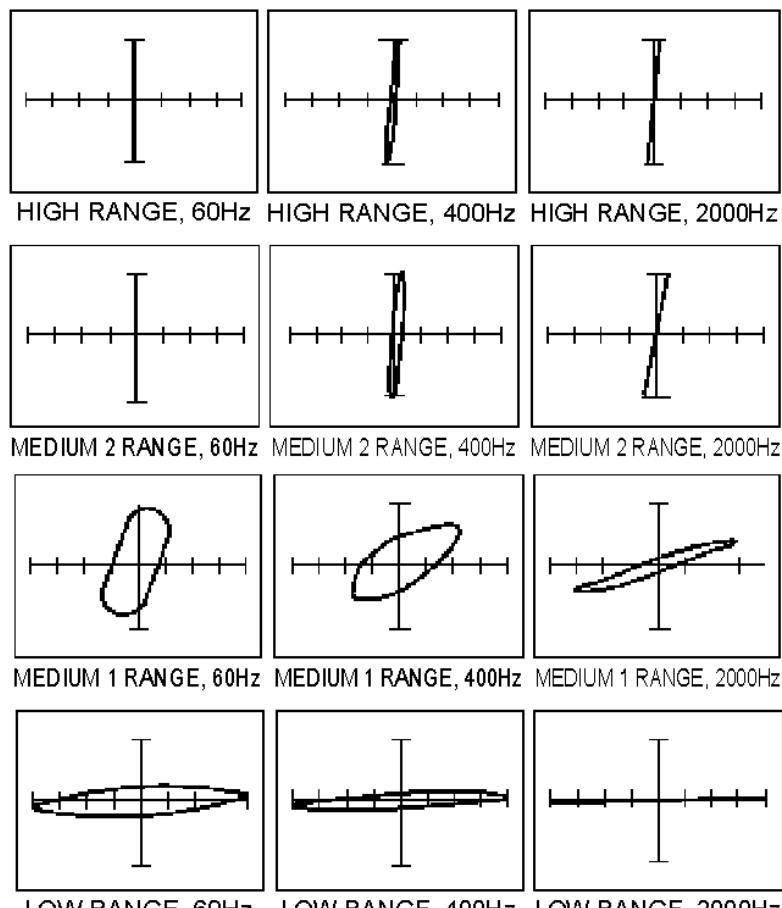

**Figure 5-35.—Signatures of a 250mH inductor.** 

Ferrite inductors can also be checked using this unit; however, the signature produced will be different. Ferrite inductors operate well at high frequencies, but saturate at low frequencies. Figure 5-36 shows the signature of a 490mH ferrite inductor tested at 60 Hz. In low and medium 1, you can see that

the signature shows distortion. However, in medium 2 and high ranges, the impedance of the inductor is low compared with the internal impedance of the Tracker 2000, so the signatures are a split vertical trace. Figures 5-37 and 5-38 show the same 490mH inductor being tested at 400 Hz and 2000 Hz.

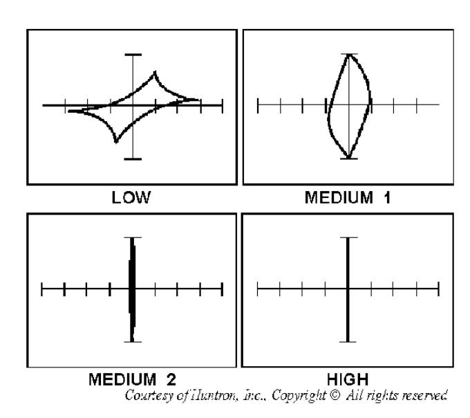

**Figure 5-36.—Signatures of a 490mH ferrite inductor tested at 60 Hz.** 

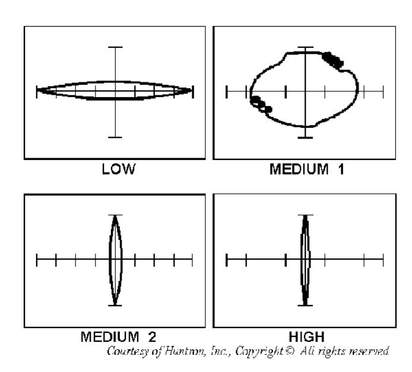

**Figure 5-37.—Signature of a 490mH ferrite inductor at 400 Hz.** 

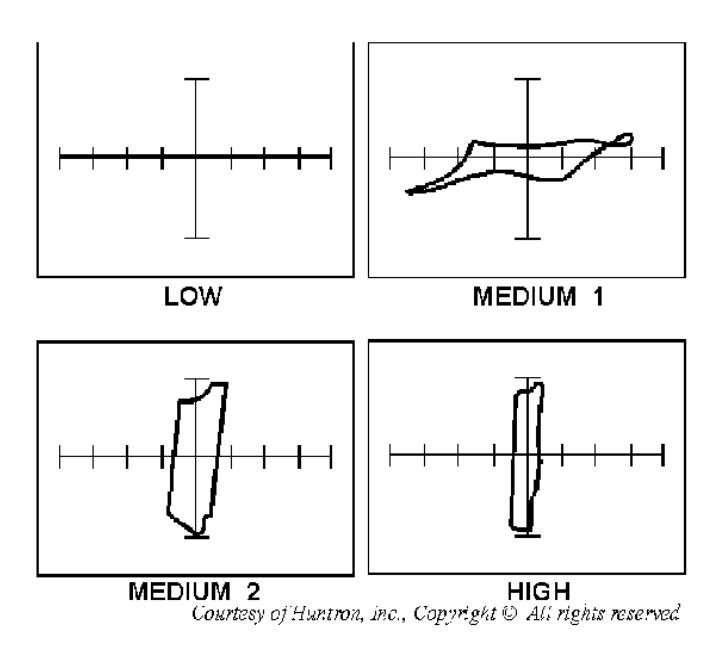

**Figure 5-38.—Signature of a 490mH ferrite inductor at 2000 Hz.** 

### **SUMMARY**

Now that we have completed this chapter, let's review the more important points.

The type of meter used to measure power is the **POWER METER**.

One type of wattmeter is the AN/URM-120. It is an **IN-LINE TYPE WATTMETER**.

The principal function of a **SIGNAL GENERATOR** is to produce an alternating voltage of the desired frequency and amplitude, which has the necessary modulation for the test or measurement concerned.

There are basically two types of signal generators: **AF** and **RF FREQUENCY GENERATORS**.

The instrument used to determine the frequency of a signal is the **FREQUENCY COUNTER**.

An instrument of great value to a technician in troubleshooting digital integrated logic circuits is the **LOGIC PROBE**.

The **HUNTRON TRACKER 2000** is a versatile piece of test equipment that is used to compare known good devices against those of unknown quality or troubleshoot to the component level after power is disconnected to the device under test.

### *ANSWERS TO QUESTIONS Q1. THROUGH Q11.*

*A-1. Load. A-2. An unbalance in the metering bridge. A-3. Attenuator. A-4. Oscillator circuit, modulator, and output control circuit. A-5. To produce an af (or video) signal that can be superimposed on the rf signal produced by the oscillator. A-6. 1 MHz and 10 MHz. A-7. DIM. A-8. Positive voltage (+V) and negative current (*−*I). A-9. TRACE ROTATE control. A-10. 0 to 5 volts. A-11. 50*Ω *to 10K*Ω*.* 

# **CHAPTER 6 THE OSCILLOSCOPE AND SPECTRUM ANALYZER**

### **LEARNING OBJECTIVES**

Upon completing this chapter, you should be able to:

- 1. Describe the purpose of the CRT used in the oscilloscope.
- 2. Explain the operation of an oscilloscope.
- 3. Describe the purpose of the controls and indicators found on an oscilloscope.
- 4. Describe the proper procedure for using a dual-trace oscilloscope.
- 5. Describe the accessory probes available for use with a dual-trace oscilloscope.
- 6. Explain the operation of the spectrum analyzer.
- 7. Describe the purpose of the controls and indicators found on the spectrum analyzer.

### **INTRODUCTION**

One of the most widely used pieces of electronic test equipment is the OSCILLOSCOPE. An oscilloscope is used to show the shape of a video pulse appearing at a selected equipment test point. Although some oscilloscopes are better than others in accurately showing video pulses, all function in fundamentally the same way. If you learn how one oscilloscope operates, you will be able to learn others.

As you will learn in this chapter, there are many different types of oscilloscopes—varying in complexity from the simple to the complex. Before we get into our discussion of the dual-trace oscilloscope, we will first present a general overview of basic single-trace oscilloscope operation. Shortly, we will see how oscilloscopes use a CATHODE-RAY TUBE (CRT) in which controlled electron beams are used to present a visible pattern of graphical data on a fluorescent screen.

Another piece of test equipment used is the SPECTRUM ANALYZER. This test equipment is used to sweep over a band of frequencies to determine what frequencies are being produced by a specific circuit under test, and then the amplitude of each frequency component. An accurate interpretation of the display will allow you to determine the efficiency of the equipment being tested.

### **CATHODE-RAY TUBES**

A detailed discussion of CATHODE-RAY TUBES (CRTs) is presented in NEETS, *Module 6, Electronic Emission, Tubes, and Power Supplies*. Before continuing with your study of CRTs in this section, you may want to review chapter 2 of that module.

Cathode-ray tubes used in oscilloscopes consist of an ELECTRON GUN, a DEFLECTION SYSTEM, and a FLUORESCENT SCREEN. All of these elements are enclosed in the evacuated space inside the glass CRT. The electron gun generates electrons and focuses them into a narrow beam. The deflection system moves the beam horizontally and vertically across the screen. The screen is coated with a phosphorous material that glows when struck by the electrons. Figure 6-1 shows the construction of a CRT.

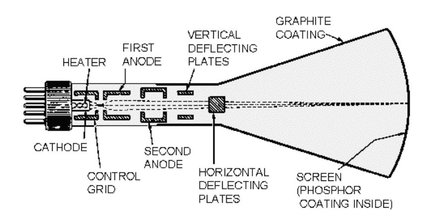

**Figure 6-1.—Construction of a CRT.**

### **ELECTRON GUN**

The ELECTRON GUN consists of a HEATER and a CATHODE to generate electrons, a CONTROL GRID to control brightness by controlling electron flow, and two ANODES (FIRST and SECOND). The main purpose of the first (FOCUSING) anode is to focus the electrons into a narrow beam on the screen. The second (ACCELERATING) anode accelerates the electrons as they pass. The control grid is cylindrical and has a small opening in a baffle at one end. The anodes consist of two cylinders that contain baffles (or plates) with small holes in their centers.

*Q-1. What element controls the number of electrons striking the screen?*

*Q-2. What element is controlled to focus the beam?*

### **Cathode and Control Grid**

As in most conventional electron tubes, the cathode is indirectly heated and emits a cloud of electrons. The control grid is a hollow metal tube placed over the cathode. A small opening is located in the center of a baffle at the end opposite the cathode. The control grid is maintained at a negative potential with respect to the cathode to keep the electrons bunched together.

A high positive potential on the anodes pulls electrons through the hole in the grid. Because the grid is near the cathode, it can control the number of electrons that are emitted. As in an ordinary electron tube, the negative voltage of the grid can be varied either to control electron flow or stop it completely. The brightness (intensity) of the image on the fluorescent screen is determined by the number of electrons striking the screen. This is controlled by the voltage on the control grid.

### **Electrostatic Lenses and Focusing**

The electron beam is focused by two ELECTROSTATIC FIELDS that exist between the control grid and first anode and between the first and second anodes.

Figure 6-2 shows you how electrons move through the electron gun. The electrostatic field areas are often referred to as LENSES because the fields bend electron streams in the same manner that optical

lenses bend light rays. The first electrostatic lens cause the electrons to cross at the first focal point within the field. The second lens bend the spreading streams and return them to a new, second focal point at the CRT.

*Q-3. Why are the electrostatic fields between the electron gun elements called lenses?*

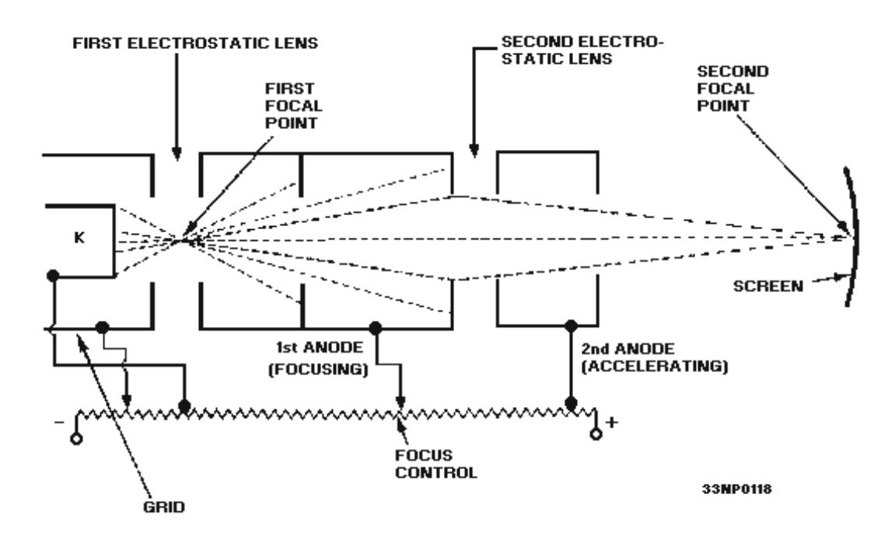

**Figure 6-2.—Formation of an electron beam.**

Figure 6-2 also shows the relative voltage relationships on the electron-gun elements. The cathode (K) is at a fixed positive voltage with respect to ground. The grid is at a variable negative voltage with respect to the cathode. A fixed positive voltage of several thousand volts is connected to the second (accelerating) anode. The potential of the first (focusing) anode is less positive than the potential of the second anode. The first anode can be varied to place the focal point of the electron beam on the screen of the tube. Control-grid potential is established at the proper level to allow the correct number of electrons through the gun for the desired image intensity.

*Q-4. What is the function of the second anode?*

### **ELECTRON BEAM-DEFLECTION SYSTEM**

The electron beam is developed, focused, and accelerated by the electron gun. The beam appears on the screen of the CRT as a small, bright dot. If the beam is left in one position, the electrons will soon burn away the illuminating coating in that one area. To be of any use, the beam must be able to move. As you have studied, an electrostatic field can bend the path of a moving electron.

As you have seen in the previous illustrations, the beam of electrons passes through an electrostatic field between two plates. You should remember that electrons are negatively charged and that they will be deflected in the direction of the electric force (from negative to positive). This deflection causes the electrons to follow a curved path while in the electrostatic field.

When the electrons leave the electrostatic field, they will take a straight path to the screen at the angle at which they left the field. Because they were all deflected equally, the electrons will be traveling toward the same spot. Of course, the proper voltages must exist on the anodes to produce the electrostatic field. Changing these voltages changes the focal point of the beam and causes the electron beam to strike the CRT at a different point.

### **Factors Influencing Deflection**

The ANGLE OF DEFLECTION (the angle the outgoing electron beam makes with the CRT center line axis between the plates) depends on the following factors:

- Length of the deflection field;
- Spacing between the deflection plates;
- The difference of potential between the plates; and
- The accelerating voltage on the second anode.

**LENGTH OF DEFLECTION FIELD**.—As shown in figure 6-3, a long field (long deflection plates) has more time to exert its deflecting forces on an electron beam than does a shorter field (short deflection plates). Therefore, the longer deflection plates can bend the beam to a greater deflection angle.

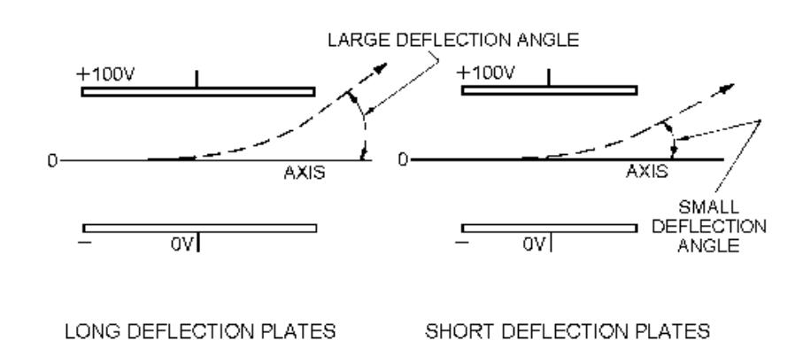

**Figure 6-3.—Factors influencing length of field.**

### *Q-5. What effect do longer deflection plates have on the electron beam?*

**SPACING BETWEEN PLATES**.—As shown in figure 6-4, the closer together the plates, the more effect the electric force has on the deflection angle of the electron beam.

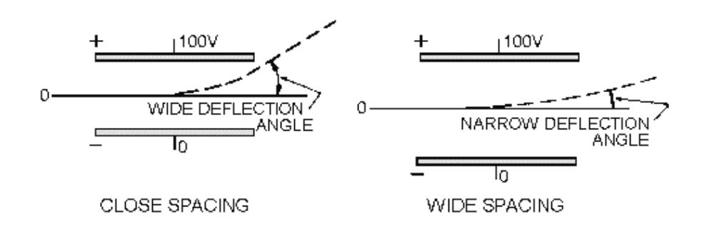

**Figure 6-4.—Spacing between plates.**

*Q-6. What effect does closer spacing of plates have on the electron beam?*

**DIFFERENCE OF POTENTIAL.—** The potential on the plates (figure 6-5) can be varied to cause a wider or narrower deflection angle. The greater the potential, the wider the deflection angle.

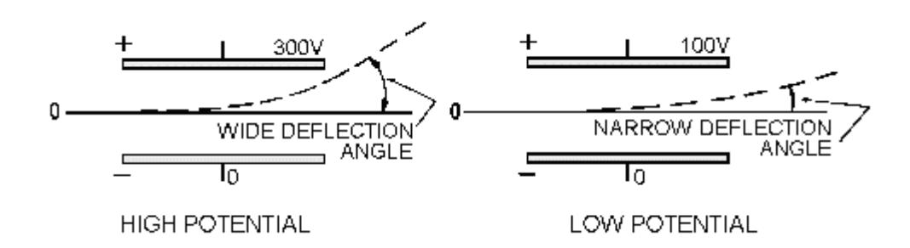

**Figure 6-5.—Differences of potential.**

*Q-7. Is the deflection angle greater with higher or lower potential on the plates?*

**BEAM ACCELERATION**.—The faster the electrons are moving, the smaller their deflection angle will be, as shown in figure 6-6.

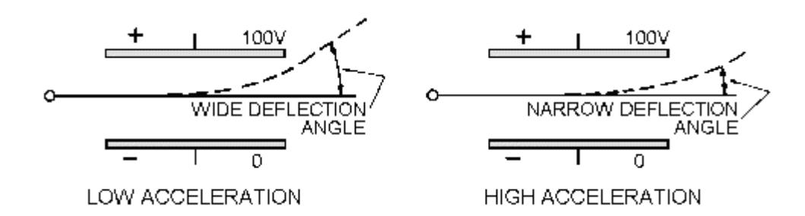

**Figure 6-6.—Beam acceleration.**

*Q-8. Is the deflection angle greater when the beam is moving faster or slower?*

### **Vertical and Horizontal Plates**

If two sets of deflection plates are placed at right angles to each other inside a CRT (figure 6-7), the electron beam can be controlled in any direction. By varying the potential of the vertical-deflection plates, you can make the spot (beam) on the face of the tube move vertically. The distance the beam moves will be proportional to the change in potential difference between the plates. Changing the potential difference between the horizontal-deflection plates will cause the beam to move a given distance from one side to the other. Directions other than up-down and left-right are achieved by a combination of horizontal and vertical movement.

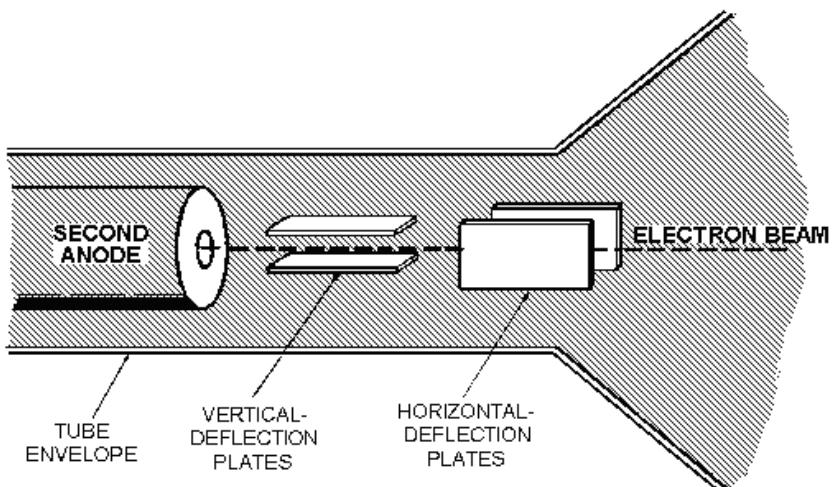

**Figure 6-7.—Deflection plate arrangement.**

As shown in figure 6-8, position X of the beam is in the center. It can be moved to position Y by going up 2 units and then right 2 units. Movement of the beam is the result of the simultaneous action of both sets of deflection plates. The electrostatic field between the vertical plates moves the electrons up an amount proportional to 2 units on the screen. As the beam passes between the horizontal plates, it moves to the right an amount proportional to 2 units on the screen.

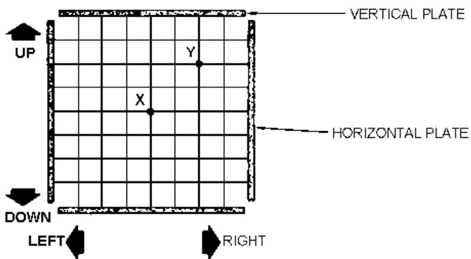

**Figure 6-8.—Beam movement on the CRT.**

If the amount of deflection from the left and down occurred so that each set of plates acted at the same time, the picture would be like the one in view A of figure 6-9. For example, if the vertical plates moved the beam downward (starting from point X) at the rate of 3 units per second and the horizontal plates moved it to the left at the rate of 1 unit per second, both movements would have been completed in 1 second at point Y. The result would be a straight line.

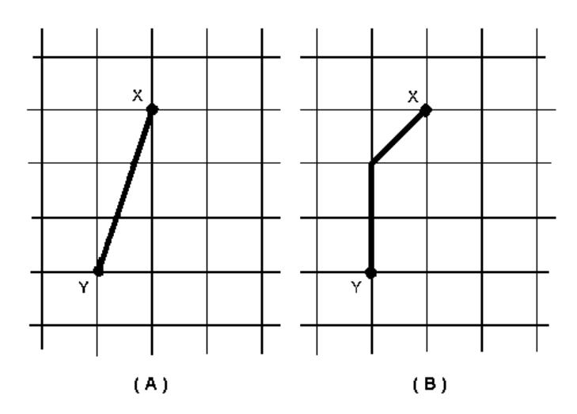

**Figure 6-9.—Deflection of the beam.**

In view B, the potentials on the vertical and horizontal plates change at the same rate. In the same time period, say 1 second, both plates move the beam 1 unit. The horizontal plates have completed their task at the end of 1 second, but the vertical plates have moved the beam only one-third of the required distance. In this case, the picture in view B would appear on the screen.

### **Beam-deflection Plate Action**

Recall from your study of chapter 2 of this module that waveforms are described in terms of amplitude versus time. You have just seen how the movement of the CRT beam depends on both potential (amplitude) and time.

*Q-9. Waveforms are described in terms of what two functions?*

**VERTICAL-DEFLECTION PLATES**.—We will use figure 6-10 to explain the action of the vertical-deflection plates in signal amplitude measurements. As this discussion begins, remember that vertical-deflection plates are used to show amplitude of a signal, and horizontal-deflection plates are used to show time and/or frequency relationships.

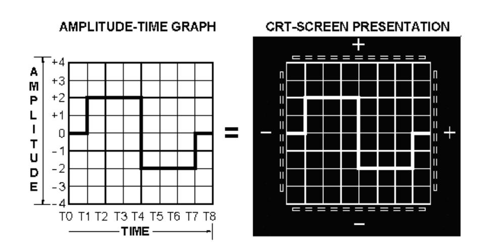

**Figure 6-10.—Amplitude versus time.**

- 1. From T0 to T1, the vertical plates maintain their static difference in potential and the beam stays at 0 units; the T0 to T1 change causes an increasing potential difference in the horizontal plates, and the beam moves 1 unit to the right.
- 2. At T1, a positive potential difference change in the vertical plates occurs, which causes the beam to move up (instantaneously) 2 units. This vertical (amplitude) beam location is maintained from T1 to T4; horizontal beam movement continues moving to the right as 3 units of time pass.
- 3. At T4, an instantaneous negative change in potential of 4 units in amplitude occurs, and the beam moves from +2 to −2 units.
- 4. From T4 to T7, the beam remains at −2 units. During this time period, the beam continues moving horizontally to the right, indicating the passage of time.
- 5. At T7, a positive increase of amplitude occurs, and the beam moves vertically from −2 to 0 units. From T7 to T8, no change occurs in vertical beam movement; however, horizontal movement continues with time.

The vertical-plate potential difference follows the voltage of the waveform. The horizontal-plate potential follows the passage of time. Together, they produce the image (trace) produced on the screen by the moving beam.

*Q-10. The vertical-deflection plates are used to reproduce what function? Q-11. The horizontal-deflection plates are used to produce what function?*

**HORIZONTAL-DEFLECTION PLATES**.—Now let's look at horizontal-deflection action. Assume that the resistance of the potentiometer shown in figure 6-11 is spread evenly along its length. When the arm of the potentiometer is at the middle position, the same potential exists on each plate. Since there is zero potential difference between the plates, an electrostatic field is not moved downward at a uniform rate; the right plate will become more positive than the left (you are looking down through the top of the CRT). The electron beam will move to the right from screen point 0 through points 1, 2, 3, and 4 in equal time intervals.

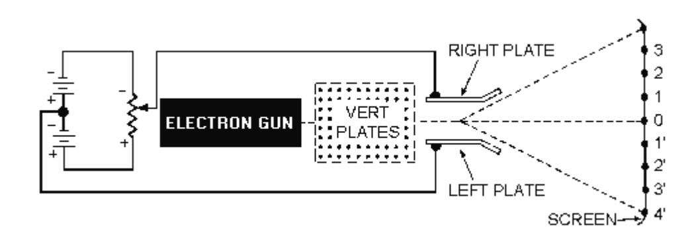

**Figure 6-11.—Horizontal plates (top view).**

If the potentiometer arm is moved at the same rate in the opposite direction, the right plate will decrease in positive potential until the beam returns to the 0 position. At that point, the potential difference between the plates is again zero. Moving the arm toward the other end of the resistance causes the left plate to become more positive than the right, and the beam moves from screen points 0 through 4. If the movement of the potentiometer arm is at a uniform (linear) rate, the beam moves at a uniform rate.

Notice that the ends of the deflection plates are bent outward to permit wide-angle deflection of the beam. The vertical plates are bent up and down in the same manner.

### *Q-12. Why are the ends of the deflection plates bent outward?*

For ease of explanation, the manual movement of the potentiometer arm is satisfactory to introduce you to horizontal beam movement. However, in the oscilloscope this is not how horizontal deflection is accomplished. Beam movement voltages are produced much faster by sawtooth circuitry. You may want to review the sawtooth generation section in NEETS, Module 9, *Introduction to Wave-Generation and Wave-Shaping Circuitry* before continuing. Nearly all oscilloscopes with electrostatic deflection apply a sawtooth voltage to the horizontal plates to produce horizontal deflection of the beam, as shown in figure 6-12.

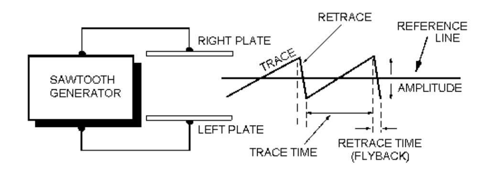

**Figure 6-12.—Sawtooth generator.**

In the figure, the sawtooth generator replaces the potentiometer and is connected to both horizontal plates of the CRT. At the reference line, the potential on both plates is equal. Below the line, the left plate is more positive and the right plate is less positive. This causes the beam to move left. Above the line, the right plate is made more positive than the left and the beam moves to the right. The waveform amplitude causes a uniform movement of the beam across the screen (called TRACE). RETRACE time, shown at the trailing edge of the waveform, quickly deflects the beam back to the starting point.

### **CRT GRATICULE**

A GRATICULE was used in our previous discussion in figure 6-10. It is simply a calibrated scale (made of clear plastic) of amplitude versus time that is placed on the face of the CRT.

The graticule can be used to determine the voltage of waveforms because the DEFLECTION SENSITIVITY of a CRT is uniform throughout the vertical plane of the screen. Deflection sensitivity states the number of inches, centimeters, or millimeters a beam will be deflected for each volt of potential difference applied to the deflection plates. It is directly proportional to the physical length of the deflection plates and their distance from the screen and inversely proportional to the distance between the plates and to the second-anode voltage. Deflection sensitivity is a constant that is dependent on the construction of the tube.

Deflection sensitivity for a given CRT might typically be 0.2 millimeters per volt. This means the spot on the screen will be deflected 0.2 millimeters (about 0.008 inch) when a difference of 1 volt exists between the plates. Sometimes the reciprocal of deflection sensitivity (called DEFLECTION FACTOR) is given. The deflection factor for the example given would be 125 volts per inch (1/0.008).

*Q-13. What term is used to describe the reciprocal of deflection sensitivity of a scope?*

In the above example, 125 volts applied between one set of plates would deflect the beam 1 inch on the screen. This means that the deflection caused by small signals would likely not be observed. For this reason, the deflection plates are connected to amplifiers that magnify the signals applied to the vertical input of the scope.

Assume, for example, that a peak-to-peak value of a known voltage applied to the oscilloscope indicates that each inch marking on the graticule is equal to 60 volts. Each of the 10 subdivisions will, therefore, equal a value of 6 volts. Most oscilloscopes have ATTENUATOR controls to decrease or GAIN controls to increase the strength of a signal before it is placed on the deflection plates. Attenuator and gain settings must not be disturbed after the calibration has been made. For maximum accuracy, you should recalibrate the graticule each time a voltage is to be measured.

### **CRT DESIGNATIONS**

Cathode-ray tubes are identified by a tube number, such as 2AP1, 2BP4, or 5AP1A. The first number identifies the diameter of the tube face. Typical diameters are 2 inches, 5 inches, and 7 inches. The first letter designates the order in which a tube of a given diameter was registered. The letter-digit combination indicates the type of phosphor (glowing material) used on the inside of the screen. Phosphor P1, which is used in most oscilloscopes, produces a green light at medium PERSISTENCE. Persistence refers to the length of time the phosphor glows after the electron beam is removed. P4 provides a white light and has a short persistence. If a letter appears at the end, it signifies the number of the modification after the original design.

### **OSCILLOSCOPE CONTROL COMPONENTS**

Although the CRT is a highly versatile device, it cannot operate without control circuits. The type of control circuits required depends on the purpose of the equipment in which the CRT is used.

There are many different types of oscilloscopes. They vary from relatively simple test instruments to highly accurate laboratory models. Although oscilloscopes have different types of circuits, most can be

divided into the basic sections shown in figure 6-13: (1) a CRT, (2) a group of control circuits that control the waveform fed to the CRT, (3) a power supply, (4) sweep circuitry, and (5) deflection circuitry.

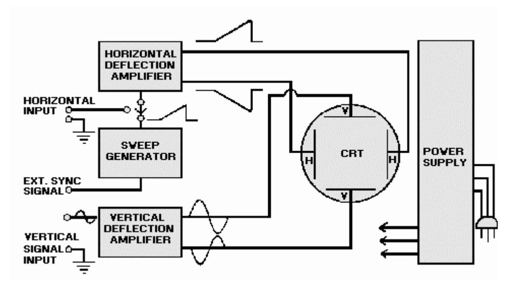

**Figure 6-13.—Block diagram of an oscilloscope.**

### *Q-14. List the circuits that all oscilloscopes have in common.*

Figure 6-14 is a drawing of the front panel of a dual-trace, general-purpose oscilloscope. Oscilloscopes vary greatly in the number of controls and connectors. Usually, the more controls and connectors, the more versatile the instrument. Regardless of the number, all oscilloscopes have similar controls and connectors. Once you learn the fundamental operation of these common controls, you can move with relative ease from one model of oscilloscope to another. Occasionally, controls that serve similar functions will be labeled differently from one model to another. However, you will find that most controls are logically grouped and that their names usually indicate their function.

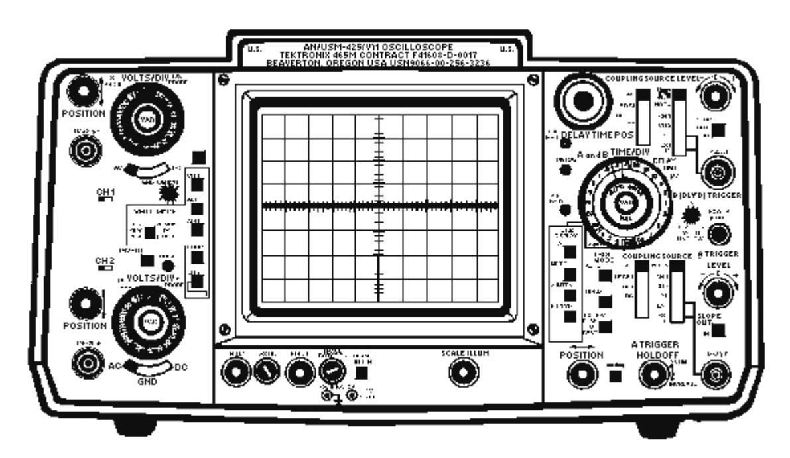

**Figure 6-14.—Dual-trace oscilloscope.**

The oscilloscope in figure 6-14 is called DUAL-TRACE because it can accept and display two vertical signal inputs at the same time—usually for comparison of the two signals or one signal and a reference signal. This scope can also accept just one input. In this case, it is used as a SINGLE-TRACE OSCILLOSCOPE. For the following discussion, we will consider this to be a single-trace oscilloscope. The oscilloscope in the figure is commonly used in the fleet. You are likely to use this one (model AN/USM-425) or one very similar to it. Let's now look at the front panel controls.

### **COMPONENTS USED TO DISPLAY THE WAVEFORM**

The CRT DISPLAY SCREEN is used to display the signal (figure 6-15). It allows you to make accurate measurements using the vertical and horizontal graticules, as discussed earlier.

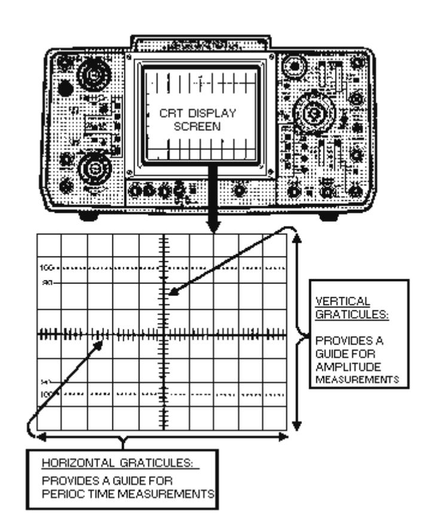

**Figure 6-15.—CRT display and graticule.**

### **COMPONENTS USED TO ADJUST CRT DISPLAY QUALITY**

The controls in figure 6-16 allow you to adjust for a clear signal display. They also allow you to adjust the display position and magnify the horizontal trace by a factor of 10 (X10). Keep in mind that the controls may be labeled differently from one model to another, depending on the manufacturer. Refer to figure 6-16 as you study the control descriptions in the next paragraphs.

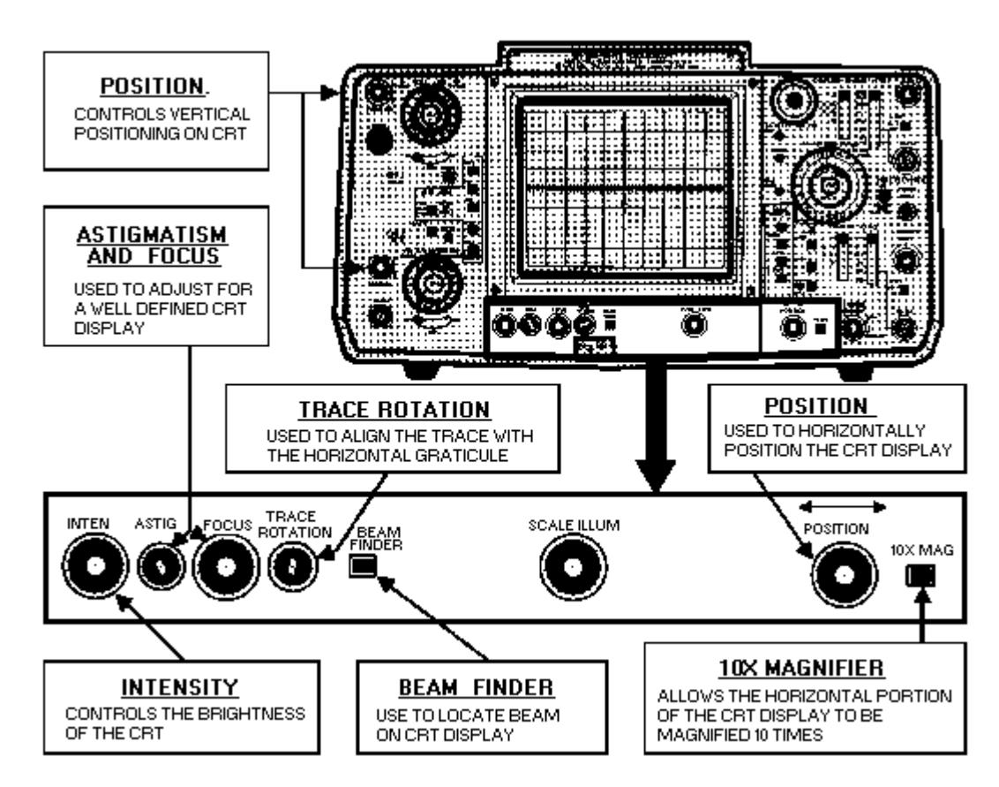

**Figure 6-16.—Quality adjustment for CRT display.**

### **INTEN (Intensity) Control**

The INTEN (intensity) control (sometimes called BRIGHTNESS) adjusts the brightness of the beam on the CRT. The control is rotated in a clockwise direction to increase the intensity of the beam and should be adjusted to a minimum brightness level that is comfortable for viewing.

### **FOCUS and ASTIG (Astigmatism) Controls**

The FOCUS control adjusts the beam size. The ASTIG (astigmatism) control adjusts the beam shape. The FOCUS and ASTIG controls are adjusted together to produce a small, clearly defined circular dot. When displaying a line trace, you will use these same controls to produce a well-defined line. Figure 6-17, view A, shows an out-of-focus beam dot. View B shows the beam in focus. Views C and D show out-of-focus and in-focus traces, respectively.

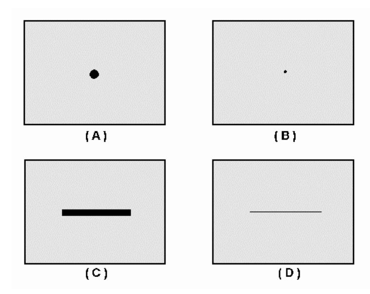

**Figure 6-17.—Effects of FOCUS and ASTIG (astigmatism) controls.**

### **TRACE ROTATION Control**

The TRACE ROTATION control (figure 6-16) allows for minor adjustments of the horizontal portion of the trace so that you can align it with the horizontal lines on the graticule.

### **BEAM FINDER Control**

Occasionally, the trace will actually be located off the CRT (up or down or to the left or right) because of the orientation of the deflection plates. When pushed, the BEAM FINDER (figure 6-16) pulls the beam onto the screen so that you can use the horizontal and vertical POSITION controls to center the spot.

### **Horizontal and Vertical POSITION Controls**

The horizontal and vertical POSITION controls (figure 6-16) are used to position the trace. Because the graticule is often drawn to represent a graph, some oscilloscopes have the positioning controls labeled to correspond to the X and Y axes of the graph. The X axis represents horizontal movement; the Y axis represents the vertical movement. Figure 6-18 shows the effects of positioning controls on the trace.

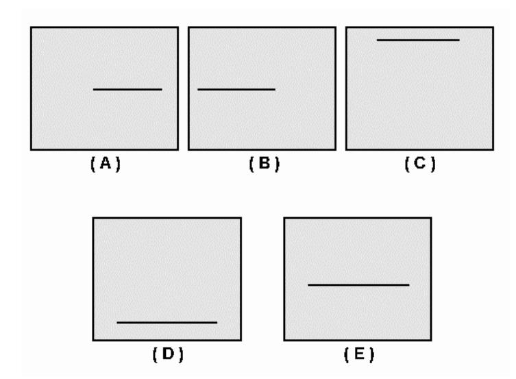

**Figure 6-18.—Effects of horizontal and vertical controls.**

In view A, the horizontal control has been adjusted to move the trace too far to the right; in view B, the trace has been moved too far to the left. In view C, the vertical POSITION control (discussed later) has been adjusted to move the trace too close to the top; in view D, the trace has been moved too close to the bottom. View E (figure 6-18) shows the trace properly positioned.

### **10X MAG (Magnifier) Switch**

The 10X MAG (magnifier) switch (figure 6-16) allows you to magnify the displayed signal by a factor of 10 in the horizontal direction. This ability is important when you need to expand the signal to evaluate it carefully.

### **COMPONENTS USED TO DETERMINE THE AMPLITUDE OF A SIGNAL**

We will now discuss the dual-trace components of the scope. You will use these components to determine the amplitude of a signal. Notice in figure 6-19 that the highlighted section at the upper left of the scope looks just the same as the section at the lower left of the scope. This reveals the dual-trace capability section of the scope. The upper left section is the CH (channel) 1 input and is the same as the CH 2 input at the lower left. An input to both inputs at the same time will produce two independent traces on the CRT and use the dual-trace capability of the scope.

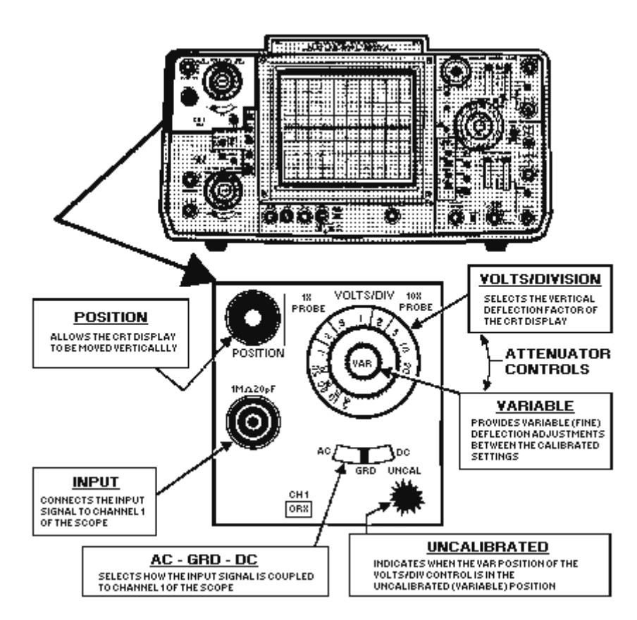

**Figure 6-19.—Components that determine amplitude.**

For purposes of this introductory discussion, we will present only CH (channel) 1. You should realize that the information presented also applies to CH 2.

### **Vertical POSITION Control**

The vertical POSITION control allows you to move the beam position up or down, as discussed earlier.

### **Input Connector**

The vertical input (or signal input) jack connects the signal to be examined to the vertical-deflection amplifier. Some oscilloscopes may have two input jacks, one labeled AC and the other labeled DC. Other models may have a single input jack with an associated switch, such as the AC GRD DC switch in figure 6-19. This switch is used to select the ac or dc connection. In the DC position, the signal is connected directly to the vertical-deflection amplifier; in the AC position, the signal is first fed through a capacitor. Figure 6-20 shows the schematic of one arrangement.

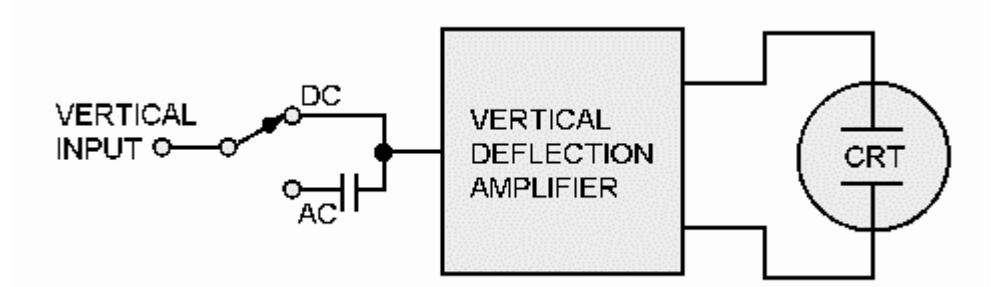

**Figure 6-20.—Vertical input arrangement.**

The VERTICAL-DEFLECTION AMPLIFIER increases the amplitude of the input signal level required for the deflection of the CRT beam. The deflection amplifier must not have any other effect on the signal, such as changing the shape (called DISTORTION). Figure 6-21 shows the results of distortion occurring in a deflection amplifier.

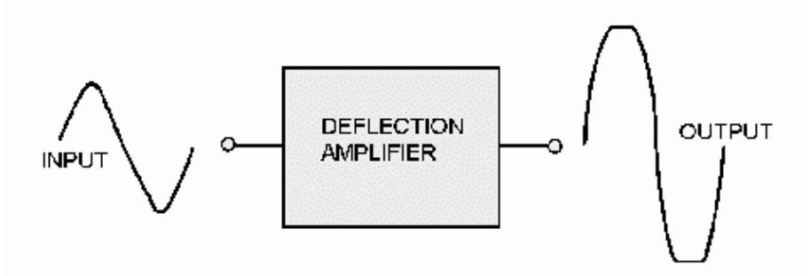

**Figure 6-21.—Deflection amplifier distortion.**

### **Attenuator Control**

An amplifier can handle only a limited range of input amplitudes before it begins to distort the signal. Signal distortion is prevented in oscilloscopes by the incorporation of circuitry that permits adjustment of the input signal amplitude to a level that prevents distortion from occurring. This adjustment is called the ATTENUATOR control in some scopes (VOLTS/DIV and VAR in figure 6-19). This control extends the usefulness of the oscilloscope by enabling it to handle a wide range of signal amplitudes.

The attenuator usually consists of two controls. One is a multiposition (VOLTS/DIV) control, and the other is a variable (VAR) potentiometer. Each position of the control may be marked either as to the amount of voltage required to deflect the beam a unit distance, such as VOLTS/DIV, or as to the amount of attenuation (called the DEFLECTION FACTOR) given to the signal, such as 100, 10, or 1.

Suppose the .5 VOLTS/DIV position were selected. In this position, the beam would deflect vertically 1 division for every 0.5 volts of applied signal. If a sine wave occupied 4 divisions peak-topeak, its amplitude would be 2 volts peak-to-peak (4 × 0.5), as shown in figure 6-22.

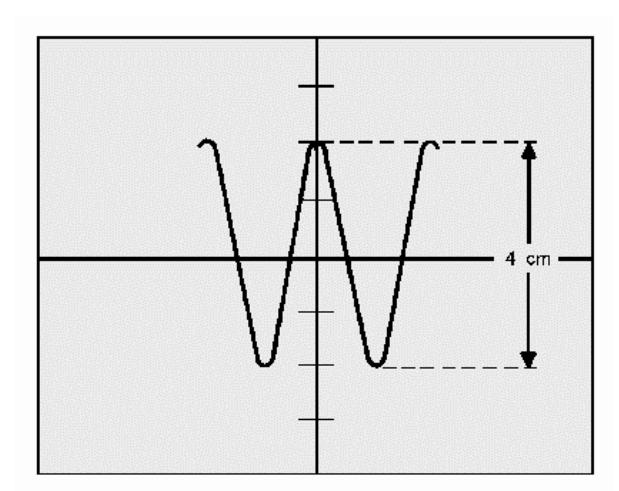

**Figure 6-22.—Sine wave attenuation.**

The vertical attenuator control (VOLTS/DIV in figure 6-19) provides a means of adjusting the input signal level to the amplifiers by steps. These steps are sequenced from low to high deflection factors. The potentiometer control (VAR in figure 6-19) provides a means of fine, or variable, control between steps. This control may be mounted separately, or it may be mounted on the attenuator control. When the control is mounted separately, it is often marked as FINE GAIN or simply GAIN. When mounted on the attenuator control, it is usually marked VARIABLE or VAR.

The variable control adds attenuation to the step that is selected. Since accurately calibrating a potentiometer is difficult, the variable control is either left unmarked or the front panel is marked off in some convenient units, such as 1-10 and 1-100. The attenuator control, however, can be accurately calibrated. To do this, you turn off the variable control to remove it from the attenuator circuit. This position is usually marked CAL (calibrate) on the panel, or an associated light indicates if the VAR control is on or off. In figure 6-19, the light called UNCAL indicates the VAR control is in the uncalibrated position.

### **COMPONENTS USED TO SELECT THE VERTICAL OPERATING MODE**

As we discussed earlier, channel 1 is being used to discuss basic operating procedures for the oscilloscope. Figure 6-23 shows how the vertical mode of operation is selected. The VERT MODE section contains push-button switches that enable you to select channel 1, channel 2, and several other vertical modes of operation. For the present discussion, note only that CH 1 is selected by these switches.

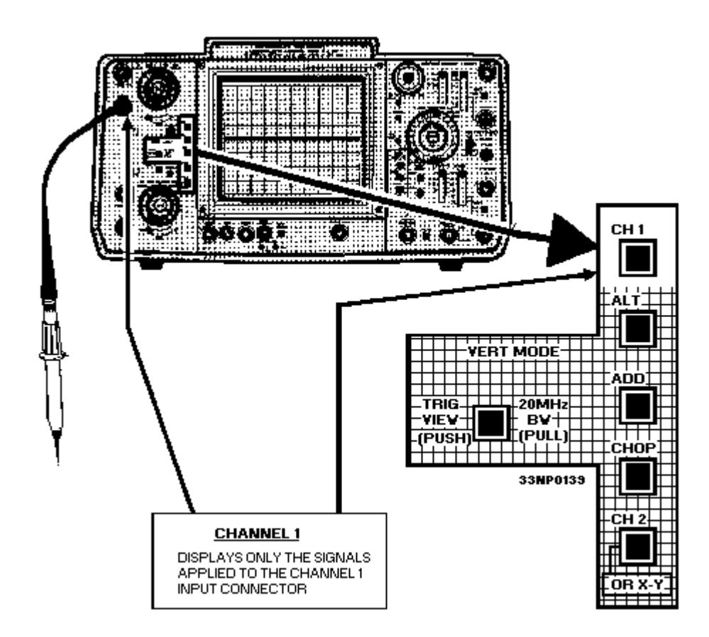

**Figure 6-23.—Vertical-deflection controls.**

### **COMPONENTS USED TO DETERMINE PERIOD TIME OF THE DISPLAY**

The TIME/DIV (figure 6-24) controls on the scope determine the period time of the displayed waveform. As we discussed earlier, the sweep generator develops the sawtooth waveform that is applied to the horizontal-deflection plates of the CRT. This sawtooth voltage causes the beam to move across the screen. This trace (sometimes called SWEEP) sets the frequency of the TIME BASE of the oscilloscope. The frequency of the time base is variable, which enables the oscilloscope to accept a wide range of input frequencies. Again, two controls are used (figure 6-24). One is a multiposition switch (TIME/DIV) that changes the frequency of the sweep generator in steps. The second control is a potentiometer (VAR) that varies the frequency between steps. Each step on the TIME/DIV control is calibrated. The front panel has markings that group the numbers into microseconds and milliseconds.

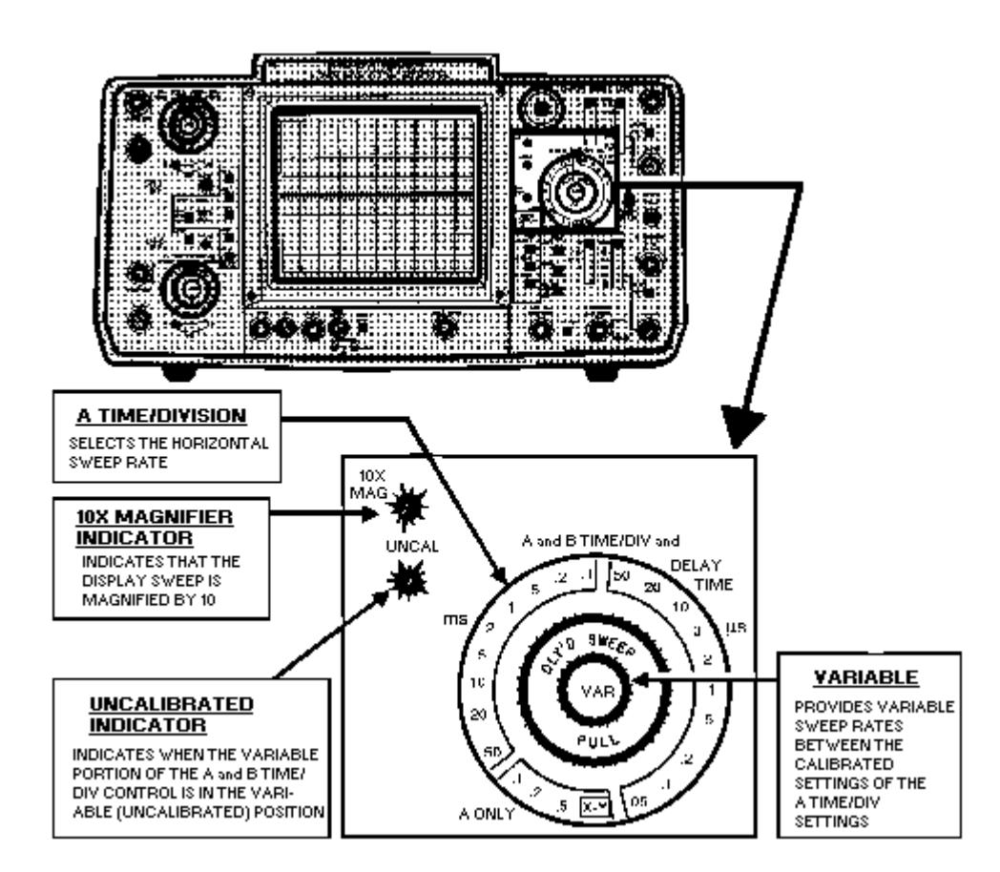

**Figure 6-24.—Period time of the waveform (TIME/DIV).**

The potentiometer is labeled VAR, and the panel has an UNCAL indicator that lights when the VAR control is in the variable position. When you desire to accurately measure the time of one cycle of an input signal, turn the VAR control to the CAL position and turn the TIME/DIV switch to select an appropriate time base. Suppose you choose the 10-microsecond position to display two cycles of an input signal, as shown in figure 6-25. One cycle occupies 3 centimeters (small divisions) along the horizontal axis. Each cm has a value of 10 microseconds. Therefore, the time for one cycle equals 30 microseconds (3 × 10). Recall that the frequency for a signal may be found by using the following procedure:

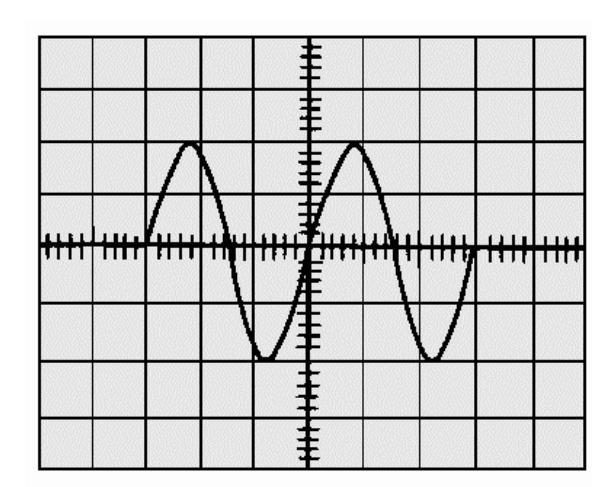

**Figure 6-25.—Time measurement of a waveform (TIME/DIV).**

In selecting a time base, you should select one that is lower in frequency than the input signal. If the input signal requires 5 milliseconds to complete one cycle and the sawtooth is set for 0.5 milliseconds per centimeter with a 10-centimeter-wide graticule, then approximately one cycle will be displayed. If the time base is set for 1 millisecond per centimeter, approximately two cycles will be displayed. If the time base is set at a frequency higher than the input frequency, only a portion of the input signal will be displayed.

In the basic oscilloscope, the sweep generator runs continuously (FREE-RUNNING); in more elaborate oscilloscopes, it is normally turned off. In the oscilloscope we're using as an example, the sweep generator can be triggered by the input signal or by a signal from some other source. (Triggering will be discussed later in this chapter.) This type of oscilloscope is called a triggered oscilloscope. The triggered oscilloscope permits more accurate time measurements to be made and provides a more stable presentation than the nontriggered-type oscilloscope.

On some oscilloscopes, you will find a 10 times (10X) magnification control. As previously mentioned, this allows the displayed sweep to be magnified by a factor of 10.

*Q-15. When you select the time base to display a signal, should the time base be the same, higher, or lower than the input signal?*

### **COMPONENTS USED TO PROVIDE A STABLE DISPLAY**

The triggering and level controls are used to synchronize the sweep generator with the input signal. This provides a stationary waveform display. If the input signal and horizontal sweep generator are unsynchronized, the pattern tends to jitter, making observations difficult.

The A TRIGGER controls at the lower right of the scope (figure 6-26) are used to control the stability of the oscilloscope CRT display. They are provided to permit you to select the source, polarity, and amplitude of the trigger signal. These controls, labeled A TRIGGER, LEVEL, SOURCE, and SLOPE, are described in the following paragraphs.

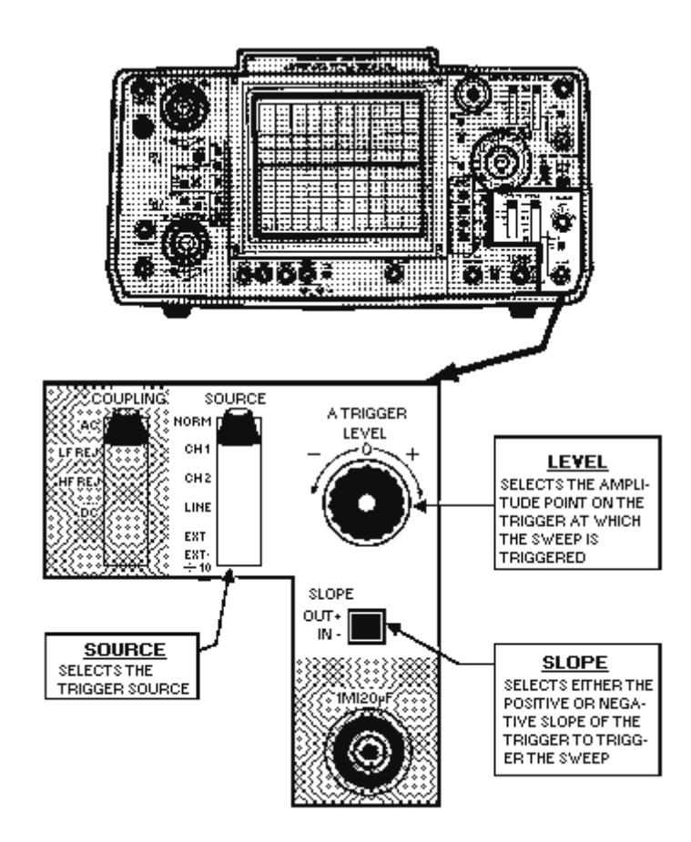

**Figure 6-26.—Components that control stability.**

### **SOURCE Control**

The SOURCE control allows you to select the appropriate source of triggering. You can select input signals from channel 1 or 2, the line (60 hertz), or an external input.

### **TRIGGER LEVEL/SLOPE Controls**

The LEVEL control allows you to select the amplitude point of the trigger signal at which the sweep is triggered. The SLOPE lets you select the negative or positive slope of the trigger signal at which the sweep is triggered.

The TRIGGER LEVEL (mounted with the TRIGGER SLOPE on some scopes) determines the voltage level required to trigger the sweep. For example, in the TRIGGER modes, the trigger is obtained from the signal to be displayed. The setting of the LEVEL control determines the amplitude point of the input waveform that will be displayed at the start of the sweep.

Figure 6-27 shows some of the displays for a channel that can be obtained for different TRIGGER LEVEL and TRIGGER SLOPE settings. The level is zero and the slope is positive in view A; view B also shows a zero level but a negative slope selection. View C shows the effects of a positive trigger level setting and positive trigger slope setting; view D displays a negative trigger level setting with a positive trigger slope setting. Views E and F have negative slope settings. The difference is that view E has a positive trigger level setting, whereas F has a negative trigger level setting.

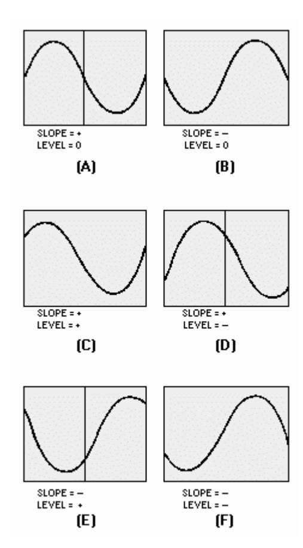

**Figure 6-27.—Effects of SLOPE and TRIGGER LEVEL controls.**

In most scopes, an automatic function of the trigger circuitry allows a free-running trace without a trigger signal. However, when a trigger signal is applied, the circuit reverts to the triggered mode of operation and the sweep is no longer free running. This action provides a trace when no signal is applied.

Synchronization is also used to cause a free-running condition without a trigger signal. Synchronization is not the same as triggering. TRIGGERING refers to a specific action or event that initiates an operation. Without this event, the operation would not occur. In the case of the triggered sweep, the sweep will not be started until a trigger is applied. Each succeeding sweep must have a trigger before a sweep commences. SYNCHRONIZATION, however, means that an operation or event is brought into step with a second operation.

A sweep circuit that uses synchronization instead of triggering will cause a previously free-running sweep to be locked in step with the synchronizing signal. The TRIGGER LEVEL control setting can be increased until synchronization occurs; but, until that time, an unstable pattern will appear on the CRT face.

### **COUPLING Section**

The COUPLING section allows you to select from four positions: AC, LF REJ, HF REJ, and DC. The AC position incorporates a coupling capacitor to block any dc component. The LF and HF REJ positions reject low- and high-frequency components, respectively. The DC position provides direct

coupling to the trigger circuits. This is useful when you wish to view only the LF or HF component of a signal.

### **COMPONENTS USED TO SELECT SCOPE TRIGGERING**

The TRIG MODE section in figure 6-28 allows for automatic triggering or normal triggering. In AUTO (automatic), the triggering will be free-running in the absence of a proper trigger input or will trigger on the input signal at frequencies above 20 hertz. In NORM (normal), the vertical channel input will trigger the sweep.

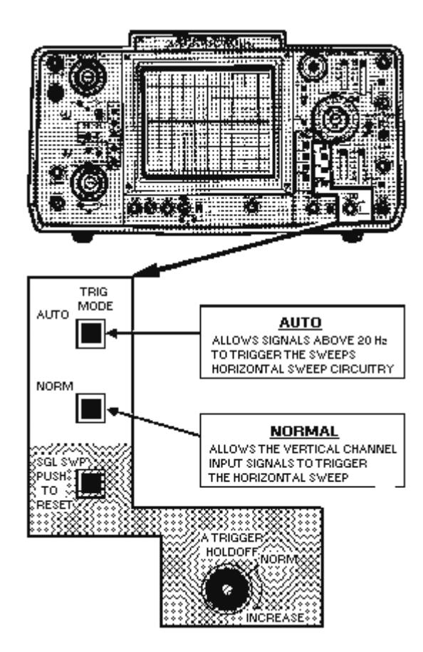

**Figure 6-28.—Components to select triggering.**

### **COMPONENTS USED TO SELECT HORIZONTAL-DEFLECTION MODE**

For the present, notice only that the HORIZ DISPLAY (horizontal display) in figure 6-29 can be controlled by the TIME/DIV switch. Other switches in this section will be explained later in this chapter.

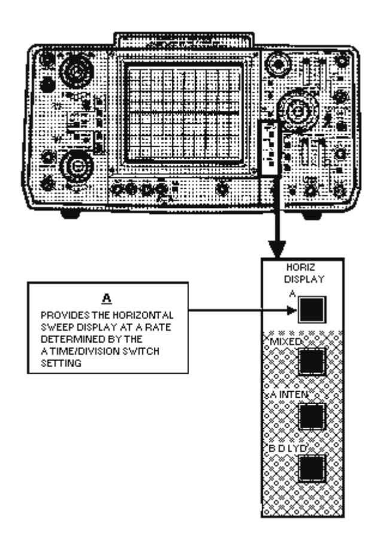

**Figure 6-29.—Components to select mode of horizontal deflection.**

### **COMPONENTS USED TO CALIBRATE THE PROBE OF THE SCOPE**

In figure 6-30, you can see the components used to calibrate the test probe on the scope. A 1-volt, 2-kilohertz square wave signal is provided for you to adjust the probe for an accurate square wave and to check the vertical gain of the scope. You adjust the probe with a screwdriver, as shown in the figure.

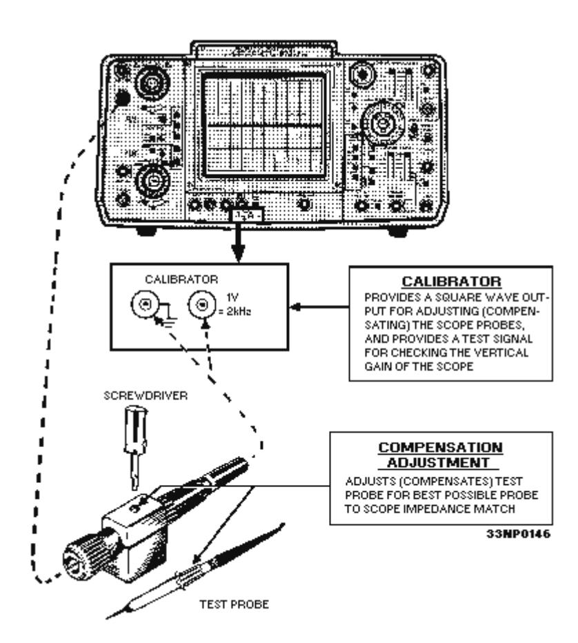

**Figure 6-30.—Components to calibrate probe.**

### **SIMILARITIES AMONG OSCILLOSCOPES**

The oscilloscope you use may differ in some respects from the one just covered. Controls and circuits may be identified by different names. Many of the circuits will be designed differently. However, all the functions will be fundamentally the same. Before using an oscilloscope, you should carefully study the operator's manual that comes with it.

### **USING THE OSCILLOSCOPE**

An oscilloscope can be used for several different types of measurements, such as time, phase, frequency, and amplitude of observed waveforms. Earlier in this chapter, you learned that the oscilloscope is most often used to study the shapes of waveforms when the performance of equipment is being checked. The patterns on the scope are compared with the signals that should appear at test points (according to the technical manual for the equipment under test). You can then determine if the equipment is operating according to peak performance standards.

*Q-16. Oscilloscopes are used to measure what quantities?*

### **TURNING ON THE SCOPE**

Before turning on the scope, make sure it is plugged into the proper power source. This may seem obvious, but many technicians have turned all knobs on the front panel out of adjustment before they noticed that the power cord was not plugged in. On some scopes, the POWER switch is part of the INTEN (intensity) control. Turn or pull the knob until you hear a click or a panel light comes on (figure 6-31). Let the scope warm up for a few minutes so that voltages in all of the circuits become stabilized.

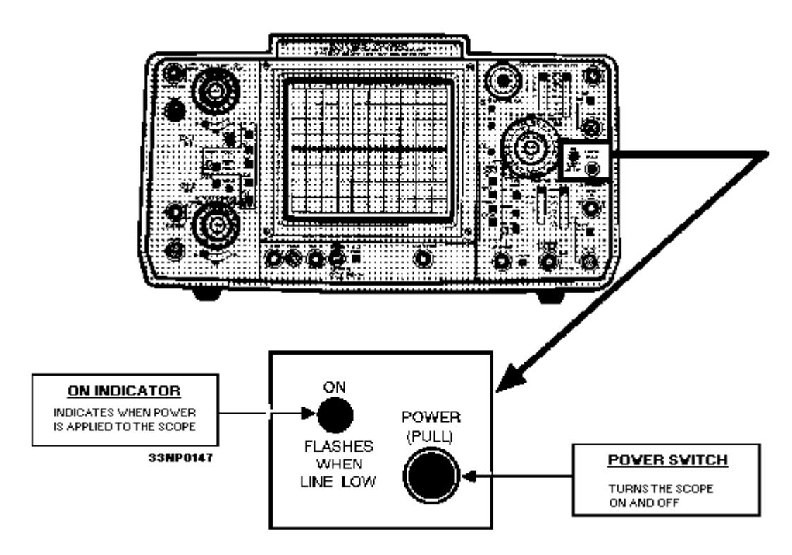

**Figure 6-31.—Components to energize scope.**

### **OBTAINING A PATTERN ON THE SCREEN**

When adjusting a pattern onto the screen, adjust the INTEN (intensity) and FOCUS controls for a bright, sharp line. If other control settings are such that a dot instead of a line appears, turn down the intensity to prevent burning a hole in the screen coating. Because of the different speeds at which the beam travels across the screen, brightness and sharpness will vary at various frequency settings. For this reason, you may have to adjust the INTEN and FOCUS controls occasionally while taking readings.

### **NUMBER OF CYCLES ON THE SCREEN**

Because distortion may exist at the beginning and end of a sweep, it is better to place two or three cycles of the waveform on the screen instead of just one, as shown in figure 6-32.

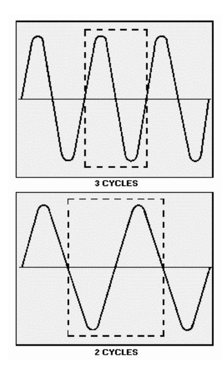

**Figure 6-32.—Proper signal presentation.**

The center cycle of three cycles provides you with an undistorted waveform in its correct phase. The center of a two-cycle presentation will appear inverted, but will be undistorted. To place waveforms on the CRT in this manner, you must understand the relationship between horizontal and vertical frequencies. The relationship between the frequencies of the waveform on the vertical plates and the sawtooth on the horizontal plates determines the number of cycles on the screen, as shown in figure 6-33.

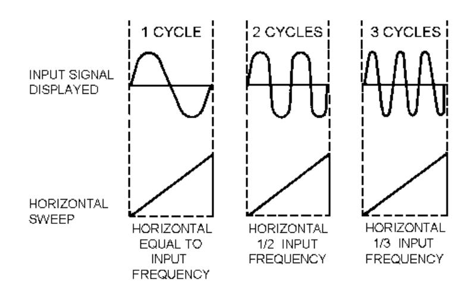

**Figure 6-33.—Vertical versus horizontal relationship.**

The horizontal sweep frequency of the scope should always be kept lower than, or equal to, the waveform frequency; it should never be higher. If the sweep frequency were higher, only a portion of the waveform would be presented on the screen.

If, for example, three cycles of the waveform were to be displayed on the screen, the sweep frequency would be set to one-third the frequency of the input signal. If the input frequency were 12,000 hertz, the sweep frequency would be set at 4,000 hertz for a three-cycle scope presentation. For two cycles, the sweep frequency would be set at 6,000 hertz. If a single cycle were desired, the setting would be the same as the input frequency, 12,000 hertz.

### **DUAL-TRACE OPERATION**

The information presented in the previous sections served as a general overview of basic single-trace oscilloscope operation using one channel and operating controls. Now, you will be introduced to DUAL-TRACE operation.

Dual-trace operation allows you to view two independent signal sources as a dual display on a single CRT. This operation allows an accurate means of making amplitude, phase, time displacement, or frequency comparisons and measurements between two signals.

A dual-trace oscilloscope should not be confused with a dual-beam oscilloscope. Dual-beam oscilloscopes produce two separate electron beams on a single scope, which can be individually or jointly controlled. Dual-trace refers to a single beam in a CRT that is shared by two channels.

*Q-17. Scopes that produce two channels on a single CRT with a single beam are referred to as what types of scopes?*

### **Components Used to Select Vertical-Deflection Operating Mode**

The VERT MODE controls (figure 6-34) allow you to select the operating mode of the scope for vertical deflection.

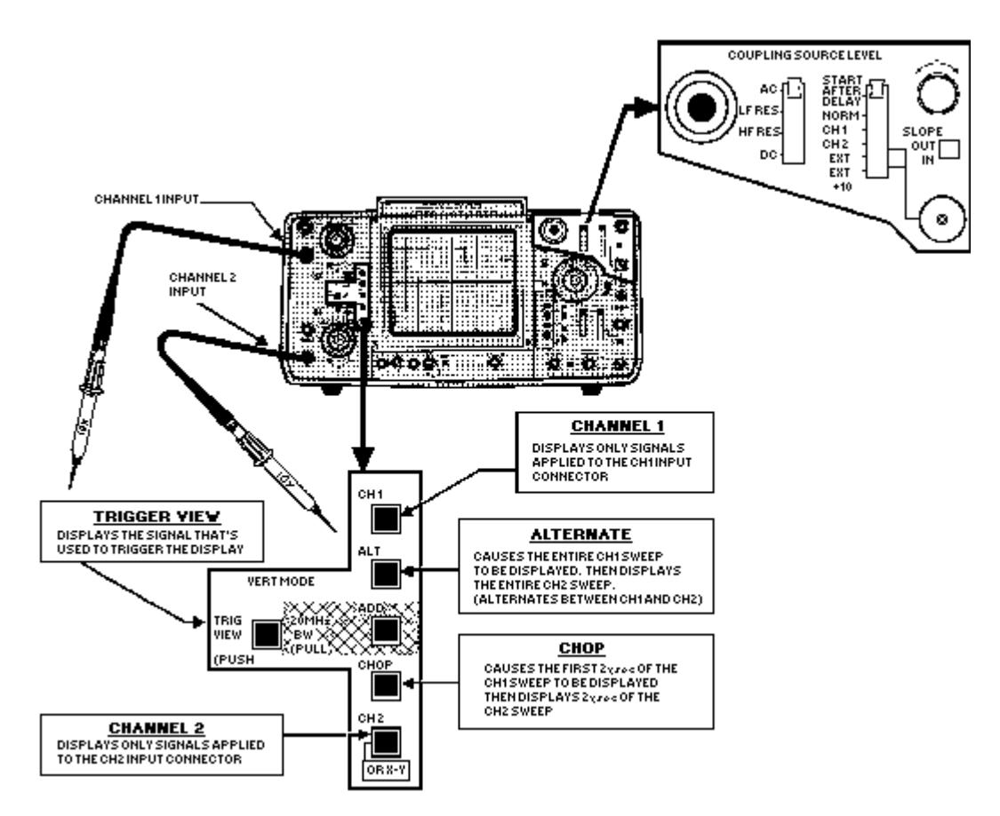

**Figure 6-34.—Components to select vertical operating mode.**

**CH 1 AND CH 2**.—These controls allow you to display signals applied to either channel 1 or channel 2, as discussed earlier.

**TRIGGER VIEW**.—The TRIG VIEW allows you to display the signal that is actually used to trigger the display. (Triggering was discussed earlier.)

**ALT**.—The ALT (alternate) mode (figure 6-35) of obtaining a dual trace uses the techniques of GATING between sweeps. This control allows the signal applied to channel 1 to be displayed in its entirety; then, channel 2 is displayed in its entirety. This method of display is continued alternately between the two channels. At slow speeds, one trace begins to fade while the other channel is being gated. Consequently, the ALT mode is not used for slow sweep speeds. The CHOP mode, shown in figure 6-36 (explained next), will not produce a satisfactory dual sweep at high speeds. The ALT mode is deficient at low speeds. Therefore, both are used on dual-trace oscilloscopes to complement each other and give the scope a more dynamic range of operation.

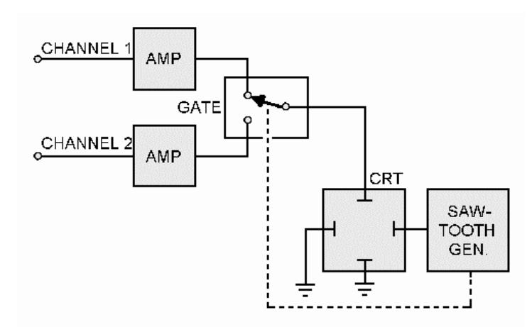

**Figure 6-35.—ALT (alternate) mode.**

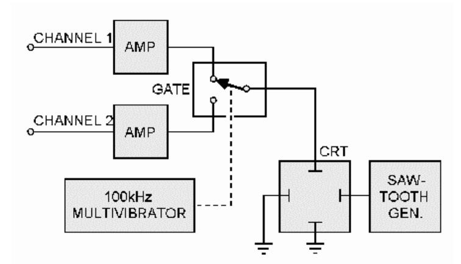

**Figure 6-36.—CHOP mode.**

The output dc voltage references on each of the amplifiers are independently adjustable. Therefore, the beam will be deflected by different amounts on each channel if the voltage reference is different at each amplifier output. The output voltage from each amplifier is applied to the deflection plates through the gate. The gate is actually an electronic switch. In this application, it is commonly referred to as a BEAM SWITCH.

Switching is controlled by a high-frequency multivibrator in the CHOP mode. That is, the gate selects the output of one channel and then the other at a high-frequency rate (1200 kilohertz in most oscilloscopes). Because the switching time is very short in a good-quality oscilloscope, the resultant display is two sets of horizontally dashed lines, as shown in figure 6-37, view A.

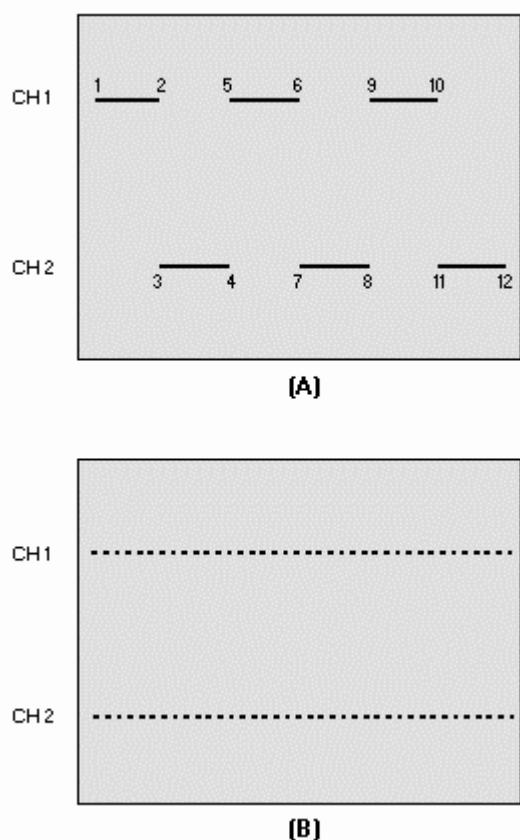

**Figure 6-37.—Displaying CHOP mode.**

Dashed line CH 1 is the output of one channel, while line CH 2 is the output of the other. The trace moves from left to right because of the sawtooth waveform applied to the horizontal plates. A more detailed analysis shows that the beam moves from CH 1 to CH 2 while the gate is connected to the output from one channel. Then, when the gate samples the output of the CH 2 during time 3 to 4, the beam is at a different vertical LOCATION. (This is assuming that CH 2 is at a different voltage reference.) The beam continues in the sequence 5 to 6, 7 to 8, 9 to 10, and 11 to 12 through the rest of one horizontal sweep.

When the chopping frequency is much higher than the horizontal sweep frequency, the number of dashes will be very large. For example, if the chopping occurs at 100 kilohertz and the sweep frequency is 1 kilohertz, each horizontal line would then appear as a series of closely spaced dots, as shown in figure 6-37 view B. As the sweep frequency becomes lower compared to the chopping frequency, the display will show apparently continuous traces; therefore, the CHOP mode is used at low sweep rates.

When signals are applied to the channel amplifiers (view A of figure 6-38), the outputs are changed according to the triggering signal (view B). The resultant pattern (view C) on the screen provides a timebase presentation of the signals of each channel.

**Figure 6-38.—Dual-channel display in CHOP mode.**

**ADD**.—The ADD switch (shown earlier in figure 6-34) algebraically adds the two signals of channels 1 and 2 together for display.

### **Other Dual-Trace Oscilloscope Controls**

Most dual-trace oscilloscopes have both an A and B time base for horizontal sweep control. Notice in the upper right corner on our example scope (figure 6-34) the COUPLING, SOURCE LEVEL, and SLOPE controls. These serve the same function as did those same controls in the A time-base section of the scope. The B time base is selected using the same A and B TIME/DIV control (pull out outer knob).

The use of the B time base is controlled by the HORIZ DISPLAY section discussed earlier in the A time-base section. However, inexperienced technicians generally do not use A and B time bases together in the MIXED, A INTEN (intensified), and B D'LYD (delayed) settings. These controls are fully explained in the applicable technical manuals; therefore, we will not discuss the controls in this chapter. Figure 6-39 is a block diagram of a basic dual-trace oscilloscope without the power supplies.

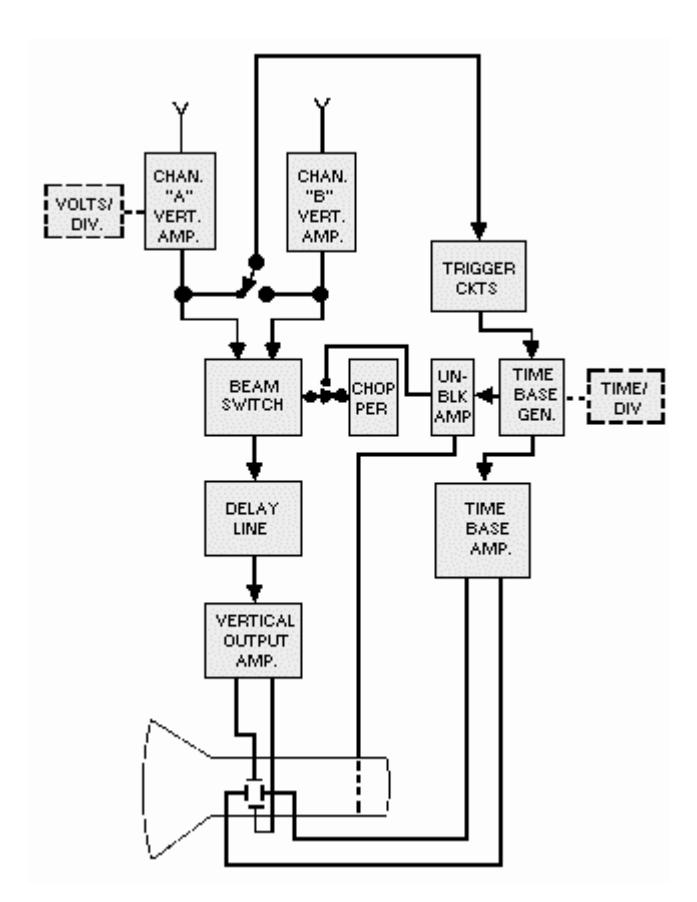

**Figure 6-39.—Basic dual-trace oscilloscope block diagram.**

### **ACCESSORIES**

The basic dual-trace oscilloscope has one gun assembly and two vertical channels. However, there are many variations. The horizontal sweep channels vary somewhat from equipment to equipment. Some have one time-base circuit and others have two. These two are interdependent in some oscilloscopes and in others they are independently controlled. Also, most modern general-purpose oscilloscopes are constructed of modules. That is, most of the vertical circuitry is contained in a removable plug-in unit, and most of the horizontal circuitry is contained in another plug-in unit.

The main frame of the oscilloscope is often adapted for many other special applications by the design of a variety of plug-in assemblies. This modular feature provides much greater versatility than in a single-trace oscilloscope. For instance, to analyze the characteristics of a transistor, you can replace the dual-trace, plug-in module with a semiconductor curve-tracer plug-in module.

Other plug-in modules available with some oscilloscopes are high-gain, wide-bandwidth amplifiers; differential amplifiers; spectrum analyzers; physiological monitors; and other specialized units. Therefore, the dual-trace capability is a function of the type of plug-in unit that is used with some oscilloscopes.

To get maximum usefulness from an oscilloscope, you must have a means of connecting the desired signal to the oscilloscope input. Aside from cable connections between any equipment output and the oscilloscope input, a variety of probes are available to assist in monitoring signals at almost any point in a circuit. The more common types include 1-TO-1 PROBES, ATTENUATION PROBES, and CURRENT PROBES. Each of these probes may be supplied with several different tips to allow measurement of signals on any type of test point. Figure 6-40 shows some of the more common probe tips.

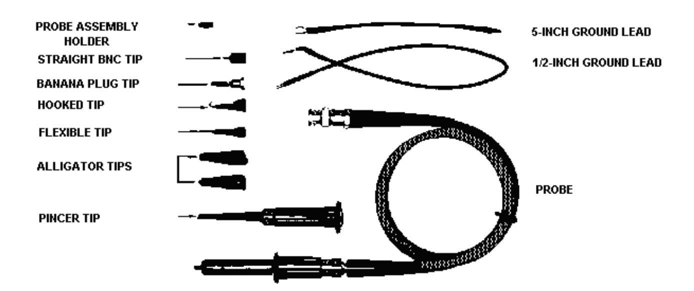

**Figure 6-40.—Common probe tips.**

In choosing the probe to use for a particular measurement, you must consider such factors as circuit loading, signal amplitude, and scope sensitivity.

The 1-to-1 probe offers little or no attenuation of the signal under test and is, therefore, useful for measuring low-level signals. However, circuit loading with the 1-to-1 probe may be a problem. The impedance at the probe tip is the same as the input impedance of the oscilloscope.

An attenuator probe has an internal high-value resistor in series with the probe tip. This gives the probe a higher input impedance than that of the oscilloscope. Because of the higher input impedance, the probe can measure high-amplitude signals that would overdrive the vertical amplifier if connected directly to the oscilloscope. Figure 6-41 shows a schematic representation of a basic attenuation probe. The 9-megohm resistor in the probe and the 1-megohm input resistor of the oscilloscope form a 10-to-1 voltage divider.

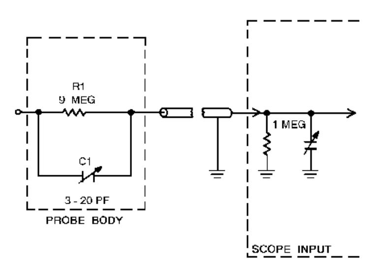

Since the probe resistor is in series, the oscilloscope input resistance is 10 megohms when the probe is used. Thus, using the attenuator probe with the oscilloscope causes less circuit loading than using a 1 to-1 probe.

Before using an attenuator probe for measurement of high-frequency signals or for fast-rising waveforms, you must adjust the probe compensating capacitor (C1) according to instructions in the applicable technical manual. Some probes will have an IMPEDANCE EQUALIZER in the end of the cable that attaches to the oscilloscope. The impedance equalizer, when adjusted according to manufacturer's instructions, assures proper impedance matching between the probe and oscilloscope. An improperly adjusted impedance equalizer will result in erroneous measurements, especially when you are measuring high frequencies or fast-rising signals.

More information on oscilloscope hook-ups can be found in Electronics Information Maintenance Books (EIMB), *Test Methods and Practices*.

Special current probes have been designed to use the electromagnetic fields produced by a current as it travels through a conductor. This type of probe is clamped around a conductor without disconnecting it from the circuit. The current probe is electrically insulated from the conductor, but the magnetic fields about the conductor induce a potential in the current probe that is proportional to the current through the conductor. Thus, the vertical deflection of the oscilloscope display will be directly proportional to the current through the conductor.

### **SPECTRUM ANALYZER**

The spectrum analyzer is used to examine the frequency spectrum of radar transmissions, local oscillators, test sets, and any other equipment operating within its testable frequency range. With experience, you will be able to determine definite areas of malfunctioning components within equipment. Successful spectrum analysis depends on the proper operation of a spectrum analyzer and your ability to correctly interpret the displayed frequencies. Although there are many types of spectrum analyzers, we will use the Tektronix, Model 492 for our discussion.

The spectrum analyzer accepts an electrical input signal and displays the frequency and amplitude of the signal on a CRT. On the vertical, or Y, axis, the amplitude is plotted. The frequency would then be found on the horizontal, or X, axis. The overall pattern of this display (figure 6-42) indicates the proportion of power present at the various frequencies within the spectrum (fundamental frequency with sideband frequencies).

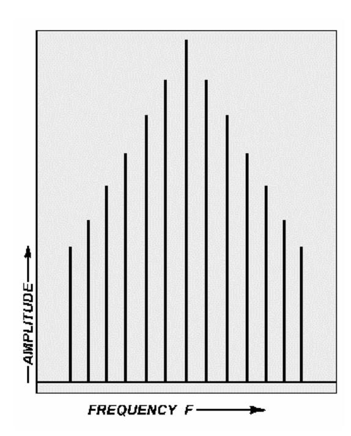

**Figure 6-42.—Spectrum analyzer pattern.**

### **BASIC FUNCTIONAL DESCRIPTION**

The model 492 analyzer can be divided into six basic sections, as follows:

- Converter section;
- Intermediate frequency (IF) section;
- Display section;
- Frequency control section;
- Digital control section; and
- Power and cooling section.

### **Converter Section**

The converter section actually consists of three frequency converters, made up of a mixer, local oscillator (LO), and required filters. Only one frequency can be converted at a time and pass through the filters to reach the next converter. The analysis frequency can, however, be changed by altering the frequency of the LO and adjusting the FREQUENCY control knob.

**FIRST CONVERTER**.—The first (front end) converter changes the input signal to a usable IF signal that will either be 829 MHz or 2072 MHz. The IF signal to be produced is dependent on which measurement band selection is currently being used. The 829 MHz IF signal will be selected for bands 2 through 4, while the 2072 MHz IF signal is selected for bands 1 and 5 through 11.

**SECOND CONVERTER**.—The second converter actually contains two converters. Only one of these two converters in this section is ever operational, and selected as a result of the measurement band currently being used. The selected converter will convert the frequency received from the first converter to a usable (110 MHz) IF signal, which is then provided to the third converter.

**THIRD CONVERTER**.—This converter takes the 110 MHz IF signal, amplifies it, and then converts it to the final IF of 10 MHz. This signal, in turn, is then passed on to the IF section.

### **IF Section**

The IF section receives the final IF signal and uses it to establish the system resolution by using selective filtering. System resolution is selected under microcomputer control among five bandwidths (1 MHz, 100 kHz, 10 kHz, 1 kHz, and 100 Hz). The gain for all bands are then leveled and logarithmically amplified. This is done so that each division of signal change on the CRT display remains equal in change to every other division on the CRT. For example, in the 10-dB-per-division mode, each division of change is equal to a 10 dB difference, regardless of whether the signal appears at the top or bottom of the CRT. The signal needed to produce the video output to the display section is then detected and provided.

### **Display Section**

The display section provides a representative display of the input signal on the CRT. It accomplishes this by performing the following functions:

- Receives the video signals from the IF section and processes these signals to adjust the vertical drive of the CRT;
- Receives the sweep voltages and processes these signals to produce the horizontal CRT drive plate voltage;
- Receives character data information and generates CRT plate drive signals to display alpha and numeric characters on the CRT;
- Receives control levels from the front panel beam controls and generates unblanking signals to control display presence, brightness, and focus.

The vertical deflection of the beam is increased as the output of the amplitude detector increases. The horizontal position is controlled by the frequency control section and is the frequency analyzed at that instant. The beam sweeps from left to right, low to high frequencies during its analysis. During this analysis, any time a signal is discovered, a vertical deflection will show the strength of the signal at the horizontal position that is the frequency. This results in a display of amplitude as a function of frequency.

### **Frequency Control Section**

The frequency control section accomplishes the tuning of the first and second LOs within the converter section. The frequency immediately being analyzed is controlled by the current frequencies of the LOs. To analyze another frequency, you must change an LO frequency to allow the new frequency to be converted to a 10 MHz signal by the converter section. Periodically, the unit sweeps and analyzes a frequency range centered on the frequency set by the FREQUENCY knob. Adjusting the FREQUENCY knob will cause the LOs to be tuned to the new frequency. Only the LOs of the first two converters can be changed to vary the frequency being analyzed.

### **Digital Control Section**

All the internal functions are controlled from the front panel through the use of a built-in microcomputer. The microcomputer uses an internal bus to receive or produce all communication or control to any section of the analyzer.

### **Power and Cooling Section**

The main power supply provides almost all the regulated voltages required to operate the unit. The display section provides the high voltage necessary for CRT operation.

The cooling system allows fresh cool air to be routed to all sections of the unit in proportion to the heat that is generated by each section.

### **SPECTRUM ANALYZER FRONT PANEL CONTROLS, INDICATORS, AND CONNECTORS**

This section will describe the function of the front panel controls, indicators, and connectors. For a complete description of each function, refer to table 6-1 while reviewing the front panel in figure 6-43. The numbers located in column 1 of table 6-1 equate to the same numbers found on the front panel of figure 6-43. Because most operational functions of this spectrum analyzer are microprocessor-controlled, they are switch-selected rather than adjusted.

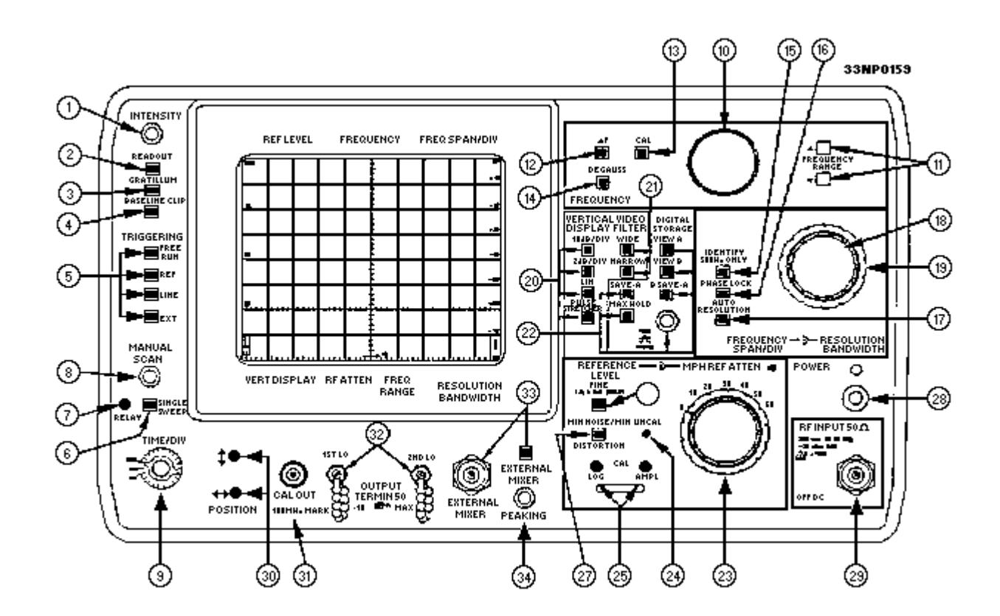

**Figure 6-43.—Spectrum analyzer front panel controls, indicators, and connectors.**

**Table 6-1.—Description of Front Panel Controls, Indicators, and Connectors**

| ITEM | FUNCTION      | DESCRIPTION                                                                          |
|------|---------------|--------------------------------------------------------------------------------------|
| 1    | INTENSITY     | This knob controls the brightness of the CRT trace and the CRT readout display.      |
| 2    | READOUT       | This push button switches the readout display on and off. All spectrum analyzer      |
| 3    | GRATILLUM     | This push button switches the graticule light on and off.                            |
| 4    | BASELINE CLIP | This push button, when activated, clips (subdues) the intensity at the baseline.     |
| 5    | TRIGGERING    | This area allows one of four triggering modes to be selected by push buttons that    |
| 5a   | FREE RUN      | When activated, the sweep is free-running without regard to trigger signals.         |
| 5b   | INT           | When activated, the sweep is triggered by any signal at the left edge of the display |
| 5c   | LINE          | When activated, a sample of the ac power line voltage is used to trigger the sweep.  |
| 5d   | EXT           | When selected, the sweep is triggered by an external signal (applied through the     |
| 6    | SINGLE SWEEP  | This push button, plus a ready indicator (No. 7), provides the single sweep          |
| 7    | READY         | When single sweep is selected, this indicator lights while the sweep circuit is      |
| 8    | MANUAL SCAN   | When the TIME/DIV (No. 9c) selector is in the MNL position, this control will        |
| 9    | TIME/DIV      | Is used to select sweep rates from 5 VHFGLYWR VHFGLY7KLVVZLWFKDOVR        |
| 9a   | AUTO          | In this position, the sweep rate is selected by the microcomputer to maintain a      |
| 9b   | EXT           | When selected, this control allows an external input source to be used with the      |
| 9c   | MNL           | When selected, this control is used in conjunction with No. 8 (see MANUAL            |
| 10   | FREQUENCY     | This control is manually turned to allow you to tune to the center frequency.        |
| 11   | FREQUENCY     |                                                                                      |
| 12   | F             | This control is used for measuring the frequency difference between signals. When    |

**Table 6-1.—Description of Front Panel Controls, Indicators, and Connectors—Continued**

| ITEM | FUNCTION         | DESCRIPTION                                                                          |
|------|------------------|--------------------------------------------------------------------------------------|
| 13   | CAL              | When this is activated, the frequency readout can be calibrated to center the center |
| 14   | DEGAUSS          | When this button is pressed, current through the local oscillator system is reduced  |
| 15   | IDENTIFY 500 kHz |                                                                                      |
| 16   | PHASE LOCK       | When this control is activated (button lit), it will reduce residual FM when narrow  |
| 17   | AUTO             |                                                                                      |
| 18   | FREQ             |                                                                                      |
| 19   | RESOLUTION       |                                                                                      |
| 20   | VERTICAL         |                                                                                      |
| 20a  | 10dB/DIV         | When this is activated, the dynamic range of the display is calibrated to 80 dB,     |

**Table 6-1.—Description of Front Panel Controls, Indicators, and Connectors—Continued**

| ITEM | FUNCTION        | DESCRIPTION                                                                           |
|------|-----------------|---------------------------------------------------------------------------------------|
| 20b  | 2dB/DIV         | When activated, this will increase the resolution so that each major graticule        |
| 20c  | LIN             | When activated, this selects a linear display between zero volts (bottom graticule    |
| 20d  | PULSE           |                                                                                       |
| 21   | VIDEO FILTER    | One of two (NARROW OR WIDE) filters can be activated to reduce video                  |
| 22   | DIGITAL         |                                                                                       |
| 22a  | VIEW A, VIEW B  | When either or both of these push buttons are selected, the push button illuminates,  |
| 22b  | B-SAVE A        | When activated, the differential (arithmetic difference) of data in B memory and      |
| 22c  | MAX HOLD        | When activated, the digital storage memory retains the maximum signal amplitude       |
| 22d  | PEAK/AVERAGE    | This control selects the amplitude at which the vertical display is either peak       |
| 23   | MIN RF ATTEN    | This control is used to set the minimum amount of RF attenuation. Changing RF         |
| 23a  | REFERENCE       |                                                                                       |
| 23b  | MIN RF ATTEN DB | This selects the lowest value of attenuation allowed: Actual RF attenuation is set    |
| 24   | UNCAL           | This indicator lights when the display amplitude is no longer calibrated (selecting a |
| 25   | LOG and AMPL    |                                                                                       |
| 26   | FINE            | When activated, the REFERENCE LEVEL (No. 23a) switches in 1 dB increments             |

**Table 6-1.—Description of Front Panel Controls, Indicators, and Connectors—Continued**

| ITEM | FUNCTION       | DESCRIPTION                                                                          |
|------|----------------|--------------------------------------------------------------------------------------|
| 27   | MIN            |                                                                                      |
| 28   | POWER          | This is a pull switch that turns power on when extended.                             |
| 29   | RF INPUT       | This is a 50 ohm coaxial input jack used to input signals of 21GHz or below. The     |
| 30   | POSITION       | These controls are used to position the display on the horizontal and vertical axes. |
| 31   | CAL OUT        | This is an output jack that has a calibrated 20 dBm 100 MHz signal, with frequency   |
| 32   | OUTPUT 1ST AND |                                                                                      |
| 33   | EXTERNAL MIXER | When the EXTERNAL MIXER button is activated, bias is provided out the                |
| 34   | PEAKING        | This control varies the mixer bias for external mixers in the EXTERNAL MIXER         |

### **NORMAL INDICATIONS UPON POWER ON**

With power applied (power knob pulled out), the spectrum analyzer will automatically (upon microcomputer control) go into the following conditions. If you do not find these indications, there is a probably a problem with the unit.

- Vertical display: 10 dB/div;
- Frequency: 0.00 MHz;
- REF level: +30 dB;
- RF attenuation: 60 dB;
- Frequency range: 0.0 to 1.8 GHz;
- Auto resolution: 1 MHz;
- Resolution bandwidth: 1 MHz;
- Freq Span/Div: Max;
- Triggering: Free run;
- Readout: On;
- Digital storage: View A/View B On;

- All other indicators off or inactive.

### **SUMMARY**

Now that we have completed this chapter, we will briefly review the more important points covered.

A **CATHODE-RAY TUBE (CRT)** is used in an oscilloscope to display the waveforms.

The CRT used in oscilloscopes consists of an **ELECTRON GUN**, a **DEFLECTION SYSTEM**, and a **FLUORESCENT SCREEN**.

The **ELECTRON BEAM** in an oscilloscope is allowed to be controlled in any direction by means of **HORIZONTAL**- and **VERTICAL-DEFLECTION PLATES**.

**VERTICAL-DEFLECTION PLATES** are used to show **AMPLITUDE** of a signal.

**HORIZONTAL-DEFLECTION PLATES** are used to show **TIME** and/or **FREQUENCY** relationship.

A **GRATICULE** is a calibrated scale of **AMPLITUDE VERSUS TIME** that is placed on the face of the CRT.

A **DUAL-TRACE OSCILLOSCOPE** is designed to accept two vertical inputs at the same time. It uses a single beam of electrons shared by two channels.

The **SPECTRUM ANALYZER** accepts an electrical input signal and displays the signal's frequency and amplitude on a CRT display.

### *ANSWERS TO QUESTIONS Q1. THROUGH Q18.*

*A-1. Control grid. A-2. The first anode. A-3. Because they bend electron streams in much the same manner that optical lenses bend light rays. A-4. It accelerates the electrons emerging from the first anode. A-5. A greater deflection angle. A-6. A greater deflection angle. A-7. Higher potential. A-8. Slower beam. A-9. Amplitude and time. A-10. Amplitude. A-11. Time and/or frequency relationships.*

*A-12. To permit wide-angle deflection of the beam. A-13. Deflection factor. A-14. A CRT, a group of control circuits, power supply, sweep circuitry, and deflection circuitry. A-15. Lower. A-16. Amplitude, phase, time, and frequency. A-17. Dual-trace oscilloscopes. A-18. Front end.*

# **APPENDIX I GLOSSARY**

**ABSORPTION WAVEMETER**—An instrument used to measure audio frequencies. **AMMETER**—A meter used to measure current. **BACK RESISTANCE**—The larger resistance value observed when you are checking the forward resistance of a semiconductor. **BAND PASS FILTER**—A tuned circuit that passes only a specific frequency. **BAND REJECT FILTER**—A tuned circuit that does not pass a specified band of frequencies. **BARRETTER**—A type of bolometer characterized by an increase in resistance as the dissipated power rises. **BEAT FREQUENCY**—The difference between the oscillator frequency and the unknown audio frequency. **BEL**—The unit that expresses the logarithmic ratio between the input and output of any given component, circuit, or system. **BOLOMETER**—A loading device that undergoes changes in resistance as changes in dissipated power occur. **CAVITY WAVEMETER**—An instrument used to measure microwave frequencies. **CONTINUITY**—An uninterrupted, complete path for current flow. **CORRECTIVE MAINTENANCE**—Used to isolate equipment failures. Includes replacement of defective parts to return equipment to proper performance. **DAMPING**—The process of smoothing oscillations of the meter pointer. **D'ARSONVAL METER MOVEMENT**—The permanent-magnet moving coil movement used in most meters. **dBm**—An abbreviation used to represent power levels above or below a 1-milliwatt reference. **DUMMY ANTENNA**—See DUMMY LOAD. **DUMMY LOAD**—A resistor used to replace the normal load, which is specifically designed to have low reactance and possess the ability to dissipate required amounts of power. **ELECTRODYNOMETER METER MOVEMENT**—A meter movement using fixed field coils and a moving coil; usually used in wattmeters. **EXTERNALLY EXCITED METER**—A term used to describe meters that get their power from the circuit to which they are connected.

**FORWARD RESISTANCE**—The smaller resistance value observed when you are checking the forward

resistance of a semiconductor. **FREQUENCY METER**—An instrument used to measure the rate at which ac voltages are generated. **GALVANOMETER**—A meter used to measure small values of current by electromagnetic or electrodynamic means. **GENERAL PURPOSE ELECTRONIC TEST EQUIPMENT (GPETE)**—Test equipment that has the capability, without modification, to generate, modify, or measure a range of electronic functions required to test two or more equipments or systems of basically different designs. **INDUCTANCE BRIDGE**—An ac bridge circuit used to measure an unknown value of inductance. **MAINTENANCE**—Work done to correct, reduce, or counteract wear, failure, and damage to equipment. **MEASURE (Metrology Automated System for Uniform Recall and Reporting)**—A Navy standardized system designed to provide the recall, scheduling, and documenting of test equipment into calibration facilities. **MECHANICAL-ROTATION FREQUENCY**—The speed in revolutions per minute of armatures in electric motors and engine-driven generators; blade speed in turbines. **MEGGER**—A meter used to measure insulation resistance. **METER MOVEMENT**—The part of the meter that moves to indicate some electrical value. **METER SHUNT**—A resistor placed in parallel with the meter terminals; used to provide increased range capability. **OHMMETER**—A meter used to measure resistance. **POWER FACTOR**—An indication of the various losses of a capacitor, such as current leakage and dielectric absorption. **PREVENTIVE MAINTENANCE**—Consists of mechanical, electrical, and electronic checks; used to determine whether or not equipment is operating properly. **SCAT CODES**—A four-digit subcategory code used to identify the functional measurement parameters that can be satisfied by any one of many pieces of test equipment. **SELF-EXCITED METER**—A term used to describe meters that operate from their own power sources. **SENSITIVITY**—(1) For an ammeter, the amount of current that will cause full-scale deflection of the meter. (2) For a voltmeter, the ratio of the voltmeter resistance divided by the full-scale reading of the meter; expressed in ohms per volt. **SCLSIS (Ship Configuration and Logistics Support Information System)**—This encompasses the automated data processing system and all practices and procedures used for identification and status accounting of ship's configuration, logistics, technical data reviews, and equipment configuration audits. **SHORT CIRCUIT**—An unintentional current path between two components in a circuit or between a component and ground; usually caused by a circuit malfunction.

**SPECIAL PURPOSE ELECTRONIC TEST EQUIPMENT (SPETE)**—Test equipment that is specifically designed to generate, modify, or measure a range of electronic functions of a specific or peculiar nature on a single system or equipment. **STROBOSCOPE**—An instrument that allows viewing of rotating or reciprocating objects by producing the optical effect of a slowing down or stopping motion. **SYMPTOM ELABORATION**—Using built-in indicating instruments or other aids to define an equipment malfunction. **SYMPTOM RECOGNITION**—Recognition of a situation in equipment operation that is not normal. **TACHOMETER**—An instrument that measures the rate at which a shaft is turning. **TEST EQUIPMENT INDEX**—The Navy guide used to assist in identifying portable electrical/electronic test equipment required for support of prime electrical/electronic, IC, weapons, and reactor instrumentation systems. **TEST POINTS**—Locations in equipment that are accessible to the technician's probes where operating voltages or signals can be monitored. **THERMISTOR**—A type of bolometer characterized by a decrease in resistance as the dissipated power increases. **TROUBLESHOOTING**—A procedure used to evaluate equipment performance and repair equipment when it fails to operate properly. **TUNED CIRCUIT**—A circuit that is used as a filter which passes or rejects specific frequencies. **VOLTMETER**—A meter that is used to measure voltage. **WATT**—The unit of electrical power that is the product of voltage and current. **WATTMETER**—An electrodynamometer type meter used to measure electrical power. **WAVEFORM ANALYSIS**—Observation of displays of voltage and current variations with respect to time or by harmonic analysis of complex signals. **WAVEMETER**—Calibrated resonant circuits that are used to measure frequency. **WHEATSTONE BRIDGE**—An ac bridge circuit used to measure unknown values of resistance, inductance, or capacitance.

# **APPENDIX II REFERENCES USED TO DEVELOP THIS TRAMAN**

**NOTE**: Although the following references were current when this TRAMAN was published, their continued currency cannot be assured. Therefore, you need to ensure that you are studying the latest revision.

### **CHAPTER 1**

EIMB, *Test Equipment*, NAVSEA 0967-LP-000-0040, Naval Sea Systems Command, Washington, DC, 1981. EIMB, *Test Methods and Practices*, NAVSEA 0967-LP-000-0130, Naval Sea Systems Command, Washington, DC, 1980. *Electronic Test Equipment Calibration Program Indoctrination Handbook*, NAVMAT P-9491, Naval Material Command, Washington, DC, 1979. *Metrology Automated System for Uniform Recall and Reporting (MEASURE) Users Manual*, OP 43P6A, Chief of Naval Operations, Washington, DC, 1984. Navy Electricity and Electronics Training Series, Module 3, *Introduction to Circuit Protection, Control, and Measurement*, NAVEDTRA B72-03-00-93, Naval Education and Training Professional Development and Technology Center, Pensacola, FL, 1993. *Portable Electrical/Electronic Test Equipment (PEETE) Index* NAVSEA ST-AA-IDX-010- PEETE, Naval Sea Systems Command, Washington, DC, 1986. *Ships Configuration and Logistics Support Information System* (*SCLSIS*), S0752-AA-SPN-010/SCLSIS, Naval Sea Systems Command, Washington, DC, 1988. *Standard General Purpose Electronic Test Equipment*, MIL-STD 1364(Series) (NAVY), Naval Sea Systems Command, Washington, DC, 1991. *Stowage Guide for Portable Electrical/Electronic Test Equipment* (PEETE) NAVSEA ST000- AB-GYD-010/PEETE, Naval Sea Systems Command, Washington, DC, 1987.

### **CHAPTER 2**

*Electronics Technician 3 and 2*, NAVEDTRA 80197-1, Naval Education and Training Professional Development and Technology Center, Pensacola, FL, 1987. *Fire Controlman Third Class*, NAVEDTRA 10276-1, Naval Education and Training Professional Development and Technology Center, Pensacola, FL, 1988. Navy Electricity and Electronics Training Series, Module 9, *Introduction to Wave-Generation and Wave-Shaping Circuits*, NAVEDTRA 172-09-00-83, Naval Education and Training Professional Development and Technology Center, Pensacola, FL, 1983.\*

Navy Electricity and Electronics Training Series, Module 7, *Introduction to Solid-State Devices and Power Supplies*, NAVEDTRA B72-07-00-92, Naval Education and Training Professional Development and Technology Center, Pensacola, FL, 1992. Navy Electricity and Electronics Training Series, Module 21, *Test Methods and Practices*, NAVEDTRA B72-21-00-87, Naval Education and Training Professional Development and Technology Center, Pensacola, FL, 1987. Navy Electricity and Electronics Training Series, Module 2, *Introduction to Alternating Current and Transformers*, NAVEDTRA 172-02-00-91, Naval Education and Training Professional Development and Technology Center, Pensacola, FL, 1991. *Radioman 3 & 2*, NAVEDTRA 10228-H1, Naval Education and Training Professional Development and Technology Center, Pensacola, FL, 1991.

### **CHAPTER 3**

Navy Electricity and Electronics Training Series, Module 5, *Introduction to Generators and Motors*, NAVEDTRA B72-05-00-94, Naval Education and Training Professional Development and Technology Center, Pensacola, FL, 1994. Navy Electricity and Electronics Training Series, Module 1, *Introduction to Matter, Energy, and Direct Current*, NAVEDTRA B72-01-00-92, Naval Education and Training Professional Development and Technology Center, Pensacola, FL, 1992. Navy Electricity and Electronics Training Series, Module 3, *Introduction to Circuit Protection, Control, and Measurement*, NAVEDTRA B72-03-00-93, Naval Education and Training Professional Development and Technology Center, Pensacola, FL, 1993.

### **CHAPTER 4**

*8000A Digital Multimeter*, NAVSEA 0969-LP-279-9010, Naval Sea Systems Command, Washington, DC. Navy Electricity and Electronics Training Series, Module 7, *Introduction to Solid-State Devices and Power Supplies*, NAVEDTRA B72-07-00-92, Naval Education and Training Professional Development and Technology Center, Pensacola, FL, 1992. Navy Electricity and Electronics Training Series, Module 13, *Introduction to Number Systems and Logic Circuits*, NAVEDTRA B72-13-00-86, Naval Education and Training Professional Development and Technology Center, Pensacola, FL, 1986.\* *Operation and Maintenance Instructions*, Volt-Ohm-Milliammeter 260 Series, NAVSEA 0969- LP-286-1010, Naval Sea Systems Command, Washington, DC, 1977.

### **CHAPTER 5**

EIMB, *Test Methods and Practices*, NAVSEA 0967-LP-000-0130, Naval Sea Systems Command, Washington, DC, 1980. *Huntron Tracker 2000* Operation and Maintenance Manual, Mill Creek, WA, 1985.

Navy Electricity and Electronics Training Series, Module 10, *Introduction to Wave Propagation, Transmission Lines, and Antennas*, NAVEDTRA 172-10-00-83, Naval Education and

Training Professional Development and Technology Center, Pensacola, FL, 1983.\* Navy Electricity and Electronics Training Series, Module 12, *Modulation Principles*, NAVEDTRA 172-12-00-83, Naval Education and Training Professional Development and Technology Center, Pensacola, FL, 1983.\*

### **CHAPTER 6**

EIMB, *Test Methods and Practices*, NAVSEA 0967-LP-000-0130, Naval Sea Systems Command, Washington, DC, 1980. *EW Technician AN/SLQ-32A(V)3 ECM Maintenance Trainee Guide*, A-102-0216 (Vol 1), Chief of Naval Technical Training, Pensacola, FL, 1992. Navy Electricity and Electronics Training Series, Module 9, *Introduction to Wave-Generation and Wave-Shaping Circuits*, NAVEDTRA 172-09-00-83, Naval Education and Training Professional Development and Technology Center, Pensacola, FL, 1983.\* Navy Electricity and Electronics Training Series, Module 6, *Introduction to Electronic Emission, Tubes, and Power Supplies*, NAVEDTRA B72-06-00-92, Naval Education and Training Professional Development and Technology Center, Pensacola, FL, 1992. *Tektronix 492/492P Spectrum Analyzer* Instruction Manual, Beaverton, OR, 1981. \*Effective 1 September 1986, the Naval Education and Training Program Development Center became the Naval Education and Training Program Management Support Activity. Effective 1 October 1996, the name was changed to Naval Education and Training Professional Development and Technology Center.

# **MODULE 16 INDEX**

**A**  Absorption wavemeter, 2-15 Ac bridges, use of, 1-23 Ac/dc differential voltmeter, 4-16 Ammeter connections, 3-10 Ammeter sensitivity, 3-11 Amplitude of a signal, components used to determine, 6-16 Astigmatism control and focus control, 6-14 Attenuator control, 6-18 Audio and video signal generators, 5-8 Audio frequencies, 2-14 Audio range, frequencies above, 2-15 **B**  Basic meters, 3-1 Beam-deflection plate action, 6-7 ammeter connections, 3-10 ammeter sensitivity, 3-11 basic meter movement, 3-2 continuity tests, 3-27 D'Arsonval meter movement, 3-3 dc ammeter, 3-6 dc voltmeter, 3-12 electrodynamometer-type meters, 3-22 extending voltmeter ranges, 3-14 galvanometer, 3-2 influence of a voltmeter in a circuit, 3-16 megohmmeter, 3-21 meters, 3-1 meters used for measuring resistance, 3-17 ohmmeter, 3-17 resistance test, 3-29 shunts, 3-6 techniques for meter use, 3-27 test for grounds, 3-28 test for shorts, 3-28 voltage tests, 3-29 voltmeter circuit connections, 3-15 voltmeter sensitivity, 3-16 wattmeter, 3-25 Beam finder, 6-15 Beta measurements, 4-21 Bolometer, 2-5 Bridges, capacitance, inductance, and resistance, 1-21, 4-22 **C**  Calibrated label, 1-3 Calibrated—refer to report label, 1-4 Calibration and repair procedures, 1-7 Calibration not required label, 1-6 Calibration status, 1-3 Calibration void if seal broken label, 1-6 Capacitance measurements, 1-21 Cathode-ray tubes (CRT) 6-1 Cavity wavemeter, 2-16 Common test equipment, 4-1 ac/dc differential voltmeter, 4-16 ac voltage measurements, 4-8 accessories, 4-14 basic digital multimeter measurements, 4-12 beta measurements, 4-21 block diagram analysis, 4-13 capacitance measurements, 4-24 conventional transistorized voltmeter (TVM) mode, 4-18 current measurements, 4-10 dc voltage measurements, 4-6 differential null mode, 4-19 diode measurements, 4-21 electrode resistance measurements, 4-21 electronic digital multimeters, 4-11 front panel controls, 4-17 functional block diagram, 4-19 ICO measurements, 4-21 inductance measurements, 4-24 internal battery models, 4-12 measuring resistance, voltage, and current with a nonelectronic VOM, 4-1 meter design characteristics, 4-15 modes of operation, 4-16 multimeters, 4-1 operating features, 4-12

Common test equipment—Continued output voltage measurements, 4-9

overload protection, 4-12

resistance-capacitance-inductance (RCL)

bridges, 4-22

resistance measurements, 4-2, 4-23

transistor tester, 4-19

Continuity tests, 3-27

Conventional transistorized voltmeter (TVM)

mode, 4-18 Coupling, 6-24

CRT designations, 6-10

CRT display quality, components used to

adjust, 6-13 CRT graticule, 6-10

Current measurement, 1-19, 4-10

### **D**

D'Arsonval meter movement, 3-3 Dc ammeter, 3-6 Dc voltage measurement, 4-6 Dc voltmeter, 3-12 De-energized circuits, working on, 1-16 Decibel system, 2-2 Deflection, factors influencing, 6-4 Differential null mode, 4-19 Diode measurements, 4-21 Diodes, testing, 2-20 testing diodes with an ohmmeter, 2-20 testing with oscilloscope, 2-20 Direct-measuring power meter, 5-2 Dual-trace capability, 6-30

### **E**

Electrodynamometer-type meters, 3-22 Electron-beam deflection system, 6-3 Electron gun, 6-2 Electronic digital multimeter, 4-11 Electronic frequency counter, 5-11 Electronic test equipment classification, 1-2 Electrostatic lenses and focusing, 6-2 Energized circuits, working on, 1-14

### **F**

Focus control and astigmatism control, 6-14 Frequency counters, 5-11

### **G**

Galvanometer, 3-2 Grounding of power tools and equipment, 1-17 Grounds, test for, 3-28

### **H**

Heterodyne frequency meters, 2-13 Horizontal and vertical plates, 6-5 Horizontal and vertical position controls, 6-15 Horizontal deflection mode, components used, 6-25

### **I**

ICO measurements, 4-21 Inactive—calibrate before use label, 1-6 Indirect—measuring power meters, 5-4 Inductance measurements, 1-21, 4-24 Integrated circuit (IC) testing device, 5-20 Intensity control, 6-14 Internal battery models, 4-12

### **J**

Joint Electronics Type Designation System

(JETDS), 1-2

### **M**

Mechanical-rotation frequency measurement, 2-8 Megohmmeter, 3-21 Meter movement, basic, 3-2 Meter use, techniques for, 3-27 Meters, 3-1 Metrology Automated System for Uniform Recall and Reporting (MEASURE), 1-8 Miscellaneous measurements, 2-1 absorption wavemeter, 2-15 audio frequencies, 2-13 bolometer, 2-5

Miscellaneous measurements—Continued cavity wavemeter, 2-16 decibel system, 2-2 electrical output frequency, 2-12 electronic frequency counters, 2-16 frequencies above the audio range, 2-15 frequency measurements, 2-7 heterodyne frequency meters, 2-13 measurement methods, 2-4 mechanical-rotation frequency measurement, 2-8 power measurements, 2-1 power supply checks, 2-22 resistance checks, 2-23 stroboscope, 2-10 tachometer, 2-8 testing diodes, 2-20 testing diodes with an ohmmeter, 2-20 testing semiconductor devices, 2-19 testing transistors, 2-22 testing with oscilloscopes, 2-20 thermistor bridge, 2-6 transistor checks, 2-23 tuned circuits, 2-13 use of the oscilloscope, 2-17, 6-27 use of the spectrum analyzer, 2-18 visual inspection, 2-23 voltage checks, 2-23 waveform analysis, 2-17 Multimeters, 4-1 **O**  Ohmmeter, 3-17 Oscilloscope control components, 6-10 Oscilloscope, the, 6-1 accessories, 6-35 attenuator control, 6-18 beam deflection plate action, 6-7 beam finder, 6-15 cathode and control grid, 6-2 cathode-ray tubes, 6-1 components used to adjust CRT display quality, 6-13 components used to calibrate the probe of the scope, 6-26 Oscilloscope—Continued components used to determine amplitude of a signal, 6-16 components used to determine period time of the display, 6-20 components used to display the waveform, 6-12 components used to provide a stable display, 6-22 components used to select horizontal deflection mode, 6-25 components used to select scope triggering, 6-25 components used to select vertical deflection operating mode, 6-30 components used to select vertical operating mode, 6-19 coupling, 6-24 CRT designations, 6-10 CRT graticule, 6-10 dual-trace capability, 6-30 electron beam deflection system, 6-3 electron gun, 6-2 electrostatic lenses and focusing, 6-2 factors influencing deflection, 6-4 focus control and astigmatism control, 6-14 horizontal and vertical position controls, 6-15 input connector, 6-17 intensity control, 6-14 number of cycles on the screen, 6-28 obtaining a pattern on the screen, 6-28 oscilloscope control components, 6-10 other dual-trace oscilloscope controls, 6-34 similarities among oscilloscopes, 6-27 source, 6-23 trace rotation control, 6-15 trigger level/slope, 6-23 turning on the scope, 6-28 using the oscilloscope, 6-27 vertical and horizontal plates, 6-6 vertical position control, 6-17 Output voltage measurement, 4-9

**P**  Period time of the display, components used to determine, 6-20 Power measurements, 2-1 Power meters, 5-1 Probe of the scope, components used to calibrate the, 6-26 **R**  Radio-frequency (rf) signal generators, 5-10 Rejected—refer to attached tag label, 1-6 Repair procedures, 1-7 Resistance-capacitance-inductance (RCL) bridges, 1-21, 4-20 Resistance measurements, 1-20, 4-21 Resistance, meters used for measuring, 3-17 Resistance test, 3-29 **S**  Safety shorting probe, 1-16 Scope triggering, components used to select, 6-25 Ship Configuration and Logistic Information System (SCLSIS), 1-3 Shorts, test for, 3-28 Shunts, 3-6 Signal Generators, 5-8 Special-application test equipment, 5-1 audio and video signal generators, 5-8 direct-measuring power meter, 5-2 frequency counters, 5-11 general description of the frequency counters, 5-12 indirect-measuring power meters, 5-4 integrated circuit (IC) testing device, 5-20 interpreting power measurements made by a wattmeter, 5-3 operation of the wattmeter, 5-3 power meters, 5-1 radio-frequency (rf) signal generators, 5-10 signal generators, 5-8 tracker 2000, 5-22 Special calibration label, 1-5 Spectrum analyzer, 6-37 Spectrum analyzer—Continued basic functional description, 6-38 converter section, 6-38 digital control section, 6-40 display section, 6-39 frequency control section, 6-39 front panel controls, indicators, and connectors, 6-40 IF section, 6-39 normal indications upon power on, 6-44 power and cooling section, 6-40 use of the, 2-18 Stable display, components used to provide a, 6-22 Stroboscope, 2-10 **T**  Tachometer, 2-8 Test equipment administration, 1-1 "no reject" policy, 1-7 calibrated—refer to report label, 1-4 calibration and repair, 1-3 calibration label, 1-3 calibration not required label, 1-6 calibration status, 1-3 calibration void if seal broken label, 1-6 electronic test equipment classification, 1-2 inactive—calibrate before use label, 1-6 Joint Electronics Type Designation System (JETDS), 1-2 Metrology Automated System for Uniform Recall and Reporting (MEASURE), 1-8 rejected—refer to attached tag label, 1-6 repair procedures, 1-7 responsibility for repair and maintenance of test equipment, 1-7 special calibration label, 1-5 stowage and handling of test equipment, 1-7 test equipment identification, 1-2 user calibration label, 1-5 Test equipment, using, 1-12 basic measurements, 1-18 capacitance, inductance, and resistance bridges, 1-21

Test equipment, using—Continued capacitance measurements, 1-21 general test equipment information, 1-12 grounding of power tools and equipment, 1-17 inductance measurements, 1-21, 4-24 instrument precautions, 1-12 other instrument precautions, 1-13 resistance measurements, 1-20, 4-23 safety precautions, 1-12 safety shorting probe, 1-16 use of ac bridges, 1-23 voltage and current, 1-19 Wheatstone bridge, 1-21 working on de-energized circuits, 1-16 working on energized circuits, 1-14 Thermistor bridge, 2-6 Trace rotation control, 6-15 Transistor tester, 4-19 Transistors, testing, 2-22 power supply checks, 2-22 resistance checks, 2-23 transistor checks, 2-23, 4-20 visual inspection, 2-23 voltage checks, 2-23 Trigger level/slope, 6-23 **U**  User calibration label, 1-5 **V**  Vertical and horizontal plates, 6-6 Vertical operating mode, components used to select, 6-19 Voltage tests, 3-29 Voltmeter circuit connections, 3-15 Voltmeter ranges, extending, 3-14 Voltmeter sensitivity, 3-16 **W**  Wattmeter, 3-25 Wattmeter, operation of the, 5-3 Waveform analysis, 2-17 Waveform, components used to display the, 6-12 Wheatstone bridge, 1-21

# *Assignment Questions*

**Information:** The text pages that you are to study are provided at the beginning of the assignment questions.

### **ASSIGNMENT 1**

Textbook assignment: Chapter 1, "Test Equipment Administration and USE," pages 1-1 through 1-33. Chapter 2, "Miscellaneous Measurements," pages 2-1 through 2-27.

\_\_\_\_\_\_\_\_\_\_\_\_\_\_\_\_\_\_\_\_\_\_\_\_\_\_\_\_\_\_\_\_\_\_\_\_\_\_\_\_\_\_\_\_\_\_\_\_\_\_\_\_\_\_\_\_\_\_\_\_\_\_\_\_\_\_\_\_\_\_\_\_\_\_\_\_\_\_\_\_\_\_\_

- 1-1. What system is currently used by U.S. military services to identify electronic equipment with standardized nomenclature?
  - 1. Joint Electronic Type Designation System (JETDS)
  - 2. Joint Electronics Type Category System (JETCS)
  - 3. Army-Navy (AN) System
- 4. Navy Tactical Data Systems (NTDS) 1-2. Which of the following categories of test equipment is/are designed to test, without modification, a range of electronic parameters needed for two or more systems that are different in design?
  - 1. GPETE
  - 2. SPETE
  - 3. Both 1 and 2 above
- 4. Installed 1-3. For what purpose was the ETE classification board established?
  - 1. To control inventory limits
  - 2. To control the increase of nonstandard GPETE
  - 3. To control the increase of nonstandard SPETE
- 4. To become final approval authority for SPETE 1-4. Which of the following systems provides an inventory of test equipment actually located in the fleet?
  - 1. 3M
  - 2. SCLSIS
  - 3. STEED
- 4. SPETREL 1-5. You can determine if a piece of test equipment has been calibrated by checking which of the following documents?
  - 1. The test equipment logbook
  - 2. A directive from the EMO
  - 3. The completed maintenance action form for the instrument
  - 4. A tag or label attached to the instrument 1-6. What label is used to identify a test instrument that is within tolerance on all parameters?
    - 1. INACTIVE
    - 2. CALIBRATED
    - 3. CALIBRATED—Refer to report
  - 4. ORGANIZATION LEVEL CALIBRATED 1-7. Which of the following conditions warrants the use of one of the SPECIAL CALIBRATION labels and/or tags?
    - 1. Calibration deviates from the usual tolerances
    - 2. The instrument has more than one calibration interval
    - 3. The instrument is too large to move and requires in-place calibration
    - 4. Each of the above

- 1-8. Under what circumstances should the USER CALIBRATION label be affixed to a piece of test equipment?
  - 1. When a certain calibration schedule is assigned
  - 2. When user calibration is required before, during, or after use
  - 3. When the equipment is out for calibration
- 4. Each of the above 1-9. Which of the following statements must appear on the CALIBRATION NOT REQUIRED label affixed to an instrument?
  - 1. By what authority the label was affixed
  - 2. The reason no calibration is required
  - 3. The date the label was affixed
- 4. The METRL page number 1-10. Which of the following labels is attached to an unusable instrument, and may have an additional tag attached?
  - 1. INACTIVE
  - 2. REJECTED
  - 3. CALIBRATED
- 4. SPECIAL CALIBRATION 1-11. A test instrument that has plug-in modules and/or easily accessible potentiometer or controls which affect the calibration of the instrument should have which of the following labels attached?
  - 1. CALIBRATED
  - 2. CALIBRATION NOT REQUIRED
  - 3. CALIBRATED—REFER TO REPORT
- 4. CALIBRATION VOID IF SEAL BROKEN 1-12. A replacement part needed by an IMA to repair a piece of test equipment should be ordered by the activity sending the inoperative equipment for repair and calibration. For which of the following reasons is this a good practice?
  - 1. IMAs are not allowed to order repair parts
  - 2. The ship has more repair funds than the IMA
  - 3. The ship is usually able to obtain the parts more quickly
  - 4. It is more likely the technician on the ship will obtain the correct part 1-13. When maintenance personnel are not authorized to make repairs to a piece of test equipment, what items, if any, must be sent to the calibration repair facility with the equipment?
    - 1. The unit and its power cord
    - 2. All the accessories
    - 3. Standards used to calibrate
  - 4. None 1-14. In what type of environment should test equipment be stowed?
    - 1. Dry
    - 2. Dark and damp
    - 3. High humidity and low temperature
  - 4. High temperature and high humidity 1-15. In a stowage space aboard ship, what device(s) should be used to hold the test equipment in place?
    - 1. Set clasp springs
    - 2. Tie down cord
    - 3. Steel straps
    - 4. Stretch seat-belt-type straps

- 1-16. What system is used to provide for a standardized recall and scheduling of test equipment into calibration facilities?
  - 1. MDCC
  - 2. SCLSIS
  - 3. METER
- 4. MEASURE 1-17. The meter card is used to provide what information concerning test equipment?
  - 1. Changes
  - 2. Additions
  - 3. Deletions
- 4. All of the above 1-18. Which of the following actions would be classified as preventive maintenance?
  - 1. Purchasing a new piece of test equipment
  - 2. Isolating an equipment failure to the component level
  - 3. Aligning a servo assembly after a repair
- 4. Replacing a defective transistor 1-19. Which of the following actions would be regarded as part of corrective maintenance?
  - 1. Routine lubrication of a radar pedestal
  - 2. Mechanical inspection of a bearing assembly in a motor housing
  - 3. Alignment of a servo assembly after a repair
- 4. Cleaning a filter in accordance with a maintenance requirement card 1-20. Troubleshooting electrical and electronic equipment includes which of the following actions?
  - 1. Fault isolation
  - 2. Equipment repair
  - 3. Equipment performance evaluation
- 4. Each of the above 1-21. The initial operating conditions of newly installed equipment are referred to as
  - 1. alignment data
  - 2. manufacturer's specifications
  - 3. baseline operating characteristics
  - 4. expected operation characteristics 1-22. When working on energized equipment, you should follow which of the following practices?
    - 1. Work alone
    - 2. Work with both hands
    - 3. Insulate yourself from ground
  - 4. Wear rubber gloves at all times 1-23. When measuring 300 volts or more, you should first take what step?
    - 1. Turn off equipment power
    - 2. Ground all components capable of retaining an electrical charge
    - 3. Short-circuit all components capable of retaining an electrical charge
  - 4. Connect the meter leads to the points to be measured 1-24. Which of the following insulating materials is suitable for covering a grounded metal work bench?
    - 1. Dry insulating material that contains no holes or conductors
    - 2. Dry canvas that has holes in it
    - 3. Dry phenolic material that has conductors embedded in it
  - 4. Damp plywood 1-25. Prior to working on a circuit, you use a shorting probe discharge which of the following types of components?
    - 1. Capacitors only
    - 2. Cathode-ray tubes only
    - 3. Capacitors and cathode-ray tubes
    - 4. Inductors

- 1-26. If a 28 volt 6 ampere fuse blows, the proper procedure is to replace it with which of the following devices?
  - 1. A larger fuse until the cause of the overload has been determined
  - 2. A fuse of the same voltage and current rating
  - 3. A fuse rated 20 percent lower than the blown fuse
- 4. A copper strap until the cause of the overload is determined 1-27. Before electrical equipment is overhauled or repaired, what general safety precaution, if any, should be followed?
  - 1. The fuse for the associated circuits should be replaced with circuit breakers
  - 2. The main supply switches should temporarily be shorted out
  - 3. The power switches should be secured open and tagged out of service
- 4. None 1-28. After work on equipment is complete, who should remove any attached tags?
  - 1. The job inspector
  - 2. The repair crew leader
  - 3. Any member of the repair crew
- 4. The person who signed and attached the tag 1-29. What is the purpose of the grounding cable attached to the frame of a generator aboard ship?
  - 1. Create a potential difference between the frame and the ship
  - 2. Conduct power to the generator under emergency conditions
  - 3. Ensure equipment is at same ground potential as the ship
- 4. Break the circuit between the frame and the power supply under emergency conditions 1-30. Which of the following steps should you take to help ensure that metal-case test equipments are safe to use?
  - 1. Energize the instrument to test the ground
  - 2. Ensure the equipment is grounded
  - 3. Insulate the metal case from ground
  - 4. Connect all metal cases to a common ungrounded lead 1-31. Which of the following precautions should you observe when using measuring instruments?
    - 1. Avoid strong magnetic fields
    - 2. Avoid excessive current
    - 3. Avoid mechanical shock
  - 4. Each of the above 1-32. The meter movement in a voltmeter can be easily damaged by excessive current if you do not follow certain procedures. When setting up the meter to read voltage, the RANGE SWITCH should first be set to (a) what relative range and then changed to (b) what relative range?
    - 1. (a) Highest
      - (b) Closest to the voltage to be read
    - 2. (a) Highest
      - (b) Lower than the voltage to be read
    - 3. (a) Lowest
      - (b) Lower than the voltage to be read
    - 4. (a) Lowest
      - (b) Closest to the voltage to be read

- A. Place one hand in your pocket or behind your back.
- B. Turn on the power.
- C. Connect the meter ground to the equipment ground.
- D. Place the positive meter lead on the test point; select for positive or negative polarity.

**Figure 1A.—Procedures** 

### IN ANSWERING QUESTION 1-33, REFER TO THE PROCEDURES IN FIGURE 1A.

- 1-33. When you measure voltages less than 300 volts, in what order should you complete the task?
  - 1. A B C D
  - 2. B C D A
  - 3. C A D B
  - 4. D C B A

\_\_\_\_\_\_\_\_\_\_\_\_\_\_\_\_\_\_\_\_\_\_\_\_\_\_\_\_\_\_\_\_\_

### IN ANSWERING QUESTIONS 1-34 THROUGH 1-37, SELECT FROM THE MEASUREMENT COLUMN BELOW THE ANSWER THAT MATCHES THE SITUATION BEING DESCRIBED.

### MEASUREMENT

- 1. Current
- 2. Inductance
- 3. Resistance
- 4. Capacitance

\_\_\_\_\_\_\_\_\_\_\_\_\_\_\_\_\_\_\_\_\_\_\_\_\_\_\_\_\_\_\_\_\_

1-34. This measurement is rarely taken in preventive or corrective maintenance or testing because unsoldering is usually required. Ohm's law is normally applied to determine this value. 1-35. This is a valuable aid in locating faults during corrective maintenance, but cannot be made with power applied. Many technical manuals contain charts that indicate the test points for this measurement.

- 1-36. This measurement provides an indication of dielectric strength and is used to determine the power factor. 1-37. This measurement is seldom taken during troubleshooting. It can be taken using a bridge or another instrument that is primarily designed to measure another quantity; however, a conversion chart is required. 1-38. The power factor is an indication of the losses caused by which of the following conditions?
  - 1. Excessive voltage
  - 2. Dielectric absorption
  - 3. Current leakage
- 4. Both 2 and 3 above 1-39. The Wheatstone bridge can be used for precision measurements of which of the following quantities?
  - 1. Voltage
  - 2. Current
  - 3. Impedance
  - 4. Resistance

**Figure 1B.—Dc resistance bridge.** 

### IN ANSWERING QUESTION 1-40, REFER TO FIGURE 1B.

1-40. In the dc resistance bridge, what is the value of Rx?

- 1. 42 ohms
- 2. 400 ohms
- 3. 420 ohms
- 4. 4,200 ohms

**Figure 1C.—Ac resistance bridge.** 

IN ANSWERING QUESTION 1-41, REFER TO FIGURE 1C.

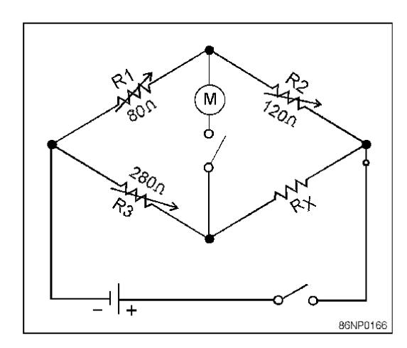

1-41. In the ac resistance bridge, what is the value of Rx?

- 1. 25 ohms
- 2. 250 ohms
- 3. 2,500 ohms
- 4. 25,000 ohms

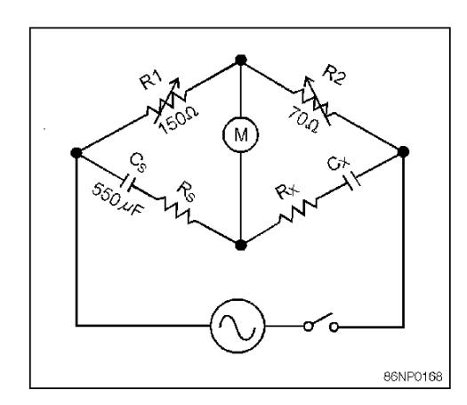

**Figure 1D.—Capacitance bridge.** 

IN ANSWERING QUESTION 1-42, REFER TO FIGURE 1D.

1-42. In the capacitance bridge, what is the value of Cx?

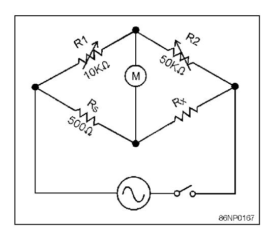

- 1. 25 microfarads
- 2. 117 microfarads
- 3. 256 microfarads
- 4. 1,178 microfarads

1-43. Dc power is stated in which of the following units?

- 1. Watts
- 2. Farads
- 3. Amperes
- 4. Henries

- 1-44. Power in an audio-frequency circuit is stated in which of the following units?
  - 1. Decibels (dB) only
  - 2. Decibels referenced to 1 milliwatt (dBm) only
  - 3. Both dB and dBm
- 4. Volt units (Vu) 1-45. The bel is a unit of measurement used with voltage, current, or power that compares which of the following circuit values?
  - 1. The input to the output
  - 2. The output to a reference
  - 3. The voltage to power
- 4. The current to power 1-46. What is the relationship between the values of the bel and the decibel?
  - 1. The bel is twice the decibel
  - 2. The decibel is twice the bel
  - 3. The bel is 1/10 the decibel
- 4. The decibel is 1/10 the bel 1-47. What is the corresponding increase in dBm each time power is doubled?
  - 1. +1 dB
  - 2. +2 dB
  - 3. +3 dB
  - 4. +10 dB 1-48. A thermocouple ammeter is used to measure which of the following quantities?
    - 1. Rf current
    - 2. Af current
    - 3. Motor current
  - 4. Generator current 1-49. A bolometer is a power meter that measures power in certain frequency ranges. Which of the following methods is/are used by the bolometer to measure power values?
    - 1. A barretter detects increases in power when its resistance increases
    - 2. A thermistor detects increases in power when its resistance decreases
    - 3. Both 1 and 2 above
    - 4. Power is measured directly

THIS SPACE LEFT BLANK INTENTIONALLY.

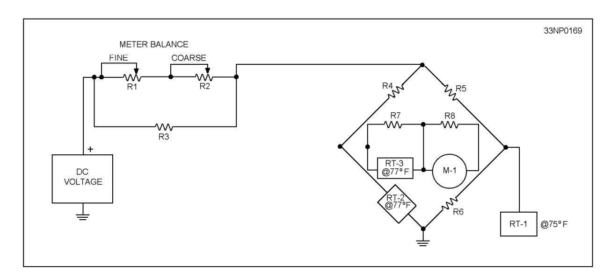

**Figure 1E.—Thermistor bridge.** 

- IN ANSWERING QUESTION 1-50, REFER TO FIGURE 1E. 1-50. In the thermistor bridge, what is the purpose of RT-1 and RT-3?
  - 1. To compensate for power used by RT-2
  - 2. To compensate for temperature changes outside the waveguide
  - 3. To control the amount of rf energy applied to RT-2
- 4. To control the temperature of the waveguide 1-51. To measure shaft rotation rate on an engine, you should use, which, if any, of the following instruments?
  - 1. An ammeter
  - 2. A bolometer
  - 3. A tachometer
- 4. None of the above 1-52. In the centrifugal tachometer, what component restricts the action on the lower collar that is produced by centrifugal force?
  - 1. The spring
  - 2. The pointer
  - 3. The upper collar
  - 4. The lower collar 1-53. What is the usual speed range (in feet per minute) of a chronometric tachometer?
    - 1. 0 to 30
    - 2. 0 to 300
    - 3. 0 to 3,000
    - 4. 0 to 30,000

- 1-54. You are measuring the speed of a fan blade by using a stroboscopic tachometer. Setting the flash at a rate 5 rpm SLOWER than the fan speed will cause the blades to appear to move (a) in what relative direction and (b) at what speed?
  - 1. (a) Forward (b) 5 rpm
  - 2. (a) Forward (b) 10 rpm
  - 3. (a) Backward (b) 10 rpm
- 4. (a) Backward (b) 5 rpm 1-55. The flashing rate of a strobotac is controlled by which of the following circuits?
  - 1. An electronic pulse generator
  - 2. A frequency divider
  - 3. A power supply
- 4. An amplifier 1-56. The flashing rate of the strobotron tube affects its life expectancy. What is the range (in hours) of life expectancy of the strobotron tube?
  - 1. 15 to 24
  - 2. 25 to 49
  - 3. 50 to 99
- 4. 100 to 250 1-57. The vibrating-reed frequency meter is a delicate instrument and should not be subjected to vibrations, such as those associated with motor-generators or their associated control panels.
  - 1. True
- 2. False 1-58. When using the vibrating-reed frequency meter, you take the reading in which of the following ways?
  - 1. Read the digital readout
  - 2. Read the dial indication
  - 3. Read the mechanical setting
- 4. Read the reed that vibrates the most 1-59. Bandpass filters and band reject filters are tuned circuits that either pass or reject specific frequencies. In these filters, (a) what type offers very high impedance to currents at its resonant frequency, and (b) what type offers a very low impedance to currents at its resonant frequency?
  - 1. (a) Parallel-tuned (b) series-tuned
  - 2. (a) Parallel-tuned (b) parallel-tuned
  - 3. (a) Series-tuned (b) parallel-tuned
  - 4. (a) Series-tuned (b) series-tuned 1-60. When you are zero beating an unknown frequency with a frequency provided by a calibrated, high-precision oscillator within a heterodyne frequency meter, what will be the indication when the two frequencies are matched?
    - 1. One dot of light on the screen will be superimposed on the other
    - 2. One vertical line on the screen will be superimposed on the other
    - 3. The two tones in the headset will achieve the same pitch, at which time a series of clicks will begin
  - 4. The tone in the headset will decrease in pitch and be replaced by clicks that will become slow or nonexistent THIS SPACE LEFT BLANK INTENTIONALLY.

**Figure 1F.—Absorption wavemeter circuit.** 

### IN ANSWERING QUESTION 1-61, REFER TO FIGURE 1F.

- 1-61. When you are using an absorption wavemeter to measure frequency, the greatest accuracy may be obtained by loosely coupling the pickup coil so that the indicator lamp burns (a) with what degree of brilliance (b) under what resonance condition?
  - 1. (a) Maximum brilliance
    - (b) when tuned to the resonant frequency
  - 2. (a) Maximum brilliance
    - (b) when not tuned to the resonant frequency
  - 3. (a) Dimly
    - (b) when not tuned to the resonant frequency
  - 4. (a) Dimly
- (b) when tuned to the resonant frequency 1-62. Which of the following instruments should be used to accurately measure a frequency in the shf range?
  - 1. Absorption wavemeter
  - 2. Resonant, cavity-type wavemeter
  - 3. Resonant, coaxial-line-type wavemeter
  - 4. Both 2 and 3 above

- 1-63. In a cavity wavemeter, moving the plunger farther into the cavity space causes which of the following changes to
  - (a) the cavity size and (b) the resonant frequency of the cavity?
  - 1. (a) Decrease (b) increase
  - 2. (a) Decrease (b) decrease
  - 3. (a) Increase (b) decrease
- 4. (a) Increase (b) increase 1-64. For which of the following purposes is a cathode-ray oscilloscope used?
  - 1. To measure microwave energy
  - 2. To visually analyze waveforms
  - 3. To provide frequency modulation
- 4. To locate stray radio interference 1-65. The synchroscope contains which of the following circuits?
  - 1. Retrace blanking circuit
  - 2. A wide band amplifier
  - 3. A trigger sweep
  - 4. All of the above

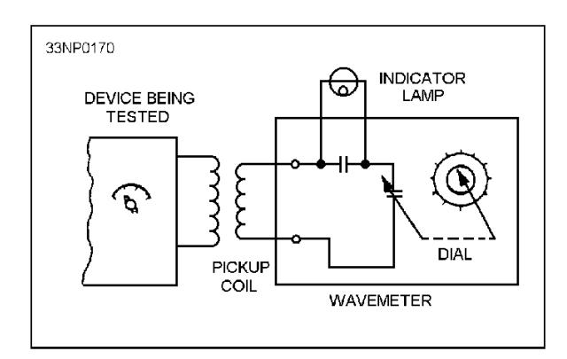

### THIS SPACE LEFT BLANK INTENTIONALLY.

- **Figure 1G.—Waveform display.**  WAVEFORM. 1-66. In the figure, (a) time is represented by what measurement, and (b) amplitude is represented by what measurement?
  - 1. (a) X (b) X
  - 2. (a) X (b) Y
  - 3. (a) Y (b) Y
- 4. (a) Y (b) X 1-67. An oscilloscope measures voltage and displays waveforms. It can be used to measure currents, temperatures, speeds, and accelerations if they are first converted to
  - 1. heat
  - 2. light
  - 3. voltages
- 4. pressures 1-68. The spectrum analyzer is used to display which of the following quantities?
  - 1. Amplitude within each frequency component in a circuit
  - 2. Proportions of power within each frequency component in the spectrum
  - 3. Frequencies produced in a circuit
  - 4. Each of the above 1-69. While testing a semiconductor diode, you determine that the forward resistance value is 60 ohms. You should consider the diode good if the backward resistance is at least which of the following values?
    - 1. 6 ohms
    - 2. 60 ohms
    - 3. 600 ohms
  - 4. 6,000 ohms 1-70. When you are using an oscilloscope to test a crystal diode, what is shown by (a) the vertical deflection and (b) the horizontal deflection?
    - 1. (a) Crystal current
      - (b) voltage applied to the diode
    - 2. (a) Crystal current
      - (b) power developed in the diode
    - 3. (a) Crystal voltage
      - (b) power developed in the diode
    - 4. (a) Crystal voltage
  - (b) voltage applied to the diode 1-71. When you are using the oscilloscope to test the Zener diode, what is represented by (a) vertical deflection and (b) horizontal deflection?
    - 1. (a) Zener current
      - (b) Zener power
    - 2. (a) Zener current
      - (b) applied voltage
    - 3. (a) Applied voltage
      - (b) Zener power
    - 4. (a) Applied voltage
      - (b) Zener current

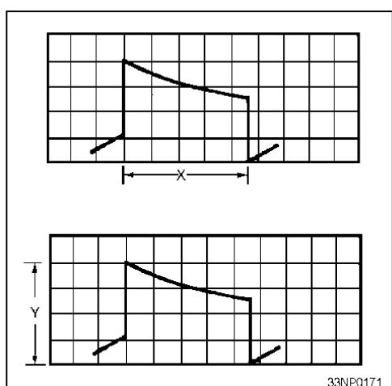

IN ANSWERING QUESTION 1-66, REFER TO FIGURE 1G. MEASUREMENT X REPRESENTS THE HORIZONTAL DISTANCE OF THE WAVEFORM; MEASUREMENT Y REPRESENTS THE VERTICAL DISTANCE OF THE

- 1-72. When troubleshooting transistorized circuits, you should first check the condition of which of the following circuits?
  - 1. Counters
  - 2. Amplifiers
  - 3. Oscillators
- 4. Power supplies 1-73. Which of the following instruments is used to check transistors for collector leakage current and current gain?
  - 1. Ohmmeter
  - 2. Voltmeter
  - 3. Wheatstone bridge
- 4. Semiconductor test set 1-74. When making base-to-emitter bias voltage checks on a transistor, you should read which of the following voltage ranges?
  - 1. 5 to 20 microvolts
  - 2. 50 to 200 millivolts
  - 3. 5 to 20 volts
  - 4. 50 to 200 volts 1-75. When making resistance measurements on a transistor with an ohmmeter, you should allow what maximum current in the transistor?
    - 1. milliampere
    - 2. milliampere
    - 3. microampere
    - 4. microampere

### **ASSIGNMENT 2**

Textbook assignment: Chapter 3, "Basic Meters," pages 3-1 through 3-34. Chapter 4, "Common Test Equipment," pages 4-1 through 4-10.

\_\_\_\_\_\_\_\_\_\_\_\_\_\_\_\_\_\_\_\_\_\_\_\_\_\_\_\_\_\_\_\_\_\_\_\_\_\_\_\_\_\_\_\_\_\_\_\_\_\_\_\_\_\_\_\_\_\_\_\_\_\_\_\_\_\_\_\_\_\_\_\_\_\_\_\_\_\_\_\_\_\_\_

- 2-1. What are the two basic components of a galvanometer?
  - 1. A movable permanent magnet and a movable coil
  - 2. A stationary permanent magnet and a stationary coil
  - 3. A stationary permanent magnet and a movable coil
- 4. A stationary coil and a movable coil 2-2. The coil in a galvanometer rotates to allow measurement of current. Which of the following actions causes this reaction?
  - 1. Current flowing in opposite directions through two coils
  - 2. Tension of the hairspring and the magnetism produced by the permanent magnet
  - 3. Magnetism produced by current flowing in the movable coil and the tension of the hairspring
- 4. Magnetism of the permanent magnet and magnetism produced by current in the movable coil 2-3. In a galvanometer, the phosphor bronze ribbon serves which of the following functions?
  - 1. Provides a conduction path from the circuit being tested to the coil
  - 2. Restores the coil to its original position
  - 3. Allows the coil to twist
- 4. Each of the above 2-4. In galvanometers, which of the following components is/are used to indicate the value of the current being measured?
  - 1. Pointer
  - 2. Light and mirror
  - 3. Both 1 and 2 above
  - 4. Digital readout 2-5. The phosphor bronze ribbon in the galvanometer serves the same purpose as what component in the D'Arsonval meter?
    - 1. Hairspring
    - 2. Movable coil
    - 3. Fixed iron core
  - 4. Permanent magnet 2-6. The direction in which the D'Arsonval meter pointer deflects depends on what characteristic of the current applied to the coil?
    - 1. Phase
    - 2. Polarity
    - 3. Frequency
  - 4. Amplitude 2-7. The D'Arsonval meter movement is damped to prevent which of the following conditions?
    - 1. Oscillating readings
    - 2. Inconsistent readings
    - 3. Consistently low readings
    - 4. Consistently high readings

- 2-8. The weight of the rotating coil assembly and the type of bearings used in the D'Arsonval meter are factors that affect which of the following characteristics of the meter?
  - 1. The accuracy and the linearity of the meter scales
  - 2. The amount of restraining force required of the hairspring
  - 3. The maximum current that can be measured
- 4. The sensitivity 2-9. For a meter to read linearly, its face is divided into equal segments. What meter feature makes this possible?
  - 1. The curved poles of the permanent magnet
  - 2. The jeweled bearings in the meter movement
  - 3. An additional coil placed in the meter circuit
- 4. A long, lightweight meter pointer 2-10. What is the purpose of a shunt in a dc ammeter?
  - 1. To decrease the sensitivity of the meter
  - 2. To increase the linearity of the meter movement
  - 3. To increase the current range of the meter
- 4. To decrease meter damping 2-11. A particular D'Arsonval meter has a fullscale current reading of 1 milliampere. A full-scale reading of 100 milliamperes may be achieved by using which of the following components?
  - 1. A low-value resistance placed in series with the meter terminals
  - 2. A high-value resistance placed in series with the meter terminals
  - 3. A movable coil composed of largediameter wire
- 4. A resistance of proper value placed in parallel with the meter terminals 2-12. To measure 10 milliamperes on a 1 milliampere D'Arsonval meter movement, a shunt resistance is added that will carry 9 milliamperes. What maximum value of current will pass through the meter movement?
  - 1. 1 milliampere
  - 2. 3 milliamperes
  - 3. 6 milliamperes
  - 4. 9 milliamperes 2-13. In a meter movement, shunt strips with a zero temperature coefficient are used instead of regular carbon resistance for which of the following reasons?
    - 1. Because regular carbon resistances cause interfering magnetic fields
    - 2. Because regular carbon resistances are too large to be used
    - 3. Because regular carbon resistances are not able to handle the current changes
  - 4. Because regular carbon resistances are affected by heat due to current and cause readings to vary 2-14. One consideration in choosing the value of a meter shunt resistance is that the meter readings should be in the midscale range. Which of the following factors is another consideration?
    - 1. Meter switching is easier for midscale deflection
    - 2. Meter shielding against magnetic interference is greatest near midscale
    - 3. Minimum loading effect will be experienced near midscale
  - 4. The meter is protected from unexpected surge currents 2-15. For which of the following current ranges would you likely use a meter that contains internal shunt?
    - 1. 1 to 10 amperes
    - 2. 11 to 30 amperes
    - 3. 31 to 50 amperes
    - 4. All of the above

**Figure 2A.—Shunt ammeter.** 

IN ANSWERING QUESTIONS 2-16 THROUGH 2-19, REFER TO FIGURE 2A. THE METER IN THE CIRCUIT IS DESIGNED FOR MAXIMUM OF .001 AMPERE AND HAS AN INTERNAL RESISTANCE OF 10 OHMS. YOU ARE FIGURING THE SHUNT RESISTANCE NECESSARY TO MEASURE 5 AMPERES.

2-16. What is the voltage drop across the meter

coil?

- 1. .01 volt
- 2. .005 volt
- 3. .0001 volt
- 4. .0005 volt

2-17. What is the voltage drop across the shunt

resistance?

- 1. .01 volt
- 2. .005 volt
- 3. .0001 volt
- 4. .0005 volt

2-18. When the meter is deflected full scale

and is measuring 5 amperes, what is the maximum value of current flow through

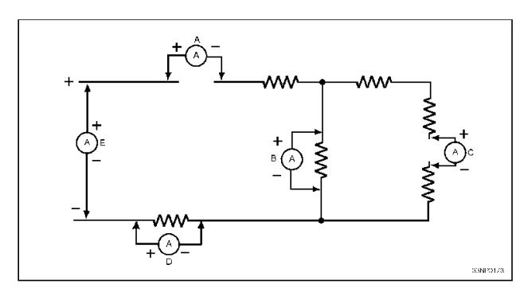

the shunt resistance?

1. 0.010 ampere 2. 0.490 ampere 3. 4.999 ampere 4. 5 amperes

- 2-19. What is the approximate value of the shunt resistance?
  - 1. .001 ohm
  - 2. .002 ohm
  - 3. .003 ohm
  - 4. .004 ohm current meters are less satisfactory than other methods of range switching for which of the following reasons?
  - 1. Meter damage can occur when line current momentarily flows through the meter
  - 2. Resistance in the contacts may cause inaccurate readings
  - 3. Both 1 and 2 above
  - 4. Resistor damage may occur

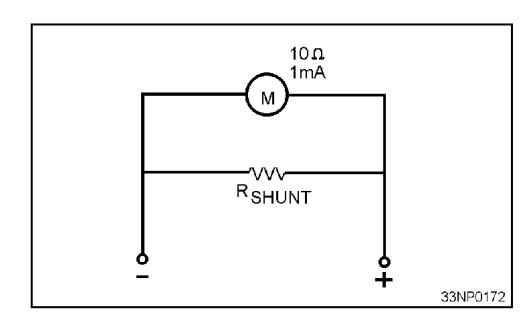

2-20. Simple range-switching arrangements for

**Figure 2B.—Ammeter connections.** 

### IN ANSWERING QUESTION 2-21, REFER TO FIGURE 2B.

- 2-21. In the figure, five ammeters are connected to the circuit resistors. Of those five, which one(s) is/are connected correctly?
  - 1. E only
  - 2. A and E
  - 3. A and C
  - 4. A, B, and D

- 2-22. What will be the probable result of connecting an ammeter (or milliammeter) in PARALLEL with a source of voltage or a circuit component?
  - 1. A burned-out meter that will provide no useful readings
  - 2. A higher than normal meter reading
  - 3. A lower than normal meter reading
- 4. A normal meter reading **Figure 2C.—Series-parallel circuit.**  IN ANSWERING QUESTIONS 2-23 AND 2-24, REFER TO FIGURE 2C. 2-23. To measure total circuit current, you should break the circuit to connect an ammeter at which of the following points?
  - 1. A only
  - 2. B or C
  - 3. C, D, or E
- 4. A, B, or F 2-24. To measure the current flow through resistor R2 only, you should break which of the following points to connect the ammeter?
  - 1. A
  - 2. B
  - 3. C
- 4. F 2-25. Meter sensitivity is determined by the amount of current required by the ammeter coil to provide full-scale deflection of the pointer. An ammeter coil requiring which of the following current values provides the greatest sensitivity?
  - 1. 1 milliampere
  - 2. 10 milliamperes
  - 3. 100 microamperes
  - 4. 500 microamperes 2-26. Circuits in which low-sensitivity ammeters are used are said to be "loaded." Which of the following statements describes the cause of circuit loading?
    - 1. The ammeter circuit draws NO current from the circuit being tested
    - 2. The ammeter circuit draws MINIMUM current from the circuit being tested
    - 3. The ammeter circuit draws EXCESSIVE current from the circuit being tested
  - 4. The ammeter circuit INDUCES current into the circuit being tested 2-27. In which of the following electronic circuits does the use of a meter with low sensitivity have the greatest loading effect?
    - 1. High-power circuits
    - 2. Low-current circuits
    - 3. High-current circuits
    - 4. High-voltage circuits

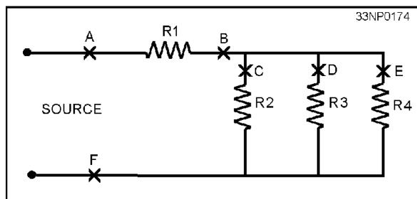

- 2-28. A basic D'Arsonval meter is used to measure voltage by connecting its meter coil to (a) what type of component in (b) what circuit arrangement?
  - 1. (a) Multiplier resistor
    - (b) series
  - 2. (a) Multiplier resistor
    - (b) parallel
  - 3. (a) Capacitor
    - (b) parallel
  - 4. (a) Capacitor
- (b) series 2-29. In a voltmeter, the D'Arsonval meter movement is caused to move by what electrical action?
  - 1. Power
  - 2. Voltage
  - 3. Current
- 4. Conductance 2-30. In a voltmeter, the meter scale is calibrated in which of the following categories?
  - 1. Power
  - 2. Voltage
  - 3. Current
- 4. Conductance 2-31. To figure the total value of series resistance needed to extend the range of a voltmeter, you need to know the value of current to cause full-scale deflection of the meter and what other value?
  - 1. Minimum applied voltage
  - 2. Maximum applied voltage
  - 3. Maximum applied current
- 4. Minimum applied current 2-32. Your voltmeter has four ranges: 1V, 10V, 100V, and 1,000V. To measure an unknown voltage in an amplifier, you should first select what range?
  - 1. 1 V
  - 2. 10 V
  - 3. 100 V
  - 4. 1,000 V 2-33. Which of the following types of circuits are most affected by the loading effect of voltmeters?
    - 1. Low-voltage
    - 2. Low-resistance
    - 3. High-resistance
  - 4. High-current 2-34. A voltmeter with a 10-microampere meter movement has a sensitivity of how many maximum ohms per volt?
    - 1. 1,000
    - 2. 10,000
    - 3. 100,000
  - 4. 1,000,000 2-35. A megger is widely used for which of the following purposes?
    - 1. To make voltage checks
    - 2. To make continuity checks
    - 3. To measure insulation resistance
  - 4. To measure resistance of components 2-36. Before you can take an accurate resistance measurement with an ohmmeter, what meter adjustment must you complete?
    - 1. Zero voltage
    - 2. Zero resistance
    - 3. Maximum voltage
    - 4. Maximum resistance

- 2-37. When the leads of an ohmmeter are placed across a resistor, that resistor adds to the internal series coil resistance of the meter. The pointer is deflected to the left of its full-scale position, giving a reading in ohms for the resistor being tested. Which of the following reasons explains why the pointer moves to less than fullscale?
  - 1. Because voltage in the meter circuit is greater than full-scale voltage
  - 2. Because current in the meter circuit is greater than full-scale current
  - 3. Because current in the meter circuit is less than full-scale current
- 4. Because voltage in the meter circuit is less than full-scale current 2-38. With the ohmmeter range switch set at R X 100, the pointer of the meter indicates
  - 850. What is the actual value of the resistor?
  - 1. 8.5 kilohms
  - 2. 85 kilohms
  - 3. 850 kilohms
- 4. 8.5 megohms RANGE SCALE RESISTOR VALUE
- A. R×1 50 kilohms
- B. R×10 500 kilohms
- C. R×100 5 megohms **Figure 2D.—Range scales and resistance values.**  IN ANSWERING QUESTION 2-39, REFER TO FIGURE 2D. 2-39. You are measuring resistors using range settings as shown in the figure. What condition listed in the figure, if any, will cause the greatest amount of current to move through the ohmmeter coil circuit?
  - 1. A
  - 2. B
  - 3. C
  - 4. None; they all allow the same amount of current 2-40. Which of the following locations on the meter scale provides the most accurate reading for resistance?
    - 1. To the far left side of the scale
    - 2. To the far right side of the scale
    - 3. Halfway between the left side and center of the scale
  - 4. Near the center of the scale 2-41. An ordinary ohmmeter is unsuitable for measuring insulation resistance for which of the following reasons?
    - 1. Voltage is present in the conductors attached to the insulating materials being measured
    - 2. Insulation resistance values are too great for an ohmmeter to measure
    - 3. Ohmmeter current will damage insulation material
    - 4. The accuracy of an ohmmeter is too low to measure insulation resistance

| RANGE SCALE |       | RESISTOR VALUE |
|-------------|-------|----------------|
| A.          | R×1   | 50 kilohms     |
| B.          | R×10  | 500 kilohms    |
| C.          | R×100 | 5 megohms      |

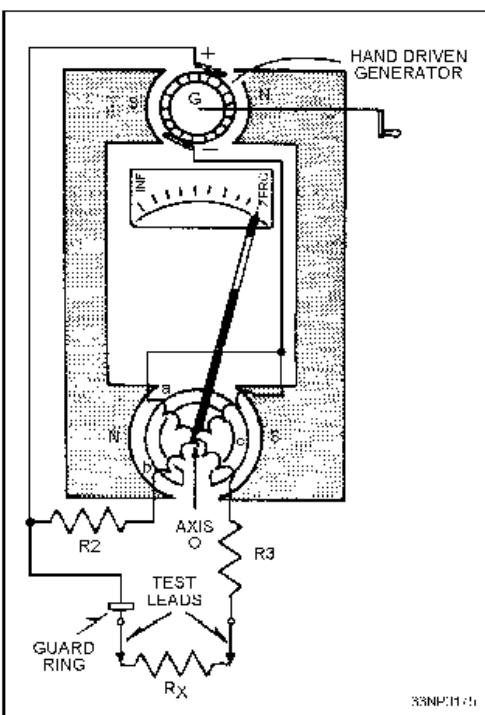

- **Figure 2E.—Megger circuit.**  TO FIGURE 2E. 2-42. In the megger circuit, what component prevents leakage current from affecting ohmmeter measurements?
  - 1. Guard ring
  - 2. Generator
  - 3. Resistor R3
- 4. Coil 2-43. When a megger is used to measure an unknown resistance, what circuit action causes the pointer to come to rest at the correct resistance value?
  - 1. The current flow in coil A
  - 2. The current flow in coil B
  - 3. The interaction between the currents in coils A and B
- 4. The interaction between the restraining springs of the meter and the current in coil A 2-44. A megger uses high voltage to check the insulation leakage in the megohm range. What is the source of this voltage?
  - 1. Batteries
  - 2. The ship's ac power
  - 3. The ship's dc power
  - 4. A hand-driven dc generator 2-45. Meggers with which of the following maximum voltage ratings are commonly found in the fleet?
    - 1. 500 volts
    - 2. 700 volts
    - 3. 1,000 volts
  - 4. 2,500 volts 2-46. When a megger is used to measure the resistance of an electrical cable, what does a reading of infinity indicate?
    - 1. The meter is faulty
    - 2. The cable is shorted
    - 3. The cable is grounded
  - 4. The resistance is too large to measure 2-47. A megger is prevented from exceeding its rated output voltage by which of the following actions?
    - 1. Battery discharge limits the voltage
    - 2. Tension in the cable
    - 3. Friction clutch slippage
  - 4. Current leaks through internal insulation 2-48. When the crank of a 500-volt megger is rotated faster than its designed rate, what maximum output voltage does it produce?
    - 1. 100 volts
    - 2. 500 volts
    - 3. 520 volts
    - 4. 550 volts

# IN ANSWERING QUESTION 2-42, REFER

- 2-49. The galvanometer-type meter movement differs from the electrodynamometer meter movement in that the electrodynamometer type uses which of the following components to produce the magnetic field?
  - 1. Two sets of coils
  - 2. Two permanent magnets
  - 3. One fixed and one movable coil
- 4. One movable coil and one permanent magnet 2-50. The fixed coils in the electrodynamometer-type movement are wound with heavy wire to enable the instrument to measure which of the following values?
  - 1. Rf currents
  - 2. High voltage
  - 3. Large currents
- 4. High resistance 2-51. An advantage that the electrodynamometer has over the standard galvanometer in measuring ac is that the electrodynamometer requires
  - 1. no rectifying device
  - 2. a less complicated rectifying device
  - 3. less current to obtain a full-scale deflection
- 4. fewer multiplier resistors to cover the measurement range THIS SPACE LEFT BLANK INTENTIONALLY. 2-52. When power is being measured with a wattmeter, why is it important to strictly observe the safe rating limits for current and voltage?
  - 1. Because the meter pointer will likely hit against the upper limit of the dial and be damaged
  - 2. Because the pointer does not give an indication to alert the user when the internal coils are overloaded
  - 3. Because a false reading may be obtained
  - 4. Because the meter pointer will likely hit against the lower limit of the dial and be damaged 2-53. The reading of a wattmeter is dependent upon which of the following circuit characteristics?
    - 1. Current
    - 2. Voltage
    - 3. Power factor
  - 4. All of the above 2-54. A continuity test is performed on a piece of electronic equipment to discover what kind of fault?
    - 1. High voltage
    - 2. Low voltage
    - 3. Open circuits
  - 4. Changes in component values 2-55. Which of the following meters is recommended for circuit continuity tests?
    - 1. A megger
    - 2. An ammeter
    - 3. A voltmeter
    - 4. An ohmmeter

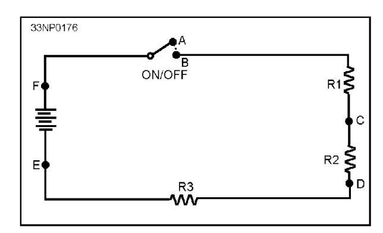

2-56. When preparing to use an ohmmeter to

test a circuit for grounds, you should first take which of the following actions?

1. Energize the circuit

2. Disconnect all intentional grounds 3. Measure the circuit voltage at the

power source

4. Connect all intentional grounds

2-57. When preparing to use a voltmeter to

measure voltage in a circuit, you should first take which of the following actions?

1. Set the meter to the lowest voltage

range

2. Remove the suspected component

from the circuit

3. Check the voltage from the power source to ensure it is correct 4. Check the current flow through the

circuit with an ammeter

2-58. It is important to set a voltmeter on its highest range scale before taking a measurement for which of the following

reasons?

1. To protect the meter from damage 2. To decrease the effects of input

impedance

3. To increase the sensitivity of the

measurement

4. To protect the equipment being tested from damage

### THIS SPACE LEFT BLANK INTENTIONALLY.

2-59. An accurate measurement of a particular resistor in a set of parallel resistors may be obtained by performing which of the

following procedural steps?

1. Connecting the ohmmeter leads across the resistor while in place 2. Disconnecting the resistor from the set before taking the measurement 3. Grounding the resistance set before

taking the measurement 4. Using the highest ohmmeter range

**Figure 2F.—Circuit.** 

IN ANSWERING QUESTION 2-60, REFER TO FIGURE 2F.

- 2-60. To measure R2 with an ohmmeter, (a) in what position should the ON/OFF switch be placed, and (b) where should the test probes be placed?
  - 1. (a) Off (b) at B and C
  - 2. (a) Off (b) at C and D
  - 3. (a) On (b) at C and D
- 4. (a) On (b) at B and C 2-61. In what arrangement is an ammeter connected to a circuit?
  - 1. In series
  - 2. In parallel
  - 3. In a series-parallel combination
  - 4. In a parallel-series combination

- 2-62. When you are measuring voltage using a voltmeter, where should you stand to view the meter reading?
  - 1. To the right of the meter only
  - 2. To the left of the meter only
  - 3. To the right or left of the meter, depending on your handedness
- 4. Directly in front of the meter 2-63. A multimeter is used to measure which of the following electrical properties?
  - 1. Voltage
  - 2. Current
  - 3. Resistance
- 4. Each of the above 2-64. Which of the following characteristics is an advantage of a volt-ohm meter?
  - 1. It replaces three separate meters
  - 2. There are no calibrations to be made
  - 3. It is the most accurate meter available
- 4. It cannot be damaged 2-66. On an ohmmeter, which of the following switches allows selection of ac or dc readings?
  - 1. ZERO-OHMS
  - 2. FUNCTION
  - 3. RANGE
  - 4. RESET 2-67. Which of the following actions MUST be taken before resistance measurements are made in a circuit?
    - 1. All semiconductor devices must be removed from the circuit
    - 2. Expected measurements must be recorded
    - 3. The circuit must be completely deenergized
  - 4. The high range of the ohmmeter must be selected 2-68. The power required to operate a basic ohmmeter comes from which of the following sources?

- A. SELECT RANGE SCALE
- B. SHORT ENDS OF PROBES TOGETHER
- C. ZERO THE METER USING THE ZERO ADJUST CONTROL

**Figure 2G.—Zeroadjust steps.** 

### IN ANSWERING QUESTION 2-65, REFER TO FIGURE 2G.

- 2-65. Before you measure resistance, it is important that you calibrate (zero) the ohmmeter. In what order should the actions in the figure be performed?
  - 1. A, B, and C
  - 2. B, C, and A
  - 3. C, B, and A
  - 4. B, A, and C

1. Batteries

2. An ac power supply 3. Both 1 and 2 above 4. A hand crank

THIS SPACE LEFT BLANK INTENTIONALLY.

- POINTER LOCATION
- 1. EXTREME RIGHT
- 2. EXTREME LEFT
- 3. MIDSCALE **Figure 2H.—Ohmeter pointer location**  IN ANSWERING QUESTIONS 2-69 THROUGH 2-72, REFER TO FIGURE 2H AND SELECT THE OHMMETER POINTER LOCATION THAT RESULTS FROM THE CONDITION GIVEN. 2-69. Both test leads are touching the metal chassis of a piece of equipment. 2-70. The test leads are shorted together. 2-71. The test leads are separated from each other and not touching anything else. 2-72. An accurate resistance reading is being made. 2-73. The function of the ZERO OHM control on a multimeter is to compensate for which of the following conditions?
  - 1. Meter battery aging
  - 2. Large values of resistance in the circuit to be measured
  - 3. Inter-electrode capacitance in the circuit to be measured
- 4. Stray voltages in the circuit under test 2-74. When using a multimeter to measure an output voltage, you should ensure that the dc voltage component does not exceed what maximum voltage?
  - 1. 100 volts
  - 2. 200 volts
  - 3. 300 volts
  - 4. 400 volts 2-75. When measuring unknown currents, you should determine the range scale that is appropriate in what way?
    - 1. Start with the expected scale
    - 2. Start with the lowest scale and work up
    - 3. Start with the highest scale and work down
    - 4. Use the highest scale only

### **ASSIGNMENT 3**

Textbook assignment: Chapter 4, "Common Test Equipment," pages 4-11 through 4-28. Chapter 5, "Special Application Test Equipment," pages 5-1 through 5-40. Chapter 6, "The Oscilloscope and Spectrum Analyzer," pages 6-1 through 6-46.

\_\_\_\_\_\_\_\_\_\_\_\_\_\_\_\_\_\_\_\_\_\_\_\_\_\_\_\_\_\_\_\_\_\_\_\_\_\_\_\_\_\_\_\_\_\_\_\_\_\_\_\_\_\_\_\_\_\_\_\_\_\_\_\_\_\_\_\_\_\_\_\_\_\_\_\_\_\_\_\_\_\_\_

- 3-1. Compared to the VOM, the electronic digital multimeter has which of the following advantages?
  - 1. It has higher input impedance
  - 2. It can be read directly without using a scale
  - 3. It has little or no loading effect on the circuit under test
- 4. All of the above 3-2. Digital multimeters can be divided into three functional sections: (1) signal conditioning, (2) analog-to-digital, and what third section?
  - 1. Display
  - 2. Amplifier
  - 3. Oscillator
- 4. Power supply 3-3. What section in the electronic multimeter decodes the digital (binary) information from the a/d converter section?
  - 1. Display
  - 2. Analog ic
  - 3. Digital ic
- 4. Signal conditioning 3-4. The ac/dc differential voltmeter is capable of performing which of the following functions?
  - 1. Voltage readings as an electronic voltmeter
  - 2. Voltage readings as a precision potentiometer
  - 3. Voltage variation readings about some known value
- 4. Each of the above 3-5. In a differential voltmeter, an adjustable reference voltage can be produced in increments as small as how many microvolts?
  - 1. 1
  - 2. 2
  - 3. 5
  - 4. 10 3-6. When you are taking ac or dc voltage readings, the differential voltmeter will not load the circuit under test.
    - 1. True
  - 2. False 3-7. Which of the following transistor parameters are measured with the transistor tester?
    - 1. Collector leakage and cutoff current
    - 2. Collector leakage and maximum power dissipation
    - 3. Collector leakage and current gain
  - 4. Emitter leakage and power gain 3-8. When you are disconnecting a transistor from the transistor tester, in what position should the POLARITY switch be placed?
    - 1. ON
    - 2. OFF
    - 3. PNP
    - 4. NPN

- 3-9. When you are testing a transistor with a transistor tester, for the reading to have ±15 percent accuracy, the resistance from emitter to base must be what minimum value?
  - 1. 100 ohms
  - 2. 200 ohms
  - 3. 300 ohms
- 4. 50 ohms 3-10. When you are testing an in-circuit diode with the transistor tester, the meter pointer deflects below the midscale point. What does this indicate?
  - 1. The diode is normal
  - 2. The diode is faulty
  - 3. The circuit impedance is 8 ohms
- 4. The POLARITY switch is in the PNP position 3-11. The RCL bridge measures an unknown resistance by balancing the resistance value of the unknown component with that of known components inside the test set. What type of circuit is used in this method of measurement?
  - 1. O'Neill bridge
  - 2. Wheatstone bridge
  - 3. Colpitts oscillator
- 4. D'Arsonval movement 3-12. The RCL bridge is used to measure which of the following quantities?
  - 1. Resistance, capacitance, and inductance
  - 2. Capacitor quality
  - 3. The turns ratio of transformers
- 4. Each of the above 3-13. To make an inductance measurement on the model 250DE, you must first adjust the DET GAIN control to what position?
  - 1. 1
  - 2. 2
  - 3. 3
- 4. 4 3-14. The direct-measuring power meter is used for which of the following types of measurements?
  - 1. Incident power
  - 2. Reflected power
  - 3. Both 1 and 2 above
  - 4. Average power 3-15. When you are selecting forward or reverse power measurements, what component(s) of the rf wattmeter is/are restricted to a 180°; rotation range?
    - 1. The coupler-detector
    - 2. The POWER RANGE knob
    - 3. The u-type connector
  - 4. Both 2 and 3 above 3-16. Of the following available rf wattmeter power ranges, which one should you select when measuring an unknown power?
    - 1. 10 watts
    - 2. 100 watts
    - 3. 500 watts
  - 4. 1000 watts THIS SPACE LEFT BLANK INTENTIONALLY.

\_\_\_\_\_\_\_\_\_\_\_\_\_\_\_\_\_\_\_\_\_\_\_\_\_\_\_\_\_\_\_\_\_\_\_\_\_\_\_

### IN ANSWERING QUESTIONS 3-17 AND 3-18, ASSUME THAT YOU HAVE OBTAINED THE FOLLOWING RF POWER MEASUREMENTS:

— INCIDENT POWER, 144 WATTS — REFLECTED POWER, 1 WATT

\_\_\_\_\_\_\_\_\_\_\_\_\_\_\_\_\_\_\_\_\_\_\_\_\_\_\_\_\_\_\_\_\_\_\_\_\_\_\_

3-17. What is the approximate standing wave

ratio?

1. .85 to 1 2. 1 to 1 3. .08 to 1 4. 1.2 to 1

3-18. What total amount of power is absorbed

by the load?

1. 1 watt 2. 13 watts 3. 143 watts 4. 173 watts

3-19. To take power readings, you connect an in-line rf power meter in what

configuration in the transmission line?

1. Series 2. Parallel 3. Series-parallel 4. Horizontal

3-20. Which of the following test instruments produces a standard of measurement of

ac energy for testing electronics

equipment?

1. Power meter 2. Oscilloscope 3. Signal generator 4. Frequency counter

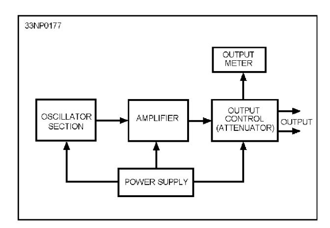

- 3-21. Signal generators are equipped with attenuators for which of the following purposes?
  - 1. To regulate the output frequency
  - 2. To regulate the output signal level
  - 3. To determine the modulating frequency
- 4. To set the level of internal modulation 3-22. Which of the following signal generators should you select to test audio equipment?
  - 1. Af signal generator
  - 2. Fm signal generator
  - 3. Rf signal generator
  - 4. Video signal generator

**Figure 3A.—Af signal generator block diagram.** 

### IN ANSWERING QUESTION 3-23, REFER TO FIGURE 3A.

- 3-23. What section of the signal generator regulates the output to the equipment under test?
  - 1. The amplifier
  - 2. The attenuator
  - 3. The oscillator
  - 4. The output meter

- 3-24. Typical rf signal generators use which of the following methods for modulation?
  - 1. Internal modulation
  - 2. External modulation
  - 3. Both 1 and 2 above
- 4. Power supply modulation 3-25. The modulating circuit in an rf signal generator serves which of the following purposes?
  - 1. It produces an fm signal that can be superimposed on the rf signal
  - 2. It produces a video signal that can be superimposed on the rf signal
  - 3. It produces an audio signal that can be superimposed on the rf signal
- 4. Both 2 and 3 above 3-26. The output level meter of a signal generator reads 0. 10 with the attenuator set to 080. 0. What is the actual output in microvolts?
  - 1. 00.08
  - 2. 00.80
  - 3. 08.00
- 4. 80.00 3-27. Frequency counters serve which of the following purposes?
  - 1. Measure voltage in a circuit
  - 2. Measure frequencies in a circuit
  - 3. Produce voltages to test a circuit
- 4. Produce frequencies to power a circuit 3-28. In which of the following ways is a logic probe useful to a technician?
  - 1. It detects steady logic levels
  - 2. It detects a train of logic levels
  - 3. Both 1 and 2 above
- 4. It displays the shape of high-speed transients 3-29. In logic probes, which of the following devices is used as an indicator?
  - 1. A dial
  - 2. An LED
  - 3. A scale
  - 4. A pointer 3-30. The Tracker 2000 is used to isolate defective components on de-energized circuits only.
    - 1. True
  - 2. False 3-31. The VERT control adjustment controls what position of the signal on the CRT display?
    - 1. Horizontal
    - 2. Vertical
    - 3. Trace rotation left
  - 4. Trace rotation right 3-32. The axes of the CRT display on the Tracker 2000 are divided into what number of quadrants?
    - 1. 1
    - 2. 2
    - 3. 3
  - 4. 4 3-33. Quadrant 2 on the Tracker 2000 CRT is used to display what signal information?
    - 1. Positive voltage negative current
    - 2. Positive voltage and positive current
    - 3. Negative voltage and negative current
  - 4. Negative voltage and positive current 3-34. When you are adjusting the level control on the Tracker 2000, the peak of each pulse will be from 0 volts to what maximum voltage level?
    - 1. 1
    - 2. 5
    - 3. 3
    - 4. 9

- 3-35. The medium 1 range on the Tracker 2000 is designed to test resistance values between what (a) minimum and (b) maximum values?
  - 1. (a) 5 ohms (b) 1 kilohm
  - 2. (a) 50 ohms (b) 10 kilohms
  - 3. (a) 500 ohms (b) 100 kilohms
- 4. (a) 50 kilohms (b) 10 megohms 3-36. What is the principal use of the oscilloscope?
  - 1. To measure microwave energy
  - 2. To visually examine waveforms
  - 3. To measure in-line power supply currents
- 4. To locate sources of radio interference 3-37. Cathode-ray tubes used in oscilloscopes contain which of the following components?
  - 1. An electron gun
  - 2. A deflection system
  - 3. A fluorescent screen
- 4. All of the above 3-38. In a basic oscilloscope, what is the purpose of the deflection system?
  - 1. To filter harmonic frequencies
  - 2. To deflect harmonic frequencies
  - 3. To position the beam on the screen
- 4. To deflect synchronous side effects 3-39. If the electron beam is left in one position on the CRT for long periods, damage is likely to occur to what component(s)?
  - 1. Illuminating coating
  - 2. Deflection plates
  - 3. Signal generator
- 4. Electron gun 3-40. Of the following factors, which one(s) control(s) the angle of deflection of the electron beam in the CRT?
  - 1. Difference of potential between plates
  - 2. Length of deflection field
  - 3. Beam acceleration
  - 4. All of the above 3-41. In an oscilloscope, which of the following waveform characteristics are represented by (a) vertical deflection and
    - (b) horizontal deflection?
    - 1. (a) Amplitude (b) frequency
    - 2. (a) Power (b) amplitude
    - 3. (a) Power (b) frequency
  - 4. (a) Time (b) amplitude 3-42. In oscilloscopes using electrostatic CRTs, what type of signal is used to produce horizontal beam movement?
    - 1. Dc
    - 2. Sine wave
    - 3. Square wave
  - 4. Sawtooth wave 3-43. The length of time the phosphor coating on the CRT remains bright after the electron beam is removed depends on which of the following characteristics?
    - 1. Persistence of the coating
    - 2. Amplitude of the applied signal
    - 3. Frequency of the applied signal
  - 4. Synchronization frequency of the oscilloscope 3-44. An oscilloscope that can display two vertical input signals at the same time is said to be what type?
    - 1. Two-function
    - 2. Dual-trace
    - 3. Single-function
    - 4. Single-trace

- 3-45. The FOCUS control on the front of an oscilloscope is used to adjust what characteristic on the CRT display?
  - 1. Beam size
  - 2. Beam location
  - 3. Trace position
- 4. Beam brilliance **Figure 3B.—CRT traces.**  IN ANSWERING QUESTIONS 3-46 THROUGH 3-48, REFER TO FIGURE 3B. 3-46. What trace in the figure should you correct by adjusting ONLY the HORIZONTAL POSITION control?
  - 1. A
  - 2. B
  - 3. C
- 4. D 3-47. What trace in the figure should you correct by adjusting ONLY the VERTICAL POSITION control?
  - 1. A
  - 2. B
  - 3. C
- 4. D 3-48. In the figure, what trace would be corrected by adjusting both the HORIZONTAL POSITION and VERTICAL POSITION controls?
  - 1. A
  - 2. B
  - 3. C
- 4. D 3-49. What is the purpose of the deflection amplifiers in a cathode-ray oscilloscope?
  - 1. To isolate the input signal from the vertical deflection plates
  - 2. To increase the amplitude of the signal applied to the vertical deflection plates
  - 3. To eliminate distortion of the CRT beam
  - 4. To position the beam on the CRT 3-50. What control on the front panel of an oscilloscope limits the input signal amplitude and allows the oscilloscope to be used with a wide range of signals?
    - 1. TIME/CM
    - 2. TIME BASE
    - 3. ATTENUATOR
  - 4. TRIGGER 3-51. What is the purpose of a variable potentiometer mounted on the VOLTS/DIV control of an oscilloscope?
    - 1. To provide definite step control of the input signal
    - 2. To provide fine control of the input signal
    - 3. To provide fine control of the output signal
  - 4. To provide definite step control of the output signal 3-52. The time base of an oscilloscope is variable to enable the instrument to
    - 1. measure low- and high-amplitude signal voltages
    - 2. operate over a wide range of input frequencies
    - 3. make accurate measurements of signal amplitudes
    - 4. accurately position the presentation on the CRT

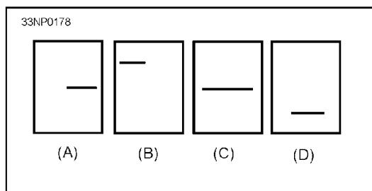

- 3-53. The triggered oscilloscope has which of the following advantages over a basic oscilloscope?
  - 1. Better low-voltage input- handling capability
  - 2. Lower distortion of input signal
  - 3. Both 1 and 2 above
- 4. Improved presentation stability 3-54. The TRIGGER and LEVEL controls are used to synchronize the sweep generator with what signal?
  - 1. Input
  - 2. Output
  - 3. Vertical deflection rate
- 4. Horizontal deflection rate 3-55. The setting of what control establishes the amplitude point of the input waveform at which the displayed sweep will begin?
  - 1. TRIGGER LEVEL
  - 2. TRIGGER SLOPE
  - 3. AMPLITUDE
  - 4. A delayed by B

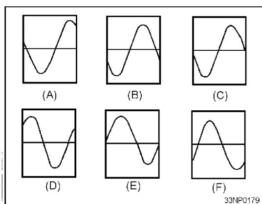

**Figure 3C.—Oscilloscope displays.** 

IN ANSWERING QUESTIONS 3-56 THROUGH 3-60, REFER TO FIGURE 3C. SELECT THE OSCILLOSCOPE DISPLAY THAT CORRESPONDS TO THE SETTING OF THE TRIGGER LEVEL AND SLOPE CONTROLS IN THE QUESTIONS.

- 3-56. TRIGGER LEVEL set to zero; SLOPE set to negative.
  - 1. A
  - 2. C
  - 3. E
- 4. F 3-57. TRIGGER LEVEL set to positive; SLOPE set to negative.
  - 1. A
  - 2. D
  - 3. E
- 4. F 3-58. TRIGGER LEVEL set to negative; SLOPE set to positive.
  - 1. B
  - 2. C
  - 3. D
  - 4. F

- 3-59. TRIGGER LEVEL set to negative; SLOPE set to negative.
  - 1. A
  - 2. B
  - 3. C
- 4. D 3-60. TRIGGER LEVEL set to positive; SLOPE set to positive.
  - 1. A
  - 2. C
  - 3. D
- 4. F 3-61. Which of the following electrical quantities can be measured using an oscilloscope?
  - 1. Current
  - 2. Frequency
  - 3. Inductance
- 4. Capacitance 3-62. What effect does sweep frequency that is higher than the incoming signal frequency have on the displayed signal?
  - 1. It produces a jittery view of the incoming signal
  - 2. It produces a multiple view of the incoming signal
  - 3. It produces an exact view of the incoming signal
- 4. It produces less than a complete view of the incoming signal 3-63. A dual-trace oscilloscope differs from a dual-beam oscilloscope in that the dualtrace device uses (a) what number of electron beams and (b) what number of channels?
  - 1. (a) 1 (b) 1
  - 2. (a) 2 (b) 1
  - 3. (a) 2 (b) 2
- 4. (a) 1 (b) 2 3-64. What two modes are used to obtain the dual trace on an oscilloscope?
  - 1. Chop and beam
  - 2. Chop and alternate
  - 3. Slow sweep and beam
  - 4. Alternate and slow sweep 3-65. Of the following oscilloscope switch settings, which ones will provide desirable (a) slow sweep speeds and (b) high sweep speeds?
    - 1. (a) CHOP
      - (b) ALTERNATE
    - 2. (a) SLOW SWEEP
      - (b) ALTERNATE
    - 3. (a) BEAM SWITCH
      - (b) SLOW SWEEP
    - 4. (a) ALTERNATE
  - (b) CHOP 3-66. In a dual-trace oscilloscope, the gate that controls both sweeps is controlled by a multivibrator that operates at which of the following maximum frequencies?
    - 1. 50 kHz
    - 2. 100 kHz
    - 3. 500 kHz
  - 4. 1,200 kHz 3-67. What is the basic internal configuration of the typical dual-trace oscilloscope?
    - 1. One gun assembly with two vertical channels
    - 2. Two gun assemblies with two horizontal channels
    - 3. One gun assembly with two vertical and horizontal channels
    - 4. Two gun assemblies with one vertical and horizontal channel

- 3-68. The horizontal sweep channels of the dual-trace oscilloscopes have which of the following time base circuit configurations?
  - 1. One time base circuit
  - 2. Two interdependent time base circuits
  - 3. Two independently controlled time base circuits
- 4. Variations of all the above configurations 3-69. Which of the following types of probes are commonly available for use with the oscilloscope?
  - 1. Current
  - 2. One-to-one
  - 3. Attenuation
- 4. All of the above 3-70. On the spectrum analyzer, what information can be found on the (a) x axis and (b) y axis?
  - 1. (a) Voltage (b) current
  - 2. (a) Frequency (b) amplitude
  - 3. (a) Amplitude (b) frequency
- 4. (a) Current (b) voltage 3-71. The intensity knob on the spectrum analyzer controls what display function(s)?
  - 1. Focus
  - 2. Brightness of the CRT trace
  - 3. Brightness of the readout display
  - 4. Both 2 and 3 above 3-72. On the spectrum analyzer, the RF input jack is used to accept what maximum frequency input signals?
    - 1. 21 GHz or below
    - 2. 21 GHz or above
    - 3. 31 GHz or below
  - 4. 31 GHz or above 3-73. The POSITION control on the spectrum analyzer is used to adjust which of the following CRT display features?
    - 1. Vertical position only
    - 2. Horizontal position only
    - 3. Vertical and horizontal position
    - 4. Beam focus