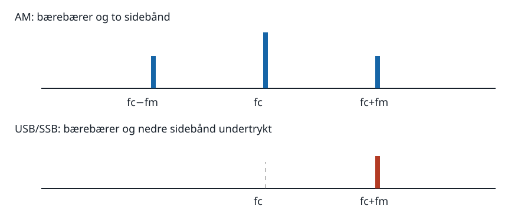
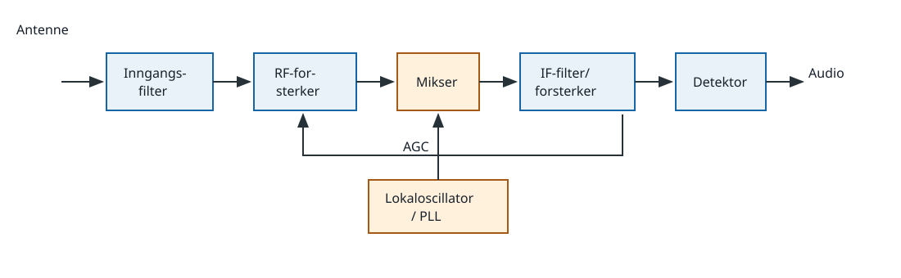
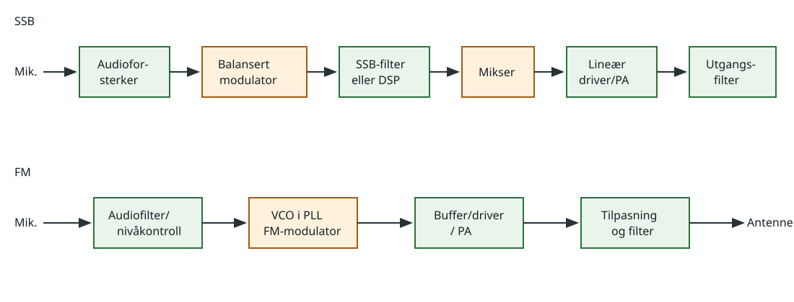

# 3. Modulasjon, sendere og mottakere

HAREC: `H-T1.8`, `H-T3.5`–`H-T3.7`, `H-T4.1`–`H-T4.4` og
`H-T5.1`–`H-T5.4`.

## Kildegrunnlag

- `HAREC-2024`, PDF-side 15 og 18–20, er normgivende for emnene, nivået og
  blokkene som skal kjennes.
- `ITU-AMATEUR-2026`, særlig PDF-side 22–27, dokumenterer modulasjonsformene
  og moderne analogt, digitalt og SDR-basert amatørutstyr.
- `FAA-ELEC-2023`, kapittel 12, brukes for diode-, forsterker-, filter- og
  oscillatorprinsippene som radioblokkene bygger på.
- `MIT-DB` og `MIT-FILTERS` brukes for dB-kjeder og selektive ledd.

Blokkdiagrammer og regneeksempler nedenfor er egne pedagogiske framstillinger
basert på disse prinsippene.

## 3.1 Hvorfor modulere?

Et lavfrekvent informasjonssignal kan ikke uten videre mates til en praktisk
radioantenne. Ved modulasjon lar vi informasjonen endre en egenskap ved en
høyfrekvent bærebølge. Den modulerte energien flyttes til et ønsket
frekvensområde, kan stråles effektivt og kan skilles fra andre sendinger med
filter og avstemming.

En bærebølge kan skrives `c(t)=Ac cos(2πfc t)`. Informasjonen kan påvirke:

- amplituden: AM og SSB;
- frekvensen: FM og FSK;
- fasen: PM og PSK;
- både amplitude og fase: QAM.

CW (`A1A`) er av/på-nøkling av en RF-bærebølge. Tegnformen oppstår ved at
bærebølgen slås av og på i morsekode. For brå flanker gir et bredt spektrum;
kontrollert stigetid og falltid reduserer key clicks.

## 3.2 AM, sidebånd og båndbredde

Ved enkel tone-AM er

`s(t)=Ac[1+m cos(2πfm t)] cos(2πfc t)`.

`m` er modulasjonsgraden. Spekteret inneholder bærebæreren `fc`, nedre
sidebånd `fc−fm` og øvre sidebånd `fc+fm`. Med høyeste audiofrekvens
`f_audio,max` blir nødvendig RF-båndbredde omtrent
`B_AM=2 f_audio,max`.

Ved `m=1` er AM 100 prosent modulert. Hvis `m>1`, krysser innhyllingen null.
En vanlig innhyllingsdetektor kan da ikke rekonstruere lyden korrekt, og den
forvrengte senderen opptar unødvendig spektrum.

I vanlig dobbelt-sidebånds AM ligger mesteparten av effekten i bærebæreren,
som ikke inneholder informasjon. SSB undertrykker bærebæreren og det ene
sidebåndet. Et talesignal fra 300 til 2700 Hz trenger da omtrent 2,4 kHz, mot
omtrent 5,4 kHz for AM med de samme audiogrensene. I mottakeren må en lokal
bærebølge settes inn igjen med BFO og produktdetektor.

## 3.3 FM og PM

Ved FM varierer øyeblikksfrekvensen rundt `fc`. Maksimalt utsving fra
midtfrekvensen er frekvensdeviasjonen `Δf`. For en enkel modulasjonstone er
modulasjonsindeksen

`β=Δf/fm`.

FM danner i prinsippet uendelig mange sidebånd, men en praktisk tilnærming til
opptatt båndbredde er Carsons regel:

`B ≈ 2(Δf + f_audio,max)`.

Eksempel, egen utledning: `Δf=2,5 kHz` og høyeste audiofrekvens `3,0 kHz`
gir `B≈2(2,5+3,0)=11 kHz`. Dette er et overslag; sendefilter og krav til
uønsket emisjon bestemmer den faktiske spektralmasken.

Ved PM er faseavviket proporsjonalt med informasjonssignalet. FM og PM er
nært beslektet: frekvens er tidsderivert av fase. En begrenser før
FM-detektoren fjerner amplitudevariasjoner, slik at amplitudestøy ikke blir
tolket som informasjon.

## 3.4 Digitale modulasjoner og feilkontroll

Et bit er én binær informasjonsenhet. Et symbol er én sendt tilstand og kan
representere flere bit. Med `M` mulige symboler kan hvert symbol bære
`log2(M)` bit. Derfor har QPSK (4-PSK) to bit per symbol, mens 16-QAM har fire.

- FSK velger mellom frekvenser.
- BPSK (2-PSK) velger mellom to faser.
- QPSK velger mellom fire faser.
- QAM velger kombinasjoner av amplitude og fase.

Bitrate og baudrate er bare like når hvert symbol bærer ett bit. En ideell
QPSK-strøm på 2400 bit/s har 1200 symbol/s før eventuell feilkoding og
rammeoverhead. Høyere ordens QAM gir flere bit per symbol, men avstanden
mellom konstellasjonspunktene blir mindre og kravet til signal/støy og
linearitet øker.

CRC er en kontrollverdi som oppdager mange overføringsfeil. Ved ARQ ber
mottakeren om ny sending når en ramme feiler. FEC legger til nok redundans til
at mottakeren kan rette visse feil uten omsending. ITU-håndboken beskriver
blant annet PSK31, PACTOR og digitale talemoduser som praktiske anvendelser.

## 3.5 Detektorer, oscillatorer og PLL

En detektor eller demodulator henter informasjonen ut av RF-signalet:

- En diode-innhyllingsdetektor likeretter AM og et RC-ledd følger den langsomme
  innhyllingen, men filtrerer bort RF.
- En produktdetektor multipliserer SSB eller CW med en lokal oscillator. Sum-
  og differanseprodukter dannes; lavpassfilteret beholder audioområdet.
- En FM-detektor omsetter frekvensendring til spenning. En discriminator eller
  en PLL kan gjøre dette.

En oscillator er en forsterker med tilsiktet positiv tilbakekobling ved én
frekvens. Rundsløyfens fase må være 0° (eller et helt antall 360°), og
sløyfeforsterkningen må være minst én ved oppstart. Amplitudebegrensning gjør
sløyfeforsterkningen én i stabil drift. LC-oscillatoren er avstembar;
krystalloscillatoren er vanligvis mer stabil. En VCO endrer frekvens med en
styrespenning. Støy og tilfeldige fasevariasjoner rundt bærebæreren kalles
fasestøy.

En PLL sammenligner fasen til et referansesignal med en delt versjon av
VCO-signalet. Fasedetektor, sløyfefilter og VCO korrigerer avviket. Med
programmerbar deler `N` blir låst utgangsfrekvens ideelt `fut=N·fref`.

Eksempel, egen utledning: En referanse på 12,5 kHz og `N=11600` gir
`fut=145,000 MHz`. Mindre referansesteg gir finere kanalraster, men påvirker
også sløyfens dynamikk og støtegenskaper.

## 3.6 Superheterodynmottakeren

Et inngangsfilter avviser sterke signaler utenfor ønsket bånd. RF-forsterkeren
kan bedre følsomheten, men for mye forsterkning tidlig reduserer
storsignalsegenskapene. Mikseren multipliserer RF med lokaloscillatoren og
danner blant annet sum- og differansefrekvens. Mellomfrekvensfilteret (MF/IF)
gir mesteparten av selektiviteten, og en IF-forsterker gir kontrollert
forsterkning før detektor og audioforsterker.

For høy-sideinjeksjon gjelder `fLO=fRF+fIF`. En ønsket stasjon på 14,200 MHz
med IF 9,000 MHz gir `fLO=23,200 MHz`. En annen inngang på
`fimage=fLO+fIF=32,200 MHz` gir den samme differansen 9 MHz og er derfor
speilfrekvensen. Et godt RF-inngangsfilter må dempe den.

Dobbel superheterodyn bruker to IF-er: en høy første IF gjør speilfrekvensen
lett å filtrere bort, mens en lavere andre IF gjør smal selektivitet enklere.
Direktekonvertering blander rett til basebånd rundt 0 Hz. En moderne SDR kan
digitalisere RF eller en IF og utføre miksing, filtrering og demodulasjon
numerisk.

AGC regulerer forsterkningen slik at svak og sterk mottaking gir håndterlig
utgangsnivå. S-meteret viser et mål relatert til mottatt nivå. Squelch sperrer
audio når ingen brukbar sending er til stede. I FM kan den styres av
støynivået etter detektoren.

## 3.7 Mottakeregenskaper

- **Følsomhet:** minste signal som gir angitt signal/støy eller lesbarhet.
- **Støytall:** hvor mye mottakeren forringer signal/støy-forholdet i forhold
  til en ideell mottaker.
- **Selektivitet:** evnen til å slippe gjennom ønsket kanal og dempe naboer.
- **Stabilitet:** hvor lite avstemming og oscillatorer driver.
- **Blocking/desensitisering:** et sterkt signal gjør mottakeren mindre følsom
  selv om det ikke ligger i passbåndet.
- **Intermodulasjon:** ikke-linearitet blander sterke signaler; to signaler
  `f1` og `f2` kan blant annet gi tredjeordensproduktene `2f1−f2` og
  `2f2−f1`.
- **Kryssmodulasjon:** modulasjonen fra et sterkt signal overføres til et annet
  gjennom et ikke-lineært trinn.
- **Resiprok miksing:** lokaloscillatorens fasestøy blander et sterkt nabosignal
  inn som støy rundt den ønskede frekvensen.

Et smalere mottakerfilter reduserer termisk støyeffekt fordi `PN=kTB`, men må
fortsatt være bredt nok for modulasjonen. Dette kobler selektivitet,
signal/støy og valgt trafikkart direkte sammen.

## 3.8 Sendere

En oscillator eller synthesizer fastsetter frekvensen. En buffer hindrer at
senere trinn trekker oscillatoren i frekvens. Driveren leverer nødvendig nivå
til effektforsterkeren. Utgangstilpasningen overfører effekt til 50-ohmslasten,
og lavpass- eller båndpassfilteret demper harmoniske og andre uønskede
produkter.

I en SSB-sender danner balansert modulator et dobbelt-sidebåndssignal med
undertrykt bærebærer. Et krystall-/DSP-filter velger ett sidebånd. En mikser
flytter signalet til ønsket RF. Alle trinn etter SSB-dannelsen må være
tilstrekkelig lineære; overstyring gir intermodulasjon og splatter.

I en FM-sender kan audio modulere en VCO i en PLL. Senere begrensende eller
klasse-C-trinn kan brukes fordi informasjonen ikke ligger i amplituden, men
frekvensmultiplikasjon multipliserer også deviasjonen. CW trenger kontrollert
nøkling og stabil oscillator for å unngå clicks og chirp.

Frekvensomforming er ikke alltid nødvendig: en sender kan generere direkte på
utgangsfrekvensen. Med miksing oppstår både ønskede og uønskede produkter, så
filtervalg er en del av senderarkitekturen.

## 3.9 Senderegenskaper og effekt

Utgangseffekt, virkningsgrad, utgangsimpedans, frekvensstabilitet og opptatt
RF-båndbredde beskriver senderen. PEP er middelverdien av RF-effekten under
toppen av modulasjonsinnhyllingen; for en umodulert sinus i 50 Ω kan den
beregnes med RMS-spenningen under toppen.

Eksempel, egen utledning: Målt sinus er 100 V topp-til-topp over en ideell
50 Ω-last. `Û=50 V`, `URMS=50/√2=35,36 V`, og
`P=URMS²/R=25 W`. Det er ikke 200 W; topp-til-topp må først halveres og så
omregnes til RMS.

Harmoniske er heltallige multipler av ønsket frekvens. Parasittiske
oscillasjoner, mikserprodukter, fasestøy og lekkasje fra kabinettet er andre
uønskede emisjoner. Riktig arbeidspunkt, lineær drift, skjerming, jording,
tilpasning og utgangsfilter angriper ulike årsaker; ett lavpassfilter reparerer
ikke en allerede bred, overmodulert SSB-sending.

## Fallgruver

- Å forveksle modulasjonsindeks med prosent uten å angi AM eller FM.
- Å tro at FM bare har to sidebånd; det gjelder enkel AM, ikke FM.
- Å bruke baud og bit/s som synonymer ved flerbitsymboler.
- Å glemme speilfrekvensen når bare differansefrekvensen i mikseren regnes.
- Å kalle et smalt filter «følsomhet»; filteret påvirker støynivå og
  selektivitet, mens følsomhet oppgis med en definert målemetode.
- Å drive SSB-effektforsterkeren som et begrensende FM-trinn.

## Kontrolloppgaver med fasit

1. En AM-sender overfører audio til 3 kHz. Omtrent hvilken båndbredde kreves?
2. QPSK sender 4800 bit/s uten å ta med overhead. Hva er symbolraten?
3. En FM-sender har `Δf=5 kHz` og `f_audio,max=3 kHz`. Bruk Carsons regel.
4. Ønsket RF er 145 MHz, IF er 10,7 MHz og LO ligger over RF. Finn LO og
   speilfrekvens.
5. Hvorfor krever SSB lineære effekttrinn?

Fasit:

1. Omtrent `2·3=6 kHz`.
2. `4800/2=2400 baud`.
3. `B≈2(5+3)=16 kHz`.
4. `fLO=155,7 MHz`; speilet er `166,4 MHz`.
5. Amplitudevariasjonen bærer informasjon. Ikke-linearitet skaper forvrengning
   og intermodulasjonsprodukter utenfor ønsket kanal.
