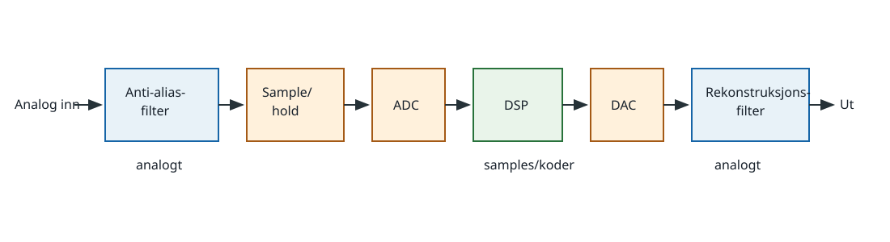

# 4. Digital signalbehandling

HAREC: `H-T1.10` og `H-T3.8`.

## Kildegrunnlag

- `HAREC-2024`, PDF-side 16 og 18, fastsetter emnene.
- `MIT-DSP-SIGNALS`, PDF-side 38–45, dekker sampling, Nyquist, aliasing,
  kvantisering og konvertering mellom analoge og digitale signaler.
- `MIT-DSP-2161`: forelesning 10 dekker sampling og DFT, forelesning 13
  konvolusjon, og forelesning 18 FIR-, FFT- og IIR-prinsipper.
- `ADI-DDS-MT085`, side 1–3, brukes for DDS-arkitekturen og
  tuningordformelen. Denne kilden er kontrollert hos utgiveren, men kunne ikke
  arkiveres lokalt fordi dokumentserveren avbrøt forbindelsen.

## 4.1 Fra analogt signal til tall og tilbake

Antialiasfilteret begrenser analog båndbredde før ADC-en. Sample-and-hold tar
øyeblikksbilder med perioden `Ts`; samplingsfrekvensen er `fs=1/Ts`. ADC-en
kvantiserer hvert sample til ett av et endelig antall nivåer. DSP-blokken kan
så mikse, filtrere, demodulere eller analysere tallfølgen. På utgangen lager
DAC-en en trappe-/pulsformet analog representasjon, og
rekonstruksjonsfilteret demper spektrumbildene rundt multiplene av `fs`.

ADC og DAC er ikke filtre. De to analoge filtrene har forskjellige oppgaver:
antialiasfilteret må virke før informasjon går tapt i sampling; et
rekonstruksjonsfilter glatter DAC-utgangen etterpå.

## 4.2 Sampling, Nyquist og aliasing

Et båndbegrenset signal med høyeste frekvens `fmax` kan entydig
rekonstrueres når `fs>2fmax`. `2fmax` er Nyquist-raten for signalet, mens
`fs/2` er Nyquist-frekvensen til det valgte samplesystemet. Begrepene må ikke
byttes om.

Ved undersampling blir frekvenser som skiller seg med heltallige multipler av
`fs`, identiske i samplesettet. En enkel måte å finne alias i første
Nyquist-sone er å velge heltall `k` slik at

`falias=|fin−k fs|`

havner mellom 0 og `fs/2`.

Eksempel, egen utledning: `fin=11 kHz` samples med `fs=8 kHz`.
`|11−1·8|=3 kHz`, så samplesettet ser ut som 3 kHz. Et digitalt filter etter
ADC kan ikke vite om signalet opprinnelig var 3 eller 11 kHz. Derfor må et
analogt antialiasfilter ha dempet 11 kHz på forhånd.

I praksis velges `fs` høyere enn den teoretiske grensen fordi et fysisk filter
trenger et overgangsbånd. Audio begrenset til 3 kHz kan teoretisk samples litt
over 6 kS/s, men 8 kS/s gir plass til filterovergangen.

## 4.3 Kvantisering og oppløsning

En ideell `N`-bits ADC har `2^N` koder. For inngangsområdet `VFS` er omtrent
ett minst signifikant bit

`LSB=VFS/2^N`.

Med 12 bit og 4,096 V område er `LSB=1 mV`. Den avrundede
kvantiseringsfeilen ligger ideelt omtrent mellom `−0,5 LSB` og `+0,5 LSB`.
Flere bit gir finere amplitudeoppløsning, men retter ikke aliasing, jitter,
metning eller analog støy.

Kvantisering betyr å gjøre amplituden diskret; sampling gjør tiden diskret.
Et signal kan derfor være tidsdiskret uten å være digitalt før amplituden er
kvantisert og kodet.

## 4.4 Konvolusjon og impulssvar

For et lineært, tidsinvariant digitalt system bestemmer impulssvaret `h[n]`
hele systemet. Utgangen er konvolusjonen

`y[n]=Σ h[k]x[n−k]`.

Man kan tenke seg at hvert inngangssample starter en skalert og tidsforskjøvet
kopi av impulssvaret. Utgangen er summen av alle kopiene. I
frekvensdomenet tilsvarer konvolusjon multiplikasjon:
`Y(f)=X(f)H(f)`.

Eksempel, egen utledning: Et trepunkts glidende middel har
`h=[1/3,1/3,1/3]`. For `x=[3,0,0]` blir starten av utgangen `[1,1,1]`.
Impulsen er fordelt over tre samples; filteret glatter raske endringer.

## 4.5 FIR- og IIR-filter

Et FIR-filter beregner

`y[n]=Σ(k=0..M) b[k]x[n−k]`.

Det har et endelig impulssvar fordi ingen tidligere utgang mates tilbake.
FIR kan gjøres eksakt lineærfaset og er stabilt når koeffisientene er
endelige, men en skarp overgang kan kreve mange taps (koeffisienter),
beregninger og forsinkelse.

Et IIR-filter bruker også tidligere utganger:

`y[n]=Σ b[k]x[n−k] − Σ a[k]y[n−k]`.

Tilbakekoblingen gir et impulssvar som i prinsippet varer uendelig. IIR kan
oppnå bratt respons med færre koeffisienter, men fasegangen er vanligvis
ikke-lineær og feil koeffisienter/poler kan gjøre filteret ustabilt.

FIR og IIR betegner impulssvarets varighet, ikke automatisk lavpass eller
høypass. Begge arkitekturer kan realisere flere filtertyper.

## 4.6 DFT og FFT

DFT omformer en endelig blokk med `N` tidssamples til `N` komplekse
frekvenspunkter. Punktavstanden er

`Δf=fs/N`.

Eksempel: `fs=48 kS/s` og `N=1024` gir `Δf=46,875 Hz`. Det betyr ikke at to
vilkårlige signaler alltid kan skilles med akkurat dette tallet; vindu,
signalvarighet og signal/støy påvirker resultatet.

FFT er en effektiv algoritme for å beregne den samme DFT-en, ikke en annen
transformasjon. DFT antar at den analyserte blokken gjentas. Hvis blokken ikke
inneholder et helt antall perioder, oppstår spektrallekkasje. Et vindu
reduserer sidelober, men endrer hovedlobebredde og amplitudekalibrering.

Filtrering kan utføres ved konvolusjon i tid eller ved å multiplisere spektra
og transformere tilbake. For lange FIR-filtre og blokker kan FFT-metoder være
mer beregningseffektive, men blokkgrenser må håndteres korrekt.

## 4.7 Direct Digital Synthesis (DDS)

En DDS bruker en systemklokke, faseakkumulator, fase-til-amplitude-tabell,
DAC og rekonstruksjonsfilter. For hvert klokkeslag legges tuningordet `M` til
en `N`-bits faseakkumulator. Den digitale utgangsfrekvensen er ideelt

`fout=M fclk/2^N`.

Eksempel, egen utledning: Med `fclk=100 MHz`, 32-bits akkumulator og ønsket
`fout=10 MHz` blir `M≈10/100·2^32≈429 496 730`. Frekvensoppløsningen er
`fclk/2^32≈0,0233 Hz`.

Faseordet adresserer en sinusfunksjon/-tabell, og DAC-en omsetter
amplitudekodene til analog spenning. Kvantisering, fasetrunkering,
klokkefasestøy og DAC-ulinearitet gir spurier og støy. Et utgangsfilter er
derfor en funksjonell del av DDS-kjeden, ikke pynt.

## Fallgruver

- Å skrive `fs≥2fmax` som en praktisk garanti uten overgangsbånd.
- Å tro at oversampling alene øker antall ADC-bit.
- Å blande samplingsfeil og kvantiseringsfeil.
- Å kalle FFT et spektrumapparat uten å angi `fs`, blokklengde og vindu.
- Å hevde at alle FIR-filtre er lineærfase eller at alle IIR-filtre er
  ustabile; dette er muligheter/risikoer i arkitekturen, ikke universelle
  resultater.

## Kontrolloppgaver med fasit

1. Hva er minste teoretiske samplingsrate for et 4 kHz båndbegrenset signal?
2. Hvor aliaseres 18 kHz ved `fs=20 kHz` i første Nyquist-sone?
3. Hvor mange koder og hvilken LSB-størrelse har en ideal 10-bits ADC over
   0–1,024 V?
4. Hva er forskjellen på DFT og FFT?
5. Hva skiller FIR fra IIR strukturelt?

Fasit:

1. Over 8 kS/s; praktisk kreves margin til filterovergangen.
2. `|18−20|=2 kHz`.
3. 1024 koder og omtrent 1 mV per LSB.
4. DFT er transformasjonen; FFT er en effektiv algoritme for samme resultat.
5. IIR har tilbakekobling fra tidligere utganger; FIR har ikke det.
