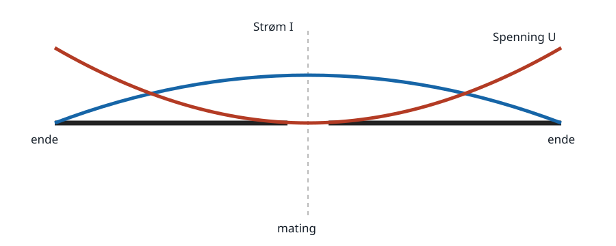
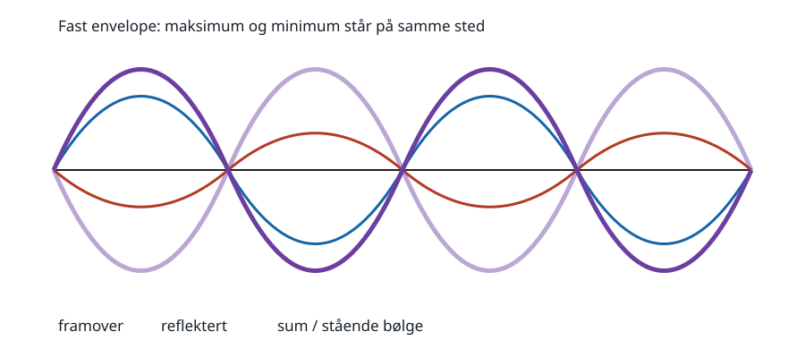

# 5. Antenner og transmisjonslinjer

HAREC: `H-T6.1`–`H-T6.3`.

## Kildegrunnlag

- `HAREC-2024`, PDF-side 20–21, fastsetter antennetyper, egenskaper og
  transmisjonslinjebegreper.
- `USN-NEETS-10`, kapittel 3–4, forklarer karakteristisk impedans,
  refleksjoner, stående bølger, strøm-/spenningsfordeling og antenner.
- `IARU-R1-VHF-10.02`, særlig antennepolarisasjonsanbefaling P.1, knytter
  prinsippene til amatørpraksis på VHF/UHF.

## 5.1 Bølgelengde og elektrisk lengde

I fritt rom er `λ=c/f`, eller praktisk `λ[m]≈300/f[MHz]`. En fysisk leder blir
ofte litt kortere enn den ideelle friluftslengden på grunn av lederdiameter,
isolasjon, endekapasitans og omgivelser. En vanlig første tilnærming for en
tråddipol er total lengde `L≈143/f[MHz]` meter, men den må trimmes i den
faktiske installasjonen.

Eksempel, egen utledning: Ved 14,2 MHz er `λ≈21,13 m`; en startlengde for
halvbølgedipolen er `143/14,2≈10,07 m`, altså ca. 5,04 m per side.

Elektrisk lengde er faseforsinkelsen uttrykt som del av en bølgelengde. På en
kabel med hastighetsfaktor `VF` er `λkabel=VF·λ0`. En fysisk 5 m kabel med
`VF=0,66` er derfor elektrisk lengre enn 5 m friluftsleder ved samme frekvens.

## 5.2 Halvbølgedipolen

På en resonant, senterfødet halvbølgedipol er RF-strømmen størst ved sentrum
og går mot null ved endene. RF-spenningen er minst ved sentrum og størst ved
endene. Derfor er senterimpedansen moderat (omtrent 73 Ω for en tynn, fri
dipol), mens endemating møter høy impedans, ofte flere kiloohm i en praktisk
endefødet halvbølge. Endene kan ha farlig RF-spenning selv ved moderat effekt.

En antenne kortere enn resonans er normalt kapasitiv; en lengre er normalt
induktiv, før andre resonanser tas med. En tuner kan kansellere reaktansen og
transformere impedansen, men gjør ikke en tapsfull eller dårlig plassert
antenne effektiv av den grunn.

En foldet dipol har to parallelle ledere forbundet i endene. Med like
lederdiametre blir mateimpedansen omtrent fire ganger en enkel dipol, rundt
300 Ω, og båndbredden kan bli større. En trappedipol bruker parallelle
LC-resonanser som elektriske sperrer på ett bånd, mens mer av lederen tas i
bruk på lavere frekvens.

## 5.3 Kvartbølgevertikal og ground plane

En kvartbølgevertikal over et ideelt ledende plan opptrer som halvparten av en
dipol; speilbildet i bakken utgjør den andre halvparten. Ideell
mateimpedans er omkring 36 Ω. Reell jord er tapsfull, så radialer eller et
metallplan brukes som returleder. Skråstilte radialer kan løfte impedansen mot
50 Ω.

Vertikalen gir omtrent rundstrålende horisontaldiagram, men har null i
lederens lengderetning. Polarisasjonen følger E-feltet og er vertikal. På
VHF/UHF brukes vertikal polarisasjon typisk for FM/repeater/mobiltrafikk,
mens horisontal polarisasjon er vanlig for ikke-kanalisert svak-signaltrafikk
i IARU Region 1. Krysspolarisasjon kan gi stort tap.

## 5.4 Yagi og aperturantenner

En Yagi har ett matet element, vanligvis en dipol, en litt lengre reflektor
bak og én eller flere litt kortere direktorer foran. De parasittiske elementene
mates ved kobling fra feltet og omstråler med fase som forsterker én retning og
demper andre. Flere korrekt dimensjonerte elementer kan gi mer gain og
smalere hovedlobe, men innbyrdes avstand, båndbredde og impedans må utformes
som ett system.

Front/bak-forholdet er forholdet mellom stråling i hovedretningen og motsatt
retning, vanligvis i dB. Det er ikke det samme som gain: en antenne kan ha god
bakdemping uten svært høy hovedlobegain.

Parabolreflektoren samler energi over en stor åpning og fokuserer den i en
mateantenne. Hornet er en gradvis overgang fra bølgeleder til fritt rom og kan
brukes alene eller som parabolmater. Slike aperturantenner blir praktiske når
bølgelengden er liten nok til at åpningen kan være mange bølgelengder.

## 5.5 Diagram, direktivitet, gain og virkningsgrad

Et strålingsdiagram viser relativ feltstyrke eller effekt med retning.
Horisontaldiagrammet er et snitt i horisontalplanet; vertikaldiagrammet viser
lobenes elevasjonsvinkler. Diagrammet sier ikke alene hvor mange watt som
stråles.

Direktivitet sammenligner maksimal stråling med en isotrop radiator når total
utstrålt effekt er lik. Gain inkluderer antennetap:
`G=ηD`, der `η` er virkningsgrad. 0 dBd tilsvarer omtrent 2,15 dBi fordi en
ideell halvbølgedipol har 2,15 dB gain over isotrop.

Effektiv mottaksflate henger sammen med gain:
`Ae=Gλ²/(4π)`, med `G` som lineært tall. En antenne er reciprok: samme
diagram, polarisasjon og impedansegenskaper gjelder i prinsippet ved sending
og mottak.

ERP refererer til en halvbølgedipol, EIRP til isotrop radiator:

- `ERP=Psender·Gd·ηlinje` med dipolreferert lineær gain;
- `EIRP=Psender·Gi·ηlinje` med isotropreferert lineær gain;
- i dB er `EIRP[dB]=ERP[dB]+2,15 dB` for samme system.

Eksempel, egen utledning: 50 W er 17 dBW. Kabeltap 1 dB og antennegain
6 dBi gir `EIRP=17−1+6=22 dBW≈158 W`. Det er retningsbestemt ekvivalens,
ikke at senderen fysisk lager 158 W.

## 5.6 Karakteristisk impedans og kabeltyper

En transmisjonslinje fører en vandrende spennings- og strømbølge. Dens
karakteristiske impedans `Z0` bestemmes av fordelt induktans og kapasitans; for
en ideal tapsfri linje `Z0=√(L'/C')`. Den er ikke kabelens DC-motstand.

Koaks har en indre leder og en skjerm som også er returleder. Feltet holdes i
stor grad mellom lederne, slik at kabelen kan legges nær andre objekter.
Parallell toleder har ofte lavt tap, men påvirkes mer av omgivelser og må
holdes symmetrisk. Bølgeleder er et hult metallrør som fører bestemte moder
over en grensefrekvens; den brukes særlig på mikrobølgefrekvenser.

Kabeltap oppgis ofte i dB per lengdeenhet og øker vanligvis med frekvens.
Hastighetsfaktoren er bølgehastigheten i kabel dividert med `c` og bestemmes
av dielektrikum og konstruksjon.

## 5.7 Refleksjon og SWR

Når `ZL=Z0`, absorberer lasten den innkommende bølgen uten refleksjon. Ved
avvik er spenningsrefleksjonskoeffisienten

`Γ=(ZL−Z0)/(ZL+Z0)`

for resistive eller komplekse impedanser. Spennings-SWR er

`SWR=(1+|Γ|)/(1−|Γ|)`.

Reflektert effektandel ved referanseplanet er `|Γ|²`. For 75 Ω last på 50 Ω
linje er `Γ=0,2`, `SWR=1,5:1`, og 4 prosent av framovereffekten reflekteres
ved lasten. Det betyr ikke automatisk at 4 prosent forsvinner: i en tapsfri
linje reflekteres energien på nytt ved kilden. Reelt kabeltap og senderens
tilpasning avgjør systemtap og belastning.

SWR er konstant langs en ideal tapsfri linje. På en tapslinje ser SWR bedre ut
nær senderen fordi den reflekterte bølgen har passert kabeltapet to ganger.
Lav SWR ved senderen beviser derfor ikke at antennen er god.

## 5.8 Balun og antennetuner

En balansert dipol til en ubalansert koaks trenger en balun eller
common-mode-choke for å hindre at utsiden av skjermen blir en utilsiktet del
av antennen. Det stabiliserer diagrammet og reduserer RF i stasjonen.

En antennetuner (ATU) med pi- eller T-nettverk transformerer impedansen som
senderen ser. Plassert ved senderen kan den gi senderen 50 Ω, men den endrer
ikke høy SWR og tap på kabelen mellom tuner og antenne. Plassering ved
matepunktet eller bruk av lavtapstoleder kan være viktig ved stor mismatch.

Pi-nettet har typisk to shuntreaktanser og én seriereaktans; T-nettet to
seriereaktanser og én shuntreaktans. Reaktive komponenter lagrer energi og kan
ha store strømmer/spenninger selv om senderens utgangseffekt virker moderat.

## Fallgruver

- Å bruke 300/f som ferdig byggekappemål uten endeeffekt og omgivelser.
- Å forveksle dBi og dBd eller ERP og EIRP.
- Å tro at antennegain skaper effekt; den omfordeler utstrålingen.
- Å tolke SWR som direkte prosent effekttap uten kabel og kilde.
- Å tro at en tuner ved radioen fjerner stående bølger på koaksen.
- Å glemme at strøm og spenning er motsatt fordelt langs en resonant dipol.

## Kontrolloppgaver med fasit

1. Finn friromsbølgelengden ved 145 MHz.
2. En kabel har `VF=0,80`. Hvor lang er én elektrisk kvartbølge ved 10 MHz?
3. Finn SWR og reflektert effektandel for 100 Ω resistiv last på 50 Ω linje.
4. 100 W går gjennom 2 dB kabeltap til en antenne med 5 dBi. Finn EIRP.
5. Hvorfor kan lav SWR ved senderen skjule en dårlig installasjon?

Fasit:

1. `300/145≈2,07 m`.
2. `λ0=30 m`; fysisk kvartbølge `30·0,80/4=6,0 m`.
3. `Γ=1/3`, `SWR=2:1`, reflektert andel `1/9≈11,1 %` ved lasten.
4. `20 dBW−2+5=23 dBW≈200 W EIRP`.
5. En tapsfull kabel demper den reflekterte bølgen på returen og får målt SWR
   ved senderen til å se bedre ut.
