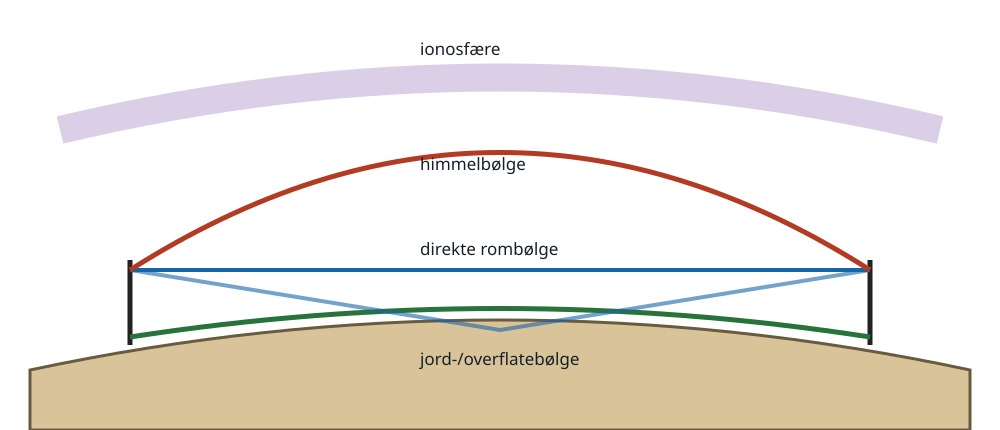
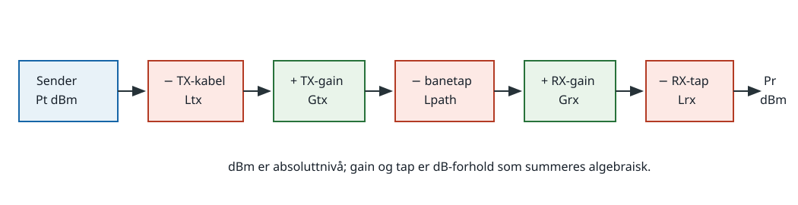

# 6. Radiobølgeutbredelse og linkbudsjett

HAREC: `H-T7`.

## Kildegrunnlag

- `HAREC-2024`, PDF-side 21, angir alle utbredelsesmekanismene og
  linkbudsjettleddene som skal beherskes.
- `USN-NEETS-10`, kapittel 2, dekker jord-/rom-/himmelbølge, ionosfærelag,
  kritisk frekvens, skip, fading, støy og troposfærisk utbredelse.
- `ITU-P525-5`, vedlegg 1, er fasit for friluftsdemping og felt i fritt rom.
- `ITU-AMATEUR-2026`, avsnitt 2.6.4, og `IARU-R1-VHF-10.02`, del IVa,
  dokumenterer amatørbruk av beacons og studier av blant annet tropo,
  aurora, sporadisk E, meteor scatter og EME.

## 6.1 Felt, effekttetthet og friluftstap

I ideelt fritt rom sprer en isotrop kilde effekten over kuleflaten `4πd²`.
Effekttettheten avtar derfor som `1/d²`, mens elektrisk feltstyrke avtar som
`1/d`. Dobles avstanden, faller mottatt effekt med 6 dB når alle andre
forhold er like.

ITU-R P.525-5 gir grunnleggende transmisjonstap:

`Lfs[dB]=32,45 + 20 log10(f[MHz]) + 20 log10(d[km])`.

Dette er en referanse for klar friluftsbane. Terreng, Fresnel-soneklaring,
refleksjon, diffraksjon, atmosfære, polarisasjon og kabler kommer i tillegg.

Eksempel, egen utledning: Ved 145 MHz og 100 km er
`Lfs=32,45+20log(145)+20log(100)≈115,7 dB`.

## 6.2 Siktlinje og radiohorisont

VHF og høyere følger i normal atmosfære hovedsakelig en siktlinjebane, men
svak refraksjon bøyer banen litt rundt jorden. Geometrisk horisont for antenne
i høyde `h` meter kan grovt anslås som `d≈3,57√h` km; mellom to antenner
summeres bidragene. Standard radiorefraksjon gir ofte en noe større praktisk
radiohorisont, men terreng og hindringer kan dominere.

To antenner på 25 m har geometrisk sikt omtrent
`3,57(√25+√25)=35,7 km`. Høyde er særlig verdifull fordi horisontavstanden
øker med kvadratroten og fordi Fresnel-sonen lettere klareres.

Diffraksjon kan bøye noe energi rundt en kant. Refleksjon fra bakke og bygg
lager flere baner. Banene får ulike faser og kan forsterke eller kansellere
hverandre, slik at en liten flytting av antennen kan endre signalet mye.

## 6.3 Jordbølge og rombølge

Overflatebølgen følger jordkrummingen og taper energi i bakken. Lav frekvens,
vertikal polarisasjon og god jordledning favoriserer den. Sjøvann leder bedre
enn tørr jord. På HF brukes «ground wave» ofte om lokal/regional dekning nær
bakken, mens langdistanse vanligvis skyldes ionosfærisk himmelbølge.

Rombølgen består av direkte og bakkereflektert komponent innenfor
radiohorisonten. Forskjellig banelengde gir høyde- og avstandsavhengige
maksimum/minimum og kan gi fading.

## 6.4 Ionosfæren

Solens UV- og røntgenstråling ioniserer den øvre atmosfæren. Lagene er ikke
harde speil; brytningsindeksen varierer gradvis og bøyer radiobanen:

- D-laget er lavest, finnes hovedsakelig om dagen og absorberer særlig lave
  HF-frekvenser.
- E-laget kan returnere lavere HF; lokale, tette områder gir sporadisk E.
- F-laget er viktigst for langdistanse-HF. Om dagen kan det deles i F1 og F2;
  om natten opptrer det mer som ett lag.

Kritisk frekvens er høyeste frekvens som returneres ved vertikal innstråling
fra et gitt lag. MUF er høyeste frekvens som støttes på en bestemt skrå bane
og kan være høyere enn kritisk frekvens. MUF er derfor bane-, tid- og
lagavhengig, ikke én global verdi for et bånd.

Mer solstråling gir normalt mer ionisering og høyere mulig MUF, men kraftige
solhendelser kan også gi D-lagsabsorpsjon og geomagnetiske forstyrrelser.
Døgn, årstid, geografi og omtrent 11-årig solsyklus endrer forholdene.

## 6.5 Utstrålingsvinkel, skip og flerveisgang

Lav elevasjonsvinkel gir ofte lang første hop; høy elevasjonsvinkel gir kortere
skip og kan brukes til NVIS-dekning. Skip distance er avstanden til første
sted der himmelbølgen returnerer. Skip zone er gapet mellom der jordbølgen er
for svak og himmelbølgen først kan mottas.

Samme signal kan gå via flere ionosfærelag, flere hopp eller både jord- og
himmelbane. Varierende fase og polarisasjon gir fading. Hvis ulike
frekvenskomponenter påvirkes forskjellig, oppstår selektiv fading og lyd/data
forvrenges selv når gjennomsnittsnivået er rimelig.

## 6.6 Særlige VHF/UHF/SHF-mekanismer

- **Troposfærisk ducting:** temperaturinversjon og fuktighetsgradient kan
  fange VHF/UHF/SHF i et lag og gi svært lang rekkevidde.
- **Troposcatter:** små uregelmessigheter sprer en liten del av energien
  framover og muliggjør samband forbi horisonten med gain og effekt.
- **Sporadisk E:** tette, uregelmessige E-lagsområder kan returnere særlig
  50 MHz og av og til høyere frekvenser.
- **Aurora:** ioniserte områder nær polarlyset sprer VHF; signalet får ofte
  Doppler-spredning og ru tone, og antennen peker mot spredningsområdet.
- **Meteor scatter:** ioniserte meteorspor gir korte ping eller lengre bursts;
  raske digitale sekvenser kan utnytte dem.
- **EME/månesprett:** månen er en passiv reflektor. Banen har svært stort tap,
  så lav systemstøy, stor antennegain, nøyaktig pointing og smalbåndsmodus er
  viktig.

## 6.7 Radiostøy og minste mottakbare signal

Atmosfærisk støy kommer særlig fra lyn og fjerne tordenvær og dominerer ofte
på lave HF-bånd. Galaktisk/kosmisk støy kan dominere på deler av VHF når
antennen peker mot himmelen. Bakke og tapsobjekter omkring antennen har
termisk støystemperatur; på høyere VHF/UHF kan mottakerens eget støytall bli
avgjørende.

Termisk tilgjengelig støyeffekt er `N=kTB`. I dBm ved ca. 290 K brukes ofte
`N≈−174 dBm/Hz + 10log10(B) + NF`, før andre støykilder. Smalere båndbredde
senker integrert støy: en reduksjon fra 10 kHz til 1 kHz gir 10 dB mindre
termisk støyeffekt, forutsatt at signalmodusen passer i båndet.

Minste nødvendig mottatt effekt er støynivå pluss nødvendig SNR og ønsket
margin. På HF kan ekstern båndstøy gjøre en ekstremt lavstøyende mottaker
unødvendig; på EME kan hver desibel støytall være viktig.

## 6.8 Linkbudsjett

Alle gain og tap kan summeres i dB:

`Pr[dBm]=Pt[dBm]−Ltx+Gtx−Lpath+Grx−Lrx`.

Eksempel, egen utledning, 145 MHz over 100 km:

| Ledd | dB/dBm |
|---|---:|
| Sender 10 W | +40 dBm |
| TX-kabel | −1 dB |
| TX-antenne | +6 dBi |
| Friluftstap | −115,7 dB |
| RX-antenne | +9 dBi |
| RX-kabel | −2 dB |
| Forventet mottatt | **−63,7 dBm** |

Hvis mottakerstøyen i valgt båndbredde inkludert NF er −120 dBm, krevd SNR
er 10 dB og ønsket fadingmargin 20 dB, kreves minst −90 dBm. Budsjettet har da
`−63,7−(−90)=26,3 dB` margin i idealisert frirom. Reell terrengbane kan bruke
opp denne marginen.

For minste sendereffekt flyttes alle andre ledd algebraisk:
`Pt,min=Pr,min+Ltx−Gtx+Lpath−Grx+Lrx`. Bland ikke dBm (absolutt effekt) og dB
(forhold).

## Fallgruver

- Å bruke friluftstap som en komplett terrengprognose.
- Å si at ionosfæren «reflekterer» som metall; gradvis refraksjon er en bedre
  grunnmodell.
- Å forveksle kritisk frekvens med MUF for en skrå bane.
- Å anta at høyere solaktivitet alltid forbedrer alle HF-bånd.
- Å glemme mottakerbåndbredde og dominerende støykilde i linkbudsjettet.
- Å legge lineære wattverdier direkte sammen med dB.

## Kontrolloppgaver med fasit

1. Hvor mye øker friluftstapet når avstanden dobles?
2. Beregn `Lfs` ved 435 MHz og 10 km.
3. Hvorfor kan 7 MHz gi kort NVIS-samband samtidig som lavere vinkel gir
   lengre hop?
4. Støy er −115 dBm, nødvendig SNR 8 dB og margin 12 dB. Hva er minste
   planlagte mottatte effekt?
5. Et budsjett mangler 6 dB. Hvor mange ganger mer sendereffekt tilsvarer det?

Fasit:

1. 6 dB.
2. `32,45+20log(435)+20log(10)≈105,2 dB`.
3. Elevasjonsvinkelen bestemmer geometrien: høy vinkel returnerer nærmere,
   lav vinkel lengre unna, dersom ionosfæren støtter frekvensen.
4. `−115+8+12=−95 dBm`.
5. Omtrent fire ganger.
