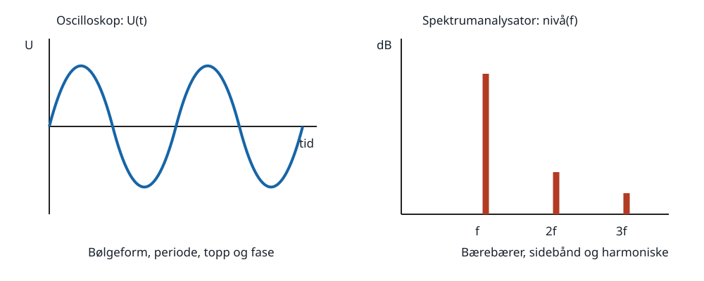

# 7. Måleteknikk, interferens og EMC

HAREC: `H-T8.1`, `H-T8.2` og `H-T9.1`–`H-T9.3`.

## Kildegrunnlag

- `HAREC-2024`, PDF-side 21–22, fastsetter målinger, instrumenter,
  interferensmekanismer og mottiltak.
- `USN-NEETS-16`, særlig kapittel 2 og 4–6, dekker RF-effektmåler,
  multimeter, signalgenerator, frekvensteller, oscilloskop og
  spektrumanalysator.
- `USN-NEETS-10`, kapittel 2–3, dekker EMI, skjerming, filter og SWR-måling.
- `FAA-ELEC-2023`, kapittel 12, brukes for meterbelastning og grunnmålinger.

## 7.1 Måling er en del av kretsen

Et instrument påvirker objektet. Voltmeteret kobles parallelt og bør ha høy
inngangsimpedans. Amperemeteret kobles i serie og bør ha lav indre motstand.
Ohmmeteret bruker egen spenningskilde og skal bare kobles til spenningsløs,
utladet krets. Feilplassert strøminngang på multimeteret kan kortslutte kilden.

Eksempel på belastningsfeil: En 100 kΩ/100 kΩ spenningsdeler på 10 V gir
ideelt 5 V. Et 100 kΩ voltmeter parallelt med nedre motstand gjør den til
50 kΩ. Målt spenning blir da `10·50/(100+50)=3,33 V`. Et 10 MΩ DMM gir mye
mindre feil.

Start på høyeste sikre måleområde når størrelsen er ukjent. Kontroller riktig
kontakt, funksjon, AC/DC, kategori, spennings- og strømrating før tilkobling.

## 7.2 Frekvens- og bølgeformfeil

Et AC-voltmeter kan være kalibrert til RMS for sinus, men måle en likerettet
middelverdi. Da blir visningen feil for firkant, pulser og forvrengt RF. Et
true-RMS-instrument har også begrenset båndbredde og crest factor. Prober,
kabling og instrumentinngang får kapasitans/induktans som blir viktige ved RF.

En 10× oscilloskopprobe gir vanligvis mindre kapasitiv belastning enn 1×, men
må kompenseres. Skopets båndbredde må være vesentlig høyere enn signalet hvis
amplitude og flanketid skal måles nøyaktig.

## 7.3 Oscilloskop og spektrumanalysator

Oscilloskopet viser spenning mot tid og brukes til amplitude, periode, fase,
pulsform og modulasjonsinnhylling. Triggeren stabiliserer bildet. Skopets
jordklemme er ofte koblet til beskyttelsesjord; feil plassering på nett- eller
flytende kretser kan kortslutte og være livsfarlig.

Spektrumanalysatoren viser nivå mot frekvens og brukes til bærebærer,
sidebånd, harmoniske, spurier og opptatt båndbredde. Viktige innstillinger er
senter/span, referansenivå, inngangsdemping, oppløsningsbåndbredde (RBW) og
detektor. For høyt nivå kan skade eller overstyre inngangen; overstyring kan
skape falske intermodulasjonsprodukter i selve analysatoren.

Samme signal kan se rent ut i tidsdomenet og likevel ha små harmoniske som er
tydelige i et dB-spektrum. Instrumentene svarer på forskjellige spørsmål.

## 7.4 Frekvens, resonans og signalgenerator

Frekvenstelleren teller hendelser i en kjent porttid fra en stabil tidsbase.
Ved 1 s porttid er den grunnleggende telleoppløsningen omtrent 1 Hz, men
tidsbasens nøyaktighet, triggerstøy og signalnivå begrenser totalfeilen.

Signalgeneratoren lager et kjent nivå og frekvens for kontroll av
mottakerfølsomhet, filter og signalvei. Utgangen skal termineres i angitt
impedans; en generator kalibrert for 50 Ω kan vise dobbelt tomgangsspenning
når lasten mangler. Ikke koble en svak generatorutgang direkte til en aktiv
sender.

Resonans kan finnes ved å sveipe frekvens og observere maksimum/minimum i
spenning, strøm, overført effekt eller impedans, avhengig av serie- eller
parallellkrets og målepunkt. Instrumentbelastningen kan flytte resonansen.

## 7.5 Effekt, PEP og SWR

En RF-effektmåler må passe frekvens, impedans, effekt og modulasjon. En
retningskobler skiller framover- og reflektert bølge. Et SWR-/reflektometer
beregner forholdet fra spenningsamplitudene; måleren må være orientert og
kalibrert korrekt.

For sinus over resistiv last er `P=URMS²/R`. PEP for en modulasjonsinnhylling
beregnes fra RMS-verdien under én RF-topp. Eksempel: 200 V topp-til-topp ved
innhyllingstoppen over 50 Ω gir toppamplitude 100 V, `URMS=70,7 V` og
`PEP=70,7²/50=100 W`.

Fra målt framovereffekt `Pf` og reflektert effekt `Pr`:
`|Γ|=√(Pr/Pf)` og `SWR=(1+|Γ|)/(1−|Γ|)`. Ved 100 W fram og 4 W reflektert er
`|Γ|=0,2` og SWR 1,5:1. Måleusikkerheten blir stor når en liten reflektert
effekt finnes som differanse mellom store størrelser.

Bruk egnet dummyload når senderen skal prøves uten utstråling. Lasten må tåle
effekt, driftstid og frekvens uten stor reaktans.

## 7.6 Interferenstyper

- **Blocking/desensitisering:** et sterkt signal driver mottakertrinn mot
  kompresjon slik at ønsket signal svekkes.
- **Interferens på ønsket kanal:** et annet signal ligger i mottakerens
  passbånd og kan ikke fjernes uten å påvirke ønsket signal.
- **Intermodulasjon:** ikke-linearitet blander signaler til nye frekvenser.
- **Audiodeteksjon:** RF kommer inn i et audiotrinn og likerettes i en diode,
  transistorovergang eller korrodert kontakt, slik at modulasjonen høres.

Årsaken kan ligge i senderen (harmoniske, parasittisk oscillasjon, splatter),
i mottakeren (manglende selektivitet/overbelastning) eller i koblingsveien.

## 7.7 Koblingsveier

RF kan komme inn gjennom antenneinngangen, strøm-/høyttaler-/nettverkskabler
som opptrer som antenner, eller direkte gjennom utilstrekkelig skjerming.
Høy feltstyrke skyldes blant annet nærhet, effekt og antenneretning. Før et
tiltak velges må man finne både kilde, koblingsvei og offer.

En enkel diagnose:

1. Kontroller senderen i dummyload. Forsvinner problemet, er utstrålt kobling
   sannsynlig; fortsetter det, undersøk ledningsbåren kobling eller direkte
   lekkasje.
2. Reduser sendereffekt. En jevn endring peker mot feltstyrke; terskelatferd
   kan peke mot overbelastning/deteksjon.
3. Bytt bånd/frekvens og noter mønsteret.
4. Koble fra offerets eksterne ledninger én om gangen på sikker måte.
5. Verifiser senderens spektrum med egnet demper/dummyload.

## 7.8 Mottiltak

- **Filtrering:** lavpass på sender mot harmoniske; båndpass/notch ved
  mottaker; common-mode-ferritt på kabler. Filteret plasseres nær porten der
  RF ellers kommer inn/ut.
- **Avkobling:** korte RF-veier til referanse/jord med kondensatorer og
  passende serieimpedans; riktig verdi og fysisk layout er avgjørende.
- **Skjerming:** sammenhengende ledende kapsling, korte skjøter og filtrerte
  gjennomføringer. En kabel gjennom skjermen kan ødelegge virkningen.
- **Linearitet og nivå:** unngå overstyring, bruk inngangsdemping/preselektor,
  korrekt mikrofonforsterkning og lineær PA.
- **Common-mode-kontroll:** balun/choke ved antennen og ferritt ved offeret
  hindrer kabelskjerm og andre ledninger i å bli antenner.

Et senderfilter hjelper ikke når en helt ren fundamental overbelaster naboens
mottaker; da trengs avstand, lavere felt, mottakerfilter eller bedre immunitet.

## Fallgruver

- Å måle motstand i spenningssatt krets.
- Å anta at et AC-meter viser riktig RMS for enhver bølgeform og frekvens.
- Å koble jordet skopklips til et vilkårlig flytende punkt.
- Å tolke analysatorgenerert intermodulasjon som senderfeil.
- Å foreslå «mer jording» uten å identifisere common-mode-vei og frekvens.
- Å behandle all naboforstyrrelse som harmoniske fra senderen.

## Kontrolloppgaver med fasit

1. Hvorfor kobles voltmeter parallelt og amperemeter i serie?
2. En 50 Ω-last har 50 V RMS. Finn effekten.
3. 25 W framover og 1 W reflektert: finn SWR.
4. Hvilket instrument viser små harmoniske best?
5. En ren fundamental overbelaster en mottaker. Hjelper senderens lavpass?

Fasit:

1. Voltmeteret måler potensialforskjell med liten belastning; amperemeteret
   må føre kretsstrømmen med lite spenningsfall.
2. `50²/50=50 W`.
3. `|Γ|=√(1/25)=0,2`, SWR 1,5:1.
4. Spektrumanalysator med riktig nivå og RBW.
5. Normalt nei; fundamentalen passerer lavpasset. Reduser felt/overbelastning
   eller forbedre mottakerens inngangsselektivitet og immunitet.
